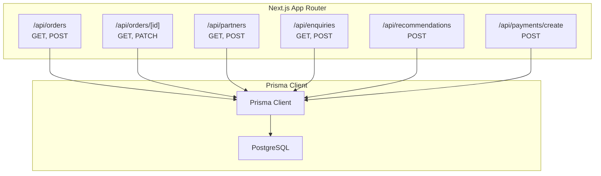
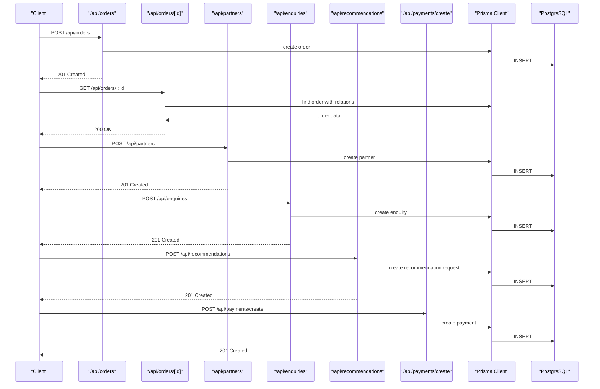
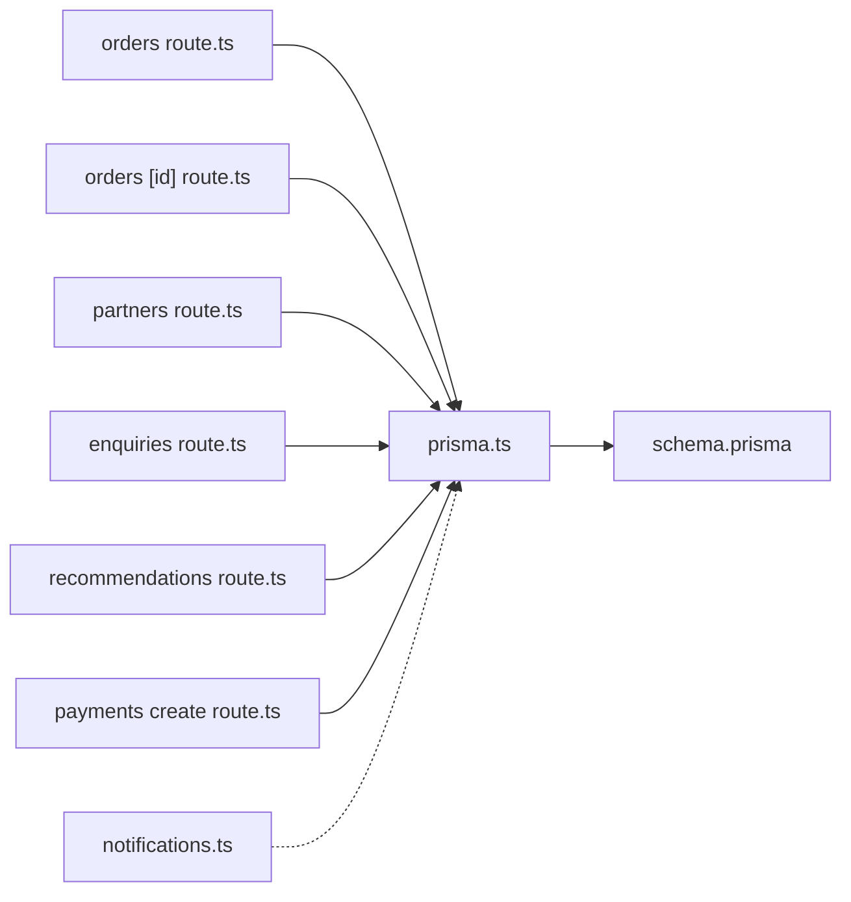

# API Reference

<cite>
**Referenced Files in This Document**
- [orders route.ts](file://app/api/orders/route.ts)
- [orders [id] route.ts](file://app/api/orders/[id]/route.ts)
- [partners route.ts](file://app/api/partners/route.ts)
- [enquiries route.ts](file://app/api/enquiries/route.ts)
- [recommendations route.ts](file://app/api/recommendations/route.ts)
- [payments create route.ts](file://app/api/payments/create/route.ts)
- [AuthContext.tsx](file://components/AuthContext.tsx)
- [prisma.ts](file://lib/prisma.ts)
- [schema.prisma](file://prisma/schema.prisma)
- [notifications.ts](file://lib/notifications.ts)
- [test-backend.js](file://test-backend.js)
- [vercel.json](file://vercel.json)
- [package.json](file://package.json)
</cite>

## Table of Contents
1. [Introduction](#introduction)
2. [Project Structure](#project-structure)
3. [Core Components](#core-components)
4. [Architecture Overview](#architecture-overview)
5. [Detailed Component Analysis](#detailed-component-analysis)
6. [Dependency Analysis](#dependency-analysis)
7. [Performance Considerations](#performance-considerations)
8. [Troubleshooting Guide](#troubleshooting-guide)
9. [Conclusion](#conclusion)
10. [Appendices](#appendices)

## Introduction
This document provides a comprehensive API reference for the Shree Shyam Agency Portal backend. It covers all REST endpoints, including order management, partner management, enquiry handling, AI-powered recommendations, and payment initiation. For each endpoint, you will find HTTP methods, URL patterns, request/response schemas, validation rules, error handling, and practical examples. Authentication and authorization are documented, along with security considerations, rate limiting, and API versioning.

## Project Structure
The API is implemented using Next.js App Router under the app/api directory. Each endpoint is a standalone route handler exporting GET, POST, PATCH, or other HTTP methods. Data persistence uses Prisma ORM against a PostgreSQL database. Authentication is handled client-side via a local storage-based context.



**Diagram sources**
- [orders route.ts:1-68](file://app/api/orders/route.ts#L1-L68)
- [orders [id] route.ts](file://app/api/orders/[id]/route.ts#L1-L54)
- [partners route.ts:1-90](file://app/api/partners/route.ts#L1-L90)
- [enquiries route.ts:1-85](file://app/api/enquiries/route.ts#L1-L85)
- [recommendations route.ts:1-56](file://app/api/recommendations/route.ts#L1-L56)
- [payments create route.ts:1-46](file://app/api/payments/create/route.ts#L1-L46)
- [prisma.ts:1-17](file://lib/prisma.ts#L1-L17)

**Section sources**
- [orders route.ts:1-68](file://app/api/orders/route.ts#L1-L68)
- [orders [id] route.ts](file://app/api/orders/[id]/route.ts#L1-L54)
- [partners route.ts:1-90](file://app/api/partners/route.ts#L1-L90)
- [enquiries route.ts:1-85](file://app/api/enquiries/route.ts#L1-L85)
- [recommendations route.ts:1-56](file://app/api/recommendations/route.ts#L1-L56)
- [payments create route.ts:1-46](file://app/api/payments/create/route.ts#L1-L46)
- [prisma.ts:1-17](file://lib/prisma.ts#L1-L17)

## Core Components
- Authentication and Authorization
  - Client-side authentication state is managed via a React context that stores role and mobile in local storage. Admin-only endpoints should be protected by verifying the role before processing requests.
  - Example usage: [AuthContext.tsx:1-70](file://components/AuthContext.tsx#L1-L70)

- Data Access Layer
  - Prisma Client is initialized globally and used by all API handlers to interact with the database.
  - Example usage: [prisma.ts:1-17](file://lib/prisma.ts#L1-L17)

- Notifications
  - Notification helpers are available for sending emails/SMS when integrating with external providers.
  - Example usage: [notifications.ts:1-27](file://lib/notifications.ts#L1-L27)

**Section sources**
- [AuthContext.tsx:1-70](file://components/AuthContext.tsx#L1-L70)
- [prisma.ts:1-17](file://lib/prisma.ts#L1-L17)
- [notifications.ts:1-27](file://lib/notifications.ts#L1-L27)

## Architecture Overview
The API follows a layered architecture:
- Route Handlers: Define HTTP endpoints and request/response handling.
- Prisma ORM: Provides type-safe database operations.
- Notifications: Placeholder for email/SMS integrations.
- Frontend: Uses the API for order creation, partner onboarding, enquiry submission, recommendations, and payment initiation.



**Diagram sources**
- [orders route.ts:1-68](file://app/api/orders/route.ts#L1-L68)
- [orders [id] route.ts](file://app/api/orders/[id]/route.ts#L1-L54)
- [partners route.ts:1-90](file://app/api/partners/route.ts#L1-L90)
- [enquiries route.ts:1-85](file://app/api/enquiries/route.ts#L1-L85)
- [recommendations route.ts:1-56](file://app/api/recommendations/route.ts#L1-L56)
- [payments create route.ts:1-46](file://app/api/payments/create/route.ts#L1-L46)
- [prisma.ts:1-17](file://lib/prisma.ts#L1-L17)

## Detailed Component Analysis

### Order Management API
- Purpose: Create and track orders for clients and partners.
- Base URL: `/api/orders`
- Methods:
  - GET: List orders (admin dashboard)
  - POST: Create an order from client or partner

#### Endpoint: GET /api/orders
- Description: Returns a list of orders for admin dashboard.
- Authentication: Admin role required.
- Request: None
- Response:
  - Success: 200 OK with an object containing an array of orders.
  - Failure: 500 Internal Server Error with an error message.
- Example curl:
  ```bash
  curl -X GET https://your-app.vercel.app/api/orders
  ```

**Section sources**
- [orders route.ts:1-28](file://app/api/orders/route.ts#L1-L28)

#### Endpoint: POST /api/orders
- Description: Create a new order.
- Authentication: Not enforced in current implementation; consider adding role checks.
- Request body:
  - clientName: string (required)
  - clientMobile: string (required)
  - clientArea: string (required)
  - serviceType: enum (required) — one of PAMPHLET_DISTRIBUTION, FLEX_BANNER, ELECTRIC_POLE_AD, SUNPACK_SHEET, WALL_POSTER, LOCAL_PROMOTION_PACKAGE
  - budget: number (optional)
  - Additional fields may be included; they are preserved in the created order.
- Validation:
  - Missing required fields return 400 Bad Request.
- Response:
  - Success: 201 Created with success flag, message, and order object.
  - Failure: 500 Internal Server Error with an error message.
- Example curl:
  ```bash
  curl -X POST https://your-app.vercel.app/api/orders \
    -H "Content-Type: application/json" \
    -d '{
      "clientName": "John Doe",
      "clientMobile": "1234567890",
      "clientArea": "Pratap Nagar",
      "serviceType": "PAMPHLET_DISTRIBUTION",
      "budget": 5000
    }'
  ```

**Section sources**
- [orders route.ts:30-66](file://app/api/orders/route.ts#L30-L66)

#### Endpoint: GET /api/orders/[id]
- Description: Retrieve a specific order with related data (partner, team boy, payments).
- Authentication: Admin role required.
- Path parameters:
  - id: string (required)
- Response:
  - Success: 200 OK with order object.
  - Not Found: 404 Not Found with an error message.
  - Failure: 500 Internal Server Error with an error message.
- Example curl:
  ```bash
  curl -X GET https://your-app.vercel.app/api/orders/ORDER_ID
  ```

**Section sources**
- [orders [id] route.ts](file://app/api/orders/[id]/route.ts#L11-L27)

#### Endpoint: PATCH /api/orders/[id]
- Description: Update order status and assignees (admin workflow).
- Authentication: Admin role required.
- Path parameters:
  - id: string (required)
- Request body:
  - status: enum (optional) — one of DRAFT, PENDING, ASSIGNED, IN_PROGRESS, COMPLETED, CANCELLED
  - partnerId: string or null (optional)
  - teamBoyId: string or null (optional)
- Response:
  - Success: 200 OK with updated order object.
  - Failure: 400 Bad Request for invalid JSON; 500 Internal Server Error for other errors.
- Example curl:
  ```bash
  curl -X PATCH https://your-app.vercel.app/api/orders/ORDER_ID \
    -H "Content-Type: application/json" \
    -d '{
      "status": "ASSIGNED",
      "partnerId": "PARTNER_ID",
      "teamBoyId": "TEAM_BOY_ID"
    }'
  ```

**Section sources**
- [orders [id] route.ts](file://app/api/orders/[id]/route.ts#L29-L52)

### Partner Management API
- Purpose: Register new partners and list existing ones.
- Base URL: `/api/partners`
- Methods:
  - GET: List partners (basic stub)
  - POST: Create a new partner application

#### Endpoint: GET /api/partners
- Description: Returns a list of partners (stub).
- Authentication: Admin role required.
- Request: None
- Response:
  - Success: 200 OK with an object containing an array of partners.
  - Failure: 500 Internal Server Error with an error message.
- Example curl:
  ```bash
  curl -X GET https://your-app.vercel.app/api/partners
  ```

**Section sources**
- [partners route.ts:1-27](file://app/api/partners/route.ts#L1-L27)

#### Endpoint: POST /api/partners
- Description: Submit a new partner application.
- Authentication: Not enforced in current implementation; consider adding role checks.
- Request body:
  - name: string (required)
  - mobile: string (required)
  - area: string (required)
  - type: enum (required) — one of TEAM_BOY, PRINTING_SHOP, AGENCY
  - extra: string (optional)
- Validation:
  - Missing required fields return 400 Bad Request.
  - Mobile number must be a 10-digit numeric string; otherwise returns 400 Bad Request.
- Response:
  - Success: 201 Created with success flag, message, and partial partner object (id, name, status).
  - Failure: 500 Internal Server Error with an error message.
- Example curl:
  ```bash
  curl -X POST https://your-app.vercel.app/api/partners \
    -H "Content-Type: application/json" \
    -d '{
      "name": "Jane Smith",
      "mobile": "1234567890",
      "area": "Jaipur",
      "type": "TEAM_BOY",
      "extra": "Additional info"
    }'
  ```

**Section sources**
- [partners route.ts:29-88](file://app/api/partners/route.ts#L29-L88)

### Enquiry Management API
- Purpose: Handle client requests and list enquiries (admin).
- Base URL: `/api/enquiries`
- Methods:
  - POST: Submit a new enquiry
  - GET: List enquiries (admin)

#### Endpoint: POST /api/enquiries
- Description: Submit a new client enquiry.
- Authentication: Not enforced in current implementation; consider adding role checks.
- Request body:
  - name: string (required)
  - mobile: string (required)
  - location: string (required)
  - requirement: string (required)
- Validation:
  - Missing required fields return 400 Bad Request.
  - Mobile number must be a 10-digit numeric string; otherwise returns 400 Bad Request.
- Response:
  - Success: 201 Created with success flag, message, and partial enquiry object (id, name, status).
  - Failure: 500 Internal Server Error with an error message.
- Example curl:
  ```bash
  curl -X POST https://your-app.vercel.app/api/enquiries \
    -H "Content-Type: application/json" \
    -d '{
      "name": "Alice Johnson",
      "mobile": "1234567890",
      "location": "Jaipur",
      "requirement": "Need promotional materials"
    }'
  ```

**Section sources**
- [enquiries route.ts:1-65](file://app/api/enquiries/route.ts#L1-L65)

#### Endpoint: GET /api/enquiries
- Description: Returns a basic health check response (admin only).
- Authentication: Admin role required.
- Request: None
- Response:
  - Success: 200 OK with a message and timestamp.
  - Failure: 500 Internal Server Error with an error message.
- Example curl:
  ```bash
  curl -X GET https://your-app.vercel.app/api/enquiries
  ```

**Section sources**
- [enquiries route.ts:67-84](file://app/api/enquiries/route.ts#L67-L84)

### Recommendation API
- Purpose: Provide AI-powered suggestions for services based on area, budget, and goals.
- Base URL: `/api/recommendations`
- Method: POST

#### Endpoint: POST /api/recommendations
- Description: Submit area, budget, and optional goal to receive service suggestions.
- Authentication: Not enforced in current implementation; consider adding role checks.
- Request body:
  - area: string (required)
  - budget: number (required)
  - goal: string (optional)
- Validation:
  - Missing area or budget returns 400 Bad Request.
  - Invalid JSON returns 400 Bad Request.
- Response:
  - Success: 201 Created with recommendation object including area, budget, goal, and a mix of suggested services with shares and comments.
  - Failure: 500 Internal Server Error with an error message.
- Example curl:
  ```bash
  curl -X POST https://your-app.vercel.app/api/recommendations \
    -H "Content-Type: application/json" \
    -d '{
      "area": "Jaipur",
      "budget": 10000,
      "goal": "branding"
    }'
  ```

**Section sources**
- [recommendations route.ts:1-56](file://app/api/recommendations/route.ts#L1-L56)

### Payment Processing API
- Purpose: Initiate payment creation for an order.
- Base URL: `/api/payments/create`
- Method: POST

#### Endpoint: POST /api/payments/create
- Description: Create a payment record and return a placeholder checkout URL for the selected provider.
- Authentication: Not enforced in current implementation; consider adding role checks.
- Request body:
  - orderId: string (required)
  - amount: number (required)
  - provider: enum (required) — one of RAZORPAY, PAYTM, STRIPE, CASH, OTHER
  - userId: string (optional)
- Validation:
  - Missing required fields returns 400 Bad Request.
  - Invalid JSON returns 400 Bad Request.
- Response:
  - Success: 201 Created with payment object and gateway details (provider and checkoutUrl).
  - Failure: 500 Internal Server Error with an error message.
- Example curl:
  ```bash
  curl -X POST https://your-app.vercel.app/api/payments/create \
    -H "Content-Type: application/json" \
    -d '{
      "orderId": "ORDER_ID",
      "amount": 5000,
      "provider": "RAZORPAY",
      "userId": "USER_ID"
    }'
  ```

**Section sources**
- [payments create route.ts:1-46](file://app/api/payments/create/route.ts#L1-L46)

## Dependency Analysis
- Route Handlers depend on Prisma Client for database operations.
- Prisma Client depends on the PostgreSQL datasource configured in the Prisma schema.
- Notifications module provides hooks for future email/SMS integrations.



**Diagram sources**
- [orders route.ts:1-68](file://app/api/orders/route.ts#L1-L68)
- [orders [id] route.ts](file://app/api/orders/[id]/route.ts#L1-L54)
- [partners route.ts:1-90](file://app/api/partners/route.ts#L1-L90)
- [enquiries route.ts:1-85](file://app/api/enquiries/route.ts#L1-L85)
- [recommendations route.ts:1-56](file://app/api/recommendations/route.ts#L1-L56)
- [payments create route.ts:1-46](file://app/api/payments/create/route.ts#L1-L46)
- [prisma.ts:1-17](file://lib/prisma.ts#L1-L17)
- [schema.prisma:1-159](file://prisma/schema.prisma#L1-L159)
- [notifications.ts:1-27](file://lib/notifications.ts#L1-L27)

**Section sources**
- [orders route.ts:1-68](file://app/api/orders/route.ts#L1-L68)
- [orders [id] route.ts](file://app/api/orders/[id]/route.ts#L1-L54)
- [partners route.ts:1-90](file://app/api/partners/route.ts#L1-L90)
- [enquiries route.ts:1-85](file://app/api/enquiries/route.ts#L1-L85)
- [recommendations route.ts:1-56](file://app/api/recommendations/route.ts#L1-L56)
- [payments create route.ts:1-46](file://app/api/payments/create/route.ts#L1-L46)
- [prisma.ts:1-17](file://lib/prisma.ts#L1-L17)
- [schema.prisma:1-159](file://prisma/schema.prisma#L1-L159)
- [notifications.ts:1-27](file://lib/notifications.ts#L1-L27)

## Performance Considerations
- Database Queries
  - Use Prisma’s built-in pagination and filtering for large datasets (e.g., orders, partners, enquiries).
  - Index frequently queried fields (e.g., order publicId, client/mobile, partner area).
- Response Size
  - Avoid returning unnecessary fields; use selective field selection in queries.
- Caching
  - Consider caching static lists (e.g., partner types, service types) to reduce database load.
- Concurrency
  - Ensure idempotent operations for payment creation to prevent duplicate charges.
- Latency
  - Offload heavy computations (e.g., recommendation logic) to background jobs or external services.

[No sources needed since this section provides general guidance]

## Troubleshooting Guide
- Common Status Codes
  - 200 OK: Successful GET/PATCH requests.
  - 201 Created: Successful POST requests for orders, partners, enquiries, recommendations, payments.
  - 400 Bad Request: Validation errors (missing fields, invalid JSON, invalid mobile).
  - 404 Not Found: Order not found by ID.
  - 500 Internal Server Error: Unexpected server errors.
- Error Responses
  - All endpoints return a JSON object with an error property on failure.
- Testing
  - Use the provided test script to validate backend endpoints locally.
  - Example usage: [test-backend.js:1-50](file://test-backend.js#L1-L50)

**Section sources**
- [orders route.ts:21-27](file://app/api/orders/route.ts#L21-L27)
- [orders [id] route.ts](file://app/api/orders/[id]/route.ts#L22-L26)
- [partners route.ts:35-49](file://app/api/partners/route.ts#L35-L49)
- [enquiries route.ts:10-25](file://app/api/enquiries/route.ts#L10-L25)
- [recommendations route.ts:7-19](file://app/api/recommendations/route.ts#L7-L19)
- [payments create route.ts:8-21](file://app/api/payments/create/route.ts#L8-L21)
- [test-backend.js:1-50](file://test-backend.js#L1-L50)

## Conclusion
The Shree Shyam Agency Portal exposes a clean set of REST endpoints for order management, partner onboarding, enquiry handling, recommendations, and payment initiation. While the current implementation focuses on stubs and mock data, the underlying Prisma schema and route handlers provide a solid foundation for production-grade integrations. Security, rate limiting, and admin-only endpoints should be implemented to align with production requirements.

[No sources needed since this section summarizes without analyzing specific files]

## Appendices

### Authentication and Authorization
- Current Implementation
  - Client-side authentication state stored in local storage with role and mobile.
  - Admin-only endpoints should enforce role verification before processing requests.
- Recommendations
  - Add server-side session/cookie-based authentication.
  - Implement role-based access control (RBAC) for admin endpoints.
  - Use HTTPS and secure cookies in production.

**Section sources**
- [AuthContext.tsx:1-70](file://components/AuthContext.tsx#L1-L70)

### Data Models and Enums
- Enumerations and model relationships are defined in the Prisma schema.
- Key enums:
  - UserRole: ADMIN, TEAM_BOY, PRINTING_SHOP, CLIENT
  - PartnerType: TEAM_BOY, PRINTING_SHOP, AGENCY
  - OrderStatus: DRAFT, PENDING, ASSIGNED, IN_PROGRESS, COMPLETED, CANCELLED
  - ServiceType: PAMPHLET_DISTRIBUTION, FLEX_BANNER, ELECTRIC_POLE_AD, SUNPACK_SHEET, WALL_POSTER, LOCAL_PROMOTION_PACKAGE
  - PaymentStatus: CREATED, PENDING, SUCCESS, FAILED, REFUNDED
  - PaymentProvider: RAZORPAY, PAYTM, STRIPE, CASH, OTHER

**Section sources**
- [schema.prisma:10-55](file://prisma/schema.prisma#L10-L55)

### Rate Limiting and Security
- Rate Limiting
  - Implement rate limiting at the edge (e.g., Vercel Functions) to protect endpoints from abuse.
  - Consider per-IP and per-user limits for sensitive endpoints (e.g., payments).
- Security
  - Validate and sanitize all inputs.
  - Use HTTPS in production.
  - Add CORS configuration if serving from multiple origins.
  - Implement input sanitization and output encoding.
- API Versioning
  - Consider adding a version prefix (e.g., /api/v1/) to manage breaking changes.

**Section sources**
- [vercel.json:1-22](file://vercel.json#L1-L22)

### Practical Examples and Client Implementation Guidelines
- Example curl commands are provided for each endpoint.
- Client implementation tips:
  - Use a centralized HTTP client with interceptors for authentication and error handling.
  - Implement retry logic for transient failures.
  - Cache static lists (e.g., service types) to improve UX.
  - Integrate notifications via the notifications module when ready.

**Section sources**
- [test-backend.js:1-50](file://test-backend.js#L1-L50)