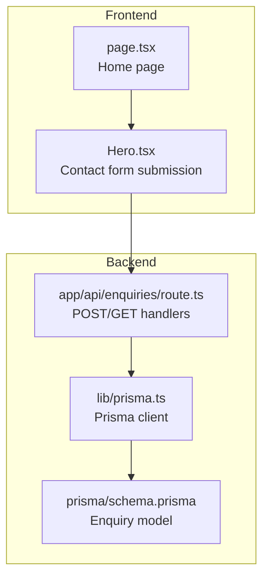
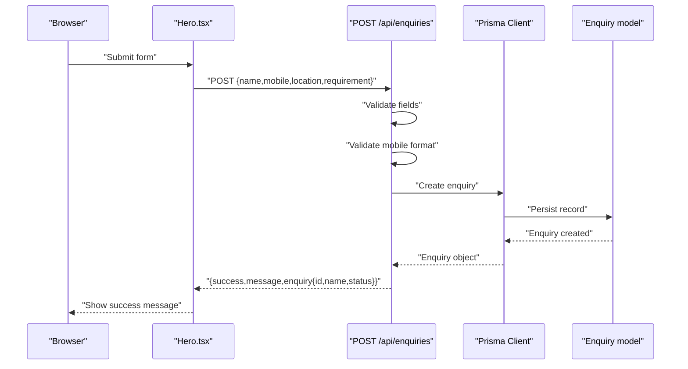
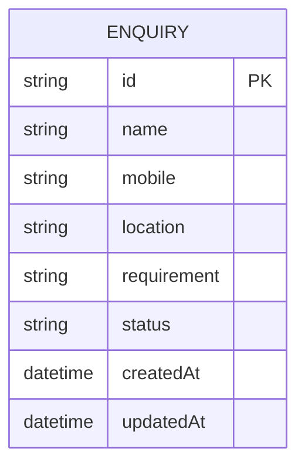
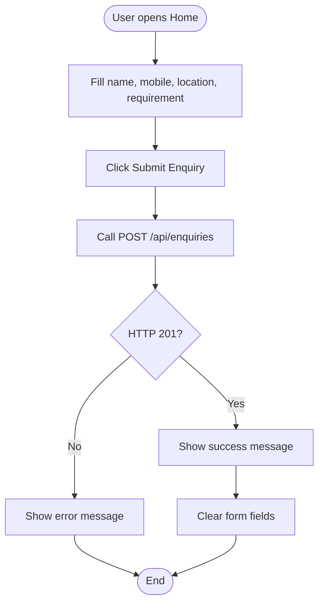
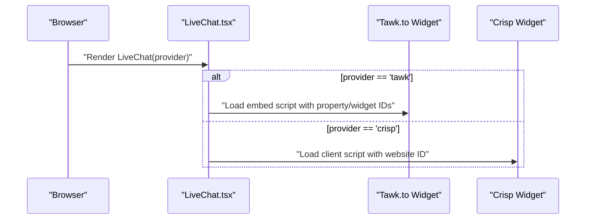
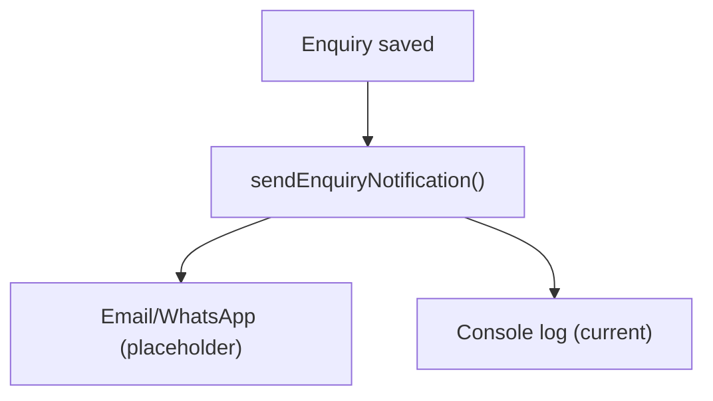
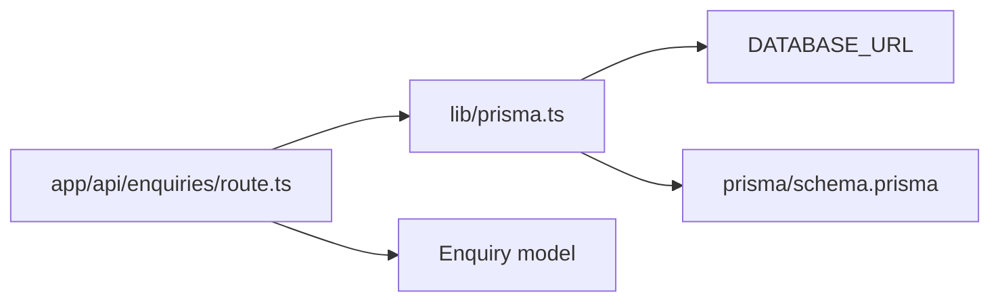

# Enquiries Management API

<cite>
**Referenced Files in This Document**
- [route.ts](file://app/api/enquiries/route.ts)
- [prisma.ts](file://lib/prisma.ts)
- [schema.prisma](file://prisma/schema.prisma)
- [Hero.tsx](file://components/Hero.tsx)
- [LiveChat.tsx](file://components/LiveChat.tsx)
- [notifications.ts](file://lib/notifications.ts)
- [page.tsx](file://app/page.tsx)
- [DEPLOYMENT_READY.md](file://DEPLOYMENT_READY.md)
- [FINAL_DEPLOYMENT_FIX.md](file://FINAL_DEPLOYMENT_FIX.md)
- [FUNCTIONALITY_SUMMARY.md](file://FUNCTIONALITY_SUMMARY.md)
</cite>

## Table of Contents
1. [Introduction](#introduction)
2. [Project Structure](#project-structure)
3. [Core Components](#core-components)
4. [Architecture Overview](#architecture-overview)
5. [Detailed Component Analysis](#detailed-component-analysis)
6. [Dependency Analysis](#dependency-analysis)
7. [Performance Considerations](#performance-considerations)
8. [Troubleshooting Guide](#troubleshooting-guide)
9. [Conclusion](#conclusion)
10. [Appendices](#appendices)

## Introduction
This document provides comprehensive API documentation for the Enquiries Management system. It covers endpoints for submitting client inquiries, retrieving enquiry records, and outlines the data model, validation rules, and integration points with the broader platform. It also documents planned enhancements such as automated responses, assignment workflows, and live chat integration.

## Project Structure
The Enquiries Management system is implemented as a Next.js API route with optional database integration via Prisma ORM. The frontend integrates with the API through a hero form on the home page.

**Diagram sources**
- [route.ts:1-111](file://app/api/enquiries/route.ts#L1-L111)
- [prisma.ts:1-22](file://lib/prisma.ts#L1-L22)
- [schema.prisma:146-158](file://prisma/schema.prisma#L146-L158)
- [Hero.tsx:1-134](file://components/Hero.tsx#L1-L134)
- [page.tsx:1-89](file://app/page.tsx#L1-L89)

**Section sources**
- [route.ts:1-111](file://app/api/enquiries/route.ts#L1-L111)
- [prisma.ts:1-22](file://lib/prisma.ts#L1-L22)
- [schema.prisma:146-158](file://prisma/schema.prisma#L146-L158)
- [Hero.tsx:1-134](file://components/Hero.tsx#L1-L134)
- [page.tsx:1-89](file://app/page.tsx#L1-L89)

## Core Components
- Enquiries API route: Implements POST for submissions and GET for retrieval.
- Prisma integration: Provides database connectivity and fallback to in-memory storage when no database is configured.
- Enquiry data model: Defines fields and indexes for enquiries.
- Frontend integration: Hero form on the home page submits to the API.

Key capabilities:
- Form validation for required fields and mobile number format.
- Dual-mode persistence: database-backed when DATABASE_URL is present; otherwise in-memory storage.
- Basic error handling with appropriate HTTP status codes.

**Section sources**
- [route.ts:8-81](file://app/api/enquiries/route.ts#L8-L81)
- [route.ts:83-110](file://app/api/enquiries/route.ts#L83-L110)
- [prisma.ts:7-20](file://lib/prisma.ts#L7-L20)
- [schema.prisma:146-158](file://prisma/schema.prisma#L146-L158)

## Architecture Overview
The Enquiries API follows a straightforward request-response pattern:
- Client submits an enquiry via the hero form.
- The API validates the payload and persists the record.
- On success, the API returns a structured response with the enquiry ID and status.
- Admins can retrieve all enquiries via the GET endpoint.

**Diagram sources**
- [Hero.tsx:19-42](file://components/Hero.tsx#L19-L42)
- [route.ts:9-81](file://app/api/enquiries/route.ts#L9-L81)
- [prisma.ts:11-16](file://lib/prisma.ts#L11-L16)
- [schema.prisma:146-158](file://prisma/schema.prisma#L146-L158)

## Detailed Component Analysis

### Enquiries API Endpoints
- POST /api/enquiries
  - Purpose: Submit a new client enquiry.
  - Request body fields:
    - name: string (required)
    - mobile: string (required; validated as 10 digits)
    - location: string (required)
    - requirement: string (required)
  - Response:
    - success: boolean
    - message: string
    - enquiry: object containing id, name, status
  - Validation:
    - All fields required.
    - Mobile number must match a 10-digit pattern after removing non-digits.
  - Persistence:
    - If DATABASE_URL is configured, creates an enquiry record with status "PENDING".
    - Otherwise, stores in-memory with a generated ID and timestamps.
  - Notifications:
    - Placeholder for email/WhatsApp notifications is present in code comments.

- GET /api/enquiries
  - Purpose: Retrieve all enquiries (admin-only).
  - Response:
    - Array of enquiries and a timestamp.
  - Persistence:
    - Database-backed when DATABASE_URL is configured.
    - In-memory reverse order when no database is configured.

**Section sources**
- [route.ts:8-81](file://app/api/enquiries/route.ts#L8-L81)
- [route.ts:83-110](file://app/api/enquiries/route.ts#L83-L110)

### Data Model and Schemas
The Enquiry model defines the structure persisted for each enquiry.

- Indexes:
  - mobile: indexed for efficient lookups.
  - status: indexed to support filtering by status.

**Diagram sources**
- [schema.prisma:146-158](file://prisma/schema.prisma#L146-L158)

**Section sources**
- [schema.prisma:146-158](file://prisma/schema.prisma#L146-L158)

### Frontend Integration
The hero form on the home page collects client information and submits to the Enquiries API.

**Diagram sources**
- [Hero.tsx:19-42](file://components/Hero.tsx#L19-L42)
- [page.tsx:1-89](file://app/page.tsx#L1-L89)

**Section sources**
- [Hero.tsx:1-134](file://components/Hero.tsx#L1-L134)
- [page.tsx:1-89](file://app/page.tsx#L1-L89)

### Live Chat Integration
The LiveChat component dynamically injects third-party chat widgets (Tawk.to or Crisp) based on environment variables. While not directly part of the Enquiries API, it complements customer engagement.

**Diagram sources**
- [LiveChat.tsx:12-47](file://components/LiveChat.tsx#L12-L47)

**Section sources**
- [LiveChat.tsx:1-52](file://components/LiveChat.tsx#L1-L52)

### Notification Triggers (Planned)
The code includes a placeholder for sending notifications upon enquiry submission. A centralized notifications module exists for other parts of the system and can be extended for enquiries.

**Section sources**
- [route.ts:62-62](file://app/api/enquiries/route.ts#L62-L62)
- [notifications.ts:1-27](file://lib/notifications.ts#L1-L27)

## Dependency Analysis
- API route depends on:
  - Prisma client initialization and configuration.
  - Environment variable DATABASE_URL to decide persistence mode.
- Prisma client depends on:
  - DATABASE_URL presence to instantiate a client.
  - Global caching in non-production environments.
- Data model depends on:
  - PostgreSQL datasource configuration.
  - Indexes on mobile and status for performance.

**Diagram sources**
- [route.ts:1-2](file://app/api/enquiries/route.ts#L1-L2)
- [prisma.ts:7-20](file://lib/prisma.ts#L7-L20)
- [schema.prisma:5-8](file://prisma/schema.prisma#L5-L8)

**Section sources**
- [route.ts:1-6](file://app/api/enquiries/route.ts#L1-L6)
- [prisma.ts:7-20](file://lib/prisma.ts#L7-L20)
- [schema.prisma:5-8](file://prisma/schema.prisma#L5-L8)

## Performance Considerations
- Database vs. in-memory:
  - When DATABASE_URL is absent, the API falls back to in-memory storage. This is suitable for development but not recommended for production.
- Indexing:
  - The Enquiry model includes indexes on mobile and status, which helps with filtering and lookup performance.
- Validation overhead:
  - Basic client-side and server-side validation keep payload sizes small and reduce downstream processing costs.

[No sources needed since this section provides general guidance]

## Troubleshooting Guide
Common issues and resolutions:
- Missing required fields:
  - Ensure name, mobile, location, and requirement are provided.
  - The API responds with HTTP 400 and an error message if any are missing.
- Invalid mobile number:
  - The API expects a 10-digit number after removing non-digit characters.
  - Non-conforming inputs return HTTP 400 with a validation error message.
- Database connectivity:
  - If DATABASE_URL is not set, the API uses in-memory storage. Confirm environment configuration for production.
- CORS and deployment:
  - The project is designed for Vercel deployment. Ensure the repository contains the fixed Next.js configuration to avoid build failures.

**Section sources**
- [route.ts:15-30](file://app/api/enquiries/route.ts#L15-L30)
- [prisma.ts:7-20](file://lib/prisma.ts#L7-L20)
- [DEPLOYMENT_READY.md:5-21](file://DEPLOYMENT_READY.md#L5-L21)
- [FINAL_DEPLOYMENT_FIX.md:5-81](file://FINAL_DEPLOYMENT_FIX.md#L5-L81)

## Conclusion
The Enquiries Management API provides a robust foundation for capturing client inquiries with built-in validation and flexible persistence. It integrates seamlessly with the frontend hero form and can be extended to support automated responses, assignment workflows, and live chat integration. Future enhancements include connecting real notification providers, adding admin dashboards, and enabling advanced enquiry categorization and priority handling.

[No sources needed since this section summarizes without analyzing specific files]

## Appendices

### API Reference

- POST /api/enquiries
  - Description: Submit a new client enquiry.
  - Request body:
    - name: string (required)
    - mobile: string (required; 10 digits)
    - location: string (required)
    - requirement: string (required)
  - Success response:
    - HTTP 201 Created with success, message, and enquiry object.
  - Error responses:
    - HTTP 400 Bad Request for validation failures.
    - HTTP 500 Internal Server Error for unexpected errors.

- GET /api/enquiries
  - Description: Retrieve all enquiries (admin-only).
  - Success response:
    - HTTP 200 OK with enquiries array and timestamp.
  - Error response:
    - HTTP 500 Internal Server Error for unexpected errors.

**Section sources**
- [route.ts:8-81](file://app/api/enquiries/route.ts#L8-L81)
- [route.ts:83-110](file://app/api/enquiries/route.ts#L83-L110)

### Data Validation Rules
- Required fields: name, mobile, location, requirement.
- Mobile validation: Must match a 10-digit pattern after removing non-digit characters.
- Status defaults to "PENDING" upon creation.

**Section sources**
- [route.ts:15-30](file://app/api/enquiries/route.ts#L15-L30)
- [schema.prisma:152-152](file://prisma/schema.prisma#L152-L152)

### Planned Enhancements
- Automated responses:
  - Integrate email and WhatsApp notification services.
- Assignment workflows:
  - Extend API to support updating status and assigning team members.
- Live chat integration:
  - Coordinate with the LiveChat component for seamless customer engagement.
- Admin dashboard:
  - Provide a UI for managing enquiries and tracking statuses.

**Section sources**
- [route.ts:62-62](file://app/api/enquiries/route.ts#L62-L62)
- [LiveChat.tsx:1-52](file://components/LiveChat.tsx#L1-L52)
- [FINAL_DEPLOYMENT_FIX.md:127-139](file://FINAL_DEPLOYMENT_FIX.md#L127-L139)