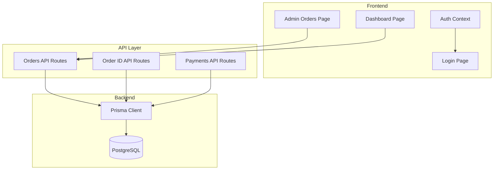
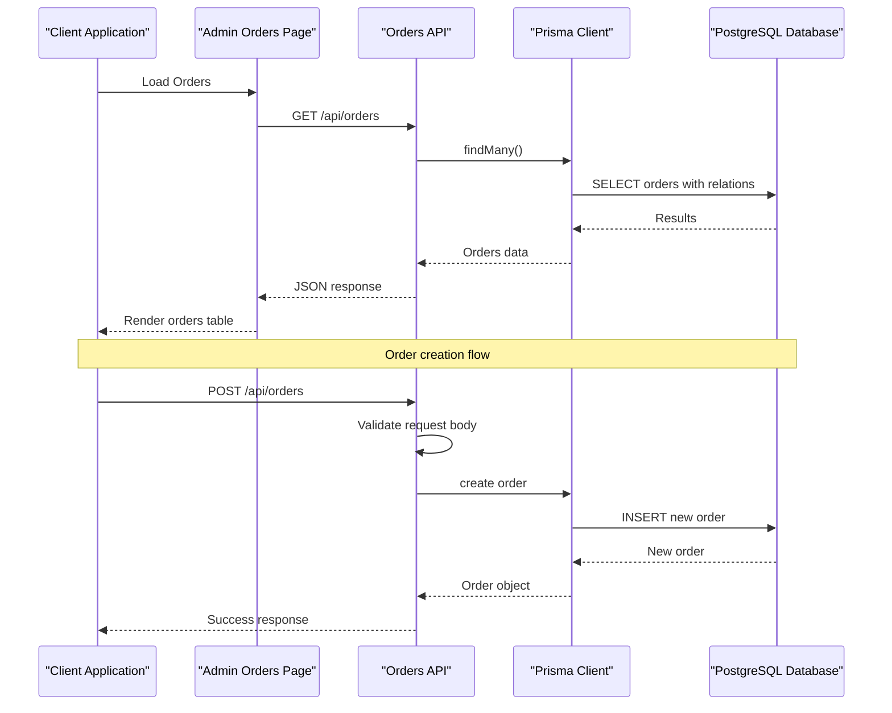
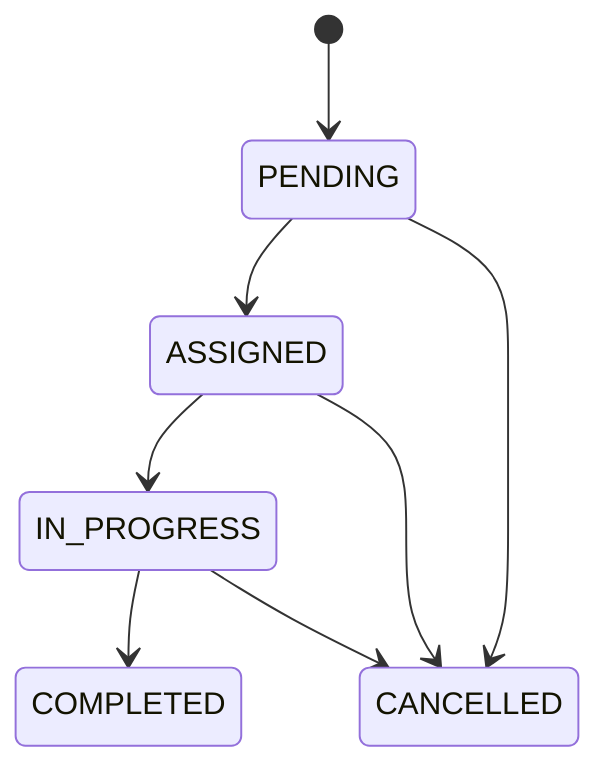
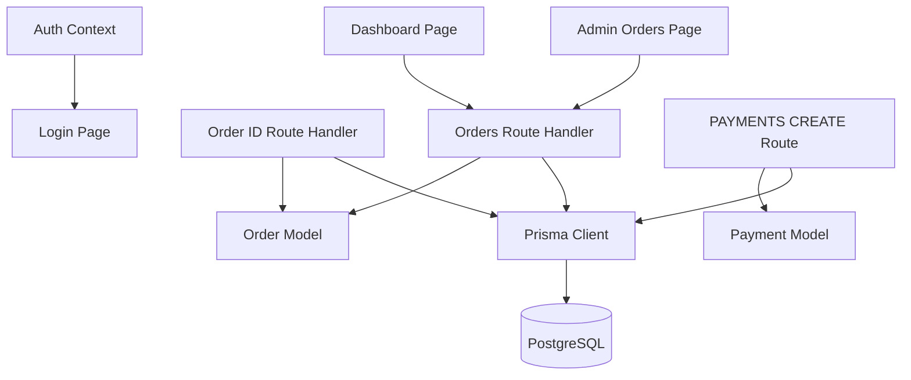
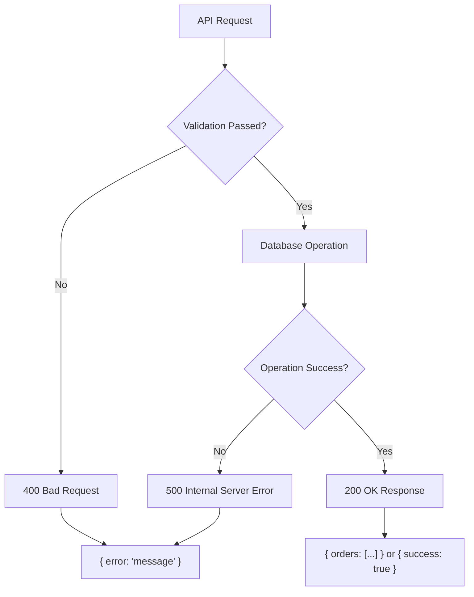

# Orders Management API

<cite>
**Referenced Files in This Document**
- [orders/route.ts](file://app/api/orders/route.ts)
- [orders/[id]/route.ts](file://app/api/orders/[id]/route.ts)
- [prisma.ts](file://lib/prisma.ts)
- [schema.prisma](file://prisma/schema.prisma)
- [admin-orders-page.tsx](file://app/admin/orders/page.tsx)
- [dashboard-page.tsx](file://app/dashboard/page.tsx)
- [auth-context.tsx](file://components/AuthContext.tsx)
- [login-page.tsx](file://app/login/page.tsx)
- [payments-create-route.ts](file://app/api/payments/create/route.ts)
- [vercel.json](file://vercel.json)
- [deployment.md](file://DEPLOYMENT.md)
</cite>

## Table of Contents
1. [Introduction](#introduction)
2. [Project Structure](#project-structure)
3. [Core Components](#core-components)
4. [Architecture Overview](#architecture-overview)
5. [Detailed Component Analysis](#detailed-component-analysis)
6. [Dependency Analysis](#dependency-analysis)
7. [Performance Considerations](#performance-considerations)
8. [Troubleshooting Guide](#troubleshooting-guide)
9. [Conclusion](#conclusion)

## Introduction
This document provides comprehensive API documentation for the Orders Management system. It covers the GET /api/orders endpoint for retrieving order lists with pagination and filtering capabilities, and the POST /api/orders endpoint for creating new orders from clients and partners. The documentation includes detailed request/response schemas with field descriptions, validation rules, error handling, order status management, client information requirements, service type enumeration, and budget validation. Practical examples with sample requests and responses are provided, including error scenarios and edge cases. Authentication requirements, rate limiting considerations, and integration patterns with the dashboard system are addressed.

## Project Structure
The Orders Management API is implemented as part of a Next.js application using the App Router. The API endpoints are located under app/api/orders, with supporting database operations handled by Prisma ORM. The frontend dashboard pages integrate with these APIs to display order information and enable administrative workflows.



**Diagram sources**
- [orders/route.ts:1-90](file://app/api/orders/route.ts#L1-L90)
- [orders/[id]/route.ts](file://app/api/orders/[id]/route.ts#L1-L54)
- [prisma.ts:1-17](file://lib/prisma.ts#L1-L17)

**Section sources**
- [orders/route.ts:1-90](file://app/api/orders/route.ts#L1-L90)
- [orders/[id]/route.ts](file://app/api/orders/[id]/route.ts#L1-L54)
- [prisma.ts:1-17](file://lib/prisma.ts#L1-L17)

## Core Components
The Orders Management system consists of several key components:

### API Endpoints
- **GET /api/orders**: Retrieves all orders with client, partner, and team boy information
- **POST /api/orders**: Creates new orders from client submissions
- **GET /api/orders/[id]**: Retrieves individual order details with related entities
- **PATCH /api/orders/[id]**: Updates order status and assignees (admin workflow)

### Database Schema
The system uses Prisma-generated enums for service types, order statuses, and partner types. The Order model includes client information, service type, status tracking, budget fields, and relationship fields for partners and team boys.

### Frontend Integration
The admin dashboard page fetches orders from the API and displays them in a table format. The dashboard page provides role-based views for different user types (admin, team boy, printing shop).

**Section sources**
- [orders/route.ts:5-25](file://app/api/orders/route.ts#L5-L25)
- [orders/[id]/route.ts](file://app/api/orders/[id]/route.ts#L11-L27)
- [schema.prisma:23-39](file://prisma/schema.prisma#L23-L39)
- [admin-orders-page.tsx:16-39](file://app/admin/orders/page.tsx#L16-L39)

## Architecture Overview
The Orders Management API follows a layered architecture with clear separation between presentation, business logic, and data access layers.



**Diagram sources**
- [orders/route.ts:6-25](file://app/api/orders/route.ts#L6-L25)
- [orders/route.ts:28-88](file://app/api/orders/route.ts#L28-L88)
- [prisma.ts:1-17](file://lib/prisma.ts#L1-L17)

## Detailed Component Analysis

### GET /api/orders Endpoint
The GET endpoint retrieves all orders sorted by creation date with included related entities.

#### Request
- **Method**: GET
- **URL**: `/api/orders`
- **Authentication**: Not explicitly required in current implementation
- **Query Parameters**: None (pagination/filtering not implemented)

#### Response
- **Success**: 200 OK with orders array
- **Error**: 500 Internal Server Error on database failure

#### Response Schema
```json
{
  "orders": [
    {
      "id": "string",
      "publicId": "string",
      "clientName": "string",
      "clientMobile": "string", 
      "clientArea": "string",
      "serviceType": "string",
      "status": "string",
      "createdAt": "string (ISO 8601)",
      "client": {
        "id": "string",
        "name": "string",
        "mobile": "string"
      },
      "partner": {
        "id": "string",
        "type": "string",
        "area": "string"
      },
      "teamBoy": {
        "id": "string",
        "type": "string",
        "area": "string"
      }
    }
  ]
}
```

#### Implementation Details
- Sorts orders by createdAt descending
- Includes client, partner, and teamBoy relations
- Returns all orders without pagination

**Section sources**
- [orders/route.ts:6-25](file://app/api/orders/route.ts#L6-L25)

### POST /api/orders Endpoint
The POST endpoint creates new orders from client submissions with validation and automatic status assignment.

#### Request
- **Method**: POST
- **URL**: `/api/orders`
- **Content-Type**: application/json
- **Required Fields**:
  - `clientName`: string (non-empty)
  - `clientMobile`: string (non-empty)
  - `clientArea`: string (non-empty)
  - `serviceType`: enum value from ServiceType

#### Validation Rules
- All required fields must be present
- `serviceType` must be a valid enum value
- `budget` field is optional and converted to decimal if provided

#### Response
- **Success**: 200 OK with success message and order details
- **Validation Error**: 400 Bad Request for missing fields or invalid service type
- **Server Error**: 500 Internal Server Error on database failure

#### Response Schema
```json
{
  "success": true,
  "message": "string",
  "order": {
    "id": "string",
    "publicId": "string",
    "clientName": "string",
    "status": "string"
  }
}
```

#### Implementation Details
- Generates sequential public IDs (SSA-1001, SSA-1002, ...)
- Sets initial status to PENDING
- Converts budget to decimal if provided
- Returns minimal order information for client feedback

#### Error Scenarios
- Missing required fields: Returns 400 with "Missing required fields"
- Invalid service type: Returns 400 with "Invalid service type"
- Database errors: Returns 500 with "Failed to create order"

**Section sources**
- [orders/route.ts:28-88](file://app/api/orders/route.ts#L28-L88)

### Order Status Management
The system uses a comprehensive status lifecycle managed through the OrderStatus enum.

#### Status Values
- `DRAFT`: Initial state for internal drafts
- `PENDING`: New orders awaiting assignment
- `ASSIGNED`: Assigned to partner/team boy
- `IN_PROGRESS`: Work in progress
- `COMPLETED`: Work completed and approved
- `CANCELLED`: Order cancelled

#### Status Transitions


**Diagram sources**
- [schema.prisma:23-30](file://prisma/schema.prisma#L23-L30)

**Section sources**
- [schema.prisma:23-30](file://prisma/schema.prisma#L23-L30)

### Service Type Enumeration
The system defines specific service types for order categorization.

#### Available Service Types
- `PAMPHLET_DISTRIBUTION`
- `FLEX_BANNER`
- `ELECTRIC_POLE_AD`
- `SUNPACK_SHEET`
- `WALL_POSTER`
- `LOCAL_PROMOTION_PACKAGE`

#### Usage
- Service types are validated against enum values
- Used for order categorization and reporting
- Integrated with payment workflows

**Section sources**
- [schema.prisma:32-39](file://prisma/schema.prisma#L32-L39)

### Client Information Requirements
Client information is captured during order creation with specific validation rules.

#### Required Fields
- `clientName`: Must be provided and non-empty
- `clientMobile`: Must be provided and non-empty  
- `clientArea`: Must be provided and non-empty
- `serviceType`: Must be a valid enum value

#### Optional Fields
- `budget`: Decimal value representing client's budget
- `publicId`: Auto-generated sequential identifier

#### Data Types and Constraints
- Mobile numbers should follow Indian mobile number format
- Area names should be city/locality names
- Budget values are stored as decimals with precision

**Section sources**
- [orders/route.ts:33-46](file://app/api/orders/route.ts#L33-L46)

### Budget Validation
Budget validation follows specific rules for financial data handling.

#### Validation Rules
- Budget is optional (`null` allowed)
- When provided, converted to decimal using `parseFloat()`
- Stored as decimal in database with appropriate precision
- No minimum/maximum limits enforced

#### Data Storage
- Budget field stored as decimal in database
- Allows for precise financial calculations
- Supports fractional amounts for budget estimates

**Section sources**
- [orders/route.ts:64-65](file://app/api/orders/route.ts#L64-L65)
- [schema.prisma:100-102](file://prisma/schema.prisma#L100-L102)

### GET /api/orders/[id] Endpoint
Retrieves individual order details with comprehensive related entity information.

#### Request
- **Method**: GET
- **URL**: `/api/orders/[id]`
- **Path Parameter**: `id` - Order identifier

#### Response
- **Success**: 200 OK with order details
- **Not Found**: 404 Not Found for non-existent orders
- **Server Error**: 500 Internal Server Error on database failure

#### Included Entities
- Partner information (if assigned)
- Team boy information (if assigned)  
- Payment history (if any)

**Section sources**
- [orders/[id]/route.ts](file://app/api/orders/[id]/route.ts#L12-L27)

### PATCH /api/orders/[id] Endpoint
Updates order status and assignees for administrative workflows.

#### Request
- **Method**: PATCH
- **URL**: `/api/orders/[id]`
- **Content-Type**: application/json
- **Allowed Fields**:
  - `status`: New order status
  - `partnerId`: Partner assignment (nullable)
  - `teamBoyId`: Team boy assignment (nullable)

#### Response
- **Success**: 200 OK with updated order
- **Validation Error**: 400 Bad Request for invalid JSON
- **Not Found**: 404 Not Found for non-existent orders

**Section sources**
- [orders/[id]/route.ts](file://app/api/orders/[id]/route.ts#L29-L52)

## Dependency Analysis
The Orders Management system has clear dependency relationships between components.



**Diagram sources**
- [orders/route.ts:1-3](file://app/api/orders/route.ts#L1-L3)
- [orders/[id]/route.ts](file://app/api/orders/[id]/route.ts#L1-L3)
- [prisma.ts:1-1](file://lib/prisma.ts#L1-L1)
- [admin-orders-page.tsx](file://app/admin/orders/page.tsx#L25)
- [dashboard-page.tsx](file://app/dashboard/page.tsx#L7)

### External Dependencies
- **@prisma/client**: Database ORM for type-safe operations
- **Next.js**: Web framework for API routes and SSR
- **React**: Frontend framework for dashboard components

### Internal Dependencies
- **Prisma Client**: Centralized database access
- **Auth Context**: User authentication state management
- **Environment Variables**: Database connection and configuration

**Section sources**
- [orders/route.ts:1-3](file://app/api/orders/route.ts#L1-L3)
- [orders/[id]/route.ts](file://app/api/orders/[id]/route.ts#L1-L3)
- [prisma.ts:1-17](file://lib/prisma.ts#L1-L17)

## Performance Considerations
Several performance aspects should be considered for the Orders Management API:

### Current Limitations
- **No Pagination**: GET /api/orders returns all orders without pagination
- **No Filtering**: No query parameters for filtering orders
- **No Sorting Options**: Fixed sorting by creation date only
- **Large Payloads**: Including client, partner, and teamBoy relations may increase response size

### Recommended Optimizations
- **Pagination**: Implement limit/offset or cursor-based pagination
- **Filtering**: Add query parameters for status, date ranges, and service types
- **Selective Fields**: Allow clients to specify required fields
- **Caching**: Implement caching for frequently accessed order lists
- **Indexing**: Ensure proper database indexing on frequently queried fields

### Database Considerations
- **Connection Pooling**: Prisma manages connection pooling automatically
- **Query Optimization**: Consider separate endpoints for different use cases
- **Relationship Loading**: Optimize includes to reduce N+1 query problems

## Troubleshooting Guide

### Common Issues and Solutions

#### Authentication Issues
- **Problem**: API requires authentication
- **Solution**: Implement JWT-based authentication middleware
- **Current State**: API endpoints do not enforce authentication

#### Rate Limiting
- **Problem**: No rate limiting on API endpoints
- **Solution**: Implement rate limiting middleware
- **Current State**: No rate limiting configured

#### Database Connection Problems
- **Problem**: Prisma client initialization failures
- **Solution**: Check DATABASE_URL environment variable
- **Current State**: Prisma client configured with logging

#### Order Creation Failures
- **Problem**: Invalid service type validation
- **Solution**: Verify service type enum values match client requests
- **Current State**: Service type validation implemented

#### Frontend Integration Issues
- **Problem**: Admin orders page not loading data
- **Solution**: Check network connectivity and API endpoint accessibility
- **Current State**: Admin page makes direct API calls

### Error Response Patterns
The API follows consistent error response patterns:



**Diagram sources**
- [orders/route.ts:18-24](file://app/api/orders/route.ts#L18-L24)
- [orders/route.ts:81-87](file://app/api/orders/route.ts#L81-L87)

**Section sources**
- [orders/route.ts:18-24](file://app/api/orders/route.ts#L18-L24)
- [orders/route.ts:81-87](file://app/api/orders/route.ts#L81-L87)

## Conclusion
The Orders Management API provides a solid foundation for order handling with clear endpoints for listing and creating orders. The system uses Prisma for type-safe database operations and follows Next.js conventions for API route implementation. Key areas for improvement include adding pagination, filtering, authentication, and rate limiting. The current implementation supports basic order management workflows and integrates well with the dashboard system for administrative oversight.

The API demonstrates good separation of concerns with clear validation rules, comprehensive error handling, and straightforward data models. Future enhancements should focus on scalability improvements and security hardening while maintaining the simplicity and reliability of the current design.