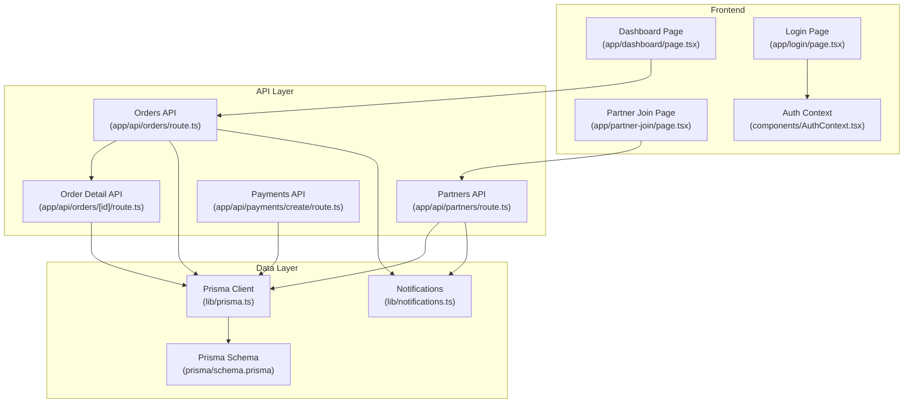
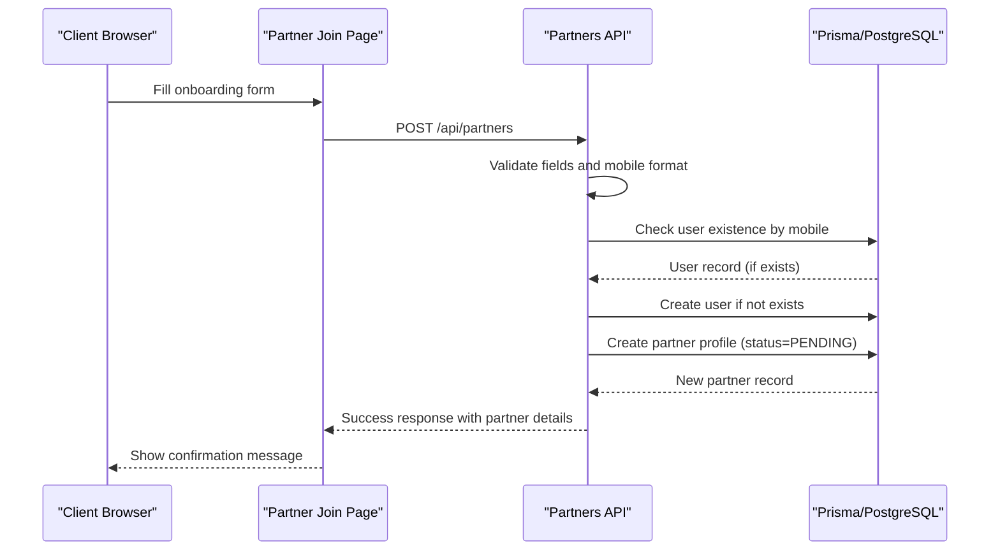
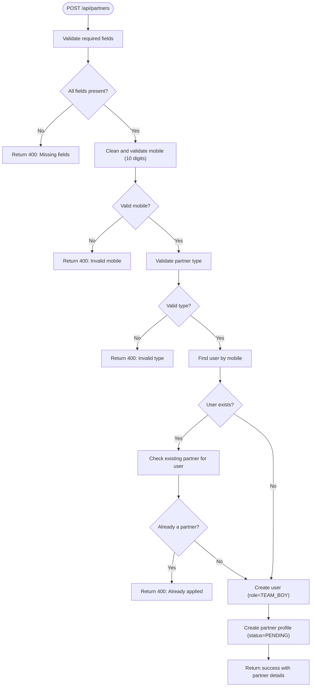
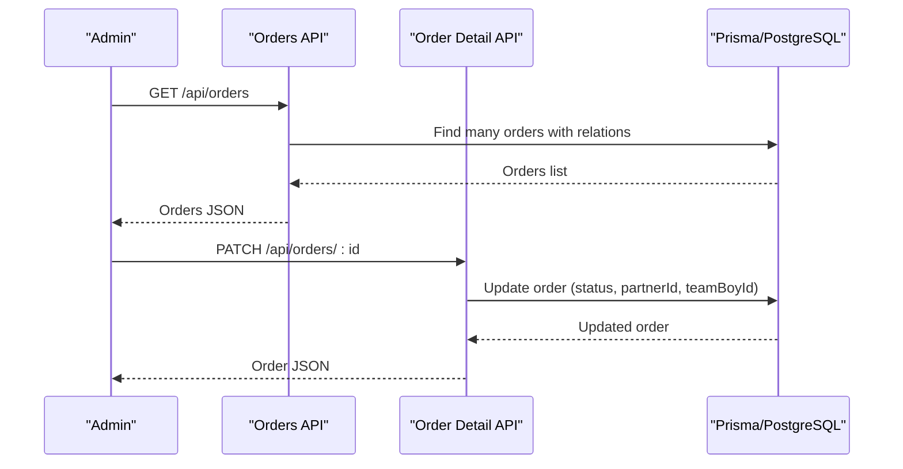
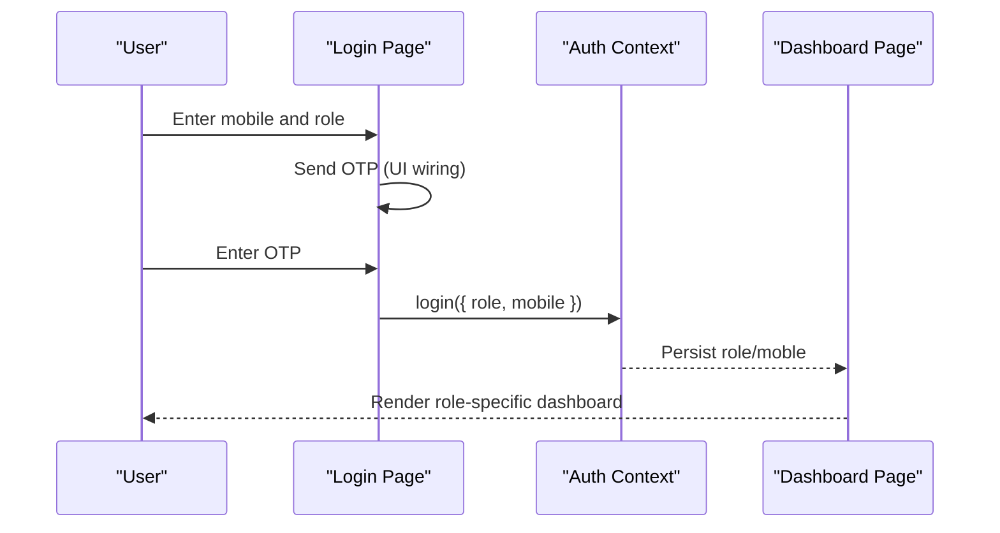
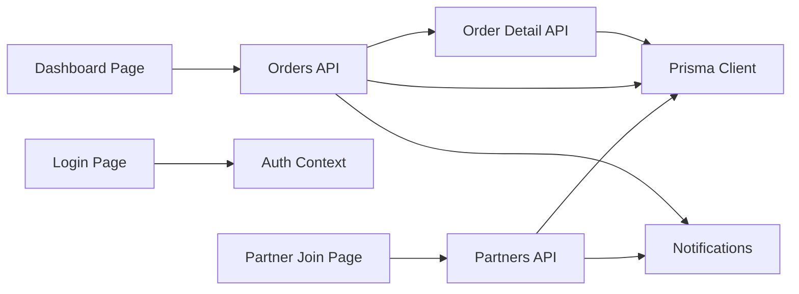

# Partners Management API

<cite>
**Referenced Files in This Document**
- [route.ts](file://app/api/partners/route.ts)
- [schema.prisma](file://prisma/schema.prisma)
- [page.tsx](file://app/partner-join/page.tsx)
- [page.tsx](file://app/dashboard/page.tsx)
- [page.tsx](file://app/login/page.tsx)
- [AuthContext.tsx](file://components/AuthContext.tsx)
- [route.ts](file://app/api/orders/route.ts)
- [route.ts](file://app/api/orders/[id]/route.ts)
- [route.ts](file://app/api/payments/create/route.ts)
- [prisma.ts](file://lib/prisma.ts)
- [notifications.ts](file://lib/notifications.ts)
</cite>

## Table of Contents
1. [Introduction](#introduction)
2. [Project Structure](#project-structure)
3. [Core Components](#core-components)
4. [Architecture Overview](#architecture-overview)
5. [Detailed Component Analysis](#detailed-component-analysis)
6. [Dependency Analysis](#dependency-analysis)
7. [Performance Considerations](#performance-considerations)
8. [Troubleshooting Guide](#troubleshooting-guide)
9. [Conclusion](#conclusion)

## Introduction
This document provides comprehensive API documentation for the Partners Management system. It covers partner registration, profile management, approval workflows, and commission tracking. It also documents partner types, required documentation, approval criteria, and commission calculation methods. Examples of complete onboarding workflows, profile update operations, and status change scenarios are included, along with security considerations for sensitive partner data and integration points with the printing partner portal.

## Project Structure
The Partners Management system is implemented as a Next.js API with Prisma ORM and a PostgreSQL database. Key components include:
- API endpoints for partner registration and listing
- Frontend pages for partner onboarding and portal dashboards
- Authentication context for role-based access
- Order management and payment creation endpoints
- Notification utilities for email/SMS triggers

**Diagram sources**
- [route.ts:1-173](file://app/api/partners/route.ts#L1-L173)
- [route.ts:1-129](file://app/api/orders/route.ts#L1-L129)
- [route.ts:1-53](file://app/api/orders/[id]/route.ts#L1-L53)
- [route.ts:1-45](file://app/api/payments/create/route.ts#L1-L45)
- [prisma.ts:1-22](file://lib/prisma.ts#L1-L22)
- [schema.prisma:1-173](file://prisma/schema.prisma#L1-L173)
- [page.tsx:1-164](file://app/partner-join/page.tsx#L1-L164)
- [page.tsx:1-257](file://app/dashboard/page.tsx#L1-L257)
- [page.tsx:1-127](file://app/login/page.tsx#L1-L127)
- [AuthContext.tsx:1-70](file://components/AuthContext.tsx#L1-L70)
- [notifications.ts:1-27](file://lib/notifications.ts#L1-L27)

**Section sources**
- [route.ts:1-173](file://app/api/partners/route.ts#L1-L173)
- [prisma.ts:1-22](file://lib/prisma.ts#L1-L22)
- [schema.prisma:1-173](file://prisma/schema.prisma#L1-L173)

## Core Components
- Partners API: Handles partner registration and listing with validation and duplicate checks.
- Orders API: Manages order lifecycle for clients and admin assignment.
- Payments API: Creates payment records and returns gateway placeholders for real integrations.
- Notifications: Centralized hooks for email/SMS triggers (currently logging to console).
- Authentication Context: Role-based access control for dashboards.

**Section sources**
- [route.ts:1-173](file://app/api/partners/route.ts#L1-L173)
- [route.ts:1-129](file://app/api/orders/route.ts#L1-L129)
- [route.ts:1-45](file://app/api/payments/create/route.ts#L1-L45)
- [notifications.ts:1-27](file://lib/notifications.ts#L1-L27)
- [AuthContext.tsx:1-70](file://components/AuthContext.tsx#L1-L70)

## Architecture Overview
The system follows a layered architecture:
- Presentation: Next.js pages for partner join, login, and dashboard.
- API: Route handlers implementing REST endpoints for partners, orders, and payments.
- Data Access: Prisma client interacting with PostgreSQL schema.
- Notifications: Pluggable notification utilities for email/SMS.

**Diagram sources**
- [page.tsx:15-42](file://app/partner-join/page.tsx#L15-L42)
- [route.ts:44-172](file://app/api/partners/route.ts#L44-L172)
- [prisma.ts:1-22](file://lib/prisma.ts#L1-L22)
- [schema.prisma:57-89](file://prisma/schema.prisma#L57-L89)

## Detailed Component Analysis

### Partners API
Endpoints:
- GET /api/partners: Lists all partners with associated user details.
- POST /api/partners: Registers a new partner application.

Validation and processing:
- Required fields: name, mobile, type, area.
- Mobile validation: 10-digit numeric format.
- Partner type validation: TEAM_BOY, PRINTING_SHOP, AGENCY.
- Duplicate prevention: Checks existing user and partner records.
- Default status: PENDING for new applications.

Response schemas:
- Success response includes application details.
- Error responses return appropriate HTTP status codes.

**Diagram sources**
- [route.ts:44-172](file://app/api/partners/route.ts#L44-L172)

**Section sources**
- [route.ts:1-173](file://app/api/partners/route.ts#L1-L173)
- [schema.prisma:73-89](file://prisma/schema.prisma#L73-L89)

### Orders API
Endpoints:
- GET /api/orders: Lists orders for admin dashboard with client, partner, and team boy details.
- POST /api/orders: Creates a new order from client submission.
- PATCH /api/orders/[id]: Updates order status and assignees (admin workflow).

Order lifecycle:
- Creation generates a unique publicId (e.g., SSA-1001).
- Service types validated against predefined enums.
- Status defaults to PENDING upon creation.

**Diagram sources**
- [route.ts:10-129](file://app/api/orders/route.ts#L10-L129)
- [route.ts:11-52](file://app/api/orders/[id]/route.ts#L11-L52)
- [schema.prisma:91-123](file://prisma/schema.prisma#L91-L123)

**Section sources**
- [route.ts:1-129](file://app/api/orders/route.ts#L1-L129)
- [route.ts:1-53](file://app/api/orders/[id]/route.ts#L1-L53)
- [schema.prisma:91-123](file://prisma/schema.prisma#L91-L123)

### Payments API
Endpoint:
- POST /api/payments/create: Creates a payment record with provider and optional user association.

Gateway integration:
- Returns a placeholder checkout URL for demonstration.
- In production, integrate with Razorpay/Paytm/Stripe SDKs.

**Section sources**
- [route.ts:1-45](file://app/api/payments/create/route.ts#L1-L45)

### Notifications
Centralized notification utilities:
- sendPartnerApplicationEmail: Logs partner application events.
- sendOrderConfirmation: Logs order confirmation events.
- sendOrderStatusUpdate: Logs order status change events.

Note: These are placeholders for email/SMS providers and currently log to console.

**Section sources**
- [notifications.ts:1-27](file://lib/notifications.ts#L1-L27)

### Authentication and Portal Access
- Login Page: Supports Admin, Team Boy, and Printing Shop roles with mobile + OTP flow.
- Auth Context: Stores role and mobile in localStorage for session persistence.
- Dashboard: Role-based views with stats, actions, and reporting.

**Diagram sources**
- [page.tsx:1-127](file://app/login/page.tsx#L1-L127)
- [AuthContext.tsx:1-70](file://components/AuthContext.tsx#L1-L70)
- [page.tsx:1-38](file://app/dashboard/page.tsx#L1-L38)

**Section sources**
- [page.tsx:1-127](file://app/login/page.tsx#L1-L127)
- [AuthContext.tsx:1-70](file://components/AuthContext.tsx#L1-L70)
- [page.tsx:1-38](file://app/dashboard/page.tsx#L1-L38)

## Dependency Analysis
- API endpoints depend on Prisma client for database operations.
- Frontend pages consume API endpoints and manage UI state.
- Notifications are decoupled and can be integrated with external services.
- Authentication context provides role-based routing and UI rendering.

**Diagram sources**
- [page.tsx:1-164](file://app/partner-join/page.tsx#L1-L164)
- [page.tsx:1-127](file://app/login/page.tsx#L1-L127)
- [page.tsx:1-257](file://app/dashboard/page.tsx#L1-L257)
- [route.ts:1-173](file://app/api/partners/route.ts#L1-L173)
- [route.ts:1-129](file://app/api/orders/route.ts#L1-L129)
- [route.ts:1-53](file://app/api/orders/[id]/route.ts#L1-L53)
- [prisma.ts:1-22](file://lib/prisma.ts#L1-L22)
- [notifications.ts:1-27](file://lib/notifications.ts#L1-L27)

**Section sources**
- [prisma.ts:1-22](file://lib/prisma.ts#L1-L22)
- [schema.prisma:1-173](file://prisma/schema.prisma#L1-L173)

## Performance Considerations
- Database connectivity: The Prisma client is conditionally initialized only when DATABASE_URL is present, enabling development mode with in-memory fallbacks.
- Request validation: Early validation reduces unnecessary database calls and improves error feedback speed.
- Pagination and sorting: Use database-side ordering and limit clauses for large datasets in future enhancements.

[No sources needed since this section provides general guidance]

## Troubleshooting Guide
Common issues and resolutions:
- Missing required fields in partner application: Ensure name, mobile, type, and area are provided.
- Invalid mobile number: Confirm 10-digit numeric format.
- Invalid partner type: Use TEAM_BOY, PRINTING_SHOP, or AGENCY.
- Duplicate application: Users can submit only one partner application per mobile number.
- Database connectivity: Verify DATABASE_URL environment variable; otherwise, endpoints fall back to in-memory storage.

**Section sources**
- [route.ts:48-95](file://app/api/partners/route.ts#L48-L95)
- [prisma.ts:7-16](file://lib/prisma.ts#L7-L16)

## Conclusion
The Partners Management API provides a solid foundation for partner onboarding, order management, and payment processing. It supports role-based dashboards and includes placeholders for notifications and gateway integrations. The schema defines partner profiles with commission tracking fields, enabling future commission calculation workflows. Extending the system with real notification providers and admin approval endpoints will complete the production-ready solution.