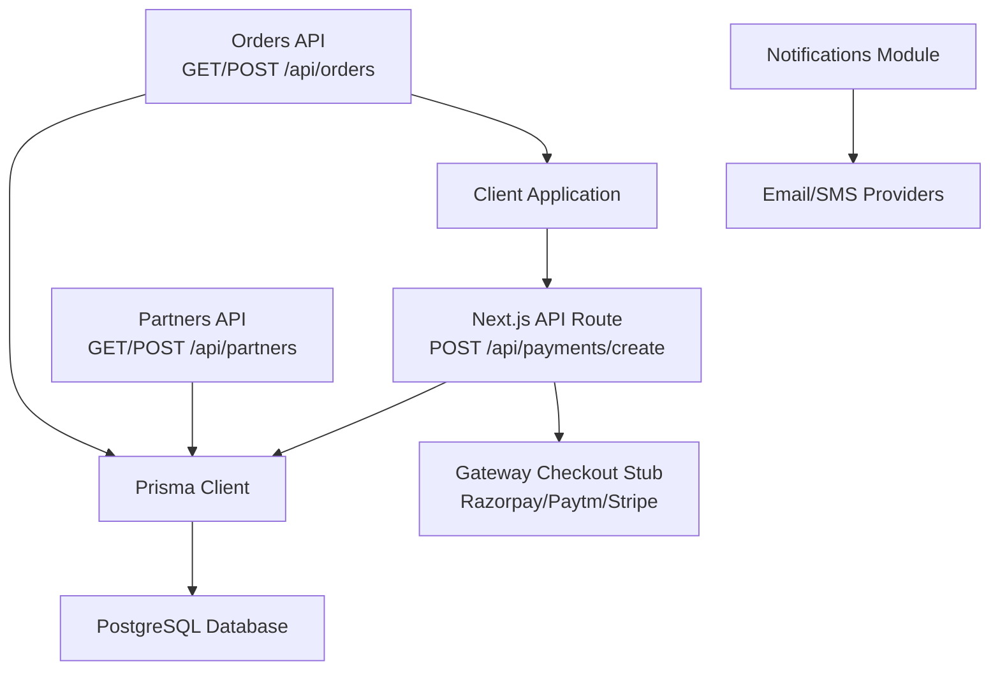
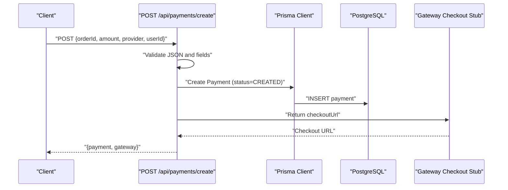
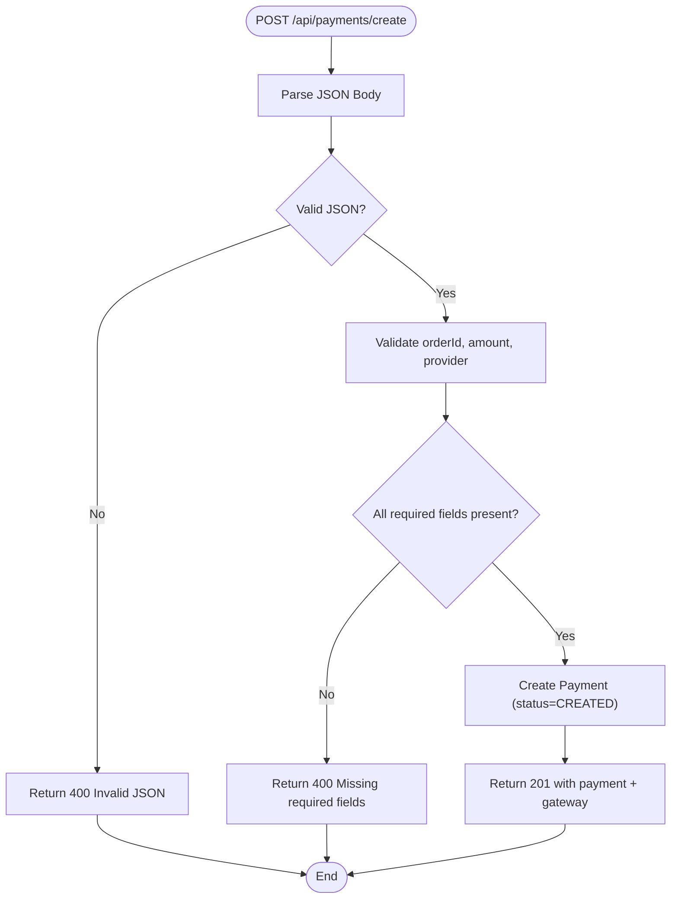
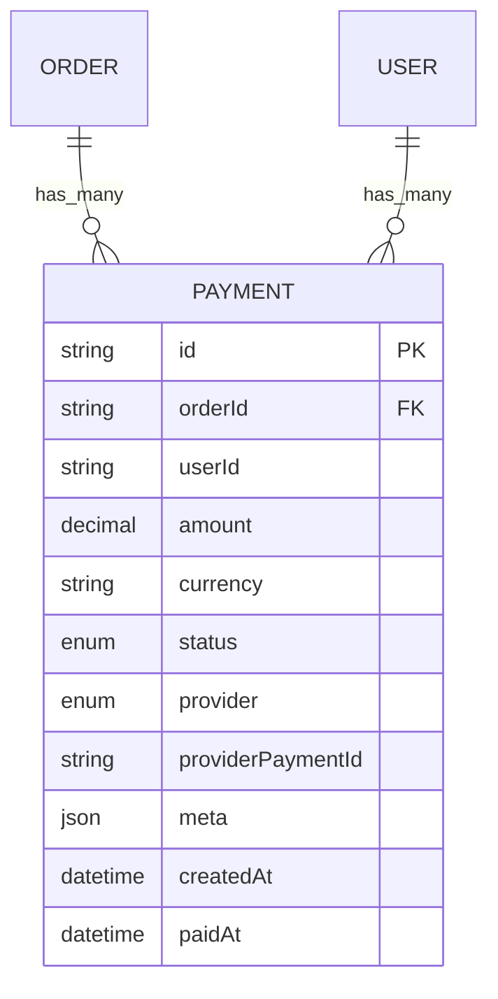
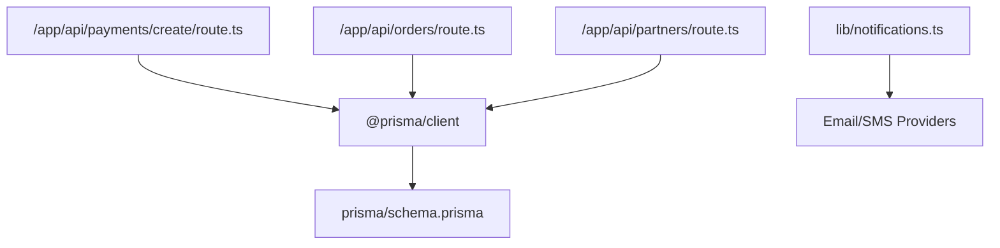

# Payments Processing API

<cite>
**Referenced Files in This Document**
- [route.ts](file://app/api/payments/create/route.ts)
- [schema.prisma](file://prisma/schema.prisma)
- [prisma.ts](file://lib/prisma.ts)
- [route.ts](file://app/api/orders/route.ts)
- [route.ts](file://app/api/orders/[id]/route.ts)
- [route.ts](file://app/api/partners/route.ts)
- [notifications.ts](file://lib/notifications.ts)
- [package.json](file://package.json)
</cite>

## Table of Contents
1. [Introduction](#introduction)
2. [Project Structure](#project-structure)
3. [Core Components](#core-components)
4. [Architecture Overview](#architecture-overview)
5. [Detailed Component Analysis](#detailed-component-analysis)
6. [Dependency Analysis](#dependency-analysis)
7. [Performance Considerations](#performance-considerations)
8. [Troubleshooting Guide](#troubleshooting-guide)
9. [Conclusion](#conclusion)

## Introduction
This document provides comprehensive API documentation for the Payments Processing system. It covers the payment initiation endpoint, payment method configuration, transaction processing, and payment status tracking. It also documents supported payment providers, currency handling, and outlines the settlement and commission calculation processes integrated with the accounting system. The document includes examples of payment initiation workflows, webhook integration guidance for payment confirmation, error handling for failed transactions, and security considerations for PCI compliance and payment data protection.

## Project Structure
The Payments Processing API is implemented as a Next.js App Router API route under `/app/api/payments/create`. Supporting models and enums are defined in the Prisma schema. The system integrates with order and partner management APIs and uses Prisma for persistence. Notifications are centralized for future integration with email/SMS providers.

**Diagram sources**
- [route.ts:1-46](file://app/api/payments/create/route.ts#L1-L46)
- [prisma.ts:1-22](file://lib/prisma.ts#L1-L22)
- [schema.prisma:1-173](file://prisma/schema.prisma#L1-L173)
- [route.ts:1-129](file://app/api/orders/route.ts#L1-L129)
- [route.ts:1-54](file://app/api/orders/[id]/route.ts#L1-L54)
- [route.ts:1-174](file://app/api/partners/route.ts#L1-L174)
- [notifications.ts:1-27](file://lib/notifications.ts#L1-L27)

**Section sources**
- [route.ts:1-46](file://app/api/payments/create/route.ts#L1-L46)
- [prisma.ts:1-22](file://lib/prisma.ts#L1-L22)
- [schema.prisma:1-173](file://prisma/schema.prisma#L1-L173)

## Core Components
- Payment Initiation Endpoint
  - Endpoint: POST /api/payments/create
  - Purpose: Initialize a payment for an order via a selected provider and return a checkout URL for the gateway.
  - Request Body Fields:
    - orderId: string (required)
    - amount: number (required)
    - provider: enum (required) - one of RAZORPAY, PAYTM, STRIPE, CASH, OTHER
    - userId: string (optional)
  - Response:
    - payment: Payment model record (as stored in the database)
    - gateway: {
        provider: enum
        checkoutUrl: string
      }
  - Status Codes:
    - 201 Created on success
    - 400 Bad Request for invalid JSON or missing fields
    - 500 Internal Server Error on server errors

- Payment Model and Enums
  - Payment model fields:
    - id, orderId, userId, amount, currency, status, provider, providerPaymentId, meta, createdAt, paidAt
  - Enums:
    - PaymentStatus: CREATED, PENDING, SUCCESS, FAILED, REFUNDED
    - PaymentProvider: RAZORPAY, PAYTM, STRIPE, CASH, OTHER
  - Currency defaults to INR

- Order Integration
  - Orders are created via POST /api/orders and linked to payments via orderId.
  - Order retrieval supports inclusion of payments for status tracking.

- Partner Integration
  - Partners are managed via POST /api/partners and can be linked to orders and payments through user relations.

- Notifications
  - Centralized notification module for future email/SMS integrations.

**Section sources**
- [route.ts:1-46](file://app/api/payments/create/route.ts#L1-L46)
- [schema.prisma:41-55](file://prisma/schema.prisma#L41-L55)
- [schema.prisma:125-144](file://prisma/schema.prisma#L125-L144)
- [route.ts:38-129](file://app/api/orders/route.ts#L38-L129)
- [route.ts:11-27](file://app/api/orders/[id]/route.ts#L11-L27)
- [route.ts:43-174](file://app/api/partners/route.ts#L43-L174)
- [notifications.ts:1-27](file://lib/notifications.ts#L1-L27)

## Architecture Overview
The Payments Processing API follows a layered architecture:
- API Layer: Next.js App Router routes handle HTTP requests and responses.
- Persistence Layer: Prisma ORM connects to PostgreSQL for data persistence.
- Business Logic: Minimal validation and creation logic; gateway integration is stubbed for external providers.
- Integrations: Orders and Partners APIs support order lifecycle and partner management; Notifications module supports future email/SMS integrations.

**Diagram sources**
- [route.ts:6-44](file://app/api/payments/create/route.ts#L6-L44)
- [prisma.ts:1-22](file://lib/prisma.ts#L1-L22)
- [schema.prisma:125-144](file://prisma/schema.prisma#L125-L144)

## Detailed Component Analysis

### Payment Initiation Endpoint
- Responsibilities:
  - Parse and validate incoming JSON payload.
  - Persist payment record with initial status CREATED.
  - Return gateway checkout URL for the selected provider.
- Input Validation:
  - Rejects invalid JSON and missing required fields (orderId, amount, provider).
- Output:
  - Returns the created payment record and a gateway object containing provider and checkoutUrl.
- Error Handling:
  - Returns 400 for invalid JSON or missing fields.
  - Returns 500 for internal server errors.

**Diagram sources**
- [route.ts:6-44](file://app/api/payments/create/route.ts#L6-L44)

**Section sources**
- [route.ts:1-46](file://app/api/payments/create/route.ts#L1-L46)

### Payment Model and Data Schema
- Payment entity stores:
  - Order linkage via orderId
  - Optional user linkage via userId
  - Amount and currency (defaults to INR)
  - Status lifecycle (CREATED, PENDING, SUCCESS, FAILED, REFUNDED)
  - Provider selection and optional provider-specific payment ID
  - Metadata for raw gateway payloads and failures
  - Timestamps for creation and payment time

**Diagram sources**
- [schema.prisma:125-144](file://prisma/schema.prisma#L125-L144)
- [schema.prisma:91-123](file://prisma/schema.prisma#L91-L123)
- [schema.prisma:57-71](file://prisma/schema.prisma#L57-L71)

**Section sources**
- [schema.prisma:41-55](file://prisma/schema.prisma#L41-L55)
- [schema.prisma:125-144](file://prisma/schema.prisma#L125-L144)

### Supported Payment Providers
- Enumerated providers: RAZORPAY, PAYTM, STRIPE, CASH, OTHER
- The gateway checkout URL is returned as part of the response for the selected provider.

**Section sources**
- [schema.prisma:49-55](file://prisma/schema.prisma#L49-L55)
- [route.ts:37-40](file://app/api/payments/create/route.ts#L37-L40)

### Transaction Fees and Settlement
- Current Implementation:
  - Payment records capture amount and currency but do not include explicit fee fields.
  - Settlement and commission calculations are not implemented in the current codebase.
- Recommended Approach:
  - Add fee and netAmount fields to the Payment model.
  - Introduce a Commission model linked to PartnerProfile for rate-based calculations.
  - Implement settlement workflows triggered by payment status updates (SUCCESS/FAILED/REFUNDED).

[No sources needed since this section provides recommended future enhancements]

### Currency Handling
- Currency defaults to INR in the Payment model.
- Extend to support multiple currencies by adding a currency field to the Payment model and validating against a whitelist.

**Section sources**
- [schema.prisma](file://prisma/schema.prisma#L134)

### Payment Status Tracking
- Status Lifecycle:
  - CREATED: Initial state after payment creation.
  - PENDING: Awaiting confirmation from the payment provider.
  - SUCCESS: Payment confirmed by provider.
  - FAILED: Payment declined or errored.
  - REFUNDED: Full or partial refund processed.
- Integration Point:
  - Webhooks from payment providers should update Payment.status and paidAt accordingly.

**Section sources**
- [schema.prisma:41-47](file://prisma/schema.prisma#L41-L47)
- [schema.prisma:136-143](file://prisma/schema.prisma#L136-L143)

### Order and Customer Information Integration
- Orders are created via POST /api/orders with client details and service type.
- Payments are associated with orders via orderId.
- Retrieving an order includes payments for end-to-end visibility.

**Section sources**
- [route.ts:38-129](file://app/api/orders/route.ts#L38-L129)
- [route.ts:11-27](file://app/api/orders/[id]/route.ts#L11-L27)

### Webhook Integration for Payment Confirmation
- Workflow:
  - Payment provider sends a webhook to the backend with payment details.
  - Backend validates webhook signature and payload.
  - Update Payment record with providerPaymentId, status, and paidAt.
  - Trigger downstream actions (notifications, settlement, commission calculations).
- Security:
  - Validate webhook signatures using shared secrets.
  - Reject duplicate events using idempotency keys.

[No sources needed since this section provides conceptual webhook integration guidance]

### Error Handling for Failed Transactions
- Client-Side Validation:
  - Invalid JSON and missing fields return 400.
- Server Errors:
  - Unhandled exceptions return 500.
- Provider-Level Failures:
  - Capture failure metadata in Payment.meta and set status to FAILED.

**Section sources**
- [route.ts:8-21](file://app/api/payments/create/route.ts#L8-L21)

### PCI Compliance and Security Measures
- Tokenization and Direct APIs:
  - Use provider SDKs to tokenize cards and avoid storing sensitive data.
  - Redirect to provider-hosted checkout pages for PCI exemption.
- Data Protection:
  - Store minimal payment data (providerPaymentId, status, meta).
  - Encrypt sensitive fields at rest and in transit.
- Idempotency:
  - Generate unique request IDs for payment creation to prevent duplicate charges.
- Logging:
  - Log only non-sensitive information; mask PAN and CVV in logs.

[No sources needed since this section provides general security guidance]

### Integration with Accounting Systems for Commission Calculations
- Current State:
  - Partner profiles include walletBalance and commissionRate.
  - No automated commission calculation or settlement logic is implemented.
- Proposed Integration:
  - On payment SUCCESS, calculate commission based on PartnerProfile.commissionRate.
  - Update PartnerProfile.walletBalance and create a CommissionTransaction record.
  - Generate invoices and settlement reports for accounting reconciliation.

**Section sources**
- [schema.prisma:73-89](file://prisma/schema.prisma#L73-L89)

## Dependency Analysis
- External Dependencies:
  - @prisma/client for database operations
  - Prisma CLI for schema migrations and client generation
- Internal Dependencies:
  - Payment route depends on Prisma client initialization and schema models.
  - Orders and Partners APIs depend on Prisma for persistence.

**Diagram sources**
- [route.ts:1-46](file://app/api/payments/create/route.ts#L1-L46)
- [prisma.ts:1-22](file://lib/prisma.ts#L1-L22)
- [schema.prisma:1-173](file://prisma/schema.prisma#L1-L173)
- [route.ts:1-129](file://app/api/orders/route.ts#L1-L129)
- [route.ts:1-174](file://app/api/partners/route.ts#L1-L174)
- [notifications.ts:1-27](file://lib/notifications.ts#L1-L27)

**Section sources**
- [package.json:13-28](file://package.json#L13-L28)
- [prisma.ts:1-22](file://lib/prisma.ts#L1-L22)

## Performance Considerations
- Database Indexes:
  - Ensure indexes on Payment(orderId, providerPaymentId) and Order(publicId) for efficient lookups.
- Caching:
  - Cache frequently accessed order/payment summaries to reduce database load.
- Asynchronous Processing:
  - Offload notifications and settlement tasks to background workers.
- Pagination:
  - Use pagination for order lists and payment histories to limit response sizes.

[No sources needed since this section provides general guidance]

## Troubleshooting Guide
- Common Issues:
  - Invalid JSON payload: Ensure Content-Type is application/json and body is valid.
  - Missing required fields: Verify orderId, amount, and provider are present.
  - Database connectivity: Confirm DATABASE_URL is configured and Prisma client initializes correctly.
- Logging:
  - Inspect server logs for stack traces and Prisma warnings.
- Notifications:
  - Notifications module logs to stdout; integrate with real providers for production.

**Section sources**
- [route.ts:8-21](file://app/api/payments/create/route.ts#L8-L21)
- [prisma.ts:7-20](file://lib/prisma.ts#L7-L20)
- [notifications.ts:9-26](file://lib/notifications.ts#L9-L26)

## Conclusion
The Payments Processing API provides a foundation for initiating payments via multiple providers and tracking their status. It integrates with orders and partners and is designed to accommodate future enhancements for fees, settlement, and commission calculations. To achieve full production readiness, implement provider webhooks, strengthen security controls, and integrate with accounting systems for automated commission processing.