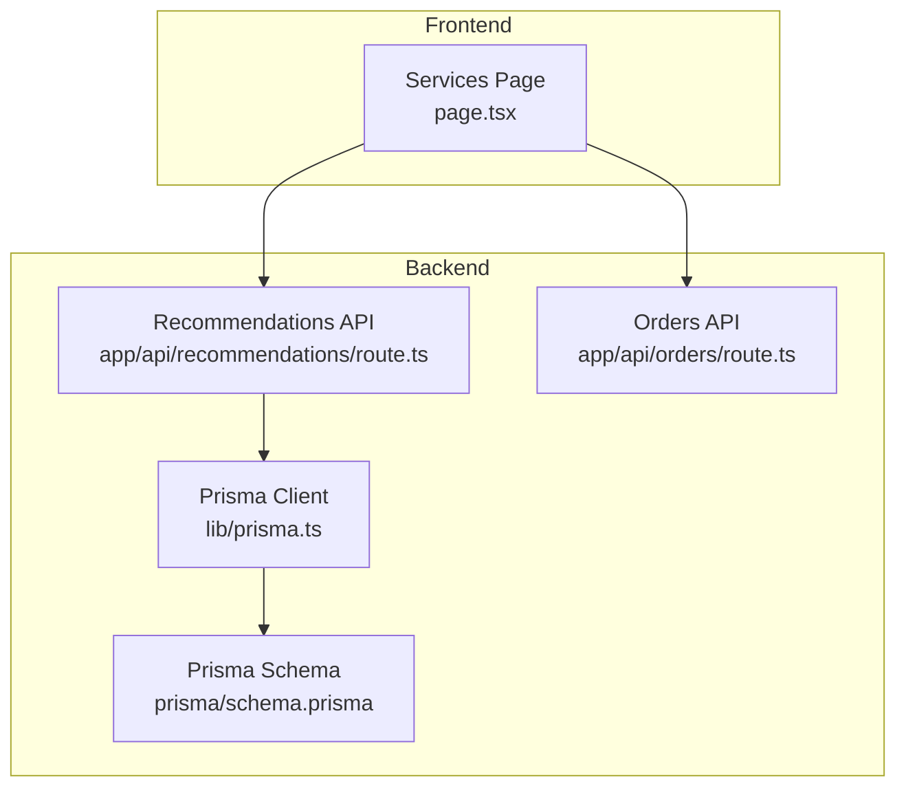
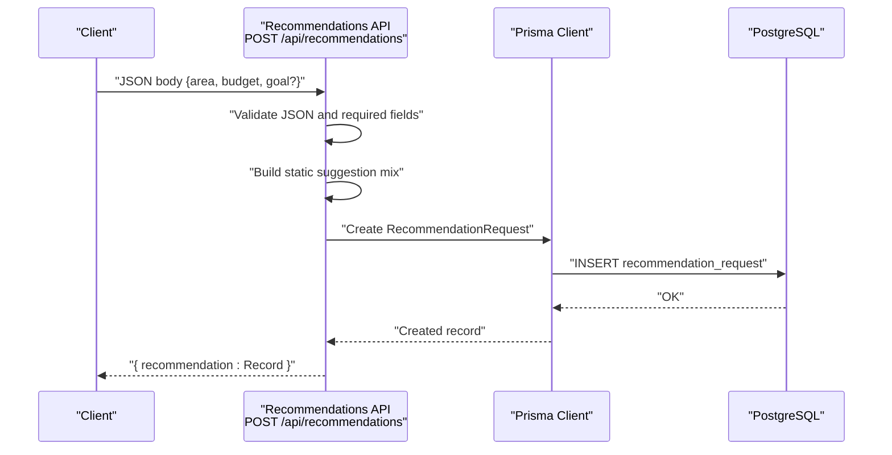
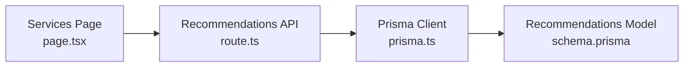

# Recommendations API

<cite>
**Referenced Files in This Document**
- [route.ts](file://app/api/recommendations/route.ts)
- [prisma.ts](file://lib/prisma.ts)
- [schema.prisma](file://prisma/schema.prisma)
- [page.tsx](file://app/services/page.tsx)
- [route.ts](file://app/api/orders/route.ts)
- [test-backend.js](file://test-backend.js)
- [vercel.json](file://vercel.json)
</cite>

## Table of Contents
1. [Introduction](#introduction)
2. [Project Structure](#project-structure)
3. [Core Components](#core-components)
4. [Architecture Overview](#architecture-overview)
5. [Detailed Component Analysis](#detailed-component-analysis)
6. [Dependency Analysis](#dependency-analysis)
7. [Performance Considerations](#performance-considerations)
8. [Troubleshooting Guide](#troubleshooting-guide)
9. [Conclusion](#conclusion)
10. [Appendices](#appendices)

## Introduction
This document provides comprehensive API documentation for the Recommendations system. It covers the AI-powered service suggestion endpoint, request parameters, recommendation algorithms, response formats, schemas, scoring mechanisms, matching logic, personalization factors, examples, integration patterns, accuracy metrics, fallback strategies, and performance optimizations for real-time suggestions.

## Project Structure
The Recommendations API is implemented as a Next.js App Router API route. It integrates with Prisma for persistence and is designed to evolve into a full AI-powered recommendation engine. The frontend surfaces a "Smart Suggestions (Coming Soon)" section indicating future integration with the backend.

**Diagram sources**
- [route.ts:1-56](file://app/api/recommendations/route.ts#L1-L56)
- [prisma.ts:1-22](file://lib/prisma.ts#L1-L22)
- [schema.prisma:160-171](file://prisma/schema.prisma#L160-L171)
- [page.tsx:170-184](file://app/services/page.tsx#L170-L184)
- [route.ts:1-129](file://app/api/orders/route.ts#L1-L129)

**Section sources**
- [route.ts:1-56](file://app/api/recommendations/route.ts#L1-L56)
- [prisma.ts:1-22](file://lib/prisma.ts#L1-L22)
- [schema.prisma:160-171](file://prisma/schema.prisma#L160-L171)
- [page.tsx:170-184](file://app/services/page.tsx#L170-L184)

## Core Components
- Recommendations API endpoint: Handles POST requests to generate and persist recommendation suggestions.
- Prisma integration: Provides database client initialization and schema-backed persistence.
- Frontend integration point: The Services page indicates future integration with the recommendation engine.

Key responsibilities:
- Validate incoming request payload.
- Generate a static recommendation mix (stubbed).
- Persist the request and suggestion to the database.
- Return the persisted record to the caller.

**Section sources**
- [route.ts:4-56](file://app/api/recommendations/route.ts#L4-L56)
- [prisma.ts:1-22](file://lib/prisma.ts#L1-L22)
- [schema.prisma:160-171](file://prisma/schema.prisma#L160-L171)

## Architecture Overview
The Recommendations API follows a minimal, stubbed pattern. It validates input, constructs a recommendation mix, persists it via Prisma, and returns the created record. The current implementation does not incorporate AI algorithms or external ML services.

**Diagram sources**
- [route.ts:5-53](file://app/api/recommendations/route.ts#L5-L53)
- [prisma.ts:11-16](file://lib/prisma.ts#L11-L16)
- [schema.prisma:160-171](file://prisma/schema.prisma#L160-L171)

## Detailed Component Analysis

### Recommendations Endpoint
- Method: POST
- Path: /api/recommendations
- Purpose: Accept client preferences and produce a service mix recommendation.

Request schema (JSON):
- area: string (required)
- budget: number (required)
- goal: string (optional)

Response schema (JSON):
- recommendation: RecommendationRequest record (as defined in Prisma schema)

Processing logic:
- Validates JSON body and required fields.
- Constructs a static recommendation mix with three services and associated weights and comments.
- Persists the request and suggestion to the database.
- Returns the created record.

Stubbed recommendation mix:
- Service 1: PAMPHLET_DISTRIBUTION (weight/share ~0.4)
- Service 2: FLEX_BANNER (weight/share ~0.3)
- Service 3: SUNPACK_SHEET (weight/share ~0.3)

Notes:
- The current implementation does not implement AI-driven scoring or matching.
- The suggestion field stores arbitrary JSON; the current shape includes area, budget, optional goal, and a mix array.

Integration with service selection interface:
- The Services page displays a "Smart Suggestions (Coming Soon)" section indicating planned integration.
- The page also lists predefined service combinations for display purposes.

**Section sources**
- [route.ts:11-53](file://app/api/recommendations/route.ts#L11-L53)
- [schema.prisma:160-171](file://prisma/schema.prisma#L160-L171)
- [page.tsx:170-184](file://app/services/page.tsx#L170-L184)

### Data Model: RecommendationRequest
Fields:
- id: String (primary key)
- area: String
- budget: Decimal
- goal: String? (e.g., admissions, branding, launch)
- servicesHint: String? (text selection from UI)
- suggestion: Json? (stores recommendation payload)
- createdAt: DateTime

Indexes:
- None explicitly defined for RecommendationRequest in the provided schema excerpt.

**Section sources**
- [schema.prisma:160-171](file://prisma/schema.prisma#L160-L171)

### Frontend Integration Point
- The Services page includes a "Smart Suggestions (Coming Soon)" section that describes expected capabilities:
  - Best media mix for the budget
  - Location-based routes and hotspots
  - Festive/seasonal add-on suggestions

This section indicates that the frontend expects the backend to eventually wire into the recommendation engine.

**Section sources**
- [page.tsx:170-184](file://app/services/page.tsx#L170-L184)

### Orders API Context
While not part of the recommendation pipeline, the Orders API demonstrates how client requests are ingested and validated, providing context for how recommendation results might integrate with order creation.

Validation highlights:
- Required fields include clientName, clientMobile, clientArea, and serviceType.
- serviceType is validated against a predefined enum.

This context helps anticipate how recommendation outcomes could feed into order creation flows.

**Section sources**
- [route.ts:43-65](file://app/api/orders/route.ts#L43-L65)

## Dependency Analysis
- The Recommendations API depends on:
  - Prisma client initialization for database operations.
  - Prisma schema model RecommendationRequest for persistence.
- The frontend depends on:
  - The recommendation endpoint for suggestions.
  - The Services page UI to present suggested combinations.

Potential coupling and cohesion:
- The recommendation endpoint is cohesive around request validation and suggestion persistence.
- Coupling to Prisma is straightforward and centralized.

External dependencies:
- PostgreSQL via Prisma.
- Next.js App Router for API routing.

**Diagram sources**
- [route.ts:1-2](file://app/api/recommendations/route.ts#L1-L2)
- [prisma.ts:1-22](file://lib/prisma.ts#L1-L22)
- [schema.prisma:160-171](file://prisma/schema.prisma#L160-L171)
- [page.tsx:170-184](file://app/services/page.tsx#L170-L184)

**Section sources**
- [route.ts:1-2](file://app/api/recommendations/route.ts#L1-L2)
- [prisma.ts:1-22](file://lib/prisma.ts#L1-L22)
- [schema.prisma:160-171](file://prisma/schema.prisma#L160-L171)
- [page.tsx:170-184](file://app/services/page.tsx#L170-L184)

## Performance Considerations
- Current endpoint latency is low due to minimal logic and single write operation.
- Database round-trip cost dominates performance; ensure:
  - Connection pooling and reuse (handled by Prisma client).
  - Proper indexing on frequently queried fields (e.g., area, createdAt) if extended.
- Cold start on serverless platforms:
  - Vercel functions have a max duration limit; keep recommendation generation lightweight.
- Caching:
  - Consider caching popular area/budget combinations if traffic patterns emerge.
- Asynchronous processing:
  - Offload heavy computation to background jobs and return immediately with a job identifier.

[No sources needed since this section provides general guidance]

## Troubleshooting Guide
Common issues and resolutions:
- Invalid JSON body:
  - The endpoint returns a 400 error with a descriptive message when JSON parsing fails.
- Missing required fields:
  - The endpoint returns a 400 error if area or budget are missing.
- Database connectivity:
  - If DATABASE_URL is not configured, Prisma client may be null; ensure environment variable is set in production.
- Testing:
  - Use the provided backend test script to validate endpoint behavior alongside other APIs.

Operational checks:
- Confirm Prisma client initialization and database availability.
- Verify Vercel function limits and environment variables.

**Section sources**
- [route.ts:6-19](file://app/api/recommendations/route.ts#L6-L19)
- [prisma.ts:7-16](file://lib/prisma.ts#L7-L16)
- [test-backend.js:34-57](file://test-backend.js#L34-L57)
- [vercel.json:8-15](file://vercel.json#L8-L15)

## Conclusion
The Recommendations API currently provides a stubbed implementation that validates inputs, constructs a static recommendation mix, persists the request, and returns the record. It is designed to evolve into a full AI-powered system. The frontend indicates future integration expectations. For production readiness, implement AI-driven scoring, introduce robust personalization, define accuracy metrics, establish fallback strategies, and optimize for real-time performance.

[No sources needed since this section summarizes without analyzing specific files]

## Appendices

### API Definition
- Method: POST
- Path: /api/recommendations
- Content-Type: application/json

Request body:
- area: string (required)
- budget: number (required)
- goal: string (optional)

Success response:
- Status: 200 OK
- Body: { recommendation: RecommendationRequest }

Error responses:
- 400 Bad Request: Invalid JSON or missing required fields
- 500 Internal Server Error: Database or server error

**Section sources**
- [route.ts:5-53](file://app/api/recommendations/route.ts#L5-L53)

### Recommendation Scoring and Matching (Planned)
Proposed framework for future implementation:
- Scoring mechanisms:
  - Weighted scoring across reach, cost-efficiency, seasonality, and historical performance.
  - Incorporate geographic hotspots and route feasibility.
- Matching algorithms:
  - K-nearest neighbors or collaborative filtering on similar campaigns.
  - Content-based filtering using service categories and client goals.
- Personalization factors:
  - Client history, preferred areas, and past campaign outcomes.
  - Dynamic budget allocation across services.
- Accuracy metrics:
  - Precision@K, recall, NDCG, and conversion lift compared to baseline mixes.
- Fallback strategies:
  - Default mix when insufficient data is available.
  - Graceful degradation to static heuristics.
- Real-time optimization:
  - Edge caching, CDN-backed metadata, and asynchronous enrichment.

[No sources needed since this section proposes conceptual enhancements]