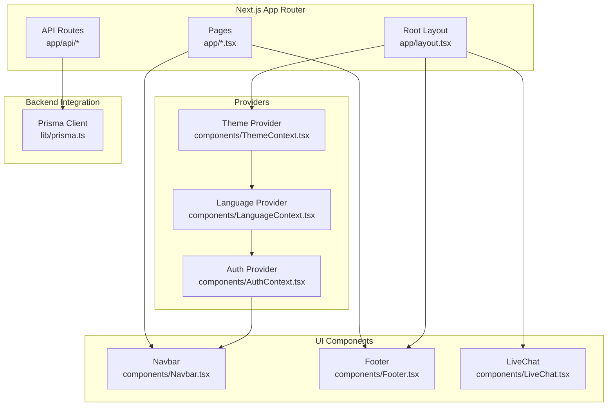
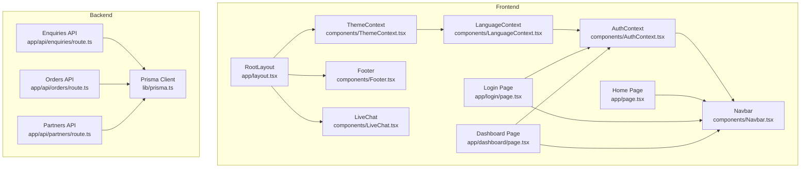
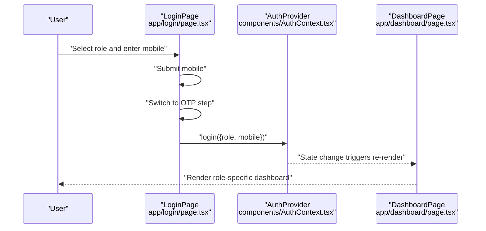
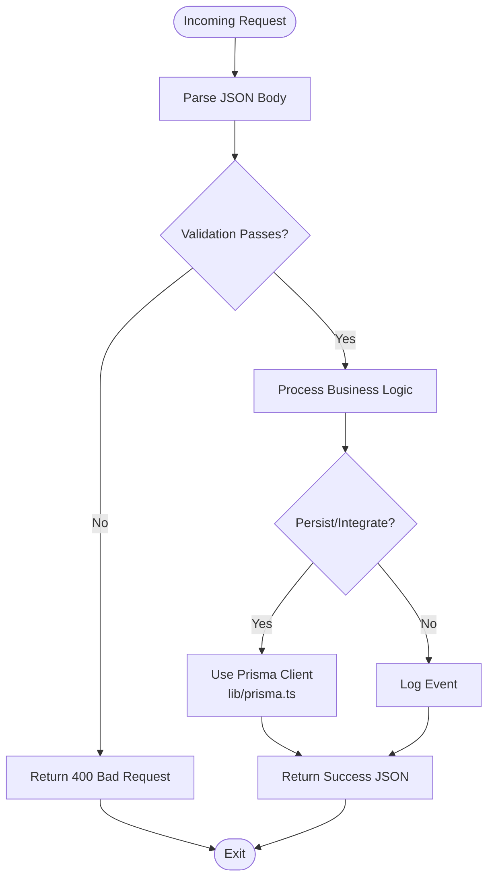
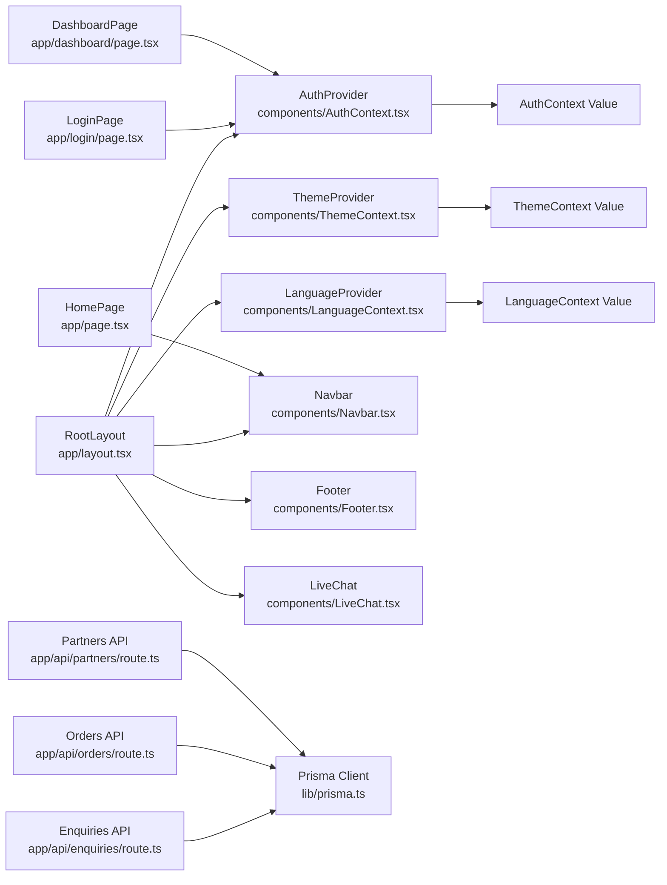

# Application Architecture

<cite>
**Referenced Files in This Document**
- [app/layout.tsx](file://app/layout.tsx)
- [components/AuthContext.tsx](file://components/AuthContext.tsx)
- [components/ThemeContext.tsx](file://components/ThemeContext.tsx)
- [components/LanguageContext.tsx](file://components/LanguageContext.tsx)
- [components/Navbar.tsx](file://components/Navbar.tsx)
- [components/Footer.tsx](file://components/Footer.tsx)
- [components/LiveChat.tsx](file://components/LiveChat.tsx)
- [app/page.tsx](file://app/page.tsx)
- [app/login/page.tsx](file://app/login/page.tsx)
- [app/dashboard/page.tsx](file://app/dashboard/page.tsx)
- [app/api/enquiries/route.ts](file://app/api/enquiries/route.ts)
- [app/api/orders/route.ts](file://app/api/orders/route.ts)
- [app/api/partners/route.ts](file://app/api/partners/route.ts)
- [lib/prisma.ts](file://lib/prisma.ts)
- [next.config.mjs](file://next.config.mjs)
- [package.json](file://package.json)
</cite>

## Table of Contents
1. [Introduction](#introduction)
2. [Project Structure](#project-structure)
3. [Core Components](#core-components)
4. [Architecture Overview](#architecture-overview)
5. [Detailed Component Analysis](#detailed-component-analysis)
6. [Dependency Analysis](#dependency-analysis)
7. [Performance Considerations](#performance-considerations)
8. [Troubleshooting Guide](#troubleshooting-guide)
9. [Conclusion](#conclusion)

## Introduction
This document describes the architecture of the Shree Shyam Agency Portal built with Next.js 14 App Router. It explains how the RootLayout composes context providers to deliver theme, language, and authentication state across the application. It documents the separation between frontend React components and backend API routes, outlines system boundaries, and details cross-cutting concerns such as state management, theming, internationalization, and authentication. The goal is to make the architecture understandable for both technical and non-technical stakeholders.

## Project Structure
The application follows Next.js 14 App Router conventions:
- app/: file-based routing for pages and API routes
- components/: shared UI and context providers
- lib/: backend integration utilities (e.g., Prisma client)
- Static assets and configuration at the repository root

Key structural highlights:
- Root layout composes providers and top-level UI (navigation, footer, live chat)
- Pages under app/ define routes and render UI composed from components/
- API routes under app/api/ implement server-side endpoints
- Prisma client is initialized in lib/prisma.ts and can be used by API routes



**Diagram sources**
- [app/layout.tsx:17-46](file://app/layout.tsx#L17-L46)
- [components/ThemeContext.tsx:14-27](file://components/ThemeContext.tsx#L14-L27)
- [components/LanguageContext.tsx:23-50](file://components/LanguageContext.tsx#L23-L50)
- [components/AuthContext.tsx:29-60](file://components/AuthContext.tsx#L29-L60)
- [components/Navbar.tsx:19-60](file://components/Navbar.tsx#L19-L60)
- [components/Footer.tsx:1-17](file://components/Footer.tsx#L1-L17)
- [components/LiveChat.tsx](file://components/LiveChat.tsx)
- [app/page.tsx:1-89](file://app/page.tsx#L1-L89)
- [app/api/enquiries/route.ts:1-85](file://app/api/enquiries/route.ts#L1-L85)
- [lib/prisma.ts:1-17](file://lib/prisma.ts#L1-L17)

**Section sources**
- [app/layout.tsx:17-46](file://app/layout.tsx#L17-L46)
- [next.config.mjs:1-14](file://next.config.mjs#L1-L14)

## Core Components
This section focuses on the provider pattern and core UI components that establish cross-cutting capabilities.

- Theme Provider
  - Purpose: Establishes a consistent theme state across the app.
  - Behavior: Currently fixed to a light theme with a no-op toggle.
  - Consumers: Any component that needs theme-aware rendering.

- Language Provider
  - Purpose: Manages language selection and persistence.
  - Behavior: Persists language preference in local storage and exposes a toggle function.
  - Consumers: UI components that render localized text.

- Auth Provider
  - Purpose: Centralizes authentication state and lifecycle.
  - Behavior: Loads persisted state from local storage, updates on login/logout, persists changes.
  - Consumers: Protected routes, navigation, and role-specific views.

- Root Layout
  - Purpose: Wraps the entire application with providers and renders top-level UI.
  - Composition: Theme -> Language -> Auth -> Navbar -> Page Content -> Footer -> Live Chat.

- Navigation and Footer
  - Purpose: Provide global navigation and branding.
  - Note: Navbar currently uses hardcoded language/theme fallbacks; future enhancements can wire these to providers.

**Section sources**
- [components/ThemeContext.tsx:14-33](file://components/ThemeContext.tsx#L14-L33)
- [components/LanguageContext.tsx:23-59](file://components/LanguageContext.tsx#L23-L59)
- [components/AuthContext.tsx:29-70](file://components/AuthContext.tsx#L29-L70)
- [app/layout.tsx:17-46](file://app/layout.tsx#L17-L46)
- [components/Navbar.tsx:19-60](file://components/Navbar.tsx#L19-L60)
- [components/Footer.tsx:1-17](file://components/Footer.tsx#L1-L17)

## Architecture Overview
The system is split into two primary layers:
- Frontend React Layer: Pages and components under app/ and components/, which consume providers and render UI.
- Backend API Layer: API routes under app/api/ that handle requests, validate payloads, and coordinate with backend integrations.

System boundaries:
- Next.js App Router defines routing boundaries.
- Providers encapsulate cross-cutting concerns and are consumed by pages and components.
- API routes are isolated from UI concerns and return structured JSON responses.



**Diagram sources**
- [app/layout.tsx:17-46](file://app/layout.tsx#L17-L46)
- [app/page.tsx:1-89](file://app/page.tsx#L1-L89)
- [app/login/page.tsx:1-127](file://app/login/page.tsx#L1-L127)
- [app/dashboard/page.tsx:1-257](file://app/dashboard/page.tsx#L1-L257)
- [components/Navbar.tsx:19-60](file://components/Navbar.tsx#L19-L60)
- [components/Footer.tsx:1-17](file://components/Footer.tsx#L1-L17)
- [components/LiveChat.tsx](file://components/LiveChat.tsx)
- [components/ThemeContext.tsx:14-27](file://components/ThemeContext.tsx#L14-L27)
- [components/LanguageContext.tsx:23-50](file://components/LanguageContext.tsx#L23-L50)
- [components/AuthContext.tsx:29-60](file://components/AuthContext.tsx#L29-L60)
- [app/api/enquiries/route.ts:1-85](file://app/api/enquiries/route.ts#L1-L85)
- [app/api/orders/route.ts:1-68](file://app/api/orders/route.ts#L1-L68)
- [app/api/partners/route.ts:1-90](file://app/api/partners/route.ts#L1-L90)
- [lib/prisma.ts:1-17](file://lib/prisma.ts#L1-L17)

## Detailed Component Analysis

### Provider Pattern Implementation
The provider pattern is implemented via three context modules:
- ThemeContext: Provides a theme value and a toggle function. The current implementation fixes the theme to light and disables toggling.
- LanguageContext: Manages language state with persistence and a toggle method.
- AuthContext: Manages role and mobile-based identity, with persistence and login/logout actions.

```mermaid
classDiagram
class ThemeProvider {
+theme : "light"|"dark"
+toggle() : void
}
class LanguageProvider {
+lang : "en"|"hi"
+toggle() : void
}
class AuthProvider {
+user : {role, mobile}
+login(params) : void
+logout() : void
}
class RootLayout {
+renders : Navbar, main, Footer, LiveChat
}
RootLayout --> ThemeProvider : "wraps"
ThemeProvider --> LanguageProvider : "wraps"
LanguageProvider --> AuthProvider : "wraps"
```

**Diagram sources**
- [components/ThemeContext.tsx:14-33](file://components/ThemeContext.tsx#L14-L33)
- [components/LanguageContext.tsx:23-59](file://components/LanguageContext.tsx#L23-L59)
- [components/AuthContext.tsx:29-70](file://components/AuthContext.tsx#L29-L70)
- [app/layout.tsx:17-46](file://app/layout.tsx#L17-L46)

**Section sources**
- [components/ThemeContext.tsx:14-33](file://components/ThemeContext.tsx#L14-L33)
- [components/LanguageContext.tsx:23-59](file://components/LanguageContext.tsx#L23-L59)
- [components/AuthContext.tsx:29-70](file://components/AuthContext.tsx#L29-L70)
- [app/layout.tsx:17-46](file://app/layout.tsx#L17-L46)

### Authentication Flow (Login Page)
The login page demonstrates the provider-driven authentication flow:
- Role selection among admin, team-boy, and printing-shop
- Mobile input and OTP verification flow
- On successful OTP verification, the AuthProvider updates state and navigates to the dashboard



**Diagram sources**
- [app/login/page.tsx:7-127](file://app/login/page.tsx#L7-L127)
- [components/AuthContext.tsx:29-70](file://components/AuthContext.tsx#L29-L70)
- [app/dashboard/page.tsx:1-257](file://app/dashboard/page.tsx#L1-L257)

**Section sources**
- [app/login/page.tsx:7-127](file://app/login/page.tsx#L7-L127)
- [components/AuthContext.tsx:29-70](file://components/AuthContext.tsx#L29-L70)
- [app/dashboard/page.tsx:1-257](file://app/dashboard/page.tsx#L1-L257)

### API Routes and Data Flow
The API routes implement CRUD-like operations for enquiries, orders, and partners:
- Enquiries API: Validates incoming payload, performs basic mobile validation, logs the submission, and returns a success response.
- Orders API: Returns mock order data and accepts new order submissions with validation.
- Partners API: Lists partners and accepts new partner applications with validation and logging.



**Diagram sources**
- [app/api/enquiries/route.ts:1-85](file://app/api/enquiries/route.ts#L1-L85)
- [app/api/orders/route.ts:1-68](file://app/api/orders/route.ts#L1-L68)
- [app/api/partners/route.ts:1-90](file://app/api/partners/route.ts#L1-L90)
- [lib/prisma.ts:1-17](file://lib/prisma.ts#L1-L17)

**Section sources**
- [app/api/enquiries/route.ts:1-85](file://app/api/enquiries/route.ts#L1-L85)
- [app/api/orders/route.ts:1-68](file://app/api/orders/route.ts#L1-L68)
- [app/api/partners/route.ts:1-90](file://app/api/partners/route.ts#L1-L90)
- [lib/prisma.ts:1-17](file://lib/prisma.ts#L1-L17)

### Cross-Cutting Concerns
- State Management
  - Auth state is centralized and persisted in local storage, enabling session continuity across browser sessions.
  - Language and theme preferences are similarly persisted for a consistent UX.
- Theming
  - Theme provider currently enforces a light theme; future enhancements can enable dynamic switching while preserving persistence.
- Internationalization
  - Language provider supports English and Hindi with a toggle and persistence; UI components can consume the language state to render localized content.
- Authentication
  - Auth provider supplies role-based identity to pages and components, enabling role-specific views and protected navigation.

**Section sources**
- [components/AuthContext.tsx:29-70](file://components/AuthContext.tsx#L29-L70)
- [components/LanguageContext.tsx:23-59](file://components/LanguageContext.tsx#L23-L59)
- [components/ThemeContext.tsx:14-33](file://components/ThemeContext.tsx#L14-L33)
- [app/dashboard/page.tsx:1-257](file://app/dashboard/page.tsx#L1-L257)

## Dependency Analysis
The application exhibits clear separation of concerns:
- UI depends on providers for state, not on backend logic.
- API routes depend on Prisma for persistence and return structured responses.
- Root layout composes providers and top-level UI, ensuring consistent context availability.



**Diagram sources**
- [app/layout.tsx:17-46](file://app/layout.tsx#L17-L46)
- [components/ThemeContext.tsx:14-33](file://components/ThemeContext.tsx#L14-L33)
- [components/LanguageContext.tsx:23-59](file://components/LanguageContext.tsx#L23-L59)
- [components/AuthContext.tsx:29-70](file://components/AuthContext.tsx#L29-L70)
- [components/Navbar.tsx:19-60](file://components/Navbar.tsx#L19-L60)
- [components/Footer.tsx:1-17](file://components/Footer.tsx#L1-L17)
- [components/LiveChat.tsx](file://components/LiveChat.tsx)
- [app/page.tsx:1-89](file://app/page.tsx#L1-L89)
- [app/login/page.tsx:1-127](file://app/login/page.tsx#L1-L127)
- [app/dashboard/page.tsx:1-257](file://app/dashboard/page.tsx#L1-L257)
- [app/api/enquiries/route.ts:1-85](file://app/api/enquiries/route.ts#L1-L85)
- [app/api/orders/route.ts:1-68](file://app/api/orders/route.ts#L1-L68)
- [app/api/partners/route.ts:1-90](file://app/api/partners/route.ts#L1-L90)
- [lib/prisma.ts:1-17](file://lib/prisma.ts#L1-L17)

**Section sources**
- [app/layout.tsx:17-46](file://app/layout.tsx#L17-L46)
- [components/AuthContext.tsx:29-70](file://components/AuthContext.tsx#L29-L70)
- [app/api/enquiries/route.ts:1-85](file://app/api/enquiries/route.ts#L1-L85)
- [lib/prisma.ts:1-17](file://lib/prisma.ts#L1-L17)

## Performance Considerations
- Provider Scope: Keep provider boundaries minimal to reduce unnecessary re-renders. The current composition in RootLayout ensures providers wrap the entire app; consider narrowing scope if specific pages require isolated contexts.
- Local Storage Persistence: Auth and language providers persist state to local storage. Avoid heavy computations during hydration; memoize derived values as implemented.
- API Route Efficiency: Validate early and fail fast in API routes. Use pagination and filtering for list endpoints as the application grows.
- Prisma Client: Initialize Prisma once globally to avoid overhead. The provided client initialization aligns with recommended patterns.

[No sources needed since this section provides general guidance]

## Troubleshooting Guide
Common areas to inspect:
- Authentication State
  - Ensure the AuthProvider wraps the consuming pages. If useAuth throws, the provider is likely missing.
  - Verify local storage keys and parsing logic for persisted state.
- Language and Theme
  - Confirm LanguageProvider and ThemeProvider are both rendered by RootLayout.
  - Check local storage keys for language persistence.
- API Routes
  - Validate request bodies and return appropriate HTTP status codes.
  - Inspect Prisma client initialization and connection logs.
- Build and Runtime
  - Review Next.js configuration for experimental flags and image domain restrictions.
  - Confirm dependency versions and scripts in package.json.

**Section sources**
- [components/AuthContext.tsx:29-70](file://components/AuthContext.tsx#L29-L70)
- [components/LanguageContext.tsx:23-59](file://components/LanguageContext.tsx#L23-L59)
- [components/ThemeContext.tsx:14-33](file://components/ThemeContext.tsx#L14-L33)
- [app/api/enquiries/route.ts:1-85](file://app/api/enquiries/route.ts#L1-L85)
- [lib/prisma.ts:1-17](file://lib/prisma.ts#L1-L17)
- [next.config.mjs:1-14](file://next.config.mjs#L1-L14)
- [package.json:1-44](file://package.json#L1-L44)

## Conclusion
The Shree Shyam Agency Portal leverages Next.js 14 App Router to separate frontend UI from backend APIs, with a robust provider pattern delivering theme, language, and authentication state. RootLayout composes providers and top-level UI, ensuring consistent cross-cutting behavior. API routes encapsulate backend logic and integrate with Prisma for persistence. This architecture supports scalability, maintainability, and a clear separation of concerns across layers.