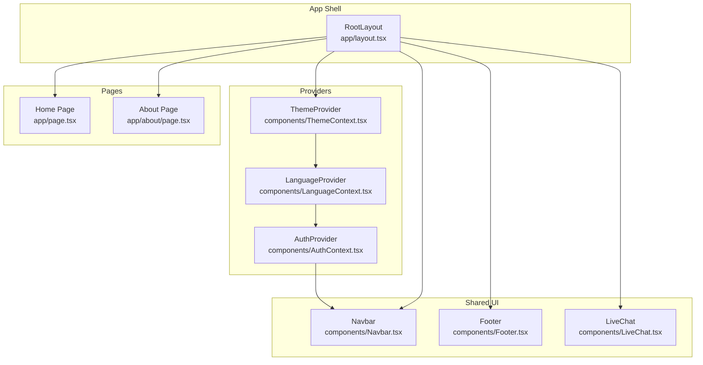
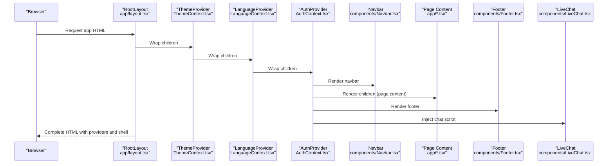
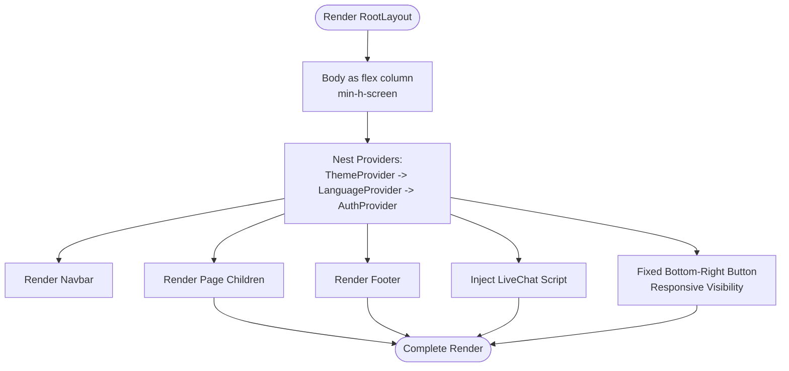
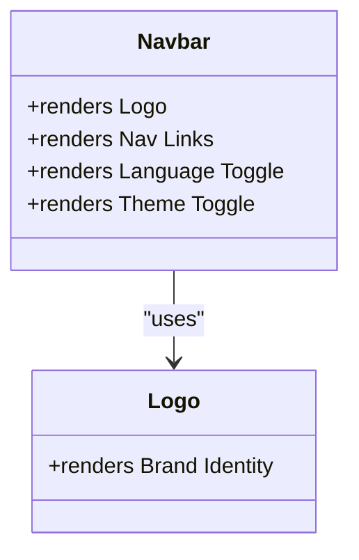
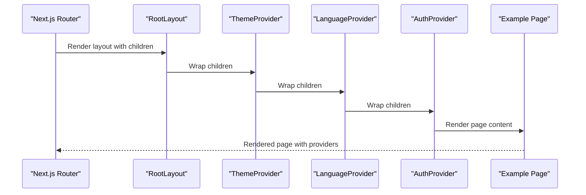
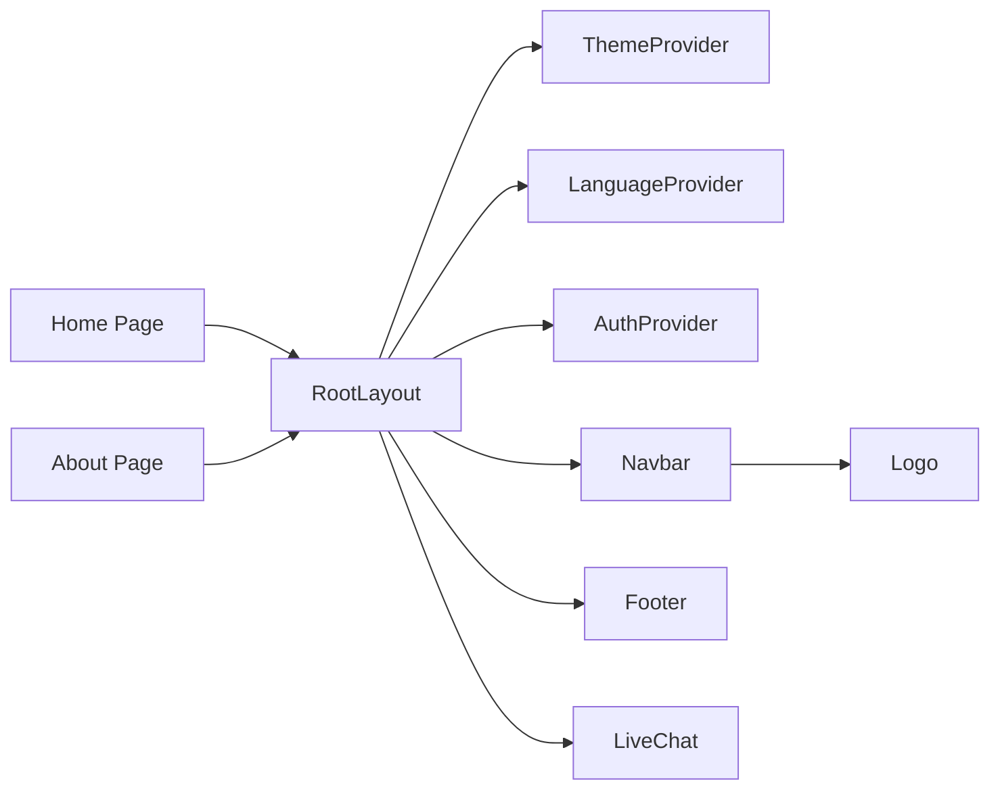

# Component Hierarchy & Layout

<cite>
**Referenced Files in This Document**
- [app/layout.tsx](file://app/layout.tsx)
- [components/Navbar.tsx](file://components/Navbar.tsx)
- [components/Footer.tsx](file://components/Footer.tsx)
- [components/AuthContext.tsx](file://components/AuthContext.tsx)
- [components/LanguageContext.tsx](file://components/LanguageContext.tsx)
- [components/ThemeContext.tsx](file://components/ThemeContext.tsx)
- [components/LiveChat.tsx](file://components/LiveChat.tsx)
- [components/Logo.tsx](file://components/Logo.tsx)
- [components/Hero.tsx](file://components/Hero.tsx)
- [app/page.tsx](file://app/page.tsx)
- [app/about/page.tsx](file://app/about/page.tsx)
- [app/globals.css](file://app/globals.css)
- [tailwind.config.ts](file://tailwind.config.ts)
- [package.json](file://package.json)
- [next.config.mjs](file://next.config.mjs)
</cite>

## Table of Contents
1. [Introduction](#introduction)
2. [Project Structure](#project-structure)
3. [Core Components](#core-components)
4. [Architecture Overview](#architecture-overview)
5. [Detailed Component Analysis](#detailed-component-analysis)
6. [Dependency Analysis](#dependency-analysis)
7. [Performance Considerations](#performance-considerations)
8. [Troubleshooting Guide](#troubleshooting-guide)
9. [Conclusion](#conclusion)

## Introduction
This document explains the component hierarchy and layout structure of the Shree Shyam Agency Portal. It focuses on how RootLayout acts as the application shell, orchestrating the provider chain and rendering shared UI elements such as Navbar, Footer, and the floating WhatsApp chat button. It also documents the flex-based layout system used for responsive design, the fixed positioning of the live chat affordance, and how child pages inherit the layout and context providers.

## Project Structure
The application follows Next.js App Router conventions:
- app/layout.tsx defines the root layout and provider chain.
- app/page.tsx and app/about/page.tsx are example pages that render inside the layout’s children slot.
- Shared UI components live under components/, including Navbar, Footer, Logo, and context providers for authentication, language, and theme.
- Tailwind CSS is configured for responsive design and dark mode support.

**Diagram sources**
- [app/layout.tsx:17-46](file://app/layout.tsx#L17-L46)
- [components/ThemeContext.tsx:14-27](file://components/ThemeContext.tsx#L14-L27)
- [components/LanguageContext.tsx:23-49](file://components/LanguageContext.tsx#L23-L49)
- [components/AuthContext.tsx:29-60](file://components/AuthContext.tsx#L29-L60)
- [components/Navbar.tsx:19-60](file://components/Navbar.tsx#L19-L60)
- [components/Footer.tsx:1-17](file://components/Footer.tsx#L1-L17)
- [components/LiveChat.tsx:12-50](file://components/LiveChat.tsx#L12-L50)
- [app/page.tsx:4-87](file://app/page.tsx#L4-L87)
- [app/about/page.tsx:1-59](file://app/about/page.tsx#L1-L59)

**Section sources**
- [app/layout.tsx:17-46](file://app/layout.tsx#L17-L46)
- [app/globals.css:28-32](file://app/globals.css#L28-L32)
- [tailwind.config.ts:8-27](file://tailwind.config.ts#L8-L27)

## Core Components
- RootLayout: Defines the HTML document shell, metadata, and renders the provider chain and shared UI. It sets the body to a flex column with a minimum height to enable sticky-like footer behavior and places the floating WhatsApp link and LiveChat component outside the main content area.
- Providers:
  - ThemeProvider: Always initializes to a light theme and exposes a toggle function (no-op in current implementation).
  - LanguageProvider: Manages language state with persistence and a toggle function.
  - AuthProvider: Manages user role and mobile number with localStorage persistence.
- Shared UI:
  - Navbar: Renders logo, navigation links, and language/theme toggles.
  - Footer: Displays copyright and location information.
  - LiveChat: Dynamically injects third-party chat script based on provider selection.
- Pages:
  - Home Page and About Page: Render inside the layout’s children area, inheriting the layout and provider context.

**Section sources**
- [app/layout.tsx:17-46](file://app/layout.tsx#L17-L46)
- [components/ThemeContext.tsx:14-27](file://components/ThemeContext.tsx#L14-L27)
- [components/LanguageContext.tsx:23-49](file://components/LanguageContext.tsx#L23-L49)
- [components/AuthContext.tsx:29-60](file://components/AuthContext.tsx#L29-L60)
- [components/Navbar.tsx:19-60](file://components/Navbar.tsx#L19-L60)
- [components/Footer.tsx:1-17](file://components/Footer.tsx#L1-L17)
- [components/LiveChat.tsx:12-50](file://components/LiveChat.tsx#L12-L50)
- [app/page.tsx:4-87](file://app/page.tsx#L4-L87)
- [app/about/page.tsx:1-59](file://app/about/page.tsx#L1-L59)

## Architecture Overview
RootLayout is the single source of truth for the application shell. It composes:
- Provider chain: ThemeProvider -> LanguageProvider -> AuthProvider
- Shared UI: Navbar, main content area, Footer, and LiveChat
- Floating WhatsApp link positioned fixed at the bottom-right corner

**Diagram sources**
- [app/layout.tsx:17-46](file://app/layout.tsx#L17-L46)
- [components/ThemeContext.tsx:14-27](file://components/ThemeContext.tsx#L14-L27)
- [components/LanguageContext.tsx:23-49](file://components/LanguageContext.tsx#L23-L49)
- [components/AuthContext.tsx:29-60](file://components/AuthContext.tsx#L29-L60)
- [components/Navbar.tsx:19-60](file://components/Navbar.tsx#L19-L60)
- [components/Footer.tsx:1-17](file://components/Footer.tsx#L1-L17)
- [components/LiveChat.tsx:12-50](file://components/LiveChat.tsx#L12-L50)

## Detailed Component Analysis

### RootLayout and Provider Chain
RootLayout establishes:
- HTML metadata and a flex column body to enable vertical stacking and footer push-down behavior.
- Provider nesting order: ThemeProvider -> LanguageProvider -> AuthProvider.
- Fixed-positioned floating WhatsApp link with responsive visibility rules.
- LiveChat injection after Footer.

**Diagram sources**
- [app/layout.tsx:17-46](file://app/layout.tsx#L17-L46)
- [components/ThemeContext.tsx:14-27](file://components/ThemeContext.tsx#L14-L27)
- [components/LanguageContext.tsx:23-49](file://components/LanguageContext.tsx#L23-L49)
- [components/AuthContext.tsx:29-60](file://components/AuthContext.tsx#L29-L60)
- [components/LiveChat.tsx:12-50](file://components/LiveChat.tsx#L12-L50)

**Section sources**
- [app/layout.tsx:17-46](file://app/layout.tsx#L17-L46)

### Navbar
Navbar renders:
- Logo component.
- Navigation links with localized labels.
- Language toggle and theme toggle placeholders.
- Responsive desktop navigation and compact controls.

**Diagram sources**
- [components/Navbar.tsx:19-60](file://components/Navbar.tsx#L19-L60)
- [components/Logo.tsx:1-22](file://components/Logo.tsx#L1-L22)

**Section sources**
- [components/Navbar.tsx:19-60](file://components/Navbar.tsx#L19-L60)
- [components/Logo.tsx:1-22](file://components/Logo.tsx#L1-L22)

### Footer
Footer displays:
- Copyright notice.
- Area served information.
- Dark/light variant styling via Tailwind classes.

**Section sources**
- [components/Footer.tsx:1-17](file://components/Footer.tsx#L1-L17)

### Providers

#### ThemeProvider
- Always initializes to a light theme.
- Exposes a toggle function (no-op) to maintain a consistent white theme across the application.

**Section sources**
- [components/ThemeContext.tsx:14-27](file://components/ThemeContext.tsx#L14-L27)

#### LanguageProvider
- Manages language state with persistence in localStorage.
- Provides a toggle function to switch between English and Hindi.

**Section sources**
- [components/LanguageContext.tsx:23-49](file://components/LanguageContext.tsx#L23-L49)

#### AuthProvider
- Manages user role and mobile number with localStorage persistence.
- Exposes login and logout functions.

**Section sources**
- [components/AuthContext.tsx:29-60](file://components/AuthContext.tsx#L29-L60)

### LiveChat
- Conditionally loads Tawk.to or Crisp chat widgets based on provider prop.
- Requires environment variables for provider configuration.

**Section sources**
- [components/LiveChat.tsx:12-50](file://components/LiveChat.tsx#L12-L50)

### Example Pages and Inheritance
- Home Page and About Page render inside the layout’s children area, inheriting the provider chain and shared shell.
- They use Tailwind utilities for responsive grids and spacing.

**Diagram sources**
- [app/layout.tsx:17-46](file://app/layout.tsx#L17-L46)
- [components/ThemeContext.tsx:14-27](file://components/ThemeContext.tsx#L14-L27)
- [components/LanguageContext.tsx:23-49](file://components/LanguageContext.tsx#L23-L49)
- [components/AuthContext.tsx:29-60](file://components/AuthContext.tsx#L29-L60)
- [app/page.tsx:4-87](file://app/page.tsx#L4-L87)
- [app/about/page.tsx:1-59](file://app/about/page.tsx#L1-L59)

**Section sources**
- [app/page.tsx:4-87](file://app/page.tsx#L4-L87)
- [app/about/page.tsx:1-59](file://app/about/page.tsx#L1-L59)

## Dependency Analysis
Provider nesting order and coupling:
- RootLayout depends on ThemeProvider, LanguageProvider, and AuthProvider.
- Navbar depends on Logo and consumes language/theme contexts (currently stubbed).
- LiveChat depends on environment variables and DOM manipulation.
- Pages depend on layout and providers but do not directly manage providers.

**Diagram sources**
- [app/layout.tsx:17-46](file://app/layout.tsx#L17-L46)
- [components/ThemeContext.tsx:14-27](file://components/ThemeContext.tsx#L14-L27)
- [components/LanguageContext.tsx:23-49](file://components/LanguageContext.tsx#L23-L49)
- [components/AuthContext.tsx:29-60](file://components/AuthContext.tsx#L29-L60)
- [components/Navbar.tsx:19-60](file://components/Navbar.tsx#L19-L60)
- [components/Footer.tsx:1-17](file://components/Footer.tsx#L1-L17)
- [components/LiveChat.tsx:12-50](file://components/LiveChat.tsx#L12-L50)
- [components/Logo.tsx:1-22](file://components/Logo.tsx#L1-L22)
- [app/page.tsx:4-87](file://app/page.tsx#L4-L87)
- [app/about/page.tsx:1-59](file://app/about/page.tsx#L1-L59)

**Section sources**
- [app/layout.tsx:17-46](file://app/layout.tsx#L17-L46)
- [components/ThemeContext.tsx:14-27](file://components/ThemeContext.tsx#L14-L27)
- [components/LanguageContext.tsx:23-49](file://components/LanguageContext.tsx#L23-L49)
- [components/AuthContext.tsx:29-60](file://components/AuthContext.tsx#L29-L60)
- [components/Navbar.tsx:19-60](file://components/Navbar.tsx#L19-L60)
- [components/Footer.tsx:1-17](file://components/Footer.tsx#L1-L17)
- [components/LiveChat.tsx:12-50](file://components/LiveChat.tsx#L12-L50)
- [components/Logo.tsx:1-22](file://components/Logo.tsx#L1-L22)
- [app/page.tsx:4-87](file://app/page.tsx#L4-L87)
- [app/about/page.tsx:1-59](file://app/about/page.tsx#L1-L59)

## Performance Considerations
- Provider nesting adds minimal overhead; keep provider boundaries shallow to avoid unnecessary re-renders.
- LiveChat script injection occurs on the client; ensure environment variables are configured to prevent redundant script loads.
- Navbar and Footer are lightweight; avoid heavy computations in these components.
- Use responsive breakpoints judiciously to minimize layout thrashing on smaller screens.

[No sources needed since this section provides general guidance]

## Troubleshooting Guide
Common issues and resolutions:
- LiveChat not appearing:
  - Verify environment variables for the selected provider are present.
  - Confirm the provider prop matches supported values.
- Theme not changing:
  - ThemeProvider intentionally keeps the theme light; toggle is a no-op.
- Language toggle not switching:
  - Ensure LanguageProvider is mounted and localStorage is accessible.
- Floating WhatsApp link not visible:
  - Check responsive breakpoint classes and visibility conditions.
- Pages not inheriting providers:
  - Ensure pages render within the layout’s children area and do not override the provider chain.

**Section sources**
- [components/LiveChat.tsx:12-50](file://components/LiveChat.tsx#L12-L50)
- [components/ThemeContext.tsx:14-27](file://components/ThemeContext.tsx#L14-L27)
- [components/LanguageContext.tsx:23-49](file://components/LanguageContext.tsx#L23-L49)
- [app/layout.tsx:23-42](file://app/layout.tsx#L23-L42)

## Conclusion
RootLayout defines the application shell and provider chain, ensuring consistent theme, language, and authentication contexts across all pages. The Navbar and Footer provide cohesive branding and navigation, while the fixed WhatsApp link and LiveChat offer customer engagement. Child pages automatically inherit the layout and providers, enabling a scalable and maintainable component hierarchy.

[No sources needed since this section summarizes without analyzing specific files]