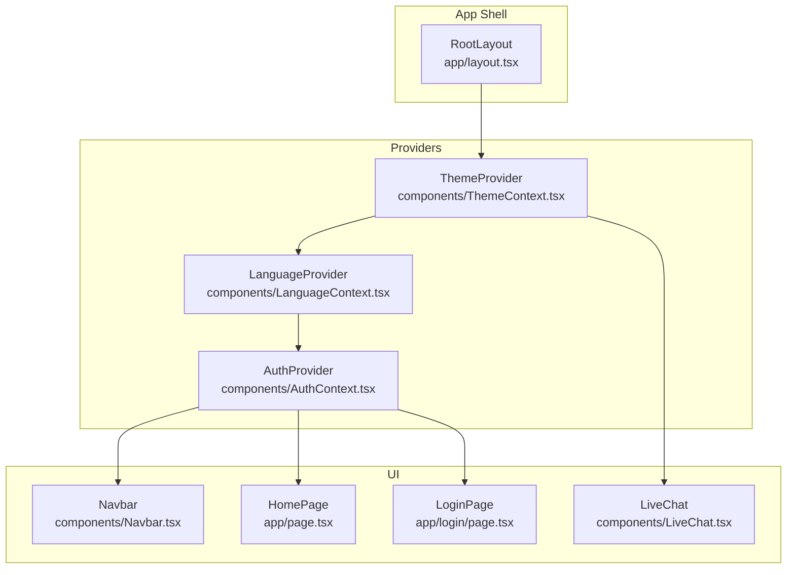
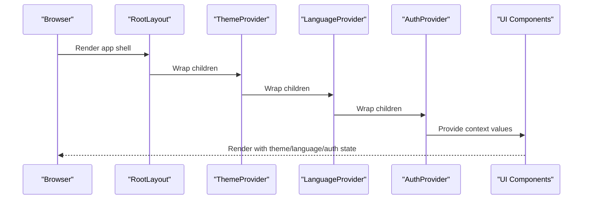
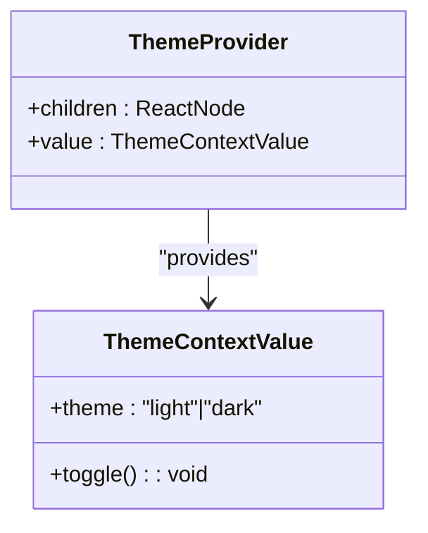
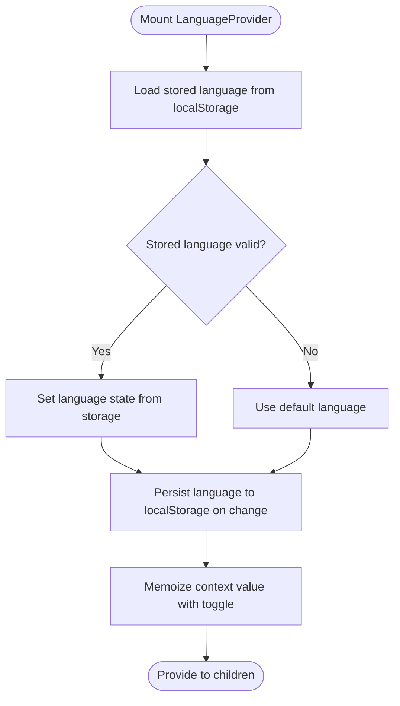
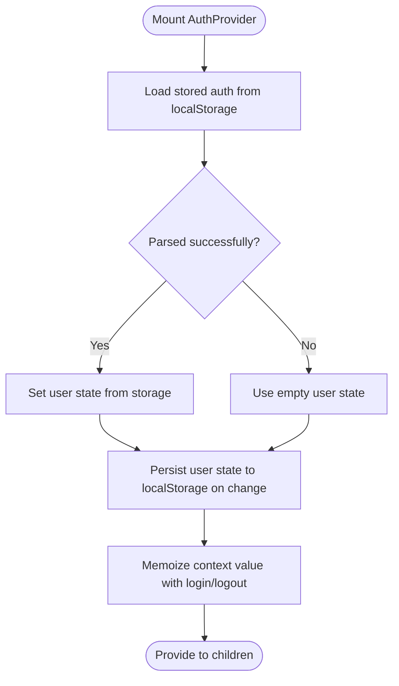
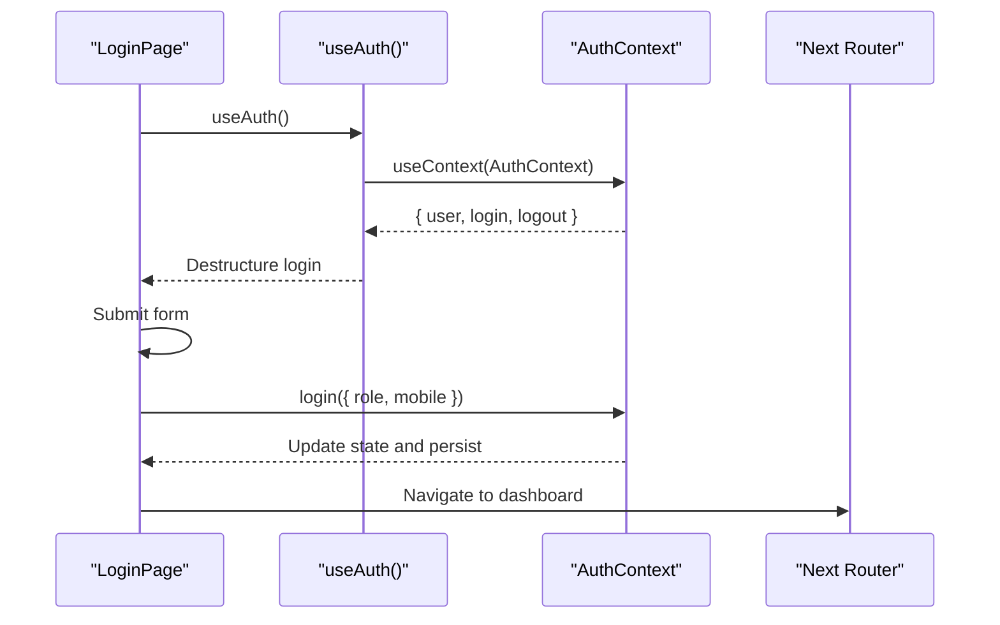
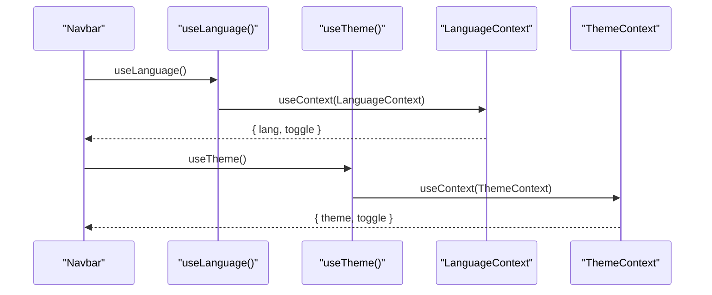
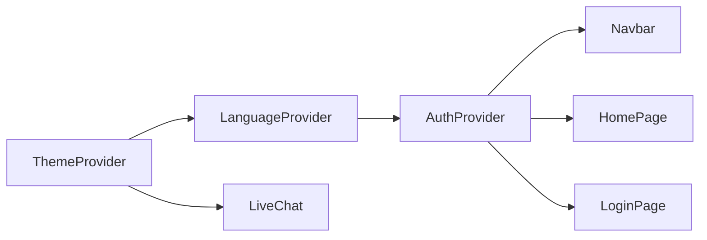

# Context Providers & State Management

<cite>
**Referenced Files in This Document**
- [ThemeContext.tsx](file://components/ThemeContext.tsx)
- [LanguageContext.tsx](file://components/LanguageContext.tsx)
- [AuthContext.tsx](file://components/AuthContext.tsx)
- [layout.tsx](file://app/layout.tsx)
- [theme-script.tsx](file://app/theme-script.tsx)
- [Navbar.tsx](file://components/Navbar.tsx)
- [LiveChat.tsx](file://components/LiveChat.tsx)
- [page.tsx](file://app/page.tsx)
- [login/page.tsx](file://app/login/page.tsx)
</cite>

## Table of Contents
1. [Introduction](#introduction)
2. [Project Structure](#project-structure)
3. [Core Components](#core-components)
4. [Architecture Overview](#architecture-overview)
5. [Detailed Component Analysis](#detailed-component-analysis)
6. [Dependency Analysis](#dependency-analysis)
7. [Performance Considerations](#performance-considerations)
8. [Troubleshooting Guide](#troubleshooting-guide)
9. [Conclusion](#conclusion)

## Introduction
This document explains the context providers architecture used to manage global state across the application. It focuses on the provider pattern implementation for ThemeContext, LanguageContext, and AuthContext, detailing how each context manages its state, how values are provided to child components, and how providers are nested in the application shell. It also covers how components consume context values, how state updates propagate through the component tree, and the separation of concerns achieved by isolating distinct state domains.

## Project Structure
The application uses a Next.js app directory structure with a dedicated components directory for shared UI and state management utilities. Providers are declared in the root layout and consumed by various pages and components.

**Diagram sources**
- [layout.tsx:17-46](file://app/layout.tsx#L17-L46)
- [ThemeContext.tsx:14-27](file://components/ThemeContext.tsx#L14-L27)
- [LanguageContext.tsx:23-50](file://components/LanguageContext.tsx#L23-L50)
- [AuthContext.tsx:29-60](file://components/AuthContext.tsx#L29-L60)
- [Navbar.tsx:19-60](file://components/Navbar.tsx#L19-L60)
- [LiveChat.tsx:12-50](file://components/LiveChat.tsx#L12-L50)
- [page.tsx:4-87](file://app/page.tsx#L4-L87)
- [login/page.tsx:7-125](file://app/login/page.tsx#L7-L125)

**Section sources**
- [layout.tsx:17-46](file://app/layout.tsx#L17-L46)

## Core Components
This section documents the three primary contexts and their responsibilities:

- ThemeContext: Manages the application’s theme state and exposes a toggle function. In this project, the theme is fixed to a light/white theme, and the toggle is a no-op.
- LanguageContext: Manages the application’s language state with persistence to localStorage and exposes a toggle function to switch between languages.
- AuthContext: Manages authentication state (role and mobile) with persistence to localStorage and exposes login and logout functions.

Each context defines:
- A typed context value interface
- A provider component that initializes state and exposes a memoized value
- A named hook to consume the context safely

Key implementation patterns:
- Client directive usage ("use client") ensures context state is client-side managed.
- useMemo is used to memoize the context value to prevent unnecessary re-renders.
- localStorage persistence is used for language and auth state to survive navigation and refreshes.
- Strict error handling in hooks throws descriptive errors when used outside providers.

**Section sources**
- [ThemeContext.tsx:14-33](file://components/ThemeContext.tsx#L14-L33)
- [LanguageContext.tsx:23-57](file://components/LanguageContext.tsx#L23-L57)
- [AuthContext.tsx:29-68](file://components/AuthContext.tsx#L29-L68)

## Architecture Overview
The provider hierarchy is established in the root layout. Providers wrap the entire application shell, enabling child components to access theme, language, and authentication state regardless of depth in the component tree.

Provider nesting order in RootLayout:
1. ThemeProvider wraps the entire shell.
2. LanguageProvider wraps the AuthProvider.
3. AuthProvider wraps the main content and UI components.

This order ensures that:
- Theme is available to all components.
- Language is available to all components.
- Authentication state is available to all components.

**Diagram sources**
- [layout.tsx:17-46](file://app/layout.tsx#L17-L46)
- [ThemeContext.tsx:14-27](file://components/ThemeContext.tsx#L14-L27)
- [LanguageContext.tsx:23-50](file://components/LanguageContext.tsx#L23-L50)
- [AuthContext.tsx:29-60](file://components/AuthContext.tsx#L29-L60)

**Section sources**
- [layout.tsx:17-46](file://app/layout.tsx#L17-L46)

## Detailed Component Analysis

### ThemeContext
Responsibilities:
- Provides a fixed light theme.
- Exposes a toggle function that does nothing (no-op).

Implementation highlights:
- Uses a memoized value to avoid re-renders.
- The provider is placed at the top of the hierarchy to ensure theme availability across the app.
- A theme script exists but is intentionally a no-op to enforce the light theme.

**Diagram sources**
- [ThemeContext.tsx:7-10](file://components/ThemeContext.tsx#L7-L10)
- [ThemeContext.tsx:14-27](file://components/ThemeContext.tsx#L14-L27)

**Section sources**
- [ThemeContext.tsx:14-33](file://components/ThemeContext.tsx#L14-L33)
- [theme-script.tsx:1-4](file://app/theme-script.tsx#L1-L4)

### LanguageContext
Responsibilities:
- Manages language selection with persistence.
- Exposes the current language and a toggle function.

Implementation highlights:
- Initializes language from localStorage on mount.
- Persists language changes to localStorage.
- Memoizes the context value to prevent unnecessary re-renders.

**Diagram sources**
- [LanguageContext.tsx:23-50](file://components/LanguageContext.tsx#L23-L50)

**Section sources**
- [LanguageContext.tsx:23-57](file://components/LanguageContext.tsx#L23-L57)

### AuthContext
Responsibilities:
- Manages authentication state (role and mobile).
- Exposes login and logout functions.
- Persists authentication state to localStorage.

Implementation highlights:
- Initializes auth state from localStorage on mount.
- Persists auth state to localStorage on every change.
- Memoizes the context value to prevent unnecessary re-renders.

**Diagram sources**
- [AuthContext.tsx:29-60](file://components/AuthContext.tsx#L29-L60)

**Section sources**
- [AuthContext.tsx:29-68](file://components/AuthContext.tsx#L29-L68)

### Consumer Examples

#### LoginPage consuming AuthContext
The login page demonstrates how a component consumes authentication state and triggers login actions.

**Diagram sources**
- [login/page.tsx:7-125](file://app/login/page.tsx#L7-L125)
- [AuthContext.tsx:29-60](file://components/AuthContext.tsx#L29-L60)

**Section sources**
- [login/page.tsx:7-125](file://app/login/page.tsx#L7-L125)
- [AuthContext.tsx:29-68](file://components/AuthContext.tsx#L29-L68)

#### Navbar consuming LanguageContext and ThemeContext
The navbar demonstrates how UI components can consume language and theme values. In the current implementation, language and theme are temporarily hardcoded to demonstrate the UI structure while keeping the hooks ready for future integration.

**Diagram sources**
- [Navbar.tsx:19-60](file://components/Navbar.tsx#L19-L60)
- [LanguageContext.tsx:52-57](file://components/LanguageContext.tsx#L52-L57)
- [ThemeContext.tsx:29-33](file://components/ThemeContext.tsx#L29-L33)

**Section sources**
- [Navbar.tsx:19-60](file://components/Navbar.tsx#L19-L60)
- [LanguageContext.tsx:52-57](file://components/LanguageContext.tsx#L52-L57)
- [ThemeContext.tsx:29-33](file://components/ThemeContext.tsx#L29-L33)

## Dependency Analysis
Provider dependencies and coupling:
- ThemeProvider has no internal dependencies on other contexts; it is at the top of the hierarchy.
- LanguageProvider depends on localStorage for persistence and memoization for stability.
- AuthProvider depends on localStorage for persistence and memoization for stability.
- RootLayout composes providers in a strict order to ensure availability of all contexts to child components.

Potential circular dependencies:
- None observed among the three contexts; each is self-contained and used by consumers rather than by other providers.

External dependencies:
- localStorage is used for persistence in LanguageContext and AuthContext.
- Environment variables are used for live chat provider configuration in LiveChat.

**Diagram sources**
- [layout.tsx:17-46](file://app/layout.tsx#L17-L46)
- [ThemeContext.tsx:14-27](file://components/ThemeContext.tsx#L14-L27)
- [LanguageContext.tsx:23-50](file://components/LanguageContext.tsx#L23-L50)
- [AuthContext.tsx:29-60](file://components/AuthContext.tsx#L29-L60)
- [LiveChat.tsx:12-50](file://components/LiveChat.tsx#L12-L50)

**Section sources**
- [layout.tsx:17-46](file://app/layout.tsx#L17-L46)

## Performance Considerations
- Memoization: Each provider uses useMemo to compute and cache the context value, preventing unnecessary re-renders when props or state do not change.
- LocalStorage persistence: Reduces repeated initialization and improves UX by restoring state across sessions.
- Minimal provider surface: Providers expose only essential functions and values, reducing overhead.
- Client directive: Ensures state remains client-side, avoiding server hydration mismatches.

## Troubleshooting Guide
Common issues and resolutions:
- Using hooks outside providers: All context hooks throw descriptive errors when used outside their respective providers. Ensure the provider hierarchy is intact in the root layout.
- Theme not changing: The theme provider is intentionally fixed to a light theme; toggling is disabled. If theme switching is desired, update the provider logic accordingly.
- Language not persisting: Verify localStorage availability and that the storage key matches the expected value. Confirm useEffect runs on the client.
- Auth state not persisting: Verify localStorage availability and that the storage key matches the expected value. Confirm JSON parsing and stringify logic.

**Section sources**
- [ThemeContext.tsx:29-33](file://components/ThemeContext.tsx#L29-L33)
- [LanguageContext.tsx:52-57](file://components/LanguageContext.tsx#L52-L57)
- [AuthContext.tsx:62-68](file://components/AuthContext.tsx#L62-L68)

## Conclusion
The provider pattern delivers a clean separation of concerns across three distinct state domains—theme, language, and authentication—while maintaining a simple, predictable hierarchy in the root layout. Consumers can access and update state without prop drilling, and memoization plus localStorage persistence ensure efficient rendering and a smooth user experience. As the application evolves, the existing provider structure supports incremental enhancements, such as enabling theme switching and integrating language toggling in UI components.