# Data Flow & Communication Patterns

<cite>
**Referenced Files in This Document**
- [app/layout.tsx](file://app/layout.tsx)
- [components/AuthContext.tsx](file://components/AuthContext.tsx)
- [components/ThemeContext.tsx](file://components/ThemeContext.tsx)
- [components/LanguageContext.tsx](file://components/LanguageContext.tsx)
- [components/Navbar.tsx](file://components/Navbar.tsx)
- [app/login/page.tsx](file://app/login/page.tsx)
- [app/dashboard/page.tsx](file://app/dashboard/page.tsx)
- [lib/prisma.ts](file://lib/prisma.ts)
- [lib/notifications.ts](file://lib/notifications.ts)
- [app/api/enquiries/route.ts](file://app/api/enquiries/route.ts)
- [app/api/orders/route.ts](file://app/api/orders/route.ts)
- [app/api/orders/[id]/route.ts](file://app/api/orders/[id]/route.ts)
- [app/api/partners/route.ts](file://app/api/partners/route.ts)
- [app/api/recommendations/route.ts](file://app/api/recommendations/route.ts)
- [package.json](file://package.json)
</cite>

## Table of Contents
1. [Introduction](#introduction)
2. [Project Structure](#project-structure)
3. [Core Components](#core-components)
4. [Architecture Overview](#architecture-overview)
5. [Detailed Component Analysis](#detailed-component-analysis)
6. [Dependency Analysis](#dependency-analysis)
7. [Performance Considerations](#performance-considerations)
8. [Troubleshooting Guide](#troubleshooting-guide)
9. [Conclusion](#conclusion)
10. [Appendices](#appendices)

## Introduction
This document explains the data flow architecture of the Shree Shyam Agency Portal. It traces how user interactions in React components propagate through context providers, API routes, and database operations. It documents authentication state flow, theme and language state propagation, and how API responses update component state. It also outlines separation between frontend state management and backend persistence, common data flow patterns (form submissions, authentication, and administrative updates), error handling, loading states, and caching strategies.

## Project Structure
The application follows a Next.js App Router structure with a root layout that wires global providers for authentication, theme, and language. Pages under app render UI and orchestrate data operations via API routes. Backend connectivity is handled by Prisma, with a guard ensuring database availability.

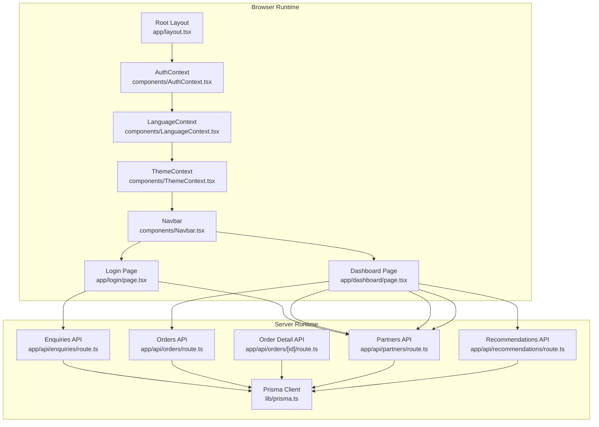

**Diagram sources**
- [app/layout.tsx:17-46](file://app/layout.tsx#L17-L46)
- [components/AuthContext.tsx:29-60](file://components/AuthContext.tsx#L29-L60)
- [components/LanguageContext.tsx:23-50](file://components/LanguageContext.tsx#L23-L50)
- [components/ThemeContext.tsx:14-27](file://components/ThemeContext.tsx#L14-L27)
- [components/Navbar.tsx:19-60](file://components/Navbar.tsx#L19-L60)
- [app/login/page.tsx:7-125](file://app/login/page.tsx#L7-L125)
- [app/dashboard/page.tsx:6-38](file://app/dashboard/page.tsx#L6-L38)
- [app/api/enquiries/route.ts:8-111](file://app/api/enquiries/route.ts#L8-L111)
- [app/api/orders/route.ts:10-129](file://app/api/orders/route.ts#L10-L129)
- [app/api/orders/[id]/route.ts:11-54](file://app/api/orders/[id]/route.ts#L11-L54)
- [app/api/partners/route.ts:10-174](file://app/api/partners/route.ts#L10-L174)
- [app/api/recommendations/route.ts:4-56](file://app/api/recommendations/route.ts#L4-L56)
- [lib/prisma.ts:1-22](file://lib/prisma.ts#L1-L22)

**Section sources**
- [app/layout.tsx:17-46](file://app/layout.tsx#L17-L46)
- [package.json:13-27](file://package.json#L13-L27)

## Core Components
- Authentication state: Managed in a client-side context provider with localStorage persistence for role and mobile. Exposes login/logout to update state and persist across sessions.
- Language state: Client-side context provider with localStorage persistence for language selection and a toggle function.
- Theme state: Client-side context provider that always uses a light theme; toggle is a no-op.
- Prisma client: Created conditionally when a database URL is present; otherwise, APIs fall back to in-memory storage for development.
- Notifications: Stubbed notification functions for partner applications, order confirmations, and status updates.

Key responsibilities:
- Frontend state management: Role, language, theme, and UI state live in React contexts and local storage.
- Backend data persistence: API routes write/read to/from the database via Prisma or in-memory arrays.

**Section sources**
- [components/AuthContext.tsx:14-70](file://components/AuthContext.tsx#L14-L70)
- [components/LanguageContext.tsx:14-59](file://components/LanguageContext.tsx#L14-L59)
- [components/ThemeContext.tsx:7-34](file://components/ThemeContext.tsx#L7-L34)
- [lib/prisma.ts:7-22](file://lib/prisma.ts#L7-L22)
- [lib/notifications.ts:6-28](file://lib/notifications.ts#L6-L28)

## Architecture Overview
The system separates frontend state from backend persistence:
- Frontend: React components consume context providers and manage UI state. LocalStorage persists small pieces of state (auth, language).
- Backend: API routes handle requests, validate payloads, and interact with Prisma. When DATABASE_URL is absent, routes use in-memory arrays for development.

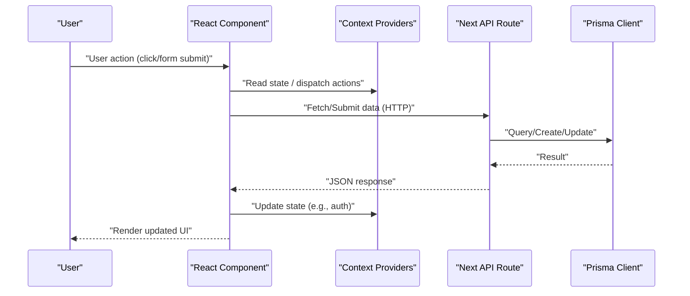

[No sources needed since this diagram shows conceptual workflow, not actual code structure]

## Detailed Component Analysis

### Authentication Flow: Login → Dashboard
This flow demonstrates how user interactions update authentication state and drive navigation.

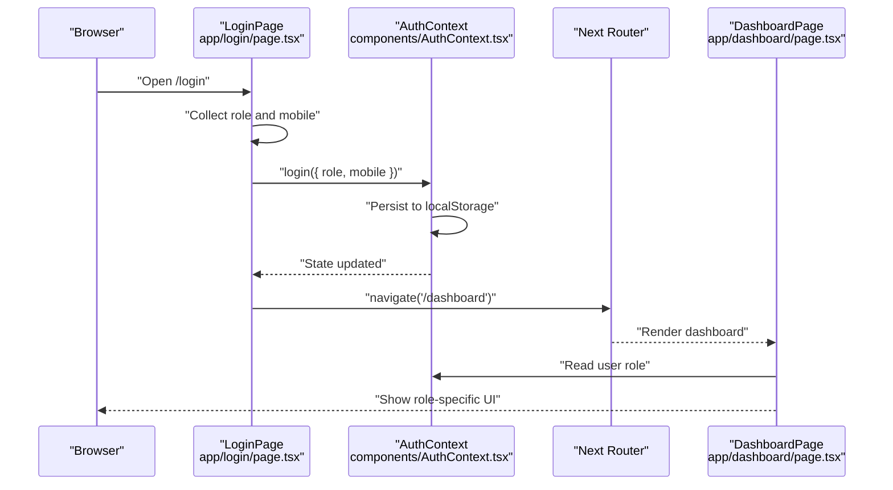

**Diagram sources**
- [app/login/page.tsx:57-121](file://app/login/page.tsx#L57-L121)
- [components/AuthContext.tsx:29-60](file://components/AuthContext.tsx#L29-L60)
- [app/dashboard/page.tsx:6-38](file://app/dashboard/page.tsx#L6-L38)

**Section sources**
- [app/login/page.tsx:7-125](file://app/login/page.tsx#L7-L125)
- [components/AuthContext.tsx:29-60](file://components/AuthContext.tsx#L29-L60)
- [app/dashboard/page.tsx:6-38](file://app/dashboard/page.tsx#L6-L38)

### Form Submission Flow: Enquiries
This pattern shows validation, persistence, and response handling for client-submitted data.

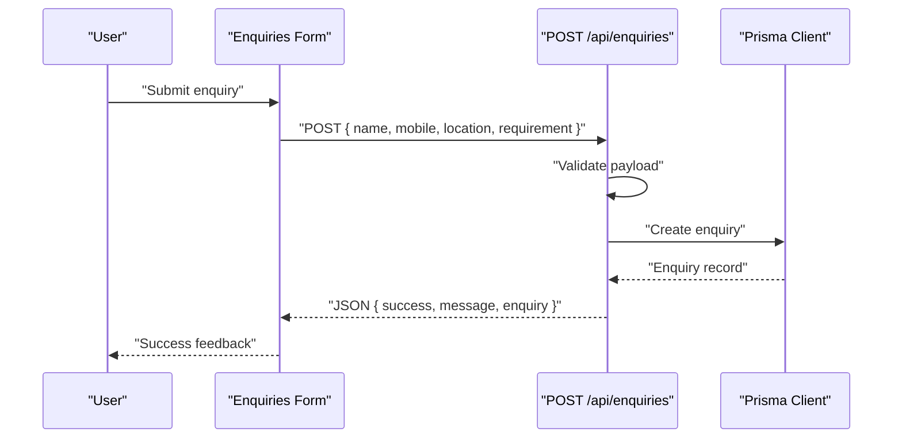

**Diagram sources**
- [app/api/enquiries/route.ts:8-81](file://app/api/enquiries/route.ts#L8-L81)
- [lib/prisma.ts:10-16](file://lib/prisma.ts#L10-L16)

**Section sources**
- [app/api/enquiries/route.ts:8-111](file://app/api/enquiries/route.ts#L8-L111)
- [lib/prisma.ts:10-16](file://lib/prisma.ts#L10-L16)

### Order Lifecycle: Creation → Assignment → Status Update
This sequence covers creation, retrieval, and administrative updates to orders.

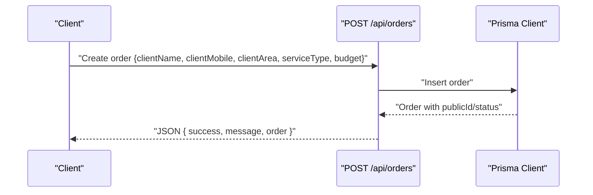

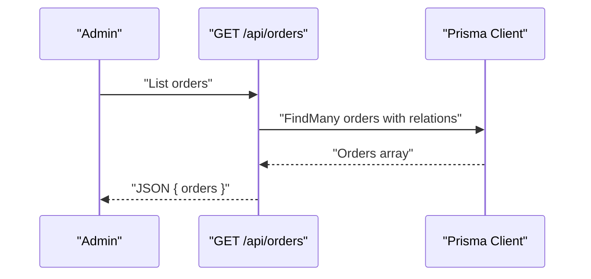

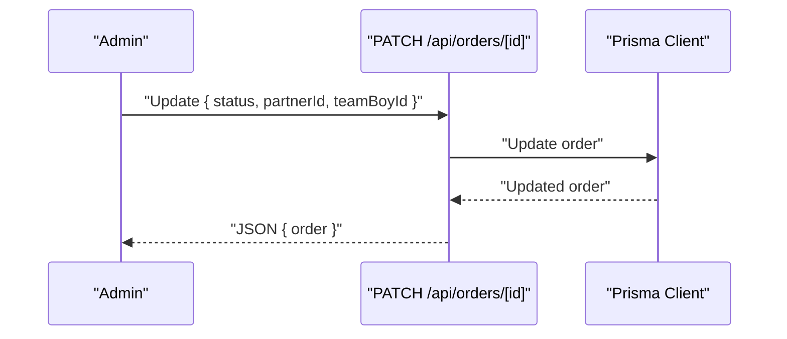

**Diagram sources**
- [app/api/orders/route.ts:38-129](file://app/api/orders/route.ts#L38-L129)
- [app/api/orders/[id]/route.ts:11-54](file://app/api/orders/[id]/route.ts#L11-L54)
- [lib/prisma.ts:10-16](file://lib/prisma.ts#L10-L16)

**Section sources**
- [app/api/orders/route.ts:10-129](file://app/api/orders/route.ts#L10-L129)
- [app/api/orders/[id]/route.ts:11-54](file://app/api/orders/[id]/route.ts#L11-L54)
- [lib/prisma.ts:10-16](file://lib/prisma.ts#L10-L16)

### Partner Application Flow: Validation → User/Payment Profile Creation
This flow demonstrates validation, user existence checks, and creation of partner profiles.

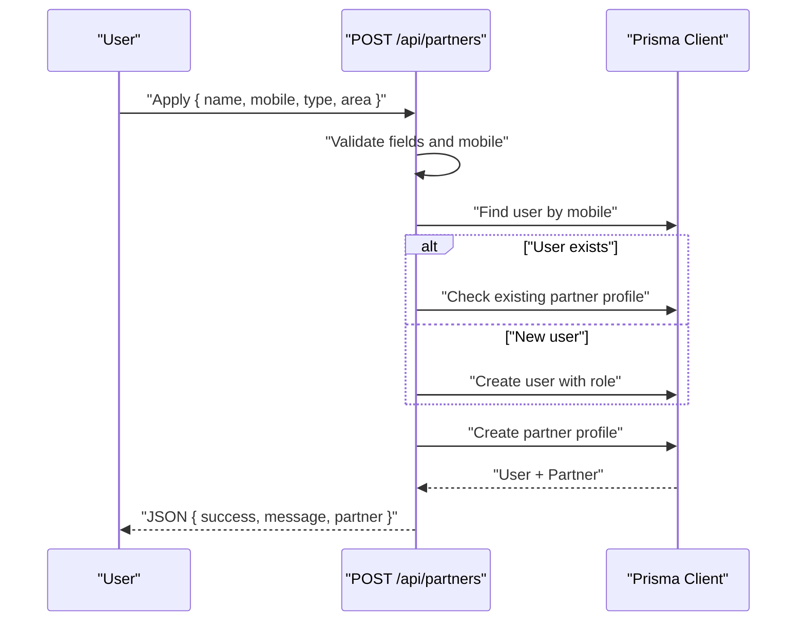

**Diagram sources**
- [app/api/partners/route.ts:43-174](file://app/api/partners/route.ts#L43-L174)
- [lib/prisma.ts:10-16](file://lib/prisma.ts#L10-L16)

**Section sources**
- [app/api/partners/route.ts:43-174](file://app/api/partners/route.ts#L43-L174)
- [lib/prisma.ts:10-16](file://lib/prisma.ts#L10-L16)

### Recommendation Engine Stub
A simple recommendation endpoint records a request and returns a generated suggestion.

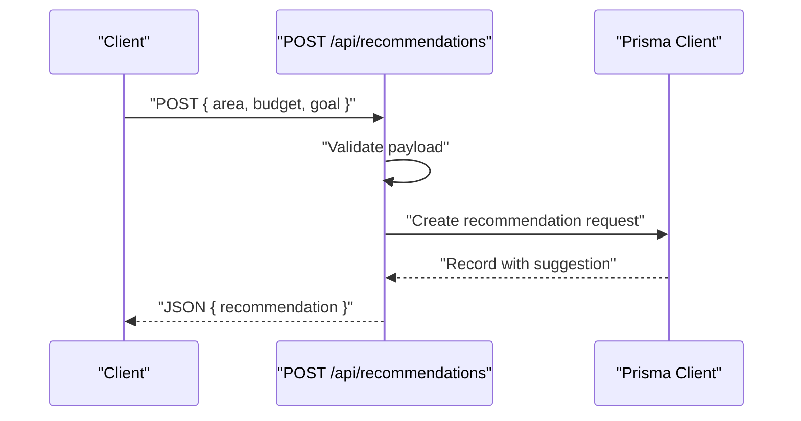

**Diagram sources**
- [app/api/recommendations/route.ts:4-56](file://app/api/recommendations/route.ts#L4-L56)
- [lib/prisma.ts:10-16](file://lib/prisma.ts#L10-L16)

**Section sources**
- [app/api/recommendations/route.ts:4-56](file://app/api/recommendations/route.ts#L4-L56)
- [lib/prisma.ts:10-16](file://lib/prisma.ts#L10-L16)

### State Propagation: Theme and Language
Theme and language are provided globally and persisted locally. The Navbar reads current language/theme and renders localized links.

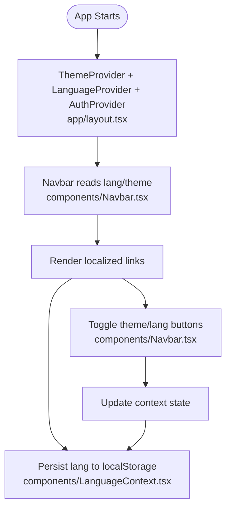

**Diagram sources**
- [app/layout.tsx:24-42](file://app/layout.tsx#L24-L42)
- [components/ThemeContext.tsx:14-27](file://components/ThemeContext.tsx#L14-L27)
- [components/LanguageContext.tsx:23-50](file://components/LanguageContext.tsx#L23-L50)
- [components/Navbar.tsx:19-60](file://components/Navbar.tsx#L19-L60)

**Section sources**
- [app/layout.tsx:24-42](file://app/layout.tsx#L24-L42)
- [components/ThemeContext.tsx:14-27](file://components/ThemeContext.tsx#L14-L27)
- [components/LanguageContext.tsx:23-50](file://components/LanguageContext.tsx#L23-L50)
- [components/Navbar.tsx:19-60](file://components/Navbar.tsx#L19-L60)

## Dependency Analysis
- Context providers depend on React’s Context API and localStorage for persistence.
- API routes depend on Prisma client initialization guarded by DATABASE_URL.
- Notifications module is decoupled and intended for future integration with external services.

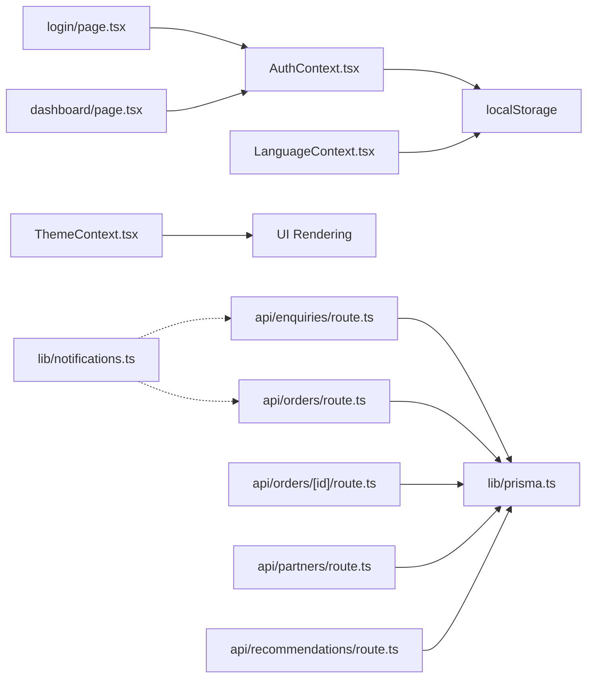

**Diagram sources**
- [components/AuthContext.tsx:29-60](file://components/AuthContext.tsx#L29-L60)
- [components/LanguageContext.tsx:23-50](file://components/LanguageContext.tsx#L23-L50)
- [components/ThemeContext.tsx:14-27](file://components/ThemeContext.tsx#L14-L27)
- [app/login/page.tsx:7-125](file://app/login/page.tsx#L7-L125)
- [app/dashboard/page.tsx:6-38](file://app/dashboard/page.tsx#L6-L38)
- [app/api/enquiries/route.ts:8-111](file://app/api/enquiries/route.ts#L8-L111)
- [app/api/orders/route.ts:10-129](file://app/api/orders/route.ts#L10-L129)
- [app/api/orders/[id]/route.ts:11-54](file://app/api/orders/[id]/route.ts#L11-L54)
- [app/api/partners/route.ts:10-174](file://app/api/partners/route.ts#L10-L174)
- [app/api/recommendations/route.ts:4-56](file://app/api/recommendations/route.ts#L4-L56)
- [lib/prisma.ts:10-16](file://lib/prisma.ts#L10-L16)
- [lib/notifications.ts:6-28](file://lib/notifications.ts#L6-L28)

**Section sources**
- [components/AuthContext.tsx:29-60](file://components/AuthContext.tsx#L29-L60)
- [components/LanguageContext.tsx:23-50](file://components/LanguageContext.tsx#L23-L50)
- [components/ThemeContext.tsx:14-27](file://components/ThemeContext.tsx#L14-L27)
- [app/api/enquiries/route.ts:8-111](file://app/api/enquiries/route.ts#L8-L111)
- [app/api/orders/route.ts:10-129](file://app/api/orders/route.ts#L10-L129)
- [app/api/orders/[id]/route.ts:11-54](file://app/api/orders/[id]/route.ts#L11-L54)
- [app/api/partners/route.ts:10-174](file://app/api/partners/route.ts#L10-L174)
- [app/api/recommendations/route.ts:4-56](file://app/api/recommendations/route.ts#L4-L56)
- [lib/prisma.ts:10-16](file://lib/prisma.ts#L10-L16)
- [lib/notifications.ts:6-28](file://lib/notifications.ts#L6-L28)

## Performance Considerations
- Conditional Prisma client creation: The client is only instantiated when DATABASE_URL is present, avoiding unnecessary overhead in environments without a database.
- In-memory fallback: API routes use in-memory arrays during development, reducing database round-trips for local testing.
- Context memoization: Context values are memoized to prevent unnecessary re-renders.
- LocalStorage persistence: Reduces server calls for small UI state (auth, language), but avoid storing sensitive data beyond non-secret identifiers.

[No sources needed since this section provides general guidance]

## Troubleshooting Guide
Common issues and remedies:
- Missing DATABASE_URL:
  - Symptom: API routes fall back to in-memory storage; database operations are not persisted.
  - Action: Set DATABASE_URL and redeploy; Prisma client will initialize normally.
- Invalid JSON payloads:
  - Symptom: API routes return 400 for malformed JSON.
  - Action: Validate request bodies before sending; ensure Content-Type is application/json.
- Validation failures:
  - Enquiries: Missing fields or invalid mobile number cause 400 responses.
  - Orders: Missing required fields or invalid service type cause 400 responses.
  - Partners: Missing fields, invalid mobile, or invalid partner type cause 400 responses.
- Order not found:
  - Symptom: GET /api/orders/[id] returns 404.
  - Action: Ensure the order ID exists and is correctly passed.
- Notification stubs:
  - Symptom: No emails/SMS sent.
  - Action: Integrate real providers in lib/notifications.ts.

**Section sources**
- [lib/prisma.ts:7-22](file://lib/prisma.ts#L7-L22)
- [app/api/enquiries/route.ts:15-30](file://app/api/enquiries/route.ts#L15-L30)
- [app/api/orders/route.ts:43-65](file://app/api/orders/route.ts#L43-L65)
- [app/api/orders/[id]/route.ts:22-24](file://app/api/orders/[id]/route.ts#L22-L24)
- [app/api/partners/route.ts:48-73](file://app/api/partners/route.ts#L48-L73)
- [lib/notifications.ts:6-28](file://lib/notifications.ts#L6-L28)

## Conclusion
The Shree Shyam Agency Portal cleanly separates frontend state management (contexts and localStorage) from backend persistence (Prisma). API routes encapsulate validation, persistence, and response formatting, enabling predictable data flows for forms, authentication, and administrative updates. The architecture supports development flexibility via in-memory fallbacks while maintaining a clear path to production-grade database operations and integrations.

## Appendices

### Data Flow Patterns Reference
- Form Submissions:
  - Enquiries: Validate fields and mobile; persist to DB or in-memory; return success payload.
  - Orders: Validate service type and fields; persist order; return minimal success payload.
  - Partners: Validate fields/mobile/type; upsert user and create partner profile; return success payload.
- Authentication:
  - Login page collects role and mobile; context login persists state; navigate to dashboard.
- Administrative Updates:
  - List orders; fetch order details; patch order status and assignees.
- Recommendations:
  - Validate payload; create request record; return suggestion.

[No sources needed since this section summarizes previously analyzed patterns]