# System Boundaries & Integration Points

<cite>
**Referenced Files in This Document**
- [app/layout.tsx](file://app/layout.tsx)
- [components/Navbar.tsx](file://components/Navbar.tsx)
- [components/Footer.tsx](file://components/Footer.tsx)
- [components/AuthContext.tsx](file://components/AuthContext.tsx)
- [components/LiveChat.tsx](file://components/LiveChat.tsx)
- [lib/prisma.ts](file://lib/prisma.ts)
- [prisma/schema.prisma](file://prisma/schema.prisma)
- [app/api/enquiries/route.ts](file://app/api/enquiries/route.ts)
- [app/api/orders/route.ts](file://app/api/orders/route.ts)
- [app/api/orders/[id]/route.ts](file://app/api/orders/[id]/route.ts)
- [app/api/partners/route.ts](file://app/api/partners/route.ts)
- [app/api/payments/create/route.ts](file://app/api/payments/create/route.ts)
- [app/api/recommendations/route.ts](file://app/api/recommendations/route.ts)
- [package.json](file://package.json)
- [next.config.mjs](file://next.config.mjs)
</cite>

## Table of Contents
1. [Introduction](#introduction)
2. [Project Structure](#project-structure)
3. [Core Components](#core-components)
4. [Architecture Overview](#architecture-overview)
5. [Detailed Component Analysis](#detailed-component-analysis)
6. [Dependency Analysis](#dependency-analysis)
7. [Performance Considerations](#performance-considerations)
8. [Troubleshooting Guide](#troubleshooting-guide)
9. [Conclusion](#conclusion)
10. [Appendices](#appendices)

## Introduction
This document defines the system boundaries and integration points for the Shree Shyam Agency Portal built with Next.js 14 App Router. It separates frontend React components from backend API routes, documents the database integration boundary via Prisma ORM, and explains external integrations such as live chat and payment providers. It also outlines API boundary definitions, request/response patterns, error handling, communication flows, security considerations, and extensibility points for future integrations.

## Project Structure
The application follows a layered structure:
- Frontend: Next.js App Router pages and client components under app/ and components/.
- Backend: API routes under app/api/ implementing REST-like endpoints.
- Data: Prisma ORM model definitions and client initialization under lib/ and prisma/.
- Integrations: Live chat widgets loaded client-side via components/LiveChat.tsx.

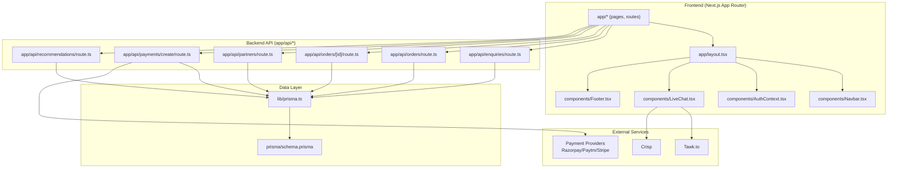

**Diagram sources**
- [app/layout.tsx:17-46](file://app/layout.tsx#L17-L46)
- [components/Navbar.tsx:19-60](file://components/Navbar.tsx#L19-L60)
- [components/Footer.tsx:1-17](file://components/Footer.tsx#L1-L17)
- [components/AuthContext.tsx:29-60](file://components/AuthContext.tsx#L29-L60)
- [components/LiveChat.tsx:12-47](file://components/LiveChat.tsx#L12-L47)
- [app/api/enquiries/route.ts:8-81](file://app/api/enquiries/route.ts#L8-L81)
- [app/api/orders/route.ts:10-129](file://app/api/orders/route.ts#L10-L129)
- [app/api/orders/[id]/route.ts:11-54](file://app/api/orders/[id]/route.ts#L11-L54)
- [app/api/partners/route.ts:10-174](file://app/api/partners/route.ts#L10-L174)
- [app/api/payments/create/route.ts:5-46](file://app/api/payments/create/route.ts#L5-L46)
- [app/api/recommendations/route.ts:4-56](file://app/api/recommendations/route.ts#L4-L56)
- [lib/prisma.ts:1-22](file://lib/prisma.ts#L1-L22)
- [prisma/schema.prisma:1-173](file://prisma/schema.prisma#L1-L173)

**Section sources**
- [app/layout.tsx:17-46](file://app/layout.tsx#L17-L46)
- [components/Navbar.tsx:19-60](file://components/Navbar.tsx#L19-L60)
- [components/Footer.tsx:1-17](file://components/Footer.tsx#L1-L17)
- [components/AuthContext.tsx:29-60](file://components/AuthContext.tsx#L29-L60)
- [components/LiveChat.tsx:12-47](file://components/LiveChat.tsx#L12-L47)
- [lib/prisma.ts:1-22](file://lib/prisma.ts#L1-L22)
- [prisma/schema.prisma:1-173](file://prisma/schema.prisma#L1-L173)

## Core Components
- Frontend shell and providers:
  - Root layout composes providers for theme, language, and authentication, and renders shared UI (navbar, footer, live chat).
  - Authentication context stores role and mobile in local storage for session persistence.
  - Live chat component dynamically injects third-party chat SDKs client-side.
- Backend API routes:
  - Enquiries: submit and list customer inquiries.
  - Orders: list, create, and update orders with status and assignees.
  - Partners: list and create partner applications with validation.
  - Payments: stub endpoint to initialize a payment record and return gateway metadata.
  - Recommendations: stub endpoint to generate service recommendations and persist requests.
- Data layer:
  - Prisma client initialized conditionally based on DATABASE_URL.
  - Strongly typed models define entities, enums, relations, and indexes.

**Section sources**
- [app/layout.tsx:17-46](file://app/layout.tsx#L17-L46)
- [components/AuthContext.tsx:29-60](file://components/AuthContext.tsx#L29-L60)
- [components/LiveChat.tsx:12-47](file://components/LiveChat.tsx#L12-L47)
- [app/api/enquiries/route.ts:8-81](file://app/api/enquiries/route.ts#L8-L81)
- [app/api/orders/route.ts:10-129](file://app/api/orders/route.ts#L10-L129)
- [app/api/orders/[id]/route.ts:11-54](file://app/api/orders/[id]/route.ts#L11-L54)
- [app/api/partners/route.ts:10-174](file://app/api/partners/route.ts#L10-L174)
- [app/api/payments/create/route.ts:5-46](file://app/api/payments/create/route.ts#L5-L46)
- [app/api/recommendations/route.ts:4-56](file://app/api/recommendations/route.ts#L4-L56)
- [lib/prisma.ts:1-22](file://lib/prisma.ts#L1-L22)
- [prisma/schema.prisma:1-173](file://prisma/schema.prisma#L1-L173)

## Architecture Overview
The system enforces clear boundaries:
- Frontend boundary: React components and contexts render UI and manage client-side state.
- API boundary: Next.js App Router API routes handle HTTP requests/responses and coordinate with the data layer.
- Data boundary: Prisma client encapsulates database operations behind a single interface.
- External integration boundaries: Live chat SDKs and payment provider gateways are integrated via environment-driven client-side loading and server stubs.

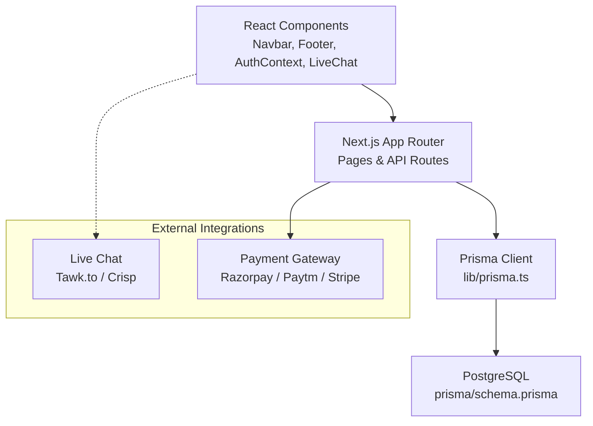

**Diagram sources**
- [app/layout.tsx:17-46](file://app/layout.tsx#L17-L46)
- [components/LiveChat.tsx:12-47](file://components/LiveChat.tsx#L12-L47)
- [lib/prisma.ts:1-22](file://lib/prisma.ts#L1-L22)
- [prisma/schema.prisma:1-173](file://prisma/schema.prisma#L1-L173)
- [app/api/payments/create/route.ts:5-46](file://app/api/payments/create/route.ts#L5-L46)

## Detailed Component Analysis

### Frontend Boundary: Layout, Navigation, Authentication, and Live Chat
- Root layout composes providers and renders shared UI. It also includes a floating WhatsApp link and mounts the LiveChat component.
- Navbar provides navigation links and temporary theme/language toggles.
- Footer displays agency information and legal text.
- AuthContext manages role and mobile state, persists to localStorage, and exposes login/logout to descendants.
- LiveChat loads Tawk.to or Crisp SDKs based on environment variables and provider selection.

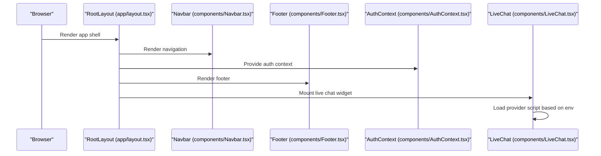

**Diagram sources**
- [app/layout.tsx:17-46](file://app/layout.tsx#L17-L46)
- [components/Navbar.tsx:19-60](file://components/Navbar.tsx#L19-L60)
- [components/Footer.tsx:1-17](file://components/Footer.tsx#L1-L17)
- [components/AuthContext.tsx:29-60](file://components/AuthContext.tsx#L29-L60)
- [components/LiveChat.tsx:12-47](file://components/LiveChat.tsx#L12-L47)

**Section sources**
- [app/layout.tsx:17-46](file://app/layout.tsx#L17-L46)
- [components/Navbar.tsx:19-60](file://components/Navbar.tsx#L19-L60)
- [components/Footer.tsx:1-17](file://components/Footer.tsx#L1-L17)
- [components/AuthContext.tsx:29-60](file://components/AuthContext.tsx#L29-L60)
- [components/LiveChat.tsx:12-47](file://components/LiveChat.tsx#L12-L47)

### Backend API Boundary: Enquiries
- Endpoint: POST /api/enquiries
  - Validates presence of required fields and basic mobile format.
  - Persists to database if DATABASE_URL is present; otherwise uses in-memory storage.
  - Returns standardized success/error response.
- Endpoint: GET /api/enquiries
  - Lists enquiries ordered by creation date.
  - Uses database or in-memory storage depending on configuration.

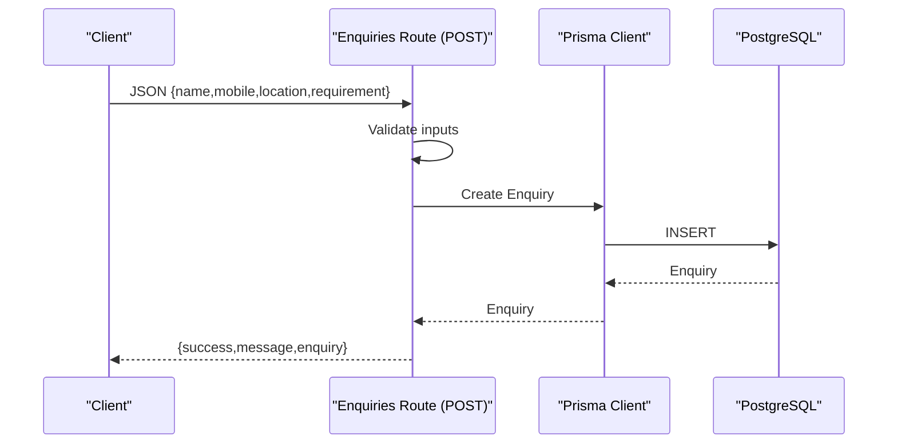

**Diagram sources**
- [app/api/enquiries/route.ts:8-81](file://app/api/enquiries/route.ts#L8-L81)
- [lib/prisma.ts:1-22](file://lib/prisma.ts#L1-L22)
- [prisma/schema.prisma:146-158](file://prisma/schema.prisma#L146-L158)

**Section sources**
- [app/api/enquiries/route.ts:8-81](file://app/api/enquiries/route.ts#L8-L81)
- [lib/prisma.ts:1-22](file://lib/prisma.ts#L1-L22)
- [prisma/schema.prisma:146-158](file://prisma/schema.prisma#L146-L158)

### Backend API Boundary: Orders
- Endpoint: GET /api/orders
  - Fetches orders with related client/partner/team-boy data.
  - Uses database or in-memory storage.
- Endpoint: POST /api/orders
  - Validates required fields and service type enum.
  - Generates publicId (SSA-XXXX) and creates order.
  - Returns standardized success/error response.
- Endpoint: GET /api/orders/[id]
  - Retrieves a single order with related entities.
  - Returns 404 if not found.
- Endpoint: PATCH /api/orders/[id]
  - Updates status and optional assignees (partnerId/teamBoyId).

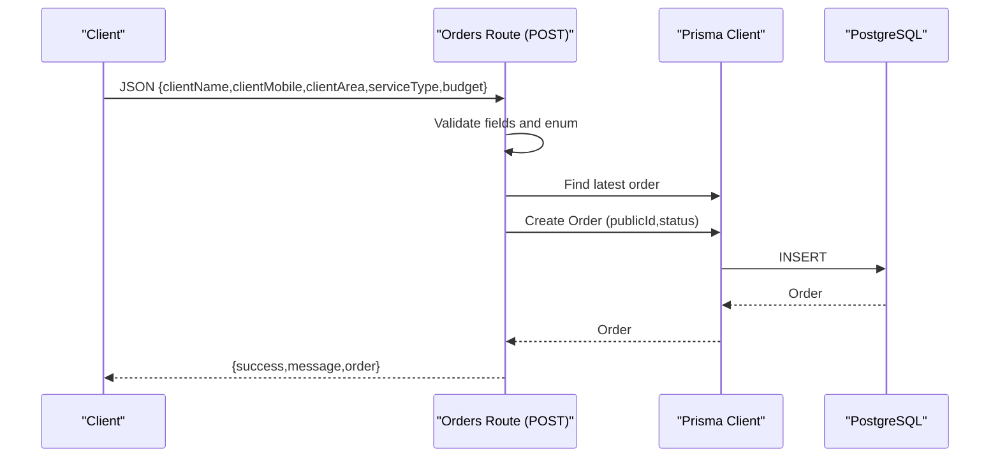

**Diagram sources**
- [app/api/orders/route.ts:38-129](file://app/api/orders/route.ts#L38-L129)
- [lib/prisma.ts:1-22](file://lib/prisma.ts#L1-L22)
- [prisma/schema.prisma:91-123](file://prisma/schema.prisma#L91-L123)

**Section sources**
- [app/api/orders/route.ts:10-129](file://app/api/orders/route.ts#L10-L129)
- [app/api/orders/[id]/route.ts:11-54](file://app/api/orders/[id]/route.ts#L11-L54)
- [lib/prisma.ts:1-22](file://lib/prisma.ts#L1-L22)
- [prisma/schema.prisma:91-123](file://prisma/schema.prisma#L91-L123)

### Backend API Boundary: Partners
- Endpoint: GET /api/partners
  - Lists partners with included user details.
  - Uses database or in-memory mapping.
- Endpoint: POST /api/partners
  - Validates name, mobile (10 digits), type enum, area.
  - Creates or reuses user with role TEAM_BOY, then creates partner profile.
  - Prevents duplicate applications.
  - Returns standardized success/error response.

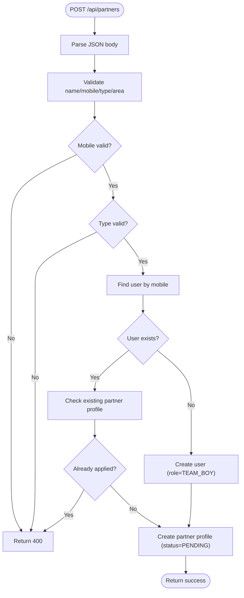

**Diagram sources**
- [app/api/partners/route.ts:43-174](file://app/api/partners/route.ts#L43-L174)
- [lib/prisma.ts:1-22](file://lib/prisma.ts#L1-L22)
- [prisma/schema.prisma:73-89](file://prisma/schema.prisma#L73-L89)

**Section sources**
- [app/api/partners/route.ts:10-174](file://app/api/partners/route.ts#L10-L174)
- [lib/prisma.ts:1-22](file://lib/prisma.ts#L1-L22)
- [prisma/schema.prisma:73-89](file://prisma/schema.prisma#L73-L89)

### Backend API Boundary: Payments
- Endpoint: POST /api/payments/create
  - Validates JSON and required fields (orderId, amount, provider).
  - Creates a payment record with status CREATED.
  - Returns payment object and gateway metadata (placeholder).
  - Note: Real gateway integration would be added here.

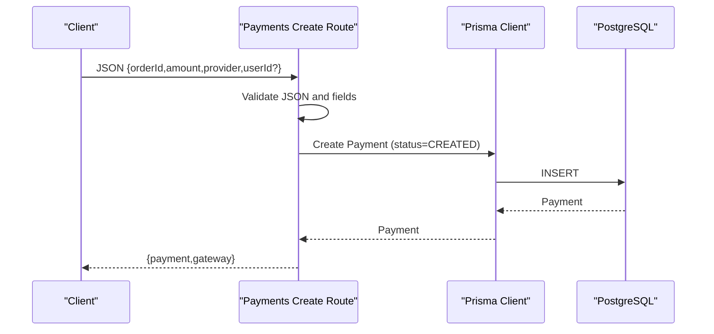

**Diagram sources**
- [app/api/payments/create/route.ts:5-46](file://app/api/payments/create/route.ts#L5-L46)
- [lib/prisma.ts:1-22](file://lib/prisma.ts#L1-L22)
- [prisma/schema.prisma:125-144](file://prisma/schema.prisma#L125-L144)

**Section sources**
- [app/api/payments/create/route.ts:5-46](file://app/api/payments/create/route.ts#L5-L46)
- [lib/prisma.ts:1-22](file://lib/prisma.ts#L1-L22)
- [prisma/schema.prisma:125-144](file://prisma/schema.prisma#L125-L144)

### Backend API Boundary: Recommendations
- Endpoint: POST /api/recommendations
  - Validates area and budget.
  - Builds a sample recommendation mix.
  - Persists recommendation request with suggestion JSON.
  - Returns persisted record.

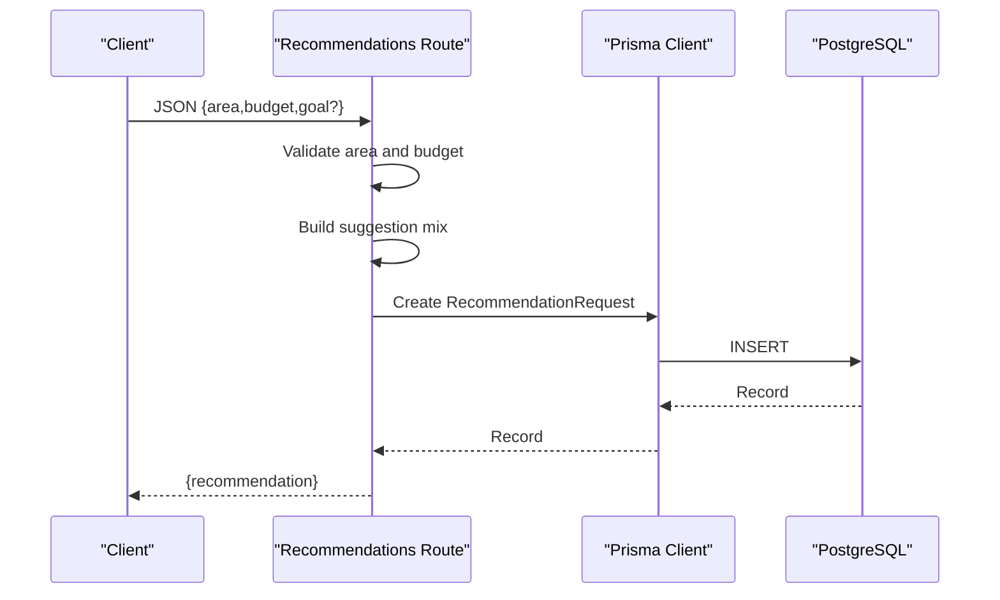

**Diagram sources**
- [app/api/recommendations/route.ts:4-56](file://app/api/recommendations/route.ts#L4-L56)
- [lib/prisma.ts:1-22](file://lib/prisma.ts#L1-L22)
- [prisma/schema.prisma:160-171](file://prisma/schema.prisma#L160-L171)

**Section sources**
- [app/api/recommendations/route.ts:4-56](file://app/api/recommendations/route.ts#L4-L56)
- [lib/prisma.ts:1-22](file://lib/prisma.ts#L1-L22)
- [prisma/schema.prisma:160-171](file://prisma/schema.prisma#L160-L171)

### Database Integration Boundary: Prisma ORM
- Initialization:
  - Conditional Prisma client creation based on DATABASE_URL.
  - Global singleton pattern to avoid multiple clients in development.
- Schema:
  - Entities: User, PartnerProfile, Order, Payment, Enquiry, RecommendationRequest.
  - Enums: UserRole, PartnerType, OrderStatus, ServiceType, PaymentStatus, PaymentProvider.
  - Relations: Users can have PartnerProfile; Orders relate to Clients, CreatedBy, Partner, TeamBoy; Payments link to Orders and Users.
  - Indexes: Mobile and status indexing on Enquiry.

```mermaid
erDiagram
USER {
string id PK
string mobile UK
string name
string email UK
enum role
datetime createdAt
datetime updatedAt
}
PARTNER_PROFILE {
string id PK
string userId UK FK
enum type
string area
string idProofUrl
string status
decimal walletBalance
decimal commissionRate
datetime createdAt
datetime updatedAt
}
ORDER {
string id PK
string publicId UK
string clientName
string clientMobile
string clientArea
enum serviceType
enum status
decimal budget
decimal totalAmount
string clientId FK
string createdById FK
string partnerId FK
string teamBoyId FK
json meta
datetime createdAt
datetime updatedAt
}
PAYMENT {
string id PK
string orderId FK
string userId FK
decimal amount
string currency
enum status
enum provider
string providerPaymentId
json meta
datetime createdAt
datetime paidAt
}
ENQUIRY {
string id PK
string name
string mobile
string location
string requirement
string status
datetime createdAt
datetime updatedAt
}
RECOMMENDATION_REQUEST {
string id PK
string area
decimal budget
string goal
string servicesHint
json suggestion
datetime createdAt
}
USER ||--o| PARTNER_PROFILE : "has"
USER ||--o{ ORDER : "created"
USER ||--o{ ORDER : "client"
USER ||--o{ PAYMENT : "user payments"
PARTNER_PROFILE ||--o{ ORDER : "assigned"
PARTNER_PROFILE ||--o{ ORDER : "team boy orders"
ORDER ||--o{ PAYMENT : "payments"
```

**Diagram sources**
- [prisma/schema.prisma:57-71](file://prisma/schema.prisma#L57-L71)
- [prisma/schema.prisma:73-89](file://prisma/schema.prisma#L73-L89)
- [prisma/schema.prisma:91-123](file://prisma/schema.prisma#L91-L123)
- [prisma/schema.prisma:125-144](file://prisma/schema.prisma#L125-L144)
- [prisma/schema.prisma:146-158](file://prisma/schema.prisma#L146-L158)
- [prisma/schema.prisma:160-171](file://prisma/schema.prisma#L160-L171)

**Section sources**
- [lib/prisma.ts:1-22](file://lib/prisma.ts#L1-L22)
- [prisma/schema.prisma:1-173](file://prisma/schema.prisma#L1-L173)

### External Integrations: Live Chat
- Client-side injection of Tawk.to or Crisp SDKs based on NEXT_PUBLIC_* environment variables.
- Provider selection is configurable; scripts are appended to head/body and removed on unmount.

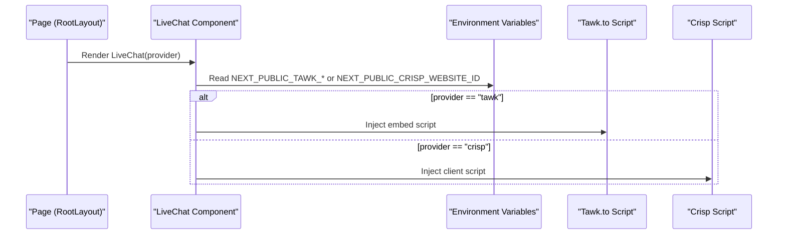

**Diagram sources**
- [app/layout.tsx:39-39](file://app/layout.tsx#L39-L39)
- [components/LiveChat.tsx:12-47](file://components/LiveChat.tsx#L12-L47)

**Section sources**
- [components/LiveChat.tsx:12-47](file://components/LiveChat.tsx#L12-L47)
- [app/layout.tsx:39-39](file://app/layout.tsx#L39-L39)

### External Integrations: Payment Providers
- Current implementation:
  - Server stub initializes a Payment record and returns gateway metadata placeholder.
- Future integration points:
  - Replace placeholder with actual gateway SDK calls.
  - Add webhooks endpoint to handle payment confirmations and updates.

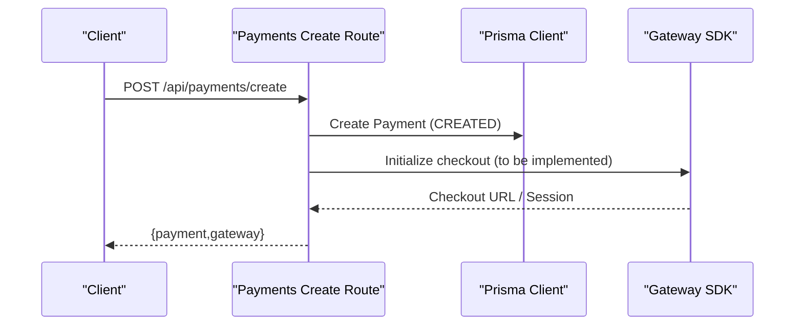

**Diagram sources**
- [app/api/payments/create/route.ts:5-46](file://app/api/payments/create/route.ts#L5-L46)
- [lib/prisma.ts:1-22](file://lib/prisma.ts#L1-L22)

**Section sources**
- [app/api/payments/create/route.ts:5-46](file://app/api/payments/create/route.ts#L5-L46)
- [lib/prisma.ts:1-22](file://lib/prisma.ts#L1-L22)

## Dependency Analysis
- Frontend-to-API:
  - Pages/components call API routes via standard fetch/axios.
  - Authentication context influences UI visibility and admin-only endpoints.
- API-to-Data:
  - All API routes depend on lib/prisma.ts for database operations.
  - Prisma client depends on DATABASE_URL and PostgreSQL.
- External-to-System:
  - Live chat SDKs are loaded client-side based on environment variables.
  - Payment gateway integration is currently stubbed; environment variables for gateway credentials are not yet used.

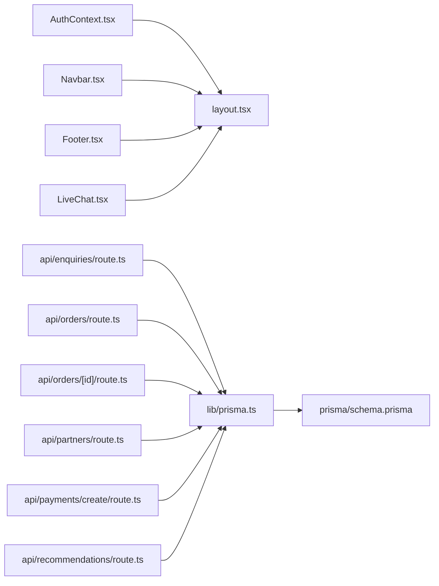

**Diagram sources**
- [components/AuthContext.tsx:29-60](file://components/AuthContext.tsx#L29-L60)
- [app/layout.tsx:17-46](file://app/layout.tsx#L17-L46)
- [components/Navbar.tsx:19-60](file://components/Navbar.tsx#L19-L60)
- [components/Footer.tsx:1-17](file://components/Footer.tsx#L1-L17)
- [components/LiveChat.tsx:12-47](file://components/LiveChat.tsx#L12-L47)
- [app/api/enquiries/route.ts:8-81](file://app/api/enquiries/route.ts#L8-L81)
- [app/api/orders/route.ts:10-129](file://app/api/orders/route.ts#L10-L129)
- [app/api/orders/[id]/route.ts:11-54](file://app/api/orders/[id]/route.ts#L11-L54)
- [app/api/partners/route.ts:10-174](file://app/api/partners/route.ts#L10-L174)
- [app/api/payments/create/route.ts:5-46](file://app/api/payments/create/route.ts#L5-L46)
- [app/api/recommendations/route.ts:4-56](file://app/api/recommendations/route.ts#L4-L56)
- [lib/prisma.ts:1-22](file://lib/prisma.ts#L1-L22)
- [prisma/schema.prisma:1-173](file://prisma/schema.prisma#L1-L173)

**Section sources**
- [package.json:13-28](file://package.json#L13-L28)
- [next.config.mjs:1-14](file://next.config.mjs#L1-L14)

## Performance Considerations
- Database connectivity:
  - Conditional Prisma client creation avoids unnecessary connections when DATABASE_URL is not set.
  - Use connection pooling and indexes (as defined in schema) to optimize queries.
- API response sizes:
  - Use selective includes and pagination for large lists (orders, enquiries).
- Client-side integrations:
  - Lazy-load live chat SDKs only when needed.
  - Avoid redundant script injections by checking environment variables before loading.
- Caching:
  - Consider caching static recommendations and partner listings where appropriate.

[No sources needed since this section provides general guidance]

## Troubleshooting Guide
- Missing DATABASE_URL:
  - Behavior: API routes fall back to in-memory storage; database operations are disabled.
  - Impact: Data does not persist across server restarts.
  - Resolution: Set DATABASE_URL and redeploy.
- Invalid JSON payloads:
  - Behavior: API routes return 400 with error message.
  - Resolution: Validate request body before sending.
- Validation errors:
  - Enquiries: Missing fields or invalid mobile format cause 400.
  - Orders: Missing required fields or invalid service type cause 400.
  - Partners: Missing fields, invalid mobile, or invalid type cause 400; duplicate applications blocked.
- Payment gateway integration:
  - Current stub returns a placeholder checkout URL; implement gateway SDK calls and webhook handling.
- Live chat not appearing:
  - Ensure NEXT_PUBLIC_TAWK_PROPERTY_ID/NEXT_PUBLIC_TAWK_WIDGET_ID or NEXT_PUBLIC_CRISP_WEBSITE_ID is set.

**Section sources**
- [lib/prisma.ts:7-20](file://lib/prisma.ts#L7-L20)
- [app/api/enquiries/route.ts:15-30](file://app/api/enquiries/route.ts#L15-L30)
- [app/api/orders/route.ts:43-65](file://app/api/orders/route.ts#L43-L65)
- [app/api/partners/route.ts:48-73](file://app/api/partners/route.ts#L48-L73)
- [components/LiveChat.tsx:16-19](file://components/LiveChat.tsx#L16-L19)
- [components/LiveChat.tsx:32-34](file://components/LiveChat.tsx#L32-L34)

## Conclusion
The Shree Shyam Agency Portal enforces clear boundaries between frontend React components and backend API routes, with a robust Prisma ORM layer mediating database operations. External integrations are cleanly separated: live chat SDKs are loaded client-side, while payment provider integration is stubbed for future implementation. Standardized request/response patterns and error handling improve maintainability. Extensibility is supported by environment-driven configurations and modular API routes.

[No sources needed since this section summarizes without analyzing specific files]

## Appendices

### API Boundary Definitions and Patterns
- Request/Response:
  - All API routes accept JSON bodies and return JSON responses.
  - Validation occurs at route level; errors return structured messages with appropriate HTTP status codes.
- Error handling:
  - 400 for bad input/validation failures.
  - 404 for resource-not-found scenarios.
  - 500 for internal server errors with generic messages.
- Security considerations:
  - Admin-only access is not enforced in current routes; add middleware to protect sensitive endpoints.
  - Sanitize and validate inputs rigorously; consider rate limiting and input length limits.
  - Store secrets in environment variables; avoid exposing gateway credentials in client code.
  - Use HTTPS and secure cookies for authentication if extended to sessions.

[No sources needed since this section provides general guidance]