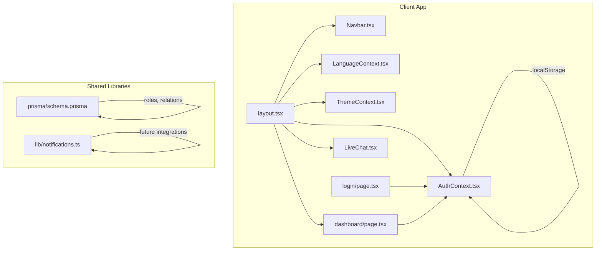
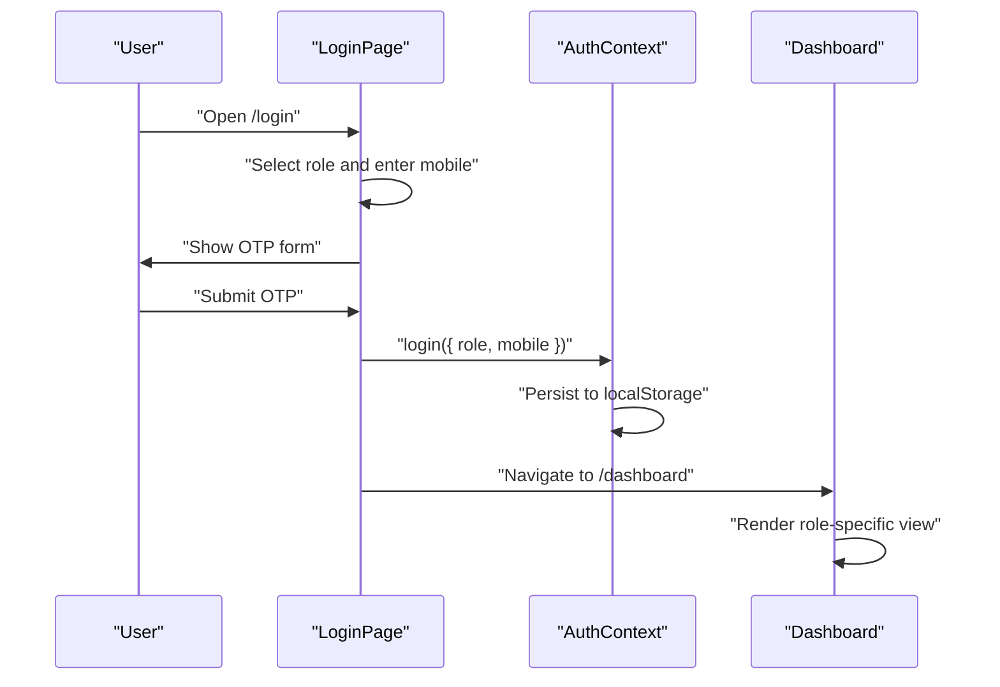
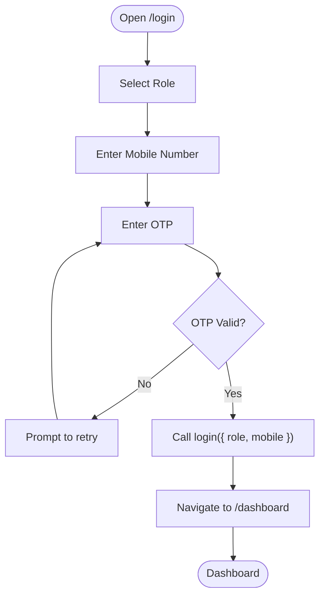
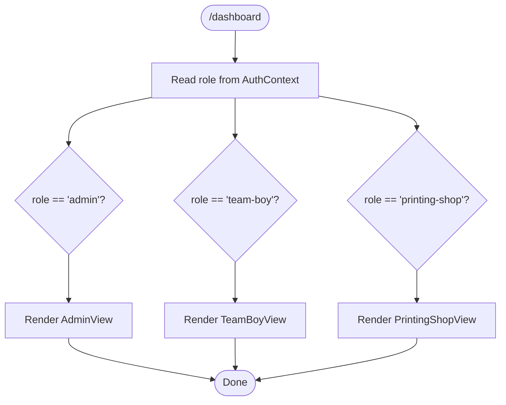
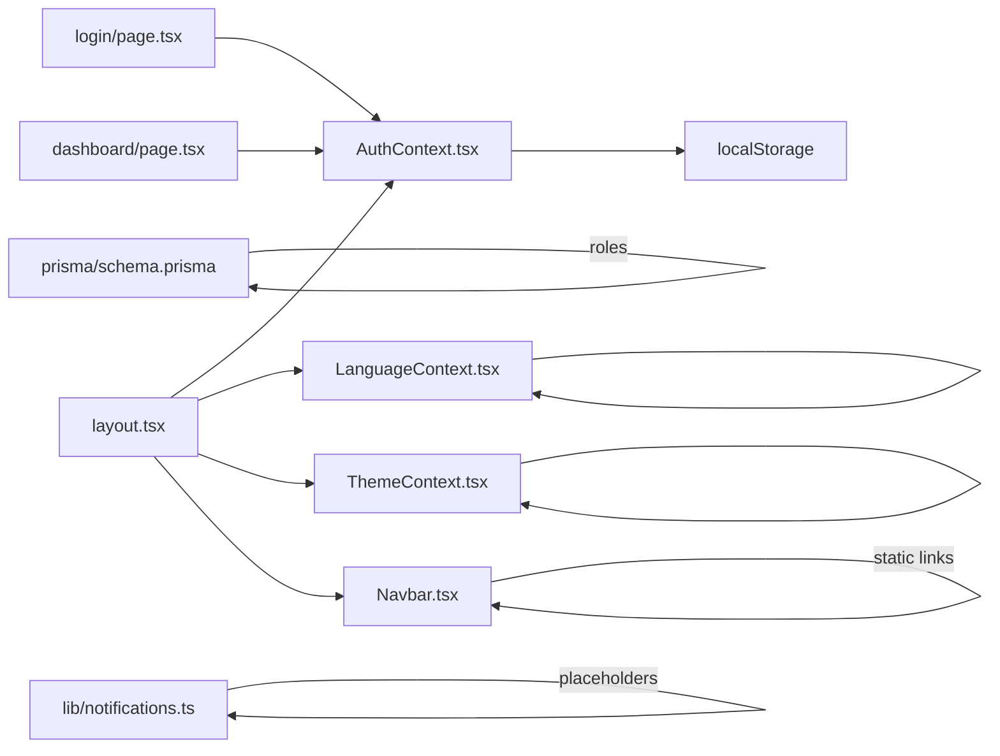

# Authentication & Authorization

<cite>
**Referenced Files in This Document**
- [AuthContext.tsx](file://components/AuthContext.tsx)
- [layout.tsx](file://app/layout.tsx)
- [page.tsx](file://app/login/page.tsx)
- [page.tsx](file://app/dashboard/page.tsx)
- [Navbar.tsx](file://components/Navbar.tsx)
- [notifications.ts](file://lib/notifications.ts)
- [schema.prisma](file://prisma/schema.prisma)
- [LiveChat.tsx](file://components/LiveChat.tsx)
- [ThemeContext.tsx](file://components/ThemeContext.tsx)
- [LanguageContext.tsx](file://components/LanguageContext.tsx)
- [package.json](file://package.json)
</cite>

## Table of Contents
1. [Introduction](#introduction)
2. [Project Structure](#project-structure)
3. [Core Components](#core-components)
4. [Architecture Overview](#architecture-overview)
5. [Detailed Component Analysis](#detailed-component-analysis)
6. [Dependency Analysis](#dependency-analysis)
7. [Performance Considerations](#performance-considerations)
8. [Troubleshooting Guide](#troubleshooting-guide)
9. [Conclusion](#conclusion)
10. [Appendices](#appendices)

## Introduction
This document explains the authentication and authorization model for the multi-role portal. It covers the mobile-based login with OTP, the in-memory role-based UI routing, and the local storage-backed authentication state. It also documents the three user roles (admin, team-boy, printing-shop), their access levels, and how navigation visibility is controlled by role. Security considerations, authentication flow diagrams, and integration points with notification systems are included.

## Project Structure
The authentication and authorization system spans a small set of client-side React components and shared contexts:
- Authentication state is provided via a React Context and persisted in browser local storage.
- The login page implements a two-step mobile + OTP flow and sets the authenticated role.
- The dashboard renders role-specific views based on the current authentication state.
- Navigation links are rendered statically; role-aware visibility is not enforced in code.
- Notification helpers are present for future integration with email/SMS providers.
- Prisma schema defines the database model and roles for users and partners.



**Diagram sources**
- [layout.tsx:17-45](file://app/layout.tsx#L17-L45)
- [AuthContext.tsx:29-60](file://components/AuthContext.tsx#L29-L60)
- [page.tsx:7-125](file://app/login/page.tsx#L7-L125)
- [page.tsx:6-38](file://app/dashboard/page.tsx#L6-L38)
- [Navbar.tsx:19-59](file://components/Navbar.tsx#L19-L59)
- [LanguageContext.tsx:23-50](file://components/LanguageContext.tsx#L23-L50)
- [ThemeContext.tsx:14-27](file://components/ThemeContext.tsx#L14-L27)
- [LiveChat.tsx:12-47](file://components/LiveChat.tsx#L12-L47)
- [schema.prisma:10-71](file://prisma/schema.prisma#L10-L71)
- [notifications.ts:6-26](file://lib/notifications.ts#L6-L26)

**Section sources**
- [layout.tsx:17-45](file://app/layout.tsx#L17-L45)
- [AuthContext.tsx:29-60](file://components/AuthContext.tsx#L29-L60)
- [page.tsx:7-125](file://app/login/page.tsx#L7-L125)
- [page.tsx:6-38](file://app/dashboard/page.tsx#L6-L38)
- [Navbar.tsx:19-59](file://components/Navbar.tsx#L19-L59)
- [LanguageContext.tsx:23-50](file://components/LanguageContext.tsx#L23-L50)
- [ThemeContext.tsx:14-27](file://components/ThemeContext.tsx#L14-L27)
- [LiveChat.tsx:12-47](file://components/LiveChat.tsx#L12-L47)
- [schema.prisma:10-71](file://prisma/schema.prisma#L10-L71)
- [notifications.ts:6-26](file://lib/notifications.ts#L6-L26)

## Core Components
- Authentication Context (AuthContext): Manages role and mobile number, persists to local storage, and exposes login/logout.
- Login Page: Two-step flow (mobile → OTP) with role selection; on success, invokes login and navigates to the dashboard.
- Dashboard: Renders role-specific views based on the current role.
- Navigation: Static links; role-aware visibility is not enforced in code.
- Notifications: Placeholder functions for partner applications, order confirmations, and status updates.
- Prisma Schema: Defines user roles and related entities.

Key implementation references:
- Auth state shape and persistence: [AuthContext.tsx:14-48](file://components/AuthContext.tsx#L14-L48)
- Login form steps and OTP submission: [page.tsx:7-125](file://app/login/page.tsx#L7-L125)
- Role-based rendering in dashboard: [page.tsx:6-38](file://app/dashboard/page.tsx#L6-L38)
- Navigation links: [Navbar.tsx:6-17](file://components/Navbar.tsx#L6-L17)
- Notification placeholders: [notifications.ts:6-26](file://lib/notifications.ts#L6-L26)
- Roles and models: [schema.prisma:10-71](file://prisma/schema.prisma#L10-L71)

**Section sources**
- [AuthContext.tsx:14-48](file://components/AuthContext.tsx#L14-L48)
- [page.tsx:7-125](file://app/login/page.tsx#L7-L125)
- [page.tsx:6-38](file://app/dashboard/page.tsx#L6-L38)
- [Navbar.tsx:6-17](file://components/Navbar.tsx#L6-L17)
- [notifications.ts:6-26](file://lib/notifications.ts#L6-L26)
- [schema.prisma:10-71](file://prisma/schema.prisma#L10-L71)

## Architecture Overview
The authentication system is client-side and role-based:
- The AuthProvider initializes and syncs the authentication state with local storage.
- The login page drives the mobile + OTP flow and sets the role.
- The dashboard conditionally renders role-specific UI.
- Navigation links are static; role-aware visibility is not enforced in code.
- Notifications are centralized for future integration with external providers.



**Diagram sources**
- [page.tsx:7-125](file://app/login/page.tsx#L7-L125)
- [AuthContext.tsx:29-60](file://components/AuthContext.tsx#L29-L60)
- [page.tsx:6-38](file://app/dashboard/page.tsx#L6-L38)

## Detailed Component Analysis

### Authentication Context (AuthContext)
- Purpose: Provide a global authentication state and lifecycle actions.
- State: Holds role and mobile number; defaults to null until login.
- Persistence: Reads/writes to local storage under a fixed key.
- Exposed API: login(role, mobile), logout(), and a consumer hook useAuth().
- Thread safety: Uses React state and memoization to avoid unnecessary re-renders.

```mermaid
classDiagram
class AuthContext {
+user : AuthState
+login(params)
+logout()
}
class AuthState {
+role : Role
+mobile : string
}
class Role {
<<enum>>
"admin"
"team-boy"
"printing-shop"
}
AuthContext --> AuthState : "manages"
AuthState --> Role : "has"
```

**Diagram sources**
- [AuthContext.tsx:12-23](file://components/AuthContext.tsx#L12-L23)
- [AuthContext.tsx:14-17](file://components/AuthContext.tsx#L14-L17)
- [AuthContext.tsx:29-60](file://components/AuthContext.tsx#L29-L60)

**Section sources**
- [AuthContext.tsx:12-23](file://components/AuthContext.tsx#L12-L23)
- [AuthContext.tsx:14-17](file://components/AuthContext.tsx#L14-L17)
- [AuthContext.tsx:29-60](file://components/AuthContext.tsx#L29-L60)

### Login Page (Mobile + OTP)
- Flow:
  - Step 1: Select role and enter mobile number.
  - Step 2: Enter OTP; on success, call login and navigate to dashboard.
- OTP verification: Currently a mock step; in production, integrate with a backend API to validate OTP.
- Navigation: After successful login, redirects to the dashboard.



**Diagram sources**
- [page.tsx:7-125](file://app/login/page.tsx#L7-L125)

**Section sources**
- [page.tsx:7-125](file://app/login/page.tsx#L7-L125)

### Dashboard (Role-Based Views)
- Behavior: Reads the current role from AuthContext and renders the corresponding view.
- Views:
  - Admin: Assign work, manage approvals, audit logs.
  - Team Boy: Accept tasks, upload completion photos, view earnings.
  - Printing Shop: Add print jobs, view commissions, download statements.



**Diagram sources**
- [page.tsx:6-38](file://app/dashboard/page.tsx#L6-L38)
- [page.tsx:55-124](file://app/dashboard/page.tsx#L55-L124)
- [page.tsx:126-187](file://app/dashboard/page.tsx#L126-L187)
- [page.tsx:189-255](file://app/dashboard/page.tsx#L189-L255)

**Section sources**
- [page.tsx:6-38](file://app/dashboard/page.tsx#L6-L38)
- [page.tsx:55-124](file://app/dashboard/page.tsx#L55-L124)
- [page.tsx:126-187](file://app/dashboard/page.tsx#L126-L187)
- [page.tsx:189-255](file://app/dashboard/page.tsx#L189-L255)

### Navigation Visibility Based on Role
- Current state: Navigation links are static and not filtered by role.
- Recommended enhancement: Wrap navigation items in role checks to show/hide entries based on the current role.

[No sources needed since this section provides general guidance]

### Protected Routes and Access Control
- Current state: There is no server-side route protection; access control is purely client-side.
- Recommended enhancements:
  - Implement middleware or route guards to redirect unauthenticated users.
  - Enforce role-based access to pages and API endpoints.
  - Integrate backend APIs for OTP delivery and validation.

[No sources needed since this section provides general guidance]

### Token Management and Session Handling
- Current state: No JWT tokens or refresh mechanisms are implemented. Authentication state is stored locally.
- Recommended enhancements:
  - Issue short-lived JWTs on successful OTP verification.
  - Store tokens securely (HttpOnly cookies) and implement refresh token rotation.
  - Add token expiration checks and automatic logout.

[No sources needed since this section provides general guidance]

### Logout Procedures
- Current state: logout() clears the role and mobile from state and local storage.
- Recommended enhancements:
  - Invalidate tokens on the server.
  - Clear any cached data and reset client-side stores.

[No sources needed since this section provides general guidance]

### Notification Integration
- Current state: Notification helpers exist but are not integrated into authentication flows.
- Recommended enhancements:
  - Trigger notifications on login success/failure, role assignment, and dashboard access.
  - Integrate with email/SMS providers via the helper functions.

**Section sources**
- [notifications.ts:6-26](file://lib/notifications.ts#L6-L26)

## Dependency Analysis
- AuthContext depends on React Context and local storage.
- LoginPage depends on AuthContext and Next.js router.
- Dashboard depends on AuthContext and renders role-specific components.
- Navbar renders static links; role-aware visibility is not enforced.
- Prisma schema defines roles and relationships for users and partners.
- LiveChat is a separate client-side module for customer support.



**Diagram sources**
- [AuthContext.tsx:29-60](file://components/AuthContext.tsx#L29-L60)
- [page.tsx:7-125](file://app/login/page.tsx#L7-L125)
- [page.tsx:6-38](file://app/dashboard/page.tsx#L6-L38)
- [Navbar.tsx:6-17](file://components/Navbar.tsx#L6-L17)
- [schema.prisma:10-71](file://prisma/schema.prisma#L10-L71)
- [notifications.ts:6-26](file://lib/notifications.ts#L6-L26)
- [LanguageContext.tsx:23-50](file://components/LanguageContext.tsx#L23-L50)
- [ThemeContext.tsx:14-27](file://components/ThemeContext.tsx#L14-L27)
- [layout.tsx:17-45](file://app/layout.tsx#L17-L45)

**Section sources**
- [AuthContext.tsx:29-60](file://components/AuthContext.tsx#L29-L60)
- [page.tsx:7-125](file://app/login/page.tsx#L7-L125)
- [page.tsx:6-38](file://app/dashboard/page.tsx#L6-L38)
- [Navbar.tsx:6-17](file://components/Navbar.tsx#L6-L17)
- [schema.prisma:10-71](file://prisma/schema.prisma#L10-L71)
- [notifications.ts:6-26](file://lib/notifications.ts#L6-L26)
- [LanguageContext.tsx:23-50](file://components/LanguageContext.tsx#L23-L50)
- [ThemeContext.tsx:14-27](file://components/ThemeContext.tsx#L14-L27)
- [layout.tsx:17-45](file://app/layout.tsx#L17-L45)

## Performance Considerations
- Local storage reads/writes occur on mount and on state changes; keep payloads minimal.
- Avoid heavy computations in the AuthContext provider; memoize derived values.
- Debounce or throttle OTP submission to reduce unnecessary network calls.
- Lazy-load role-specific dashboard sections to improve initial render performance.

[No sources needed since this section provides general guidance]

## Troubleshooting Guide
Common issues and resolutions:
- Login does not persist after refresh:
  - Ensure local storage is enabled and the key matches the configured storage key.
  - Verify the AuthProvider wraps the application root.
- OTP verification appears to succeed but login fails:
  - Confirm the OTP form triggers the login action and navigation.
  - Check for console errors during form submission.
- Role-specific view not rendering:
  - Verify the role value is set correctly after login.
  - Ensure the dashboard reads the role from the AuthContext.
- Navigation visibility not role-aware:
  - Implement role checks around navigation items to hide/show based on role.

**Section sources**
- [AuthContext.tsx:29-60](file://components/AuthContext.tsx#L29-L60)
- [page.tsx:7-125](file://app/login/page.tsx#L7-L125)
- [page.tsx:6-38](file://app/dashboard/page.tsx#L6-L38)
- [Navbar.tsx:6-17](file://components/Navbar.tsx#L6-L17)

## Conclusion
The current authentication system is a client-side, role-based prototype with a mobile + OTP login flow and local storage persistence. It provides a foundation for building out secure, production-grade authentication and authorization, including JWT token management, protected routes, and role-aware navigation. Integrating backend APIs for OTP delivery and validation, implementing server-side route protection, and connecting notification helpers will complete the solution.

## Appendices

### Roles and Permissions Summary
- Admin:
  - Assign work, manage approvals, audit logs.
- Team Boy:
  - Accept tasks, upload completion photos, view earnings.
- Printing Shop:
  - Add print jobs, view commissions, download statements.

**Section sources**
- [page.tsx:55-124](file://app/dashboard/page.tsx#L55-L124)
- [page.tsx:126-187](file://app/dashboard/page.tsx#L126-L187)
- [page.tsx:189-255](file://app/dashboard/page.tsx#L189-L255)

### Security Considerations
- Transport and storage:
  - Use HTTPS in production.
  - Store tokens in HttpOnly cookies; avoid placing sensitive tokens in local storage.
- CSRF and XSS:
  - Sanitize inputs and apply Content Security Policy.
- Rate limiting:
  - Limit OTP resend attempts and login retries.
- Session management:
  - Implement token expiration and automatic logout.
- Audit logging:
  - Track authentication events and role changes.

[No sources needed since this section provides general guidance]

### Technology Stack References
- React, Next.js, TypeScript, Tailwind CSS, Prisma, jsonwebtoken, bcryptjs, axios.

**Section sources**
- [package.json:13-27](file://package.json#L13-L27)