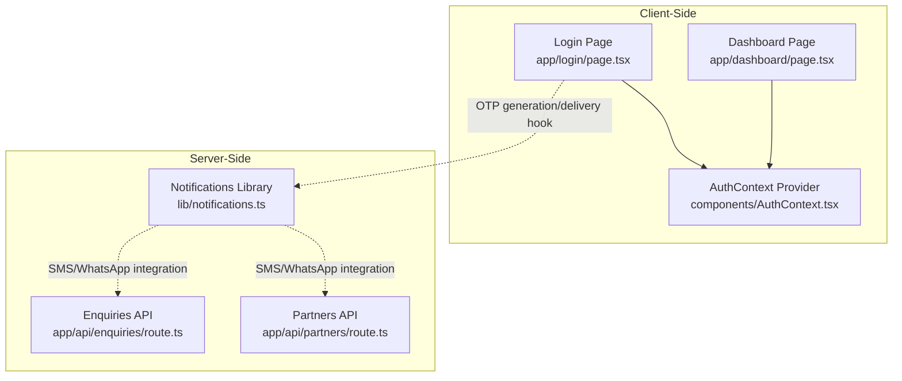
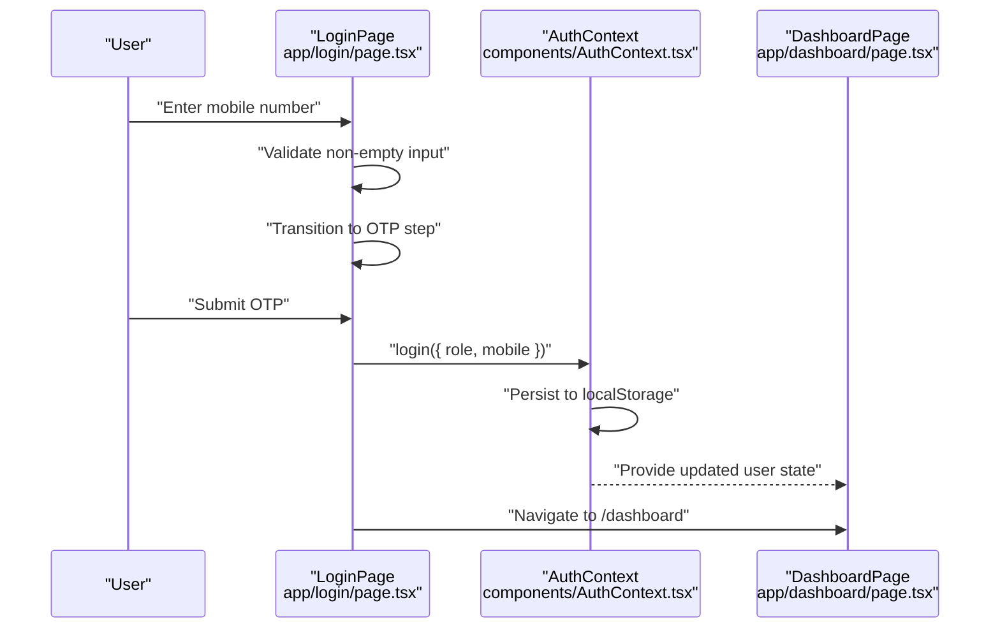
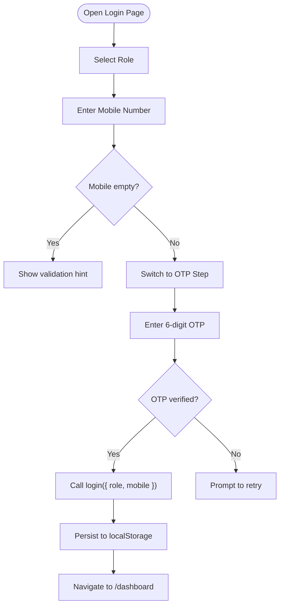
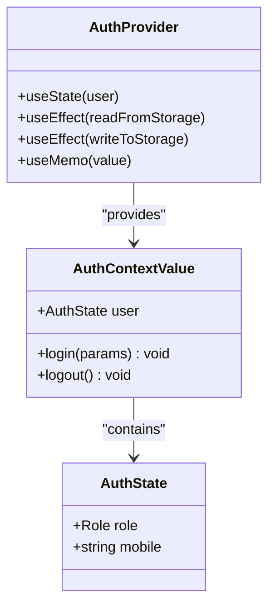
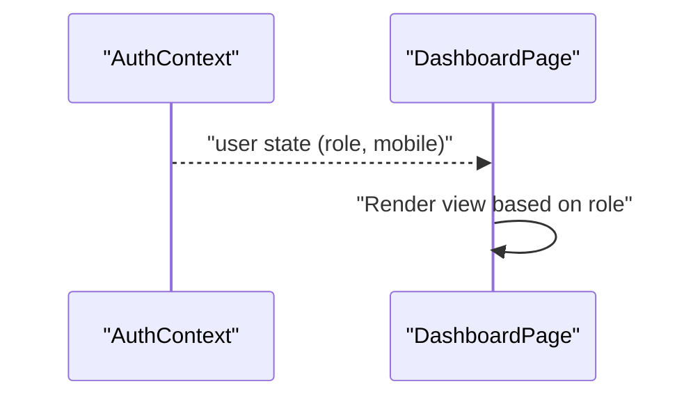
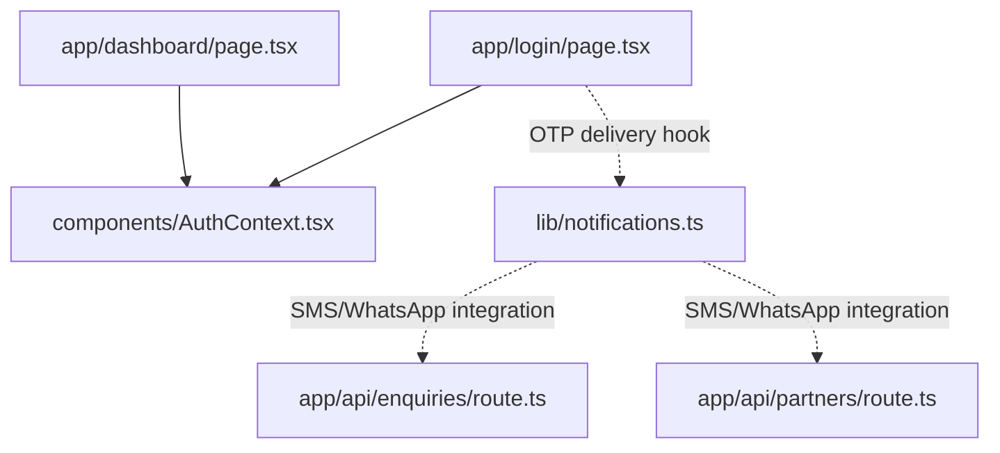

# Login Flow & OTP Authentication

<cite>
**Referenced Files in This Document**
- [login/page.tsx](file://app/login/page.tsx)
- [AuthContext.tsx](file://components/AuthContext.tsx)
- [layout.tsx](file://app/layout.tsx)
- [dashboard/page.tsx](file://app/dashboard/page.tsx)
- [notifications.ts](file://lib/notifications.ts)
- [enquiries/route.ts](file://app/api/enquiries/route.ts)
- [partners/route.ts](file://app/api/partners/route.ts)
</cite>

## Table of Contents
1. [Introduction](#introduction)
2. [Project Structure](#project-structure)
3. [Core Components](#core-components)
4. [Architecture Overview](#architecture-overview)
5. [Detailed Component Analysis](#detailed-component-analysis)
6. [Dependency Analysis](#dependency-analysis)
7. [Performance Considerations](#performance-considerations)
8. [Troubleshooting Guide](#troubleshooting-guide)
9. [Conclusion](#conclusion)

## Introduction
This document explains the mobile-based login and OTP authentication system implemented in the project. It covers the complete login flow from mobile number entry to OTP verification, form validation behavior, OTP generation and delivery hooks, successful authentication completion, and integration with the authentication state management. It also documents mobile number validation requirements, OTP resend functionality, error handling for failed attempts, and security considerations for OTP transmission, timeouts, and retry limits. Finally, it provides code example references for the login component implementation and authentication state updates.

## Project Structure
The authentication system spans three primary areas:
- Login UI page with role selection and OTP steps
- Authentication state management via a React Context provider
- Backend API routes for supporting validations and notifications

**Diagram sources**
- [login/page.tsx:1-126](file://app/login/page.tsx#L1-L126)
- [AuthContext.tsx:1-70](file://components/AuthContext.tsx#L1-L70)
- [dashboard/page.tsx:1-257](file://app/dashboard/page.tsx#L1-L257)
- [notifications.ts:1-28](file://lib/notifications.ts#L1-L28)
- [enquiries/route.ts:1-80](file://app/api/enquiries/route.ts#L1-L80)
- [partners/route.ts:1-89](file://app/api/partners/route.ts#L1-L89)

**Section sources**
- [login/page.tsx:1-126](file://app/login/page.tsx#L1-L126)
- [AuthContext.tsx:1-70](file://components/AuthContext.tsx#L1-L70)
- [layout.tsx:17-42](file://app/layout.tsx#L17-L42)
- [dashboard/page.tsx:1-38](file://app/dashboard/page.tsx#L1-L38)

## Core Components
- Login Page: Implements two-step authentication (mobile entry → OTP verification), role selection, and navigation to the dashboard upon successful login.
- AuthContext: Provides a global authentication state with local persistence and exposes login/logout functions.
- Dashboard Page: Renders role-specific views based on the current authentication state.
- Notifications Library: Centralized place to integrate SMS/WhatsApp providers for OTP delivery.
- Enquiries and Partners APIs: Demonstrate validation patterns and show where OTP-triggered notifications could be integrated.

Key implementation references:
- Login form submission and step transitions: [login/page.tsx:56-94](file://app/login/page.tsx#L56-L94)
- OTP verification and login dispatch: [login/page.tsx:86-94](file://app/login/page.tsx#L86-L94)
- AuthContext state shape and login function: [AuthContext.tsx:14-23](file://components/AuthContext.tsx#L14-L23), [AuthContext.tsx:50-56](file://components/AuthContext.tsx#L50-L56)
- Local storage persistence: [AuthContext.tsx:32-48](file://components/AuthContext.tsx#L32-L48)
- Dashboard role rendering: [dashboard/page.tsx:33-35](file://app/dashboard/page.tsx#L33-L35)

**Section sources**
- [login/page.tsx:56-94](file://app/login/page.tsx#L56-L94)
- [AuthContext.tsx:14-23](file://components/AuthContext.tsx#L14-L23)
- [AuthContext.tsx:32-48](file://components/AuthContext.tsx#L32-L48)
- [dashboard/page.tsx:33-35](file://app/dashboard/page.tsx#L33-L35)

## Architecture Overview
The login flow integrates UI state, authentication context, and backend hooks for OTP delivery. The diagram below maps the actual code components involved in the flow.

**Diagram sources**
- [login/page.tsx:56-94](file://app/login/page.tsx#L56-L94)
- [AuthContext.tsx:32-48](file://components/AuthContext.tsx#L32-L48)
- [dashboard/page.tsx:6-38](file://app/dashboard/page.tsx#L6-L38)

## Detailed Component Analysis

### Login Page Component
The login page implements a two-step process:
- Step 1: Mobile number entry with role selection
- Step 2: OTP entry and verification

Behavior highlights:
- Mobile number validation: Non-empty check prevents proceeding without input.
- Role selection: Three roles supported (admin, team-boy, printing-shop).
- OTP verification: In the current implementation, OTP verification is treated as successful and triggers login.
- Navigation: Successful login navigates to the dashboard.

**Diagram sources**
- [login/page.tsx:56-94](file://app/login/page.tsx#L56-L94)
- [AuthContext.tsx:32-48](file://components/AuthContext.tsx#L32-L48)

**Section sources**
- [login/page.tsx:56-94](file://app/login/page.tsx#L56-L94)

### Authentication State Management (AuthContext)
AuthContext manages the authentication state and persists it to local storage:
- State shape: role and mobile number
- Functions: login, logout
- Persistence: Reads initial state from localStorage and writes updates back

**Diagram sources**
- [AuthContext.tsx:14-23](file://components/AuthContext.tsx#L14-L23)
- [AuthContext.tsx:29-57](file://components/AuthContext.tsx#L29-L57)

**Section sources**
- [AuthContext.tsx:14-23](file://components/AuthContext.tsx#L14-L23)
- [AuthContext.tsx:29-57](file://components/AuthContext.tsx#L29-L57)

### Dashboard Integration
The dashboard reads the current authentication state and renders role-specific content:
- Uses the AuthContext to determine the current role
- Displays different views for admin, team-boy, and printing-shop

**Diagram sources**
- [dashboard/page.tsx:6-38](file://app/dashboard/page.tsx#L6-L38)

**Section sources**
- [dashboard/page.tsx:6-38](file://app/dashboard/page.tsx#L6-L38)

### OTP Generation and Delivery Hooks
The login page comments indicate that OTP generation and delivery should call a backend API to send an SMS OTP and optionally support WhatsApp OTP. The notifications library serves as the central place to integrate real SMS/WhatsApp providers.

Integration points:
- Login page comment indicating backend OTP API call
- Notifications library for SMS/WhatsApp integration
- Example validation patterns in other APIs for mobile number checks

References:
- OTP delivery hook comment: [login/page.tsx:80-83](file://app/login/page.tsx#L80-L83)
- Notifications library placeholder: [notifications.ts:1-28](file://lib/notifications.ts#L1-L28)
- Mobile validation pattern in other APIs: [enquiries/route.ts:19-26](file://app/api/enquiries/route.ts#L19-L26), [partners/route.ts:42-49](file://app/api/partners/route.ts#L42-L49)

**Section sources**
- [login/page.tsx:80-83](file://app/login/page.tsx#L80-L83)
- [notifications.ts:1-28](file://lib/notifications.ts#L1-L28)
- [enquiries/route.ts:19-26](file://app/api/enquiries/route.ts#L19-L26)
- [partners/route.ts:42-49](file://app/api/partners/route.ts#L42-L49)

## Dependency Analysis
The login flow depends on the AuthContext provider being present in the application layout. The dashboard consumes the authentication state to render role-specific content.

**Diagram sources**
- [login/page.tsx:1-126](file://app/login/page.tsx#L1-L126)
- [AuthContext.tsx:1-70](file://components/AuthContext.tsx#L1-L70)
- [dashboard/page.tsx:1-257](file://app/dashboard/page.tsx#L1-L257)
- [notifications.ts:1-28](file://lib/notifications.ts#L1-L28)
- [enquiries/route.ts:1-80](file://app/api/enquiries/route.ts#L1-L80)
- [partners/route.ts:1-89](file://app/api/partners/route.ts#L1-L89)

**Section sources**
- [layout.tsx:26-40](file://app/layout.tsx#L26-L40)

## Performance Considerations
- Client-side routing: The Next.js app uses client-side navigation for login and dashboard, minimizing server round-trips after initial load.
- Local storage persistence: Auth state is persisted to localStorage, reducing server requests for authentication state but relying on client storage availability.
- OTP verification: Current implementation treats OTP verification as successful; backend integration will shift verification to the server, improving security and performance by offloading cryptographic operations server-side.

## Troubleshooting Guide
Common issues and resolutions:
- Empty mobile number submission: The login page prevents proceeding if the mobile field is empty. Ensure users enter a non-empty value before switching to the OTP step.
- OTP verification always succeeds: The current implementation treats OTP verification as successful. Integrate backend OTP verification to handle failures and retries.
- Authentication state not persisting: Verify that the AuthContext provider is included in the application layout and that localStorage is accessible in the browser.
- Role mismatch in dashboard: Ensure the login step sets the correct role before calling login to avoid unexpected dashboard views.

References:
- Mobile validation and step transition: [login/page.tsx:59-63](file://app/login/page.tsx#L59-L63)
- OTP verification and login dispatch: [login/page.tsx:88-94](file://app/login/page.tsx#L88-L94)
- AuthContext provider inclusion: [layout.tsx:26-40](file://app/layout.tsx#L26-L40)
- Auth state persistence: [AuthContext.tsx:32-48](file://components/AuthContext.tsx#L32-L48)

**Section sources**
- [login/page.tsx:59-63](file://app/login/page.tsx#L59-L63)
- [login/page.tsx:88-94](file://app/login/page.tsx#L88-L94)
- [layout.tsx:26-40](file://app/layout.tsx#L26-L40)
- [AuthContext.tsx:32-48](file://components/AuthContext.tsx#L32-L48)

## Conclusion
The mobile-based login and OTP authentication system combines a straightforward UI with a robust authentication state management layer. The login page supports role selection and a two-step authentication flow, while AuthContext provides persistent, cross-component state. OTP generation and delivery are designed to integrate with backend APIs and notifications libraries, enabling SMS/WhatsApp delivery. Security, timeout handling, and retry limits should be implemented at the backend level to protect against abuse and ensure reliable user experiences. The dashboard consumes the authentication state to render role-specific content, completing the authentication flow.