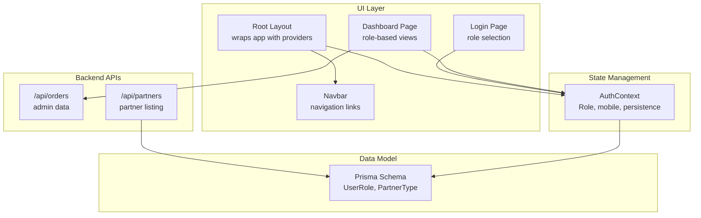
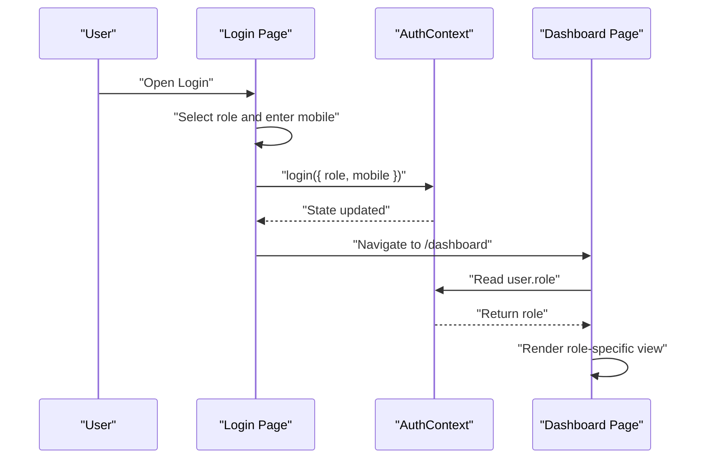
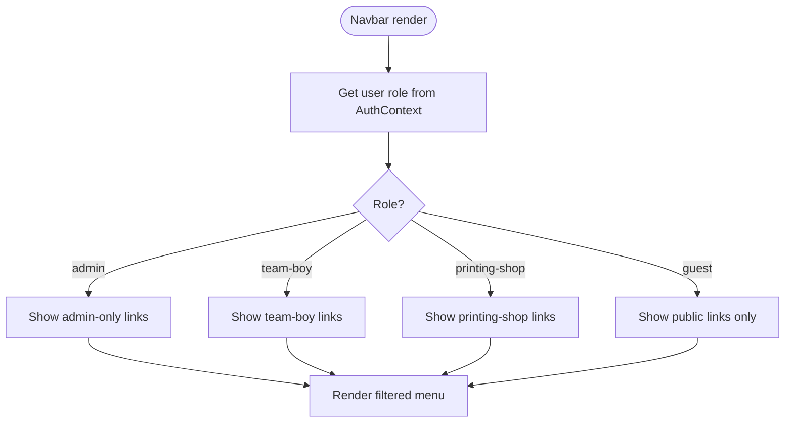
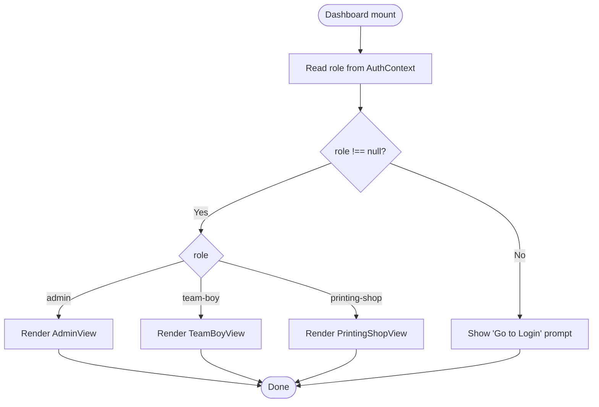
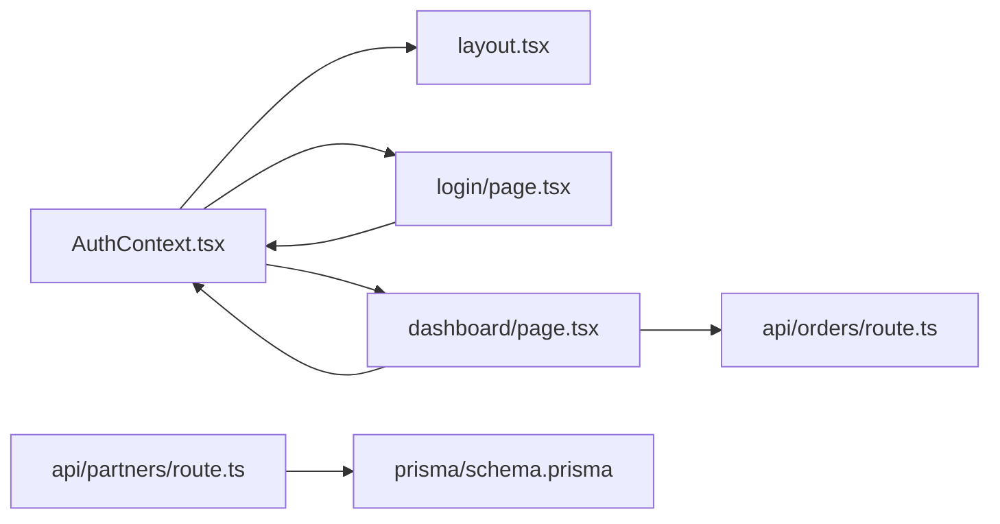

# Role-Based Access Control

<cite>
**Referenced Files in This Document**
- [AuthContext.tsx](file://components/AuthContext.tsx)
- [Navbar.tsx](file://components/Navbar.tsx)
- [layout.tsx](file://app/layout.tsx)
- [page.tsx](file://app/dashboard/page.tsx)
- [page.tsx](file://app/login/page.tsx)
- [route.ts](file://app/api/orders/route.ts)
- [route.ts](file://app/api/partners/route.ts)
- [schema.prisma](file://prisma/schema.prisma)
</cite>

## Table of Contents
1. [Introduction](#introduction)
2. [Project Structure](#project-structure)
3. [Core Components](#core-components)
4. [Architecture Overview](#architecture-overview)
5. [Detailed Component Analysis](#detailed-component-analysis)
6. [Dependency Analysis](#dependency-analysis)
7. [Performance Considerations](#performance-considerations)
8. [Troubleshooting Guide](#troubleshooting-guide)
9. [Conclusion](#conclusion)

## Introduction
This document describes the three-role access control system implemented in the application. It defines the roles, their permissions and boundaries, how roles are stored and managed in authentication state, and how role-based navigation and dashboard access are enforced. It also documents the role type definitions, role checking utilities, and conditional rendering patterns used throughout the UI.

## Project Structure
The role-based access control spans several layers:
- Authentication state management with a dedicated context
- UI layout that wraps the app with authentication providers
- Login page that selects a role and persists it to state
- Dashboard that conditionally renders role-specific views
- API routes that expose data relevant to each role
- Prisma schema that models user roles and partner types

**Diagram sources**
- [layout.tsx:17-46](file://app/layout.tsx#L17-L46)
- [AuthContext.tsx:29-60](file://components/AuthContext.tsx#L29-L60)
- [page.tsx](file://app/login/page.tsx)
- [page.tsx](file://app/dashboard/page.tsx)
- [route.ts:1-90](file://app/api/orders/route.ts#L1-L90)
- [route.ts:1-117](file://app/api/partners/route.ts#L1-L117)
- [schema.prisma:10-15](file://prisma/schema.prisma#L10-L15)

**Section sources**
- [layout.tsx:17-46](file://app/layout.tsx#L17-L46)
- [AuthContext.tsx:29-60](file://components/AuthContext.tsx#L29-L60)

## Core Components
- Role type definition: The application defines a union type for roles used in client-side logic.
- Authentication context: Provides role and mobile state, login/logout actions, and persistence to local storage.
- Login page: Allows selecting a role and simulates OTP verification before logging in.
- Dashboard: Reads current role and conditionally renders role-specific views.
- API routes: Expose data relevant to administrators and support partner onboarding.
- Prisma schema: Defines the canonical user roles and partner types used by the backend.

Key implementation references:
- Role type and state shape: [AuthContext.tsx:12-17](file://components/AuthContext.tsx#L12-L17)
- Authentication provider and persistence: [AuthContext.tsx:29-48](file://components/AuthContext.tsx#L29-L48)
- Login role selection and login action: [page.tsx](file://app/login/page.tsx)
- Dashboard role-based rendering: [page.tsx](file://app/dashboard/page.tsx)
- Backend order listing for admins: [route.ts:5-25](file://app/api/orders/route.ts#L5-L25)
- Backend partner listing and creation: [route.ts:5-23](file://app/api/partners/route.ts#L5-L23), [route.ts:25-117](file://app/api/partners/route.ts#L25-L117)
- Role and partner type enums: [schema.prisma:10-21](file://prisma/schema.prisma#L10-L21)

**Section sources**
- [AuthContext.tsx:12-17](file://components/AuthContext.tsx#L12-L17)
- [AuthContext.tsx:29-48](file://components/AuthContext.tsx#L29-L48)
- [page.tsx](file://app/login/page.tsx)
- [page.tsx](file://app/dashboard/page.tsx)
- [route.ts:5-25](file://app/api/orders/route.ts#L5-L25)
- [route.ts:5-23](file://app/api/partners/route.ts#L5-L23)
- [route.ts:25-117](file://app/api/partners/route.ts#L25-L117)
- [schema.prisma:10-21](file://prisma/schema.prisma#L10-L21)

## Architecture Overview
The system uses a client-side role model with localStorage persistence. Roles are selected during login and stored in the AuthContext. The dashboard reads the role and renders the appropriate view. Admins can access administrative data via backend APIs, while other roles access role-appropriate features.

**Diagram sources**
- [page.tsx](file://app/login/page.tsx)
- [AuthContext.tsx:50-57](file://components/AuthContext.tsx#L50-L57)
- [page.tsx](file://app/dashboard/page.tsx)

## Detailed Component Analysis

### Role Definitions and Storage
- Role type: admin, team-boy, printing-shop
- Auth state: role (nullable), mobile (nullable)
- Persistence: localStorage under a fixed key
- Access boundary: role determines which dashboard view is shown and which backend resources are accessed

Implementation references:
- Role union type: [AuthContext.tsx:12](file://components/AuthContext.tsx#L12)
- Auth state shape: [AuthContext.tsx:14-17](file://components/AuthContext.tsx#L14-L17)
- Provider initialization and persistence: [AuthContext.tsx:29-48](file://components/AuthContext.tsx#L29-L48)
- Context consumer hook: [AuthContext.tsx:62-68](file://components/AuthContext.tsx#L62-L68)

**Section sources**
- [AuthContext.tsx:12](file://components/AuthContext.tsx#L12)
- [AuthContext.tsx:14-17](file://components/AuthContext.tsx#L14-L17)
- [AuthContext.tsx:29-48](file://components/AuthContext.tsx#L29-L48)
- [AuthContext.tsx:62-68](file://components/AuthContext.tsx#L62-L68)

### Role-Based Navigation Visibility
- The Navbar component currently exposes static links for Home, About, Services, Join as Partner, and Login.
- No role-based filtering is implemented in the Navbar; all links are visible regardless of role.
- To enforce role-based navigation, add a role-aware menu builder and conditional rendering logic in the Navbar component.

Conceptual flow for future enhancement:

[No sources needed since this diagram shows conceptual workflow, not actual code structure]

### Dashboard Access Restrictions
- The dashboard reads the current role from AuthContext and conditionally renders one of three role-specific views.
- If no role is present, a prompt to navigate to the login page is shown.
- Access restriction enforcement occurs in the dashboard component via conditional rendering.

Implementation references:
- Role retrieval and fallback: [page.tsx:7-8](file://app/dashboard/page.tsx#L7-L8)
- Conditional rendering of role views: [page.tsx:33-35](file://app/dashboard/page.tsx#L33-L35)
- Guest prompt: [page.tsx:23-30](file://app/dashboard/page.tsx#L23-L30)

**Diagram sources**
- [page.tsx:7-35](file://app/dashboard/page.tsx#L7-L35)

**Section sources**
- [page.tsx:7-35](file://app/dashboard/page.tsx#L7-L35)

### Role Checking Utilities and Conditional Rendering
- Current pattern: Inline conditional rendering using equality checks against the role string.
- Recommended pattern: Extract a reusable role-checking utility to centralize role comparisons and improve readability.

Example patterns observed:
- Role equality checks: [page.tsx:33-35](file://app/dashboard/page.tsx#L33-L35)
- Role-aware button states in login: [page.tsx:24-54](file://app/login/page.tsx#L24-L54)

To implement a utility:
- Create a helper that accepts the current role and a target role, returning a boolean.
- Use the helper in components to simplify conditional rendering and reduce duplication.

[No sources needed since this section proposes a pattern without quoting specific code]

### Examples of Role-Based Component Rendering
- Admin view: [page.tsx:55-124](file://app/dashboard/page.tsx#L55-L124)
- Team boy view: [page.tsx:126-187](file://app/dashboard/page.tsx#L126-L187)
- Printing shop view: [page.tsx:189-255](file://app/dashboard/page.tsx#L189-L255)

These components demonstrate role-specific UI and actions:
- Admin: Assign work, manage orders, audit log
- Team boy: Accept tasks, upload completion photos, view earnings
- Printing shop: Add print jobs, view commissions, download statements

**Section sources**
- [page.tsx:55-124](file://app/dashboard/page.tsx#L55-L124)
- [page.tsx:126-187](file://app/dashboard/page.tsx#L126-L187)
- [page.tsx:189-255](file://app/dashboard/page.tsx#L189-L255)

### Relationship Between Roles and Available Actions
- Admin:
  - Can list all orders via backend API
  - Can assign team boys and printing partners to orders
  - Can approve completions and manage payouts
- Team boy:
  - Can accept delivery routes
  - Can upload completion photos
  - Can view earnings and monthly reports
- Printing shop:
  - Can submit print jobs for clients
  - Can track job status and commissions
  - Can download monthly statements

References:
- Admin order listing: [route.ts:5-25](file://app/api/orders/route.ts#L5-L25)
- Partner onboarding and listing: [route.ts:5-23](file://app/api/partners/route.ts#L5-L23), [route.ts:25-117](file://app/api/partners/route.ts#L25-L117)
- Prisma role and partner types: [schema.prisma:10-21](file://prisma/schema.prisma#L10-L21)

**Section sources**
- [route.ts:5-25](file://app/api/orders/route.ts#L5-L25)
- [route.ts:5-23](file://app/api/partners/route.ts#L5-L23)
- [route.ts:25-117](file://app/api/partners/route.ts#L25-L117)
- [schema.prisma:10-21](file://prisma/schema.prisma#L10-L21)

## Dependency Analysis
The following diagram shows how components and modules depend on each other for role-based access control:

**Diagram sources**
- [AuthContext.tsx:29-60](file://components/AuthContext.tsx#L29-L60)
- [layout.tsx:17-46](file://app/layout.tsx#L17-L46)
- [page.tsx](file://app/login/page.tsx)
- [page.tsx](file://app/dashboard/page.tsx)
- [route.ts:1-90](file://app/api/orders/route.ts#L1-L90)
- [route.ts:1-117](file://app/api/partners/route.ts#L1-L117)
- [schema.prisma:10-15](file://prisma/schema.prisma#L10-L15)

**Section sources**
- [AuthContext.tsx:29-60](file://components/AuthContext.tsx#L29-L60)
- [layout.tsx:17-46](file://app/layout.tsx#L17-L46)
- [page.tsx](file://app/login/page.tsx)
- [page.tsx](file://app/dashboard/page.tsx)
- [route.ts:1-90](file://app/api/orders/route.ts#L1-L90)
- [route.ts:1-117](file://app/api/partners/route.ts#L1-L117)
- [schema.prisma:10-15](file://prisma/schema.prisma#L10-L15)

## Performance Considerations
- Local storage persistence: Minimal overhead; ensure not to store sensitive data beyond role and mobile.
- Conditional rendering: Using simple equality checks is O(1); negligible cost.
- API calls: Admin order listing fetches all orders; consider pagination or filtering for scalability.
- Component composition: Keep role views modular to enable lazy loading and code splitting.

[No sources needed since this section provides general guidance]

## Troubleshooting Guide
Common issues and resolutions:
- Role not persisting after refresh:
  - Verify localStorage key and parsing logic in the AuthContext provider.
  - References: [AuthContext.tsx:32-48](file://components/AuthContext.tsx#L32-L48)
- Unexpected guest state:
  - Ensure login sets role and mobile correctly.
  - References: [AuthContext.tsx:50-57](file://components/AuthContext.tsx#L50-L57), [page.tsx:90-94](file://app/login/page.tsx#L90-L94)
- Dashboard not rendering role-specific view:
  - Confirm role equality checks and fallback logic.
  - References: [page.tsx:7-8](file://app/dashboard/page.tsx#L7-L8), [page.tsx:33-35](file://app/dashboard/page.tsx#L33-L35)
- Admin API errors:
  - Check backend response handling and Prisma queries.
  - References: [route.ts:18-24](file://app/api/orders/route.ts#L18-L24)

**Section sources**
- [AuthContext.tsx:32-48](file://components/AuthContext.tsx#L32-L48)
- [AuthContext.tsx:50-57](file://components/AuthContext.tsx#L50-L57)
- [page.tsx:90-94](file://app/login/page.tsx#L90-L94)
- [page.tsx:7-8](file://app/dashboard/page.tsx#L7-L8)
- [page.tsx:33-35](file://app/dashboard/page.tsx#L33-L35)
- [route.ts:18-24](file://app/api/orders/route.ts#L18-L24)

## Conclusion
The application implements a straightforward, client-side role-based access control system centered on a small set of roles and a simple authentication context. Roles are persisted locally, and the dashboard conditionally renders role-specific views. While the Navbar does not yet enforce role-based visibility, the underlying role model and state management provide a solid foundation for extending navigation and feature access controls. Future enhancements should focus on centralizing role checks, adding role-aware navigation, and implementing backend authorization to complement the existing client-side enforcement.