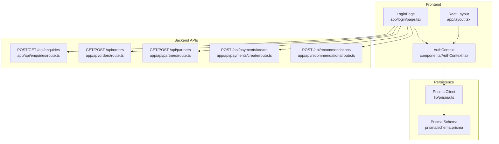
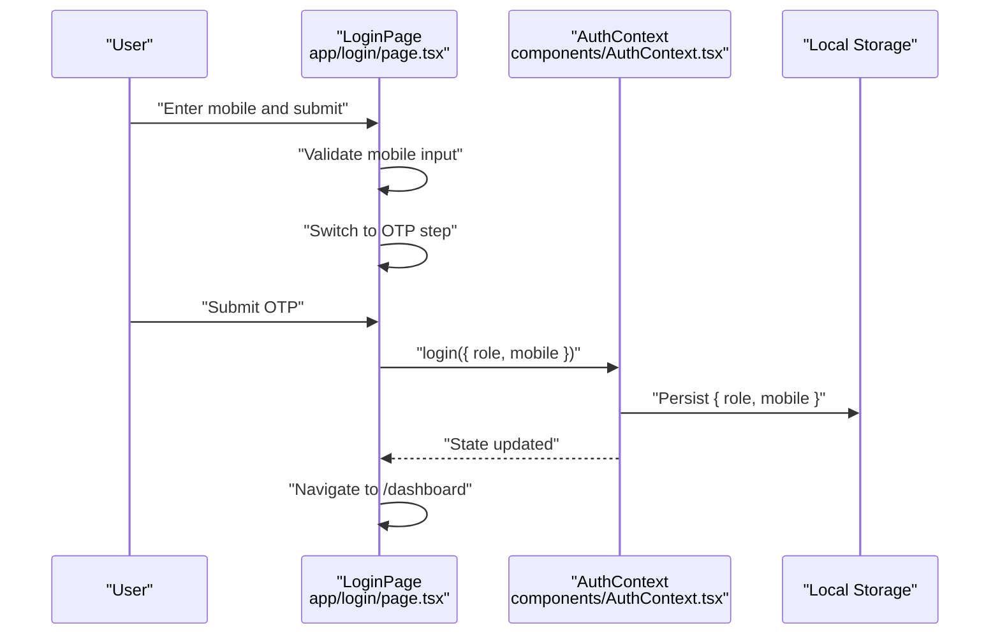
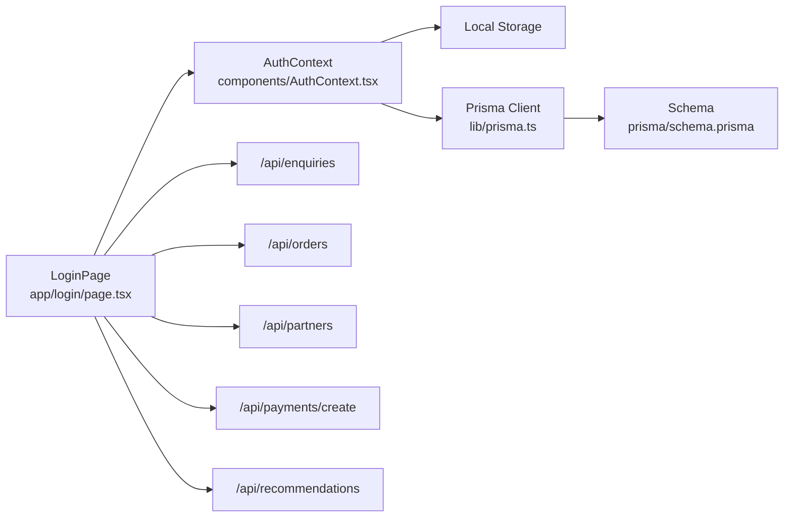

# Security & Best Practices

<cite>
**Referenced Files in This Document**
- [app/login/page.tsx](file://app/login/page.tsx)
- [components/AuthContext.tsx](file://components/AuthContext.tsx)
- [app/layout.tsx](file://app/layout.tsx)
- [next.config.mjs](file://next.config.mjs)
- [vercel.json](file://vercel.json)
- [app/api/enquiries/route.ts](file://app/api/enquiries/route.ts)
- [app/api/orders/route.ts](file://app/api/orders/route.ts)
- [app/api/partners/route.ts](file://app/api/partners/route.ts)
- [app/api/payments/create/route.ts](file://app/api/payments/create/route.ts)
- [app/api/recommendations/route.ts](file://app/api/recommendations/route.ts)
- [lib/prisma.ts](file://lib/prisma.ts)
- [prisma/schema.prisma](file://prisma/schema.prisma)
- [package.json](file://package.json)
</cite>

## Table of Contents
1. [Introduction](#introduction)
2. [Project Structure](#project-structure)
3. [Core Components](#core-components)
4. [Architecture Overview](#architecture-overview)
5. [Detailed Component Analysis](#detailed-component-analysis)
6. [Dependency Analysis](#dependency-analysis)
7. [Performance Considerations](#performance-considerations)
8. [Troubleshooting Guide](#troubleshooting-guide)
9. [Conclusion](#conclusion)
10. [Appendices](#appendices)

## Introduction
This document provides a comprehensive security assessment and best practices guide for the authentication system. It focuses on:
- Mobile-based authentication flow security
- OTP security measures and validation
- Local storage security considerations
- Vulnerabilities such as XSS and CSRF risks
- Secure state management and session handling
- Recommended enhancements including HTTPS enforcement, secure cookie settings, input sanitization, and logging
- Brute-force attack protections
- Secure token storage alternatives and future improvements

## Project Structure
The authentication system centers around a client-side React component that manages a lightweight local state and a small in-memory “mock” login flow. Authentication state is persisted to browser local storage under a dedicated key. The frontend is a Next.js application with a single-page login experience and a shared layout that wraps the app with providers.

**Diagram sources**
- [app/login/page.tsx:1-127](file://app/login/page.tsx#L1-L127)
- [components/AuthContext.tsx:1-70](file://components/AuthContext.tsx#L1-L70)
- [app/layout.tsx:1-48](file://app/layout.tsx#L1-L48)
- [app/api/enquiries/route.ts:1-111](file://app/api/enquiries/route.ts#L1-L111)
- [app/api/orders/route.ts:1-129](file://app/api/orders/route.ts#L1-L129)
- [app/api/partners/route.ts:1-174](file://app/api/partners/route.ts#L1-L174)
- [app/api/payments/create/route.ts:1-46](file://app/api/payments/create/route.ts#L1-L46)
- [app/api/recommendations/route.ts:1-56](file://app/api/recommendations/route.ts#L1-L56)
- [lib/prisma.ts:1-22](file://lib/prisma.ts#L1-L22)
- [prisma/schema.prisma:1-173](file://prisma/schema.prisma#L1-L173)

**Section sources**
- [app/login/page.tsx:1-127](file://app/login/page.tsx#L1-L127)
- [components/AuthContext.tsx:1-70](file://components/AuthContext.tsx#L1-L70)
- [app/layout.tsx:1-48](file://app/layout.tsx#L1-L48)
- [lib/prisma.ts:1-22](file://lib/prisma.ts#L1-L22)
- [prisma/schema.prisma:1-173](file://prisma/schema.prisma#L1-L173)

## Core Components
- LoginPage: Implements a two-step mobile + OTP login UI. It validates presence of mobile input and transitions to OTP verification. The OTP submission triggers a client-side login action and navigates to the dashboard.
- AuthContext: Provides a React context for authentication state with a mock login that sets role and mobile in local storage. It initializes state from local storage on mount and persists updates.
- Root Layout: Wraps the app with providers including AuthProvider, ensuring authentication state is available across pages.

Security implications:
- The login flow is client-driven and does not integrate with a backend OTP verification endpoint in the provided code. This introduces a risk of unverified authentication.
- Local storage persistence exposes credentials-like data to XSS if the page is vulnerable to script injection.
- No CSRF protection is implemented for the login form.

Recommended remediation:
- Replace mock login with a backend OTP verification endpoint and secure token issuance.
- Remove sensitive data from local storage; prefer secure, httpOnly cookies for session tokens.
- Implement CSRF protection for forms and API endpoints.

**Section sources**
- [app/login/page.tsx:1-127](file://app/login/page.tsx#L1-L127)
- [components/AuthContext.tsx:1-70](file://components/AuthContext.tsx#L1-L70)
- [app/layout.tsx:1-48](file://app/layout.tsx#L1-L48)

## Architecture Overview
The current architecture is a frontend-first authentication model with a thin backend surface. The login page interacts with:
- A mock login that sets local state and persists to local storage
- Backend APIs for other features (orders, partners, payments, recommendations)

**Diagram sources**
- [app/login/page.tsx:1-127](file://app/login/page.tsx#L1-L127)
- [components/AuthContext.tsx:1-70](file://components/AuthContext.tsx#L1-L70)

**Section sources**
- [app/login/page.tsx:1-127](file://app/login/page.tsx#L1-L127)
- [components/AuthContext.tsx:1-70](file://components/AuthContext.tsx#L1-L70)

## Detailed Component Analysis

### LoginPage Security Analysis
- Mobile input validation: Presence check is performed before proceeding to OTP. Consider adding stricter validation (e.g., numeric-only, length, country code).
- OTP verification: The current implementation is a mock; no backend verification occurs. This bypasses authentication security.
- Navigation: After OTP, the app navigates to the dashboard without verifying OTP correctness.

Security risks:
- Unverified OTP leads to unauthorized access.
- Client-side-only validation can be bypassed.

Recommendations:
- Integrate with a backend OTP verification endpoint.
- Enforce OTP expiration and uniqueness per session.
- Implement rate limiting for OTP resend and verification attempts.

**Section sources**
- [app/login/page.tsx:56-121](file://app/login/page.tsx#L56-L121)

### AuthContext Security Analysis
- Local storage usage: Authentication state is serialized and stored under a fixed key. This is highly risky for sensitive data.
- Initialization: Reads local storage on mount and parses JSON; exceptions are caught silently.
- Persistence: Writes to local storage whenever state changes.

Security risks:
- XSS exposure of stored credentials-like data.
- No encryption or partitioning of sensitive keys.
- Silent failure on parse errors can mask tampering.

Recommendations:
- Avoid storing authentication state in local storage.
- Use secure, httpOnly cookies for session tokens.
- If local storage is unavoidable during migration, encrypt data and set appropriate attributes (sameSite, secure, httpOnly via backend when possible).

**Section sources**
- [components/AuthContext.tsx:27-48](file://components/AuthContext.tsx#L27-L48)

### Root Layout Security Analysis
- Provider composition ensures AuthProvider is mounted at the top level.
- No explicit CSP or security headers are configured in the provided files.

Recommendations:
- Configure Content-Security-Policy, X-Frame-Options, and other security headers at the server level.
- Ensure HTTPS termination at the edge/proxy.

**Section sources**
- [app/layout.tsx:17-46](file://app/layout.tsx#L17-L46)

### Backend API Security Analysis
- Validation: Several endpoints validate request bodies and apply basic regex checks for mobile numbers.
- Logging: Console logs are used for operational insights; sensitive data should not be logged.
- Database integration: Prisma client is conditionally enabled when a database URL is present.

Security risks:
- Missing CSRF protection for state-changing endpoints.
- Basic input validation; consider robust sanitization and schema validation.
- No rate limiting or abuse controls.
- Sensitive data logging in development.

Recommendations:
- Implement CSRF tokens and SameSite cookies for session-based flows.
- Add rate limiting and IP-based throttling.
- Sanitize and normalize inputs; enforce strict schemas.
- Avoid logging sensitive data; mask or redact PII.

**Section sources**
- [app/api/enquiries/route.ts:9-81](file://app/api/enquiries/route.ts#L9-L81)
- [app/api/orders/route.ts:39-127](file://app/api/orders/route.ts#L39-L127)
- [app/api/partners/route.ts:44-171](file://app/api/partners/route.ts#L44-L171)
- [app/api/payments/create/route.ts:6-44](file://app/api/payments/create/route.ts#L6-L44)
- [app/api/recommendations/route.ts:5-54](file://app/api/recommendations/route.ts#L5-L54)
- [lib/prisma.ts:1-22](file://lib/prisma.ts#L1-L22)

### Prisma Schema Security Analysis
- Data models define unique constraints for mobile and email, and enums for roles and statuses.
- Relationships between User, PartnerProfile, Order, and Payment are modeled.

Security considerations:
- Unique constraints help prevent duplicates but do not replace input validation.
- Enum usage reduces invalid data injection.

Recommendations:
- Enforce field-level validation at the application boundary.
- Apply row-level security and authorization checks in API handlers.

**Section sources**
- [prisma/schema.prisma:57-158](file://prisma/schema.prisma#L57-L158)

## Dependency Analysis
The authentication flow depends on:
- Client-side React state and local storage
- Backend APIs for other features
- Prisma client for persistence when enabled

**Diagram sources**
- [app/login/page.tsx:1-127](file://app/login/page.tsx#L1-L127)
- [components/AuthContext.tsx:1-70](file://components/AuthContext.tsx#L1-L70)
- [lib/prisma.ts:1-22](file://lib/prisma.ts#L1-L22)
- [prisma/schema.prisma:1-173](file://prisma/schema.prisma#L1-L173)

**Section sources**
- [app/login/page.tsx:1-127](file://app/login/page.tsx#L1-L127)
- [components/AuthContext.tsx:1-70](file://components/AuthContext.tsx#L1-L70)
- [lib/prisma.ts:1-22](file://lib/prisma.ts#L1-L22)
- [prisma/schema.prisma:1-173](file://prisma/schema.prisma#L1-L173)

## Performance Considerations
- Local storage reads/writes occur on every state change; minimize frequency and avoid large payloads.
- Backend API latency affects user experience; implement caching and pagination where appropriate.
- Rate limiting prevents abuse while maintaining responsiveness.

## Troubleshooting Guide
Common security issues and mitigations:
- XSS
  - Symptom: Script execution in the login page or elsewhere.
  - Mitigation: Sanitize inputs, escape HTML, and configure CSP headers.
- CSRF
  - Symptom: Unauthorized actions triggered by malicious sites.
  - Mitigation: Use anti-CSRF tokens and SameSite cookies.
- Brute Force OTP Attacks
  - Symptom: Rapid OTP resend or verification requests.
  - Mitigation: Implement rate limits per IP and mobile number.
- Sensitive Data Exposure
  - Symptom: Logs containing mobile numbers or tokens.
  - Mitigation: Redact logs; avoid printing sensitive fields.

Operational logging:
- Log authentication events (failed attempts, OTP resends) without sensitive data.
- Use structured logging and aggregation for anomaly detection.

**Section sources**
- [app/api/enquiries/route.ts:74-80](file://app/api/enquiries/route.ts#L74-L80)
- [app/api/orders/route.ts:120-127](file://app/api/orders/route.ts#L120-L127)
- [app/api/partners/route.ts:165-171](file://app/api/partners/route.ts#L165-L171)
- [app/api/payments/create/route.ts:3-10](file://app/api/payments/create/route.ts#L3-L10)
- [app/api/recommendations/route.ts:53-54](file://app/api/recommendations/route.ts#L53-L54)

## Conclusion
The current authentication system is a client-side mock with local storage persistence and lacks backend OTP verification. Immediate priorities include integrating a secure OTP backend, replacing local storage with secure session tokens, implementing CSRF protection, and hardening input validation and logging. Long-term improvements should focus on encrypted storage alternatives, rate limiting, and comprehensive audit logging.

## Appendices

### Security Checklist for Authentication
- [ ] Replace mock login with backend OTP verification
- [ ] Store tokens in secure, httpOnly cookies
- [ ] Implement CSRF protection for forms and endpoints
- [ ] Add rate limiting and IP/mobile throttling
- [ ] Sanitize and validate all inputs
- [ ] Avoid logging sensitive data
- [ ] Enforce HTTPS at edge/proxy
- [ ] Configure CSP and other security headers
- [ ] Audit and redact logs for PII

### Recommended Token Storage Alternatives
- HttpOnly cookies with SameSite and Secure flags
- Short-lived JWTs with refresh tokens stored in httpOnly cookies
- Encrypted local storage (temporary migration only)
- Server-side session stores with strong random identifiers