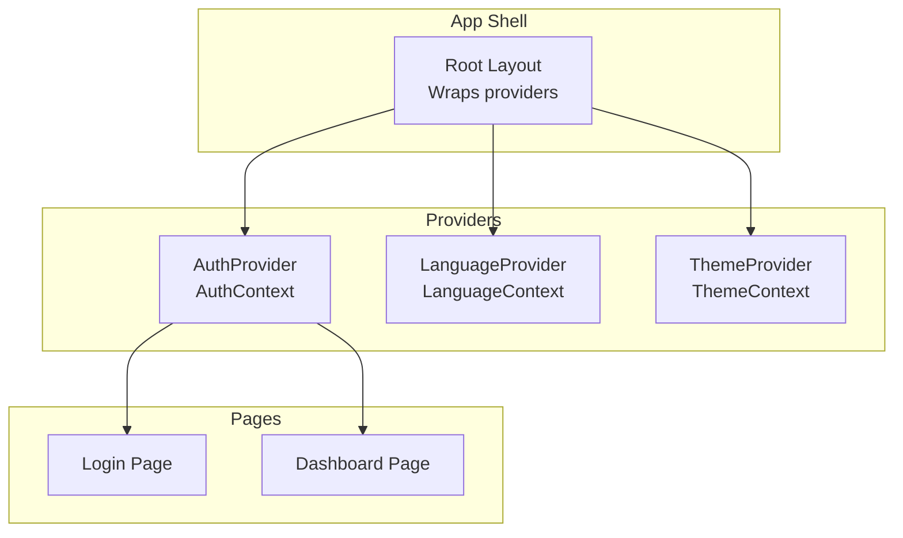
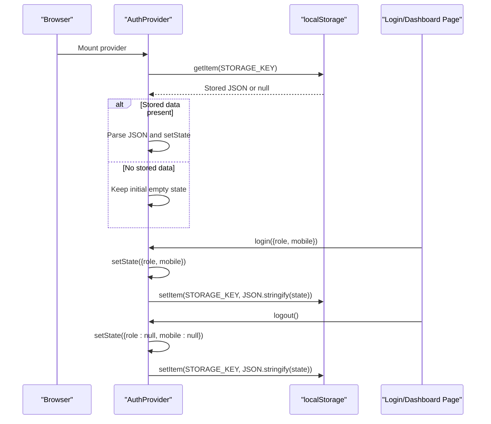
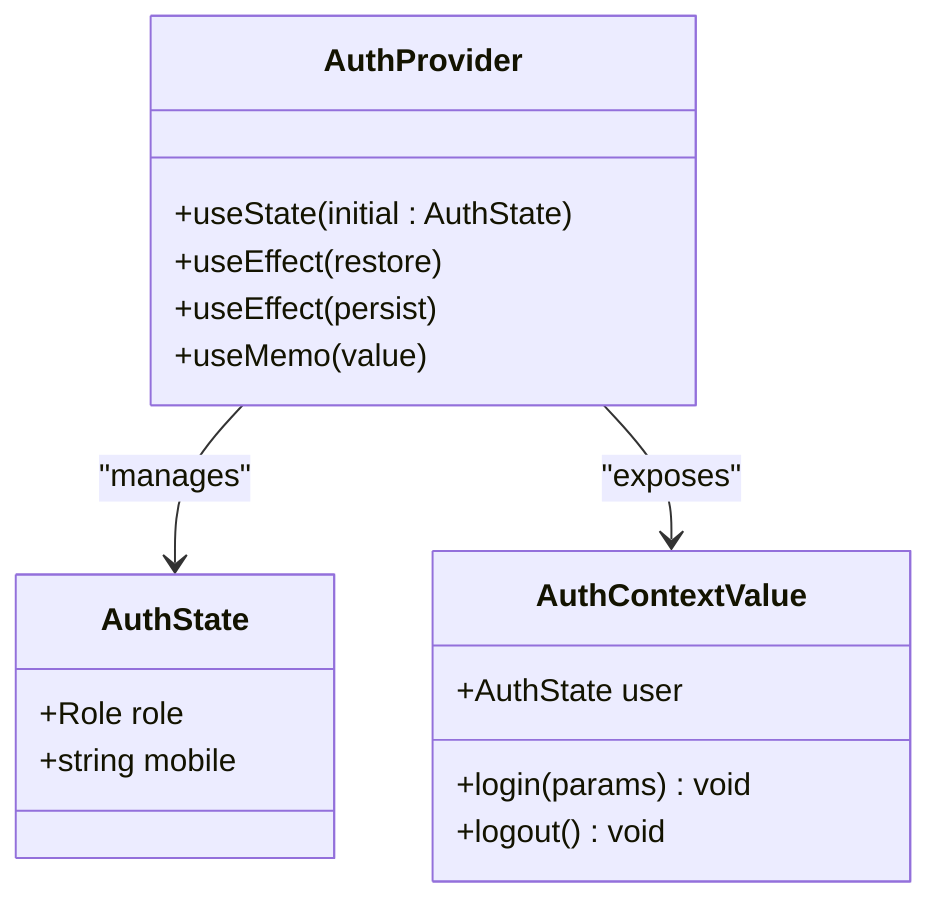
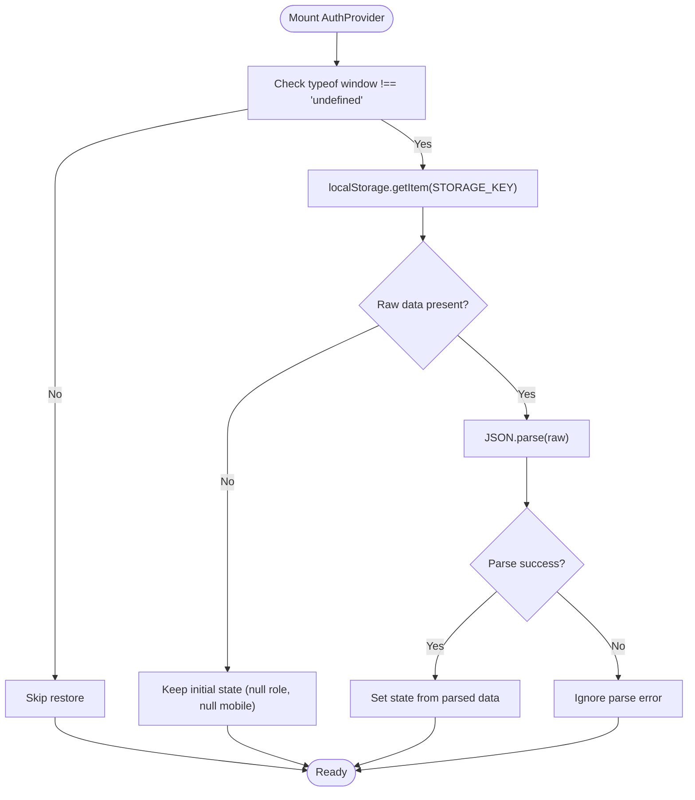
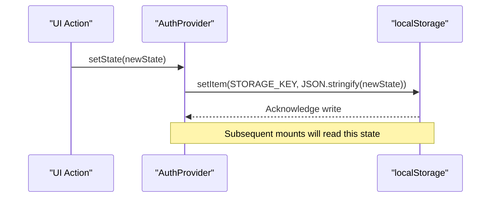
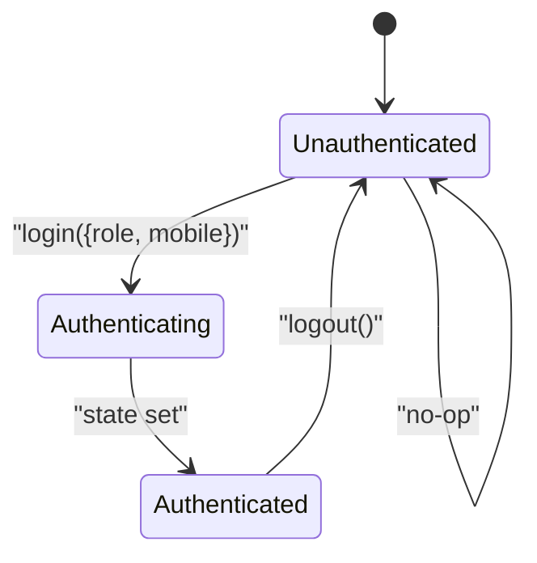
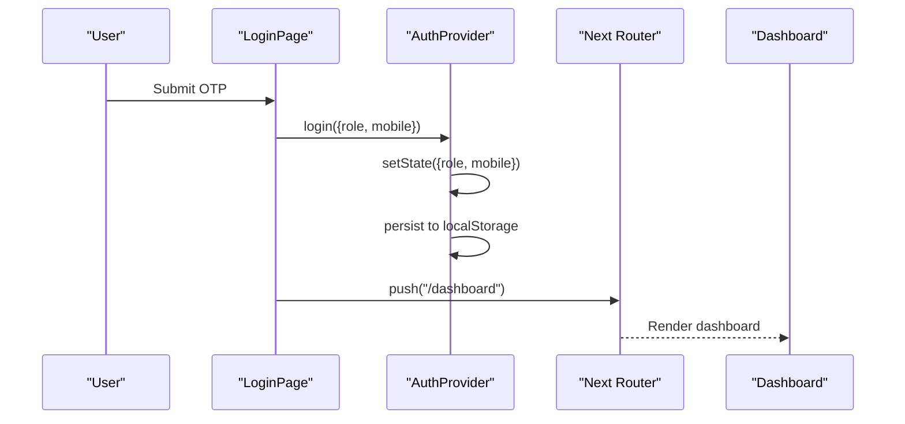
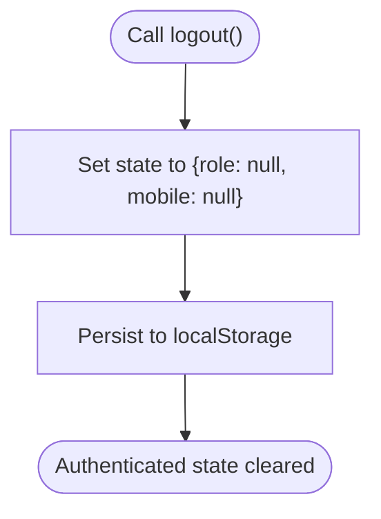
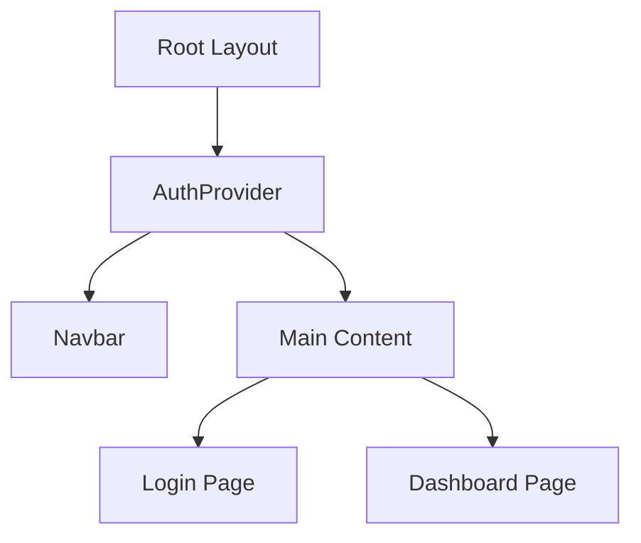
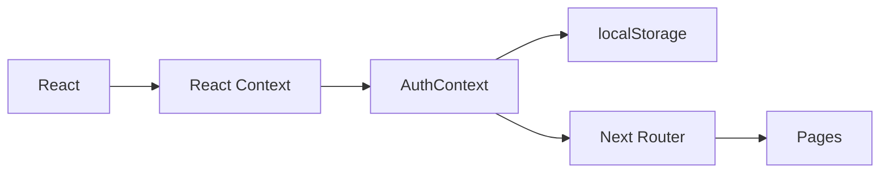

# Session Management & State Persistence

<cite>
**Referenced Files in This Document**
- [AuthContext.tsx](file://components/AuthContext.tsx)
- [layout.tsx](file://app/layout.tsx)
- [login/page.tsx](file://app/login/page.tsx)
- [dashboard/page.tsx](file://app/dashboard/page.tsx)
- [LanguageContext.tsx](file://components/LanguageContext.tsx)
</cite>

## Table of Contents
1. [Introduction](#introduction)
2. [Project Structure](#project-structure)
3. [Core Components](#core-components)
4. [Architecture Overview](#architecture-overview)
5. [Detailed Component Analysis](#detailed-component-analysis)
6. [Dependency Analysis](#dependency-analysis)
7. [Performance Considerations](#performance-considerations)
8. [Security Considerations](#security-considerations)
9. [Troubleshooting Guide](#troubleshooting-guide)
10. [Conclusion](#conclusion)

## Introduction
This document explains the session management and authentication state persistence system implemented in the application. It focuses on how authentication state is modeled, persisted to localStorage, restored automatically on application load, synchronized across browser sessions, and exposed to components via a React Context Provider. It also documents the AuthProvider implementation, state update mechanisms, logout procedures, and security considerations for localStorage usage.

## Project Structure
The authentication system is centered around a React Context Provider that wraps the entire application. The provider manages a minimal authentication state and persists it to localStorage under a dedicated key. Pages consume the context to render role-based views and trigger login/logout actions.

**Diagram sources**
- [layout.tsx:17-46](file://app/layout.tsx#L17-L46)
- [AuthContext.tsx:29-60](file://components/AuthContext.tsx#L29-L60)
- [LanguageContext.tsx:23-50](file://components/LanguageContext.tsx#L23-L50)

**Section sources**
- [layout.tsx:17-46](file://app/layout.tsx#L17-L46)
- [AuthContext.tsx:29-60](file://components/AuthContext.tsx#L29-L60)

## Core Components
- Authentication state model: role and mobile number.
- Storage key: a fixed localStorage key used for persistence.
- Provider lifecycle: restore on mount, persist on state change.
- Public API: login and logout functions exposed to consumers.

Key implementation references:
- State shape and types: [AuthContext.tsx:12-23](file://components/AuthContext.tsx#L12-L23)
- Storage key definition: [AuthContext.tsx:27](file://components/AuthContext.tsx#L27)
- Initial restore effect: [AuthContext.tsx:32-43](file://components/AuthContext.tsx#L32-L43)
- Persist-on-change effect: [AuthContext.tsx:45-48](file://components/AuthContext.tsx#L45-L48)
- Provider value memoization: [AuthContext.tsx:50-57](file://components/AuthContext.tsx#L50-L57)

**Section sources**
- [AuthContext.tsx:12-23](file://components/AuthContext.tsx#L12-L23)
- [AuthContext.tsx:27](file://components/AuthContext.tsx#L27)
- [AuthContext.tsx:32-43](file://components/AuthContext.tsx#L32-L43)
- [AuthContext.tsx:45-48](file://components/AuthContext.tsx#L45-L48)
- [AuthContext.tsx:50-57](file://components/AuthContext.tsx#L50-L57)

## Architecture Overview
The authentication state is a simple object containing role and mobile. The provider initializes state, restores it from localStorage on mount, and writes updates back to localStorage whenever the state changes. Consumers access the state via a hook and call login/logout to mutate it.

**Diagram sources**
- [AuthContext.tsx:29-60](file://components/AuthContext.tsx#L29-L60)
- [login/page.tsx:88-94](file://app/login/page.tsx#L88-L94)
- [dashboard/page.tsx:6-8](file://app/dashboard/page.tsx#L6-L8)

## Detailed Component Analysis

### AuthProvider and Authentication State
The provider defines the authentication state shape, exposes login/logout functions, and manages persistence. It restores state on mount and persists state on every change.

**Diagram sources**
- [AuthContext.tsx:12-23](file://components/AuthContext.tsx#L12-L23)
- [AuthContext.tsx:29-60](file://components/AuthContext.tsx#L29-L60)

Key behaviors:
- Restore on mount: reads from localStorage and parses JSON into state. [AuthContext.tsx:32-43](file://components/AuthContext.tsx#L32-L43)
- Persist on change: writes JSON-serialized state to localStorage whenever user changes. [AuthContext.tsx:45-48](file://components/AuthContext.tsx#L45-L48)
- Update mechanism: login sets role and mobile; logout clears both fields. [AuthContext.tsx:50-57](file://components/AuthContext.tsx#L50-L57)

**Section sources**
- [AuthContext.tsx:12-23](file://components/AuthContext.tsx#L12-L23)
- [AuthContext.tsx:29-60](file://components/AuthContext.tsx#L29-L60)

### Automatic State Restoration on Application Load
On first render, the provider attempts to restore the previous session’s authentication state from localStorage. If parsing fails, it silently ignores the error and keeps the initial empty state.

**Diagram sources**
- [AuthContext.tsx:32-43](file://components/AuthContext.tsx#L32-L43)

**Section sources**
- [AuthContext.tsx:32-43](file://components/AuthContext.tsx#L32-L43)

### State Synchronization Across Browser Sessions
The provider writes the current state to localStorage whenever it changes. This ensures that:
- The same user state is available in new tabs or browser sessions.
- The state survives page refreshes and navigation within the SPA.

**Diagram sources**
- [AuthContext.tsx:45-48](file://components/AuthContext.tsx#L45-L48)

**Section sources**
- [AuthContext.tsx:45-48](file://components/AuthContext.tsx#L45-L48)

### Authentication State Structure and Transitions
The authentication state consists of:
- role: one of the defined roles or null.
- mobile: the authenticated user’s mobile number or null.

Transitions:
- Login: sets role and mobile, persists immediately.
- Logout: clears role and mobile, persists immediately.

**Diagram sources**
- [AuthContext.tsx:50-57](file://components/AuthContext.tsx#L50-L57)

**Section sources**
- [AuthContext.tsx:12-23](file://components/AuthContext.tsx#L12-L23)
- [AuthContext.tsx:50-57](file://components/AuthContext.tsx#L50-L57)

### Login Flow and State Persistence
The login page demonstrates the typical flow:
- Collects role and mobile.
- On OTP verification success, calls login with role and mobile.
- Navigates to the dashboard.

**Diagram sources**
- [login/page.tsx:88-94](file://app/login/page.tsx#L88-L94)
- [AuthContext.tsx:50-57](file://components/AuthContext.tsx#L50-L57)

**Section sources**
- [login/page.tsx:88-94](file://app/login/page.tsx#L88-L94)
- [AuthContext.tsx:50-57](file://components/AuthContext.tsx#L50-L57)

### Logout Procedures
Logout clears the authentication state and persists the cleared state to localStorage. Consumers can trigger logout via the useAuth hook.

**Diagram sources**
- [AuthContext.tsx:50-57](file://components/AuthContext.tsx#L50-L57)

**Section sources**
- [AuthContext.tsx:50-57](file://components/AuthContext.tsx#L50-L57)

### Provider Integration in the Application
The AuthProvider is mounted at the root level so that all pages and components can access the authentication state.

**Diagram sources**
- [layout.tsx:24-42](file://app/layout.tsx#L24-L42)

**Section sources**
- [layout.tsx:24-42](file://app/layout.tsx#L24-L42)

## Dependency Analysis
The authentication system depends on:
- React Context for state distribution.
- localStorage for persistence.
- Next.js routing for navigation after login.

**Diagram sources**
- [AuthContext.tsx:29-60](file://components/AuthContext.tsx#L29-L60)
- [login/page.tsx:88-94](file://app/login/page.tsx#L88-L94)

**Section sources**
- [AuthContext.tsx:29-60](file://components/AuthContext.tsx#L29-L60)
- [login/page.tsx:88-94](file://app/login/page.tsx#L88-L94)

## Performance Considerations
- Single write per state change: The provider writes to localStorage on every state update, which is efficient for small state objects.
- Minimal re-renders: The provider memoizes its value to prevent unnecessary re-renders of consumers.
- Avoid heavy parsing: The restore operation parses a small JSON payload; ensure the stored data remains minimal.

[No sources needed since this section provides general guidance]

## Security Considerations
- LocalStorage exposure: Authentication state is stored in plaintext in localStorage. This is suitable for non-sensitive demo data but not recommended for production credentials.
- Sensitive data: Do not store tokens, secrets, or highly sensitive attributes in localStorage.
- Cross-tab sync: Because localStorage is shared across tabs, any tab can modify the stored state. Consider adding guards if needed.
- XSS risk: Ensure input sanitization and avoid storing untrusted data.
- Session expiration: There is no built-in session expiration in the current implementation. If you require expiration, consider adding an expiring timestamp to the stored state and validating it on restore.

[No sources needed since this section provides general guidance]

## Troubleshooting Guide
Common issues and resolutions:
- State not restored after reload:
  - Verify the STORAGE_KEY matches across runs and that localStorage is enabled.
  - Confirm the stored JSON is valid and parsable.
  - Reference: [AuthContext.tsx:32-43](file://components/AuthContext.tsx#L32-L43)
- State not persisting across tabs:
  - Ensure the provider is mounted at the root and that localStorage writes succeed.
  - Reference: [AuthContext.tsx:45-48](file://components/AuthContext.tsx#L45-L48)
- Login appears to succeed but state resets:
  - Check that login is invoked and that the state update occurs before navigation.
  - Reference: [login/page.tsx:88-94](file://app/login/page.tsx#L88-L94)
- Logout does not clear state:
  - Confirm logout is called and that the state is cleared.
  - Reference: [AuthContext.tsx:50-57](file://components/AuthContext.tsx#L50-L57)
- Conflicting state across environments:
  - Clear localStorage manually or ensure STORAGE_KEY isolation between environments.
  - Reference: [AuthContext.tsx:27](file://components/AuthContext.tsx#L27)

**Section sources**
- [AuthContext.tsx:27](file://components/AuthContext.tsx#L27)
- [AuthContext.tsx:32-43](file://components/AuthContext.tsx#L32-L43)
- [AuthContext.tsx:45-48](file://components/AuthContext.tsx#L45-L48)
- [AuthContext.tsx:50-57](file://components/AuthContext.tsx#L50-L57)
- [login/page.tsx:88-94](file://app/login/page.tsx#L88-L94)

## Conclusion
The authentication system uses a lightweight React Context Provider with localStorage-backed persistence. It restores state on mount, persists changes immediately, and exposes simple login/logout APIs. While functional for demonstration, production-grade systems should incorporate secure token storage, server-side session validation, and session expiration handling.