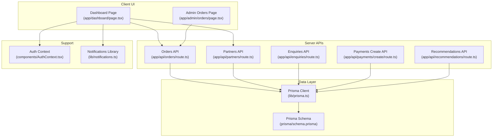
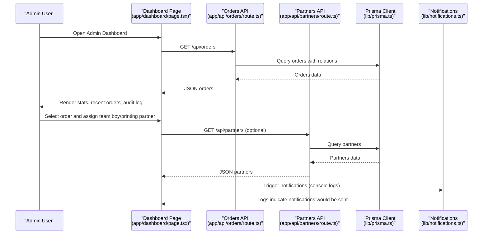
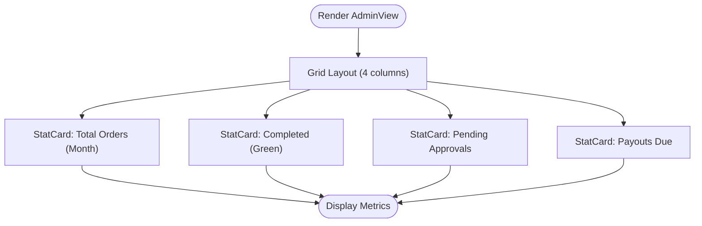
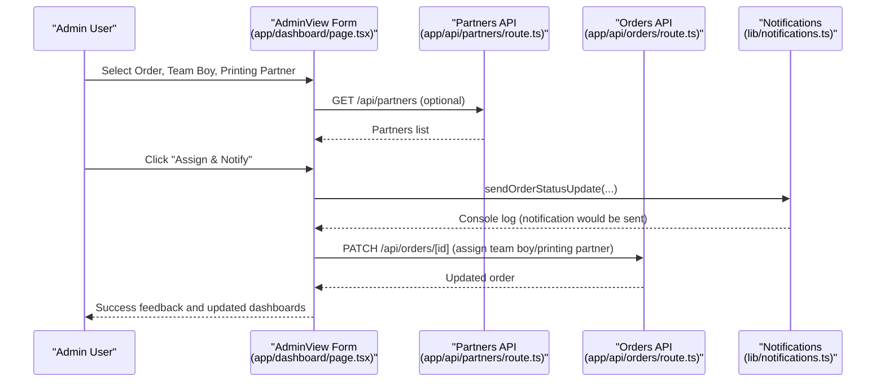
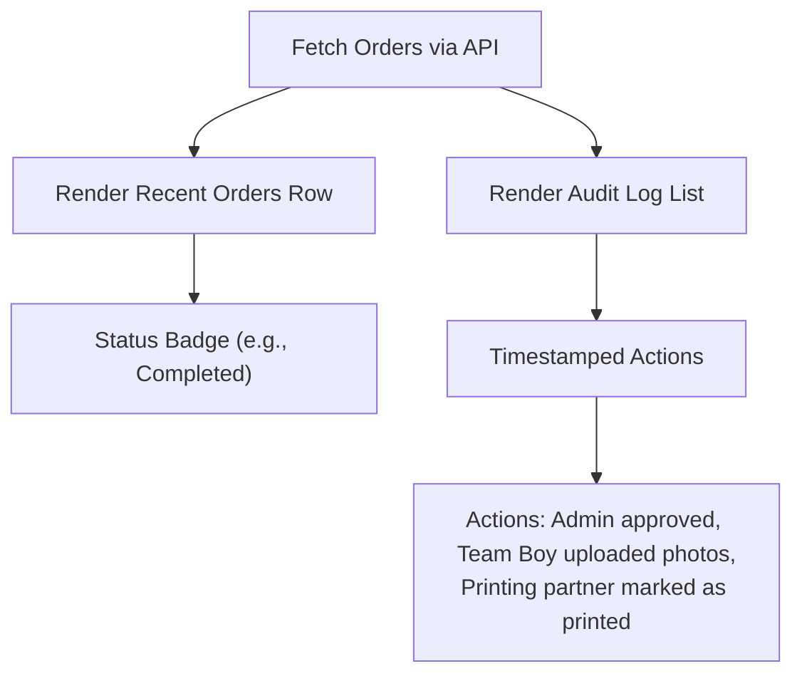
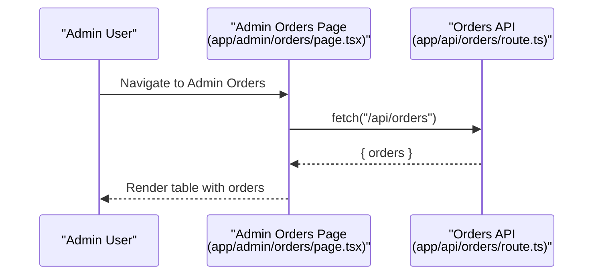
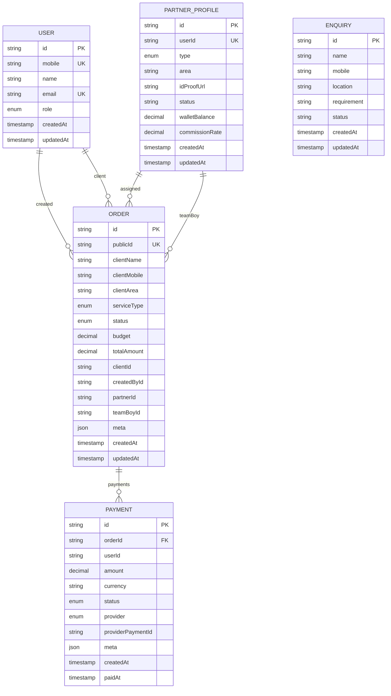
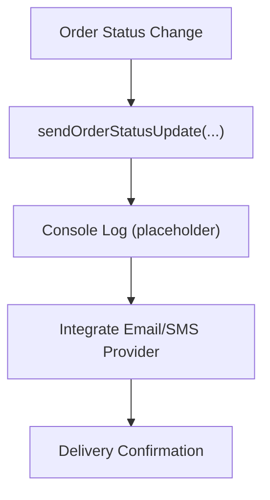
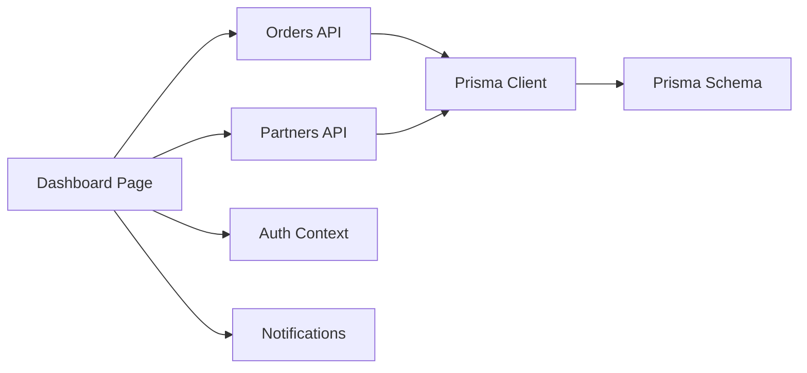

# Admin Dashboard

<cite>
**Referenced Files in This Document**
- [Dashboard Page](file://app/dashboard/page.tsx)
- [Admin Orders Page](file://app/admin/orders/page.tsx)
- [Orders API Route](file://app/api/orders/route.ts)
- [Partners API Route](file://app/api/partners/route.ts)
- [Notifications Library](file://lib/notifications.ts)
- [Prisma Client](file://lib/prisma.ts)
- [Prisma Schema](file://prisma/schema.prisma)
- [Auth Context](file://components/AuthContext.tsx)
- [Enquiries API Route](file://app/api/enquiries/route.ts)
- [Payments Create API Route](file://app/api/payments/create/route.ts)
- [Recommendations API Route](file://app/api/recommendations/route.ts)
</cite>

## Table of Contents
1. [Introduction](#introduction)
2. [Project Structure](#project-structure)
3. [Core Components](#core-components)
4. [Architecture Overview](#architecture-overview)
5. [Detailed Component Analysis](#detailed-component-analysis)
6. [Dependency Analysis](#dependency-analysis)
7. [Performance Considerations](#performance-considerations)
8. [Troubleshooting Guide](#troubleshooting-guide)
9. [Conclusion](#conclusion)

## Introduction
This document describes the Admin Dashboard system, focusing on administrative overview features, order assignment workflows, recent orders display, audit logging, statistics cards, and integration with the order management system. It also outlines customization options, visualization examples, filtering capabilities, and automation hooks for notifications.

## Project Structure
The Admin Dashboard is implemented as a Next.js app with role-based views. The admin view aggregates:
- Statistics cards for total orders, completed orders, pending approvals, and payouts
- Order assignment controls for assigning team boys and printing partners
- Recent orders display and audit log panel

Key supporting components:
- Admin Orders page for listing orders via API
- Prisma schema modeling orders, users, and partners
- Notifications library for automated alerts
- Authentication context for role-based rendering

**Diagram sources**
- [Dashboard Page:1-257](file://app/dashboard/page.tsx#L1-L257)
- [Admin Orders Page:1-92](file://app/admin/orders/page.tsx#L1-L92)
- [Orders API Route:1-90](file://app/api/orders/route.ts#L1-L90)
- [Partners API Route:1-117](file://app/api/partners/route.ts#L1-L117)
- [Prisma Client:1-17](file://lib/prisma.ts#L1-L17)
- [Prisma Schema:1-173](file://prisma/schema.prisma#L1-L173)
- [Auth Context:1-70](file://components/AuthContext.tsx#L1-L70)
- [Notifications Library:1-28](file://lib/notifications.ts#L1-L28)
- [Enquiries API Route:1-84](file://app/api/enquiries/route.ts#L1-L84)
- [Payments Create API Route:1-46](file://app/api/payments/create/route.ts#L1-L46)
- [Recommendations API Route:1-56](file://app/api/recommendations/route.ts#L1-L56)

**Section sources**
- [Dashboard Page:1-257](file://app/dashboard/page.tsx#L1-L257)
- [Admin Orders Page:1-92](file://app/admin/orders/page.tsx#L1-L92)
- [Orders API Route:1-90](file://app/api/orders/route.ts#L1-L90)
- [Partners API Route:1-117](file://app/api/partners/route.ts#L1-L117)
- [Prisma Client:1-17](file://lib/prisma.ts#L1-L17)
- [Prisma Schema:1-173](file://prisma/schema.prisma#L1-L173)
- [Auth Context:1-70](file://components/AuthContext.tsx#L1-L70)
- [Notifications Library:1-28](file://lib/notifications.ts#L1-L28)
- [Enquiries API Route:1-84](file://app/api/enquiries/route.ts#L1-L84)
- [Payments Create API Route:1-46](file://app/api/payments/create/route.ts#L1-L46)
- [Recommendations API Route:1-56](file://app/api/recommendations/route.ts#L1-L56)

## Core Components
- Role-based dashboard rendering via Auth Context
- Statistics cards with color-coded indicators for performance metrics
- Order assignment form with team boy and printing partner selectors
- Recent orders display and audit log panel
- Admin Orders page with tabular listing and loading/error states
- Notifications library for order status updates and confirmations

**Section sources**
- [Dashboard Page:6-38](file://app/dashboard/page.tsx#L6-L38)
- [Dashboard Page:40-53](file://app/dashboard/page.tsx#L40-L53)
- [Dashboard Page:55-124](file://app/dashboard/page.tsx#L55-L124)
- [Dashboard Page:126-255](file://app/dashboard/page.tsx#L126-L255)
- [Admin Orders Page:16-90](file://app/admin/orders/page.tsx#L16-L90)
- [Notifications Library:1-28](file://lib/notifications.ts#L1-L28)

## Architecture Overview
The Admin Dashboard integrates client-side UI with serverless API routes backed by Prisma ORM and a PostgreSQL database. The flow below illustrates the admin overview and order assignment workflow.

**Diagram sources**
- [Dashboard Page:1-257](file://app/dashboard/page.tsx#L1-L257)
- [Orders API Route:1-25](file://app/api/orders/route.ts#L1-L25)
- [Partners API Route:1-23](file://app/api/partners/route.ts#L1-L23)
- [Prisma Client:1-17](file://lib/prisma.ts#L1-L17)
- [Notifications Library:1-28](file://lib/notifications.ts#L1-L28)

## Detailed Component Analysis

### Admin Overview and Stats Cards
- Purpose: Provide at-a-glance KPIs for administrators.
- Features:
  - Total orders (monthly)
  - Completed orders
  - Pending approvals
  - Payouts due
- Implementation highlights:
  - Reusable StatCard component with accent variants for color-coded indicators
  - AdminView renders four StatCards in a responsive grid
- Extensibility:
  - Replace static values with dynamic data fetched from backend endpoints
  - Add trend indicators and tooltips

**Diagram sources**
- [Dashboard Page:55-63](file://app/dashboard/page.tsx#L55-L63)
- [Dashboard Page:40-53](file://app/dashboard/page.tsx#L40-L53)

**Section sources**
- [Dashboard Page:40-63](file://app/dashboard/page.tsx#L40-L63)

### Order Assignment Workflow
- Purpose: Allow admins to assign team boys and printing partners to orders with automatic notifications.
- UI Elements:
  - Order selector dropdown
  - Team Boy selector
  - Printing Partner selector
  - Assign & Notify button
- Behavior:
  - On selection and submission, the UI logs notification triggers to console
  - In a production system, this would call backend endpoints to update order assignments and dispatch notifications
- Integration points:
  - Fetch available partners via Partners API
  - Update order assignment via Orders API (to be implemented)
  - Trigger notifications via Notifications library

**Diagram sources**
- [Dashboard Page:64-92](file://app/dashboard/page.tsx#L64-L92)
- [Partners API Route:1-23](file://app/api/partners/route.ts#L1-L23)
- [Orders API Route:1-25](file://app/api/orders/route.ts#L1-L25)
- [Notifications Library:1-28](file://lib/notifications.ts#L1-L28)

**Section sources**
- [Dashboard Page:64-92](file://app/dashboard/page.tsx#L64-L92)
- [Partners API Route:1-117](file://app/api/partners/route.ts#L1-L117)
- [Notifications Library:1-28](file://lib/notifications.ts#L1-L28)

### Recent Orders Display and Audit Log
- Purpose: Show recent order activities and a chronological audit trail.
- UI Elements:
  - Recent orders row with order details and status badge
  - Audit log list with timestamps and actions
- Data source:
  - Orders API provides order list with client, partner, and team boy relations
- Extensibility:
  - Add pagination and sorting
  - Include status transitions and action buttons (approve, mark printed, etc.)

**Diagram sources**
- [Dashboard Page:93-121](file://app/dashboard/page.tsx#L93-L121)
- [Orders API Route:6-25](file://app/api/orders/route.ts#L6-L25)

**Section sources**
- [Dashboard Page:93-121](file://app/dashboard/page.tsx#L93-L121)
- [Orders API Route:6-25](file://app/api/orders/route.ts#L6-L25)

### Admin Orders Listing
- Purpose: Provide an admin view of all orders with basic CRUD support.
- Features:
  - Loading, error, and empty states
  - Tabular display with columns for ID, client, mobile, area, service, status, and created date
  - Client-side fetch to /api/orders
- Extensibility:
  - Add filters (status, service type, date range)
  - Add sorting and pagination
  - Add inline edit for status and assignment

**Diagram sources**
- [Admin Orders Page:16-90](file://app/admin/orders/page.tsx#L16-L90)
- [Orders API Route:6-25](file://app/api/orders/route.ts#L6-L25)

**Section sources**
- [Admin Orders Page:16-90](file://app/admin/orders/page.tsx#L16-L90)
- [Orders API Route:6-25](file://app/api/orders/route.ts#L6-L25)

### Data Model and Integrations
- Entities:
  - User, PartnerProfile, Order, Payment, Enquiry, RecommendationRequest
- Relationships:
  - Orders relate to clients, creators, assigned partners, and team boys
  - Payments link to orders and users
- Integration points:
  - Orders API returns enriched order data for dashboard consumption
  - Notifications library centralizes alert mechanisms
  - Auth Context drives role-based UI rendering

**Diagram sources**
- [Prisma Schema:57-144](file://prisma/schema.prisma#L57-L144)

**Section sources**
- [Prisma Schema:1-173](file://prisma/schema.prisma#L1-L173)

### Notifications and Automation Hooks
- Current state:
  - Notifications library logs events to console (placeholders for email/SMS)
- Integration points:
  - Order status updates, confirmations, and partner applications
  - To be wired into order assignment and status change flows
- Extensibility:
  - Replace console logs with real provider integrations (email/SMS gateways)
  - Add retry logic and delivery receipts

**Diagram sources**
- [Notifications Library:1-28](file://lib/notifications.ts#L1-L28)

**Section sources**
- [Notifications Library:1-28](file://lib/notifications.ts#L1-L28)

### Additional Admin APIs
- Enquiries API: Create and list enquiries (admin only)
- Payments Create API: Stub to initiate payment creation
- Recommendations API: Stubbed recommendation engine

**Section sources**
- [Enquiries API Route:1-84](file://app/api/enquiries/route.ts#L1-L84)
- [Payments Create API Route:1-46](file://app/api/payments/create/route.ts#L1-L46)
- [Recommendations API Route:1-56](file://app/api/recommendations/route.ts#L1-L56)

## Dependency Analysis
- Client UI depends on:
  - Auth Context for role-based rendering
  - Orders API for order data
  - Partners API for partner lists
  - Notifications library for automation hooks
- Backend APIs depend on:
  - Prisma Client for database operations
  - Prisma Schema for entity definitions
- Coupling and cohesion:
  - UI components are cohesive around roles and dashboards
  - APIs encapsulate data access and validation
  - Notifications library centralizes alert logic

**Diagram sources**
- [Dashboard Page:1-257](file://app/dashboard/page.tsx#L1-L257)
- [Orders API Route:1-90](file://app/api/orders/route.ts#L1-L90)
- [Partners API Route:1-117](file://app/api/partners/route.ts#L1-L117)
- [Auth Context:1-70](file://components/AuthContext.tsx#L1-L70)
- [Notifications Library:1-28](file://lib/notifications.ts#L1-L28)
- [Prisma Client:1-17](file://lib/prisma.ts#L1-L17)
- [Prisma Schema:1-173](file://prisma/schema.prisma#L1-L173)

**Section sources**
- [Dashboard Page:1-257](file://app/dashboard/page.tsx#L1-L257)
- [Orders API Route:1-90](file://app/api/orders/route.ts#L1-L90)
- [Partners API Route:1-117](file://app/api/partners/route.ts#L1-L117)
- [Auth Context:1-70](file://components/AuthContext.tsx#L1-L70)
- [Notifications Library:1-28](file://lib/notifications.ts#L1-L28)
- [Prisma Client:1-17](file://lib/prisma.ts#L1-L17)
- [Prisma Schema:1-173](file://prisma/schema.prisma#L1-L173)

## Performance Considerations
- Client-side:
  - Use virtualized tables for large order lists
  - Debounce search/filter inputs
  - Lazy-load partner lists on demand
- Server-side:
  - Paginate order listings and limit returned fields
  - Index frequently queried columns (status, createdAt)
  - Cache static partner lists
- Observability:
  - Instrument API latency and error rates
  - Track notification delivery success

## Troubleshooting Guide
- Dashboard shows guest role:
  - Verify Auth Context persistence and localStorage availability
- Orders list shows loading or error:
  - Check network tab for /api/orders response
  - Confirm database connectivity and Prisma client initialization
- Notifications not firing:
  - Ensure Notifications library is invoked during assignment/status changes
  - Replace console logs with provider integrations
- Partner assignment fails:
  - Validate partner type and mobile number formats
  - Confirm user existence and role mapping

**Section sources**
- [Auth Context:27-48](file://components/AuthContext.tsx#L27-L48)
- [Admin Orders Page:21-39](file://app/admin/orders/page.tsx#L21-L39)
- [Prisma Client:1-17](file://lib/prisma.ts#L1-L17)
- [Notifications Library:1-28](file://lib/notifications.ts#L1-L28)
- [Partners API Route:30-54](file://app/api/partners/route.ts#L30-L54)

## Conclusion
The Admin Dashboard provides a foundation for administrative oversight with statistics, order assignment, and audit visibility. By integrating backend APIs, enhancing data fetching, and wiring notifications, the system can automate workflows and improve operational efficiency. The modular design supports incremental enhancements such as filtering, reporting, and real-time dashboards.