# Dashboard System

<cite>
**Referenced Files in This Document**
- [app/dashboard/page.tsx](file://app/dashboard/page.tsx)
- [components/AuthContext.tsx](file://components/AuthContext.tsx)
- [app/layout.tsx](file://app/layout.tsx)
- [app/admin/orders/page.tsx](file://app/admin/orders/page.tsx)
- [app/api/orders/route.ts](file://app/api/orders/route.ts)
- [app/api/orders/[id]/route.ts](file://app/api/orders/[id]/route.ts)
- [app/api/partners/route.ts](file://app/api/partners/route.ts)
- [app/login/page.tsx](file://app/login/page.tsx)
- [app/services/page.tsx](file://app/services/page.tsx)
- [lib/prisma.ts](file://lib/prisma.ts)
- [lib/notifications.ts](file://lib/notifications.ts)
- [tailwind.config.ts](file://tailwind.config.ts)
- [app/globals.css](file://app/globals.css)
- [components/LiveChat.tsx](file://components/LiveChat.tsx)
</cite>

## Table of Contents
1. [Introduction](#introduction)
2. [Project Structure](#project-structure)
3. [Core Components](#core-components)
4. [Architecture Overview](#architecture-overview)
5. [Detailed Component Analysis](#detailed-component-analysis)
6. [Dependency Analysis](#dependency-analysis)
7. [Performance Considerations](#performance-considerations)
8. [Troubleshooting Guide](#troubleshooting-guide)
9. [Conclusion](#conclusion)
10. [Appendices](#appendices)

## Introduction
This document describes the multi-role dashboard system that powers three distinct portals:
- Admin dashboard for order monitoring, user/team management, and system analytics
- Team Boy portal for task acceptance, work completion tracking, and earnings management
- Printing Partner portal for order intake, job completion, and commission tracking

It explains role-based layouts, data visualization components, interactive elements, data sources, real-time update pathways, filtering capabilities, user workflows, customization options, and integration points with the broader application. It also covers performance and responsive design considerations.

## Project Structure
The dashboard system is organized around role-specific views rendered on a single dashboard page, with supporting authentication, API routes, and shared UI themes.

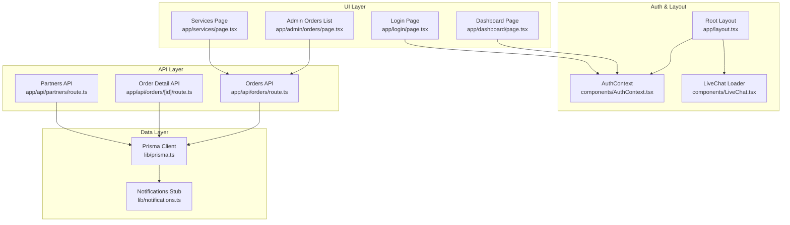

**Diagram sources**
- [app/dashboard/page.tsx:1-257](file://app/dashboard/page.tsx#L1-L257)
- [components/AuthContext.tsx:1-70](file://components/AuthContext.tsx#L1-L70)
- [app/layout.tsx:1-48](file://app/layout.tsx#L1-L48)
- [components/LiveChat.tsx:1-51](file://components/LiveChat.tsx#L1-L51)
- [app/admin/orders/page.tsx:1-92](file://app/admin/orders/page.tsx#L1-L92)
- [app/services/page.tsx:1-236](file://app/services/page.tsx#L1-L236)
- [app/api/orders/route.ts:1-68](file://app/api/orders/route.ts#L1-L68)
- [app/api/orders/[id]/route.ts](file://app/api/orders/[id]/route.ts#L1-L54)
- [app/api/partners/route.ts:1-90](file://app/api/partners/route.ts#L1-L90)
- [lib/prisma.ts:1-17](file://lib/prisma.ts#L1-L17)
- [lib/notifications.ts:1-27](file://lib/notifications.ts#L1-L27)

**Section sources**
- [app/dashboard/page.tsx:1-38](file://app/dashboard/page.tsx#L1-L38)
- [components/AuthContext.tsx:12-23](file://components/AuthContext.tsx#L12-L23)
- [app/layout.tsx:17-46](file://app/layout.tsx#L17-L46)

## Core Components
- Role-based dashboard renderer: selects and renders the appropriate portal view based on the authenticated user’s role.
- Authentication context: manages role and mobile state, persists to local storage, and exposes login/logout.
- Admin Orders page: lists orders fetched from the backend API with loading/error states.
- API routes: provide order listing, creation, retrieval by ID, and patching for status/assignee updates; partner onboarding endpoints.
- Prisma client: central database client initialization and logging.
- Notifications stub: placeholder for email/SMS integrations.
- Styling and responsiveness: Tailwind-based theme and responsive breakpoints.

**Section sources**
- [app/dashboard/page.tsx:6-38](file://app/dashboard/page.tsx#L6-L38)
- [components/AuthContext.tsx:29-68](file://components/AuthContext.tsx#L29-L68)
- [app/admin/orders/page.tsx:16-39](file://app/admin/orders/page.tsx#L16-L39)
- [app/api/orders/route.ts:4-28](file://app/api/orders/route.ts#L4-L28)
- [app/api/orders/[id]/route.ts](file://app/api/orders/[id]/route.ts#L12-L52)
- [app/api/partners/route.ts:4-27](file://app/api/partners/route.ts#L4-L27)
- [lib/prisma.ts:7-15](file://lib/prisma.ts#L7-L15)
- [lib/notifications.ts:6-26](file://lib/notifications.ts#L6-L26)
- [tailwind.config.ts:3-27](file://tailwind.config.ts#L3-L27)

## Architecture Overview
The dashboard system follows a client-rendered role switch with server-backed APIs. Authentication state determines which portal is shown. Admin portal integrates with order listing and order detail APIs. Team Boy and Printing Partner portals are present in the dashboard renderer and include interactive forms and stat cards.

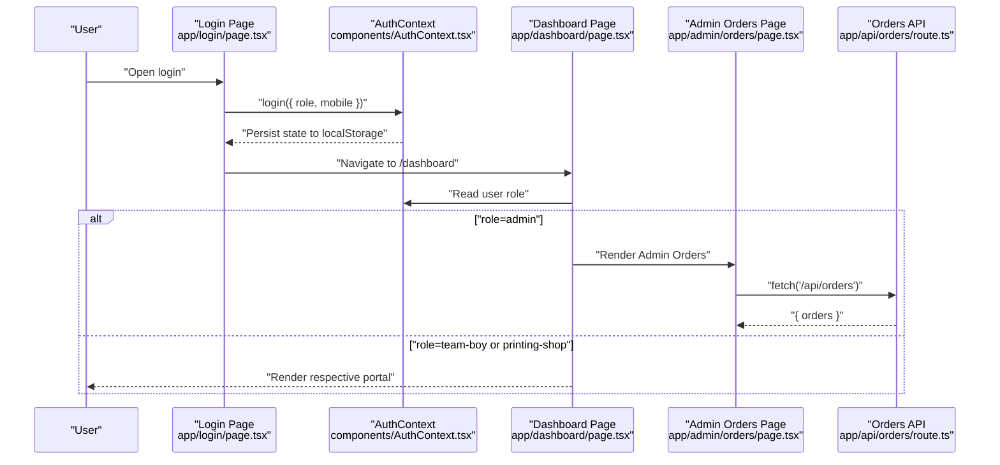

**Diagram sources**
- [app/login/page.tsx:88-94](file://app/login/page.tsx#L88-L94)
- [components/AuthContext.tsx:50-57](file://components/AuthContext.tsx#L50-L57)
- [app/dashboard/page.tsx:6-38](file://app/dashboard/page.tsx#L6-L38)
- [app/admin/orders/page.tsx:21-39](file://app/admin/orders/page.tsx#L21-L39)
- [app/api/orders/route.ts:4-28](file://app/api/orders/route.ts#L4-L28)

## Detailed Component Analysis

### Role-Based Dashboard Renderer
- Reads current role from authentication context.
- Renders Admin, Team Boy, or Printing Partner views.
- Provides guest action to navigate to login when unauthenticated.

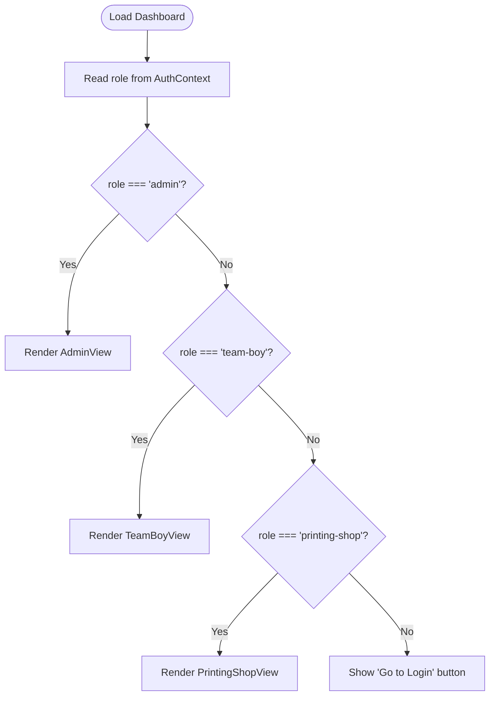

**Diagram sources**
- [app/dashboard/page.tsx:6-38](file://app/dashboard/page.tsx#L6-L38)

**Section sources**
- [app/dashboard/page.tsx:6-38](file://app/dashboard/page.tsx#L6-L38)

### Admin Dashboard Features
- Stat cards for high-level metrics.
- Work assignment form for selecting orders and assigning Team Boy and Printing Partner.
- Recent orders list and audit log panel.

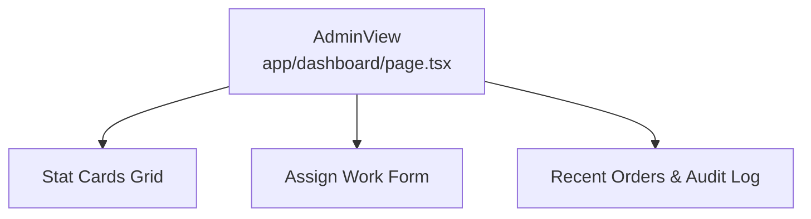

**Diagram sources**
- [app/dashboard/page.tsx:55-124](file://app/dashboard/page.tsx#L55-L124)

**Section sources**
- [app/dashboard/page.tsx:55-124](file://app/dashboard/page.tsx#L55-L124)

### Team Boy Portal
- Task summary stats (daily tasks, weekly completed, wallet balance).
- Accept/update work section with route details and photo upload.
- Earnings/wallet panel with pending/paid entries and monthly report download.

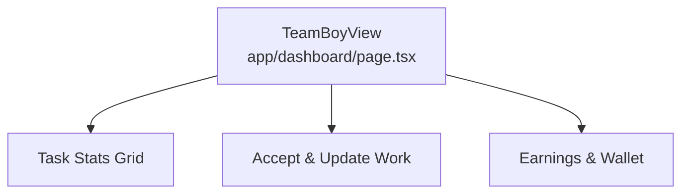

**Diagram sources**
- [app/dashboard/page.tsx:126-187](file://app/dashboard/page.tsx#L126-L187)

**Section sources**
- [app/dashboard/page.tsx:126-187](file://app/dashboard/page.tsx#L126-L187)

### Printing Partner Portal
- Monthly orders, completed count, and commission wallet.
- Add client print job form with client info, service type, quantity/size, job details, and optional file attachment.
- Commissions and monthly statement download.

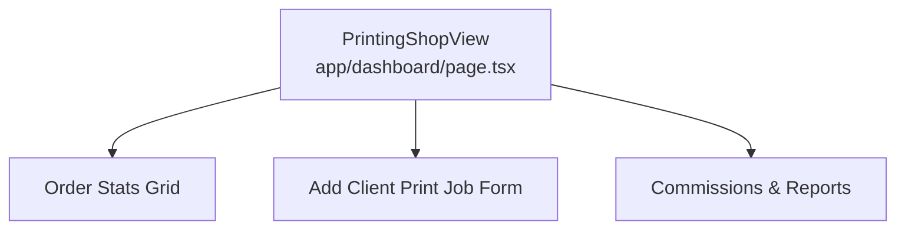

**Diagram sources**
- [app/dashboard/page.tsx:189-255](file://app/dashboard/page.tsx#L189-L255)

**Section sources**
- [app/dashboard/page.tsx:189-255](file://app/dashboard/page.tsx#L189-L255)

### Authentication and Role Management
- Role types include admin, team-boy, and printing-shop.
- Persists role and mobile in browser local storage.
- Exposes login and logout functions.

```mermaid
classDiagram
class AuthContext {
+user : AuthState
+login(params)
+logout()
}
class AuthState {
+role : Role
+mobile : string
}
class Role {
<<enum>>
"admin"
"team-boy"
"printing-shop"
}
AuthContext --> AuthState : "manages"
AuthState --> Role : "has"
```

**Diagram sources**
- [components/AuthContext.tsx:12-23](file://components/AuthContext.tsx#L12-L23)
- [components/AuthContext.tsx:29-68](file://components/AuthContext.tsx#L29-L68)

**Section sources**
- [components/AuthContext.tsx:12-23](file://components/AuthContext.tsx#L12-L23)
- [components/AuthContext.tsx:29-68](file://components/AuthContext.tsx#L29-L68)

### Admin Orders Listing
- Fetches orders from the backend API on mount.
- Handles loading, error, and empty states.
- Displays a responsive table with order metadata.

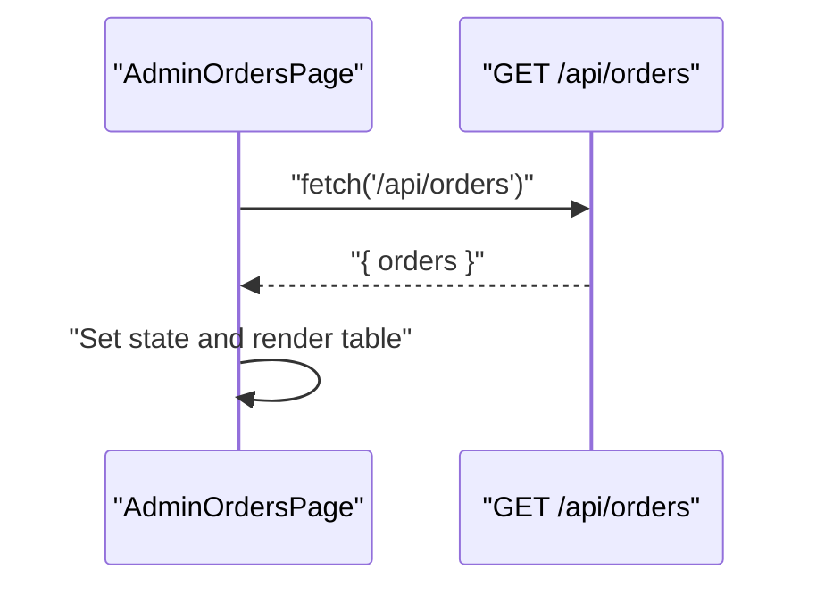

**Diagram sources**
- [app/admin/orders/page.tsx:21-39](file://app/admin/orders/page.tsx#L21-L39)
- [app/api/orders/route.ts:4-28](file://app/api/orders/route.ts#L4-L28)

**Section sources**
- [app/admin/orders/page.tsx:16-89](file://app/admin/orders/page.tsx#L16-L89)
- [app/api/orders/route.ts:4-28](file://app/api/orders/route.ts#L4-L28)

### Order Creation and Detail APIs
- POST /api/orders creates an order from client/partner requests.
- GET /api/orders lists orders for admin dashboard.
- GET /api/orders/[id] retrieves a specific order with related entities.
- PATCH /api/orders/[id] updates status and assignees (used by Admin workflow).

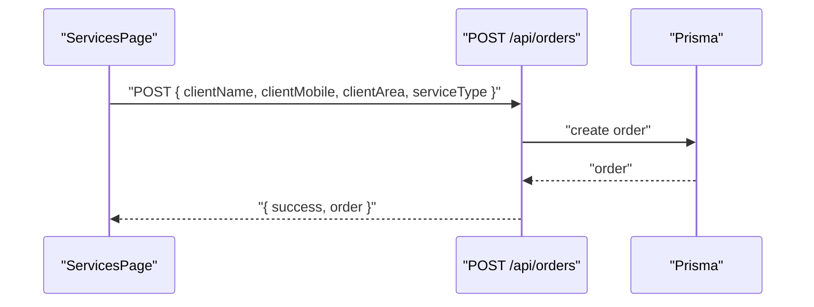

**Diagram sources**
- [app/services/page.tsx:78-121](file://app/services/page.tsx#L78-L121)
- [app/api/orders/route.ts:31-66](file://app/api/orders/route.ts#L31-L66)
- [lib/prisma.ts:7-15](file://lib/prisma.ts#L7-L15)

**Section sources**
- [app/services/page.tsx:78-121](file://app/services/page.tsx#L78-L121)
- [app/api/orders/route.ts:31-66](file://app/api/orders/route.ts#L31-L66)
- [app/api/orders/[id]/route.ts](file://app/api/orders/[id]/route.ts#L12-L52)

### Partner Onboarding API
- GET /api/partners returns mock partner list.
- POST /api/partners validates and accepts partner applications.

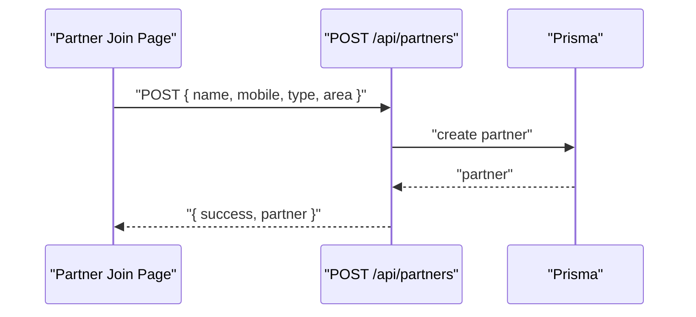

**Diagram sources**
- [app/api/partners/route.ts:30-88](file://app/api/partners/route.ts#L30-L88)
- [lib/prisma.ts:7-15](file://lib/prisma.ts#L7-L15)

**Section sources**
- [app/api/partners/route.ts:4-27](file://app/api/partners/route.ts#L4-L27)
- [app/api/partners/route.ts:30-88](file://app/api/partners/route.ts#L30-L88)

### Data Visualization and Interactive Elements
- Stat cards: compact metric displays with accent variants for positive values.
- Forms: selection controls, file uploads, and submit actions tailored per role.
- Lists: recent orders and audit trails; commissions and earnings logs.

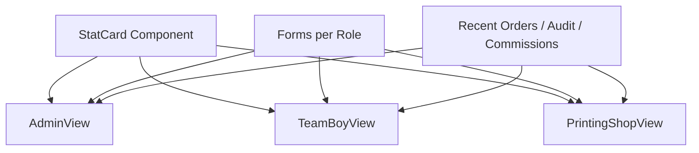

**Diagram sources**
- [app/dashboard/page.tsx:40-53](file://app/dashboard/page.tsx#L40-L53)
- [app/dashboard/page.tsx:55-124](file://app/dashboard/page.tsx#L55-L124)
- [app/dashboard/page.tsx:126-187](file://app/dashboard/page.tsx#L126-L187)
- [app/dashboard/page.tsx:189-255](file://app/dashboard/page.tsx#L189-L255)

**Section sources**
- [app/dashboard/page.tsx:40-53](file://app/dashboard/page.tsx#L40-L53)
- [app/dashboard/page.tsx:55-124](file://app/dashboard/page.tsx#L55-L124)
- [app/dashboard/page.tsx:126-187](file://app/dashboard/page.tsx#L126-L187)
- [app/dashboard/page.tsx:189-255](file://app/dashboard/page.tsx#L189-L255)

### Filtering and Real-Time Updates
- Filtering: present in Admin Orders page table header; future enhancements can add client area, service type, status, and date range filters.
- Real-time updates: current implementation relies on page reloads; recommended enhancements include WebSocket connections and server-sent events to push updates to dashboards upon order/status changes.

[No sources needed since this section provides general guidance]

### Dashboard Customization Options
- Role-based layout switching based on authenticated role.
- Theme: white/light theme enforced globally; dark mode supported via class toggles.
- Responsive design: grid and table layouts adapt to small, medium, and larger screens using Tailwind utilities.

**Section sources**
- [app/layout.tsx:23-44](file://app/layout.tsx#L23-L44)
- [tailwind.config.ts:8-27](file://tailwind.config.ts#L8-L27)
- [app/globals.css:28-31](file://app/globals.css#L28-L31)

## Dependency Analysis
The dashboard depends on authentication state, API routes, and the Prisma client. Notifications are stubbed for future integration.

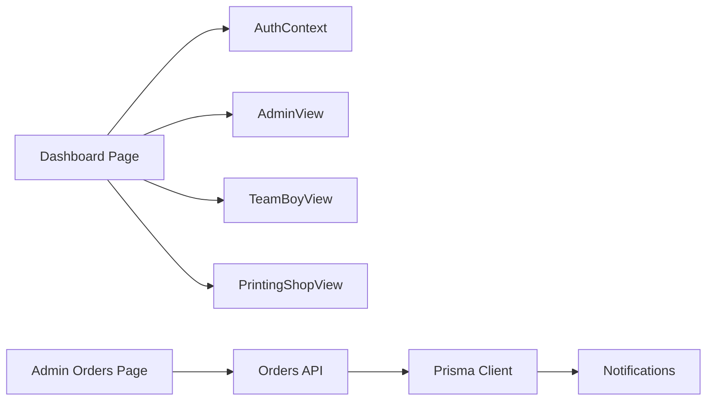

**Diagram sources**
- [app/dashboard/page.tsx:6-38](file://app/dashboard/page.tsx#L6-L38)
- [components/AuthContext.tsx:29-68](file://components/AuthContext.tsx#L29-L68)
- [app/admin/orders/page.tsx:21-39](file://app/admin/orders/page.tsx#L21-L39)
- [app/api/orders/route.ts:4-28](file://app/api/orders/route.ts#L4-L28)
- [lib/prisma.ts:7-15](file://lib/prisma.ts#L7-L15)
- [lib/notifications.ts:6-26](file://lib/notifications.ts#L6-L26)

**Section sources**
- [components/AuthContext.tsx:29-68](file://components/AuthContext.tsx#L29-L68)
- [app/admin/orders/page.tsx:21-39](file://app/admin/orders/page.tsx#L21-L39)
- [app/api/orders/route.ts:4-28](file://app/api/orders/route.ts#L4-L28)
- [lib/prisma.ts:7-15](file://lib/prisma.ts#L7-L15)
- [lib/notifications.ts:6-26](file://lib/notifications.ts#L6-L26)

## Performance Considerations
- Client-side rendering: role switch is fast; avoid heavy computations in render paths.
- API calls: batch and cache where possible; implement pagination for order listings.
- Images: lazy-load completion photos and thumbnails; compress assets.
- Responsiveness: leverage existing Tailwind grid/table utilities; avoid excessive DOM nesting.
- Theme: keep styles minimal; avoid runtime theme switching overhead.

[No sources needed since this section provides general guidance]

## Troubleshooting Guide
- Authentication issues: verify local storage persistence and context provider wrapping.
- API failures: check network tab for 4xx/5xx responses; confirm environment variables for live chat providers.
- Order listing errors: ensure API route returns proper JSON and handles missing data gracefully.
- Notifications: confirm stubs are replaced with real integrations before production.

**Section sources**
- [components/AuthContext.tsx:32-48](file://components/AuthContext.tsx#L32-L48)
- [app/admin/orders/page.tsx:24-36](file://app/admin/orders/page.tsx#L24-L36)
- [components/LiveChat.tsx:16-46](file://components/LiveChat.tsx#L16-L46)

## Conclusion
The multi-role dashboard system provides a clean, role-aware interface with modular components for Admin, Team Boy, and Printing Partner portals. It integrates with API endpoints for orders and partners, uses a centralized Prisma client, and supports responsive design. Future enhancements should focus on real-time updates, robust filtering, and production-ready notification integrations.

## Appendices

### User Workflow Examples
- Admin workflow: review orders → assign Team Boy and Printing Partner → monitor audit trail.
- Team Boy workflow: accept daily routes → upload completion photos → track earnings → download monthly report.
- Printing Partner workflow: add client print jobs → manage approvals → track commissions → download statements.

[No sources needed since this section provides general guidance]