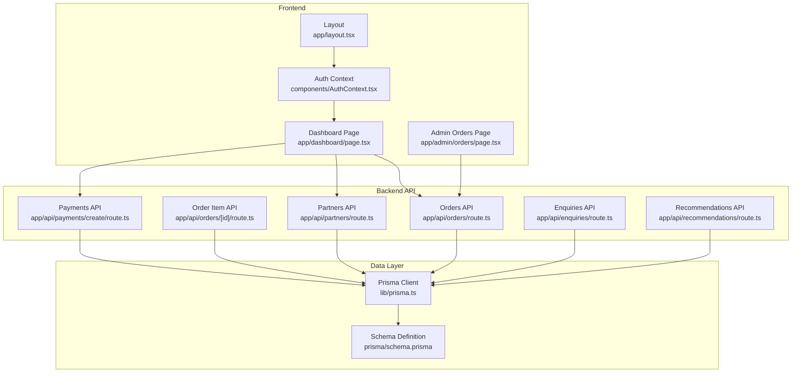
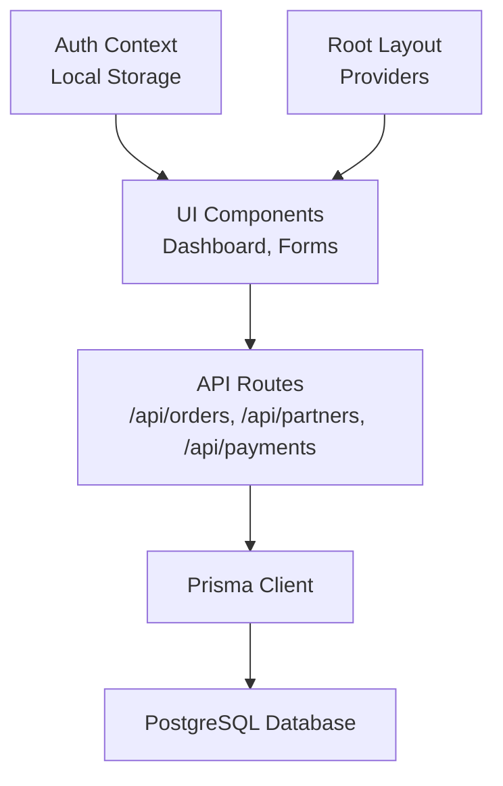
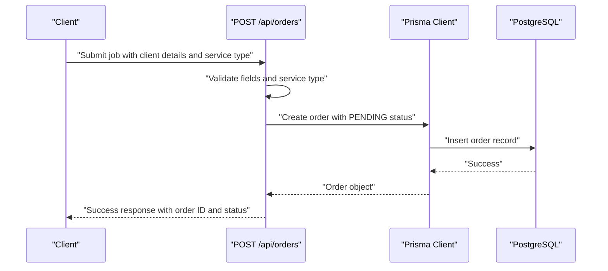
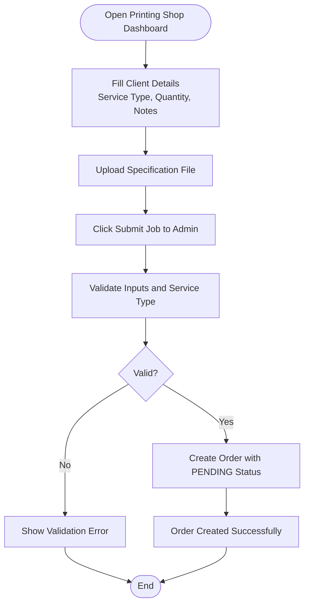
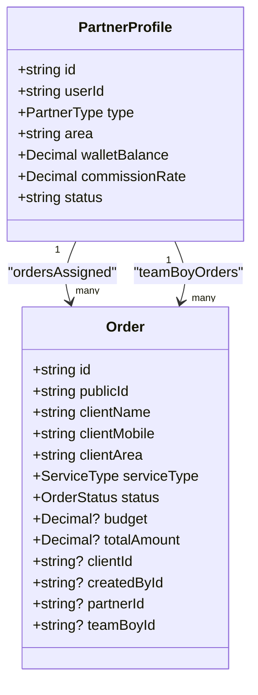
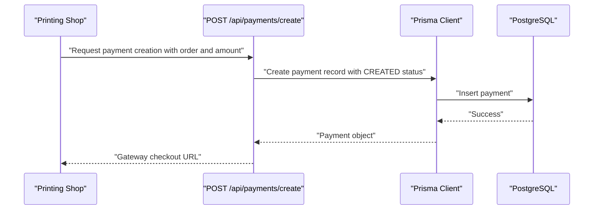
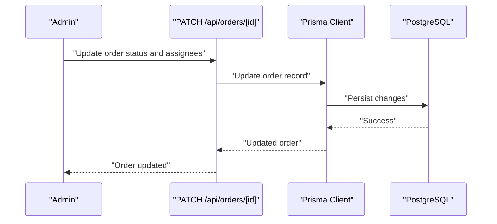
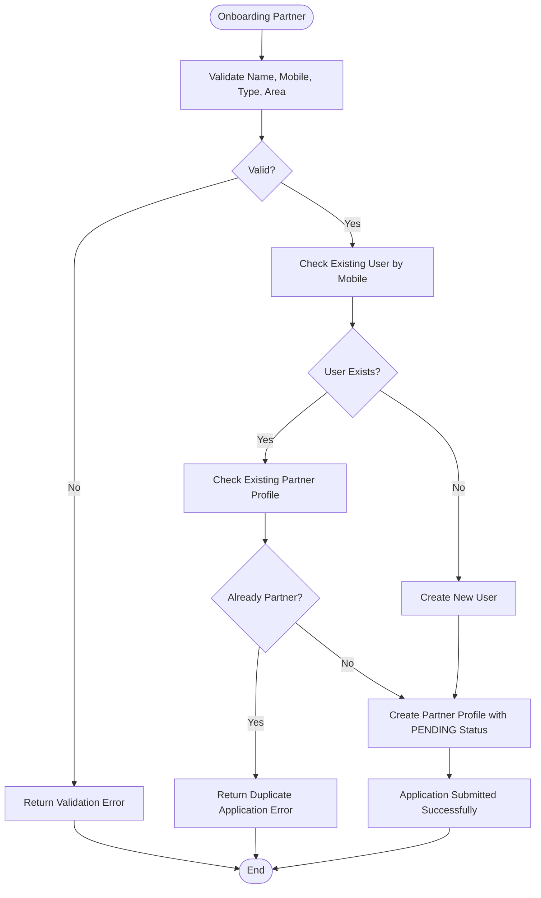
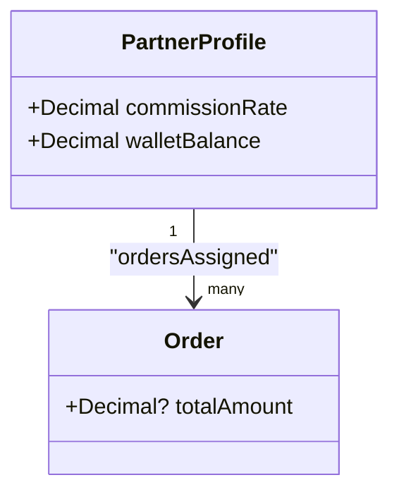
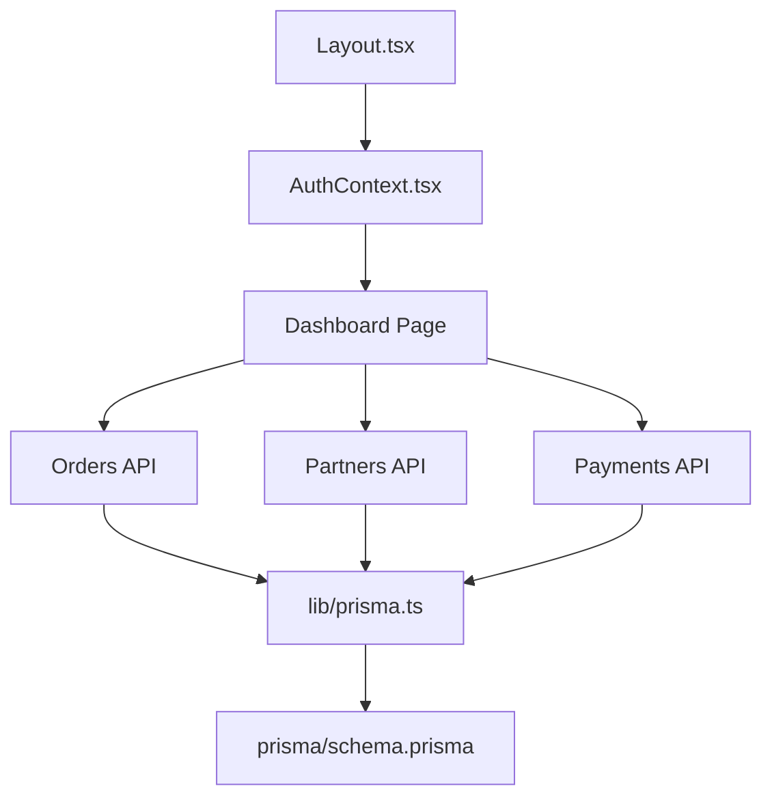

# Printing Partner Dashboard

<cite>
**Referenced Files in This Document**
- [app/dashboard/page.tsx](file://app/dashboard/page.tsx)
- [app/admin/orders/page.tsx](file://app/admin/orders/page.tsx)
- [app/api/orders/route.ts](file://app/api/orders/route.ts)
- [app/api/orders/[id]/route.ts](file://app/api/orders/[id]/route.ts)
- [app/api/partners/route.ts](file://app/api/partners/route.ts)
- [app/api/payments/create/route.ts](file://app/api/payments/create/route.ts)
- [app/api/enquiries/route.ts](file://app/api/enquiries/route.ts)
- [app/api/recommendations/route.ts](file://app/api/recommendations/route.ts)
- [components/AuthContext.tsx](file://components/AuthContext.tsx)
- [lib/prisma.ts](file://lib/prisma.ts)
- [prisma/schema.prisma](file://prisma/schema.prisma)
- [app/layout.tsx](file://app/layout.tsx)
- [package.json](file://package.json)
</cite>

## Table of Contents
1. [Introduction](#introduction)
2. [Project Structure](#project-structure)
3. [Core Components](#core-components)
4. [Architecture Overview](#architecture-overview)
5. [Detailed Component Analysis](#detailed-component-analysis)
6. [Dependency Analysis](#dependency-analysis)
7. [Performance Considerations](#performance-considerations)
8. [Troubleshooting Guide](#troubleshooting-guide)
9. [Conclusion](#conclusion)
10. [Appendices](#appendices)

## Introduction
The Printing Partner Dashboard is a Next.js-based web application designed to streamline the end-to-end workflow for printing partners, clients, and administrators. It provides role-based dashboards, order management, client job submission, commission tracking, and payment processing integration. The system supports three primary roles: administrator, team boy, and printing shop partner. It integrates with a PostgreSQL database via Prisma ORM and exposes REST-like API endpoints for order creation, partner onboarding, payment initiation, and administrative oversight.

## Project Structure
The project follows a conventional Next.js structure with a clear separation between frontend pages, backend API routes, shared components, and database schema definitions. Key areas include:
- Frontend pages under app/ for role-specific dashboards and admin views
- API routes under app/api/ for order, partner, payment, and auxiliary services
- Shared components for authentication, navigation, and theming
- Prisma schema and client initialization for data modeling and persistence



**Diagram sources**
- [app/dashboard/page.tsx:1-257](file://app/dashboard/page.tsx#L1-L257)
- [app/admin/orders/page.tsx:1-92](file://app/admin/orders/page.tsx#L1-L92)
- [components/AuthContext.tsx:1-70](file://components/AuthContext.tsx#L1-L70)
- [app/layout.tsx:1-48](file://app/layout.tsx#L1-L48)
- [app/api/orders/route.ts:1-129](file://app/api/orders/route.ts#L1-L129)
- [app/api/orders/[id]/route.ts:1-54](file://app/api/orders/[id]/route.ts#L1-L54)
- [app/api/partners/route.ts:1-174](file://app/api/partners/route.ts#L1-L174)
- [app/api/payments/create/route.ts:1-46](file://app/api/payments/create/route.ts#L1-L46)
- [app/api/enquiries/route.ts:1-111](file://app/api/enquiries/route.ts#L1-L111)
- [app/api/recommendations/route.ts:1-56](file://app/api/recommendations/route.ts#L1-L56)
- [lib/prisma.ts:1-22](file://lib/prisma.ts#L1-L22)
- [prisma/schema.prisma:1-173](file://prisma/schema.prisma#L1-L173)

**Section sources**
- [app/dashboard/page.tsx:1-257](file://app/dashboard/page.tsx#L1-L257)
- [app/admin/orders/page.tsx:1-92](file://app/admin/orders/page.tsx#L1-L92)
- [components/AuthContext.tsx:1-70](file://components/AuthContext.tsx#L1-L70)
- [app/layout.tsx:1-48](file://app/layout.tsx#L1-L48)
- [lib/prisma.ts:1-22](file://lib/prisma.ts#L1-L22)
- [prisma/schema.prisma:1-173](file://prisma/schema.prisma#L1-L173)

## Core Components
This section outlines the primary components and their responsibilities within the Printing Partner Dashboard.

- Role-based Dashboard Pages
  - Admin View: Provides order statistics, assignment controls, and audit logs.
  - Team Boy View: Displays daily tasks, completion photos upload, and earnings/wallet status.
  - Printing Shop View: Enables adding client print jobs, viewing commission status, and downloading monthly statements.

- Authentication Context
  - Manages role and mobile state persisted in local storage for seamless session handling across browser sessions.

- API Endpoints
  - Orders: Create client orders, list orders, and update order status/assignees.
  - Partners: Onboard new partners and list existing ones.
  - Payments: Initiate payment creation with gateway placeholders.
  - Enquiries: Capture client inquiries and list them for admin review.
  - Recommendations: Provide service recommendations based on area, budget, and goals.

- Data Model
  - Users, Partner Profiles, Orders, Payments, Enquiries, and Recommendation Requests are defined with enums for statuses, types, and providers.

**Section sources**
- [app/dashboard/page.tsx:1-257](file://app/dashboard/page.tsx#L1-L257)
- [components/AuthContext.tsx:1-70](file://components/AuthContext.tsx#L1-L70)
- [app/api/orders/route.ts:1-129](file://app/api/orders/route.ts#L1-L129)
- [app/api/orders/[id]/route.ts:1-54](file://app/api/orders/[id]/route.ts#L1-L54)
- [app/api/partners/route.ts:1-174](file://app/api/partners/route.ts#L1-L174)
- [app/api/payments/create/route.ts:1-46](file://app/api/payments/create/route.ts#L1-L46)
- [app/api/enquiries/route.ts:1-111](file://app/api/enquiries/route.ts#L1-L111)
- [app/api/recommendations/route.ts:1-56](file://app/api/recommendations/route.ts#L1-L56)
- [prisma/schema.prisma:1-173](file://prisma/schema.prisma#L1-L173)

## Architecture Overview
The system employs a layered architecture:
- Presentation Layer: Next.js pages and components render role-specific dashboards and forms.
- API Layer: REST-like endpoints handle business logic for orders, partners, payments, and support data.
- Data Access Layer: Prisma client connects to PostgreSQL, enabling type-safe queries and migrations.
- Persistence Layer: PostgreSQL stores all entities defined in the Prisma schema.



**Diagram sources**
- [app/dashboard/page.tsx:1-257](file://app/dashboard/page.tsx#L1-L257)
- [app/api/orders/route.ts:1-129](file://app/api/orders/route.ts#L1-L129)
- [lib/prisma.ts:1-22](file://lib/prisma.ts#L1-L22)
- [prisma/schema.prisma:1-173](file://prisma/schema.prisma#L1-L173)
- [components/AuthContext.tsx:1-70](file://components/AuthContext.tsx#L1-L70)
- [app/layout.tsx:1-48](file://app/layout.tsx#L1-L48)

## Detailed Component Analysis

### Order Management System
The order management system enables clients and printing partners to submit and track print jobs, while administrators manage assignments and approvals.

- Client Job Submission
  - Endpoint: POST /api/orders
  - Validates required fields (client name, mobile, area, service type) and service type enumeration.
  - Generates a public order ID (e.g., SSA-XXXX) and creates an order with PENDING status.
  - Supports budget field for client budget tracking.

- Order Listing and Details
  - GET /api/orders lists all orders with included client, partner, and team boy details.
  - GET /api/orders/[id] retrieves a specific order with partner, team boy, and payment details.

- Administrative Assignment and Status Updates
  - PATCH /api/orders/[id] updates order status and assigns a partner and/or team boy.
  - Used by administrators to move orders through the workflow.



**Diagram sources**
- [app/api/orders/route.ts:38-127](file://app/api/orders/route.ts#L38-L127)
- [lib/prisma.ts:1-22](file://lib/prisma.ts#L1-L22)
- [prisma/schema.prisma:91-123](file://prisma/schema.prisma#L91-L123)

**Section sources**
- [app/api/orders/route.ts:1-129](file://app/api/orders/route.ts#L1-L129)
- [app/api/orders/[id]/route.ts:1-54](file://app/api/orders/[id]/route.ts#L1-L54)
- [prisma/schema.prisma:91-123](file://prisma/schema.prisma#L91-L123)

### Client Job Submission Workflow
The printing shop view provides a form for adding new print jobs with client details, service types, quantities, and specifications.

- Form Fields
  - Client Name and Mobile: Required for identification and communication.
  - Service Type: Dropdown with predefined service types aligned with the schema.
  - Quantity/Size: Text input for job specifics.
  - Job Details: Text area for additional notes, materials, and deadlines.
  - Specification Upload: File input for design assets or references.

- Backend Processing
  - POST /api/orders validates inputs and service type, then persists the order with PENDING status.



**Diagram sources**
- [app/dashboard/page.tsx:198-237](file://app/dashboard/page.tsx#L198-L237)
- [app/api/orders/route.ts:38-65](file://app/api/orders/route.ts#L38-L65)

**Section sources**
- [app/dashboard/page.tsx:198-237](file://app/dashboard/page.tsx#L198-L237)
- [app/api/orders/route.ts:38-65](file://app/api/orders/route.ts#L38-L65)

### Commission Tracking System
The printing shop dashboard displays commission-related metrics and transaction history.

- Monthly Metrics
  - Orders this Month and Completed counts provide monthly order tracking.
  - Commission Wallet shows the current balance available for withdrawal.

- Commission History
  - Lists individual commission entries with status indicators (Paid, Pending, Approved).
  - Supports monthly statement downloads for reconciliation.



**Diagram sources**
- [prisma/schema.prisma:73-89](file://prisma/schema.prisma#L73-L89)
- [prisma/schema.prisma:91-123](file://prisma/schema.prisma#L91-L123)

**Section sources**
- [app/dashboard/page.tsx:192-196](file://app/dashboard/page.tsx#L192-L196)
- [app/dashboard/page.tsx:242-250](file://app/dashboard/page.tsx#L242-L250)
- [prisma/schema.prisma:73-89](file://prisma/schema.prisma#L73-L89)
- [prisma/schema.prisma:91-123](file://prisma/schema.prisma#L91-L123)

### Monthly Statement Download Functionality
The printing shop dashboard includes a button to download monthly statements. While the endpoint is not implemented in the provided code, the UI indicates this capability. Integration would typically involve:
- Backend endpoint to generate and serve a downloadable report (PDF/CSV).
- Filtering by date range and order status.
- Aggregation of completed orders and calculated commission amounts.

[No sources needed since this section describes a UI feature without analyzing specific files]

### Payment Processing Workflow
The payment system provides a stubbed integration for initiating payments via external providers.

- Endpoint: POST /api/payments/create
  - Accepts order ID, amount, provider, and optional user ID.
  - Creates a payment record with CREATED status.
  - Returns a placeholder checkout URL for the selected provider.



**Diagram sources**
- [app/api/payments/create/route.ts:1-46](file://app/api/payments/create/route.ts#L1-L46)
- [lib/prisma.ts:1-22](file://lib/prisma.ts#L1-L22)
- [prisma/schema.prisma:125-144](file://prisma/schema.prisma#L125-L144)

**Section sources**
- [app/api/payments/create/route.ts:1-46](file://app/api/payments/create/route.ts#L1-L46)
- [prisma/schema.prisma:125-144](file://prisma/schema.prisma#L125-L144)

### Admin Approval System Integration
Administrators oversee the order lifecycle and approve completions.

- Admin Orders Page
  - Fetches and displays all orders with client, service type, and status.
  - Provides a table view for quick monitoring and auditing.

- Order Assignment and Status Updates
  - PATCH /api/orders/[id] allows updating status and assigning a partner/team boy.
  - Supports moving orders from PENDING to ASSIGNED, IN_PROGRESS, COMPLETED, etc.



**Diagram sources**
- [app/admin/orders/page.tsx:1-92](file://app/admin/orders/page.tsx#L1-L92)
- [app/api/orders/[id]/route.ts:29-52](file://app/api/orders/[id]/route.ts#L29-L52)
- [lib/prisma.ts:1-22](file://lib/prisma.ts#L1-L22)

**Section sources**
- [app/admin/orders/page.tsx:1-92](file://app/admin/orders/page.tsx#L1-L92)
- [app/api/orders/[id]/route.ts:29-52](file://app/api/orders/[id]/route.ts#L29-L52)

### Client Onboarding and Enquiries
The system supports client onboarding and inquiry capture.

- Partner Onboarding
  - POST /api/partners validates name, mobile, type, and area.
  - Creates a user if not present and a partner profile with PENDING status.
  - Prevents duplicate applications for the same mobile number.

- Enquiries
  - POST /api/enquiries captures client requests with validation.
  - Stores enquiries with PENDING status for admin review.



**Diagram sources**
- [app/api/partners/route.ts:43-172](file://app/api/partners/route.ts#L43-L172)

**Section sources**
- [app/api/partners/route.ts:1-174](file://app/api/partners/route.ts#L1-L174)
- [app/api/enquiries/route.ts:1-111](file://app/api/enquiries/route.ts#L1-L111)

### Commission Calculation Processes
Commission calculations are modeled through partner profiles with commission rates and wallet balances.

- Commission Rate
  - Defined as a decimal percentage on partner profiles.
  - Can be used to compute commission amounts for completed orders.

- Wallet Balance
  - Tracks accumulated earnings with default zero balance.
  - Updated upon order completion and payment processing.



**Diagram sources**
- [prisma/schema.prisma:73-89](file://prisma/schema.prisma#L73-L89)
- [prisma/schema.prisma:91-123](file://prisma/schema.prisma#L91-L123)

**Section sources**
- [prisma/schema.prisma:73-89](file://prisma/schema.prisma#L73-L89)
- [prisma/schema.prisma:91-123](file://prisma/schema.prisma#L91-L123)

## Dependency Analysis
The system exhibits clear separation of concerns with minimal coupling between components.



**Diagram sources**
- [components/AuthContext.tsx:1-70](file://components/AuthContext.tsx#L1-L70)
- [app/layout.tsx:1-48](file://app/layout.tsx#L1-L48)
- [app/dashboard/page.tsx:1-257](file://app/dashboard/page.tsx#L1-L257)
- [app/api/orders/route.ts:1-129](file://app/api/orders/route.ts#L1-L129)
- [app/api/partners/route.ts:1-174](file://app/api/partners/route.ts#L1-L174)
- [app/api/payments/create/route.ts:1-46](file://app/api/payments/create/route.ts#L1-L46)
- [lib/prisma.ts:1-22](file://lib/prisma.ts#L1-L22)
- [prisma/schema.prisma:1-173](file://prisma/schema.prisma#L1-L173)

**Section sources**
- [components/AuthContext.tsx:1-70](file://components/AuthContext.tsx#L1-L70)
- [app/layout.tsx:1-48](file://app/layout.tsx#L1-L48)
- [app/dashboard/page.tsx:1-257](file://app/dashboard/page.tsx#L1-L257)
- [app/api/orders/route.ts:1-129](file://app/api/orders/route.ts#L1-L129)
- [app/api/partners/route.ts:1-174](file://app/api/partners/route.ts#L1-L174)
- [app/api/payments/create/route.ts:1-46](file://app/api/payments/create/route.ts#L1-L46)
- [lib/prisma.ts:1-22](file://lib/prisma.ts#L1-L22)
- [prisma/schema.prisma:1-173](file://prisma/schema.prisma#L1-L173)

## Performance Considerations
- Database Connectivity
  - Prisma client is conditionally initialized when DATABASE_URL is present, preventing unnecessary connections in development environments without a database.
- API Efficiency
  - Order listing includes only essential relations to reduce payload size.
  - In-memory fallback during development avoids database overhead for local testing.
- Client-Side Rendering
  - Role-based dashboards render conditionally based on stored authentication state, minimizing re-renders and improving perceived performance.

[No sources needed since this section provides general guidance]

## Troubleshooting Guide
Common issues and resolutions:

- Authentication State Not Persisting
  - Verify local storage availability and absence of browser restrictions.
  - Ensure AuthProvider wraps the application layout.

- Order Creation Failures
  - Confirm required fields and valid service type enumeration.
  - Check database connectivity and Prisma client initialization.

- Payment Creation Errors
  - Validate presence of order ID, amount, and provider.
  - Ensure Prisma client is connected to a valid database.

- Admin Order Loading Issues
  - Inspect network tab for API errors and verify CORS settings if applicable.

**Section sources**
- [components/AuthContext.tsx:27-48](file://components/AuthContext.tsx#L27-L48)
- [app/api/orders/route.ts:44-49](file://app/api/orders/route.ts#L44-L49)
- [app/api/payments/create/route.ts:19-21](file://app/api/payments/create/route.ts#L19-L21)
- [app/admin/orders/page.tsx:21-39](file://app/admin/orders/page.tsx#L21-L39)

## Conclusion
The Printing Partner Dashboard provides a robust foundation for managing print jobs, tracking commissions, and integrating with payment providers. Its modular architecture, role-based dashboards, and Prisma-driven data model enable scalable enhancements for order workflows, commission calculations, and administrative oversight. Future improvements could include implementing monthly statement generation, expanding payment provider integrations, and adding automated notifications for order status updates.

[No sources needed since this section summarizes without analyzing specific files]

## Appendices

### API Definitions

- Orders API
  - GET /api/orders: List all orders with included client, partner, and team boy details.
  - POST /api/orders: Create a new order with client details and service type.
  - GET /api/orders/[id]: Retrieve a specific order with partner, team boy, and payment details.
  - PATCH /api/orders/[id]: Update order status and assignees.

- Partners API
  - GET /api/partners: List all partner profiles with associated user details.
  - POST /api/partners: Submit a new partner application with validation.

- Payments API
  - POST /api/payments/create: Initiate payment creation with gateway placeholder.

- Enquiries API
  - POST /api/enquiries: Submit client inquiries with validation.
  - GET /api/enquiries: Retrieve all enquiries (admin only).

- Recommendations API
  - POST /api/recommendations: Generate service recommendations based on area, budget, and goals.

**Section sources**
- [app/api/orders/route.ts:1-129](file://app/api/orders/route.ts#L1-L129)
- [app/api/orders/[id]/route.ts:1-54](file://app/api/orders/[id]/route.ts#L1-L54)
- [app/api/partners/route.ts:1-174](file://app/api/partners/route.ts#L1-L174)
- [app/api/payments/create/route.ts:1-46](file://app/api/payments/create/route.ts#L1-L46)
- [app/api/enquiries/route.ts:1-111](file://app/api/enquiries/route.ts#L1-L111)
- [app/api/recommendations/route.ts:1-56](file://app/api/recommendations/route.ts#L1-L56)

### Data Model Overview

```mermaid
erDiagram
USER {
string id PK
string mobile UK
string name
string email UK
enum role
datetime createdAt
datetime updatedAt
}
PARTNER_PROFILE {
string id PK
string userId UK FK
enum type
string area
string idProofUrl
string status
decimal walletBalance
decimal commissionRate
datetime createdAt
datetime updatedAt
}
ORDER {
string id PK
string publicId UK
string clientName
string clientMobile
string clientArea
enum serviceType
enum status
decimal budget
decimal totalAmount
string clientId FK
string createdById FK
string partnerId FK
string teamBoyId FK
json meta
datetime createdAt
datetime updatedAt
}
PAYMENT {
string id PK
string orderId FK
string userId FK
decimal amount
string currency
enum status
enum provider
string providerPaymentId
json meta
datetime createdAt
datetime paidAt
}
ENQUIRY {
string id PK
string name
string mobile
string location
string requirement
string status
datetime createdAt
datetime updatedAt
}
RECOMMENDATION_REQUEST {
string id PK
string area
decimal budget
string goal
string servicesHint
json suggestion
datetime createdAt
}
USER ||--o{ PARTNER_PROFILE : "has"
USER ||--o{ ORDER : "created"
USER ||--o{ PAYMENT : "userPayments"
ORDER ||--o{ PAYMENT : "payments"
PARTNER_PROFILE ||--o{ ORDER : "ordersAssigned"
PARTNER_PROFILE ||--o{ ORDER : "teamBoyOrders"
```

**Diagram sources**
- [prisma/schema.prisma:57-71](file://prisma/schema.prisma#L57-L71)
- [prisma/schema.prisma:73-89](file://prisma/schema.prisma#L73-L89)
- [prisma/schema.prisma:91-123](file://prisma/schema.prisma#L91-L123)
- [prisma/schema.prisma:125-144](file://prisma/schema.prisma#L125-L144)
- [prisma/schema.prisma:146-158](file://prisma/schema.prisma#L146-L158)
- [prisma/schema.prisma:160-171](file://prisma/schema.prisma#L160-L171)