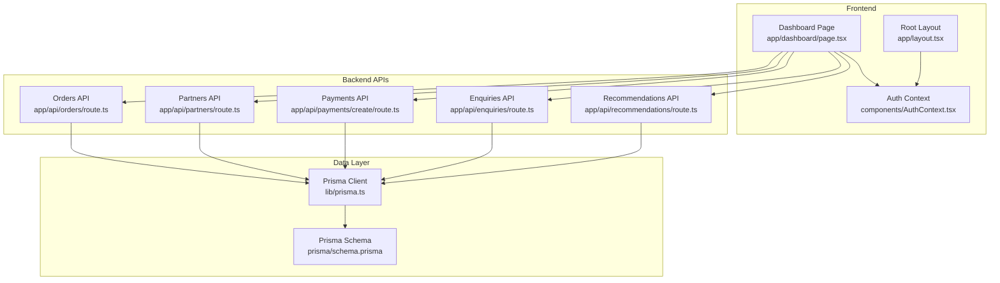
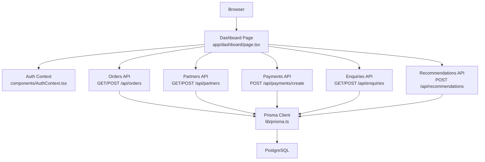
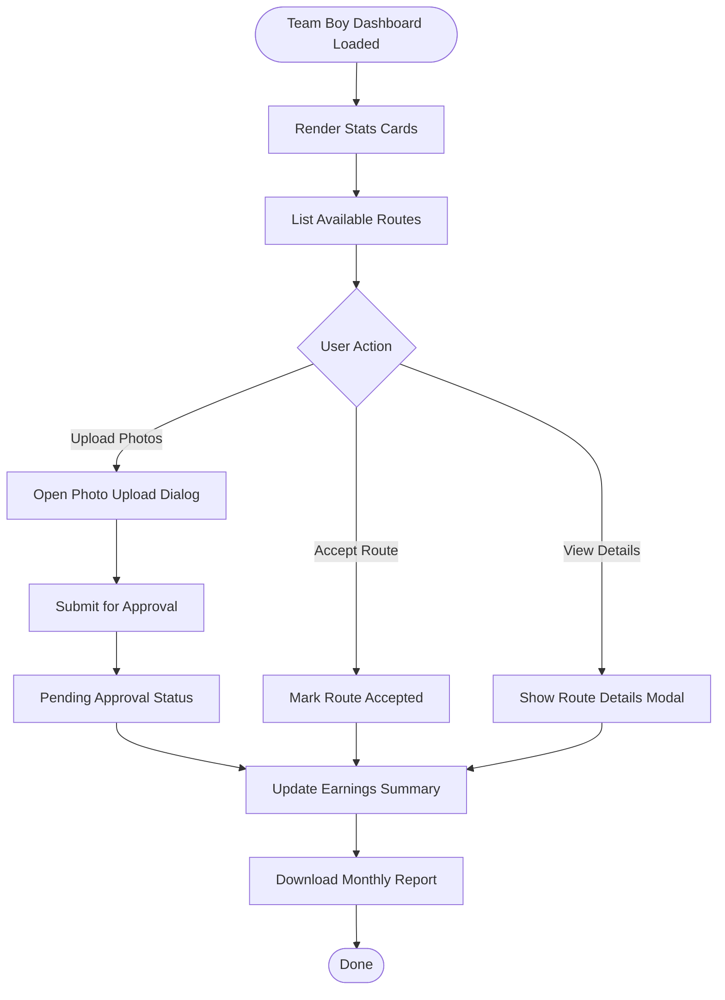
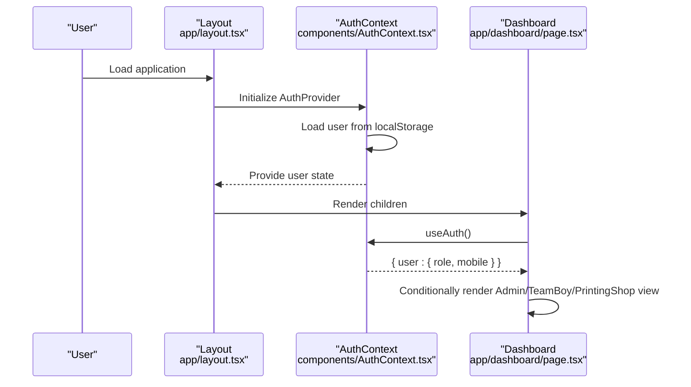
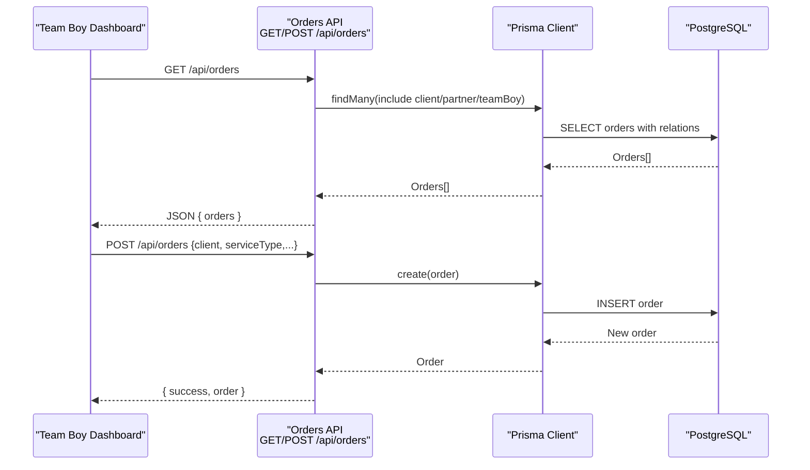
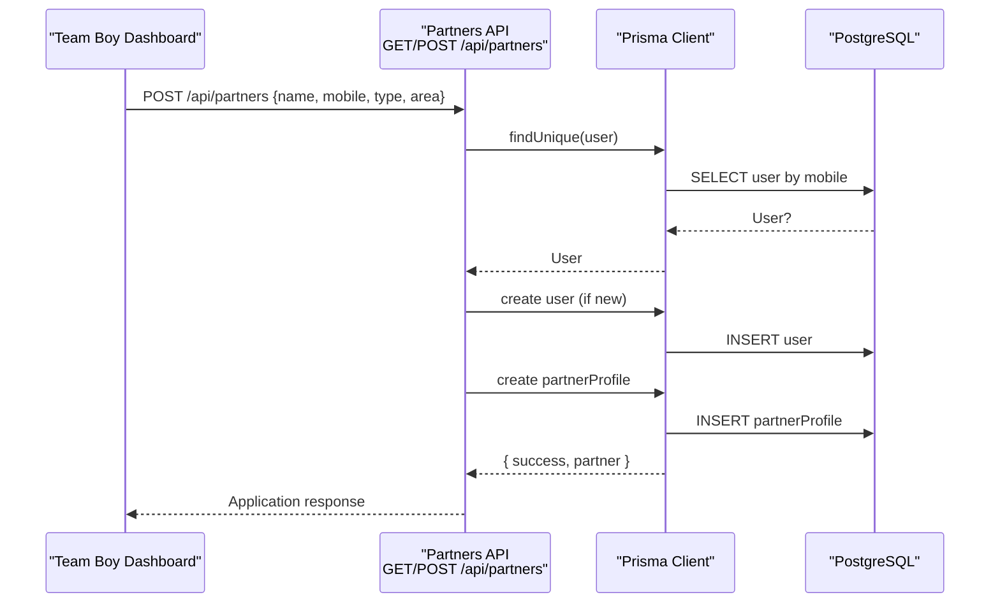
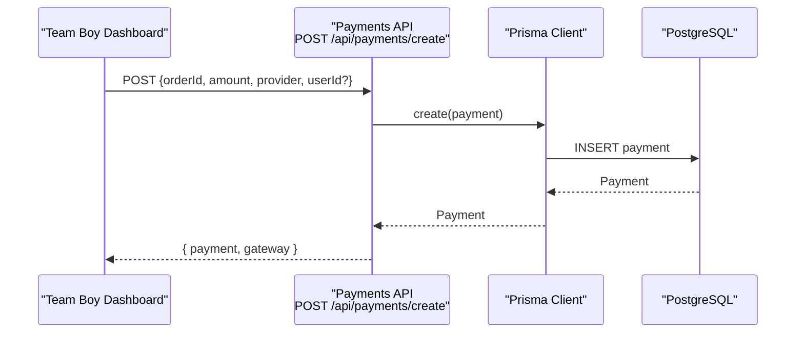
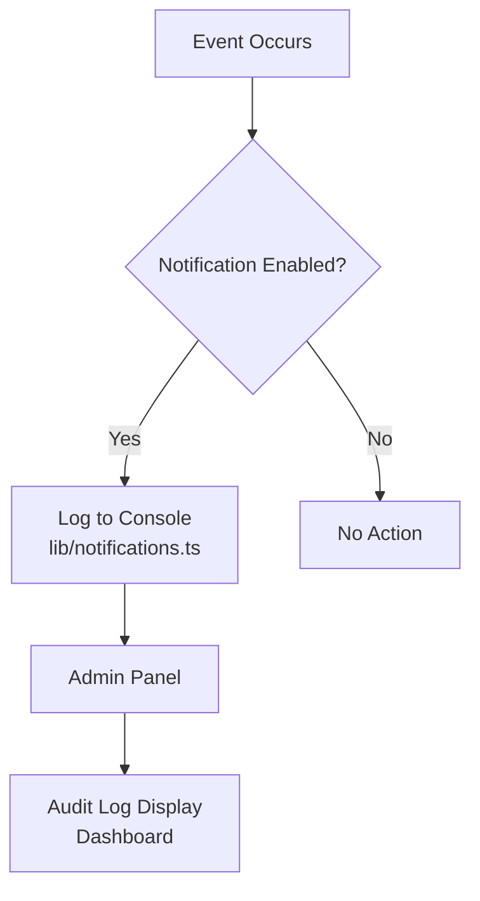
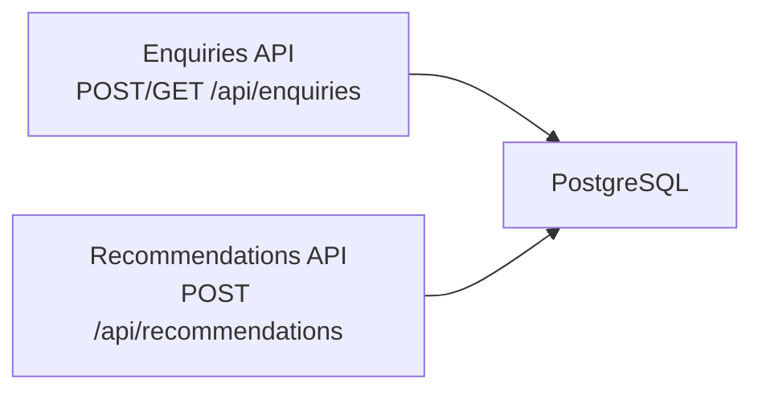
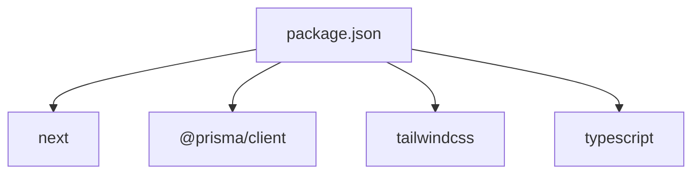

# Team Boy Dashboard

<cite>
**Referenced Files in This Document**
- [app/dashboard/page.tsx](file://app/dashboard/page.tsx)
- [components/AuthContext.tsx](file://components/AuthContext.tsx)
- [app/layout.tsx](file://app/layout.tsx)
- [app/api/orders/route.ts](file://app/api/orders/route.ts)
- [app/api/partners/route.ts](file://app/api/partners/route.ts)
- [app/api/payments/create/route.ts](file://app/api/payments/create/route.ts)
- [lib/prisma.ts](file://lib/prisma.ts)
- [prisma/schema.prisma](file://prisma/schema.prisma)
- [lib/notifications.ts](file://lib/notifications.ts)
- [app/api/enquiries/route.ts](file://app/api/enquiries/route.ts)
- [app/api/recommendations/route.ts](file://app/api/recommendations/route.ts)
- [package.json](file://package.json)
- [tailwind.config.ts](file://tailwind.config.ts)
</cite>

## Table of Contents
1. [Introduction](#introduction)
2. [Project Structure](#project-structure)
3. [Core Components](#core-components)
4. [Architecture Overview](#architecture-overview)
5. [Detailed Component Analysis](#detailed-component-analysis)
6. [Dependency Analysis](#dependency-analysis)
7. [Performance Considerations](#performance-considerations)
8. [Troubleshooting Guide](#troubleshooting-guide)
9. [Conclusion](#conclusion)
10. [Appendices](#appendices)

## Introduction
This document describes the Team Boy Dashboard functionality for the Shree Shyam Advertising & Marketing Agency portal. It focuses on the role-based dashboard for team boys, covering:
- Task management: today’s tasks display, weekly completion tracking, and route-based task acceptance
- Completion documentation via photo uploads and the approval submission process
- Earnings tracking: approved payments, pending approvals, and monthly report generation
- Route-based task management and performance metrics
- Payment workflow integration
- Mobile-friendly interface considerations and real-time status updates

The dashboard is implemented as a Next.js application with TypeScript, styled using Tailwind CSS, and backed by Prisma ORM against a PostgreSQL database. Authentication is role-based and persisted in local storage.

## Project Structure
The Team Boy Dashboard resides under the Next.js app directory and integrates with shared components and libraries:
- Frontend pages and views: app/dashboard/page.tsx
- Authentication context: components/AuthContext.tsx
- Application layout and providers: app/layout.tsx
- Backend APIs for orders, partners, payments, recommendations, and enquiries: app/api/*
- Database client and schema: lib/prisma.ts, prisma/schema.prisma
- Notifications stubs: lib/notifications.ts
- Styling configuration: tailwind.config.ts
- Dependencies: package.json

**Diagram sources**
- [app/dashboard/page.tsx:1-257](file://app/dashboard/page.tsx#L1-L257)
- [components/AuthContext.tsx:1-70](file://components/AuthContext.tsx#L1-L70)
- [app/layout.tsx:1-48](file://app/layout.tsx#L1-L48)
- [app/api/orders/route.ts:1-129](file://app/api/orders/route.ts#L1-L129)
- [app/api/partners/route.ts:1-174](file://app/api/partners/route.ts#L1-L174)
- [app/api/payments/create/route.ts:1-46](file://app/api/payments/create/route.ts#L1-L46)
- [app/api/enquiries/route.ts:1-111](file://app/api/enquiries/route.ts#L1-L111)
- [app/api/recommendations/route.ts:1-56](file://app/api/recommendations/route.ts#L1-L56)
- [lib/prisma.ts:1-22](file://lib/prisma.ts#L1-L22)
- [prisma/schema.prisma:1-173](file://prisma/schema.prisma#L1-L173)

**Section sources**
- [app/dashboard/page.tsx:1-257](file://app/dashboard/page.tsx#L1-L257)
- [components/AuthContext.tsx:1-70](file://components/AuthContext.tsx#L1-L70)
- [app/layout.tsx:1-48](file://app/layout.tsx#L1-L48)
- [lib/prisma.ts:1-22](file://lib/prisma.ts#L1-L22)
- [prisma/schema.prisma:1-173](file://prisma/schema.prisma#L1-L173)

## Core Components
- Role-based dashboard rendering:
  - Admin, Team Boy, and Printing Shop views are rendered conditionally based on the authenticated user’s role.
  - The Team Boy view displays:
    - Today’s tasks count and weekly completion metrics
    - Accept & Update Work panel with route cards and action buttons
    - Completion photo upload form and approval submission
    - Earnings & Wallet summary with pending approvals and monthly report download
- Authentication:
  - Role and mobile are stored in local storage and exposed via a React context provider.
- Styling:
  - Tailwind CSS with a custom primary color palette and responsive breakpoints ensures a mobile-friendly interface.

Key implementation references:
- Dashboard page and role-based views: [app/dashboard/page.tsx:6-38](file://app/dashboard/page.tsx#L6-L38)
- Team Boy view UI elements: [app/dashboard/page.tsx:126-187](file://app/dashboard/page.tsx#L126-L187)
- Auth context provider and hooks: [components/AuthContext.tsx:29-68](file://components/AuthContext.tsx#L29-L68)
- Layout and providers: [app/layout.tsx:17-42](file://app/layout.tsx#L17-L42)
- Tailwind configuration: [tailwind.config.ts:1-31](file://tailwind.config.ts#L1-L31)

**Section sources**
- [app/dashboard/page.tsx:6-38](file://app/dashboard/page.tsx#L6-L38)
- [app/dashboard/page.tsx:126-187](file://app/dashboard/page.tsx#L126-L187)
- [components/AuthContext.tsx:29-68](file://components/AuthContext.tsx#L29-L68)
- [app/layout.tsx:17-42](file://app/layout.tsx#L17-L42)
- [tailwind.config.ts:1-31](file://tailwind.config.ts#L1-L31)

## Architecture Overview
The Team Boy Dashboard follows a layered architecture:
- Presentation layer: Next.js pages and components
- Business logic: API routes implementing CRUD and workflow actions
- Data access: Prisma client interacting with PostgreSQL
- Authentication: Local storage-backed role context
- Notifications: Stubbed functions ready for email/SMS integration

**Diagram sources**
- [app/dashboard/page.tsx:1-257](file://app/dashboard/page.tsx#L1-L257)
- [components/AuthContext.tsx:1-70](file://components/AuthContext.tsx#L1-L70)
- [app/api/orders/route.ts:1-129](file://app/api/orders/route.ts#L1-L129)
- [app/api/partners/route.ts:1-174](file://app/api/partners/route.ts#L1-L174)
- [app/api/payments/create/route.ts:1-46](file://app/api/payments/create/route.ts#L1-L46)
- [app/api/enquiries/route.ts:1-111](file://app/api/enquiries/route.ts#L1-L111)
- [app/api/recommendations/route.ts:1-56](file://app/api/recommendations/route.ts#L1-L56)
- [lib/prisma.ts:1-22](file://lib/prisma.ts#L1-L22)

## Detailed Component Analysis

### Team Boy Dashboard UI and Interactions
The Team Boy view organizes information into:
- Stats cards for Today’s Tasks, Completed this Week, and Wallet Balance
- Accept & Update Work section with route cards, Accept and View Details actions
- Completion photo upload form and Submit for Approval button
- Earnings & Wallet panel with recent approved earnings, pending items, and Monthly Report download

**Diagram sources**
- [app/dashboard/page.tsx:126-187](file://app/dashboard/page.tsx#L126-L187)

**Section sources**
- [app/dashboard/page.tsx:126-187](file://app/dashboard/page.tsx#L126-L187)

### Authentication and Role Management
The AuthContext stores role and mobile in local storage and exposes a hook to consume the current user state. The dashboard reads the role to render the appropriate view.

**Diagram sources**
- [app/layout.tsx:24-42](file://app/layout.tsx#L24-L42)
- [components/AuthContext.tsx:29-68](file://components/AuthContext.tsx#L29-L68)
- [app/dashboard/page.tsx:6-38](file://app/dashboard/page.tsx#L6-L38)

**Section sources**
- [components/AuthContext.tsx:1-70](file://components/AuthContext.tsx#L1-L70)
- [app/layout.tsx:17-42](file://app/layout.tsx#L17-L42)
- [app/dashboard/page.tsx:6-38](file://app/dashboard/page.tsx#L6-L38)

### Orders API: Task Management and Route Assignment
The Orders API supports listing orders and creating new orders. It validates service types and generates a public order ID. The dashboard can integrate with this API to:
- Fetch orders assigned to the team boy
- Display route details and statuses
- Trigger acceptance and progress updates

**Diagram sources**
- [app/api/orders/route.ts:10-36](file://app/api/orders/route.ts#L10-L36)
- [app/api/orders/route.ts:38-127](file://app/api/orders/route.ts#L38-L127)
- [lib/prisma.ts:1-22](file://lib/prisma.ts#L1-L22)
- [prisma/schema.prisma:91-123](file://prisma/schema.prisma#L91-L123)

**Section sources**
- [app/api/orders/route.ts:1-129](file://app/api/orders/route.ts#L1-L129)
- [lib/prisma.ts:1-22](file://lib/prisma.ts#L1-L22)
- [prisma/schema.prisma:91-123](file://prisma/schema.prisma#L91-L123)

### Partners API: Onboarding and Profile Management
The Partners API handles partner applications and lists. It validates mobile numbers and partner types, and creates associated users and profiles. The dashboard can leverage this for:
- Team Boy onboarding and profile status
- Assigning and tracking team boys for routes

**Diagram sources**
- [app/api/partners/route.ts:43-172](file://app/api/partners/route.ts#L43-L172)
- [lib/prisma.ts:1-22](file://lib/prisma.ts#L1-L22)
- [prisma/schema.prisma:73-89](file://prisma/schema.prisma#L73-L89)

**Section sources**
- [app/api/partners/route.ts:1-174](file://app/api/partners/route.ts#L1-L174)
- [lib/prisma.ts:1-22](file://lib/prisma.ts#L1-L22)
- [prisma/schema.prisma:73-89](file://prisma/schema.prisma#L73-L89)

### Payments API: Payment Workflow Integration
The Payments API stub creates a payment record and returns a placeholder checkout URL. In a real integration, this would initiate a payment gateway session and update payment status upon callback.

**Diagram sources**
- [app/api/payments/create/route.ts:5-44](file://app/api/payments/create/route.ts#L5-L44)
- [lib/prisma.ts:1-22](file://lib/prisma.ts#L1-L22)
- [prisma/schema.prisma:125-144](file://prisma/schema.prisma#L125-L144)

**Section sources**
- [app/api/payments/create/route.ts:1-46](file://app/api/payments/create/route.ts#L1-L46)
- [lib/prisma.ts:1-22](file://lib/prisma.ts#L1-L22)
- [prisma/schema.prisma:125-144](file://prisma/schema.prisma#L125-L144)

### Notifications and Audit Trail
Notifications are stubbed for partner applications, order confirmations, and status updates. These can be extended to integrate with email/SMS providers. The dashboard UI includes an audit log section that surfaces recent events.

**Diagram sources**
- [lib/notifications.ts:1-28](file://lib/notifications.ts#L1-L28)
- [app/dashboard/page.tsx:93-121](file://app/dashboard/page.tsx#L93-L121)

**Section sources**
- [lib/notifications.ts:1-28](file://lib/notifications.ts#L1-L28)
- [app/dashboard/page.tsx:93-121](file://app/dashboard/page.tsx#L93-L121)

### Enquiries and Recommendations
- Enquiries API: Handles client submissions and retrieval (admin only). Useful for capturing leads and integrating with the dashboard’s audit/log.
- Recommendations API: Provides a stubbed recommendation engine that records requests and suggestions.

**Diagram sources**
- [app/api/enquiries/route.ts:8-110](file://app/api/enquiries/route.ts#L8-L110)
- [app/api/recommendations/route.ts:4-55](file://app/api/recommendations/route.ts#L4-L55)

**Section sources**
- [app/api/enquiries/route.ts:1-111](file://app/api/enquiries/route.ts#L1-L111)
- [app/api/recommendations/route.ts:1-56](file://app/api/recommendations/route.ts#L1-L56)

## Dependency Analysis
External dependencies relevant to the dashboard include Next.js, Prisma, Tailwind CSS, and related packages. The Prisma client is conditionally initialized when a DATABASE_URL is present.

**Diagram sources**
- [package.json:13-42](file://package.json#L13-L42)

**Section sources**
- [package.json:1-44](file://package.json#L1-L44)
- [lib/prisma.ts:1-22](file://lib/prisma.ts#L1-L22)

## Performance Considerations
- Database connectivity: The Prisma client is only instantiated when DATABASE_URL is configured, avoiding unnecessary overhead in development mode.
- UI responsiveness: The dashboard leverages Tailwind’s utility-first approach and responsive breakpoints to ensure fast rendering on mobile devices.
- API latency: Batch operations and caching strategies can be considered for frequent reads of orders and partner lists.

[No sources needed since this section provides general guidance]

## Troubleshooting Guide
Common issues and resolutions:
- Authentication state not persisting:
  - Verify local storage keys and ensure AuthProvider wraps the application layout.
  - References: [components/AuthContext.tsx:27-48](file://components/AuthContext.tsx#L27-L48), [app/layout.tsx:24-42](file://app/layout.tsx#L24-L42)
- Orders not loading:
  - Confirm DATABASE_URL is set; otherwise, the API falls back to in-memory storage.
  - References: [app/api/orders/route.ts:8-26](file://app/api/orders/route.ts#L8-L26), [lib/prisma.ts:7-16](file://lib/prisma.ts#L7-L16)
- Payments creation failing:
  - Ensure required fields (orderId, amount, provider) are provided and valid.
  - References: [app/api/payments/create/route.ts:12-21](file://app/api/payments/create/route.ts#L12-L21)
- Notifications not firing:
  - Stub functions log to console; integrate with real providers to enable live alerts.
  - References: [lib/notifications.ts:6-26](file://lib/notifications.ts#L6-L26)

**Section sources**
- [components/AuthContext.tsx:27-48](file://components/AuthContext.tsx#L27-L48)
- [app/layout.tsx:24-42](file://app/layout.tsx#L24-L42)
- [app/api/orders/route.ts:8-26](file://app/api/orders/route.ts#L8-L26)
- [lib/prisma.ts:7-16](file://lib/prisma.ts#L7-L16)
- [app/api/payments/create/route.ts:12-21](file://app/api/payments/create/route.ts#L12-L21)
- [lib/notifications.ts:6-26](file://lib/notifications.ts#L6-L26)

## Conclusion
The Team Boy Dashboard provides a focused, role-based interface for team boys to manage daily routes, document completions, track earnings, and generate reports. Its modular API layer, conditional Prisma initialization, and Tailwind-based responsive design support scalable enhancements, including real-time status updates, integrated payment gateways, and notification integrations.

[No sources needed since this section summarizes without analyzing specific files]

## Appendices

### Example Workflows

- Task assignment and acceptance
  - Admin assigns an order to a team boy via the admin view.
  - Team boy receives the assignment and accepts the route in the dashboard.
  - References: [app/dashboard/page.tsx:55-124](file://app/dashboard/page.tsx#L55-L124), [app/api/orders/route.ts:10-36](file://app/api/orders/route.ts#L10-L36)

- Completion documentation and approval
  - Team boy uploads completion photos and submits for approval.
  - Pending approvals appear in the earnings panel; admin approves to finalize.
  - References: [app/dashboard/page.tsx:126-187](file://app/dashboard/page.tsx#L126-L187)

- Earnings tracking and monthly reporting
  - Approved earnings populate the earnings panel; pending items show awaiting admin approval.
  - Monthly report download is available from the earnings panel.
  - References: [app/dashboard/page.tsx:171-183](file://app/dashboard/page.tsx#L171-L183)

- Payment workflow
  - Payment initiation via the payments API; gateway integration to follow.
  - References: [app/api/payments/create/route.ts:5-44](file://app/api/payments/create/route.ts#L5-L44)

[No sources needed since this section aggregates previously cited references]