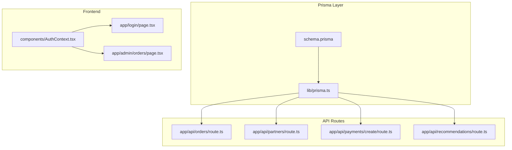
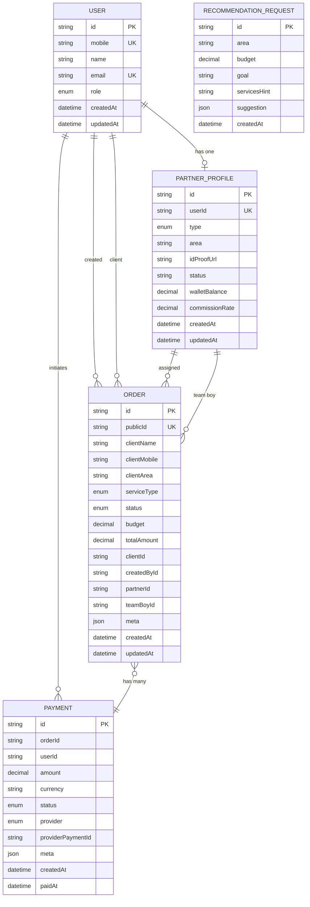
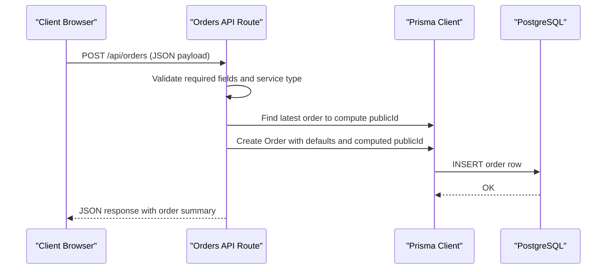
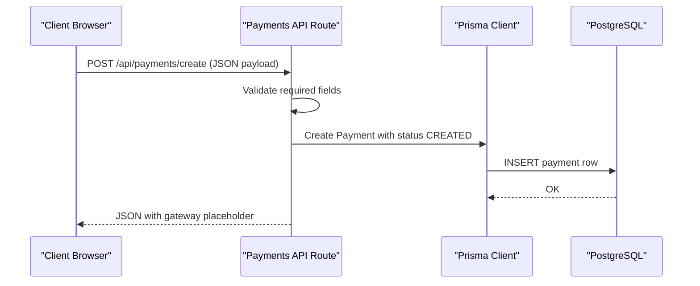
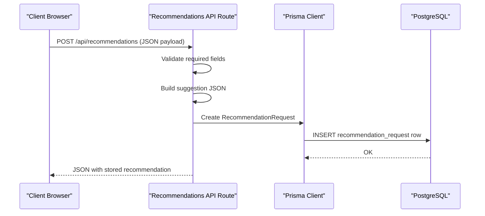

# Data Models & Entities

<cite>
**Referenced Files in This Document**
- [schema.prisma](file://prisma/schema.prisma)
- [prisma.ts](file://lib/prisma.ts)
- [route.ts](file://app/api/orders/route.ts)
- [route.ts](file://app/api/partners/route.ts)
- [route.ts](file://app/api/payments/create/route.ts)
- [route.ts](file://app/api/recommendations/route.ts)
- [AuthContext.tsx](file://components/AuthContext.tsx)
- [page.tsx](file://app/admin/orders/page.tsx)
- [page.tsx](file://app/login/page.tsx)
</cite>

## Table of Contents
1. [Introduction](#introduction)
2. [Project Structure](#project-structure)
3. [Core Components](#core-components)
4. [Architecture Overview](#architecture-overview)
5. [Detailed Component Analysis](#detailed-component-analysis)
6. [Dependency Analysis](#dependency-analysis)
7. [Performance Considerations](#performance-considerations)
8. [Troubleshooting Guide](#troubleshooting-guide)
9. [Conclusion](#conclusion)
10. [Appendices](#appendices)

## Introduction
This document provides comprehensive data model documentation for the Shree Shyam Agency system. It focuses on Prisma entities and enums that define the core business data: User, PartnerProfile, Order, Payment, and RecommendationRequest. For each entity, we describe fields, data types, constraints, indexes, and relationships. We also explain the business logic behind design decisions, clarify optional versus required fields, defaults, and validation rules. Finally, we illustrate how these entities participate in the multi-stakeholder workflow (admin, team boy, printing shop, client).

## Project Structure
The data models are defined centrally in the Prisma schema and consumed by the Next.js API routes and frontend components. The Prisma client is initialized once and reused across the app.

**Diagram sources**
- [schema.prisma](file://prisma/schema.prisma)
- [prisma.ts](file://lib/prisma.ts)
- [route.ts](file://app/api/orders/route.ts)
- [route.ts](file://app/api/partners/route.ts)
- [route.ts](file://app/api/payments/create/route.ts)
- [route.ts](file://app/api/recommendations/route.ts)
- [AuthContext.tsx](file://components/AuthContext.tsx)
- [page.tsx](file://app/admin/orders/page.tsx)
- [page.tsx](file://app/login/page.tsx)

**Section sources**
- [schema.prisma](file://prisma/schema.prisma)
- [prisma.ts](file://lib/prisma.ts)

## Core Components
This section summarizes the five core entities and their roles in the system.

- User: Represents system users with roles (admin, team boy, printing shop, client). Each user can optionally have a PartnerProfile. Users can create orders, act as clients on orders, and process payments.
- PartnerProfile: Associates a User with a partner type (team boy, printing shop, agency), area, and onboarding status. Tracks wallet balance and commission rate. Can be linked to assigned orders and team boy orders.
- Order: Captures client details, service type, status, budgets, and relationships to client, creator, assigned partner, and assigned team boy. Supports JSON metadata for operational notes.
- Payment: Records payment attempts against an order, including amount, currency, provider, and status. Optionally links to the user who initiated the payment.
- RecommendationRequest: Stores client recommendation requests with area, budget, goals, and generated suggestions as JSON.

**Section sources**
- [schema.prisma](file://prisma/schema.prisma)

## Architecture Overview
The data model enforces referential integrity and business constraints. The API routes validate inputs and persist data via Prisma. Frontend components manage role-based views and authentication state.

**Diagram sources**
- [schema.prisma](file://prisma/schema.prisma)

## Detailed Component Analysis

### User
- Purpose: Core identity and access control for the system.
- Fields and constraints:
  - id: String, primary key, generated automatically.
  - mobile: String, unique, required.
  - name: String, optional.
  - email: String, unique, optional.
  - role: Enum (ADMIN, TEAM_BOY, PRINTING_SHOP, CLIENT), required.
  - createdAt/updatedAt: Timestamps with defaults.
- Relationships:
  - One-to-one with PartnerProfile (optional).
  - One-to-many with Order as creator and as client.
  - One-to-many with Payment (optional user linkage).
- Business logic:
  - Unique mobile and email ensure deduplication.
  - Role determines access to dashboards and actions.
  - Optional profile fields allow gradual onboarding.
- Field-level notes:
  - mobile and role are required; others are optional.
  - Defaults: timestamps managed by Prisma.
- Typical instance:
  - id: "<user-cuid>"
  - mobile: "+919876543210"
  - name: "Rajesh Sharma"
  - email: "rajesh@example.com"
  - role: "CLIENT"
- Multi-stakeholder workflow:
  - Admin: Full visibility and control.
  - Team Boy: Access to assigned orders and earnings.
  - Printing Shop: Access to assigned orders and payouts.
  - Client: Can create orders and track status.

**Section sources**
- [schema.prisma](file://prisma/schema.prisma)

### PartnerProfile
- Purpose: Onboarding and operational profile for partners.
- Fields and constraints:
  - id: String, primary key.
  - userId: String, unique, required; references User.id.
  - type: Enum (TEAM_BOY, PRINTING_SHOP, AGENCY), required.
  - area: String, required.
  - idProofUrl: String, optional.
  - status: String, default "PENDING".
  - walletBalance: Decimal, default 0.
  - commissionRate: Decimal, default 0.
  - createdAt/updatedAt: Timestamps with defaults.
- Relationships:
  - Belongs to User (one-to-one).
  - One-to-many with Order as assigned partner.
  - One-to-many with Order as team boy.
- Business logic:
  - Wallet and commission enable revenue tracking.
  - Status controls visibility and eligibility.
- Field-level notes:
  - userId is required and unique; ensures one profile per user.
  - Optional idProofUrl supports verification workflows.
- Typical instance:
  - id: "<profile-cuid>"
  - userId: "<user-cuid>"
  - type: "TEAM_BOY"
  - area: "Indiranagar"
  - status: "APPROVED"
  - walletBalance: 48500.00
  - commissionRate: 10.00
- Multi-stakeholder workflow:
  - Admin approves/disapproves profiles.
  - Team Boy and Printing Shop receive orders based on assignments.

**Section sources**
- [schema.prisma](file://prisma/schema.prisma)

### Order
- Purpose: Captures client requests, assigns resources, and tracks progress.
- Fields and constraints:
  - id: String, primary key.
  - publicId: String, unique, required (format example: "SSA-1001").
  - clientName/clientMobile/clientArea: Strings, required for client details.
  - serviceType: Enum (service categories), required.
  - status: Enum (DRAFT, PENDING, ASSIGNED, IN_PROGRESS, COMPLETED, CANCELLED), default PENDING.
  - budget/totalAmount: Decimals, optional.
  - meta: JSON, optional notes/routes/photos.
  - createdAt/updatedAt: Timestamps with defaults.
- Relationships:
  - clientId -> User (optional).
  - createdById -> User (optional).
  - partnerId -> PartnerProfile (optional).
  - teamBoyId -> PartnerProfile (optional).
  - payments -> Payment[].
- Business logic:
  - Public ID generation supports human-readable references.
  - Optional client/user fields allow anonymous or unregistered clients.
  - Payments link to orders for financial tracking.
- Field-level notes:
  - All client fields are required at creation time.
  - Budget and totalAmount are optional to support estimates vs finalized billing.
- Typical instance:
  - id: "<order-cuid>"
  - publicId: "SSA-1023"
  - clientName: "Acme Corp"
  - clientMobile: "+919876543210"
  - clientArea: "Koramangala"
  - serviceType: "PAMPHLET_DISTRIBUTION"
  - status: "PENDING"
  - budget: 50000.00
  - totalAmount: null
- Multi-stakeholder workflow:
  - Client initiates orders.
  - Admin/Operations assigns a team boy and printing partner.
  - Team Boy and Printing Shop update progress and mark completion.

**Section sources**
- [schema.prisma](file://prisma/schema.prisma)
- [route.ts](file://app/api/orders/route.ts)

### Payment
- Purpose: Records payment attempts and outcomes against orders.
- Fields and constraints:
  - id: String, primary key.
  - orderId: String, required; references Order.id.
  - userId: String, optional; references User.id.
  - amount: Decimal, required.
  - currency: String, default "INR".
  - status: Enum (CREATED, PENDING, SUCCESS, FAILED, REFUNDED), default CREATED.
  - provider: Enum (RAZORPAY, PAYTM, STRIPE, CASH, OTHER), required.
  - providerPaymentId: String, optional (gateway reference).
  - meta: JSON, optional (raw gateway payload or failure details).
  - createdAt/paidAt: Timestamps with defaults.
- Relationships:
  - order -> Order (required).
  - user -> User (optional).
- Business logic:
  - Payment records are created before initiating gateway checkout.
  - Status transitions reflect payment lifecycle.
- Field-level notes:
  - amount and provider are required; currency defaults to INR.
  - paidAt remains null until payment settles.
- Typical instance:
  - id: "<payment-cuid>"
  - orderId: "<order-cuid>"
  - userId: "<user-cuid>"
  - amount: 50000.00
  - currency: "INR"
  - status: "CREATED"
  - provider: "RAZORPAY"
  - providerPaymentId: null
  - meta: null
- Multi-stakeholder workflow:
  - Client or User can initiate payments.
  - Admin and partners rely on payment records to confirm billing.

**Section sources**
- [schema.prisma](file://prisma/schema.prisma)
- [route.ts](file://app/api/payments/create/route.ts)

### RecommendationRequest
- Purpose: Captures client recommendation requests and stores suggested service mixes.
- Fields and constraints:
  - id: String, primary key.
  - area: String, required.
  - budget: Decimal, required.
  - goal: String, optional (e.g., admissions, branding, launch).
  - servicesHint: String, optional (text selection from UI).
  - suggestion: JSON, optional (e.g., mix breakdown and notes).
  - createdAt: Timestamp with default.
- Business logic:
  - suggestion is a structured JSON blob containing recommended service mix and comments.
- Field-level notes:
  - area and budget are required; others are optional.
- Typical instance:
  - id: "<rec-cuid>"
  - area: "BTM Layout"
  - budget: 75000.00
  - goal: "branding"
  - servicesHint: "Flyers + Banners"
  - suggestion: { "mix": [...], "notes": "..." }
- Multi-stakeholder workflow:
  - Clients submit requests; system generates suggestions for review.

**Section sources**
- [schema.prisma](file://prisma/schema.prisma)
- [route.ts](file://app/api/recommendations/route.ts)

## Dependency Analysis
This section maps how API routes depend on Prisma models and how frontend components interact with the backend.

**Diagram sources**
- [route.ts](file://app/api/orders/route.ts)
- [prisma.ts](file://lib/prisma.ts)
- [schema.prisma](file://prisma/schema.prisma)

**Diagram sources**
- [route.ts](file://app/api/payments/create/route.ts)
- [prisma.ts](file://lib/prisma.ts)
- [schema.prisma](file://prisma/schema.prisma)

**Diagram sources**
- [route.ts](file://app/api/recommendations/route.ts)
- [prisma.ts](file://lib/prisma.ts)
- [schema.prisma](file://prisma/schema.prisma)

## Performance Considerations
- Indexes:
  - mobile index on Enquiry improves lookup by phone number.
  - status index on Enquiry supports filtering by status.
- Recommendations:
  - RecommendationRequest.suggestion is JSON; consider normalization if frequent complex queries are needed.
- Queries:
  - Use selective includes and projections in API routes to minimize payload sizes.
- Enums:
  - Enum usage reduces storage and validation overhead compared to arbitrary strings.

[No sources needed since this section provides general guidance]

## Troubleshooting Guide
- Authentication and Roles:
  - Ensure role values match the frontend role types and backend enums.
  - Verify localStorage persistence for mock auth state.
- Order Creation:
  - Confirm required fields and service type enum membership before creating orders.
  - Validate publicId uniqueness and format expectations.
- Payment Creation:
  - Ensure provider and amount are present; handle paidAt transitions externally after gateway callbacks.
- Recommendation Requests:
  - Validate area and budget presence; ensure suggestion JSON conforms to expected structure.

**Section sources**
- [AuthContext.tsx](file://components/AuthContext.tsx)
- [page.tsx](file://app/login/page.tsx)
- [route.ts](file://app/api/orders/route.ts)
- [route.ts](file://app/api/payments/create/route.ts)
- [route.ts](file://app/api/recommendations/route.ts)

## Conclusion
The data models for Shree Shyam Agency cleanly separate identities (User), operational profiles (PartnerProfile), client requests (Order), financial events (Payment), and recommendation intake (RecommendationRequest). Enums and constraints enforce business rules, while relationships capture the multi-stakeholder workflow. API routes validate inputs and persist data consistently, and the frontend integrates role-based dashboards and authentication.

[No sources needed since this section summarizes without analyzing specific files]

## Appendices

### Enum Definitions and Constraints
- UserRole: ADMIN, TEAM_BOY, PRINTING_SHOP, CLIENT
- PartnerType: TEAM_BOY, PRINTING_SHOP, AGENCY
- OrderStatus: DRAFT, PENDING, ASSIGNED, IN_PROGRESS, COMPLETED, CANCELLED
- ServiceType: PAMPHLET_DISTRIBUTION, FLEX_BANNER, ELECTRIC_POLE_AD, SUNPACK_SHEET, WALL_POSTER, LOCAL_PROMOTION_PACKAGE
- PaymentStatus: CREATED, PENDING, SUCCESS, FAILED, REFUNDED
- PaymentProvider: RAZORPAY, PAYTM, STRIPE, CASH, OTHER

**Section sources**
- [schema.prisma](file://prisma/schema.prisma)

### Typical Data Instances
- User:
  - id: "<user-cuid>"
  - mobile: "+919876543210"
  - name: "Rajesh Sharma"
  - email: "rajesh@example.com"
  - role: "CLIENT"
- PartnerProfile:
  - id: "<profile-cuid>"
  - userId: "<user-cuid>"
  - type: "TEAM_BOY"
  - area: "Indiranagar"
  - status: "APPROVED"
  - walletBalance: 48500.00
  - commissionRate: 10.00
- Order:
  - id: "<order-cuid>"
  - publicId: "SSA-1023"
  - clientName: "Acme Corp"
  - clientMobile: "+919876543210"
  - clientArea: "Koramangala"
  - serviceType: "PAMPHLET_DISTRIBUTION"
  - status: "PENDING"
  - budget: 50000.00
  - totalAmount: null
- Payment:
  - id: "<payment-cuid>"
  - orderId: "<order-cuid>"
  - userId: "<user-cuid>"
  - amount: 50000.00
  - currency: "INR"
  - status: "CREATED"
  - provider: "RAZORPAY"
  - providerPaymentId: null
  - meta: null
- RecommendationRequest:
  - id: "<rec-cuid>"
  - area: "BTM Layout"
  - budget: 75000.00
  - goal: "branding"
  - servicesHint: "Flyers + Banners"
  - suggestion: { "mix": [...], "notes": "..." }

**Section sources**
- [schema.prisma](file://prisma/schema.prisma)
- [route.ts](file://app/api/orders/route.ts)
- [route.ts](file://app/api/payments/create/route.ts)
- [route.ts](file://app/api/recommendations/route.ts)