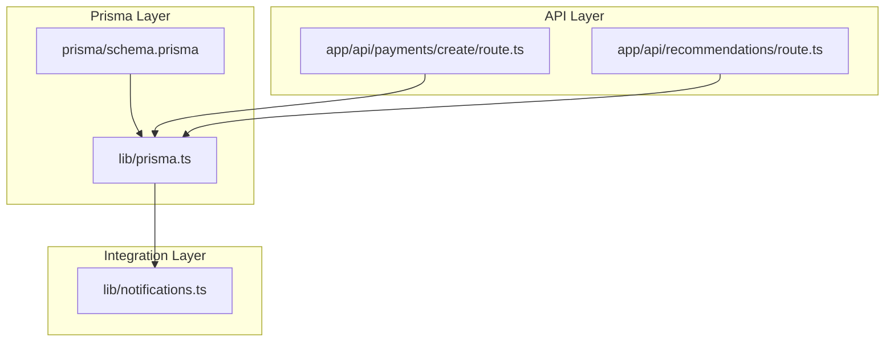
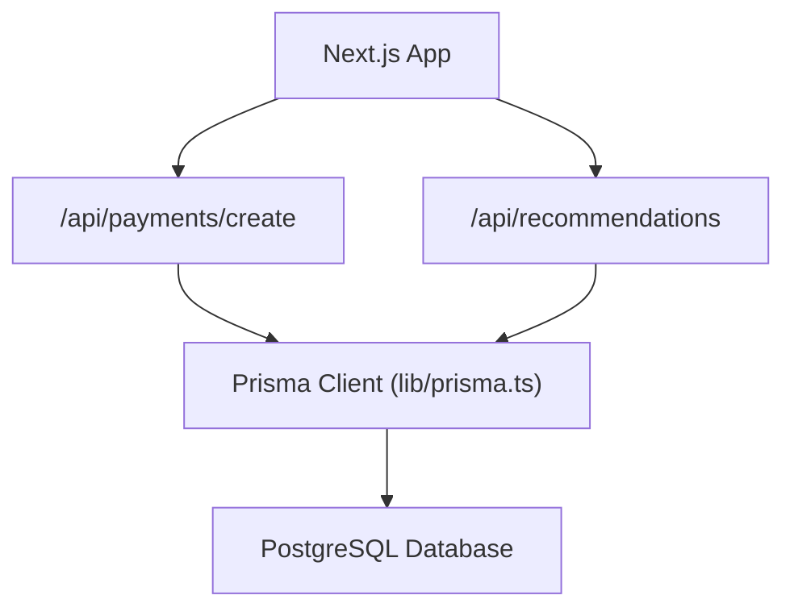
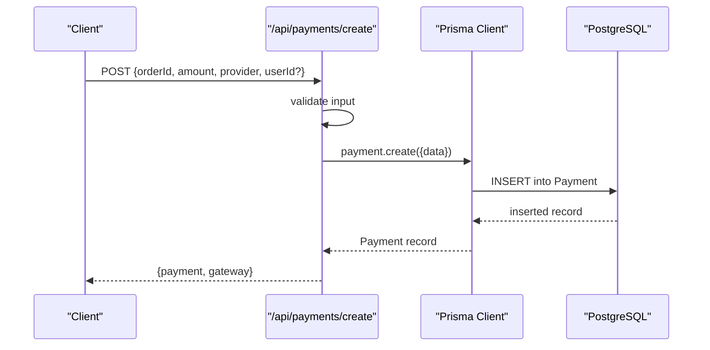
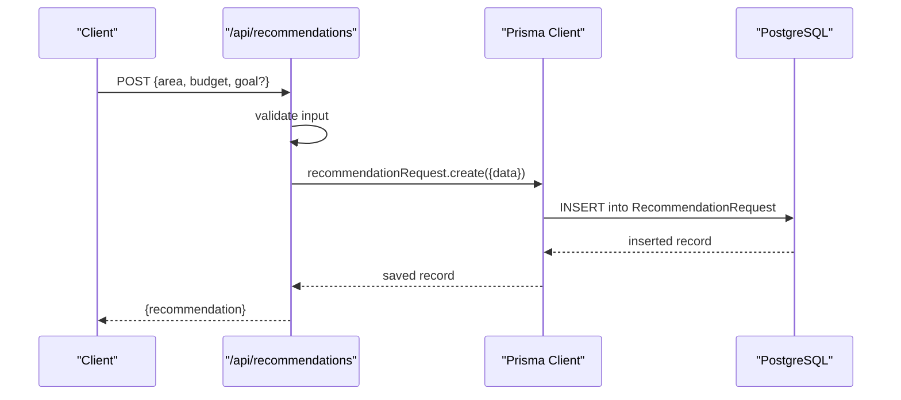
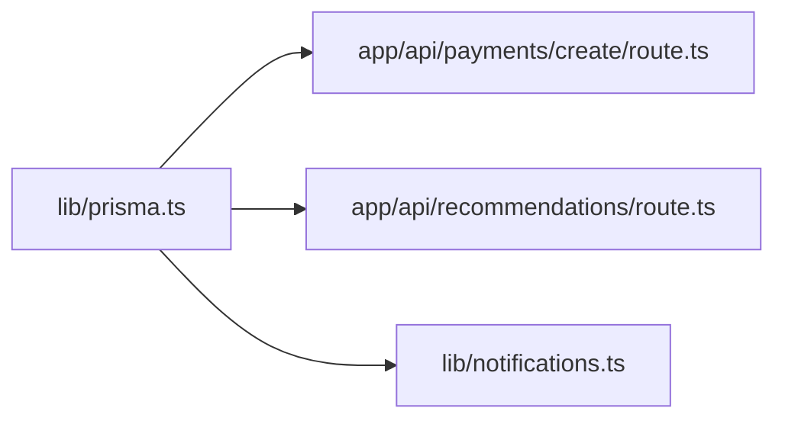
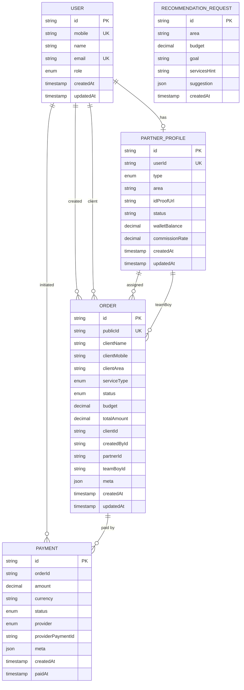

# Database Design & Schema

<cite>
**Referenced Files in This Document**
- [schema.prisma](file://prisma/schema.prisma)
- [prisma.ts](file://lib/prisma.ts)
- [package.json](file://package.json)
- [route.ts](file://app/api/payments/create/route.ts)
- [route.ts](file://app/api/recommendations/route.ts)
- [notifications.ts](file://lib/notifications.ts)
</cite>

## Table of Contents
1. [Introduction](#introduction)
2. [Project Structure](#project-structure)
3. [Core Components](#core-components)
4. [Architecture Overview](#architecture-overview)
5. [Detailed Component Analysis](#detailed-component-analysis)
6. [Dependency Analysis](#dependency-analysis)
7. [Performance Considerations](#performance-considerations)
8. [Troubleshooting Guide](#troubleshooting-guide)
9. [Conclusion](#conclusion)
10. [Appendices](#appendices)

## Introduction
This document describes the database design and schema for the Prisma ORM-backed application. It focuses on the data model for Users, PartnerProfiles, Orders, Payments, and RecommendationRequests, including entity relationships, indexes, constraints, enums, and business rule enforcement. It also documents Prisma client initialization, database connection management, migration strategies, validation rules, and data access patterns. Sample data examples and schema diagrams are included to aid understanding.

## Project Structure
The database schema is defined centrally in the Prisma schema file. Prisma client initialization is encapsulated in a dedicated module. API routes demonstrate usage patterns for Payments and RecommendationRequests, while Notifications utilities show how domain events could trigger external integrations.



**Diagram sources**
- [schema.prisma:1-159](file://prisma/schema.prisma#L1-L159)
- [prisma.ts:1-17](file://lib/prisma.ts#L1-L17)
- [route.ts:1-46](file://app/api/payments/create/route.ts#L1-L46)
- [route.ts:1-56](file://app/api/recommendations/route.ts#L1-L56)
- [notifications.ts:1-28](file://lib/notifications.ts#L1-L28)

**Section sources**
- [schema.prisma:1-159](file://prisma/schema.prisma#L1-L159)
- [prisma.ts:1-17](file://lib/prisma.ts#L1-L17)
- [package.json:5-12](file://package.json#L5-L12)

## Core Components
This section documents each model’s fields, data types, primary/foreign keys, indexes, and constraints, along with the enums used.

- Enum definitions
  - UserRole: ADMIN, TEAM_BOY, PRINTING_SHOP, CLIENT
  - PartnerType: TEAM_BOY, PRINTING_SHOP, AGENCY
  - OrderStatus: DRAFT, PENDING, ASSIGNED, IN_PROGRESS, COMPLETED, CANCELLED
  - ServiceType: PAMPHLET_DISTRIBUTION, FLEX_BANNER, ELECTRIC_POLE_AD, SUNPACK_SHEET, WALL_POSTER, LOCAL_PROMOTION_PACKAGE
  - PaymentStatus: CREATED, PENDING, SUCCESS, FAILED, REFUNDED
  - PaymentProvider: RAZORPAY, PAYTM, STRIPE, CASH, OTHER

- User
  - Fields
    - id: String, @id, @default(cuid())
    - mobile: String, @unique
    - name: String?
    - email: String?, @unique
    - role: UserRole
    - createdAt: DateTime, @default(now())
    - updatedAt: DateTime, @updatedAt
  - Relations
    - partnerProfile: One-to-one with PartnerProfile via userId
    - ordersCreated: One-to-many with Order (via createdById)
    - ordersAsClient: One-to-many with Order (via clientId)
    - payments: One-to-many with Payment (via userId)

- PartnerProfile
  - Fields
    - id: String, @id, @default(cuid())
    - userId: String, @unique
    - type: PartnerType
    - area: String
    - idProofUrl: String?
    - status: String, @default("PENDING")
    - walletBalance: Decimal, @default(0)
    - commissionRate: Decimal, @default(0)
    - createdAt: DateTime, @default(now())
    - updatedAt: DateTime, @updatedAt
  - Relations
    - user: Many-to-one with User (fields: [userId], references: [id])
    - ordersAssigned: One-to-many with Order (via partnerId)
    - teamBoyOrders: One-to-many with Order (via teamBoyId)

- Order
  - Fields
    - id: String, @id, @default(cuid())
    - publicId: String, @unique
    - clientName: String
    - clientMobile: String
    - clientArea: String
    - serviceType: ServiceType
    - status: OrderStatus, @default(PENDING)
    - budget: Decimal?
    - totalAmount: Decimal?
    - clientId: String?
    - createdById: String?
    - partnerId: String?
    - teamBoyId: String?
    - meta: Json?
    - createdAt: DateTime, @default(now())
    - updatedAt: DateTime, @updatedAt
  - Relations
    - client: Many-to-one with User (via clientId)
    - createdBy: Many-to-one with User (via createdById)
    - partner: Many-to-one with PartnerProfile (via partnerId)
    - teamBoy: Many-to-one with PartnerProfile (via teamBoyId)
    - payments: One-to-many with Payment

- Payment
  - Fields
    - id: String, @id, @default(cuid())
    - orderId: String
    - amount: Decimal
    - currency: String, @default("INR")
    - status: PaymentStatus, @default(CREATED)
    - provider: PaymentProvider
    - providerPaymentId: String?
    - meta: Json?
    - createdAt: DateTime, @default(now())
    - paidAt: DateTime?
  - Relations
    - order: Many-to-one with Order (fields: [orderId], references: [id])
    - user: Many-to-one with User (via userId)

- RecommendationRequest
  - Fields
    - id: String, @id, @default(cuid())
    - area: String
    - budget: Decimal
    - goal: String?
    - servicesHint: String?
    - suggestion: Json?
    - createdAt: DateTime, @default(now())

**Section sources**
- [schema.prisma:10-159](file://prisma/schema.prisma#L10-L159)

## Architecture Overview
The application uses Prisma Client to connect to a PostgreSQL database. The Prisma client is initialized once and reused globally during development to avoid multiple connections. API routes use Prisma to persist and query data. Notifications utilities act as a placeholder for integrating external systems after data mutations.



**Diagram sources**
- [prisma.ts:1-17](file://lib/prisma.ts#L1-L17)
- [route.ts:1-46](file://app/api/payments/create/route.ts#L1-L46)
- [route.ts:1-56](file://app/api/recommendations/route.ts#L1-L56)
- [schema.prisma:5-8](file://prisma/schema.prisma#L5-L8)

## Detailed Component Analysis

### Data Model Class Diagram
This diagram shows entities, relations, and key attributes derived from the Prisma schema.

```mermaid
classDiagram
class User {
+string id
+string mobile
+string? name
+string? email
+UserRole role
+DateTime createdAt
+DateTime updatedAt
}
class PartnerProfile {
+string id
+string userId
+PartnerType type
+string area
+string? idProofUrl
+string status
+decimal walletBalance
+decimal commissionRate
+DateTime createdAt
+DateTime updatedAt
}
class Order {
+string id
+string publicId
+string clientName
+string clientMobile
+string clientArea
+ServiceType serviceType
+OrderStatus status
+decimal? budget
+decimal? totalAmount
+string? clientId
+string? createdById
+string? partnerId
+string? teamBoyId
+Json? meta
+DateTime createdAt
+DateTime updatedAt
}
class Payment {
+string id
+string orderId
+decimal amount
+string currency
+PaymentStatus status
+PaymentProvider provider
+string? providerPaymentId
+Json? meta
+DateTime createdAt
+DateTime? paidAt
}
class RecommendationRequest {
+string id
+string area
+decimal budget
+string? goal
+string? servicesHint
+Json? suggestion
+DateTime createdAt
}
User ||--o{ Order : "ordersCreated"
User ||--o{ Order : "ordersAsClient"
User ||--o{ Payment : "payments"
PartnerProfile ||--o{ Order : "ordersAssigned"
PartnerProfile ||--o{ Order : "teamBoyOrders"
Order ||--o{ Payment : "payments"
User ||--|| PartnerProfile : "partnerProfile"
```

**Diagram sources**
- [schema.prisma:57-157](file://prisma/schema.prisma#L57-L157)

### Payment Creation Workflow
This sequence shows how a Payment is created via the API route using Prisma.



**Diagram sources**
- [route.ts:23-31](file://app/api/payments/create/route.ts#L23-L31)
- [prisma.ts:1-17](file://lib/prisma.ts#L1-L17)
- [schema.prisma:125-144](file://prisma/schema.prisma#L125-L144)

### Recommendation Request Persistence
This sequence shows how a RecommendationRequest is persisted and returned.



**Diagram sources**
- [route.ts:44-51](file://app/api/recommendations/route.ts#L44-L51)
- [prisma.ts:1-17](file://lib/prisma.ts#L1-L17)
- [schema.prisma:146-157](file://prisma/schema.prisma#L146-L157)

### Data Access Patterns
- Payments
  - Creation: API route constructs a minimal payload and persists via Prisma.
  - Future enhancements: Add provider-specific checkout initiation and status updates.
- Recommendations
  - Creation: API route validates inputs, builds a suggestion payload, and persists a RecommendationRequest.
- Orders
  - Current API routes are stubbed; production usage would involve Prisma queries and mutations for listing and creation.

**Section sources**
- [route.ts:1-46](file://app/api/payments/create/route.ts#L1-L46)
- [route.ts:1-56](file://app/api/recommendations/route.ts#L1-L56)

### Data Validation Rules
- Payments
  - Required fields: orderId, amount, provider.
  - Status defaults to CREATED upon creation.
- RecommendationRequests
  - Required fields: area, budget.
  - Optional fields: goal, servicesHint, suggestion.
- Users
  - Unique constraints: mobile, email.
  - Role must be one of UserRole.
- PartnerProfile
  - Unique constraint: userId.
  - Defaults: status="PENDING", walletBalance=0, commissionRate=0.
- Orders
  - Unique constraint: publicId.
  - Defaults: status=PENDING.
  - Optional financial fields: budget, totalAmount.
- Payments
  - Defaults: currency="INR", status=CREATED.

**Section sources**
- [schema.prisma:57-157](file://prisma/schema.prisma#L57-L157)
- [route.ts:19-21](file://app/api/payments/create/route.ts#L19-L21)
- [route.ts:17-19](file://app/api/recommendations/route.ts#L17-L19)

### Business Rule Enforcement
- Roles and Permissions
  - UserRole enum defines administrative and operational roles.
- Order Lifecycle
  - OrderStatus enum enforces state transitions across DRAFT, PENDING, ASSIGNED, IN_PROGRESS, COMPLETED, CANCELLED.
- Payment Lifecycle
  - PaymentStatus enum enforces state transitions across CREATED, PENDING, SUCCESS, FAILED, REFUNDED.
- Service Categories
  - ServiceType enum standardizes service offerings.
- Financial Integrity
  - Decimal fields for amounts and rates ensure precision.
- Metadata Flexibility
  - Json fields for meta and suggestion enable extensibility.

**Section sources**
- [schema.prisma:10-55](file://prisma/schema.prisma#L10-L55)
- [schema.prisma:91-144](file://prisma/schema.prisma#L91-L144)

### Sample Data Examples
- Payment
  - Minimal example: { orderId, amount, provider, userId? }
  - Outcome: Created with status=CREATED and currency=INR.
- RecommendationRequest
  - Example: { area, budget, goal?, servicesHint?, suggestion? }
  - Outcome: Saved with createdAt timestamp.

Note: These examples reflect current API behavior and schema defaults.

**Section sources**
- [route.ts:23-31](file://app/api/payments/create/route.ts#L23-L31)
- [route.ts:44-51](file://app/api/recommendations/route.ts#L44-L51)

## Dependency Analysis
- Prisma Client Initialization
  - Singleton client with development-time global caching to prevent multiple instances.
- API Routes
  - Payments route imports Prisma client and uses typed enums from Prisma client.
  - Recommendations route imports Prisma client and persists a request.
- Notifications
  - Utilities accept Prisma-generated types and serve as integration hooks for emails/SMS.



**Diagram sources**
- [prisma.ts:1-17](file://lib/prisma.ts#L1-L17)
- [route.ts:1-46](file://app/api/payments/create/route.ts#L1-L46)
- [route.ts:1-56](file://app/api/recommendations/route.ts#L1-L56)
- [notifications.ts:1-28](file://lib/notifications.ts#L1-L28)

**Section sources**
- [prisma.ts:1-17](file://lib/prisma.ts#L1-L17)
- [route.ts:1-46](file://app/api/payments/create/route.ts#L1-L46)
- [route.ts:1-56](file://app/api/recommendations/route.ts#L1-L56)
- [notifications.ts:1-28](file://lib/notifications.ts#L1-L28)

## Performance Considerations
- Indexing
  - @unique on mobile, email, and publicId ensures efficient lookups and enforces uniqueness.
- Query Patterns
  - Prefer selective field retrieval and pagination for lists.
  - Use relation queries judiciously to avoid N+1 selects.
- Decimal Precision
  - Use Decimal for monetary fields to avoid floating-point errors.
- Logging
  - Client logs configured to warn and error levels; tune in production environments.
- Connection Management
  - Global singleton prevents excessive connections; ensure proper teardown in long-running processes.

[No sources needed since this section provides general guidance]

## Troubleshooting Guide
- Prisma Client Initialization
  - Ensure DATABASE_URL is set; Prisma datasource reads from environment variable.
  - Verify Prisma client is imported consistently across modules.
- Payments API
  - Validate required fields before persisting.
  - Confirm PaymentStatus transitions align with business logic.
- Recommendation Requests
  - Validate presence of area and budget.
  - Inspect suggestion JSON for expected shape.
- Notifications
  - Integrate real providers and handle retries for failures.

**Section sources**
- [schema.prisma:5-8](file://prisma/schema.prisma#L5-L8)
- [prisma.ts:1-17](file://lib/prisma.ts#L1-L17)
- [route.ts:19-21](file://app/api/payments/create/route.ts#L19-L21)
- [route.ts:17-19](file://app/api/recommendations/route.ts#L17-L19)
- [notifications.ts:1-28](file://lib/notifications.ts#L1-L28)

## Conclusion
The schema establishes a clear, extensible foundation for Users, Partners, Orders, Payments, and Recommendations. Enums enforce business semantics, unique constraints ensure data integrity, and relation definitions capture meaningful associations. The Prisma client is initialized once and used by API routes to persist and query data. Migration scripts and generation commands are available via package scripts to evolve the schema over time.

[No sources needed since this section summarizes without analyzing specific files]

## Appendices

### Database Schema Diagram


**Diagram sources**
- [schema.prisma:57-157](file://prisma/schema.prisma#L57-L157)

### Migration and Generation Scripts
- Prisma generate: regenerates Prisma Client bindings from the schema.
- Prisma migrate dev: creates and applies migrations for schema changes.

**Section sources**
- [package.json:10-11](file://package.json#L10-L11)