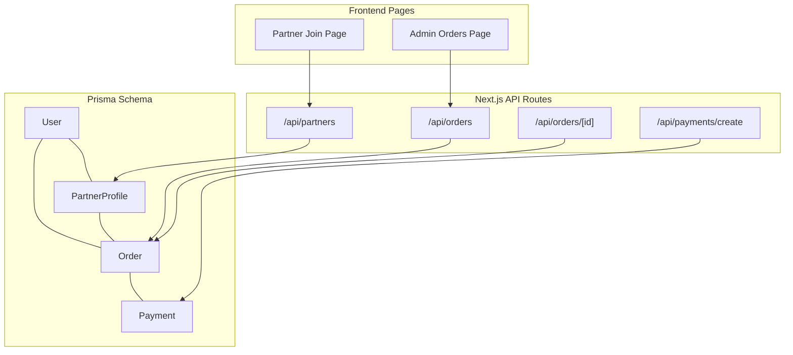
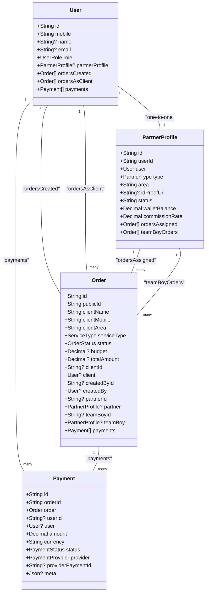
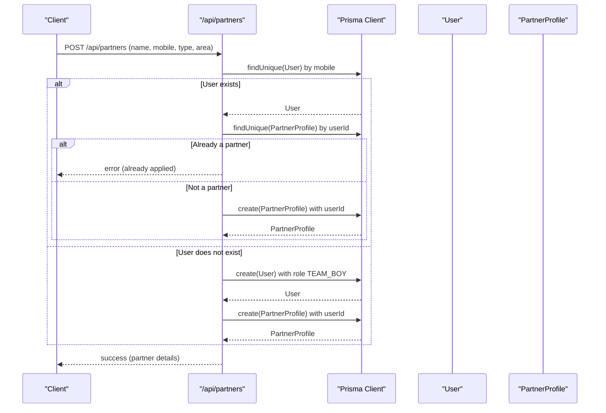
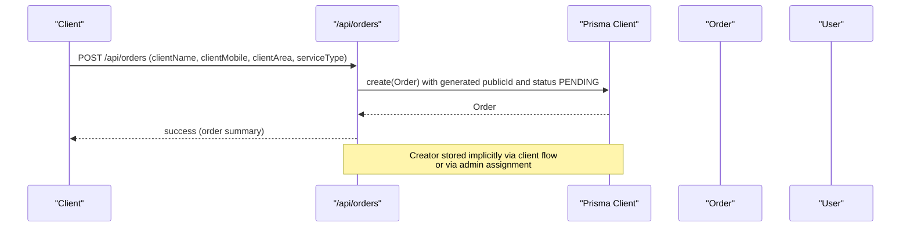
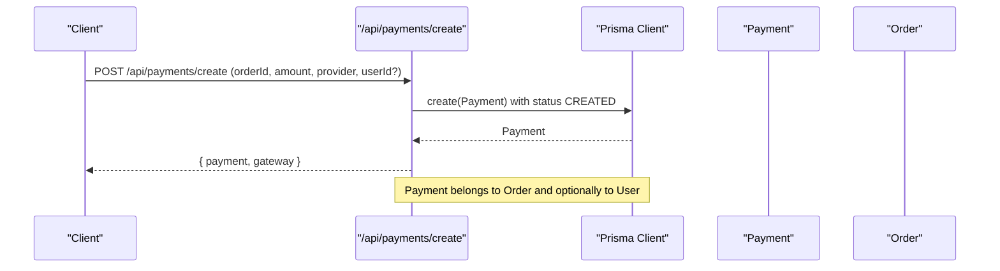
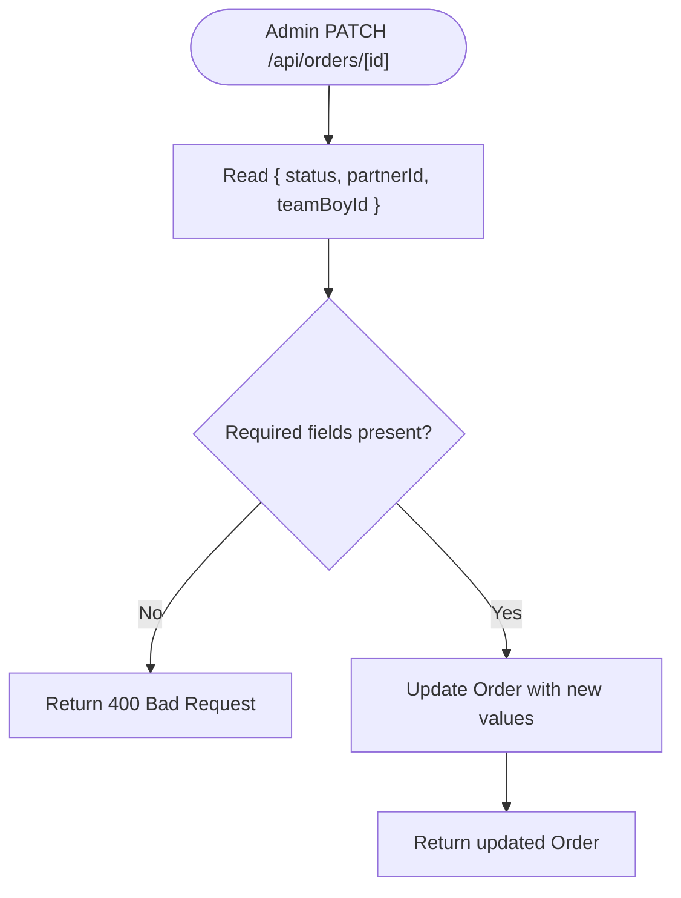
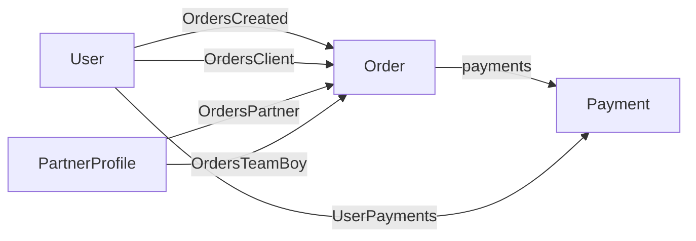
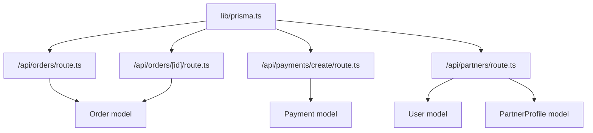

# Entity Relationships & Mapping

<cite>
**Referenced Files in This Document**
- [schema.prisma](file://prisma/schema.prisma)
- [prisma.ts](file://lib/prisma.ts)
- [route.ts](file://app/api/orders/route.ts)
- [route.ts](file://app/api/orders/[id]/route.ts)
- [route.ts](file://app/api/payments/create/route.ts)
- [route.ts](file://app/api/partners/route.ts)
- [page.tsx](file://app/admin/orders/page.tsx)
- [page.tsx](file://app/partner-join/page.tsx)
</cite>

## Table of Contents
1. [Introduction](#introduction)
2. [Project Structure](#project-structure)
3. [Core Components](#core-components)
4. [Architecture Overview](#architecture-overview)
5. [Detailed Component Analysis](#detailed-component-analysis)
6. [Dependency Analysis](#dependency-analysis)
7. [Performance Considerations](#performance-considerations)
8. [Troubleshooting Guide](#troubleshooting-guide)
9. [Conclusion](#conclusion)

## Introduction
This document explains the entity relationships and mapping strategies defined in the Prisma schema for a multi-stakeholder advertising platform. It focuses on:
- One-to-one relationships (User-PartnerProfile)
- One-to-many relationships (User-Orders, Order-Payments)
- Many-to-many through relations (Order-partner and Order-teamBoy via PartnerProfile)
It also documents the business logic behind each relationship pattern, including how the system manages user roles, order assignments, and payment tracking.

## Project Structure
The Prisma schema defines the core data model and relationships. The application uses Next.js API routes to expose CRUD operations and integrates with Prisma via a shared client instance.

**Diagram sources**
- [schema.prisma](file://prisma/schema.prisma)
- [route.ts](file://app/api/orders/route.ts)
- [route.ts](file://app/api/orders/[id]/route.ts)
- [route.ts](file://app/api/payments/create/route.ts)
- [route.ts](file://app/api/partners/route.ts)
- [page.tsx](file://app/admin/orders/page.tsx)
- [page.tsx](file://app/partner-join/page.tsx)

**Section sources**
- [schema.prisma](file://prisma/schema.prisma)
- [prisma.ts](file://lib/prisma.ts)

## Core Components
This section documents the entities and their relationships as defined in the Prisma schema.

- User
  - One-to-one with PartnerProfile via a unique foreign key.
  - One-to-many with Orders as creator and as client.
  - One-to-many with Payments.
- PartnerProfile
  - One-to-one with User via a unique foreign key.
  - One-to-many with Orders as assigned partner and as team boy.
- Order
  - Belongs to a User as creator.
  - Belongs to a User as client.
  - Belongs to a PartnerProfile as assigned partner.
  - Belongs to a PartnerProfile as team boy.
  - Has many Payments.
- Payment
  - Belongs to an Order.
  - Optionally belongs to a User (payment processor).

Key Prisma directives and relation names:
- User.ordersCreated: relation name "OrdersCreated"
- User.ordersAsClient: relation name "OrdersClient"
- User.payments: relation name "UserPayments"
- Order.createdBy: relation name "OrdersCreated"
- Order.client: relation name "OrdersClient"
- Order.partner: relation name "OrdersPartner"
- Order.teamBoy: relation name "OrdersTeamBoy"
- PartnerProfile.ordersAssigned: relation name "OrdersPartner"
- PartnerProfile.teamBoyOrders: relation name "OrdersTeamBoy"
- Payment.user: relation name "UserPayments"

**Section sources**
- [schema.prisma](file://prisma/schema.prisma)

## Architecture Overview
The system uses a multi-stakeholder model:
- Users represent stakeholders (admin, team boy, printing shop, client).
- PartnerProfile links Users to their partner roles and capabilities.
- Orders track client requests and assign multiple stakeholders (creator, client, assigned partner, team boy).
- Payments record financial transactions linked to Orders and optionally to Users.

**Diagram sources**
- [schema.prisma](file://prisma/schema.prisma)

## Detailed Component Analysis

### One-to-One Relationship: User-PartnerProfile
- Mapping
  - PartnerProfile.userId is a unique foreign key referencing User.id.
  - Prisma directive: fields and references define the foreign key mapping.
- Business Logic
  - A User can apply to become a PartnerProfile (team boy, printing shop, agency).
  - The PartnerProfile encapsulates partner-specific attributes (type, area, status, wallet balance, commission rate).
- API Usage
  - Partner onboarding creates or reuses a User and associates a PartnerProfile.
  - Admin views partners with included User details.

**Diagram sources**
- [route.ts](file://app/api/partners/route.ts)

**Section sources**
- [schema.prisma](file://prisma/schema.prisma)
- [route.ts](file://app/api/partners/route.ts)

### One-to-Many Relationships

#### User-Orders (Creator)
- Mapping
  - Order.createdById references User.id.
  - Relation name: "OrdersCreated".
- Business Logic
  - Tracks who created an Order (client or admin).
- API Usage
  - Admin dashboard lists orders with included client and partner/team boy details.

**Diagram sources**
- [route.ts](file://app/api/orders/route.ts)

**Section sources**
- [schema.prisma](file://prisma/schema.prisma)
- [route.ts](file://app/api/orders/route.ts)
- [page.tsx](file://app/admin/orders/page.tsx)

#### User-Orders (Client)
- Mapping
  - Order.clientId references User.id.
  - Relation name: "OrdersClient".
- Business Logic
  - Identifies the client who requested the Order.
- API Usage
  - Admin dashboard includes client details when listing orders.

**Section sources**
- [schema.prisma](file://prisma/schema.prisma)
- [route.ts](file://app/api/orders/route.ts)

#### Order-Payments
- Mapping
  - Payment.orderId references Order.id.
  - Payment.userId optionally references User.id (payment processor).
  - Relation name: "UserPayments" for User-payments.
- Business Logic
  - Payments are linked to Orders and optionally to Users acting as payment processors.
- API Usage
  - Payment creation endpoint initializes a Payment with status CREATED.

**Diagram sources**
- [route.ts](file://app/api/payments/create/route.ts)

**Section sources**
- [schema.prisma](file://prisma/schema.prisma)
- [route.ts](file://app/api/payments/create/route.ts)

### Many-to-Many Through Relations: Order-PartnerProfile (via PartnerProfile)
- Mapping
  - Order.partnerId references PartnerProfile.id.
  - Order.teamBoyId references PartnerProfile.id.
  - PartnerProfile.ordersAssigned and PartnerProfile.teamBoyOrders define inverse sides.
- Business Logic
  - An Order can be assigned to a PartnerProfile as a partner and/or as a team boy.
  - This enables multi-stakeholder order processing where one PartnerProfile handles logistics while another handles field execution.
- API Usage
  - Admin updates order status and assigns partner/team boy via PATCH /api/orders/[id].

**Diagram sources**
- [route.ts](file://app/api/orders/[id]/route.ts)

**Section sources**
- [schema.prisma](file://prisma/schema.prisma)
- [route.ts](file://app/api/orders/[id]/route.ts)

### Relationship Names, Foreign Keys, and Prisma Directives
- User.ordersCreated: relation name "OrdersCreated"
  - Foreign key: Order.createdById -> User.id
- User.ordersAsClient: relation name "OrdersClient"
  - Foreign key: Order.clientId -> User.id
- User.payments: relation name "UserPayments"
  - Foreign key: Payment.userId -> User.id
- PartnerProfile.ordersAssigned: relation name "OrdersPartner"
  - Foreign key: Order.partnerId -> PartnerProfile.id
- PartnerProfile.teamBoyOrders: relation name "OrdersTeamBoy"
  - Foreign key: Order.teamBoyId -> PartnerProfile.id
- Payment.user: relation name "UserPayments"
  - Foreign key: Payment.userId -> User.id

These directives ensure referential integrity and enable Prisma Client to resolve nested relations during queries.

**Section sources**
- [schema.prisma](file://prisma/schema.prisma)

### Multi-Stakeholder System: How Users Are Associated with Orders
- Roles and Responsibilities
  - User (role: CLIENT): Creates Orders; appears as client on Order.
  - User (role: TEAM_BOY or PRINTING_SHOP): Can be a PartnerProfile; can be assigned as partner or team boy on Order.
  - Admin: Can update Order status and assign stakeholders.
- Association Patterns
  - Creator: Order.createdBy (User via "OrdersCreated").
  - Client: Order.client (User via "OrdersClient").
  - Partner: Order.partner (PartnerProfile via "OrdersPartner").
  - Team Boy: Order.teamBoy (PartnerProfile via "OrdersTeamBoy").
- Payment Tracking
  - Payment.order links to Order.
  - Payment.user optionally links to User (payment processor).

**Diagram sources**
- [schema.prisma](file://prisma/schema.prisma)

**Section sources**
- [schema.prisma](file://prisma/schema.prisma)
- [route.ts](file://app/api/orders/route.ts)
- [route.ts](file://app/api/orders/[id]/route.ts)
- [route.ts](file://app/api/payments/create/route.ts)

## Dependency Analysis
- Prisma Client Initialization
  - The Prisma client is created conditionally when DATABASE_URL is present and reused globally to avoid multiple instances.
- API Route Dependencies
  - Orders API depends on Prisma to list and create Orders.
  - Payments API depends on Prisma to create Payments.
  - Partners API depends on Prisma to create PartnerProfiles and link them to Users.
- Frontend Dependencies
  - Admin Orders page fetches orders from /api/orders.
  - Partner Join page posts to /api/partners.

**Diagram sources**
- [prisma.ts](file://lib/prisma.ts)
- [route.ts](file://app/api/orders/route.ts)
- [route.ts](file://app/api/orders/[id]/route.ts)
- [route.ts](file://app/api/payments/create/route.ts)
- [route.ts](file://app/api/partners/route.ts)
- [schema.prisma](file://prisma/schema.prisma)

**Section sources**
- [prisma.ts](file://lib/prisma.ts)
- [route.ts](file://app/api/orders/route.ts)
- [route.ts](file://app/api/orders/[id]/route.ts)
- [route.ts](file://app/api/payments/create/route.ts)
- [route.ts](file://app/api/partners/route.ts)

## Performance Considerations
- Indexing
  - Consider adding database indexes on frequently filtered fields (e.g., Order.clientId, Order.createdById, Payment.orderId, Payment.userId) to improve query performance.
- Selective Loading
  - API routes already use selective field loading (include/select) to reduce payload sizes.
- Pagination
  - For large datasets, implement pagination in API routes to limit response sizes.
- Caching
  - Introduce caching for read-heavy endpoints (e.g., listing orders) to reduce database load.

## Troubleshooting Guide
- Missing DATABASE_URL
  - The Prisma client is initialized only when DATABASE_URL is present. Without it, API routes fall back to in-memory storage.
- Order Creation Validation
  - Ensure required fields (clientName, clientMobile, clientArea, serviceType) are provided; invalid service types are rejected.
- Partner Application Validation
  - Mobile number must be a valid 10-digit number; partner type must be one of the allowed values.
- Payment Creation Validation
  - Ensure orderId, amount, and provider are provided; userId is optional.

**Section sources**
- [prisma.ts](file://lib/prisma.ts)
- [route.ts](file://app/api/orders/route.ts)
- [route.ts](file://app/api/partners/route.ts)
- [route.ts](file://app/api/payments/create/route.ts)

## Conclusion
The Prisma schema establishes a robust multi-stakeholder model:
- One-to-one binds Users to PartnerProfiles for partner roles.
- One-to-many connects Users to Orders (as creators and clients) and to Payments.
- Many-to-many through PartnerProfile enables flexible order assignments (partner and team boy).
Together, these relationships support order lifecycle management, stakeholder assignment, and payment tracking across the platform.