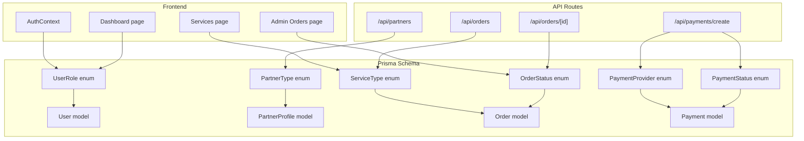
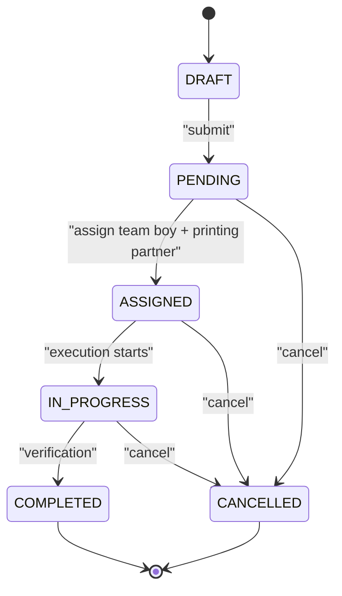
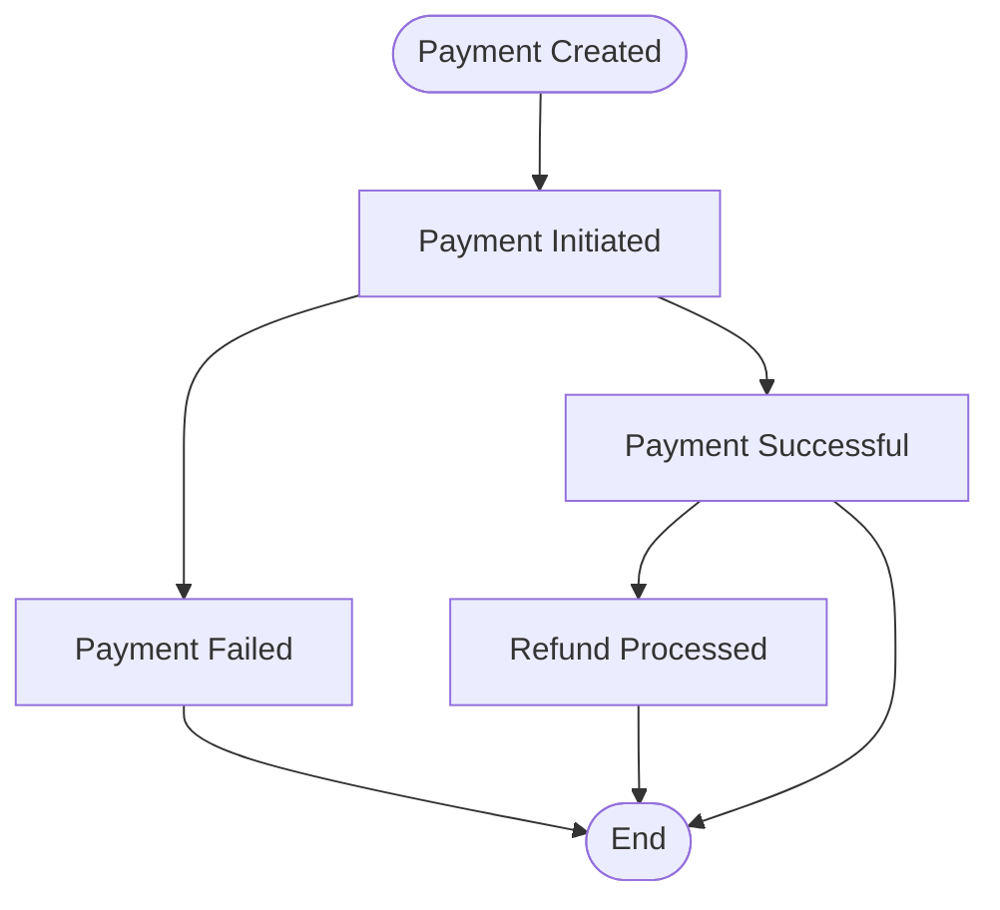
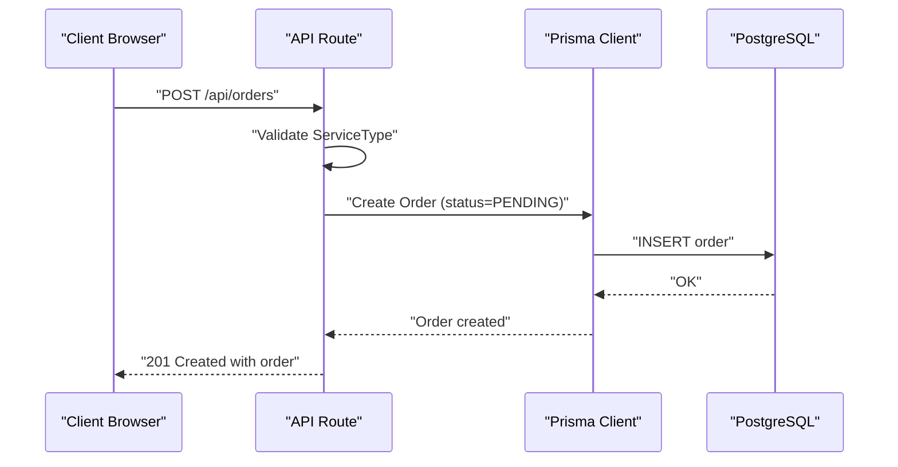
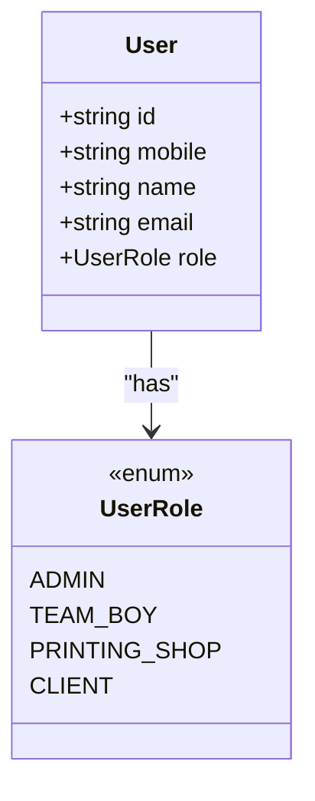
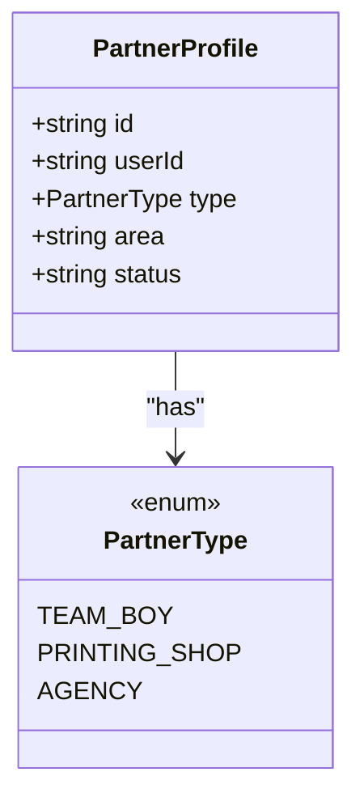
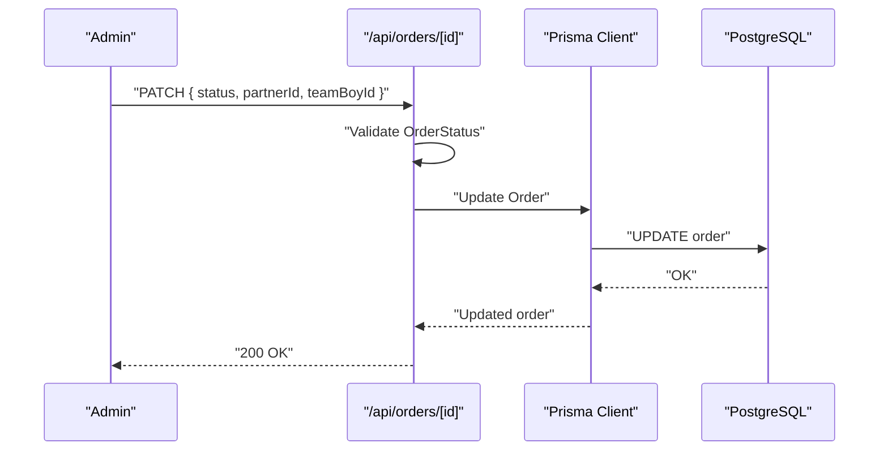
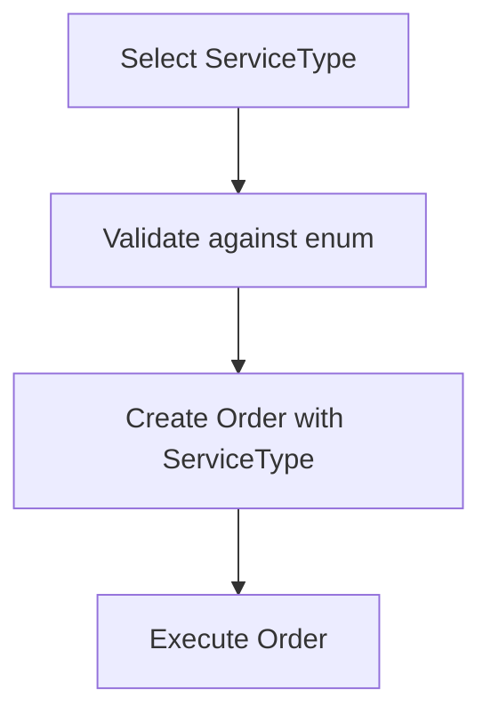
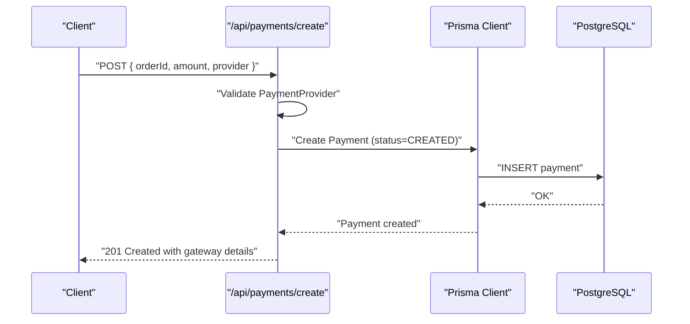
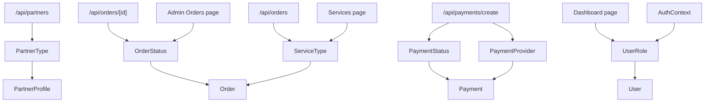

# Enumerations & Types

<cite>
**Referenced Files in This Document**
- [schema.prisma](file://prisma/schema.prisma)
- [partners/route.ts](file://app/api/partners/route.ts)
- [orders/route.ts](file://app/api/orders/route.ts)
- [orders/[id]/route.ts](file://app/api/orders/[id]/route.ts)
- [payments/create/route.ts](file://app/api/payments/create/route.ts)
- [page.tsx](file://app/services/page.tsx)
- [page.tsx](file://app/dashboard/page.tsx)
- [page.tsx](file://app/admin/orders/page.tsx)
- [AuthContext.tsx](file://components/AuthContext.tsx)
</cite>

## Table of Contents
1. [Introduction](#introduction)
2. [Project Structure](#project-structure)
3. [Core Components](#core-components)
4. [Architecture Overview](#architecture-overview)
5. [Detailed Component Analysis](#detailed-component-analysis)
6. [Dependency Analysis](#dependency-analysis)
7. [Performance Considerations](#performance-considerations)
8. [Troubleshooting Guide](#troubleshooting-guide)
9. [Conclusion](#conclusion)

## Introduction
This document provides a comprehensive guide to all custom enum types and scalar types used in the Prisma schema. It focuses on the business significance of each enum value, valid state transitions, and usage patterns across the application workflow. The enums documented here are:
- UserRole
- PartnerType
- OrderStatus
- ServiceType
- PaymentStatus
- PaymentProvider

These enums define the core business domains: user roles, partner categorization, order lifecycle states, service offerings, payment statuses, and payment providers.

## Project Structure
The enums are defined centrally in the Prisma schema and consumed by API routes and frontend components. The schema defines:
- Enums for business domains
- Models that reference these enums
- API routes that validate and enforce enum values
- Frontend pages that present enum values to users

**Diagram sources**
- [schema.prisma:10-55](file://prisma/schema.prisma#L10-L55)
- [partners/route.ts:3](file://app/api/partners/route.ts#L3)
- [orders/route.ts:3](file://app/api/orders/route.ts#L3)
- [orders/[id]/route.ts:3](file://app/api/orders/[id]/route.ts#L3)
- [payments/create/route.ts:3](file://app/api/payments/create/route.ts#L3)
- [page.tsx:5-55](file://app/services/page.tsx#L5-L55)
- [page.tsx:6-38](file://app/dashboard/page.tsx#L6-L38)
- [page.tsx:16-39](file://app/admin/orders/page.tsx#L16-L39)
- [AuthContext.tsx:12](file://components/AuthContext.tsx#L12)

**Section sources**
- [schema.prisma:10-55](file://prisma/schema.prisma#L10-L55)
- [partners/route.ts:3](file://app/api/partners/route.ts#L3)
- [orders/route.ts:3](file://app/api/orders/route.ts#L3)
- [orders/[id]/route.ts:3](file://app/api/orders/[id]/route.ts#L3)
- [payments/create/route.ts:3](file://app/api/payments/create/route.ts#L3)
- [page.tsx:5-55](file://app/services/page.tsx#L5-L55)
- [page.tsx:6-38](file://app/dashboard/page.tsx#L6-L38)
- [page.tsx:16-39](file://app/admin/orders/page.tsx#L16-L39)
- [AuthContext.tsx:12](file://components/AuthContext.tsx#L12)

## Core Components
This section documents each enum type, its business significance, and how it is used across the application.

### UserRole
- Values: ADMIN, TEAM_BOY, PRINTING_SHOP, CLIENT
- Business significance:
  - ADMIN: System administrators with full access to manage orders, partners, and platform operations.
  - TEAM_BOY: Field personnel responsible for executing field tasks (e.g., pamphlet distribution).
  - PRINTING_SHOP: Printing vendors who fulfill print-related orders.
  - CLIENT: End-users who place orders for promotional services.
- Usage patterns:
  - Defined on the User model.
  - Used in dashboard routing to render role-specific views.
  - Used in API routes to set default roles during partner onboarding.
- Valid state transitions:
  - Clients and partners are created with initial roles; ADMIN is typically pre-configured.
  - Role changes are not modeled as transitions in the schema; role updates would require explicit API logic.

**Section sources**
- [schema.prisma:10-15](file://prisma/schema.prisma#L10-L15)
- [schema.prisma:57-71](file://prisma/schema.prisma#L57-L71)
- [page.tsx:33-36](file://app/dashboard/page.tsx#L33-L36)
- [partners/route.ts:79](file://app/api/partners/route.ts#L79)

### PartnerType
- Values: TEAM_BOY, PRINTING_SHOP, AGENCY
- Business significance:
  - TEAM_BOY: Independent field workers who handle distribution and on-ground tasks.
  - PRINTING_SHOP: Vendors specializing in printing services.
  - AGENCY: Sub-partners or agencies acting as intermediaries.
- Usage patterns:
  - Defined on the PartnerProfile model.
  - Validated in the partner onboarding API route.
  - Used in forms and UI to collect partner type during registration.
- Valid state transitions:
  - Partner applications progress through internal approval workflows (not modeled as enum transitions).

**Section sources**
- [schema.prisma:17-21](file://prisma/schema.prisma#L17-L21)
- [schema.prisma:73-89](file://prisma/schema.prisma#L73-L89)
- [partners/route.ts:49](file://app/api/partners/route.ts#L49)
- [page.tsx:9-118](file://app/partner-join/page.tsx#L9-L118)

### OrderStatus
- Values: DRAFT, PENDING, ASSIGNED, IN_PROGRESS, COMPLETED, CANCELLED
- Business significance:
  - DRAFT: Internal draft state before submission.
  - PENDING: Awaiting assignment to a team boy and printing partner.
  - ASSIGNED: Assigned to a team boy and printing partner.
  - IN_PROGRESS: Execution phase (field work and printing).
  - COMPLETED: Finalized and verified.
  - CANCELLED: Order terminated.
- Usage patterns:
  - Default status is PENDING for new orders.
  - Updated via PATCH endpoint for admin-managed state changes.
  - Displayed in admin and dashboard views.
- Valid state transitions:
  - DRAFT → PENDING (on submission)
  - PENDING → ASSIGNED (after assignment)
  - ASSIGNED → IN_PROGRESS (on execution start)
  - IN_PROGRESS → COMPLETED (on verification)
  - PENDING → CANCELLED (on cancellation)
  - ASSIGNED → CANCELLED (on cancellation)
  - IN_PROGRESS → CANCELLED (on cancellation)

**Diagram sources**
- [schema.prisma:23-30](file://prisma/schema.prisma#L23-L30)
- [orders/route.ts:63](file://app/api/orders/route.ts#L63)
- [orders/[id]/route.ts:37](file://app/api/orders/[id]/route.ts#L37)

**Section sources**
- [schema.prisma:23-30](file://prisma/schema.prisma#L23-L30)
- [schema.prisma:91-123](file://prisma/schema.prisma#L91-L123)
- [orders/route.ts:63](file://app/api/orders/route.ts#L63)
- [orders/[id]/route.ts:37](file://app/api/orders/[id]/route.ts#L37)
- [page.tsx:68-82](file://app/admin/orders/page.tsx#L68-L82)

### ServiceType
- Values: PAMPHLET_DISTRIBUTION, FLEX_BANNER, ELECTRIC_POLE_AD, SUNPACK_SHEET, WALL_POSTER, LOCAL_PROMOTION_PACKAGE
- Business significance:
  - PAMPHLET_DISTRIBUTION: Door-to-door leaflet distribution with route planning and photo proof.
  - FLEX_BANNER: High-visibility flex banners at key locations.
  - ELECTRIC_POLE_AD: Pole-mounted boards along main roads.
  - SUNPACK_SHEET: Durable sunpack boards for longer campaigns.
  - WALL_POSTER: Strategic wall posters in high-footfall areas.
  - LOCAL_PROMOTION_PACKAGE: End-to-end campaign planning with mixed media.
- Usage patterns:
  - Defined on the Order model.
  - Validated in the order creation API route.
  - Displayed in the services page with descriptions and combinations.
- Valid state transitions:
  - Service type is selected during order creation and remains immutable for billing and fulfillment.

**Section sources**
- [schema.prisma:32-39](file://prisma/schema.prisma#L32-L39)
- [schema.prisma:91-123](file://prisma/schema.prisma#L91-L123)
- [orders/route.ts:41](file://app/api/orders/route.ts#L41)
- [page.tsx:5-55](file://app/services/page.tsx#L5-L55)

### PaymentStatus
- Values: CREATED, PENDING, SUCCESS, FAILED, REFUNDED
- Business significance:
  - CREATED: Payment record initialized.
  - PENDING: Payment initiated but not yet confirmed.
  - SUCCESS: Payment completed successfully.
  - FAILED: Payment failed (e.g., insufficient funds, gateway error).
  - REFUNDED: Full refund processed.
- Usage patterns:
  - Default status is CREATED for new payments.
  - Used in payment creation API route.
  - Stored with payment metadata for audit.
- Valid state transitions:
  - CREATED → PENDING → SUCCESS
  - CREATED → PENDING → FAILED
  - SUCCESS → REFUNDED (refund processed)

**Diagram sources**
- [schema.prisma:41-47](file://prisma/schema.prisma#L41-L47)
- [schema.prisma:125-144](file://prisma/schema.prisma#L125-L144)
- [payments/create/route.ts:28](file://app/api/payments/create/route.ts#L28)

**Section sources**
- [schema.prisma:41-47](file://prisma/schema.prisma#L41-L47)
- [schema.prisma:125-144](file://prisma/schema.prisma#L125-L144)
- [payments/create/route.ts:28](file://app/api/payments/create/route.ts#L28)

### PaymentProvider
- Values: RAZORPAY, PAYTM, STRIPE, CASH, OTHER
- Business significance:
  - RAZORPAY: Popular Indian payment gateway.
  - PAYTM: UPI and card-based payments.
  - STRIPE: International card payments.
  - CASH: Cash-on-delivery or cash settlement.
  - OTHER: Alternative or regional providers.
- Usage patterns:
  - Defined on the Payment model.
  - Selected during payment creation API.
  - Used to route payment initialization to the chosen provider.
- Valid state transitions:
  - Provider selection is static for a payment record; provider changes are not modeled as transitions.

**Section sources**
- [schema.prisma:49-55](file://prisma/schema.prisma#L49-L55)
- [schema.prisma:125-144](file://prisma/schema.prisma#L125-L144)
- [payments/create/route.ts:15](file://app/api/payments/create/route.ts#L15)

## Architecture Overview
The enums are central to the application’s business logic:
- They define canonical values for roles, partner categories, order states, services, and payment attributes.
- API routes validate incoming requests against enum values to ensure data integrity.
- Frontend components present enum values to users and capture selections for onboarding and ordering.

**Diagram sources**
- [orders/route.ts:28-88](file://app/api/orders/route.ts#L28-L88)
- [schema.prisma:91-123](file://prisma/schema.prisma#L91-L123)

## Detailed Component Analysis

### UserRole Analysis
- Business role model:
  - ADMIN: Platform-wide permissions.
  - TEAM_BOY: Field execution.
  - PRINTING_SHOP: Print fulfillment.
  - CLIENT: Order placement.
- Frontend integration:
  - Dashboard renders role-specific UI based on user role.
  - Authentication context manages role state.

**Diagram sources**
- [schema.prisma:57-71](file://prisma/schema.prisma#L57-L71)
- [schema.prisma:10-15](file://prisma/schema.prisma#L10-L15)
- [page.tsx:6-38](file://app/dashboard/page.tsx#L6-L38)

**Section sources**
- [schema.prisma:57-71](file://prisma/schema.prisma#L57-L71)
- [schema.prisma:10-15](file://prisma/schema.prisma#L10-L15)
- [page.tsx:6-38](file://app/dashboard/page.tsx#L6-L38)
- [AuthContext.tsx:12](file://components/AuthContext.tsx#L12)

### PartnerType Analysis
- Partner categories:
  - TEAM_BOY: Independent field workers.
  - PRINTING_SHOP: Printing vendors.
  - AGENCY: Intermediaries.
- Validation:
  - API route validates partner type against enum values.

**Diagram sources**
- [schema.prisma:73-89](file://prisma/schema.prisma#L73-L89)
- [schema.prisma:17-21](file://prisma/schema.prisma#L17-L21)
- [partners/route.ts:49](file://app/api/partners/route.ts#L49)

**Section sources**
- [schema.prisma:73-89](file://prisma/schema.prisma#L73-L89)
- [schema.prisma:17-21](file://prisma/schema.prisma#L17-L21)
- [partners/route.ts:49](file://app/api/partners/route.ts#L49)

### OrderStatus Analysis
- Lifecycle states:
  - DRAFT → PENDING → ASSIGNED → IN_PROGRESS → COMPLETED
  - CANCELLED can occur at multiple stages.
- API usage:
  - PATCH endpoint updates status and assignees.

**Diagram sources**
- [orders/[id]/route.ts:29-L52](file://app/api/orders/[id]/route.ts#L29-L52)
- [schema.prisma:23-30](file://prisma/schema.prisma#L23-L30)

**Section sources**
- [orders/[id]/route.ts:29-L52](file://app/api/orders/[id]/route.ts#L29-L52)
- [schema.prisma:23-30](file://prisma/schema.prisma#L23-L30)

### ServiceType Analysis
- Service offerings:
  - Distribution, printing, poster, and combo packages.
- Selection flow:
  - Services page lists offerings; order creation uses selected ServiceType.

**Diagram sources**
- [page.tsx:5-55](file://app/services/page.tsx#L5-L55)
- [orders/route.ts:41](file://app/api/orders/route.ts#L41)
- [schema.prisma:32-39](file://prisma/schema.prisma#L32-L39)

**Section sources**
- [page.tsx:5-55](file://app/services/page.tsx#L5-L55)
- [orders/route.ts:41](file://app/api/orders/route.ts#L41)
- [schema.prisma:32-39](file://prisma/schema.prisma#L32-L39)

### PaymentStatus and PaymentProvider Analysis
- Payment lifecycle:
  - CREATED → PENDING → SUCCESS or FAILED
  - SUCCESS can lead to REFUNDED.
- Provider selection:
  - Payment creation route accepts provider and initializes payment.

**Diagram sources**
- [payments/create/route.ts:1-45](file://app/api/payments/create/route.ts#L1-L45)
- [schema.prisma:41-55](file://prisma/schema.prisma#L41-L55)
- [schema.prisma:125-144](file://prisma/schema.prisma#L125-L144)

**Section sources**
- [payments/create/route.ts:1-45](file://app/api/payments/create/route.ts#L1-L45)
- [schema.prisma:41-55](file://prisma/schema.prisma#L41-L55)
- [schema.prisma:125-144](file://prisma/schema.prisma#L125-L144)

## Dependency Analysis
The enums are consumed by:
- Models (User, PartnerProfile, Order, Payment)
- API routes (validation and creation/update)
- Frontend components (selection and display)

**Diagram sources**
- [schema.prisma:10-55](file://prisma/schema.prisma#L10-L55)
- [partners/route.ts:3](file://app/api/partners/route.ts#L3)
- [orders/route.ts:3](file://app/api/orders/route.ts#L3)
- [orders/[id]/route.ts:3](file://app/api/orders/[id]/route.ts#L3)
- [payments/create/route.ts:3](file://app/api/payments/create/route.ts#L3)
- [page.tsx:5-55](file://app/services/page.tsx#L5-L55)
- [page.tsx:6-38](file://app/dashboard/page.tsx#L6-L38)
- [page.tsx:16-39](file://app/admin/orders/page.tsx#L16-L39)
- [AuthContext.tsx:12](file://components/AuthContext.tsx#L12)

**Section sources**
- [schema.prisma:10-55](file://prisma/schema.prisma#L10-L55)
- [partners/route.ts:3](file://app/api/partners/route.ts#L3)
- [orders/route.ts:3](file://app/api/orders/route.ts#L3)
- [orders/[id]/route.ts:3](file://app/api/orders/[id]/route.ts#L3)
- [payments/create/route.ts:3](file://app/api/payments/create/route.ts#L3)
- [page.tsx:5-55](file://app/services/page.tsx#L5-L55)
- [page.tsx:6-38](file://app/dashboard/page.tsx#L6-L38)
- [page.tsx:16-39](file://app/admin/orders/page.tsx#L16-L39)
- [AuthContext.tsx:12](file://components/AuthContext.tsx#L12)

## Performance Considerations
- Enum validation in API routes prevents invalid writes, reducing downstream errors and reprocessing.
- Using Prisma enums ensures type-safe comparisons and reduces runtime casting overhead.
- Default values in models minimize nullable checks and simplify queries.

## Troubleshooting Guide
- Invalid enum values:
  - PartnerType validation returns a 400 error when the value is not one of the allowed enum values.
  - ServiceType validation returns a 400 error when the value is not recognized.
- Payment creation:
  - Missing required fields (orderId, amount, provider) cause a 400 error.
  - PaymentStatus defaults to CREATED to ensure consistent initialization.
- Order state updates:
  - PATCH requests must include a valid OrderStatus value; otherwise, the update will fail at the validation stage.

**Section sources**
- [partners/route.ts:49-54](file://app/api/partners/route.ts#L49-L54)
- [orders/route.ts:41-46](file://app/api/orders/route.ts#L41-L46)
- [payments/create/route.ts:19-21](file://app/api/payments/create/route.ts#L19-L21)
- [orders/[id]/route.ts:37](file://app/api/orders/[id]/route.ts#L37)

## Conclusion
The enums in the Prisma schema define the core business semantics of the application. They ensure data integrity, enable clear state modeling, and provide a consistent contract between frontend and backend. By validating enum values at API boundaries and leveraging defaults in models, the system maintains predictable workflows for user roles, partner categories, order lifecycles, service offerings, and payment processing.