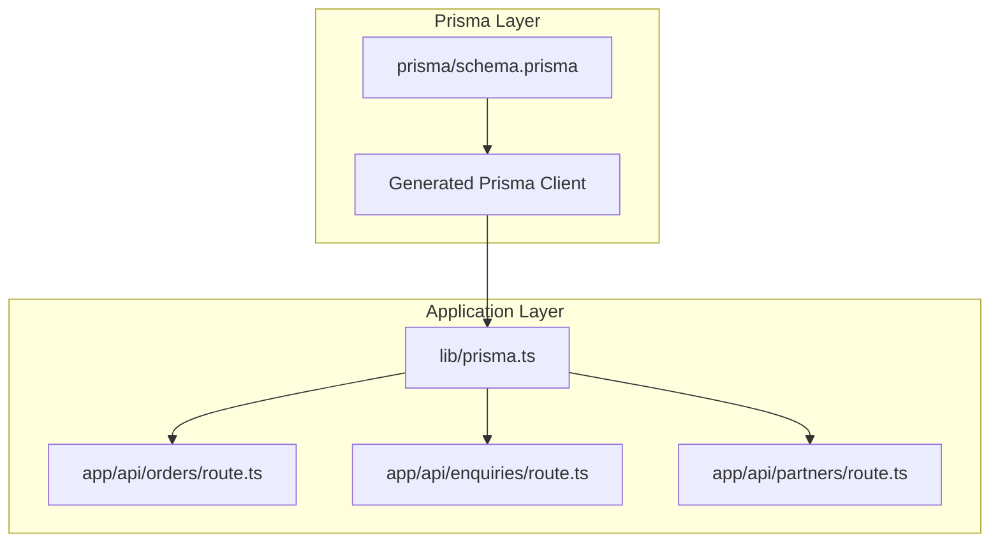
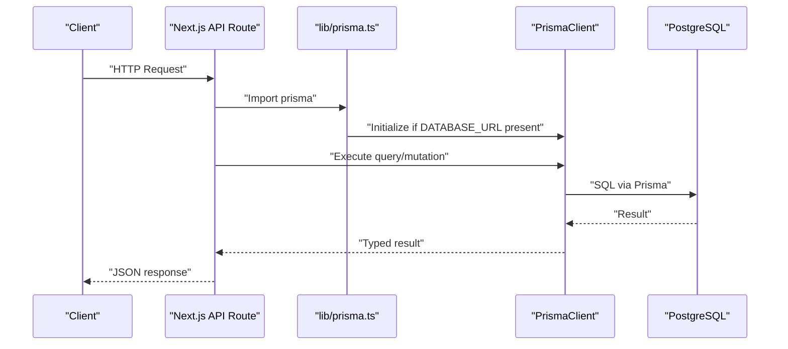
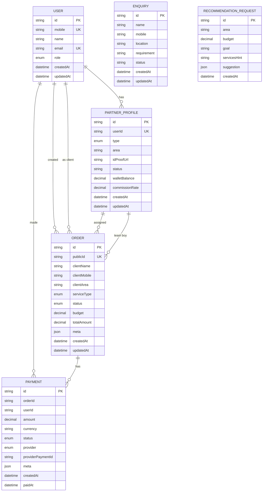
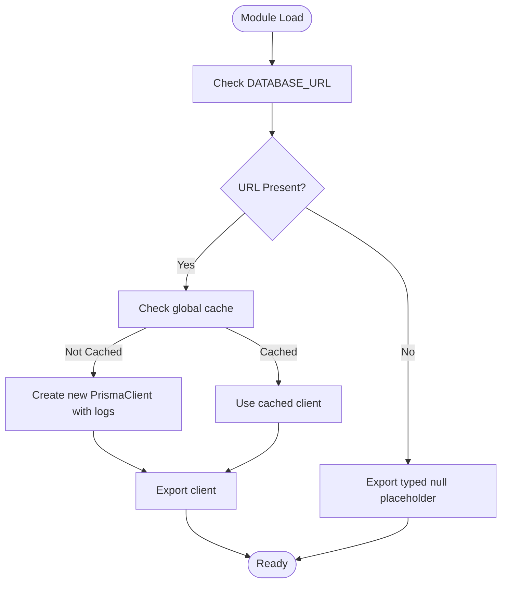
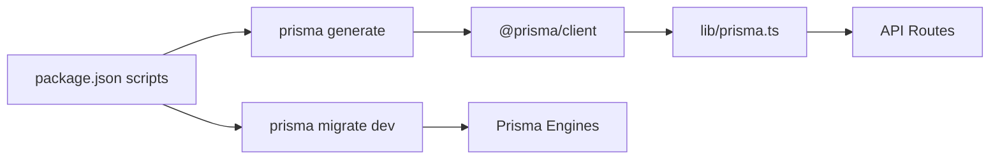

# Prisma Configuration & Setup

<cite>
**Referenced Files in This Document**
- [schema.prisma](file://prisma/schema.prisma)
- [lib/prisma.ts](file://lib/prisma.ts)
- [package.json](file://package.json)
- [DEPLOYMENT.md](file://DEPLOYMENT.md)
- [vercel.json](file://vercel.json)
- [app/api/orders/route.ts](file://app/api/orders/route.ts)
- [app/api/enquiries/route.ts](file://app/api/enquiries/route.ts)
- [app/api/partners/route.ts](file://app/api/partners/route.ts)
</cite>

## Table of Contents
1. [Introduction](#introduction)
2. [Project Structure](#project-structure)
3. [Core Components](#core-components)
4. [Architecture Overview](#architecture-overview)
5. [Detailed Component Analysis](#detailed-component-analysis)
6. [Dependency Analysis](#dependency-analysis)
7. [Performance Considerations](#performance-considerations)
8. [Troubleshooting Guide](#troubleshooting-guide)
9. [Conclusion](#conclusion)

## Introduction
This document explains the Prisma configuration and setup for the Shree Shyam Agency application. It covers the Prisma schema definition, client generation, PostgreSQL datasource configuration, environment variable usage, and how the Prisma client is initialized and used across the application. It also outlines migration strategies, schema validation, and recommended best practices for connection management, error handling, and performance optimization.

## Project Structure
Prisma-related assets are organized as follows:
- Prisma schema defines the data model, enums, relations, and datasource configuration.
- The Prisma client is initialized in a dedicated library module and exported for use in API routes.
- Scripts for generating the client and running migrations are defined in the project’s package scripts.
- Deployment documentation and Vercel configuration indicate environment variable requirements for production.

**Diagram sources**
- [schema.prisma](file://prisma/schema.prisma)
- [lib/prisma.ts](file://lib/prisma.ts)
- [app/api/orders/route.ts](file://app/api/orders/route.ts)
- [app/api/enquiries/route.ts](file://app/api/enquiries/route.ts)
- [app/api/partners/route.ts](file://app/api/partners/route.ts)

**Section sources**
- [schema.prisma](file://prisma/schema.prisma)
- [lib/prisma.ts](file://lib/prisma.ts)
- [package.json](file://package.json)
- [DEPLOYMENT.md](file://DEPLOYMENT.md)
- [vercel.json](file://vercel.json)

## Core Components
- Prisma schema: Defines the data model, enums, relations, and datasource configuration. The datasource uses PostgreSQL and reads the database URL from an environment variable.
- Prisma client initialization: Creates a singleton PrismaClient instance with logging enabled for errors and warnings, guarded by the presence of the database URL. In non-production environments, the client is cached globally to avoid multiple instances.
- API routes: Import the shared Prisma client and use it to perform CRUD operations against the database. They also include fallback logic for development when the database URL is not configured.

Key configuration highlights:
- Generator: JavaScript client provider.
- Datasource: PostgreSQL provider with URL sourced from an environment variable.
- Enums: Role, PartnerType, OrderStatus, ServiceType, PaymentStatus, PaymentProvider.
- Models: User, PartnerProfile, Order, Payment, Enquiry, RecommendationRequest.

**Section sources**
- [schema.prisma](file://prisma/schema.prisma)
- [lib/prisma.ts](file://lib/prisma.ts)
- [app/api/orders/route.ts](file://app/api/orders/route.ts)
- [app/api/enquiries/route.ts](file://app/api/enquiries/route.ts)
- [app/api/partners/route.ts](file://app/api/partners/route.ts)

## Architecture Overview
The application integrates Prisma as the ORM layer. The Prisma client is lazily instantiated when the database URL is present and reused across API routes. Routes encapsulate business logic and interact with the client to query and mutate data.

**Diagram sources**
- [lib/prisma.ts](file://lib/prisma.ts)
- [app/api/orders/route.ts](file://app/api/orders/route.ts)
- [app/api/enquiries/route.ts](file://app/api/enquiries/route.ts)
- [app/api/partners/route.ts](file://app/api/partners/route.ts)

## Detailed Component Analysis

### Prisma Schema Definition
The schema defines:
- A JavaScript client generator.
- A PostgreSQL datasource whose URL is loaded from an environment variable.
- Enumerations for roles, partner types, order statuses, service types, and payment statuses/providers.
- Models representing Users, PartnerProfiles, Orders, Payments, Enquiries, and RecommendationRequests, including relations and indexes.

**Diagram sources**
- [schema.prisma](file://prisma/schema.prisma)

**Section sources**
- [schema.prisma](file://prisma/schema.prisma)

### Prisma Client Initialization
The client initialization module:
- Imports the Prisma client runtime.
- Checks for the presence of the database URL environment variable.
- Creates a singleton PrismaClient with logging enabled for errors and warnings when the database URL is present.
- In non-production environments, caches the client globally to prevent multiple instances during hot reloads.
- Exports either the client or a typed null placeholder depending on availability.

**Diagram sources**
- [lib/prisma.ts](file://lib/prisma.ts)

**Section sources**
- [lib/prisma.ts](file://lib/prisma.ts)

### API Route Usage Patterns
API routes demonstrate:
- Conditional database usage based on the presence of the database URL.
- In-memory fallbacks for development when the database is not configured.
- Typed enums imported from the Prisma client for validation and creation.
- Structured error handling with logging and standardized responses.

Examples:
- Orders route: Lists orders with included relations and creates new orders with auto-generated public IDs.
- Enquiries route: Validates input and persists records to the database or in-memory storage.
- Partners route: Manages user and partner onboarding with validation and deduplication checks.

**Section sources**
- [app/api/orders/route.ts](file://app/api/orders/route.ts)
- [app/api/enquiries/route.ts](file://app/api/enquiries/route.ts)
- [app/api/partners/route.ts](file://app/api/partners/route.ts)

## Dependency Analysis
- The application depends on the Prisma client package for type-safe database operations.
- The Prisma CLI is used for generating the client and running migrations.
- Deployment targets require the database URL environment variable to be set.

**Diagram sources**
- [package.json](file://package.json)
- [lib/prisma.ts](file://lib/prisma.ts)

**Section sources**
- [package.json](file://package.json)
- [lib/prisma.ts](file://lib/prisma.ts)

## Performance Considerations
- Connection pooling: The Prisma client manages connection pooling internally. Keep the client as a singleton to reuse connections efficiently.
- Logging: Enable logging only in development to reduce overhead in production.
- Queries: Use selective field retrieval and pagination for large datasets. Prefer indexed fields for filtering and sorting.
- Transactions: Wrap related writes in transactions to maintain consistency and reduce partial updates.
- Caching: Cache infrequent read-heavy data at the application level to reduce database load.
- Migrations: Keep migrations minimal and additive to avoid long-running migrations in production.

## Troubleshooting Guide
Common issues and resolutions:
- Missing database URL:
  - Symptom: Client exports a null placeholder; routes fall back to in-memory storage.
  - Resolution: Set the database URL environment variable for development or production.
- Migration errors:
  - Symptom: Migration failures during build or startup.
  - Resolution: Run the migration command and ensure the database is reachable.
- Type mismatches:
  - Symptom: Validation errors when creating or updating records.
  - Resolution: Confirm enum values match those defined in the schema and import types from the Prisma client.
- Deployment failures:
  - Symptom: Build or runtime errors related to database connectivity.
  - Resolution: Verify environment variables are configured in the deployment platform and the database is accessible.

**Section sources**
- [lib/prisma.ts](file://lib/prisma.ts)
- [DEPLOYMENT.md](file://DEPLOYMENT.md)
- [vercel.json](file://vercel.json)

## Conclusion
The Shree Shyam Agency application uses Prisma to manage a PostgreSQL-backed data layer. The schema defines a comprehensive domain model with enums and relations, while the client initialization ensures safe, singleton usage across the application. API routes integrate the client with robust validation and error handling, and fallback logic supports development without a database. Following the outlined best practices will help maintain reliable, performant database operations in both development and production environments.