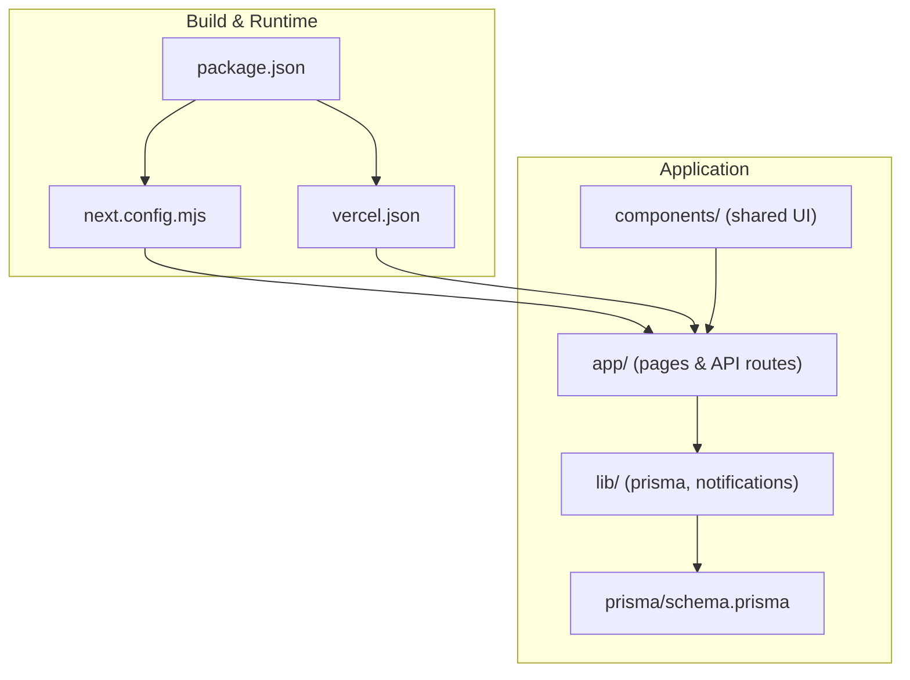
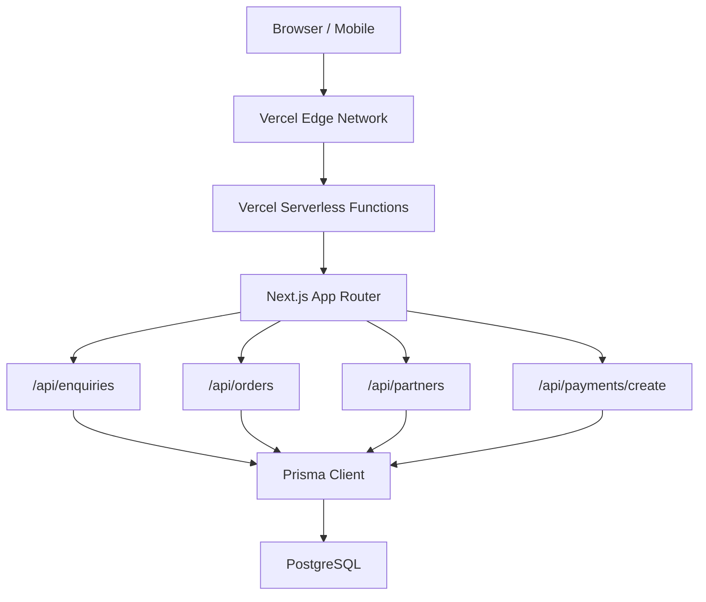
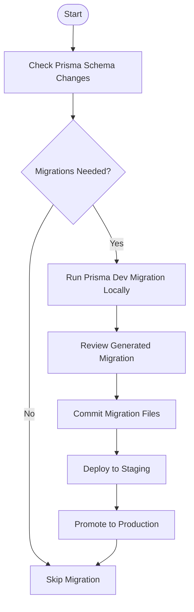
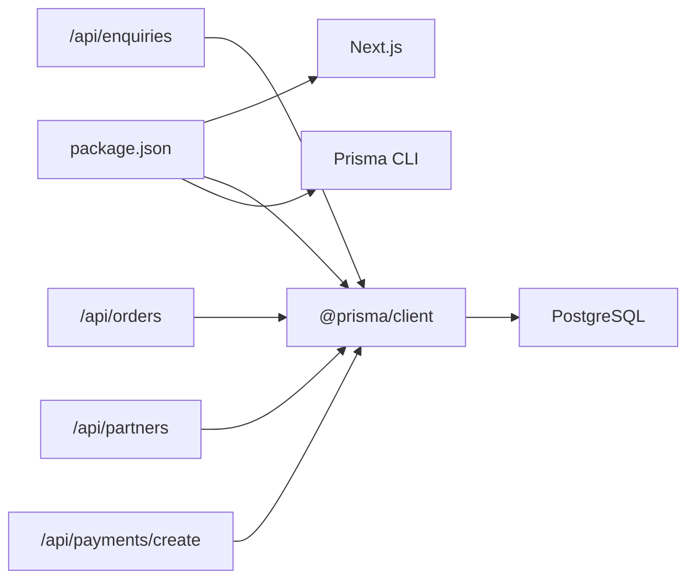
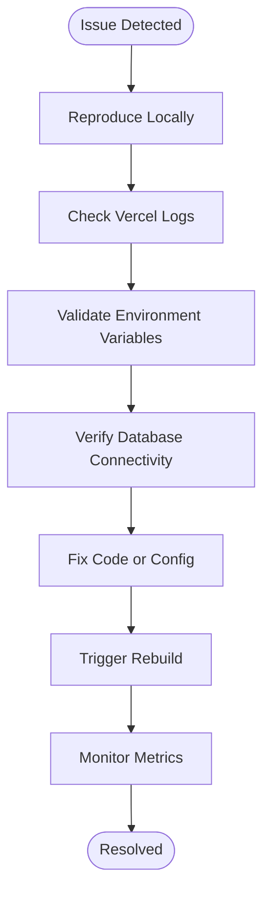

# Deployment & Operations

<cite>
**Referenced Files in This Document**
- [DEPLOYMENT.md](file://DEPLOYMENT.md)
- [vercel.json](file://vercel.json)
- [package.json](file://package.json)
- [next.config.mjs](file://next.config.mjs)
- [lib/prisma.ts](file://lib/prisma.ts)
- [prisma/schema.prisma](file://prisma/schema.prisma)
- [lib/notifications.ts](file://lib/notifications.ts)
- [app/api/enquiries/route.ts](file://app/api/enquiries/route.ts)
- [app/api/orders/route.ts](file://app/api/orders/route.ts)
- [app/api/partners/route.ts](file://app/api/partners/route.ts)
- [app/api/payments/create/route.ts](file://app/api/payments/create/route.ts)
- [test-backend.js](file://test-backend.js)
</cite>

## Table of Contents
1. [Introduction](#introduction)
2. [Project Structure](#project-structure)
3. [Core Components](#core-components)
4. [Architecture Overview](#architecture-overview)
5. [Detailed Component Analysis](#detailed-component-analysis)
6. [Dependency Analysis](#dependency-analysis)
7. [Performance Considerations](#performance-considerations)
8. [Troubleshooting Guide](#troubleshooting-guide)
9. [Conclusion](#conclusion)
10. [Appendices](#appendices)

## Introduction
This document provides comprehensive deployment and operations guidance for the Shree Shyam Agency Portal. It covers the complete pipeline from development to production, focusing on Vercel deployment, environment variable management, CI/CD integration, database migrations, backups, disaster recovery, monitoring and logging, performance optimization, scaling and load balancing, CDN integration, security hardening, SSL/TLS management, automated testing, troubleshooting, rollbacks, and maintenance windows.

## Project Structure
The project is a Next.js 14 application configured with App Router, TypeScript, Tailwind CSS, Prisma ORM, and a PostgreSQL database. The repository includes:
- Application pages and API routes under app/
- Shared UI components under components/
- Prisma schema and client initialization under lib/ and prisma/
- Build and runtime configuration under next.config.mjs, vercel.json, and package.json
- Deployment and operational notes under DEPLOYMENT.md
- Backend testing script under test-backend.js

**Diagram sources**
- [package.json:1-44](file://package.json#L1-L44)
- [next.config.mjs:1-14](file://next.config.mjs#L1-L14)
- [vercel.json:1-22](file://vercel.json#L1-L22)
- [lib/prisma.ts:1-17](file://lib/prisma.ts#L1-L17)
- [prisma/schema.prisma:1-173](file://prisma/schema.prisma#L1-L173)

**Section sources**
- [package.json:1-44](file://package.json#L1-L44)
- [next.config.mjs:1-14](file://next.config.mjs#L1-L14)
- [vercel.json:1-22](file://vercel.json#L1-L22)
- [lib/prisma.ts:1-17](file://lib/prisma.ts#L1-L17)
- [prisma/schema.prisma:1-173](file://prisma/schema.prisma#L1-L173)

## Core Components
- Next.js App Router and API Routes: Pages and API handlers under app/, including endpoints for enquiries, orders, partners, and payments.
- Prisma ORM: Database client initialization and schema definition for PostgreSQL.
- Notifications: Centralized placeholder for email/SMS integrations.
- Build and Runtime: Scripts, framework configuration, and Vercel-specific settings.

Key operational responsibilities:
- API endpoints handle validation, persistence via Prisma, and logging.
- Environment variables drive database connectivity and app URLs.
- Vercel configuration controls build commands, output directory, regions, and function timeouts.

**Section sources**
- [app/api/enquiries/route.ts:1-80](file://app/api/enquiries/route.ts#L1-L80)
- [app/api/orders/route.ts:1-68](file://app/api/orders/route.ts#L1-L68)
- [app/api/partners/route.ts:1-90](file://app/api/partners/route.ts#L1-L90)
- [app/api/payments/create/route.ts:1-46](file://app/api/payments/create/route.ts#L1-L46)
- [lib/prisma.ts:1-17](file://lib/prisma.ts#L1-L17)
- [prisma/schema.prisma:1-173](file://prisma/schema.prisma#L1-L173)
- [lib/notifications.ts:1-28](file://lib/notifications.ts#L1-L28)
- [vercel.json:1-22](file://vercel.json#L1-L22)
- [package.json:1-44](file://package.json#L1-L44)

## Architecture Overview
The portal follows a modern Jamstack architecture with a frontend hosted on Vercel and a backend implemented as Next.js API routes backed by a PostgreSQL database via Prisma.

**Diagram sources**
- [vercel.json:1-22](file://vercel.json#L1-L22)
- [app/api/enquiries/route.ts:1-80](file://app/api/enquiries/route.ts#L1-L80)
- [app/api/orders/route.ts:1-68](file://app/api/orders/route.ts#L1-L68)
- [app/api/partners/route.ts:1-90](file://app/api/partners/route.ts#L1-L90)
- [app/api/payments/create/route.ts:1-46](file://app/api/payments/create/route.ts#L1-L46)
- [lib/prisma.ts:1-17](file://lib/prisma.ts#L1-L17)
- [prisma/schema.prisma:1-173](file://prisma/schema.prisma#L1-L173)

## Detailed Component Analysis

### Vercel Deployment Pipeline
- Automatic deployment: Push to connected Git repository; Vercel builds and deploys automatically.
- Manual deployment: Install Vercel CLI, login, and deploy to production.
- Build configuration: Custom build command, output directory, dev command, install command, and Next.js framework detection.
- Regions: Singapore region configured for latency and compliance.
- Function timeouts: Max duration set to 30 seconds for serverless functions.
- Telemetry: Disabled telemetry during build.

Operational steps:
- Configure environment variables in Vercel dashboard for DATABASE_URL, NEXT_PUBLIC_APP_URL, and email credentials.
- Trigger deployments via branch protection rules and pull requests to gate production merges.
- Monitor build logs and function execution metrics in Vercel dashboard.

**Section sources**
- [DEPLOYMENT.md:29-50](file://DEPLOYMENT.md#L29-L50)
- [vercel.json:1-22](file://vercel.json#L1-L22)
- [package.json:5-11](file://package.json#L5-L11)

### Environment Variable Management
Critical variables:
- DATABASE_URL: Prisma connection string to PostgreSQL.
- NEXT_PUBLIC_APP_URL: Public URL for the deployed application.
- Email service credentials: For notifications integration.

Best practices:
- Store secrets in Vercel’s environment variable management.
- Use separate variables for preview/staging vs production.
- Rotate credentials periodically and restrict access.

**Section sources**
- [DEPLOYMENT.md:52-58](file://DEPLOYMENT.md#L52-L58)
- [prisma/schema.prisma:5-8](file://prisma/schema.prisma#L5-L8)
- [lib/notifications.ts:1-28](file://lib/notifications.ts#L1-L28)

### CI/CD Integration
Recommended flow:
- Branch protection: Require reviews and successful checks on main.
- Pre-deploy tests: Run linting and backend tests locally or in CI.
- Automated deployment: Connect repository to Vercel; enable automatic production deploys from main.
- Rollback: Use Vercel’s deployment history to revert to a previous version.

Validation:
- Use the backend test script to verify API endpoints locally before deploying.

**Section sources**
- [test-backend.js:1-87](file://test-backend.js#L1-L87)
- [DEPLOYMENT.md:29-50](file://DEPLOYMENT.md#L29-L50)

### Database Migration Strategies
- Prisma schema defines models and enums; migrations are executed via Prisma CLI scripts.
- Local development: Use Prisma migrate dev to apply migrations and seed data.
- Production: Apply migrations through CI/CD or Vercel-managed database migrations.

**Diagram sources**
- [package.json:10-11](file://package.json#L10-L11)
- [prisma/schema.prisma:1-173](file://prisma/schema.prisma#L1-L173)

**Section sources**
- [package.json:10-11](file://package.json#L10-L11)
- [prisma/schema.prisma:1-173](file://prisma/schema.prisma#L1-L173)

### Backup Procedures and Disaster Recovery
Backup strategy:
- Database: Enable managed backups in your PostgreSQL provider; retain at least 3–7 daily snapshots.
- Schema and migrations: Keep migration files under version control; ensure drift detection.
- Secrets: Back up Vercel environment variables and rotate regularly.

Recovery plan:
- Restore latest snapshot to staging; re-apply migrations; smoke-test APIs.
- Switch DNS or platform routing to the restored environment if primary fails.

[No sources needed since this section provides general guidance]

### Monitoring Setup and Logging Configuration
Monitoring:
- Vercel dashboard: Track builds, deployments, and function metrics.
- Application logs: Use console logging in API routes for observability; forward logs to external providers if needed.
- Health checks: Expose lightweight health endpoints for uptime monitoring.

Logging:
- API routes log errors and informational events; centralize logs for correlation.
- Notifications module logs placeholders for email/SMS events.

**Section sources**
- [app/api/enquiries/route.ts:39-54](file://app/api/enquiries/route.ts#L39-L54)
- [app/api/orders/route.ts:21-27](file://app/api/orders/route.ts#L21-L27)
- [app/api/partners/route.ts:63-82](file://app/api/partners/route.ts#L63-L82)
- [app/api/payments/create/route.ts:33-43](file://app/api/payments/create/route.ts#L33-L43)
- [lib/notifications.ts:6-26](file://lib/notifications.ts#L6-L26)

### Performance Optimization Techniques
- Build optimization: Use Next.js build defaults; avoid unnecessary assets.
- Image optimization: Configure allowed domains/patterns in next.config.mjs.
- Function timeouts: Keep API routes efficient; leverage caching and pagination.
- CDN: Vercel’s edge network accelerates static and dynamic content globally.

**Section sources**
- [next.config.mjs:1-14](file://next.config.mjs#L1-L14)
- [vercel.json:7](file://vercel.json#L7)
- [vercel.json:8-15](file://vercel.json#L8-L15)

### Scaling Considerations and Load Balancing
- Horizontal scaling: Vercel scales automatically; ensure stateless API routes.
- Regional placement: Use configured regions to reduce latency.
- Stateless design: Avoid server-side session storage; rely on tokens and database lookups.

**Section sources**
- [vercel.json:7](file://vercel.json#L7)

### CDN Integration
- Vercel’s edge network serves static and dynamic assets; configure custom domains and SSL.
- For third-party assets, whitelist domains in next.config.mjs.

**Section sources**
- [next.config.mjs:4-7](file://next.config.mjs#L4-L7)

### Security Hardening and SSL Certificate Management
- Transport security: Enforce HTTPS via Vercel-managed certificates; configure custom domains with TLS.
- Secrets management: Never commit secrets; use Vercel environment variables.
- Input validation: Validate and sanitize all API inputs; enforce rate limits at the edge.
- Access control: Protect administrative endpoints with authentication and authorization middleware.

**Section sources**
- [app/api/enquiries/route.ts:12-26](file://app/api/enquiries/route.ts#L12-L26)
- [app/api/partners/route.ts:35-49](file://app/api/partners/route.ts#L35-L49)
- [app/api/orders/route.ts:36-41](file://app/api/orders/route.ts#L36-L41)

### Automated Testing in Deployment Pipelines
- Unit/integration tests: Add Jest or similar testing framework; run in CI.
- End-to-end tests: Use Playwright/Cypress to validate flows.
- Backend test script: Use the existing test script to validate API endpoints locally prior to deployment.

**Section sources**
- [test-backend.js:1-87](file://test-backend.js#L1-L87)

## Dependency Analysis
The application depends on Next.js, Prisma, and PostgreSQL. API routes depend on Prisma for persistence and on environment variables for configuration.

**Diagram sources**
- [package.json:13-27](file://package.json#L13-L27)
- [lib/prisma.ts:1-17](file://lib/prisma.ts#L1-L17)
- [prisma/schema.prisma:1-8](file://prisma/schema.prisma#L1-L8)
- [app/api/enquiries/route.ts:1-3](file://app/api/enquiries/route.ts#L1-L3)
- [app/api/orders/route.ts:1-2](file://app/api/orders/route.ts#L1-L2)
- [app/api/partners/route.ts:1-2](file://app/api/partners/route.ts#L1-L2)
- [app/api/payments/create/route.ts:1-4](file://app/api/payments/create/route.ts#L1-L4)

**Section sources**
- [package.json:13-27](file://package.json#L13-L27)
- [lib/prisma.ts:1-17](file://lib/prisma.ts#L1-L17)
- [prisma/schema.prisma:1-8](file://prisma/schema.prisma#L1-L8)
- [app/api/enquiries/route.ts:1-3](file://app/api/enquiries/route.ts#L1-L3)
- [app/api/orders/route.ts:1-2](file://app/api/orders/route.ts#L1-L2)
- [app/api/partners/route.ts:1-2](file://app/api/partners/route.ts#L1-L2)
- [app/api/payments/create/route.ts:1-4](file://app/api/payments/create/route.ts#L1-L4)

## Performance Considerations
- Optimize API response sizes; paginate lists; cache non-sensitive data at the edge.
- Minimize database queries per request; use Prisma batching where appropriate.
- Monitor function durations; adjust Vercel maxDuration if necessary.
- Use Vercel’s analytics to identify slow endpoints and hot paths.

[No sources needed since this section provides general guidance]

## Troubleshooting Guide
Common issues and resolutions:
- Build failures: Run linting, ensure dependencies are installed, verify environment variables, and confirm database connectivity.
- Database connection errors: Validate DATABASE_URL and network access; check Prisma client initialization.
- API errors: Inspect console logs in Vercel; verify request payloads and validation logic.
- Rollback procedure: Use Vercel’s deployment history to revert to a known-good version.

**Section sources**
- [DEPLOYMENT.md:72-79](file://DEPLOYMENT.md#L72-L79)
- [lib/prisma.ts:9-11](file://lib/prisma.ts#L9-L11)
- [app/api/enquiries/route.ts:53-59](file://app/api/enquiries/route.ts#L53-L59)
- [app/api/partners/route.ts:81-87](file://app/api/partners/route.ts#L81-L87)
- [app/api/orders/route.ts:21-27](file://app/api/orders/route.ts#L21-L27)

## Conclusion
The Shree Shyam Agency Portal is structured for reliable deployment on Vercel with a clear separation of concerns between the frontend and backend API routes. By following the outlined deployment pipeline, environment variable management, CI/CD practices, database migration strategies, monitoring/logging setup, performance optimizations, security hardening, and operational procedures, teams can maintain a robust, scalable, and secure production environment.

[No sources needed since this section summarizes without analyzing specific files]

## Appendices

### API Endpoints Reference
- POST /api/enquiries: Submit client enquiries with validation and persistence.
- GET /api/enquiries: Admin endpoint placeholder.
- POST /api/orders: Create service orders with validation.
- GET /api/orders: List orders for admin dashboard.
- POST /api/partners: Onboard partners with validation.
- GET /api/partners: List partners for admin dashboard.
- POST /api/payments/create: Initialize payment records for gateway integration.

**Section sources**
- [app/api/enquiries/route.ts:1-80](file://app/api/enquiries/route.ts#L1-L80)
- [app/api/orders/route.ts:1-68](file://app/api/orders/route.ts#L1-L68)
- [app/api/partners/route.ts:1-90](file://app/api/partners/route.ts#L1-L90)
- [app/api/payments/create/route.ts:1-46](file://app/api/payments/create/route.ts#L1-L46)