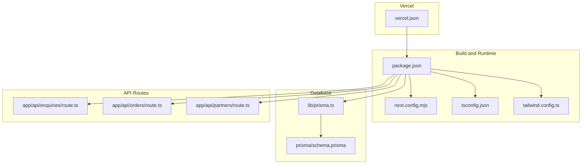
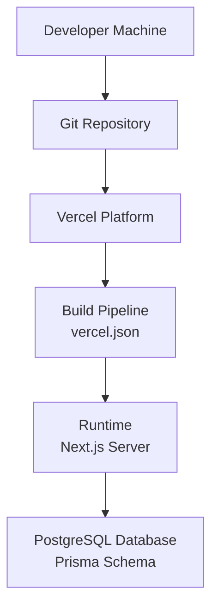
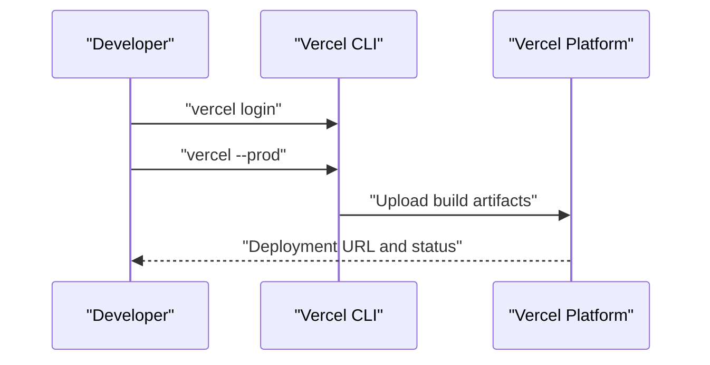
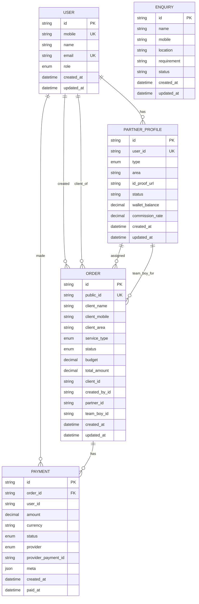
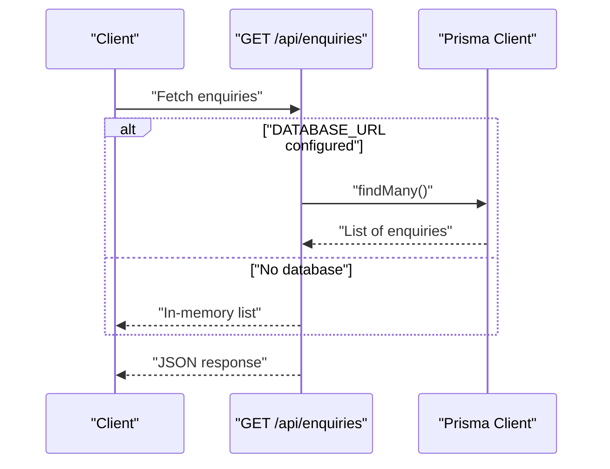
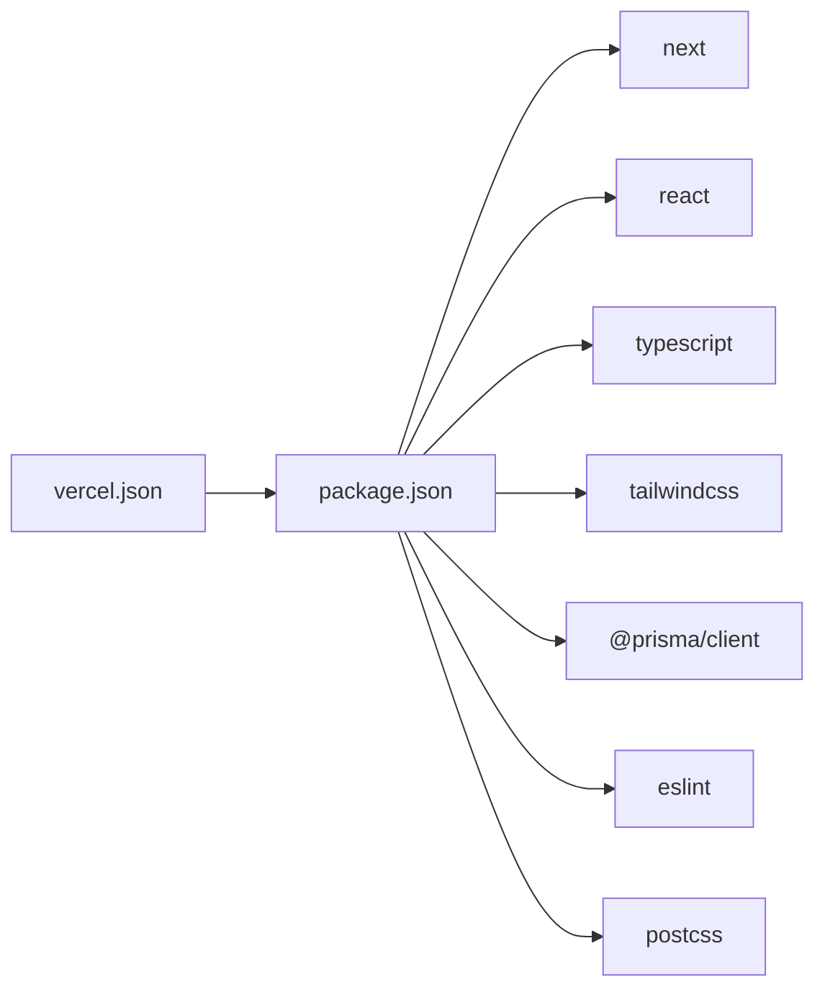

# Deployment Guide

<cite>
**Referenced Files in This Document**
- [DEPLOYMENT.md](file://DEPLOYMENT.md)
- [DEPLOYMENT_READY.md](file://DEPLOYMENT_READY.md)
- [vercel.json](file://vercel.json)
- [package.json](file://package.json)
- [next.config.mjs](file://next.config.mjs)
- [lib/prisma.ts](file://lib/prisma.ts)
- [prisma/schema.prisma](file://prisma/schema.prisma)
- [lib/notifications.ts](file://lib/notifications.ts)
- [tailwind.config.ts](file://tailwind.config.ts)
- [tsconfig.json](file://tsconfig.json)
- [app/api/enquiries/route.ts](file://app/api/enquiries/route.ts)
- [app/api/orders/route.ts](file://app/api/orders/route.ts)
- [app/api/partners/route.ts](file://app/api/partners/route.ts)
</cite>

## Table of Contents
1. [Introduction](#introduction)
2. [Project Structure](#project-structure)
3. [Core Components](#core-components)
4. [Architecture Overview](#architecture-overview)
5. [Detailed Component Analysis](#detailed-component-analysis)
6. [Dependency Analysis](#dependency-analysis)
7. [Performance Considerations](#performance-considerations)
8. [Troubleshooting Guide](#troubleshooting-guide)
9. [Conclusion](#conclusion)
10. [Appendices](#appendices)

## Introduction
This guide documents the complete deployment lifecycle for the Shree Shyam Agency Portal, covering local development, production builds, and Vercel deployment. It explains environment variable requirements, database connectivity, email notification hooks, and verification steps. It also provides troubleshooting guidance, rollback procedures, and recommendations for continuous deployment pipelines and automated testing.

## Project Structure
The project is a Next.js 14.2.5 application using the App Router, TypeScript, Tailwind CSS, and Prisma for database operations. Key deployment-relevant files include:
- Build and runtime scripts in package.json
- Vercel-specific configuration in vercel.json
- Next.js configuration in next.config.mjs
- Prisma client initialization and schema in lib/prisma.ts and prisma/schema.prisma
- Notification utilities in lib/notifications.ts
- Tailwind and TypeScript configuration files
- API routes under app/api handling partner applications, orders, and enquiries

**Diagram sources**
- [package.json:1-44](file://package.json#L1-L44)
- [next.config.mjs:1-14](file://next.config.mjs#L1-L14)
- [tsconfig.json:1-42](file://tsconfig.json#L1-L42)
- [tailwind.config.ts:1-31](file://tailwind.config.ts#L1-L31)
- [lib/prisma.ts:1-22](file://lib/prisma.ts#L1-L22)
- [prisma/schema.prisma:1-173](file://prisma/schema.prisma#L1-L173)
- [vercel.json:1-22](file://vercel.json#L1-L22)
- [app/api/enquiries/route.ts:1-111](file://app/api/enquiries/route.ts#L1-L111)
- [app/api/orders/route.ts:1-90](file://app/api/orders/route.ts#L1-L90)
- [app/api/partners/route.ts:1-117](file://app/api/partners/route.ts#L1-L117)

**Section sources**
- [package.json:1-44](file://package.json#L1-L44)
- [next.config.mjs:1-14](file://next.config.mjs#L1-L14)
- [tsconfig.json:1-42](file://tsconfig.json#L1-L42)
- [tailwind.config.ts:1-31](file://tailwind.config.ts#L1-L31)
- [lib/prisma.ts:1-22](file://lib/prisma.ts#L1-L22)
- [prisma/schema.prisma:1-173](file://prisma/schema.prisma#L1-L173)
- [vercel.json:1-22](file://vercel.json#L1-L22)
- [app/api/enquiries/route.ts:1-111](file://app/api/enquiries/route.ts#L1-L111)
- [app/api/orders/route.ts:1-90](file://app/api/orders/route.ts#L1-L90)
- [app/api/partners/route.ts:1-117](file://app/api/partners/route.ts#L1-L117)

## Core Components
- Build and runtime commands: Development, build, start, lint, and Prisma commands are defined in package.json.
- Next.js configuration: next.config.mjs sets strict mode and ensures no experimental appDir flag is present.
- Vercel configuration: vercel.json defines framework, build/install/dev commands, output directory, regions, function timeouts, and telemetry settings.
- Prisma client: lib/prisma.ts conditionally initializes Prisma only when DATABASE_URL is present, enabling graceful operation without a database during development.
- Notifications: lib/notifications.ts provides placeholders for email/SMS integrations and logs events to stdout.
- API routes: app/api endpoints handle partner applications, orders, and enquiries with validation and database integration via Prisma.

**Section sources**
- [package.json:5-12](file://package.json#L5-L12)
- [next.config.mjs:1-14](file://next.config.mjs#L1-L14)
- [vercel.json:1-22](file://vercel.json#L1-L22)
- [lib/prisma.ts:1-22](file://lib/prisma.ts#L1-L22)
- [lib/notifications.ts:1-28](file://lib/notifications.ts#L1-L28)
- [app/api/enquiries/route.ts:1-111](file://app/api/enquiries/route.ts#L1-L111)
- [app/api/orders/route.ts:1-90](file://app/api/orders/route.ts#L1-L90)
- [app/api/partners/route.ts:1-117](file://app/api/partners/route.ts#L1-L117)

## Architecture Overview
The deployment architecture centers on Next.js App Router pages and API routes, with optional Prisma-backed persistence. Vercel executes the build pipeline defined in vercel.json and serves the compiled output. Environment variables supply secrets and configuration.

**Diagram sources**
- [vercel.json:1-22](file://vercel.json#L1-L22)
- [package.json:5-12](file://package.json#L5-L12)
- [prisma/schema.prisma:5-8](file://prisma/schema.prisma#L5-L8)
- [lib/prisma.ts:1-22](file://lib/prisma.ts#L1-L22)

## Detailed Component Analysis

### Local Development Workflow
- Install dependencies and run the development server locally.
- Access the application at the development URL.
- Use linting to catch TypeScript issues before building.

**Section sources**
- [DEPLOYMENT.md:3-16](file://DEPLOYMENT.md#L3-L16)
- [package.json:5-12](file://package.json#L5-L12)

### Production Build and Start
- Build the application for production using the build script.
- Start the production server using the start script.
- Confirm build success and absence of TypeScript errors.

**Section sources**
- [DEPLOYMENT.md:17-28](file://DEPLOYMENT.md#L17-L28)
- [DEPLOYMENT_READY.md:118-128](file://DEPLOYMENT_READY.md#L118-L128)
- [package.json:5-12](file://package.json#L5-L12)

### Vercel Deployment Configuration
- Automatic deployment: Connect your repository to Vercel; pushes trigger builds.
- Manual deployment: Install the Vercel CLI globally, log in, and deploy to production.
- Vercel configuration includes framework detection, build/install/dev commands, output directory, region selection, function timeout limits, and telemetry disabling.

**Diagram sources**
- [DEPLOYMENT.md:36-50](file://DEPLOYMENT.md#L36-L50)
- [vercel.json:1-22](file://vercel.json#L1-L22)

**Section sources**
- [DEPLOYMENT.md:29-50](file://DEPLOYMENT.md#L29-L50)
- [vercel.json:1-22](file://vercel.json#L1-L22)

### Environment Variables for Production
Required environment variables for production:
- DATABASE_URL: Prisma connection string to PostgreSQL.
- NEXT_PUBLIC_APP_URL: The deployed application URL.
- Email service credentials: Configure email/SMS providers in notifications utilities.

Notes:
- The Prisma client is initialized only when DATABASE_URL is present.
- Notifications currently log to stdout; integrate with a real provider before production.

**Section sources**
- [DEPLOYMENT.md:52-58](file://DEPLOYMENT.md#L52-L58)
- [lib/prisma.ts:7-20](file://lib/prisma.ts#L7-L20)
- [lib/notifications.ts:1-28](file://lib/notifications.ts#L1-L28)

### Database Connectivity and Schema
- The Prisma schema defines enums, models, relations, and indexes for Users, Partners, Orders, Payments, Enquiries, and Recommendations.
- The Prisma client is conditionally created when DATABASE_URL is set.
- API routes interact with the database via Prisma for partner applications, orders, and enquiries.

**Diagram sources**
- [prisma/schema.prisma:57-158](file://prisma/schema.prisma#L57-L158)

**Section sources**
- [prisma/schema.prisma:1-173](file://prisma/schema.prisma#L1-L173)
- [lib/prisma.ts:1-22](file://lib/prisma.ts#L1-L22)
- [app/api/enquiries/route.ts:34-58](file://app/api/enquiries/route.ts#L34-L58)
- [app/api/orders/route.ts:56-66](file://app/api/orders/route.ts#L56-L66)
- [app/api/partners/route.ts:84-92](file://app/api/partners/route.ts#L84-L92)

### API Routes and Data Flow
- Enquiries endpoint: Accepts POST with validation and stores data either in the database (when connected) or in-memory. Supports GET to list enquiries.
- Orders endpoint: Accepts POST with service type validation and generates a public ID; supports GET to list orders.
- Partners endpoint: Accepts POST with mobile and type validation, creates or updates a user and partner profile, and returns success messages.

**Diagram sources**
- [app/api/enquiries/route.ts:84-110](file://app/api/enquiries/route.ts#L84-L110)
- [lib/prisma.ts:11-16](file://lib/prisma.ts#L11-L16)

**Section sources**
- [app/api/enquiries/route.ts:1-111](file://app/api/enquiries/route.ts#L1-L111)
- [app/api/orders/route.ts:1-90](file://app/api/orders/route.ts#L1-L90)
- [app/api/partners/route.ts:1-117](file://app/api/partners/route.ts#L1-L117)

### Verification Steps After Deployment
- Confirm build succeeded without TypeScript errors.
- Validate API endpoints return expected responses.
- Test form submissions on live pages.
- Ensure environment variables are set in Vercel project settings.

**Section sources**
- [DEPLOYMENT_READY.md:10-16](file://DEPLOYMENT_READY.md#L10-L16)
- [DEPLOYMENT_READY.md:43-92](file://DEPLOYMENT_READY.md#L43-L92)
- [DEPLOYMENT_READY.md:181-193](file://DEPLOYMENT_READY.md#L181-L193)

## Dependency Analysis
- Build-time dependencies: Next.js, React, TypeScript, Tailwind CSS, Prisma, ESLint, PostCSS, autoprefixer, and related types.
- Runtime dependencies: Next.js, React, @prisma/client, axios, bcryptjs, jsonwebtoken, next-i18next, next-themes, react-hook-form, zod, and headless UI components.
- Vercel-specific build configuration ties the framework and commands to the repository.

**Diagram sources**
- [package.json:13-42](file://package.json#L13-L42)
- [vercel.json:1-22](file://vercel.json#L1-L22)

**Section sources**
- [package.json:13-42](file://package.json#L13-L42)
- [vercel.json:1-22](file://vercel.json#L1-L22)

## Performance Considerations
- Build optimization: The project targets Next.js 14.2.5 with App Router and Tailwind CSS; ensure Tailwind content paths are accurate to avoid unnecessary CSS.
- Function timeouts: Vercel function max duration is set to 30 seconds for API routes.
- Telemetry: Build telemetry is disabled in vercel.json to reduce noise and improve build determinism.
- Static generation: The project generates static pages; ensure API routes remain serverless and efficient.

**Section sources**
- [tailwind.config.ts:4-7](file://tailwind.config.ts#L4-L7)
- [vercel.json:8-20](file://vercel.json#L8-L20)
- [DEPLOYMENT_READY.md:155-159](file://DEPLOYMENT_READY.md#L155-L159)

## Troubleshooting Guide
Common issues and resolutions:
- Build failures:
  - Run lint to identify TypeScript errors.
  - Ensure all dependencies are installed.
  - Verify environment variables (DATABASE_URL, NEXT_PUBLIC_APP_URL).
  - Confirm database connectivity if Prisma is enabled.
- API route errors:
  - Validate request payloads and required fields.
  - Check Prisma client initialization and database availability.
- Vercel deployment errors:
  - Confirm vercel.json matches repository commands and output directory.
  - Review build logs for missing environment variables or telemetry-related warnings.

Rollback procedures:
- Revert to the previous commit or tag.
- Redeploy the prior working version.
- If database migrations were applied, roll back migrations accordingly.

Automated testing in deployment workflows:
- Add a CI job to run the build script and lint checks.
- Optionally run tests against API endpoints after deployment.
- Integrate database migration checks in CI before deploying.

**Section sources**
- [DEPLOYMENT.md:72-79](file://DEPLOYMENT.md#L72-L79)
- [DEPLOYMENT_READY.md:161-180](file://DEPLOYMENT_READY.md#L161-L180)
- [vercel.json:1-22](file://vercel.json#L1-L22)
- [lib/prisma.ts:7-20](file://lib/prisma.ts#L7-L20)

## Conclusion
The Shree Shyam Agency Portal is production-ready with a streamlined deployment process. Local development, production builds, and Vercel deployments are supported by well-defined scripts and configuration. Ensure environment variables are set, integrate email/SMS providers, and leverage CI/CD for automated testing and safe rollbacks.

## Appendices

### Step-by-Step Deployment Checklist
- Local development: Install dependencies, run dev server, verify pages and forms.
- Build and start: Run build, confirm success, then start production server.
- Vercel deployment: Connect repository, configure environment variables, and deploy.
- Verification: Test API endpoints, form submissions, and responsive design.

**Section sources**
- [DEPLOYMENT.md:3-28](file://DEPLOYMENT.md#L3-L28)
- [DEPLOYMENT_READY.md:110-128](file://DEPLOYMENT_READY.md#L110-L128)
- [DEPLOYMENT_READY.md:161-180](file://DEPLOYMENT_READY.md#L161-L180)