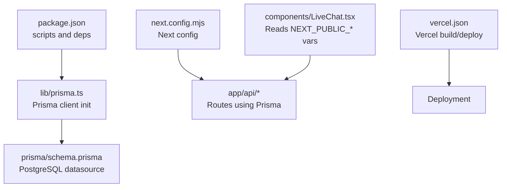
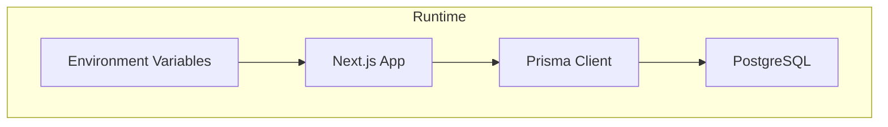
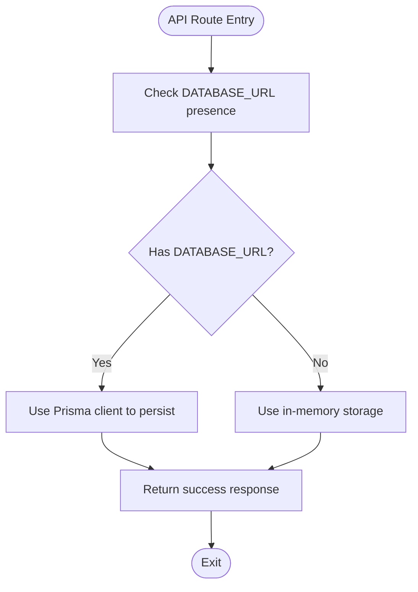
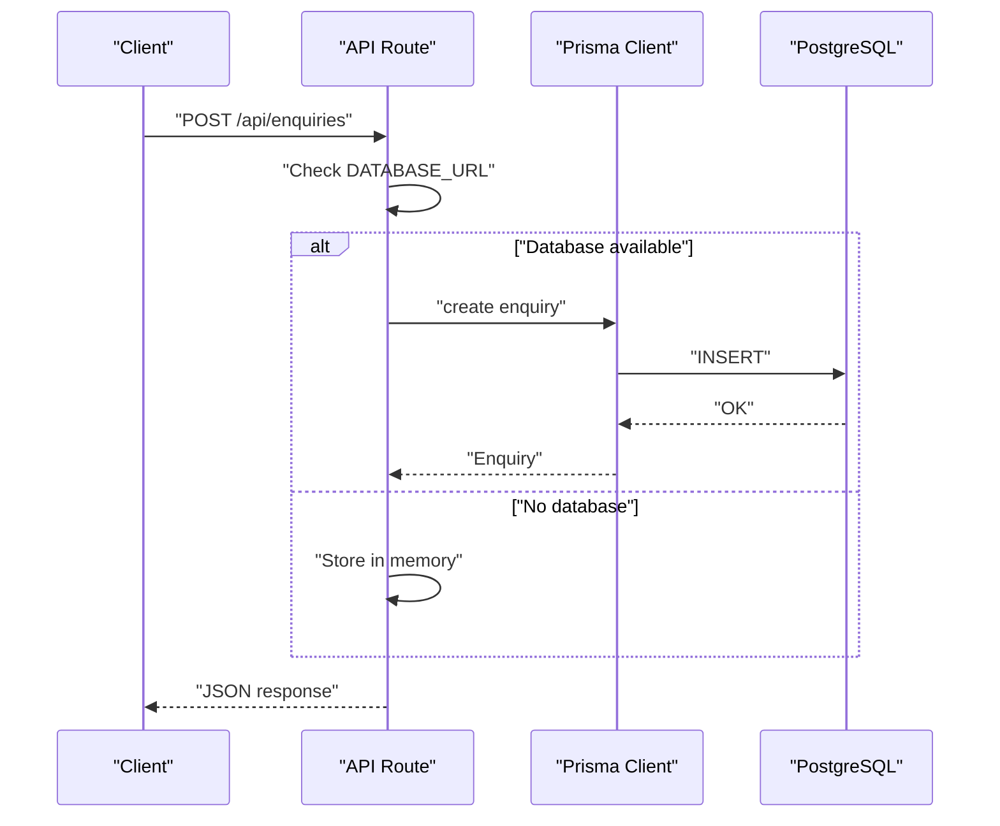
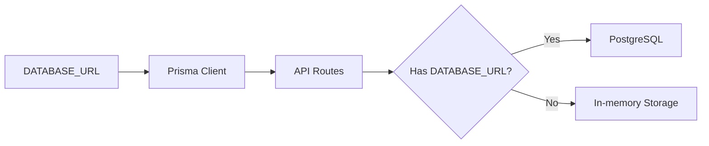

# Environment Setup

<cite>
**Referenced Files in This Document**
- [package.json](file://package.json)
- [lib/prisma.ts](file://lib/prisma.ts)
- [prisma/schema.prisma](file://prisma/schema.prisma)
- [next.config.mjs](file://next.config.mjs)
- [vercel.json](file://vercel.json)
- [DEPLOYMENT.md](file://DEPLOYMENT.md)
- [app/api/enquiries/route.ts](file://app/api/enquiries/route.ts)
- [app/api/orders/route.ts](file://app/api/orders/route.ts)
- [app/api/partners/route.ts](file://app/api/partners/route.ts)
- [app/api/payments/create/route.ts](file://app/api/payments/create/route.ts)
- [components/LiveChat.tsx](file://components/LiveChat.tsx)
</cite>

## Table of Contents
1. [Introduction](#introduction)
2. [Project Structure](#project-structure)
3. [Core Components](#core-components)
4. [Architecture Overview](#architecture-overview)
5. [Detailed Component Analysis](#detailed-component-analysis)
6. [Dependency Analysis](#dependency-analysis)
7. [Performance Considerations](#performance-considerations)
8. [Troubleshooting Guide](#troubleshooting-guide)
9. [Conclusion](#conclusion)
10. [Appendices](#appendices)

## Introduction
This document provides a comprehensive guide to setting up the environment for the Shree Shyam Agency Portal. It covers system requirements, environment variable configuration across development, staging, and production, database setup with PostgreSQL and Prisma, connection handling, optional CDN and image optimization, SSL considerations, performance tuning, local development, containerization options, and security practices for environment variables and secrets.

## Project Structure
The project is a Next.js 14 application using TypeScript, Prisma for database access, and a Postgres database. Key configuration and runtime files include:
- Package and dependency management
- Prisma schema and client initialization
- Next.js configuration
- Platform-specific deployment configuration
- API routes that conditionally use the database via environment variables
- Optional third-party chat integrations that read from environment variables

**Diagram sources**
- [package.json:1-44](file://package.json#L1-L44)
- [lib/prisma.ts:1-22](file://lib/prisma.ts#L1-L22)
- [prisma/schema.prisma:1-173](file://prisma/schema.prisma#L1-L173)
- [next.config.mjs:1-14](file://next.config.mjs#L1-L14)
- [vercel.json:1-22](file://vercel.json#L1-L22)
- [components/LiveChat.tsx:1-52](file://components/LiveChat.tsx#L1-L52)

**Section sources**
- [package.json:1-44](file://package.json#L1-L44)
- [next.config.mjs:1-14](file://next.config.mjs#L1-L14)
- [vercel.json:1-22](file://vercel.json#L1-L22)

## Core Components
- Node.js and package manager: The project requires Node.js 18+ and npm. Scripts define development, build, and start commands, plus Prisma tasks.
- Prisma client: Initialized in a singleton-like pattern and only created when a database URL is present. In non-production environments, the client is cached globally to avoid reconnects during hot reload.
- Next.js configuration: Strict mode enabled, empty image remote patterns and domains arrays, and no experimental appDir flag.
- Vercel configuration: Defines build command, output directory, dev command, install command, framework, region, function max duration, and telemetry disable.

**Section sources**
- [package.json:5-12](file://package.json#L5-L12)
- [lib/prisma.ts:1-22](file://lib/prisma.ts#L1-L22)
- [next.config.mjs:1-14](file://next.config.mjs#L1-L14)
- [vercel.json:1-22](file://vercel.json#L1-L22)

## Architecture Overview
The environment setup centers around:
- Environment variables controlling database connectivity and feature toggles
- Conditional logic in API routes to either use Prisma-backed persistence or in-memory fallbacks
- Prisma schema defining the PostgreSQL provider and data model
- Next.js runtime configuration and Vercel deployment configuration

**Diagram sources**
- [lib/prisma.ts:7-20](file://lib/prisma.ts#L7-L20)
- [prisma/schema.prisma:5-8](file://prisma/schema.prisma#L5-L8)
- [app/api/enquiries/route.ts:6](file://app/api/enquiries/route.ts#L6)
- [app/api/orders/route.ts:8](file://app/api/orders/route.ts#L8)
- [app/api/partners/route.ts:8](file://app/api/partners/route.ts#L8)

## Detailed Component Analysis

### System Requirements
- Node.js: 18+ (as indicated by the deployment guide)
- Package manager: npm or yarn
- Database: PostgreSQL (required for full functionality; Prisma is configured for PostgreSQL)
- Additional tooling: Prisma CLI for generating clients and migrations

Notes:
- The deployment guide explicitly lists Node.js 18+, npm/yarn, and PostgreSQL as build requirements.
- The project’s package.json includes Prisma and the Prisma client.

**Section sources**
- [DEPLOYMENT.md:61-63](file://DEPLOYMENT.md#L61-L63)
- [package.json:13-28](file://package.json#L13-L28)
- [package.json:39](file://package.json#L39)

### Environment Variable Configuration
Key environment variables observed in the codebase:
- DATABASE_URL: Required by Prisma to connect to PostgreSQL. The Prisma client is created only when this variable is present.
- NEXT_PUBLIC_APP_URL: Used in production deployments to specify the application URL.
- NEXT_PUBLIC_TAWK_PROPERTY_ID, NEXT_PUBLIC_TAWK_WIDGET_ID: Used by the LiveChat component for Tawk.to integration.
- NEXT_PUBLIC_CRISP_WEBSITE_ID: Used by the LiveChat component for Crisp integration.

Recommended environments:
- Development: Set DATABASE_URL locally; leave NEXT_PUBLIC_APP_URL unset or set to localhost; configure chat provider variables if integrating live chat.
- Staging: Mirror production variables but with staging endpoints; ensure DATABASE_URL points to a staging database.
- Production: Provide DATABASE_URL pointing to a secure, managed PostgreSQL instance; set NEXT_PUBLIC_APP_URL to the production domain; configure chat provider variables for the live site.

Security considerations:
- Keep DATABASE_URL secret and never commit it to version control.
- Store API keys and secrets in platform-provided secret managers or environment variable stores.
- Avoid logging sensitive values.

**Section sources**
- [lib/prisma.ts:8](file://lib/prisma.ts#L8)
- [prisma/schema.prisma:7](file://prisma/schema.prisma#L7)
- [DEPLOYMENT.md:54-57](file://DEPLOYMENT.md#L54-L57)
- [components/LiveChat.tsx:17](file://components/LiveChat.tsx#L17)
- [components/LiveChat.tsx:33](file://components/LiveChat.tsx#L33)

### Database Connection Setup and Prisma Configuration
- Provider and URL: The Prisma datasource uses PostgreSQL and reads the URL from DATABASE_URL.
- Client creation: The Prisma client is created only if DATABASE_URL is present. In non-production environments, the client is cached globally to prevent multiple instances.
- Conditional API usage: API routes check for the presence of DATABASE_URL and either persist to the database via Prisma or fall back to in-memory storage.

**Diagram sources**
- [lib/prisma.ts:8](file://lib/prisma.ts#L8)
- [app/api/enquiries/route.ts:6](file://app/api/enquiries/route.ts#L6)
- [app/api/orders/route.ts:8](file://app/api/orders/route.ts#L8)
- [app/api/partners/route.ts:8](file://app/api/partners/route.ts#L8)

**Section sources**
- [prisma/schema.prisma:5-8](file://prisma/schema.prisma#L5-L8)
- [lib/prisma.ts:11-20](file://lib/prisma.ts#L11-L20)
- [app/api/enquiries/route.ts:34-58](file://app/api/enquiries/route.ts#L34-L58)
- [app/api/orders/route.ts:69-105](file://app/api/orders/route.ts#L69-L105)
- [app/api/partners/route.ts:78-149](file://app/api/partners/route.ts#L78-L149)

### Connection Pooling
- The Prisma client is initialized without explicit pool configuration in this codebase. Defaults apply.
- For production workloads, consider configuring Prisma’s client options (e.g., pool timeouts, max connections) via environment variables or client initialization parameters supported by the Prisma client. Consult Prisma documentation for advanced pool settings.

[No sources needed since this section provides general guidance]

### SSL Certificate Setup
- The repository does not include SSL configuration files. SSL termination is typically handled by the hosting platform (e.g., Vercel-managed HTTPS) or a reverse proxy/load balancer.
- Ensure HTTPS is enforced in production and that cookies are marked secure when applicable.

[No sources needed since this section provides general guidance]

### CDN and Image Optimization
- The Next.js configuration sets empty arrays for remote patterns and domains, disabling automatic optimization for external images.
- To enable optimized images from CDNs, populate the remotePatterns or domains arrays with trusted origins.

**Section sources**
- [next.config.mjs:4-7](file://next.config.mjs#L4-L7)

### Live Chat Integrations and Public Variables
- The LiveChat component conditionally loads Tawk.to or Crisp scripts based on NEXT_PUBLIC_* variables.
- Ensure these variables are set per environment and match the provider’s configuration.

**Section sources**
- [components/LiveChat.tsx:17](file://components/LiveChat.tsx#L17)
- [components/LiveChat.tsx:33](file://components/LiveChat.tsx#L33)

### API Routes and Environment Awareness
- Enquiries, Orders, Partners, and Payments APIs check DATABASE_URL to decide between database persistence and in-memory storage.
- Payments create endpoint initializes a payment record and returns a placeholder gateway URL for integration.

**Diagram sources**
- [app/api/enquiries/route.ts:9-81](file://app/api/enquiries/route.ts#L9-L81)
- [lib/prisma.ts:11-16](file://lib/prisma.ts#L11-L16)

**Section sources**
- [app/api/enquiries/route.ts:6-81](file://app/api/enquiries/route.ts#L6-L81)
- [app/api/orders/route.ts:8-127](file://app/api/orders/route.ts#L8-L127)
- [app/api/partners/route.ts:8-172](file://app/api/partners/route.ts#L8-L172)
- [app/api/payments/create/route.ts:6-44](file://app/api/payments/create/route.ts#L6-L44)

### Local Development Environment Setup
- Install dependencies using npm.
- Start the development server.
- Configure environment variables locally:
  - DATABASE_URL for database connectivity
  - NEXT_PUBLIC_APP_URL for production-like behavior
  - NEXT_PUBLIC_TAWK_* or NEXT_PUBLIC_CRISP_* for live chat
- The deployment guide provides step-by-step instructions for local development.

**Section sources**
- [DEPLOYMENT.md:3-16](file://DEPLOYMENT.md#L3-L16)
- [package.json:5-12](file://package.json#L5-L12)

### Docker Containerization Options
- The repository does not include Docker configuration files.
- Typical approach:
  - Use an official Node.js base image (18+)
  - Install dependencies
  - Build the Next.js app
  - Run the production server
  - Expose port 3000
  - Mount a volume for persistent data if needed (e.g., logs)
- Ensure DATABASE_URL is passed as an environment variable at runtime.

[No sources needed since this section provides general guidance]

### Cloud Platform Configurations
- Vercel:
  - Build command, output directory, dev command, and install command are defined.
  - Functions max duration is set for serverless functions.
  - Telemetry is disabled in builds.
- Ensure environment variables are configured in Vercel’s project settings for each environment (preview, production).

**Section sources**
- [vercel.json:2-21](file://vercel.json#L2-L21)

## Dependency Analysis
- The Prisma client is lazily initialized and reused in non-production environments to reduce overhead.
- API routes depend on the presence of DATABASE_URL to switch between database and in-memory modes.
- Next.js configuration affects image optimization and strict mode behavior.

**Diagram sources**
- [lib/prisma.ts:8](file://lib/prisma.ts#L8)
- [app/api/enquiries/route.ts:6](file://app/api/enquiries/route.ts#L6)
- [app/api/orders/route.ts:8](file://app/api/orders/route.ts#L8)
- [app/api/partners/route.ts:8](file://app/api/partners/route.ts#L8)

**Section sources**
- [lib/prisma.ts:11-20](file://lib/prisma.ts#L11-L20)
- [app/api/enquiries/route.ts:6](file://app/api/enquiries/route.ts#L6)
- [app/api/orders/route.ts:8](file://app/api/orders/route.ts#L8)
- [app/api/partners/route.ts:8](file://app/api/partners/route.ts#L8)

## Performance Considerations
- Image optimization: Configure remotePatterns or domains in Next.js to enable optimized image delivery from CDNs.
- Function timeout: Vercel function max duration is set to 30 seconds; keep API logic efficient.
- Prisma client reuse: The singleton-like initialization avoids repeated client creation in development.
- Disable telemetry in builds to reduce overhead.

**Section sources**
- [next.config.mjs:4-7](file://next.config.mjs#L4-L7)
- [vercel.json:10-15](file://vercel.json#L10-L15)
- [lib/prisma.ts:18-20](file://lib/prisma.ts#L18-L20)
- [vercel.json:18](file://vercel.json#L18)

## Troubleshooting Guide
Common issues and resolutions:
- Build failures:
  - Run lint to check for TypeScript errors.
  - Ensure all dependencies are installed.
  - Verify environment variables (especially DATABASE_URL).
  - Confirm database connectivity if Prisma is enabled.
- Missing database:
  - If DATABASE_URL is not set, API routes will use in-memory storage. This is expected for local development without a database.
- Live chat not loading:
  - Ensure NEXT_PUBLIC_TAWK_* or NEXT_PUBLIC_CRISP_* variables are set appropriately for the selected provider.

**Section sources**
- [DEPLOYMENT.md:74-79](file://DEPLOYMENT.md#L74-L79)
- [app/api/enquiries/route.ts:6](file://app/api/enquiries/route.ts#L6)
- [components/LiveChat.tsx:17](file://components/LiveChat.tsx#L17)
- [components/LiveChat.tsx:33](file://components/LiveChat.tsx#L33)

## Conclusion
The Shree Shyam Agency Portal is designed to operate in both database-enabled and database-disabled modes, controlled by the DATABASE_URL environment variable. For production, ensure a secure PostgreSQL instance, properly configured environment variables, and platform-specific deployment settings. Follow the security recommendations for secrets and environment variables, and leverage platform features (like Vercel) to streamline builds and deployments.

## Appendices

### Environment Variables Reference
- DATABASE_URL: PostgreSQL connection string for Prisma
- NEXT_PUBLIC_APP_URL: Application URL for production
- NEXT_PUBLIC_TAWK_PROPERTY_ID, NEXT_PUBLIC_TAWK_WIDGET_ID: Tawk.to integration identifiers
- NEXT_PUBLIC_CRISP_WEBSITE_ID: Crisp integration identifier

**Section sources**
- [DEPLOYMENT.md:54-57](file://DEPLOYMENT.md#L54-L57)
- [components/LiveChat.tsx:17](file://components/LiveChat.tsx#L17)
- [components/LiveChat.tsx:33](file://components/LiveChat.tsx#L33)