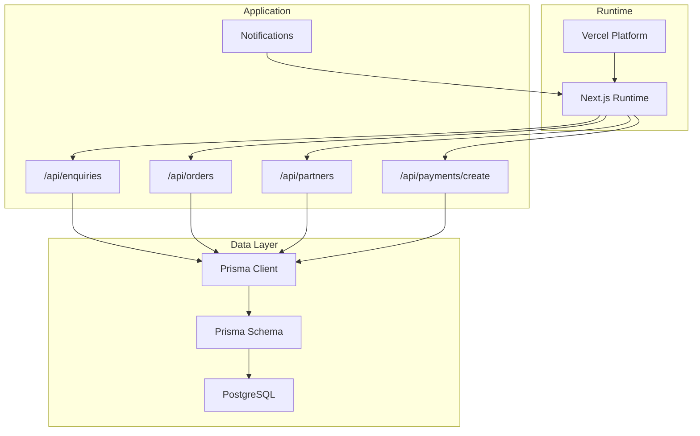
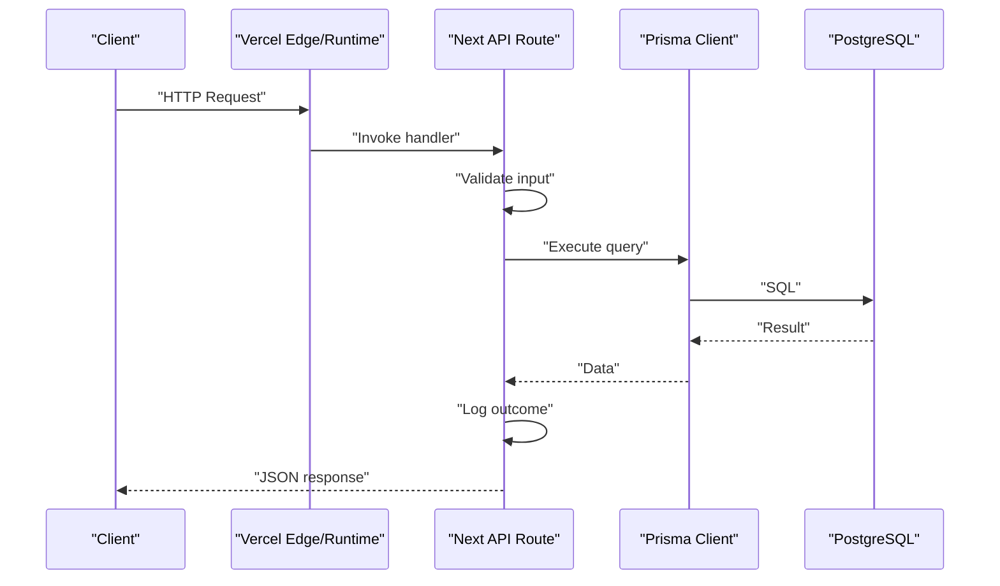
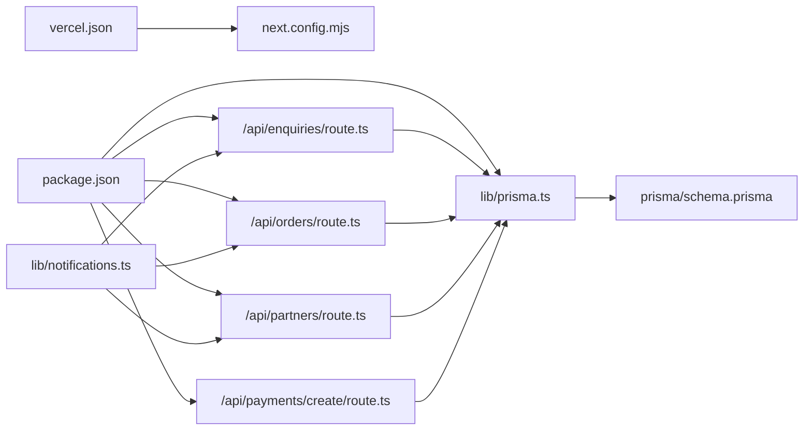
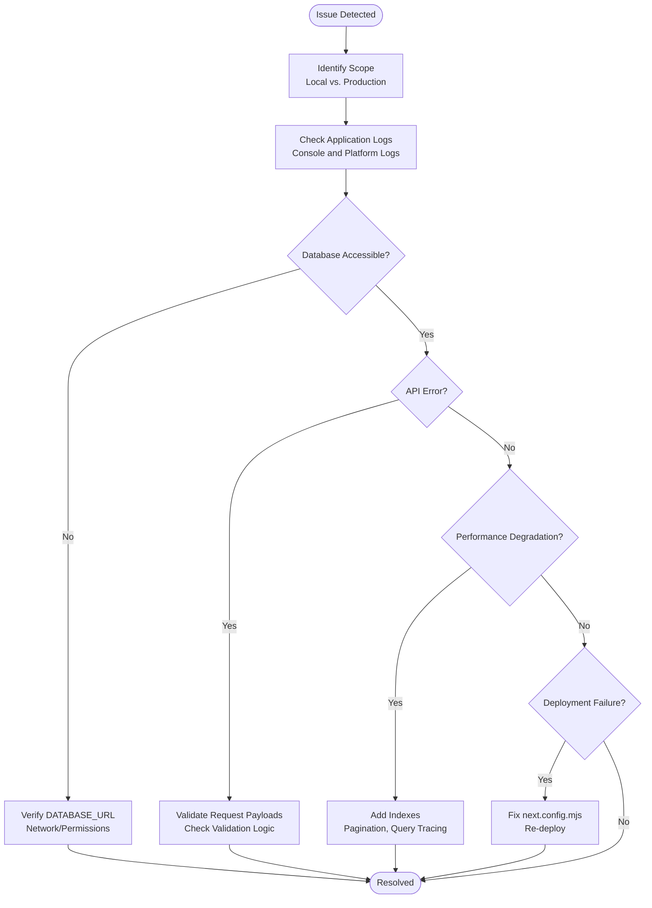

# Monitoring & Maintenance

<cite>
**Referenced Files in This Document**
- [package.json](file://package.json)
- [next.config.mjs](file://next.config.mjs)
- [vercel.json](file://vercel.json)
- [lib/prisma.ts](file://lib/prisma.ts)
- [prisma/schema.prisma](file://prisma/schema.prisma)
- [lib/notifications.ts](file://lib/notifications.ts)
- [app/api/enquiries/route.ts](file://app/api/enquiries/route.ts)
- [app/api/orders/route.ts](file://app/api/orders/route.ts)
- [app/api/partners/route.ts](file://app/api/partners/route.ts)
- [app/api/payments/create/route.ts](file://app/api/payments/create/route.ts)
- [DEPLOYMENT.md](file://DEPLOYMENT.md)
- [DEPLOYMENT_READY.md](file://DEPLOYMENT_READY.md)
- [FINAL_DEPLOYMENT_FIX.md](file://FINAL_DEPLOYMENT_FIX.md)
- [BACKEND_SYSTEMS_FIXED.md](file://BACKEND_SYSTEMS_FIXED.md)
</cite>

## Table of Contents
1. [Introduction](#introduction)
2. [Project Structure](#project-structure)
3. [Core Components](#core-components)
4. [Architecture Overview](#architecture-overview)
5. [Detailed Component Analysis](#detailed-component-analysis)
6. [Dependency Analysis](#dependency-analysis)
7. [Performance Considerations](#performance-considerations)
8. [Troubleshooting Guide](#troubleshooting-guide)
9. [Conclusion](#conclusion)
10. [Appendices](#appendices)

## Introduction
This document provides comprehensive monitoring and maintenance guidance for the Shree Shyam Agency Portal. It covers application monitoring, database monitoring, performance metrics, error tracking, health checks, maintenance procedures (backups, logs, updates), troubleshooting, alerting/notification mechanisms, incident response, preventive maintenance, security audits, and system optimization. The guidance is grounded in the repository’s current configuration and codebase.

## Project Structure
The portal is a Next.js 14 application using TypeScript, Prisma for data modeling, and serverless API routes. Deployment is configured for Vercel with environment-specific settings and function timeouts. The database is Postgres via Prisma, with a schema defining core entities and enums.

**Diagram sources**
- [vercel.json:1-22](file://vercel.json#L1-L22)
- [lib/prisma.ts:1-22](file://lib/prisma.ts#L1-L22)
- [prisma/schema.prisma:1-173](file://prisma/schema.prisma#L1-L173)
- [app/api/enquiries/route.ts:1-111](file://app/api/enquiries/route.ts#L1-L111)
- [app/api/orders/route.ts:1-129](file://app/api/orders/route.ts#L1-L129)
- [app/api/partners/route.ts:1-174](file://app/api/partners/route.ts#L1-L174)
- [app/api/payments/create/route.ts:1-46](file://app/api/payments/create/route.ts#L1-L46)
- [lib/notifications.ts:1-28](file://lib/notifications.ts#L1-L28)

**Section sources**
- [vercel.json:1-22](file://vercel.json#L1-L22)
- [next.config.mjs:1-14](file://next.config.mjs#L1-L14)
- [lib/prisma.ts:1-22](file://lib/prisma.ts#L1-L22)
- [prisma/schema.prisma:1-173](file://prisma/schema.prisma#L1-L173)

## Core Components
- Database client and logging: Prisma client is conditionally initialized when DATABASE_URL is present, with error/warn logging enabled. This is the central data access point.
- API routes: Five serverless API routes handle enquiries, orders, partners, and payments. They include validation, error handling, and logging.
- Notifications: A centralized notifications module logs events to stdout; intended for future integration with email/SMS providers.
- Deployment configuration: Vercel settings define build commands, output directory, regions, function max duration, and telemetry preferences.

Key responsibilities:
- Data persistence and queries via Prisma
- Request validation and error responses in API routes
- Logging for observability during development and early production
- Serverless runtime configuration for Vercel

**Section sources**
- [lib/prisma.ts:1-22](file://lib/prisma.ts#L1-L22)
- [app/api/enquiries/route.ts:1-111](file://app/api/enquiries/route.ts#L1-L111)
- [app/api/orders/route.ts:1-129](file://app/api/orders/route.ts#L1-L129)
- [app/api/partners/route.ts:1-174](file://app/api/partners/route.ts#L1-L174)
- [app/api/payments/create/route.ts:1-46](file://app/api/payments/create/route.ts#L1-L46)
- [lib/notifications.ts:1-28](file://lib/notifications.ts#L1-L28)
- [vercel.json:1-22](file://vercel.json#L1-L22)

## Architecture Overview
The system follows a serverless architecture on Vercel with Next.js API routes. Data access is handled by Prisma Client against a PostgreSQL database. Notifications are currently logged and designed to integrate with external providers.

**Diagram sources**
- [vercel.json:1-22](file://vercel.json#L1-L22)
- [app/api/enquiries/route.ts:1-111](file://app/api/enquiries/route.ts#L1-L111)
- [app/api/orders/route.ts:1-129](file://app/api/orders/route.ts#L1-L129)
- [app/api/partners/route.ts:1-174](file://app/api/partners/route.ts#L1-L174)
- [app/api/payments/create/route.ts:1-46](file://app/api/payments/create/route.ts#L1-L46)
- [lib/prisma.ts:1-22](file://lib/prisma.ts#L1-L22)
- [prisma/schema.prisma:1-173](file://prisma/schema.prisma#L1-L173)

## Detailed Component Analysis

### Database Monitoring and Connection Pool Management
Current state:
- Prisma client is created with error/warn logging enabled and is reused globally in non-production environments.
- DATABASE_URL controls whether the client is initialized; absence of the variable disables database-dependent features.
- The schema defines enums and relations but does not specify custom connection pool settings.

Recommendations:
- Enable Prisma query logging in staging/production to capture slow queries and errors.
- Configure Prisma connection pool settings (e.g., max connections, idle timeout) via environment variables if supported by your hosting platform.
- Monitor database metrics externally (e.g., Vercel Postgres metrics if applicable) and set up alerts for high latency, connection exhaustion, or query timeouts.

Operational actions:
- Ensure DATABASE_URL is set in production.
- Rotate secrets and review connection limits periodically.
- Back up the database regularly and test restore procedures.

**Section sources**
- [lib/prisma.ts:1-22](file://lib/prisma.ts#L1-L22)
- [prisma/schema.prisma:1-173](file://prisma/schema.prisma#L1-L173)
- [DEPLOYMENT.md:52-63](file://DEPLOYMENT.md#L52-L63)

### Query Performance Optimization
Observations:
- API routes perform straightforward CRUD operations with minimal joins.
- Indexes are defined on mobile and status fields for enquiries.

Optimization opportunities:
- Add indexes for frequently filtered/sorted fields (e.g., Order.clientId, Order.partnerId, Payment.orderId).
- Use Prisma’s query tracing and database logs to identify slow queries.
- Paginate large lists (e.g., orders/enquiries) to reduce payload sizes and improve responsiveness.

**Section sources**
- [prisma/schema.prisma:156-158](file://prisma/schema.prisma#L156-L158)
- [app/api/enquiries/route.ts:90-96](file://app/api/enquiries/route.ts#L90-L96)
- [app/api/orders/route.ts:15-26](file://app/api/orders/route.ts#L15-L26)

### Health Checks and Readiness
Current health indicators:
- GET endpoints for enquiries and orders return data, indicating basic readiness.
- Logging statements confirm successful processing.

Recommended health endpoints:
- Add explicit health checks returning application and database connectivity status.
- Expose a /metrics endpoint (if supported) or integrate with platform-native metrics.

**Section sources**
- [app/api/enquiries/route.ts:84-110](file://app/api/enquiries/route.ts#L84-L110)
- [app/api/orders/route.ts:10-36](file://app/api/orders/route.ts#L10-L36)

### Error Tracking and Logging
Current logging:
- API routes log errors and outcomes to stdout.
- Notifications module logs events to stdout for future provider integration.

Enhancements:
- Integrate structured logging with severity levels.
- Forward logs to a centralized logging service (e.g., Vercel Logs, external SIEM).
- Add correlation IDs to trace requests across API boundaries.

**Section sources**
- [app/api/enquiries/route.ts:74-80](file://app/api/enquiries/route.ts#L74-L80)
- [app/api/orders/route.ts:29-35](file://app/api/orders/route.ts#L29-L35)
- [app/api/partners/route.ts:34-40](file://app/api/partners/route.ts#L34-L40)
- [app/api/payments/create/route.ts:165-171](file://app/api/payments/create/route.ts#L165-L171)
- [lib/notifications.ts:10-26](file://lib/notifications.ts#L10-L26)

### Maintenance Procedures
- Database backups: Schedule automated backups and validate restoration procedures.
- Log rotation: Configure platform log retention policies; archive logs externally if needed.
- System updates: Keep Next.js, Prisma, and dependencies updated; test builds before deploying.

**Section sources**
- [DEPLOYMENT.md:1-79](file://DEPLOYMENT.md#L1-L79)
- [DEPLOYMENT_READY.md:110-128](file://DEPLOYMENT_READY.md#L110-L128)

### Alerting Mechanisms and Notification Systems
Current state:
- Notifications module logs events to stdout and is marked for integration with email/SMS providers.
- Vercel-managed deployments provide basic deployment logs.

Recommendations:
- Integrate email/SMS providers via the notifications module.
- Set up platform alerts for deployment failures, high error rates, and latency thresholds.
- Define SLOs and configure alert channels (email, Slack, PagerDuty).

**Section sources**
- [lib/notifications.ts:1-28](file://lib/notifications.ts#L1-L28)
- [vercel.json:1-22](file://vercel.json#L1-L22)

### Incident Response Protocols
- Isolate incidents by environment (local vs. production).
- Use logs and health checks to triage issues quickly.
- Roll back recent changes if correlated with outages.
- Communicate with stakeholders using predefined escalation paths.

[No sources needed since this section provides general guidance]

### Preventive Maintenance and Security Audits
- Conduct periodic dependency audits and update vulnerable packages.
- Review and rotate secrets (DATABASE_URL, third-party keys).
- Audit database permissions and network access.
- Perform load tests and capacity planning.

**Section sources**
- [package.json:1-44](file://package.json#L1-L44)
- [DEPLOYMENT.md:52-63](file://DEPLOYMENT.md#L52-L63)

## Dependency Analysis
The application depends on Next.js, Prisma, and PostgreSQL. API routes depend on Prisma for data operations. Notifications are decoupled and designed for future integrations.

**Diagram sources**
- [package.json:1-44](file://package.json#L1-L44)
- [next.config.mjs:1-14](file://next.config.mjs#L1-L14)
- [vercel.json:1-22](file://vercel.json#L1-L22)
- [lib/prisma.ts:1-22](file://lib/prisma.ts#L1-L22)
- [prisma/schema.prisma:1-173](file://prisma/schema.prisma#L1-L173)
- [app/api/enquiries/route.ts:1-111](file://app/api/enquiries/route.ts#L1-L111)
- [app/api/orders/route.ts:1-129](file://app/api/orders/route.ts#L1-L129)
- [app/api/partners/route.ts:1-174](file://app/api/partners/route.ts#L1-L174)
- [app/api/payments/create/route.ts:1-46](file://app/api/payments/create/route.ts#L1-L46)
- [lib/notifications.ts:1-28](file://lib/notifications.ts#L1-L28)

**Section sources**
- [package.json:1-44](file://package.json#L1-L44)
- [lib/prisma.ts:1-22](file://lib/prisma.ts#L1-L22)
- [prisma/schema.prisma:1-173](file://prisma/schema.prisma#L1-L173)
- [app/api/enquiries/route.ts:1-111](file://app/api/enquiries/route.ts#L1-L111)
- [app/api/orders/route.ts:1-129](file://app/api/orders/route.ts#L1-L129)
- [app/api/partners/route.ts:1-174](file://app/api/partners/route.ts#L1-L174)
- [app/api/payments/create/route.ts:1-46](file://app/api/payments/create/route.ts#L1-L46)
- [lib/notifications.ts:1-28](file://lib/notifications.ts#L1-L28)
- [vercel.json:1-22](file://vercel.json#L1-L22)

## Performance Considerations
- Function timeouts: Vercel sets maxDuration for API routes; keep handlers efficient and avoid long-running operations.
- Build and runtime optimization: Use Next.js optimizations and ensure minimal bundle sizes.
- Database performance: Add indexes, paginate results, and monitor query execution plans.
- Caching: Consider caching strategies for read-heavy endpoints where appropriate.

**Section sources**
- [vercel.json:8-15](file://vercel.json#L8-L15)
- [DEPLOYMENT_READY.md:155-159](file://DEPLOYMENT_READY.md#L155-L159)

## Troubleshooting Guide
Common operational issues and resolutions:
- Build failures: Run linting, verify dependencies, and check environment variables.
- Database connectivity: Confirm DATABASE_URL is set and reachable; ensure Prisma client initializes.
- API errors: Inspect console logs for thrown errors and validation failures; verify request payloads.
- Deployment issues: Ensure next.config.mjs is free of deprecated settings and pushed to the repository.

**Section sources**
- [DEPLOYMENT.md:72-79](file://DEPLOYMENT.md#L72-L79)
- [lib/prisma.ts:7-8](file://lib/prisma.ts#L7-L8)
- [app/api/enquiries/route.ts:74-80](file://app/api/enquiries/route.ts#L74-L80)
- [app/api/orders/route.ts:29-35](file://app/api/orders/route.ts#L29-L35)
- [app/api/partners/route.ts:34-40](file://app/api/partners/route.ts#L34-L40)
- [FINAL_DEPLOYMENT_FIX.md:52-81](file://FINAL_DEPLOYMENT_FIX.md#L52-L81)

## Conclusion
The Shree Shyam Agency Portal is production-ready with working APIs, form validations, and deployment configuration. To operate reliably at scale, integrate centralized logging and alerting, add database indexes and connection pooling, implement robust backup and update procedures, and establish incident response and preventive maintenance routines. The current codebase provides a solid foundation for these enhancements.

## Appendices

### API Definitions
- GET /api/enquiries: Returns list of enquiries with timestamps.
- GET /api/orders: Returns paginated orders with related entities.
- GET /api/partners: Returns partner profiles with associated users.
- POST /api/enquiries: Creates an enquiry with validation.
- POST /api/orders: Creates an order with validation and public ID generation.
- POST /api/partners: Creates a user and partner profile with validation.
- POST /api/payments/create: Initializes a payment record (placeholder for gateway integration).

**Section sources**
- [app/api/enquiries/route.ts:8-110](file://app/api/enquiries/route.ts#L8-L110)
- [app/api/orders/route.ts:10-127](file://app/api/orders/route.ts#L10-L127)
- [app/api/partners/route.ts:10-172](file://app/api/partners/route.ts#L10-L172)
- [app/api/payments/create/route.ts:5-44](file://app/api/payments/create/route.ts#L5-L44)

### Database Schema Highlights
- Entities: User, PartnerProfile, Order, Payment, Enquiry, RecommendationRequest.
- Enums: UserRole, PartnerType, OrderStatus, ServiceType, PaymentStatus, PaymentProvider.
- Indexes: Enquiry.mobile, Enquiry.status.

**Section sources**
- [prisma/schema.prisma:57-173](file://prisma/schema.prisma#L57-L173)