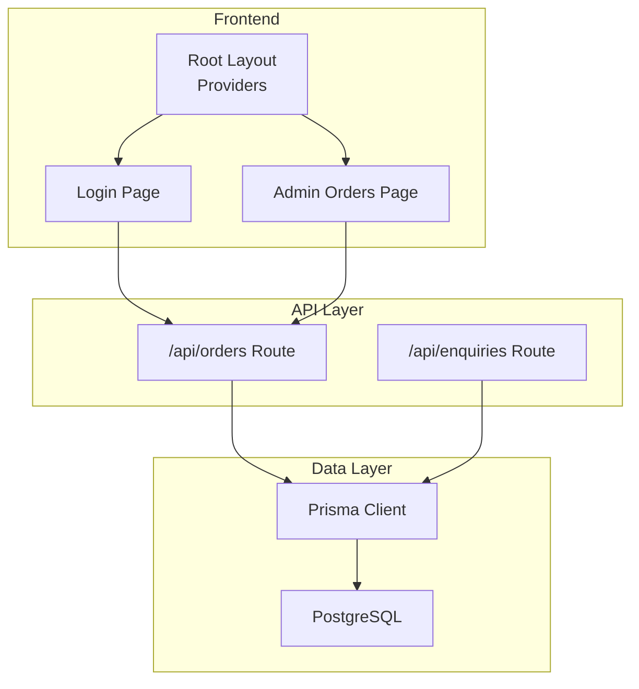
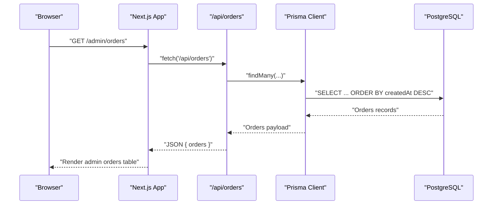
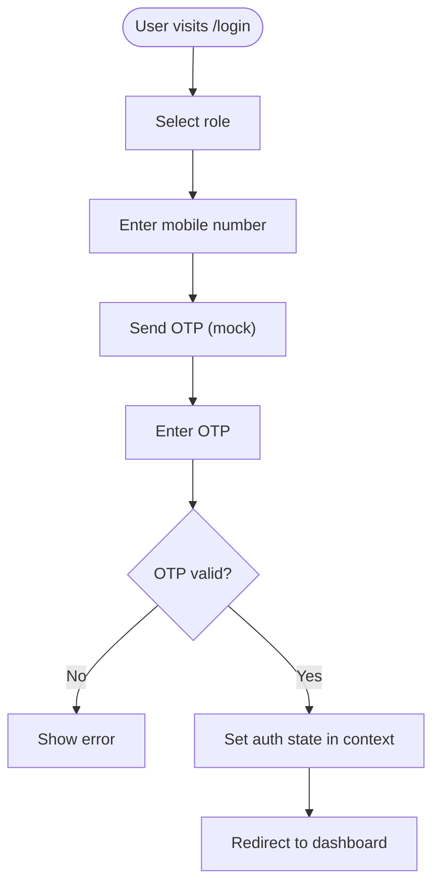
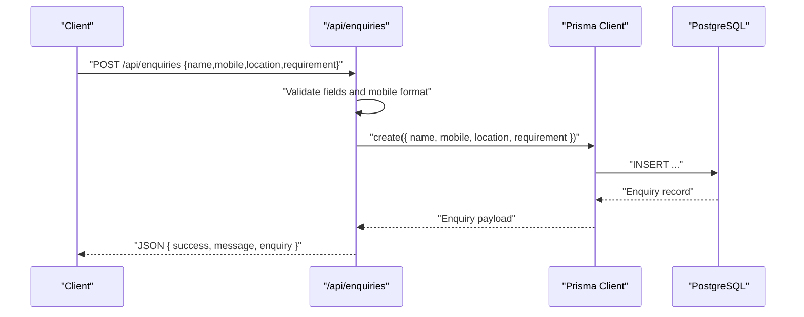
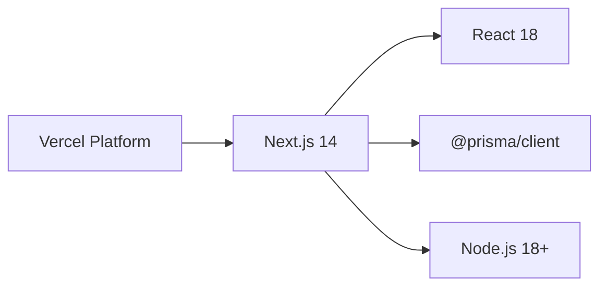

# Security & Operations

<cite>
**Referenced Files in This Document**
- [app/layout.tsx](file://app/layout.tsx)
- [components/AuthContext.tsx](file://components/AuthContext.tsx)
- [app/login/page.tsx](file://app/login/page.tsx)
- [app/admin/orders/page.tsx](file://app/admin/orders/page.tsx)
- [app/api/orders/route.ts](file://app/api/orders/route.ts)
- [app/api/enquiries/route.ts](file://app/api/enquiries/route.ts)
- [lib/prisma.ts](file://lib/prisma.ts)
- [next.config.mjs](file://next.config.mjs)
- [vercel.json](file://vercel.json)
- [DEPLOYMENT.md](file://DEPLOYMENT.md)
- [DEPLOYMENT_READY.md](file://DEPLOYMENT_READY.md)
- [FINAL_DEPLOYMENT_FIX.md](file://FINAL_DEPLOYMENT_FIX.md)
- [package.json](file://package.json)
</cite>

## Table of Contents
1. [Introduction](#introduction)
2. [Project Structure](#project-structure)
3. [Core Components](#core-components)
4. [Architecture Overview](#architecture-overview)
5. [Detailed Component Analysis](#detailed-component-analysis)
6. [Dependency Analysis](#dependency-analysis)
7. [Performance Considerations](#performance-considerations)
8. [Troubleshooting Guide](#troubleshooting-guide)
9. [Conclusion](#conclusion)
10. [Appendices](#appendices)

## Introduction
This document provides comprehensive security and operations guidance for the Shree Shyam Agency Portal. It focuses on authentication security, authorization controls, data protection, SSL/TLS and HTTPS configuration, operational security, monitoring, incident response, backup and disaster recovery, encryption practices, secure deployment, and vulnerability management. Where applicable, the analysis references concrete source files and deployment artifacts to ensure traceability and actionable recommendations.

## Project Structure
The portal is a Next.js 14 application using the App Router. Authentication is handled client-side via a React context stored in browser local storage. API routes under app/api implement serverless endpoints for orders, enquiries, and partner management. Database connectivity is managed by Prisma with optional in-memory fallback for development. Deployment is configured for Vercel with explicit function timeouts and telemetry settings.

**Diagram sources**
- [app/layout.tsx:17-46](file://app/layout.tsx#L17-L46)
- [app/login/page.tsx:1-127](file://app/login/page.tsx#L1-L127)
- [app/admin/orders/page.tsx:1-92](file://app/admin/orders/page.tsx#L1-L92)
- [app/api/orders/route.ts:1-129](file://app/api/orders/route.ts#L1-L129)
- [app/api/enquiries/route.ts:1-111](file://app/api/enquiries/route.ts#L1-L111)
- [lib/prisma.ts:1-22](file://lib/prisma.ts#L1-L22)

**Section sources**
- [app/layout.tsx:17-46](file://app/layout.tsx#L17-L46)
- [next.config.mjs:1-14](file://next.config.mjs#L1-L14)
- [vercel.json:1-22](file://vercel.json#L1-L22)
- [DEPLOYMENT.md:17-79](file://DEPLOYMENT.md#L17-L79)

## Core Components
- Authentication and Authorization
  - Client-side authentication state is maintained in a React context and persisted to local storage. Roles are represented as a union type with three roles. Authorization checks are currently missing in the provided code; see Recommendations for enforcement strategies.
- API Endpoints
  - Orders endpoint supports listing and creating orders with validation and database integration via Prisma.
  - Enquiries endpoint supports listing and creating enquiries with validation and database integration via Prisma.
- Database Access
  - Prisma client is conditionally initialized when a database URL is present. Logging is enabled for error and warning events.

Recommendations
- Implement server-side session/state management and enforce role-based access control on protected routes.
- Add middleware to validate authentication and authorization before accessing sensitive endpoints.
- Integrate a robust identity provider or JWT-based authentication for production.

**Section sources**
- [components/AuthContext.tsx:12-70](file://components/AuthContext.tsx#L12-L70)
- [app/login/page.tsx:1-127](file://app/login/page.tsx#L1-L127)
- [app/api/orders/route.ts:10-36](file://app/api/orders/route.ts#L10-L36)
- [app/api/enquiries/route.ts:8-110](file://app/api/enquiries/route.ts#L8-L110)
- [lib/prisma.ts:7-20](file://lib/prisma.ts#L7-L20)

## Architecture Overview
The system follows a client-rendered Next.js frontend with serverless API routes. Authentication state is stored client-side, while database operations are executed serverlessly. Vercel manages hosting and function execution with explicit configuration for timeouts and telemetry.

**Diagram sources**
- [app/admin/orders/page.tsx:21-39](file://app/admin/orders/page.tsx#L21-L39)
- [app/api/orders/route.ts:11-36](file://app/api/orders/route.ts#L11-L36)
- [lib/prisma.ts:11-20](file://lib/prisma.ts#L11-L20)

**Section sources**
- [app/admin/orders/page.tsx:16-89](file://app/admin/orders/page.tsx#L16-L89)
- [app/api/orders/route.ts:10-36](file://app/api/orders/route.ts#L10-L36)
- [lib/prisma.ts:7-20](file://lib/prisma.ts#L7-L20)

## Detailed Component Analysis

### Authentication and Authorization
Current state
- Authentication is client-side with role persistence in local storage. There is no server-side session validation or authorization enforcement in the provided code.
- The login page simulates OTP verification and invokes the context login method to set role and mobile.

Security gaps
- No CSRF protection for form submissions.
- No rate limiting for OTP resend or login attempts.
- No secure cookie/session management; state is stored in localStorage.
- No authorization guards on admin-only pages.

Recommended controls
- Implement server-side authentication with signed sessions or JWTs.
- Add CSRF tokens to all state-changing forms.
- Enforce role-based access control on protected routes and API endpoints.
- Apply rate limiting for OTP/resend and login endpoints.
- Use secure, HTTP-only, same-site cookies for session storage in a future server-side refactor.

**Diagram sources**
- [app/login/page.tsx:8-94](file://app/login/page.tsx#L8-L94)
- [components/AuthContext.tsx:29-59](file://components/AuthContext.tsx#L29-L59)

**Section sources**
- [components/AuthContext.tsx:12-70](file://components/AuthContext.tsx#L12-L70)
- [app/login/page.tsx:1-127](file://app/login/page.tsx#L1-L127)

### API Endpoints: Orders and Enquiries
Endpoints
- GET /api/orders: Lists orders with optional database-backed or in-memory data.
- POST /api/orders: Creates orders with validation and database-backed or in-memory storage.
- POST /api/enquiries: Creates enquiries with validation and database-backed or in-memory storage.
- GET /api/enquiries: Retrieves enquiries (admin-only logic is noted as a TODO).

Security considerations
- Input validation is performed on the server; consider stricter sanitization and allow-lists.
- No authentication or authorization checks are enforced on these endpoints.
- Logging uses console.error; production-grade logging should capture structured logs and mask sensitive data.

Operational notes
- Database initialization is conditional on DATABASE_URL presence.
- Function timeouts are configured in Vercel settings.

**Diagram sources**
- [app/api/enquiries/route.ts:9-81](file://app/api/enquiries/route.ts#L9-L81)
- [lib/prisma.ts:11-20](file://lib/prisma.ts#L11-L20)

**Section sources**
- [app/api/orders/route.ts:10-129](file://app/api/orders/route.ts#L10-L129)
- [app/api/enquiries/route.ts:8-111](file://app/api/enquiries/route.ts#L8-L111)
- [lib/prisma.ts:7-20](file://lib/prisma.ts#L7-L20)

### Data Protection and Storage
- Client-side state: Authentication state is stored in localStorage with a dedicated key. This is insecure for production due to XSS risks.
- Server-side data: Prisma is used when DATABASE_URL is configured; otherwise, in-memory arrays are used for development.

Recommendations
- Encrypt sensitive data at rest in the database.
- Avoid storing secrets in environment variables exposed to the client.
- Implement input sanitization and output encoding to prevent injection attacks.
- Use HTTPS everywhere and secure cookies for any future session storage.

**Section sources**
- [components/AuthContext.tsx:27-48](file://components/AuthContext.tsx#L27-L48)
- [lib/prisma.ts:7-20](file://lib/prisma.ts#L7-L20)

### SSL/TLS and HTTPS Configuration
- The repository does not include TLS/SSL configuration files or directives.
- Vercel manages HTTPS termination; ensure the domain is configured with a valid certificate in Vercel’s DNS and SSL settings.

Recommendations
- Enforce HTTPS with HSTS headers.
- Configure automatic redirect from HTTP to HTTPS.
- Use strong TLS ciphers and protocols.
- Monitor certificate expiration and renewal.

**Section sources**
- [vercel.json:1-22](file://vercel.json#L1-L22)
- [DEPLOYMENT.md:29-51](file://DEPLOYMENT.md#L29-L51)

### Operational Security: Access Controls, Audit Logging, and Compliance
- Access controls: Currently absent for API endpoints and admin pages. Implement RBAC with role checks.
- Audit logging: Console logging is minimal. Replace with structured, centralized logging and retention policies.
- Compliance: The code does not include privacy notices or consent mechanisms. Add a privacy policy and data subject request handling.

Recommendations
- Add middleware to enforce authentication and authorization.
- Centralize logs with correlation IDs and retention schedules.
- Implement data minimization and purpose limitation for collected data.
- Provide a privacy policy and data deletion capabilities.

**Section sources**
- [app/api/enquiries/route.ts:84-110](file://app/api/enquiries/route.ts#L84-L110)
- [app/admin/orders/page.tsx:16-39](file://app/admin/orders/page.tsx#L16-L39)

### Security Monitoring, Intrusion Detection, and Incident Response
- Monitoring: Enable Next.js telemetry only if desired; consider disabling for production builds.
- Intrusion detection: Not implemented. Consider integrating WAF, rate-limiting, and anomaly detection.
- Incident response: Establish escalation paths, forensic logging, and rollback procedures.

Recommendations
- Integrate a WAF and CDN with DDoS protection.
- Implement request/response size limits and timeouts.
- Define runbooks for incident classification and remediation.

**Section sources**
- [vercel.json:16-20](file://vercel.json#L16-L20)
- [vercel.json:8-15](file://vercel.json#L8-L15)

### Backup and Disaster Recovery
- Current state: No database backup scripts or DR plans are present.
- Recommendation: Schedule automated backups, test restore procedures, and define RPO/RTO targets.

**Section sources**
- [lib/prisma.ts:7-20](file://lib/prisma.ts#L7-L20)
- [DEPLOYMENT.md:52-63](file://DEPLOYMENT.md#L52-L63)

### Secure Deployment Practices
- Build and runtime: Node.js 18+ is required; ensure CI/CD validates TypeScript and builds successfully.
- Secrets: Store DATABASE_URL and other secrets in Vercel environment variables.
- Configuration: Remove deprecated settings and keep Next.js configuration minimal and secure.

Recommendations
- Use immutable deployments and pre-deploy health checks.
- Scan dependencies for vulnerabilities regularly.
- Automate deployment with approval gates.

**Section sources**
- [DEPLOYMENT.md:52-79](file://DEPLOYMENT.md#L52-L79)
- [DEPLOYMENT_READY.md:110-128](file://DEPLOYMENT_READY.md#L110-L128)
- [FINAL_DEPLOYMENT_FIX.md:50-81](file://FINAL_DEPLOYMENT_FIX.md#L50-L81)

### Vulnerability Assessment and Penetration Testing
- Assessment: Conduct SAST/DAST scans during CI/CD and periodic manual penetration tests.
- Penetration testing: Scope web app, API endpoints, and third-party integrations (e.g., SMS providers).
- Updates: Maintain dependency hygiene and apply patches promptly.

**Section sources**
- [package.json:13-42](file://package.json#L13-L42)
- [DEPLOYMENT.md:72-79](file://DEPLOYMENT.md#L72-L79)

## Dependency Analysis
The application depends on Next.js, Prisma, and related libraries. The API routes depend on Prisma for data access. Vercel configuration defines build commands and function timeouts.

**Diagram sources**
- [package.json:13-27](file://package.json#L13-L27)
- [vercel.json:2-6](file://vercel.json#L2-L6)

**Section sources**
- [package.json:13-42](file://package.json#L13-L42)
- [vercel.json:1-22](file://vercel.json#L1-L22)

## Performance Considerations
- Function timeouts: Vercel sets maxDuration for serverless functions; ensure API logic completes within limits.
- Build optimization: Next.js App Router with static generation; ensure API routes remain efficient.
- Database performance: Use Prisma queries with appropriate indexes and pagination.

**Section sources**
- [vercel.json:8-15](file://vercel.json#L8-L15)
- [DEPLOYMENT_READY.md:155-160](file://DEPLOYMENT_READY.md#L155-L160)

## Troubleshooting Guide
Common issues and resolutions
- Build failures: Validate TypeScript, install dependencies, and check environment variables.
- Deployment errors: Ensure deprecated Next.js settings are removed and pushed to the repository.
- Database connectivity: Confirm DATABASE_URL is set and Prisma client initializes correctly.

**Section sources**
- [DEPLOYMENT.md:72-79](file://DEPLOYMENT.md#L72-L79)
- [FINAL_DEPLOYMENT_FIX.md:82-97](file://FINAL_DEPLOYMENT_FIX.md#L82-L97)
- [lib/prisma.ts:7-20](file://lib/prisma.ts#L7-L20)

## Conclusion
The Shree Shyam Agency Portal demonstrates a functional frontend and API layer but lacks production-grade security controls. Immediate priorities include implementing server-side authentication and authorization, enforcing HTTPS, adding robust logging and monitoring, establishing backup and DR procedures, and conducting vulnerability assessments. These steps will strengthen the platform’s resilience and compliance posture.

## Appendices
- Environment variables to configure in production:
  - DATABASE_URL
  - NEXT_PUBLIC_APP_URL
  - Email/SMS credentials (as needed)
- Vercel regions and function timeouts are defined in the platform configuration.

**Section sources**
- [DEPLOYMENT.md:52-58](file://DEPLOYMENT.md#L52-L58)
- [vercel.json:7-21](file://vercel.json#L7-L21)