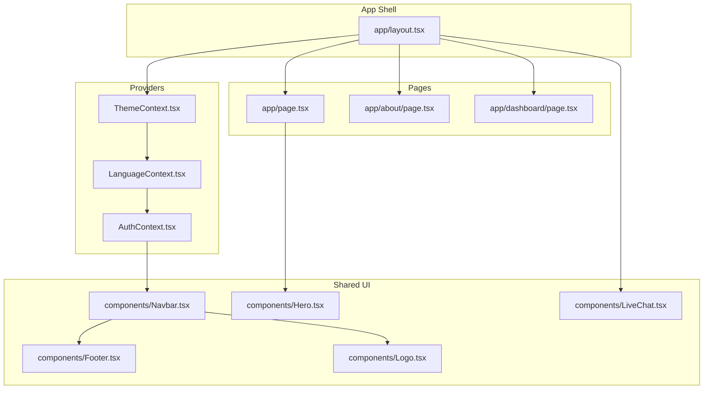
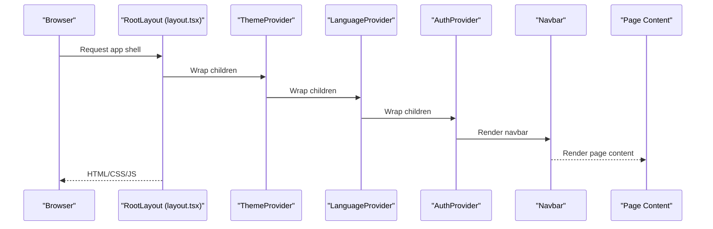
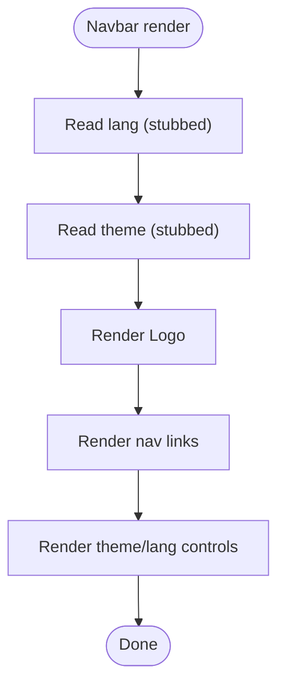
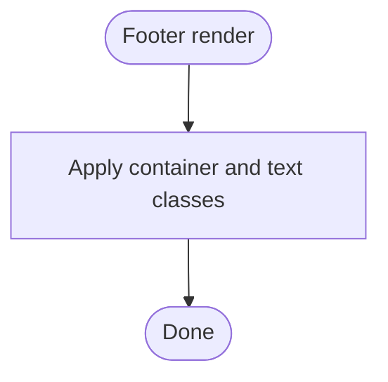
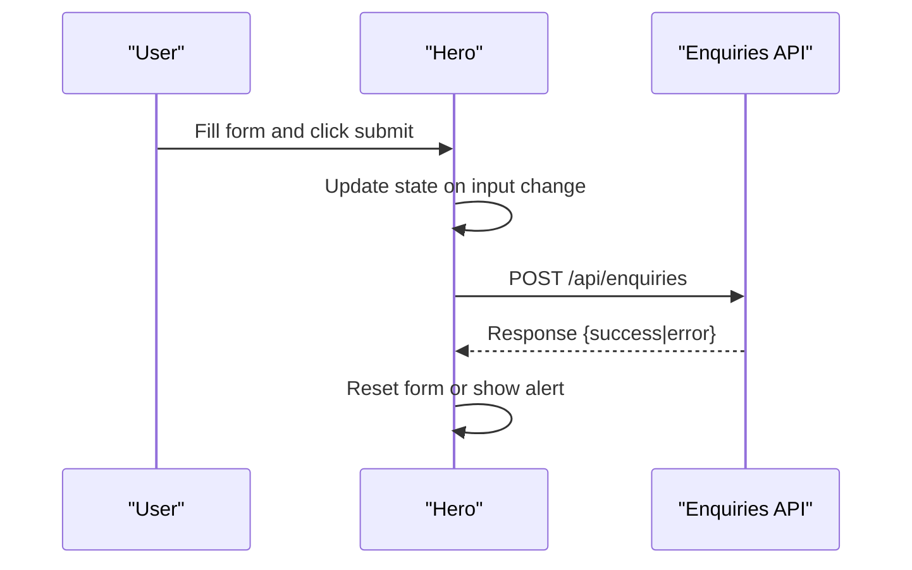
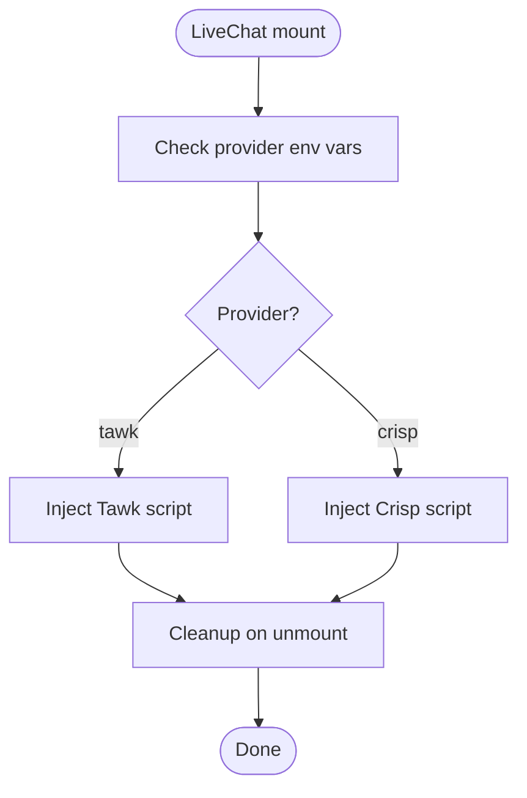
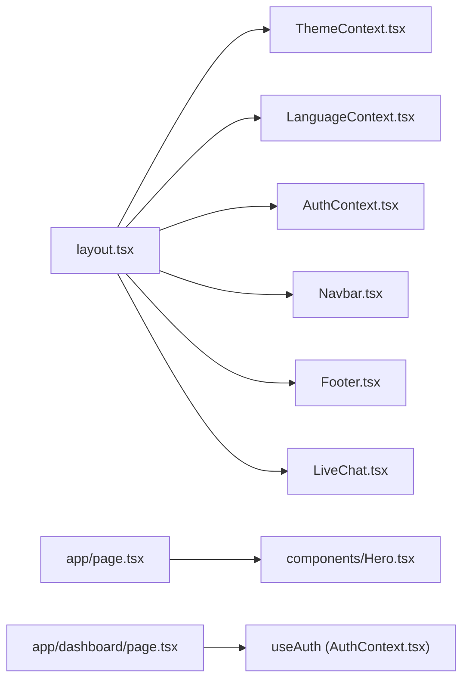

# Frontend Components

<cite>
**Referenced Files in This Document**
- [Navbar.tsx](file://components/Navbar.tsx)
- [Footer.tsx](file://components/Footer.tsx)
- [Hero.tsx](file://components/Hero.tsx)
- [Logo.tsx](file://components/Logo.tsx)
- [LiveChat.tsx](file://components/LiveChat.tsx)
- [AuthContext.tsx](file://components/AuthContext.tsx)
- [ThemeContext.tsx](file://components/ThemeContext.tsx)
- [LanguageContext.tsx](file://components/LanguageContext.tsx)
- [layout.tsx](file://app/layout.tsx)
- [page.tsx](file://app/page.tsx)
- [globals.css](file://app/globals.css)
- [tailwind.config.ts](file://tailwind.config.ts)
- [route.ts](file://app/api/enquiries/route.ts)
- [page.tsx](file://app/dashboard/page.tsx)
- [page.tsx](file://app/about/page.tsx)
</cite>

## Table of Contents
1. [Introduction](#introduction)
2. [Project Structure](#project-structure)
3. [Core Components](#core-components)
4. [Architecture Overview](#architecture-overview)
5. [Detailed Component Analysis](#detailed-component-analysis)
6. [Dependency Analysis](#dependency-analysis)
7. [Performance Considerations](#performance-considerations)
8. [Troubleshooting Guide](#troubleshooting-guide)
9. [Conclusion](#conclusion)
10. [Appendices](#appendices)

## Introduction
This document describes the React component library and shared UI components for the frontend application. It focuses on the component architecture, reusable patterns, prop interfaces, composition, state management integration, and styling with Tailwind CSS. It also covers page components, layout composition, context providers, usage examples, component states, animations, responsive design, customization, theming, accessibility, testing strategies, and integration with the overall application.

## Project Structure
The frontend is organized as a Next.js application with a dedicated components directory for shared UI and a small set of page components. Global styles and Tailwind configuration define the design system. Context providers wrap the application layout to supply authentication, language, and theme state to the UI.



**Diagram sources**
- [layout.tsx:17-46](file://app/layout.tsx#L17-L46)
- [AuthContext.tsx:29-60](file://components/AuthContext.tsx#L29-L60)
- [LanguageContext.tsx:23-50](file://components/LanguageContext.tsx#L23-L50)
- [ThemeContext.tsx:14-27](file://components/ThemeContext.tsx#L14-L27)
- [Navbar.tsx:19-60](file://components/Navbar.tsx#L19-L60)
- [Footer.tsx:1-17](file://components/Footer.tsx#L1-L17)
- [Logo.tsx:1-22](file://components/Logo.tsx#L1-L22)
- [Hero.tsx:6-135](file://components/Hero.tsx#L6-L135)
- [LiveChat.tsx:12-52](file://components/LiveChat.tsx#L12-L52)
- [page.tsx:4-89](file://app/page.tsx#L4-L89)
- [page.tsx:1-59](file://app/about/page.tsx#L1-L59)
- [page.tsx:6-38](file://app/dashboard/page.tsx#L6-L38)

**Section sources**
- [layout.tsx:17-46](file://app/layout.tsx#L17-L46)
- [globals.css:1-32](file://app/globals.css#L1-L32)
- [tailwind.config.ts:1-31](file://tailwind.config.ts#L1-L31)

## Core Components
This section documents the shared UI components and their roles in the application.

- Navbar
  - Purpose: Top navigation bar with branding, links, language switcher, and theme toggle placeholders.
  - Composition: Uses Logo and renders a static list of nav links.
  - Theming: Applies dark mode classes conditionally.
  - Accessibility: Links are keyboard focusable; buttons have titles.
  - Props: None.
  - States: Language and theme toggles are temporarily stubbed.

- Footer
  - Purpose: Persistent footer with copyright and location info.
  - Composition: Simple layout with responsive flex direction.
  - Theming: Dark/light variants via Tailwind classes.

- Hero
  - Purpose: Primary hero section with headline, benefits, CTA links, and a quick enquiry form.
  - Composition: Client-side state for form fields; submits to a backend API.
  - States: Form state managed locally; submission handled asynchronously.
  - Accessibility: Inputs have required attributes; form submission prevents default.

- Logo
  - Purpose: Brand identity element with icon and text.
  - Composition: Minimal presentation component.

- LiveChat
  - Purpose: Client-side integration for third-party live chat providers.
  - Providers: Tawk.to and Crisp supported via environment variables.
  - Lifecycle: Dynamically injects script tags and cleans up on unmount.

**Section sources**
- [Navbar.tsx:19-60](file://components/Navbar.tsx#L19-L60)
- [Footer.tsx:1-17](file://components/Footer.tsx#L1-L17)
- [Hero.tsx:6-135](file://components/Hero.tsx#L6-L135)
- [Logo.tsx:1-22](file://components/Logo.tsx#L1-L22)
- [LiveChat.tsx:12-52](file://components/LiveChat.tsx#L12-L52)

## Architecture Overview
The application composes a global layout that wraps pages with providers for authentication, language, and theme. Shared UI components are included in the layout and used within page components.



**Diagram sources**
- [layout.tsx:17-46](file://app/layout.tsx#L17-L46)
- [ThemeContext.tsx:14-27](file://components/ThemeContext.tsx#L14-L27)
- [LanguageContext.tsx:23-50](file://components/LanguageContext.tsx#L23-L50)
- [AuthContext.tsx:29-60](file://components/AuthContext.tsx#L29-L60)
- [Navbar.tsx:19-60](file://components/Navbar.tsx#L19-L60)

## Detailed Component Analysis

### Navbar
- Composition pattern: Stateless functional component rendering a logo and navigation links. Uses a static array of link descriptors.
- State management: Language and theme toggles are present but temporarily stubbed; the component reads temporary values.
- Styling: Tailwind utilities for responsive layout, spacing, and dark mode variants.
- Accessibility: Links are focusable; buttons have titles for tooltips.



**Diagram sources**
- [Navbar.tsx:19-60](file://components/Navbar.tsx#L19-L60)

**Section sources**
- [Navbar.tsx:19-60](file://components/Navbar.tsx#L19-L60)

### Footer
- Composition pattern: Stateless functional component with minimal markup.
- Styling: Responsive flex layout with dark/light variants.



**Diagram sources**
- [Footer.tsx:1-17](file://components/Footer.tsx#L1-L17)

**Section sources**
- [Footer.tsx:1-17](file://components/Footer.tsx#L1-L17)

### Hero
- Composition pattern: Client component with internal form state and asynchronous submission.
- State management: useState for form fields; useEffect-free; submission handled inline.
- API integration: Submits to a backend endpoint for enquiries.
- Accessibility: Required inputs; preventDefault on form submit.



**Diagram sources**
- [Hero.tsx:19-42](file://components/Hero.tsx#L19-L42)
- [route.ts:4-65](file://app/api/enquiries/route.ts#L4-L65)

**Section sources**
- [Hero.tsx:6-135](file://components/Hero.tsx#L6-L135)
- [route.ts:4-65](file://app/api/enquiries/route.ts#L4-L65)

### Logo
- Composition pattern: Stateless functional component returning branded identity.
- Styling: Tailwind classes for sizing, colors, and typography.

**Section sources**
- [Logo.tsx:1-22](file://components/Logo.tsx#L1-L22)

### LiveChat
- Composition pattern: Client component that dynamically loads provider scripts based on environment variables.
- Providers: Tawk.to and Crisp; supports conditional loading and cleanup.
- Environment: Requires NEXT_PUBLIC_* variables.



**Diagram sources**
- [LiveChat.tsx:12-52](file://components/LiveChat.tsx#L12-L52)

**Section sources**
- [LiveChat.tsx:12-52](file://components/LiveChat.tsx#L12-L52)

### AuthContext
- Purpose: Provides authentication state and actions to the app.
- Storage: Persists to localStorage and hydrates on mount.
- Hooks: useAuth exposes login/logout and current user state.

```mermaid
classDiagram
class AuthProvider {
+ReactNode children
+user : AuthState
+login(params)
+logout()
}
class AuthState {
+role : Role|null
+mobile : string|null
}
class Role {
<<enum>>
"admin"
"team-boy"
"printing-shop"
}
class useAuth {
+() : AuthContextValue
}
AuthProvider --> AuthState : "manages"
useAuth --> AuthProvider : "consumes"
```

**Diagram sources**
- [AuthContext.tsx:14-70](file://components/AuthContext.tsx#L14-L70)

**Section sources**
- [AuthContext.tsx:14-70](file://components/AuthContext.tsx#L14-L70)

### ThemeContext
- Purpose: Provides theme state and a toggle function.
- Behavior: Currently fixed to a light theme with a no-op toggle.

```mermaid
classDiagram
class ThemeProvider {
+ReactNode children
+theme : Theme
+toggle()
}
class Theme {
<<enum>>
"light"
"dark"
}
class useTheme {
+() : ThemeContextValue
}
ThemeProvider --> Theme : "provides"
useTheme --> ThemeProvider : "consumes"
```

**Diagram sources**
- [ThemeContext.tsx:5-34](file://components/ThemeContext.tsx#L5-L34)

**Section sources**
- [ThemeContext.tsx:5-34](file://components/ThemeContext.tsx#L5-L34)

### LanguageContext
- Purpose: Provides language state and a toggle function.
- Persistence: Reads/writes to localStorage.

```mermaid
classDiagram
class LanguageProvider {
+ReactNode children
+lang : Lang
+toggle()
}
class Lang {
<<enum>>
"en"
"hi"
}
class useLanguage {
+() : LanguageContextValue
}
LanguageProvider --> Lang : "provides"
useLanguage --> LanguageProvider : "consumes"
```

**Diagram sources**
- [LanguageContext.tsx:12-59](file://components/LanguageContext.tsx#L12-L59)

**Section sources**
- [LanguageContext.tsx:12-59](file://components/LanguageContext.tsx#L12-L59)

## Dependency Analysis
The layout composes providers in a nested fashion, ensuring that child components can consume context. Pages import and render shared components.



**Diagram sources**
- [layout.tsx:17-46](file://app/layout.tsx#L17-L46)
- [ThemeContext.tsx:14-27](file://components/ThemeContext.tsx#L14-L27)
- [LanguageContext.tsx:23-50](file://components/LanguageContext.tsx#L23-L50)
- [AuthContext.tsx:29-60](file://components/AuthContext.tsx#L29-L60)
- [Navbar.tsx:19-60](file://components/Navbar.tsx#L19-L60)
- [Footer.tsx:1-17](file://components/Footer.tsx#L1-L17)
- [LiveChat.tsx:12-52](file://components/LiveChat.tsx#L12-L52)
- [page.tsx:4-89](file://app/page.tsx#L4-L89)
- [page.tsx:6-38](file://app/dashboard/page.tsx#L6-L38)

**Section sources**
- [layout.tsx:17-46](file://app/layout.tsx#L17-L46)
- [page.tsx:4-89](file://app/page.tsx#L4-L89)
- [page.tsx:6-38](file://app/dashboard/page.tsx#L6-L38)

## Performance Considerations
- Client components: Hero and LiveChat are client components; keep their logic lightweight to avoid unnecessary re-renders.
- Context providers: Memoization is used in providers to stabilize references and reduce downstream re-renders.
- Styling: Tailwind utilities are scoped to components; avoid generating excessive dynamic classes.
- Images and assets: Logo uses inline styled elements; consider optimizing if images are added later.
- API calls: Hero’s form submission is asynchronous; ensure network requests are efficient and errors are handled gracefully.

## Troubleshooting Guide
- LiveChat not appearing:
  - Verify environment variables for the selected provider are set.
  - Confirm the component mounts and scripts are injected.
- Hero form submission failures:
  - Check API endpoint availability and CORS.
  - Inspect browser console for fetch errors.
- Language or theme not persisting:
  - Ensure localStorage is enabled and not blocked by browser settings.
  - Confirm provider wrappers are present in the layout.

**Section sources**
- [LiveChat.tsx:12-52](file://components/LiveChat.tsx#L12-L52)
- [route.ts:4-65](file://app/api/enquiries/route.ts#L4-L65)
- [LanguageContext.tsx:23-50](file://components/LanguageContext.tsx#L23-L50)
- [ThemeContext.tsx:14-27](file://components/ThemeContext.tsx#L14-L27)

## Conclusion
The component library follows a clean separation of concerns with shared UI components and context providers managing cross-cutting concerns. Styling is standardized via Tailwind, and pages compose these components to deliver cohesive layouts. The architecture supports future enhancements such as enabling theme toggling, integrating language switching, and extending LiveChat providers.

## Appendices

### Styling and Theming
- Design tokens: Primary and secondary colors are defined in Tailwind configuration.
- Dark mode: Controlled via class-based dark mode; global CSS applies dark variants to body and links.
- Component classes: Consistent use of spacing, typography, and color tokens across components.

**Section sources**
- [tailwind.config.ts:9-24](file://tailwind.config.ts#L9-L24)
- [globals.css:10-18](file://app/globals.css#L10-L18)

### Accessibility Checklist
- Focus management: Interactive elements are keyboard accessible.
- Labels and titles: Buttons include titles for tooltips.
- Forms: Required fields are enforced; submission uses preventDefault.
- Contrast: Color palette supports readable text in both light and dark modes.

### Testing Strategies
- Unit tests for contexts: Validate initial state, persistence, and toggle behavior.
- Component snapshot tests: Ensure markup stability for Navbar, Footer, Logo, and Hero.
- Integration tests: Verify provider composition and page rendering.
- E2E tests: Validate Hero form submission and LiveChat script injection.

### Example Usage References
- Navbar usage: Imported and rendered in the root layout.
- Hero usage: Used on the home page.
- Dashboard integration: Uses AuthContext via a hook to render role-specific views.

**Section sources**
- [layout.tsx:27-28](file://app/layout.tsx#L27-L28)
- [page.tsx:6-7](file://app/page.tsx#L6-L7)
- [page.tsx:6-38](file://app/dashboard/page.tsx#L6-L38)