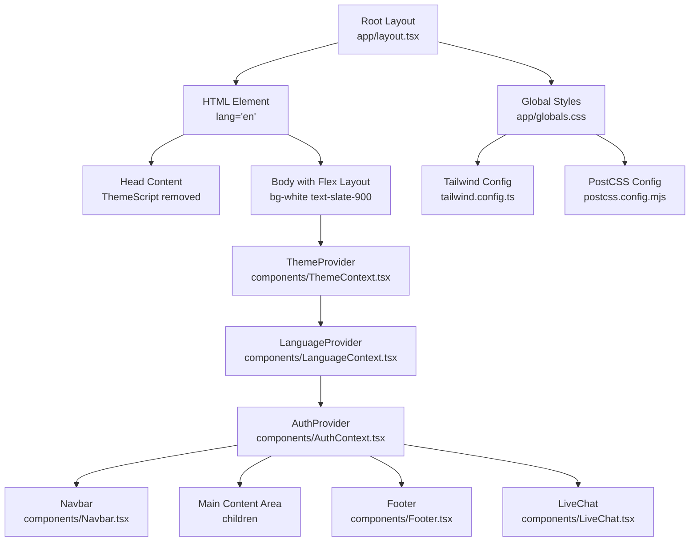
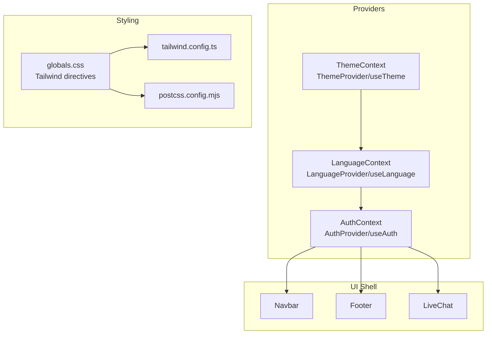
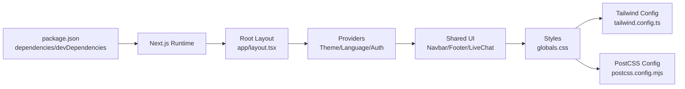

# Layout System

<cite>
**Referenced Files in This Document**
- [app/layout.tsx](file://app/layout.tsx)
- [app/globals.css](file://app/globals.css)
- [app/theme-script.tsx](file://app/theme-script.tsx)
- [tailwind.config.ts](file://tailwind.config.ts)
- [postcss.config.mjs](file://postcss.config.mjs)
- [next.config.mjs](file://next.config.mjs)
- [components/ThemeContext.tsx](file://components/ThemeContext.tsx)
- [components/AuthContext.tsx](file://components/AuthContext.tsx)
- [components/LanguageContext.tsx](file://components/LanguageContext.tsx)
- [components/Navbar.tsx](file://components/Navbar.tsx)
- [components/Footer.tsx](file://components/Footer.tsx)
- [components/LiveChat.tsx](file://components/LiveChat.tsx)
- [components/Logo.tsx](file://components/Logo.tsx)
- [package.json](file://package.json)
</cite>

## Table of Contents
1. [Introduction](#introduction)
2. [Project Structure](#project-structure)
3. [Core Components](#core-components)
4. [Architecture Overview](#architecture-overview)
5. [Detailed Component Analysis](#detailed-component-analysis)
6. [Dependency Analysis](#dependency-analysis)
7. [Performance Considerations](#performance-considerations)
8. [Troubleshooting Guide](#troubleshooting-guide)
9. [Conclusion](#conclusion)

## Introduction
This document explains the application’s layout system and global styling architecture. It covers the root layout component structure, provider hierarchy, component wrapping patterns, global CSS and Tailwind configuration, theme script behavior, responsive design patterns, container layouts, spacing systems, layout composition, provider ordering, state management integration, styling best practices, performance considerations, and customization options.

## Project Structure
The layout system centers around the root layout component that composes shared UI elements and providers. Global styles are defined via Tailwind directives and custom CSS utilities. Providers manage cross-cutting concerns like theme, authentication, and language.

**Diagram sources**
- [app/layout.tsx:17-46](file://app/layout.tsx#L17-L46)
- [app/globals.css:1-32](file://app/globals.css#L1-L32)
- [tailwind.config.ts:3-27](file://tailwind.config.ts#L3-L27)
- [postcss.config.mjs:1-8](file://postcss.config.mjs#L1-L8)

**Section sources**
- [app/layout.tsx:17-46](file://app/layout.tsx#L17-L46)
- [app/globals.css:1-32](file://app/globals.css#L1-L32)
- [tailwind.config.ts:3-27](file://tailwind.config.ts#L3-L27)
- [postcss.config.mjs:1-8](file://postcss.config.mjs#L1-L8)

## Core Components
- Root Layout: Defines the HTML document structure, head, body, and top-level providers and UI shell.
- Providers: Theme, Language, and Auth contexts wrap the application subtree.
- Shared UI: Navbar, Footer, and LiveChat are consistently rendered across pages.
- Global Styles: Tailwind directives and custom CSS utilities define base, component, and utility layers, plus dark/light variants.

Key provider order and wrapping pattern:
- ThemeProvider wraps all other providers.
- LanguageProvider wraps AuthProvider.
- Navbar, main content area, Footer, and LiveChat render inside the AuthProvider.

Responsive and container patterns:
- Flex column layout on the body with a flexible main area.
- Container utility class for page-level content width and padding.
- Dark mode classes applied to html/body for theme-aware styling.

**Section sources**
- [app/layout.tsx:17-46](file://app/layout.tsx#L17-L46)
- [components/ThemeContext.tsx:14-27](file://components/ThemeContext.tsx#L14-L27)
- [components/LanguageContext.tsx:23-50](file://components/LanguageContext.tsx#L23-L50)
- [components/AuthContext.tsx:29-60](file://components/AuthContext.tsx#L29-L60)
- [app/globals.css:28-31](file://app/globals.css#L28-L31)

## Architecture Overview
The layout architecture follows a layered provider model with a consistent UI shell. Providers are ordered to ensure downstream components can consume theme, language, and auth state. Global CSS and Tailwind configuration establish a unified design system with dark mode support.

**Diagram sources**
- [components/ThemeContext.tsx:14-33](file://components/ThemeContext.tsx#L14-L33)
- [components/LanguageContext.tsx:23-57](file://components/LanguageContext.tsx#L23-L57)
- [components/AuthContext.tsx:29-68](file://components/AuthContext.tsx#L29-L68)
- [components/Navbar.tsx:19-60](file://components/Navbar.tsx#L19-L60)
- [components/Footer.tsx:1-17](file://components/Footer.tsx#L1-L17)
- [components/LiveChat.tsx:12-50](file://components/LiveChat.tsx#L12-L50)
- [app/globals.css:1-32](file://app/globals.css#L1-L32)
- [tailwind.config.ts:3-27](file://tailwind.config.ts#L3-L27)
- [postcss.config.mjs:1-8](file://postcss.config.mjs#L1-L8)

## Detailed Component Analysis

### Root Layout Composition
The root layout composes the document shell and provider chain. It sets the document language, applies global styles, and renders the shared UI shell around page content.

- Document structure: html element with lang attribute.
- Head: ThemeScript is intentionally omitted; the site uses a white/light theme only.
- Body: Flex column layout with min-height and background/text colors.
- Provider hierarchy: ThemeProvider -> LanguageProvider -> AuthProvider.
- UI shell: Navbar, main content area, Footer, and LiveChat.
- Responsive elements: Fixed WhatsApp button appears at medium breakpoint and above.

Provider ordering ensures downstream components can safely consume theme, language, and auth state.

**Section sources**
- [app/layout.tsx:17-46](file://app/layout.tsx#L17-L46)

### Theme Script and Dynamic Theme Switching
- ThemeScript component returns null, indicating no runtime theme switching is enabled.
- ThemeProvider always exposes a light theme and a no-op toggle function.
- Tailwind dark mode is configured via class-based detection in the configuration.
- Global CSS defines dark/light classes on html/body for theme-aware styling.

Implications:
- The application is locked to a white/light theme.
- Dark mode remains available via Tailwind classes but is not toggled dynamically.
- Future enhancements could wire ThemeScript and ThemeProvider toggle to enable dynamic switching.

**Section sources**
- [app/theme-script.tsx:1-5](file://app/theme-script.tsx#L1-L5)
- [components/ThemeContext.tsx:14-33](file://components/ThemeContext.tsx#L14-L33)
- [tailwind.config.ts:8](file://tailwind.config.ts#L8)
- [app/globals.css:10-18](file://app/globals.css#L10-L18)

### Global CSS and Tailwind Configuration
- Tailwind directives: base, components, and utilities are included.
- Base styles: html and body inherit background and text colors; dark variants apply alternative palettes.
- Utilities: anchor links use primary color transitions; container-page utility centralizes page content with max-width and padding.
- Tailwind configuration: dark mode via class, custom primary/secondary palette, Inter font family, and content scanning paths.
- PostCSS: Tailwind and Autoprefixer plugins.
- Next.js config: strict mode enabled, empty remote image domains, and no experimental appDir flag.

Responsive patterns:
- Container utility centers content and constrains width with horizontal padding.
- Breakpoint-based visibility for the floating WhatsApp link.

**Section sources**
- [app/globals.css:1-32](file://app/globals.css#L1-L32)
- [tailwind.config.ts:3-27](file://tailwind.config.ts#L3-L27)
- [postcss.config.mjs:1-8](file://postcss.config.mjs#L1-L8)
- [next.config.mjs:1-14](file://next.config.mjs#L1-L14)

### Provider Hierarchy and State Management Integration
- ThemeProvider: Provides theme state and a toggle function; currently a no-op.
- LanguageProvider: Manages language state and persistence in localStorage; exposes toggle.
- AuthProvider: Manages user role and mobile, persists to localStorage, and exposes login/logout.
- Ordering: ThemeProvider outermost, then LanguageProvider, then AuthProvider, ensuring downstream components can rely on all contexts.

Integration points:
- Navbar consumes language and theme placeholders.
- Footer and LiveChat render outside of auth-sensitive areas.
- LiveChat loads external chat widgets conditionally based on environment variables.

**Section sources**
- [components/ThemeContext.tsx:14-33](file://components/ThemeContext.tsx#L14-L33)
- [components/LanguageContext.tsx:23-57](file://components/LanguageContext.tsx#L23-L57)
- [components/AuthContext.tsx:29-68](file://components/AuthContext.tsx#L29-L68)
- [components/Navbar.tsx:19-60](file://components/Navbar.tsx#L19-L60)
- [components/LiveChat.tsx:12-50](file://components/LiveChat.tsx#L12-L50)

### Layout Composition Patterns
- Flex column on body with a flexible main area to push footer to the bottom.
- Container utility for page content to constrain width and add padding.
- Sticky-like header/footer with borders and background variants for dark mode.
- Floating action button for live chat with responsive visibility.

Responsive breakpoints:
- Medium breakpoint controls the visibility of the WhatsApp link.
- Navbar navigation becomes visible at medium screens.

Spacing system:
- Consistent use of Tailwind spacing utilities and the custom container-page class.

**Section sources**
- [app/layout.tsx:23](file://app/layout.tsx#L23)
- [app/globals.css:28-31](file://app/globals.css#L28-L31)
- [components/Navbar.tsx:26-58](file://components/Navbar.tsx#L26-L58)
- [components/Footer.tsx:3-14](file://components/Footer.tsx#L3-L14)

### Theme Script Functionality
- ThemeScript returns null, disabling dynamic theme switching.
- The site uses a white/light theme by default.
- Tailwind dark mode remains available for manual application via html/body classes.

Future enhancement:
- Wire ThemeScript to a real theme switcher and update ThemeProvider toggle to change theme state.

**Section sources**
- [app/theme-script.tsx:1-5](file://app/theme-script.tsx#L1-L5)
- [components/ThemeContext.tsx:14-27](file://components/ThemeContext.tsx#L14-L27)

### Live Chat Integration
- Client-side script loader for Tawk.to or Crisp based on environment variables.
- Cleanup on unmount to remove injected scripts.
- Provider prop allows selecting the chat service.

Operational notes:
- Environment variables must be present for the chat to load.
- The component is intentionally placed outside of auth-sensitive areas.

**Section sources**
- [components/LiveChat.tsx:12-50](file://components/LiveChat.tsx#L12-L50)

### Navigation and Branding
- Navbar includes logo, navigation links, and language/theme toggles.
- Links support English/Hindi localization.
- Theme toggle is present but inactive in the current implementation.

**Section sources**
- [components/Navbar.tsx:19-60](file://components/Navbar.tsx#L19-L60)
- [components/Logo.tsx:1-22](file://components/Logo.tsx#L1-L22)

## Dependency Analysis
The layout system depends on Tailwind CSS and PostCSS for styling, with Next.js managing the build pipeline. Providers depend on React context APIs and localStorage for persistence.

**Diagram sources**
- [package.json:13-42](file://package.json#L13-L42)
- [app/layout.tsx:17-46](file://app/layout.tsx#L17-L46)
- [app/globals.css:1-32](file://app/globals.css#L1-L32)
- [tailwind.config.ts:3-27](file://tailwind.config.ts#L3-L27)
- [postcss.config.mjs:1-8](file://postcss.config.mjs#L1-L8)

**Section sources**
- [package.json:13-42](file://package.json#L13-L42)
- [app/layout.tsx:17-46](file://app/layout.tsx#L17-L46)

## Performance Considerations
- Provider ordering minimizes re-renders by keeping heavy providers near the root.
- Tailwind’s purge/content configuration limits generated CSS to used classes.
- Global CSS is scoped to base/components/utilities and minimal custom rules.
- LiveChat injects external scripts conditionally and cleans up on unmount.
- Strict mode in Next.js helps surface potential issues early.

Recommendations:
- Keep provider boundaries small and focused.
- Prefer CSS-in-JS or Tailwind utilities for component-level styling.
- Defer heavy third-party script loading until after hydration if needed.

[No sources needed since this section provides general guidance]

## Troubleshooting Guide
Common issues and resolutions:
- Theme toggle not working: ThemeScript returns null; enable dynamic switching by wiring ThemeScript and ThemeProvider toggle.
- Chat widget not appearing: Verify NEXT_PUBLIC_TAWK_PROPERTY_ID/NEXT_PUBLIC_TAWK_WIDGET_ID or NEXT_PUBLIC_CRISP_WEBSITE_ID environment variables are set.
- Dark mode styles not applying: Ensure html/body classes include dark variants when manually switching themes.
- Layout shifts: Confirm container-page class is applied to page containers and responsive breakpoints align with design.

**Section sources**
- [app/theme-script.tsx:1-5](file://app/theme-script.tsx#L1-L5)
- [components/LiveChat.tsx:12-50](file://components/LiveChat.tsx#L12-L50)
- [app/globals.css:10-18](file://app/globals.css#L10-L18)

## Conclusion
The layout system establishes a clean, provider-driven architecture with a consistent UI shell and robust global styling foundation. Providers are ordered to support downstream components, while Tailwind and PostCSS deliver a scalable design system with dark mode support. Current theme switching is disabled, but the infrastructure is ready for dynamic theme toggling. The responsive patterns and container/spacer utilities ensure consistent spacing and readability across devices.