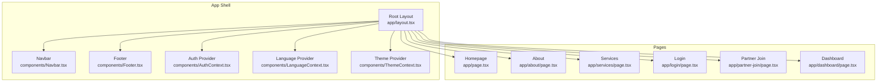
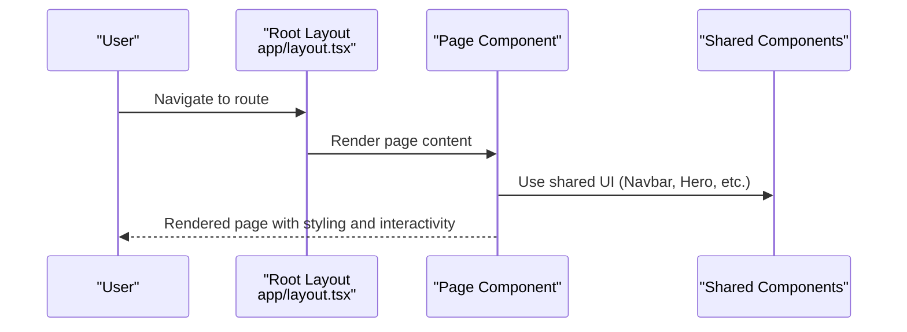
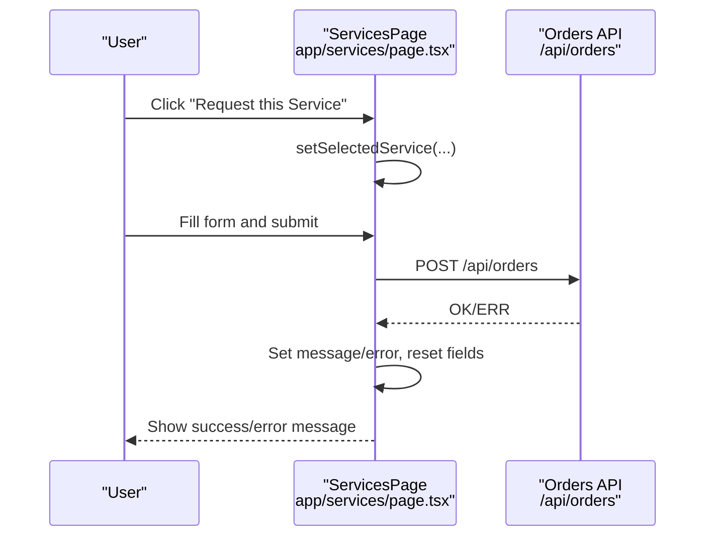
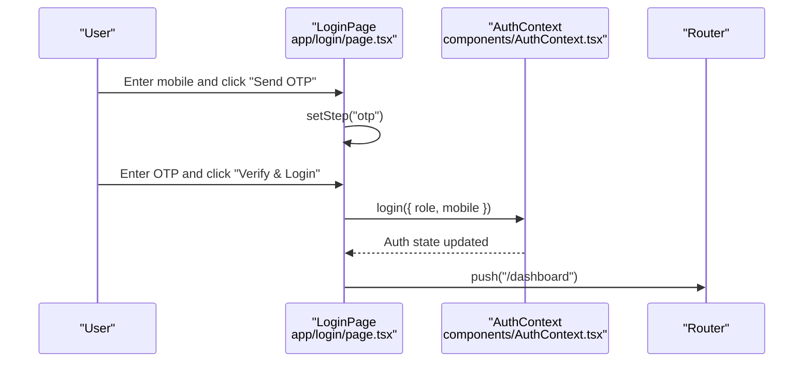
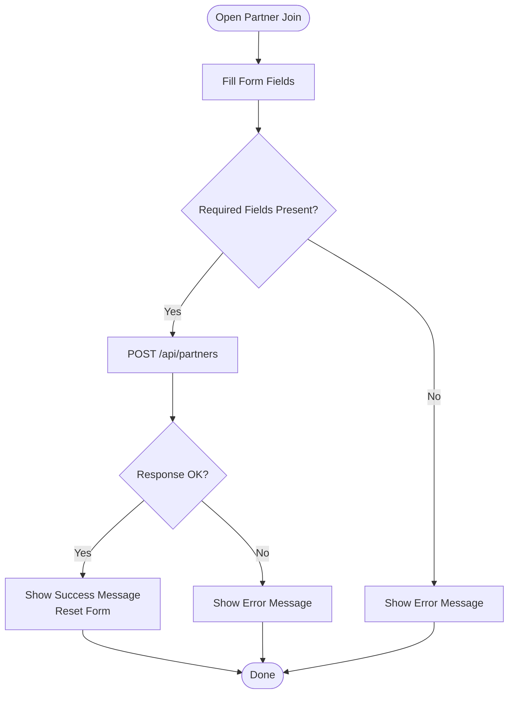
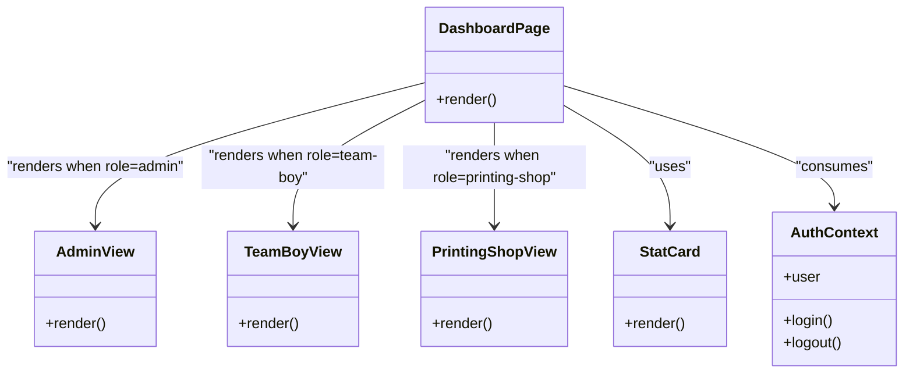
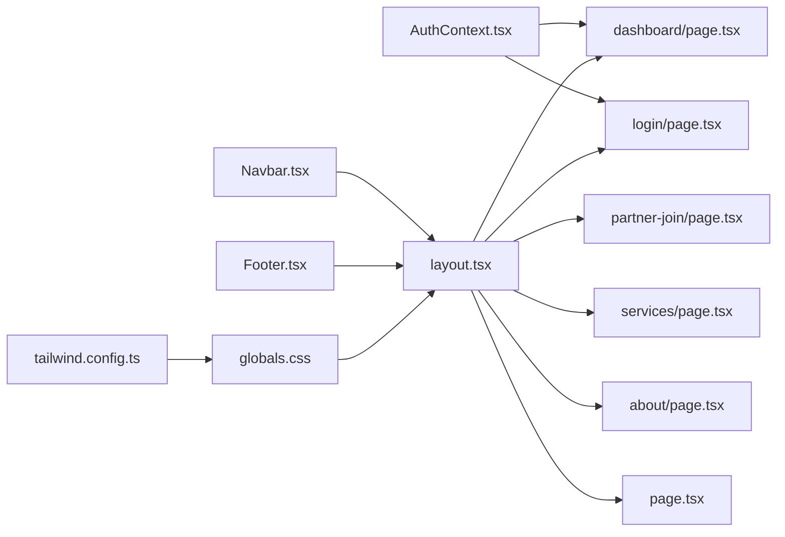

# Page Components

<cite>
**Referenced Files in This Document**
- [app/layout.tsx](file://app/layout.tsx)
- [app/page.tsx](file://app/page.tsx)
- [components/Hero.tsx](file://components/Hero.tsx)
- [app/about/page.tsx](file://app/about/page.tsx)
- [app/services/page.tsx](file://app/services/page.tsx)
- [app/login/page.tsx](file://app/login/page.tsx)
- [app/partner-join/page.tsx](file://app/partner-join/page.tsx)
- [app/dashboard/page.tsx](file://app/dashboard/page.tsx)
- [components/AuthContext.tsx](file://components/AuthContext.tsx)
- [components/Navbar.tsx](file://components/Navbar.tsx)
- [components/Footer.tsx](file://components/Footer.tsx)
- [components/ThemeContext.tsx](file://components/ThemeContext.tsx)
- [components/LanguageContext.tsx](file://components/LanguageContext.tsx)
- [app/globals.css](file://app/globals.css)
- [tailwind.config.ts](file://tailwind.config.ts)
</cite>

## Table of Contents
1. [Introduction](#introduction)
2. [Project Structure](#project-structure)
3. [Core Components](#core-components)
4. [Architecture Overview](#architecture-overview)
5. [Detailed Component Analysis](#detailed-component-analysis)
6. [Dependency Analysis](#dependency-analysis)
7. [Performance Considerations](#performance-considerations)
8. [Troubleshooting Guide](#troubleshooting-guide)
9. [Conclusion](#conclusion)
10. [Appendices](#appendices)

## Introduction
This document explains the page-level components and their implementations across the Next.js application. It covers the homepage layout and hero section, the about page structure, the services page with service listings and submission flows, authentication pages (login and partner registration), and the dashboard page with role-based content rendering. It also documents page-specific styling, responsive design patterns, integration with shared layout components, routing, SEO metadata, and performance optimization techniques.

## Project Structure
The application follows a Next.js App Router structure with page files under app/<route>/page.tsx and shared UI under components/. The root layout integrates navigation, footer, and providers for authentication, language, and theme.

**Diagram sources**
- [app/layout.tsx:17-46](file://app/layout.tsx#L17-L46)
- [components/Navbar.tsx:19-60](file://components/Navbar.tsx#L19-L60)
- [components/Footer.tsx:1-17](file://components/Footer.tsx#L1-L17)
- [components/AuthContext.tsx:29-60](file://components/AuthContext.tsx#L29-L60)
- [components/LanguageContext.tsx:23-50](file://components/LanguageContext.tsx#L23-L50)
- [components/ThemeContext.tsx:14-27](file://components/ThemeContext.tsx#L14-L27)
- [app/page.tsx:4-87](file://app/page.tsx#L4-L87)
- [app/about/page.tsx:1-59](file://app/about/page.tsx#L1-L59)
- [app/services/page.tsx:65-234](file://app/services/page.tsx#L65-L234)
- [app/login/page.tsx:7-125](file://app/login/page.tsx#L7-L125)
- [app/partner-join/page.tsx:5-163](file://app/partner-join/page.tsx#L5-L163)
- [app/dashboard/page.tsx:6-37](file://app/dashboard/page.tsx#L6-L37)

**Section sources**
- [app/layout.tsx:17-46](file://app/layout.tsx#L17-L46)
- [components/Navbar.tsx:19-60](file://components/Navbar.tsx#L19-L60)
- [components/Footer.tsx:1-17](file://components/Footer.tsx#L1-L17)
- [components/AuthContext.tsx:29-60](file://components/AuthContext.tsx#L29-L60)
- [components/LanguageContext.tsx:23-50](file://components/LanguageContext.tsx#L23-L50)
- [components/ThemeContext.tsx:14-27](file://components/ThemeContext.tsx#L14-L27)

## Core Components
- Root layout sets up providers and renders the main content area. It includes metadata for SEO and integrates the navbar, footer, and live chat placeholder.
- Shared components include Navbar, Footer, Hero, AuthContext, ThemeContext, and LanguageContext.
- Global styles define container sizing, typography, and color tokens for light/dark modes.

Key styling and responsive patterns:
- Responsive grids and spacing using Tailwind utilities (e.g., md:grid-cols-*).
- A reusable container-page class centers content and applies padding.
- Color tokens primary and secondary are defined in Tailwind config and applied consistently.

**Section sources**
- [app/layout.tsx:11-15](file://app/layout.tsx#L11-L15)
- [app/layout.tsx:23-46](file://app/layout.tsx#L23-L46)
- [app/globals.css:28-32](file://app/globals.css#L28-L32)
- [tailwind.config.ts:10-24](file://tailwind.config.ts#L10-L24)

## Architecture Overview
The pages are rendered within the root layout. Authentication state is provided globally and consumed by pages such as the dashboard. The hero component is embedded on the homepage and handles direct client enquiries.

**Diagram sources**
- [app/layout.tsx:17-46](file://app/layout.tsx#L17-L46)
- [app/page.tsx:4-87](file://app/page.tsx#L4-L87)
- [components/Navbar.tsx:19-60](file://components/Navbar.tsx#L19-L60)

## Detailed Component Analysis

### Homepage
The homepage composes a hero section and several content sections:
- Hero: Prominent headline, tagline, CTA buttons, and a quick enquiry form that posts to the enquiries API.
- Feature cards: Three personas (direct clients, team boys, printing partners) with links to services and login/partner join.
- Recent work highlights: Grid of recent campaign examples.
- Recommendation prompt: Call-to-action to explore services.

Responsive design:
- Uses grid layouts that adapt from single column to multi-column on medium screens.
- Consistent spacing and typography scales for readability.

Integration:
- Links to services and login/partner join integrate with other pages.
- Hero’s form posts to /api/enquiries.

**Section sources**
- [app/page.tsx:4-87](file://app/page.tsx#L4-L87)
- [components/Hero.tsx:6-133](file://components/Hero.tsx#L6-L133)

### Hero Section
The Hero component encapsulates:
- Brand messaging and value propositions.
- A form for direct client enquiries with controlled state and submission to the backend API.
- CTAs linking to services and partner join.

Implementation highlights:
- Controlled form state updates.
- Submission handled via fetch to /api/enquiries with success/error feedback.

**Section sources**
- [components/Hero.tsx:6-133](file://components/Hero.tsx#L6-L133)

### About Page
The about page organizes content into:
- A hero heading with agency mission statement.
- Two-column layout: mission and served areas.
- Founder’s note section.

Styling:
- Rounded bordered containers with subtle backgrounds.
- Responsive grid for two-column content on larger screens.

**Section sources**
- [app/about/page.tsx:1-59](file://app/about/page.tsx#L1-L59)

### Services Page
The services page presents:
- A grid of services with descriptions, suggested combinations, and a selection button.
- A request form that appears after selecting a service, collecting client details and optional budget.
- Submission flow posting to /api/orders with loading, success, and error states.

Selection mechanism:
- useState tracks the selected service key and name.
- Clicking “Request this Service” toggles the visible request form.

Form validation and submission:
- Basic field presence checks before submission.
- Fetch to /api/orders with JSON payload.
- Reset form and show success message on completion.

**Diagram sources**
- [app/services/page.tsx:78-121](file://app/services/page.tsx#L78-L121)
- [app/services/page.tsx:91-101](file://app/services/page.tsx#L91-L101)

**Section sources**
- [app/services/page.tsx:65-234](file://app/services/page.tsx#L65-L234)

### Login Page
The login page implements:
- Role selection among admin, team-boy, and printing-shop.
- Multi-step flow: mobile number entry followed by OTP verification.
- Mock OTP verification that triggers login via AuthContext and navigates to the dashboard.

State management:
- useState for step, role, and mobile.
- useAuth provides login mutation.
- useRouter handles navigation after successful login.

**Diagram sources**
- [app/login/page.tsx:7-125](file://app/login/page.tsx#L7-L125)
- [components/AuthContext.tsx:29-60](file://components/AuthContext.tsx#L29-L60)

**Section sources**
- [app/login/page.tsx:7-125](file://app/login/page.tsx#L7-L125)
- [components/AuthContext.tsx:12-23](file://components/AuthContext.tsx#L12-L23)

### Partner Registration Page
The partner join page collects:
- Personal details (full name, mobile, area).
- Partner type selection (TEAM_BOY, PRINTING_SHOP, AGENCY).
- Optional ID proof upload and extra details.
- Submission flow posting to /api/partners with loading, success, and error states.

Validation and submission:
- Basic required field checks.
- Fetch to /api/partners with JSON payload.
- Reset form and show success message on completion.

**Diagram sources**
- [app/partner-join/page.tsx:15-56](file://app/partner-join/page.tsx#L15-L56)
- [app/partner-join/page.tsx:27-42](file://app/partner-join/page.tsx#L27-L42)

**Section sources**
- [app/partner-join/page.tsx:5-163](file://app/partner-join/page.tsx#L5-L163)

### Dashboard Page
The dashboard page:
- Reads current user role from AuthContext and renders role-specific views.
- Provides role badges and a login prompt if not authenticated.
- Includes three role-specific views: AdminView, TeamBoyView, PrintingShopView.

Role-based rendering:
- Conditional rendering based on user.role.
- Each view contains role-appropriate stats, forms, and lists.

**Diagram sources**
- [app/dashboard/page.tsx:6-37](file://app/dashboard/page.tsx#L6-L37)
- [app/dashboard/page.tsx:55-124](file://app/dashboard/page.tsx#L55-L124)
- [app/dashboard/page.tsx:126-187](file://app/dashboard/page.tsx#L126-L187)
- [app/dashboard/page.tsx:189-255](file://app/dashboard/page.tsx#L189-L255)
- [components/AuthContext.tsx:62-68](file://components/AuthContext.tsx#L62-L68)

**Section sources**
- [app/dashboard/page.tsx:6-37](file://app/dashboard/page.tsx#L6-L37)
- [components/AuthContext.tsx:12-23](file://components/AuthContext.tsx#L12-L23)

## Dependency Analysis
The pages depend on shared components and providers. The layout composes the navbar, footer, and providers. Pages consume AuthContext for authentication state and routing.

**Diagram sources**
- [components/AuthContext.tsx:29-60](file://components/AuthContext.tsx#L29-L60)
- [app/dashboard/page.tsx:4-7](file://app/dashboard/page.tsx#L4-L7)
- [app/login/page.tsx:5-12](file://app/login/page.tsx#L5-L12)
- [app/layout.tsx:17-46](file://app/layout.tsx#L17-L46)
- [components/Navbar.tsx:19-60](file://components/Navbar.tsx#L19-L60)
- [components/Footer.tsx:1-17](file://components/Footer.tsx#L1-L17)
- [app/globals.css:28-32](file://app/globals.css#L28-L32)
- [tailwind.config.ts:3-27](file://tailwind.config.ts#L3-L27)

**Section sources**
- [app/layout.tsx:17-46](file://app/layout.tsx#L17-L46)
- [components/AuthContext.tsx:29-60](file://components/AuthContext.tsx#L29-L60)

## Performance Considerations
- Client-side hydration: Pages marked as client components (e.g., services, login, dashboard) enable interactivity but should avoid heavy initial payloads.
- Minimal state: Prefer local state for small UI toggles (e.g., steps, selections) and rely on server APIs for persistent data.
- CSS-in-JS via Tailwind: Utility-first classes keep styles modular and scoped to components.
- Image and asset optimization: Use Next.js image optimization for any future images.
- Bundle size: Keep shared components small and lazy-load where appropriate.
- Routing: Static routes are fast; dynamic segments should be minimal and cached where possible.

## Troubleshooting Guide
Common issues and resolutions:
- Authentication state not persisting:
  - Ensure localStorage keys match the AuthContext storage key and that providers wrap the app.
- OTP login not redirecting:
  - Confirm login mutation updates the AuthContext and that navigation occurs after state change.
- Service request submission failing:
  - Verify /api/orders endpoint availability and that required fields are present before submission.
- Partner application errors:
  - Check /api/partners endpoint and ensure required fields are validated before posting.

**Section sources**
- [components/AuthContext.tsx:27-48](file://components/AuthContext.tsx#L27-L48)
- [app/login/page.tsx:92-94](file://app/login/page.tsx#L92-L94)
- [app/services/page.tsx:84-121](file://app/services/page.tsx#L84-L121)
- [app/partner-join/page.tsx:25-56](file://app/partner-join/page.tsx#L25-L56)

## Conclusion
The page components are structured around a clean layout and shared providers, enabling consistent navigation, authentication, and theming. The homepage emphasizes conversion with a prominent hero and quick actions. The services, login, and partner join pages implement straightforward flows with clear state management and API integrations. The dashboard leverages role-based rendering to tailor content. Styling relies on Tailwind utilities and a centralized color palette, ensuring responsive and accessible UI.

## Appendices

### SEO and Metadata
- Title and description are defined at the root layout level for consistent SEO metadata across pages.

**Section sources**
- [app/layout.tsx:11-15](file://app/layout.tsx#L11-L15)

### Styling and Responsive Patterns
- Container sizing: container-page class centralizes content width and padding.
- Color tokens: primary and secondary colors defined in Tailwind config.
- Dark mode: Tailwind darkMode enabled with class strategy; theme provider enforces light mode in current implementation.

**Section sources**
- [app/globals.css:28-32](file://app/globals.css#L28-L32)
- [tailwind.config.ts:8-24](file://tailwind.config.ts#L8-L24)
- [components/ThemeContext.tsx:14-27](file://components/ThemeContext.tsx#L14-L27)