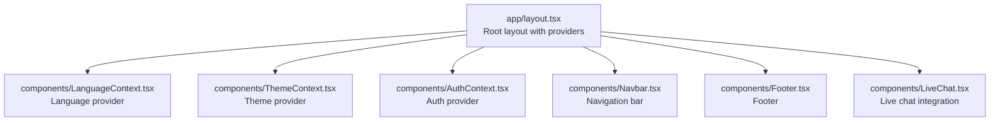
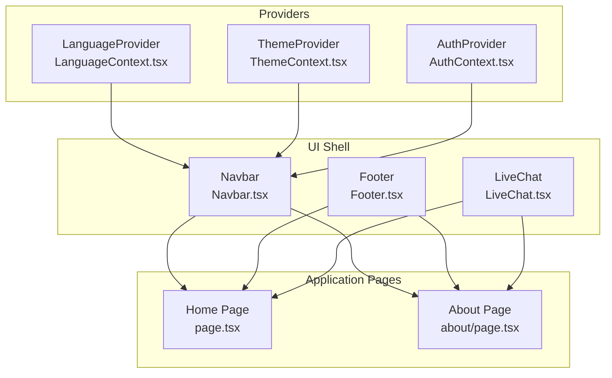
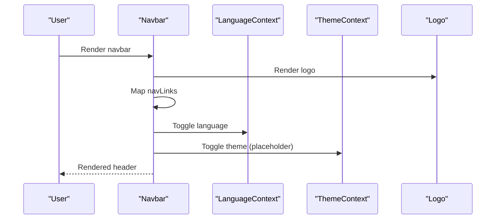
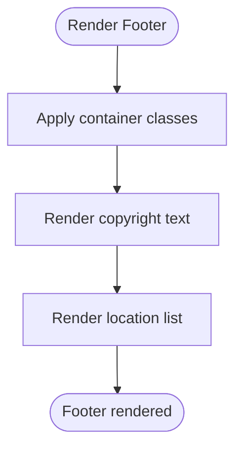
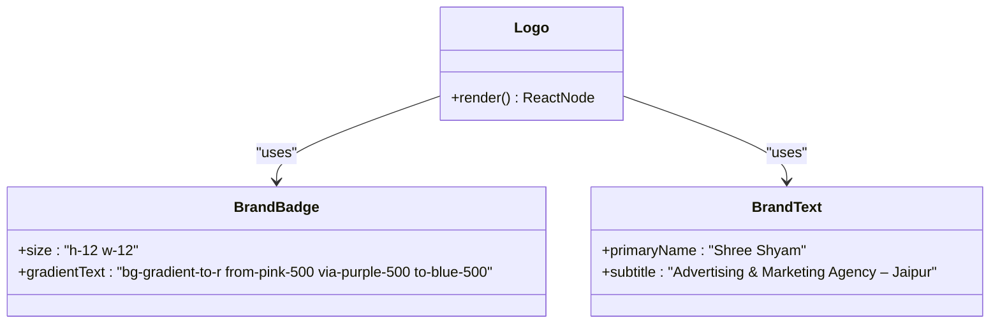
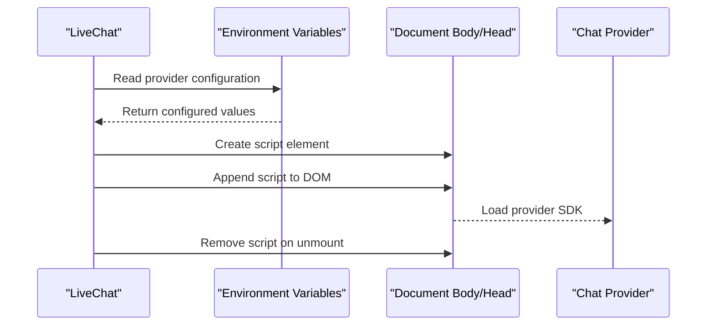
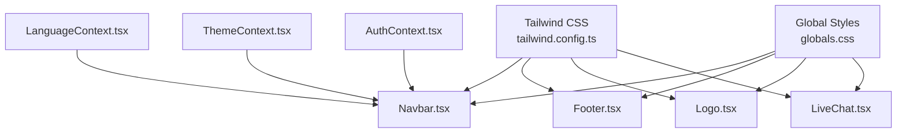

# Shared Components

<cite>
**Referenced Files in This Document**
- [Navbar.tsx](file://components/Navbar.tsx)
- [Footer.tsx](file://components/Footer.tsx)
- [Logo.tsx](file://components/Logo.tsx)
- [LiveChat.tsx](file://components/LiveChat.tsx)
- [LanguageContext.tsx](file://components/LanguageContext.tsx)
- [ThemeContext.tsx](file://components/ThemeContext.tsx)
- [AuthContext.tsx](file://components/AuthContext.tsx)
- [layout.tsx](file://app/layout.tsx)
- [globals.css](file://app/globals.css)
- [tailwind.config.ts](file://tailwind.config.ts)
- [page.tsx](file://app/page.tsx)
- [about/page.tsx](file://app/about/page.tsx)
</cite>

## Table of Contents
1. [Introduction](#introduction)
2. [Project Structure](#project-structure)
3. [Core Components](#core-components)
4. [Architecture Overview](#architecture-overview)
5. [Detailed Component Analysis](#detailed-component-analysis)
6. [Dependency Analysis](#dependency-analysis)
7. [Performance Considerations](#performance-considerations)
8. [Troubleshooting Guide](#troubleshooting-guide)
9. [Conclusion](#conclusion)

## Introduction
This document provides comprehensive documentation for the shared UI components library used across the application. It focuses on four key components: Navbar, Footer, Logo, and LiveChat. The documentation covers component structure, props, styling with Tailwind CSS, responsive behavior, internationalization support, accessibility considerations, and integration patterns within the overall application architecture.

## Project Structure
The shared components are located under the components directory and are integrated into the application layout. The layout orchestrates providers for authentication, language, and theming, while rendering the Navbar, main content, Footer, and LiveChat components.

**Diagram sources**
- [layout.tsx:17-46](file://app/layout.tsx#L17-L46)
- [Navbar.tsx:19-60](file://components/Navbar.tsx#L19-L60)
- [Footer.tsx:1-17](file://components/Footer.tsx#L1-L17)
- [LiveChat.tsx:12-50](file://components/LiveChat.tsx#L12-L50)
- [LanguageContext.tsx:23-50](file://components/LanguageContext.tsx#L23-L50)
- [ThemeContext.tsx:14-27](file://components/ThemeContext.tsx#L14-L27)
- [AuthContext.tsx:29-60](file://components/AuthContext.tsx#L29-L60)

**Section sources**
- [layout.tsx:17-46](file://app/layout.tsx#L17-L46)
- [globals.css:28-31](file://app/globals.css#L28-L31)

## Core Components
This section provides an overview of each component's purpose, structure, and integration points.

- Navbar: Provides top-level navigation, branding, language toggle, and theme toggle controls.
- Footer: Displays copyright and location information with responsive layout.
- Logo: Implements the brand identity with visual elements and typography.
- LiveChat: Integrates external chat services (Tawk.to or Crisp) via client-side script loading.

**Section sources**
- [Navbar.tsx:6-17](file://components/Navbar.tsx#L6-L17)
- [Footer.tsx:1-17](file://components/Footer.tsx#L1-L17)
- [Logo.tsx:1-22](file://components/Logo.tsx#L1-L22)
- [LiveChat.tsx:5-9](file://components/LiveChat.tsx#L5-L9)

## Architecture Overview
The components integrate with a layered provider architecture. Providers manage global state for language, theme, and authentication, while the layout composes the visual shell of the application.

**Diagram sources**
- [layout.tsx:17-46](file://app/layout.tsx#L17-L46)
- [LanguageContext.tsx:23-50](file://components/LanguageContext.tsx#L23-L50)
- [ThemeContext.tsx:14-27](file://components/ThemeContext.tsx#L14-L27)
- [AuthContext.tsx:29-60](file://components/AuthContext.tsx#L29-L60)
- [Navbar.tsx:19-60](file://components/Navbar.tsx#L19-L60)
- [Footer.tsx:1-17](file://components/Footer.tsx#L1-L17)
- [LiveChat.tsx:12-50](file://components/LiveChat.tsx#L12-L50)
- [page.tsx:4-87](file://app/page.tsx#L4-L87)
- [about/page.tsx:1-59](file://app/about/page.tsx#L1-L59)

## Detailed Component Analysis

### Navbar Component
The Navbar component renders the application header with branding, navigation links, and interactive controls for language and theme switching.

- Navigation Links: Defined as a static array with href, key, and localized labels for English and Hindi.
- Responsive Design: Desktop navigation is hidden on small screens; a mobile-friendly layout is implied by the container and spacing classes.
- Internationalization: Language selection toggles between English and Hindi labels for navigation items.
- Theming: Theme toggle button is present but currently disabled; theme state is managed by ThemeProvider.
- Accessibility: Uses semantic Link components and appropriate contrast classes for light/dark modes.

**Diagram sources**
- [Navbar.tsx:19-60](file://components/Navbar.tsx#L19-L60)
- [LanguageContext.tsx:53-57](file://components/LanguageContext.tsx#L53-L57)
- [ThemeContext.tsx:29-33](file://components/ThemeContext.tsx#L29-L33)
- [Logo.tsx:1-22](file://components/Logo.tsx#L1-L22)

Key implementation details:
- Navigation links array defines href, key, and localized labels.
- Language state is temporarily hardcoded to demonstrate i18n structure.
- Theme state is temporarily hardcoded to demonstrate theming structure.
- Styling uses Tailwind utility classes for responsive layout and dark mode variants.

Customization options:
- Add or modify navLinks entries to change navigation structure.
- Integrate useLanguage and useTheme hooks to enable interactive toggles.
- Extend responsive breakpoints by adjusting Tailwind classes.

Integration patterns:
- Consumed by RootLayout to wrap page content.
- Composed with Logo and interactive buttons.

**Section sources**
- [Navbar.tsx:6-17](file://components/Navbar.tsx#L6-L17)
- [Navbar.tsx:19-60](file://components/Navbar.tsx#L19-L60)
- [layout.tsx:27-28](file://app/layout.tsx#L27-L28)

### Footer Component
The Footer component displays copyright and location information with a responsive layout.

- Content Organization: Copyright notice and location list arranged in a column on small screens and row on medium screens.
- Styling: Uses dark mode variants and subtle typography adjustments for readability.
- Responsiveness: Flexbox layout adapts to screen size with appropriate spacing and alignment.

**Diagram sources**
- [Footer.tsx:1-17](file://components/Footer.tsx#L1-L17)

Customization options:
- Modify copyright text and location list to reflect current business details.
- Adjust typography and spacing classes for different branding requirements.

Integration patterns:
- Consumed by RootLayout beneath page content.

**Section sources**
- [Footer.tsx:1-17](file://components/Footer.tsx#L1-L17)
- [layout.tsx:38-39](file://app/layout.tsx#L38-L39)

### Logo Component
The Logo component implements the brand identity with a visual element and typography.

- Branding Elements: Circular badge with gradient text and brand name with subtitle.
- Typography: Primary color for brand name and muted color for subtitle.
- Styling: Tailwind classes define sizing, spacing, and visual effects.

**Diagram sources**
- [Logo.tsx:1-22](file://components/Logo.tsx#L1-L22)

Customization options:
- Adjust gradient colors to match brand guidelines.
- Modify typography sizes and weights for different contexts.
- Change spacing and alignment for various layouts.

Integration patterns:
- Used within Navbar and potentially other header components.

**Section sources**
- [Logo.tsx:1-22](file://components/Logo.tsx#L1-L22)
- [Navbar.tsx:28](file://components/Navbar.tsx#L28)

### LiveChat Component
The LiveChat component integrates external chat services (Tawk.to or Crisp) by dynamically loading provider scripts.

- Provider Types: Supports "tawk" and "crisp" providers via union type.
- Environment Configuration: Requires NEXT_PUBLIC_TAWK_PROPERTY_ID, NEXT_PUBLIC_TAWK_WIDGET_ID, or NEXT_PUBLIC_CRISP_WEBSITE_ID.
- Client-Side Loading: Uses useEffect to inject scripts and clean up on unmount.
- Conditional Loading: Scripts are only loaded when environment variables are present.

**Diagram sources**
- [LiveChat.tsx:12-50](file://components/LiveChat.tsx#L12-L50)

Configuration options:
- provider: Select "tawk" or "crisp".
- Environment variables: Configure according to provider requirements.

Integration patterns:
- Consumed by RootLayout to initialize chat services globally.

**Section sources**
- [LiveChat.tsx:5-9](file://components/LiveChat.tsx#L5-L9)
- [LiveChat.tsx:12-50](file://components/LiveChat.tsx#L12-L50)
- [layout.tsx:39](file://app/layout.tsx#L39)

## Dependency Analysis
The components rely on Tailwind CSS for styling and Next.js for routing. Providers manage cross-cutting concerns and are composed in the layout.

**Diagram sources**
- [tailwind.config.ts:3-27](file://tailwind.config.ts#L3-L27)
- [globals.css:1-32](file://app/globals.css#L1-L32)
- [Navbar.tsx:19-60](file://components/Navbar.tsx#L19-L60)
- [Footer.tsx:1-17](file://components/Footer.tsx#L1-L17)
- [Logo.tsx:1-22](file://components/Logo.tsx#L1-L22)
- [LiveChat.tsx:12-50](file://components/LiveChat.tsx#L12-L50)
- [LanguageContext.tsx:23-50](file://components/LanguageContext.tsx#L23-L50)
- [ThemeContext.tsx:14-27](file://components/ThemeContext.tsx#L14-L27)
- [AuthContext.tsx:29-60](file://components/AuthContext.tsx#L29-L60)

**Section sources**
- [tailwind.config.ts:3-27](file://tailwind.config.ts#L3-L27)
- [globals.css:1-32](file://app/globals.css#L1-L32)

## Performance Considerations
- Client-side rendering: LiveChat runs on the client to avoid server-side script injection.
- Conditional loading: Scripts are only injected when environment variables are present.
- Provider composition: Language and theme providers minimize re-renders using memoization.
- Tailwind utilities: Utility-first approach reduces CSS bundle size compared to custom styles.

## Troubleshooting Guide
Common issues and resolutions:
- LiveChat not appearing:
  - Verify NEXT_PUBLIC_TAWK_PROPERTY_ID/NEXT_PUBLIC_TAWK_WIDGET_ID or NEXT_PUBLIC_CRISP_WEBSITE_ID are set.
  - Ensure provider prop matches the configured service.
- Language toggle not working:
  - Confirm LanguageProvider wraps the Navbar component.
  - Check localStorage keys and browser support.
- Theme toggle not working:
  - Confirm ThemeProvider is active and not overridden by hardcoded values.
  - Verify dark mode classes are applied correctly.

**Section sources**
- [LiveChat.tsx:16-19](file://components/LiveChat.tsx#L16-L19)
- [LiveChat.tsx:32-35](file://components/LiveChat.tsx#L32-L35)
- [LanguageContext.tsx:23-50](file://components/LanguageContext.tsx#L23-L50)
- [ThemeContext.tsx:14-27](file://components/ThemeContext.tsx#L14-L27)

## Conclusion
The shared UI components library provides a cohesive foundation for the application's user interface. The Navbar, Footer, Logo, and LiveChat components are designed with responsiveness, internationalization, and accessibility in mind. Integration with providers ensures consistent state management across the application. The modular structure allows for easy customization and extension while maintaining design consistency.