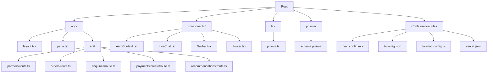
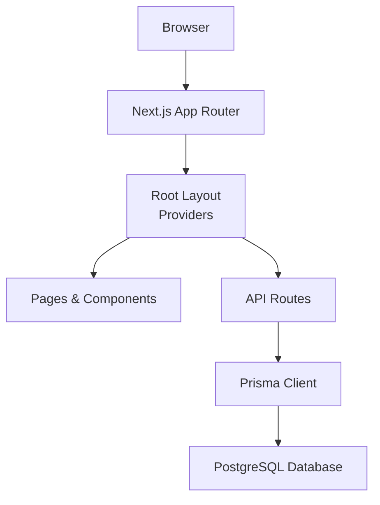
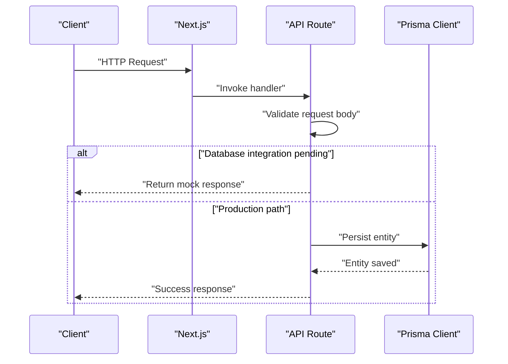
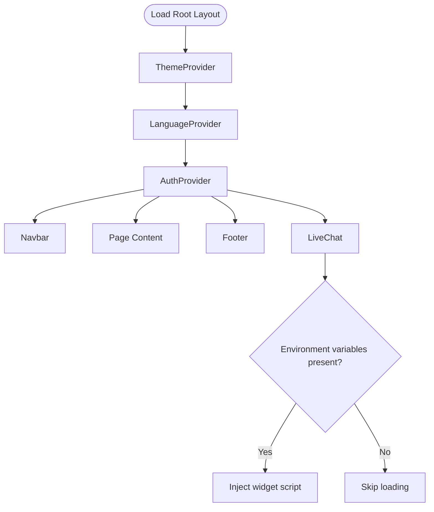
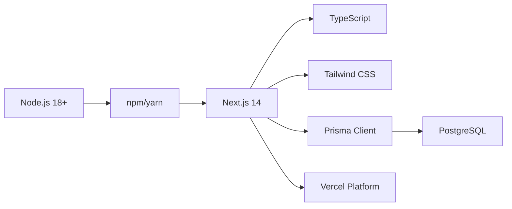

# Getting Started

<cite>
**Referenced Files in This Document**
- [package.json](file://package.json)
- [prisma/schema.prisma](file://prisma/schema.prisma)
- [lib/prisma.ts](file://lib/prisma.ts)
- [next.config.mjs](file://next.config.mjs)
- [vercel.json](file://vercel.json)
- [DEPLOYMENT.md](file://DEPLOYMENT.md)
- [tsconfig.json](file://tsconfig.json)
- [tailwind.config.ts](file://tailwind.config.ts)
- [app/layout.tsx](file://app/layout.tsx)
- [components/AuthContext.tsx](file://components/AuthContext.tsx)
- [components/LiveChat.tsx](file://components/LiveChat.tsx)
- [app/api/partners/route.ts](file://app/api/partners/route.ts)
- [app/api/orders/route.ts](file://app/api/orders/route.ts)
- [test-backend.js](file://test-backend.js)
</cite>

## Table of Contents
1. [Introduction](#introduction)
2. [Project Structure](#project-structure)
3. [Core Components](#core-components)
4. [Architecture Overview](#architecture-overview)
5. [Detailed Component Analysis](#detailed-component-analysis)
6. [Dependency Analysis](#dependency-analysis)
7. [Performance Considerations](#performance-considerations)
8. [Troubleshooting Guide](#troubleshooting-guide)
9. [Conclusion](#conclusion)
10. [Appendices](#appendices)

## Introduction
This guide helps you set up the Shree Shyam Agency Portal for local development and deploy it to production. It covers prerequisites, environment setup, database configuration, development workflow, verification steps, common issues, and deployment to Vercel. The portal is a Next.js 14 application using TypeScript, Tailwind CSS, Prisma ORM, and PostgreSQL.

## Project Structure
The project follows a modern Next.js App Router layout with:
- app/: Page components, API routes, and shared assets
- components/: Reusable UI and context providers
- lib/: Shared libraries (e.g., Prisma client)
- prisma/: Prisma schema and migrations
- Configuration files for Next.js, TypeScript, Tailwind CSS, and Vercel



**Diagram sources**
- [app/layout.tsx:17-46](file://app/layout.tsx#L17-L46)
- [app/api/partners/route.ts:1-90](file://app/api/partners/route.ts#L1-L90)
- [app/api/orders/route.ts:1-68](file://app/api/orders/route.ts#L1-L68)
- [lib/prisma.ts:1-17](file://lib/prisma.ts#L1-L17)
- [prisma/schema.prisma:1-159](file://prisma/schema.prisma#L1-L159)
- [next.config.mjs:1-14](file://next.config.mjs#L1-L14)
- [tsconfig.json:1-42](file://tsconfig.json#L1-L42)
- [tailwind.config.ts:1-31](file://tailwind.config.ts#L1-L31)
- [vercel.json:1-22](file://vercel.json#L1-L22)

**Section sources**
- [package.json:1-44](file://package.json#L1-L44)
- [DEPLOYMENT.md:1-79](file://DEPLOYMENT.md#L1-L79)

## Core Components
- Prisma ORM: Provides strongly-typed database access and schema definitions for PostgreSQL.
- Next.js App Router: Routes and pages under app/.
- API Routes: Server endpoints under app/api/ for partners, orders, payments, recommendations, and enquiries.
- Context Providers: Authentication and live chat providers in components/.
- Styling: Tailwind CSS configured via tailwind.config.ts.
- Build and Runtime: Next.js configuration and Vercel deployment settings.

Key implementation references:
- Prisma client initialization and logging: [lib/prisma.ts:1-17](file://lib/prisma.ts#L1-L17)
- Prisma schema and enums: [prisma/schema.prisma:1-159](file://prisma/schema.prisma#L1-L159)
- Next.js configuration: [next.config.mjs:1-14](file://next.config.mjs#L1-L14)
- Vercel build and runtime settings: [vercel.json:1-22](file://vercel.json#L1-L22)
- Root layout and providers: [app/layout.tsx:17-46](file://app/layout.tsx#L17-L46)
- Authentication context: [components/AuthContext.tsx:1-70](file://components/AuthContext.tsx#L1-L70)
- Live chat provider: [components/LiveChat.tsx:1-52](file://components/LiveChat.tsx#L1-L52)

**Section sources**
- [lib/prisma.ts:1-17](file://lib/prisma.ts#L1-L17)
- [prisma/schema.prisma:1-159](file://prisma/schema.prisma#L1-L159)
- [next.config.mjs:1-14](file://next.config.mjs#L1-L14)
- [vercel.json:1-22](file://vercel.json#L1-L22)
- [app/layout.tsx:17-46](file://app/layout.tsx#L17-L46)
- [components/AuthContext.tsx:1-70](file://components/AuthContext.tsx#L1-L70)
- [components/LiveChat.tsx:1-52](file://components/LiveChat.tsx#L1-L52)

## Architecture Overview
High-level flow:
- Client browser requests pages or API endpoints.
- Next.js handles routing and renders pages with providers.
- API routes process requests and interact with the Prisma client.
- Prisma connects to PostgreSQL using DATABASE_URL.



**Diagram sources**
- [app/layout.tsx:17-46](file://app/layout.tsx#L17-L46)
- [lib/prisma.ts:1-17](file://lib/prisma.ts#L1-L17)
- [prisma/schema.prisma:5-8](file://prisma/schema.prisma#L5-L8)

## Detailed Component Analysis

### Prisma and Database Setup
- Schema defines models for User, PartnerProfile, Order, Payment, and RecommendationRequest, plus enums for roles, types, statuses, and payment providers.
- The Prisma client is initialized once and reused during development, with logging enabled for warnings and errors.
- DATABASE_URL is sourced from environment variables.

```mermaid
classDiagram
class User {
+String id
+String mobile
+String? email
+UserRole role
+DateTime createdAt
+DateTime updatedAt
}
class PartnerProfile {
+String id
+String userId
+PartnerType type
+String area
+Decimal walletBalance
+Decimal commissionRate
+String status
+DateTime createdAt
+DateTime updatedAt
}
class Order {
+String id
+String publicId
+String clientName
+String clientMobile
+String clientArea
+ServiceType serviceType
+OrderStatus status
+Decimal? budget
+Decimal? totalAmount
+DateTime createdAt
+DateTime updatedAt
}
class Payment {
+String id
+String orderId
+String? userId
+Decimal amount
+String currency
+PaymentStatus status
+PaymentProvider provider
+String? providerPaymentId
+DateTime? paidAt
+DateTime createdAt
}
User ||--o{ PartnerProfile : "hasOne"
User ||--o{ Order : "created"
User ||--o{ Payment : "made"
Order ||--o{ Payment : "has"
PartnerProfile ||--o{ Order : "assigned"
```

**Diagram sources**
- [prisma/schema.prisma:57-144](file://prisma/schema.prisma#L57-L144)

**Section sources**
- [prisma/schema.prisma:1-159](file://prisma/schema.prisma#L1-L159)
- [lib/prisma.ts:1-17](file://lib/prisma.ts#L1-L17)

### API Routes: Partners and Orders
- Partners endpoint supports listing and creating partner applications with validation and logging.
- Orders endpoint supports listing and creating orders with validation and logging.



**Diagram sources**
- [app/api/partners/route.ts:29-88](file://app/api/partners/route.ts#L29-L88)
- [app/api/orders/route.ts:30-66](file://app/api/orders/route.ts#L30-L66)

**Section sources**
- [app/api/partners/route.ts:1-90](file://app/api/partners/route.ts#L1-L90)
- [app/api/orders/route.ts:1-68](file://app/api/orders/route.ts#L1-L68)

### Authentication and Live Chat Providers
- AuthContext manages a minimal client-side role/moble state with localStorage persistence.
- LiveChat injects third-party chat widgets (Tawk.to or Crisp) based on environment variables.



**Diagram sources**
- [app/layout.tsx:17-46](file://app/layout.tsx#L17-L46)
- [components/AuthContext.tsx:29-60](file://components/AuthContext.tsx#L29-L60)
- [components/LiveChat.tsx:12-47](file://components/LiveChat.tsx#L12-L47)

**Section sources**
- [components/AuthContext.tsx:1-70](file://components/AuthContext.tsx#L1-L70)
- [components/LiveChat.tsx:1-52](file://components/LiveChat.tsx#L1-L52)

## Dependency Analysis
- Node.js and npm: Required for building and running the project.
- Next.js 14: App Router, strict mode, and framework configuration.
- Prisma: Client and CLI for schema and migrations.
- PostgreSQL: Database provider for Prisma.
- Tailwind CSS: Utility-first styling.
- TypeScript: Type safety and build configuration.



**Diagram sources**
- [DEPLOYMENT.md:61-63](file://DEPLOYMENT.md#L61-L63)
- [package.json:13-28](file://package.json#L13-L28)
- [prisma/schema.prisma:5-8](file://prisma/schema.prisma#L5-L8)
- [vercel.json:1-22](file://vercel.json#L1-L22)

**Section sources**
- [package.json:13-42](file://package.json#L13-L42)
- [DEPLOYMENT.md:61-63](file://DEPLOYMENT.md#L61-L63)
- [tsconfig.json:1-42](file://tsconfig.json#L1-L42)
- [tailwind.config.ts:1-31](file://tailwind.config.ts#L1-L31)

## Performance Considerations
- Keep Prisma client initialization scoped and avoid unnecessary re-instantiation.
- Use database enums and relations to minimize application-level logic.
- Enable strict TypeScript settings to catch performance and correctness issues early.
- Configure Tailwind content paths to avoid scanning unnecessary folders.

[No sources needed since this section provides general guidance]

## Troubleshooting Guide
Common setup issues and resolutions:
- Missing DATABASE_URL
  - Symptom: Prisma client fails to connect.
  - Fix: Set DATABASE_URL to a valid PostgreSQL connection string.
- Prisma client errors in development
  - Symptom: Errors related to client instantiation or logs.
  - Fix: Ensure Prisma client is initialized once and NODE_ENV is not production during local runs.
- API routes return mock data
  - Symptom: Endpoints return placeholder responses.
  - Fix: Implement database persistence using Prisma in production-ready code.
- Live chat not appearing
  - Symptom: Chat widget does not load.
  - Fix: Set NEXT_PUBLIC_TAWK_PROPERTY_ID and NEXT_PUBLIC_TAWK_WIDGET_ID or NEXT_PUBLIC_CRISP_WEBSITE_ID as required.
- Build failures
  - Symptom: Lint or build errors.
  - Fix: Run lint checks, install dependencies, and verify environment variables.

Verification steps:
- Start the development server and open the home page.
- Use the backend test script to validate API endpoints.
- Confirm Prisma client logs show warnings/errors appropriately.

**Section sources**
- [lib/prisma.ts:13-15](file://lib/prisma.ts#L13-L15)
- [prisma/schema.prisma:5-8](file://prisma/schema.prisma#L5-L8)
- [components/LiveChat.tsx:17-19](file://components/LiveChat.tsx#L17-L19)
- [test-backend.js:4-86](file://test-backend.js#L4-L86)
- [DEPLOYMENT.md:72-79](file://DEPLOYMENT.md#L72-L79)

## Conclusion
You now have the essentials to set up the Shree Shyam Agency Portal locally, configure the database, run the development server, and deploy to Vercel. Use the verification steps and troubleshooting tips to resolve common issues quickly.

[No sources needed since this section summarizes without analyzing specific files]

## Appendices

### Prerequisites
- Node.js 18+ and npm or yarn
- PostgreSQL database
- Prisma CLI installed globally or via devDependencies

**Section sources**
- [DEPLOYMENT.md:61-63](file://DEPLOYMENT.md#L61-L63)
- [package.json:39-39](file://package.json#L39-L39)

### Environment Variables
Required for local and production operation:
- DATABASE_URL: PostgreSQL connection string
- NEXT_PUBLIC_APP_URL: Deployed app URL
- NEXT_PUBLIC_TAWK_PROPERTY_ID, NEXT_PUBLIC_TAWK_WIDGET_ID, or NEXT_PUBLIC_CRISP_WEBSITE_ID: Live chat provider identifiers

**Section sources**
- [prisma/schema.prisma:7-7](file://prisma/schema.prisma#L7-L7)
- [DEPLOYMENT.md:54-57](file://DEPLOYMENT.md#L54-L57)
- [components/LiveChat.tsx:17-19](file://components/LiveChat.tsx#L17-L19)

### Step-by-Step Local Setup
1. Install dependencies
   - Run the standard install command.
2. Start the development server
   - Launch the Next.js dev server.
3. Open the application
   - Visit the local URL.

**Section sources**
- [DEPLOYMENT.md:5-15](file://DEPLOYMENT.md#L5-L15)

### Database Configuration
- Prisma datasource uses PostgreSQL and reads DATABASE_URL from environment variables.
- Initialize and apply migrations using Prisma commands.

**Section sources**
- [prisma/schema.prisma:5-8](file://prisma/schema.prisma#L5-L8)
- [package.json:10-11](file://package.json#L10-L11)

### Development Workflow
- Run the dev server, iterate on pages and API routes, and verify with the backend test script.
- Use TypeScript and ESLint for code quality.

**Section sources**
- [DEPLOYMENT.md:3-16](file://DEPLOYMENT.md#L3-L16)
- [test-backend.js:4-86](file://test-backend.js#L4-L86)

### Verification Checklist
- Home page loads without errors.
- API endpoints respond as expected.
- Prisma client logs indicate expected behavior.
- Live chat widget loads when environment variables are set.

**Section sources**
- [test-backend.js:4-86](file://test-backend.js#L4-L86)
- [lib/prisma.ts:10-11](file://lib/prisma.ts#L10-L11)
- [components/LiveChat.tsx:17-19](file://components/LiveChat.tsx#L17-L19)

### Deployment to Vercel
- Automatic deployment: Connect your repository and let Vercel build and deploy.
- Manual deployment: Install the Vercel CLI, log in, and deploy to production.
- Build and runtime settings are defined in the platform configuration.

**Section sources**
- [DEPLOYMENT.md:29-51](file://DEPLOYMENT.md#L29-L51)
- [vercel.json:1-22](file://vercel.json#L1-L22)

### Quick Start for First-Time Contributors
- Fork and clone the repository.
- Install dependencies.
- Set environment variables locally.
- Start the dev server and explore pages and API routes.
- Use the backend test script to validate endpoints.

**Section sources**
- [DEPLOYMENT.md:3-16](file://DEPLOYMENT.md#L3-L16)
- [test-backend.js:4-86](file://test-backend.js#L4-L86)