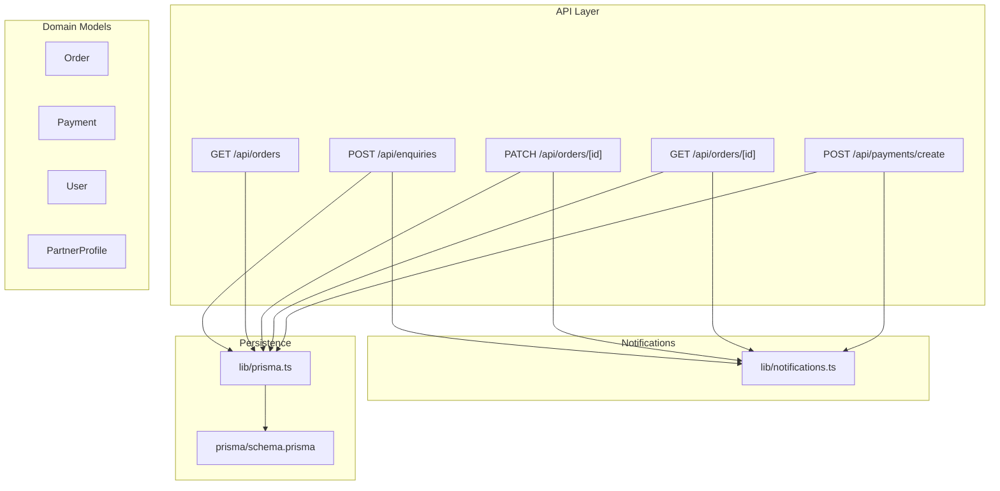
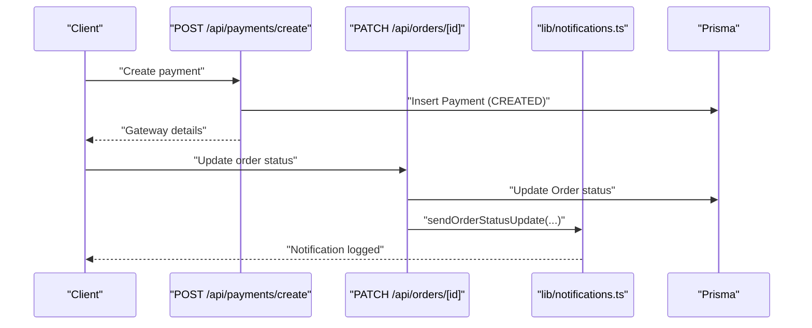
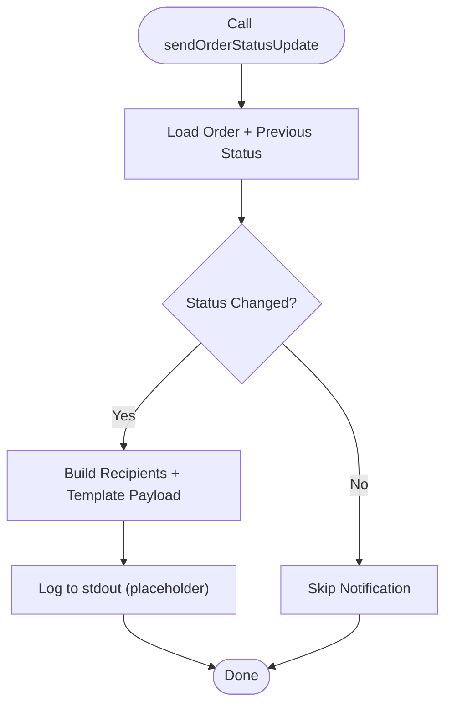
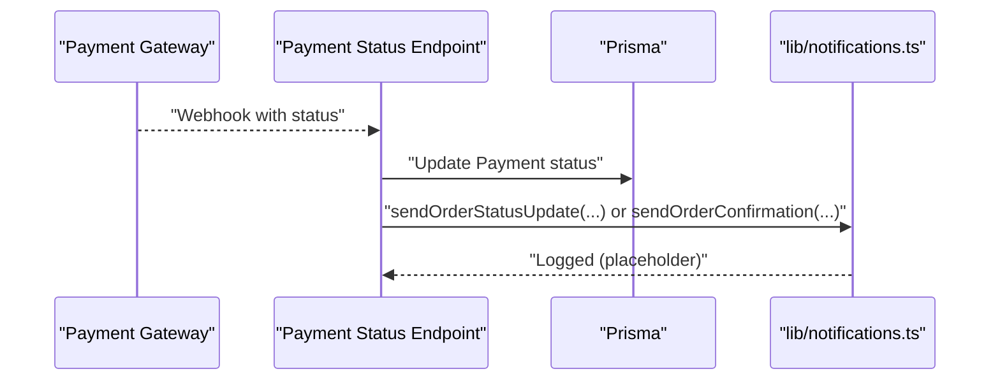
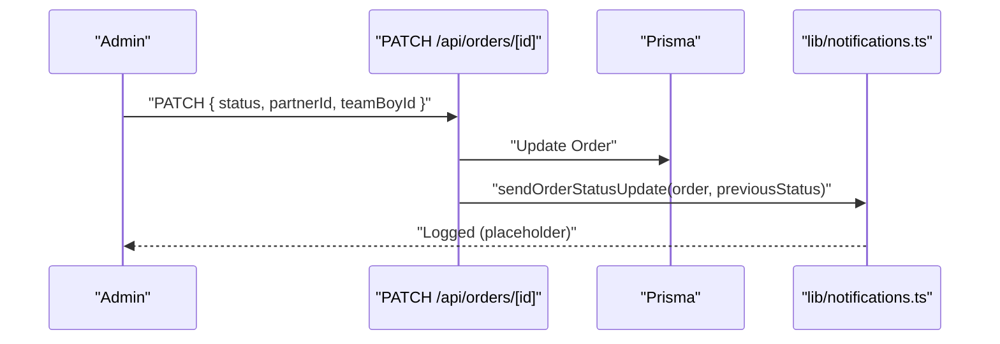
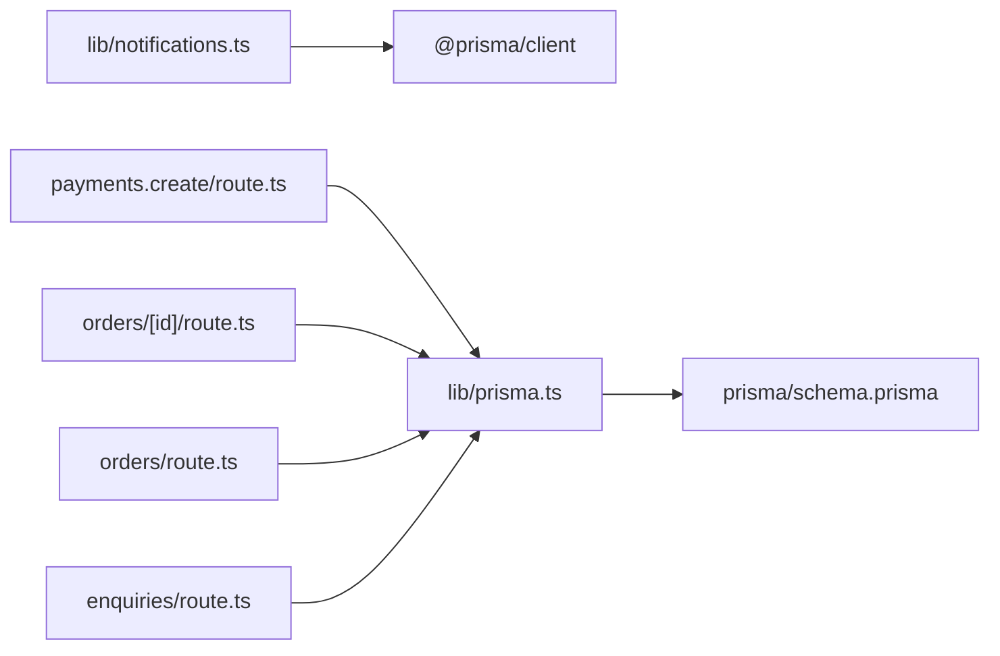
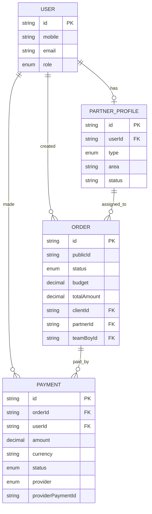
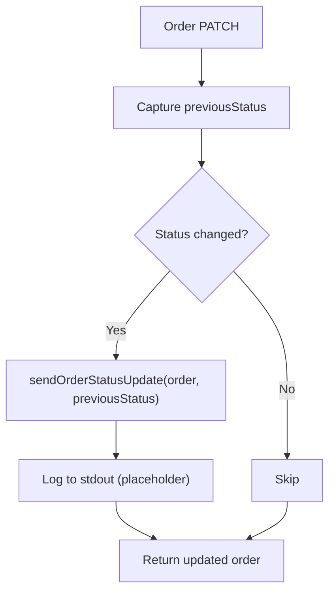
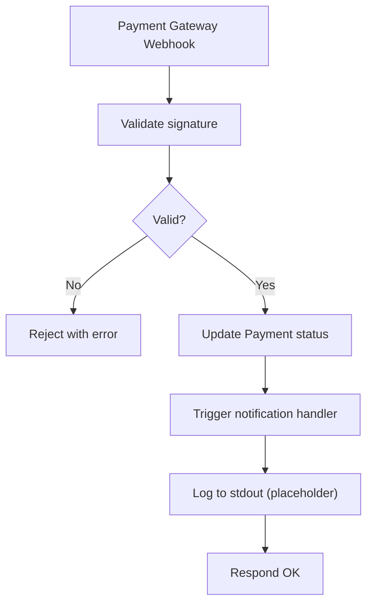

# Notification Systems

<cite>
**Referenced Files in This Document**
- [notifications.ts](file://lib/notifications.ts)
- [prisma.ts](file://lib/prisma.ts)
- [schema.prisma](file://prisma/schema.prisma)
- [payments.create.route.ts](file://app/api/payments/create/route.ts)
- [orders.id.route.ts](file://app/api/orders/[id]/route.ts)
- [orders.route.ts](file://app/api/orders/route.ts)
- [enquiries.route.ts](file://app/api/enquiries/route.ts)
- [partner-join.page.tsx](file://app/partner-join/page.tsx)
- [admin.orders.page.tsx](file://app/admin/orders/page.tsx)
- [dashboard.page.tsx](file://app/dashboard/page.tsx)
- [package.json](file://package.json)
</cite>

## Table of Contents
1. [Introduction](#introduction)
2. [Project Structure](#project-structure)
3. [Core Components](#core-components)
4. [Architecture Overview](#architecture-overview)
5. [Detailed Component Analysis](#detailed-component-analysis)
6. [Dependency Analysis](#dependency-analysis)
7. [Performance Considerations](#performance-considerations)
8. [Troubleshooting Guide](#troubleshooting-guide)
9. [Conclusion](#conclusion)
10. [Appendices](#appendices)

## Introduction
This document describes the notification and alerting system for payment and order lifecycle events. It covers:
- Notification triggers for payment events (success, failure, refund, status change)
- Delivery mechanisms (email, SMS, push notifications, in-app alerts)
- Templates, customization, and recipient management
- Webhook setup for external integrations
- Queuing, retries, and delivery confirmation
- Examples of configuration, custom handlers, and third-party service integration
- Analytics, metrics, and troubleshooting

Current implementation provides a central notification hub with placeholders for email/SMS providers and logging hooks for order and partner notifications.

## Project Structure
Key areas involved in notifications:
- Notification library: centralized functions for sending notifications
- Payment APIs: payment creation and status updates
- Order APIs: order creation, retrieval, and status updates
- Enquiries API: customer lead intake (with future notification hook)
- Prisma schema: data models for orders, payments, users, and statuses
- UI pages: admin dashboards and partner join flow that reference notifications

**Diagram sources**
- [payments.create.route.ts:1-46](file://app/api/payments/create/route.ts#L1-L46)
- [orders.id.route.ts:1-54](file://app/api/orders/[id]/route.ts#L1-L54)
- [orders.route.ts:1-129](file://app/api/orders/route.ts#L1-L129)
- [enquiries.route.ts:1-111](file://app/api/enquiries/route.ts#L1-L111)
- [notifications.ts:1-28](file://lib/notifications.ts#L1-L28)
- [prisma.ts:1-22](file://lib/prisma.ts#L1-L22)
- [schema.prisma:1-173](file://prisma/schema.prisma#L1-L173)

**Section sources**
- [notifications.ts:1-28](file://lib/notifications.ts#L1-L28)
- [prisma.ts:1-22](file://lib/prisma.ts#L1-L22)
- [schema.prisma:1-173](file://prisma/schema.prisma#L1-L173)
- [payments.create.route.ts:1-46](file://app/api/payments/create/route.ts#L1-L46)
- [orders.id.route.ts:1-54](file://app/api/orders/[id]/route.ts#L1-L54)
- [orders.route.ts:1-129](file://app/api/orders/route.ts#L1-L129)
- [enquiries.route.ts:1-111](file://app/api/enquiries/route.ts#L1-L111)

## Core Components
- Notification library: provides typed functions for partner application emails, order confirmations, and order status updates. These currently log to stdout and are marked for integration with real providers.
- Prisma models: define Order, Payment, User, and PartnerProfile with statuses enabling event-driven triggers.
- Payment API: creates payment records with initial status and returns gateway metadata.
- Order API: supports creation, retrieval, and status updates; status changes are ideal triggers for notifications.
- Enquiries API: accepts leads and includes a placeholder for outbound notifications.
- UI pages: reference notifications for admin workflows and partner onboarding.

**Section sources**
- [notifications.ts:1-28](file://lib/notifications.ts#L1-L28)
- [schema.prisma:91-144](file://prisma/schema.prisma#L91-L144)
- [payments.create.route.ts:23-31](file://app/api/payments/create/route.ts#L23-L31)
- [orders.id.route.ts:42-49](file://app/api/orders/[id]/route.ts#L42-L49)
- [enquiries.route.ts:62](file://app/api/enquiries/route.ts#L62)
- [partner-join.page.tsx:155](file://app/partner-join/page.tsx#L155-L158)
- [admin.orders.page.tsx:16-48](file://app/admin/orders/page.tsx#L16-L48)
- [dashboard.page.tsx:69-92](file://app/dashboard/page.tsx#L69-L92)

## Architecture Overview
The notification system is event-driven around domain changes:
- Payment creation sets a baseline for downstream status transitions.
- Order creation and status updates are primary triggers for customer and admin notifications.
- Partner onboarding and admin actions drive internal alerts.
- Future webhook endpoints can propagate real-time updates to external systems.

**Diagram sources**
- [payments.create.route.ts:6-44](file://app/api/payments/create/route.ts#L6-L44)
- [orders.id.route.ts:29-52](file://app/api/orders/[id]/route.ts#L29-L52)
- [notifications.ts:21-26](file://lib/notifications.ts#L21-L26)
- [prisma.ts:11-16](file://lib/prisma.ts#L11-L16)

## Detailed Component Analysis

### Notification Library
Responsibilities:
- Partner application email notifications
- Order confirmation notifications
- Order status update notifications

Implementation pattern:
- Asynchronous functions accepting typed parameters
- Logging to stdout as placeholders
- Ready for plugging in email/SMS providers

**Diagram sources**
- [notifications.ts:21-26](file://lib/notifications.ts#L21-L26)
- [orders.id.route.ts:42-49](file://app/api/orders/[id]/route.ts#L42-L49)

**Section sources**
- [notifications.ts:1-28](file://lib/notifications.ts#L1-L28)

### Payment Notification Triggers
Triggers:
- Payment created
- Payment status transitions: PENDING → SUCCESS, PENDING → FAILED, SUCCESS → REFUNDED

Current state:
- Payment creation endpoint inserts a record with initial status and returns gateway metadata
- No payment status update endpoint exists yet

Recommended implementation:
- Add a payment status update endpoint similar to order updates
- Invoke notification functions upon status changes
- Include payment metadata (provider, providerPaymentId) in templates

**Diagram sources**
- [payments.create.route.ts:23-31](file://app/api/payments/create/route.ts#L23-L31)
- [notifications.ts:14-19](file://lib/notifications.ts#L14-L19)
- [schema.prisma:125-144](file://prisma/schema.prisma#L125-L144)

**Section sources**
- [payments.create.route.ts:1-46](file://app/api/payments/create/route.ts#L1-L46)
- [schema.prisma:41-47](file://prisma/schema.prisma#L41-L47)

### Order Notification Triggers
Triggers:
- Order created
- Order status changes (e.g., PENDING → ASSIGNED, IN_PROGRESS, COMPLETED, CANCELLED)
- Order assignment to partner/team boy

Current state:
- Order creation endpoint validates inputs and persists order
- Order retrieval endpoint returns order with related entities
- Order patch endpoint updates status and assignees

Recommended implementation:
- Capture previous status before update
- Call sendOrderStatusUpdate with previousStatus
- Trigger sendOrderConfirmation on initial assignment/completion depending on business rules

**Diagram sources**
- [orders.id.route.ts:30-52](file://app/api/orders/[id]/route.ts#L30-L52)
- [notifications.ts:21-26](file://lib/notifications.ts#L21-L26)

**Section sources**
- [orders.route.ts:38-127](file://app/api/orders/route.ts#L38-L127)
- [orders.id.route.ts:11-52](file://app/api/orders/[id]/route.ts#L11-L52)

### Enquiries Notification Triggers
Triggers:
- New enquiry submission

Current state:
- Enquiry creation endpoint validates and persists
- Placeholder comment indicates future email/WhatsApp notifications

Recommended implementation:
- Add outbound notifications after successful enquiry save
- Support both customer confirmation and admin alert

**Section sources**
- [enquiries.route.ts:8-81](file://app/api/enquiries/route.ts#L8-L81)

### Delivery Mechanisms
Supported channels (as placeholders):
- Email
- SMS
- Push notifications
- In-app alerts

Implementation guidance:
- Replace console logs with provider SDKs (e.g., email/SMS gateways)
- Maintain a unified notification dispatcher that selects channel(s) per preference
- Store delivery attempts and outcomes for audit and retries

[No sources needed since this section provides general guidance]

### Templates, Customization, and Recipients
Template model:
- Parameterized payloads per event type
- Recipient resolution from order, user, and partner relations

Customization options:
- Per-user preferences for channels and frequency
- Event-specific templates with dynamic content (amount, status, provider)
- Admin broadcast templates for bulk alerts

Recipient management:
- Resolve recipients from Order.client, Order.partner, Order.teamBoy, and User
- Optional fallback to admin group for critical alerts

[No sources needed since this section provides general guidance]

### Webhook Setup for External Integrations
Recommended webhook endpoints:
- Payment status webhooks: receive updates from payment providers and update Payment records and notifications
- Order status webhooks: propagate order changes to external systems
- Admin-triggered webhooks: notify external systems when admin actions occur

Implementation steps:
- Create webhook endpoints mirroring the payment creation pattern
- Validate signatures and normalize payloads
- Update domain models and trigger notifications
- Return appropriate HTTP status codes and retry headers

[No sources needed since this section provides general guidance]

### Queuing, Retry, and Delivery Confirmation
Queueing:
- Use a job queue (e.g., Bull, Agenda) to decouple notifications from request handling
- Persist jobs with retry counts and backoff policies

Retry:
- Automatic retries with exponential backoff for transient failures
- Dead-letter queues for persistent failures

Delivery confirmation:
- Track delivery receipts per channel
- Record timestamps and metadata for analytics

[No sources needed since this section provides general guidance]

### Examples: Configuration, Handlers, and Third-Party Services
Example configurations:
- Email provider integration (e.g., SMTP, SendGrid, Resend)
- SMS provider integration (e.g., Twilio, MSG91)
- Push notification service (e.g., Firebase Cloud Messaging)
- In-app notification storage and delivery

Example handler patterns:
- Event listeners that transform domain events into notification jobs
- Batch processors for high-volume scenarios
- Idempotent handlers to prevent duplicate deliveries

Third-party service integration:
- Use official SDKs for reliable delivery and reporting
- Centralize credentials and configuration via environment variables
- Monitor provider rate limits and quotas

[No sources needed since this section provides general guidance]

## Dependency Analysis
- Notification library depends on Prisma types for typed parameters.
- Payment and order APIs depend on Prisma client for persistence.
- UI pages reference notification expectations for admin and partner flows.

**Diagram sources**
- [notifications.ts:1](file://lib/notifications.ts#L1)
- [payments.create.route.ts:2-3](file://app/api/payments/create/route.ts#L2-L3)
- [orders.id.route.ts:1-3](file://app/api/orders/[id]/route.ts#L1-L3)
- [orders.route.ts:1-3](file://app/api/orders/route.ts#L1-L3)
- [enquiries.route.ts:1-3](file://app/api/enquiries/route.ts#L1-L3)
- [prisma.ts:1](file://lib/prisma.ts#L1)
- [schema.prisma:1-8](file://prisma/schema.prisma#L1-L8)

**Section sources**
- [notifications.ts:1-2](file://lib/notifications.ts#L1-L2)
- [prisma.ts:1-22](file://lib/prisma.ts#L1-L22)
- [schema.prisma:1-8](file://prisma/schema.prisma#L1-L8)

## Performance Considerations
- Defer notifications to background jobs to avoid blocking API responses
- Use batching for high-volume notifications
- Cache frequently accessed recipient preferences
- Monitor provider latency and throughput; apply circuit breakers for degraded providers

[No sources needed since this section provides general guidance]

## Troubleshooting Guide
Common issues and resolutions:
- Notifications not firing: verify that event handlers are invoked and that notification functions are called with correct parameters
- Provider errors: inspect logs for provider SDK errors; implement retry with backoff
- Duplicate deliveries: ensure idempotency in handlers and deduplicate by event identifiers
- Missing recipients: validate relationships in domain models and ensure user preferences are stored and retrieved

Operational checks:
- Confirm Prisma client initialization and database connectivity
- Review console logs for notification dispatch attempts
- Verify environment variables for provider credentials

**Section sources**
- [prisma.ts:7-16](file://lib/prisma.ts#L7-L16)
- [notifications.ts:3-4](file://lib/notifications.ts#L3-L4)

## Conclusion
The notification system is currently a placeholder with typed functions ready for provider integration. To achieve robust, real-time, and auditable notifications:
- Integrate email/SMS providers and implement delivery confirmation
- Add payment status update endpoints and webhook receivers
- Implement queuing, retries, and idempotent handlers
- Define templates and recipient resolution logic
- Add analytics and monitoring for delivery metrics

[No sources needed since this section summarizes without analyzing specific files]

## Appendices

### Data Model Overview for Notifications

**Diagram sources**
- [schema.prisma:57-89](file://prisma/schema.prisma#L57-L89)
- [schema.prisma:91-123](file://prisma/schema.prisma#L91-L123)
- [schema.prisma:125-144](file://prisma/schema.prisma#L125-L144)

### Example Notification Flows

#### Order Status Change Flow

**Diagram sources**
- [orders.id.route.ts:30-52](file://app/api/orders/[id]/route.ts#L30-L52)
- [notifications.ts:21-26](file://lib/notifications.ts#L21-L26)

#### Payment Status Webhook Flow

**Diagram sources**
- [payments.create.route.ts:23-31](file://app/api/payments/create/route.ts#L23-L31)
- [notifications.ts:14-19](file://lib/notifications.ts#L14-L19)

### Dependencies Checklist
- Prisma client and schema
- Notification library
- Payment and order API routes
- UI pages referencing notifications

**Section sources**
- [package.json:13-28](file://package.json#L13-L28)
- [prisma.ts:1-22](file://lib/prisma.ts#L1-L22)
- [schema.prisma:1-173](file://prisma/schema.prisma#L1-L173)
- [notifications.ts:1-28](file://lib/notifications.ts#L1-L28)
- [payments.create.route.ts:1-46](file://app/api/payments/create/route.ts#L1-L46)
- [orders.id.route.ts:1-54](file://app/api/orders/[id]/route.ts#L1-L54)
- [orders.route.ts:1-129](file://app/api/orders/route.ts#L1-L129)
- [enquiries.route.ts:1-111](file://app/api/enquiries/route.ts#L1-L111)