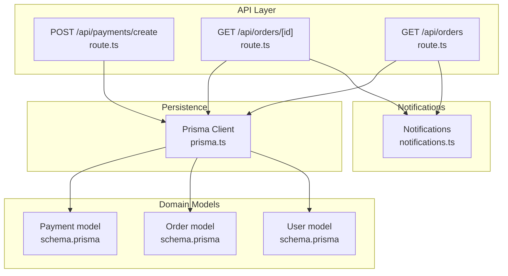
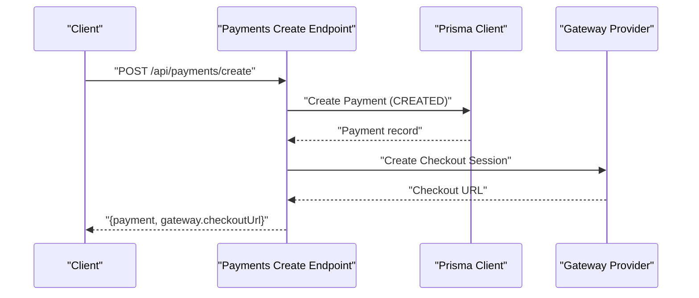
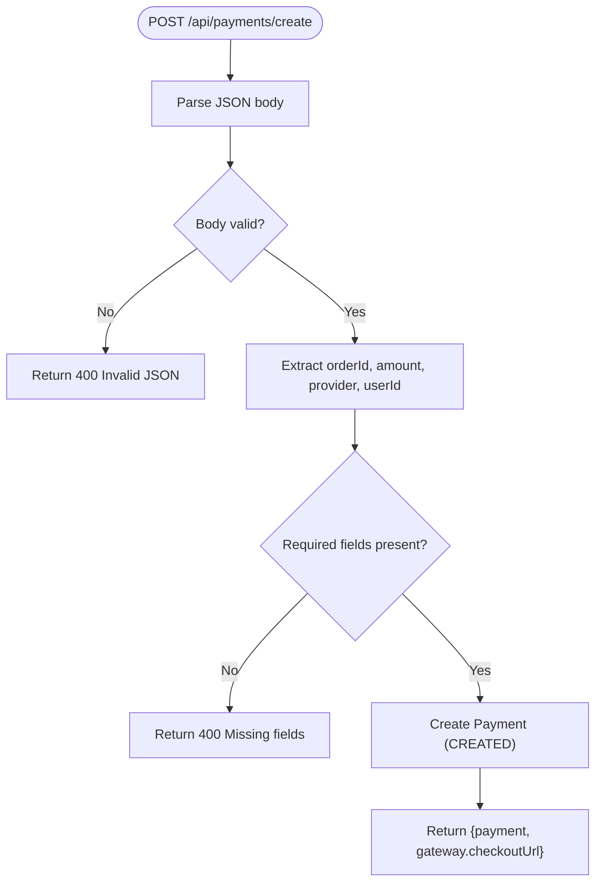
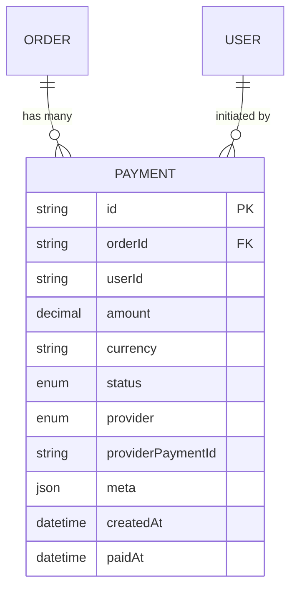
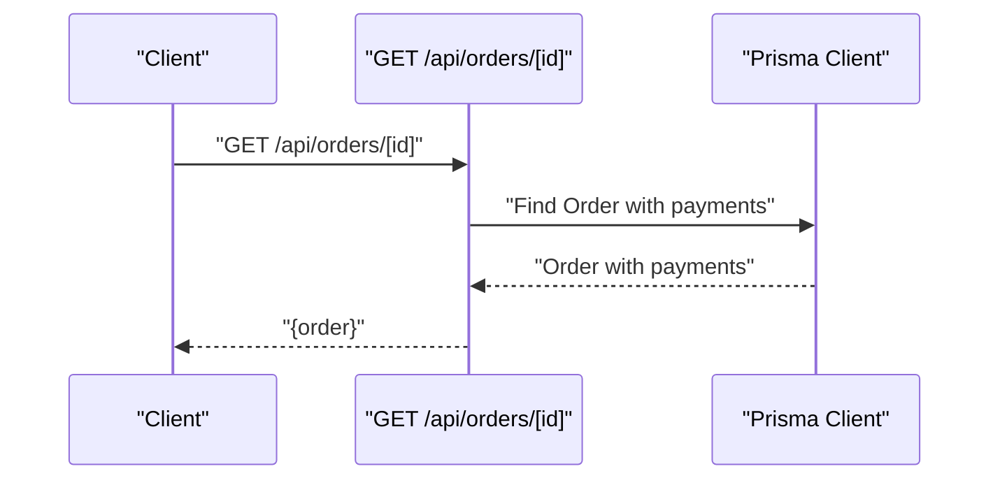
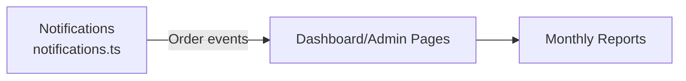
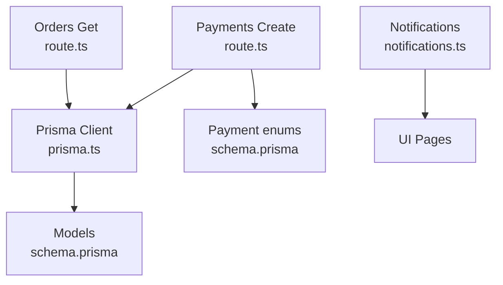

# Payment Integration

<cite>
**Referenced Files in This Document**
- [route.ts](file://app/api/payments/create/route.ts)
- [schema.prisma](file://prisma/schema.prisma)
- [prisma.ts](file://lib/prisma.ts)
- [route.ts](file://app/api/orders/[id]/route.ts)
- [route.ts](file://app/api/orders/route.ts)
- [notifications.ts](file://lib/notifications.ts)
- [page.tsx](file://app/admin/orders/page.tsx)
- [page.tsx](file://app/dashboard/page.tsx)
</cite>

## Table of Contents
1. [Introduction](#introduction)
2. [Project Structure](#project-structure)
3. [Core Components](#core-components)
4. [Architecture Overview](#architecture-overview)
5. [Detailed Component Analysis](#detailed-component-analysis)
6. [Dependency Analysis](#dependency-analysis)
7. [Performance Considerations](#performance-considerations)
8. [Security and Compliance](#security-and-compliance)
9. [Integration Examples](#integration-examples)
10. [Testing Strategies](#testing-strategies)
11. [Troubleshooting Guide](#troubleshooting-guide)
12. [Conclusion](#conclusion)

## Introduction
This document describes the multi-provider payment integration for the platform. It explains the current payment initiation flow, the underlying data model supporting multiple payment providers, and outlines how to extend the system to support payment webhooks, status updates, commission calculations, payouts, and financial reporting. It also covers configuration, error handling, security, and practical integration examples for major providers.

## Project Structure
The payment integration is centered around:
- A payment creation endpoint that initializes a payment record and returns a gateway checkout URL placeholder.
- A Prisma schema defining payment entities, statuses, and provider enums.
- An order-centric domain that links payments to orders and users.
- Notification hooks for order-related events.
- Admin and dashboard pages that surface earnings and reporting capabilities.

**Diagram sources**
- [route.ts:1-46](file://app/api/payments/create/route.ts#L1-L46)
- [route.ts:1-54](file://app/api/orders/[id]/route.ts#L1-L54)
- [route.ts:1-68](file://app/api/orders/route.ts#L1-L68)
- [schema.prisma:125-144](file://prisma/schema.prisma#L125-L144)
- [prisma.ts:1-17](file://lib/prisma.ts#L1-L17)
- [notifications.ts:1-27](file://lib/notifications.ts#L1-L27)

**Section sources**
- [route.ts:1-46](file://app/api/payments/create/route.ts#L1-L46)
- [schema.prisma:125-144](file://prisma/schema.prisma#L125-L144)
- [prisma.ts:1-17](file://lib/prisma.ts#L1-L17)
- [route.ts:1-54](file://app/api/orders/[id]/route.ts#L1-L54)
- [route.ts:1-68](file://app/api/orders/route.ts#L1-L68)
- [notifications.ts:1-27](file://lib/notifications.ts#L1-L27)

## Core Components
- Payment creation endpoint: Initializes a payment record with provider and amount, sets initial status, and returns a gateway checkout URL placeholder.
- Prisma models: Define payment lifecycle, provider choices, and relationships to orders and users.
- Order integration: Payments are linked to orders; order retrieval includes payment history.
- Notifications: Hooks for order confirmation and status updates; can be extended for payment events.

Key implementation references:
- Payment creation: [POST /api/payments/create:6-44](file://app/api/payments/create/route.ts#L6-L44)
- Payment schema: [Payment model:125-144](file://prisma/schema.prisma#L125-L144)
- Order retrieval with payments: [GET /api/orders/[id]](file://app/api/orders/[id]/route.ts#L12-L26)
- Notifications: [notifications.ts:1-27](file://lib/notifications.ts#L1-L27)

**Section sources**
- [route.ts:6-44](file://app/api/payments/create/route.ts#L6-L44)
- [schema.prisma:125-144](file://prisma/schema.prisma#L125-L144)
- [route.ts:12-26](file://app/api/orders/[id]/route.ts#L12-L26)
- [notifications.ts:1-27](file://lib/notifications.ts#L1-L27)

## Architecture Overview
The payment system follows a strategy-like pattern across providers (Razorpay, Paytm, Stripe, Cash, Other) defined by the provider enum. The current implementation creates a payment record and returns a placeholder checkout URL. A real-world extension would:
- Call the selected provider’s SDK to create a session/checkout.
- Store provider-specific identifiers.
- Implement webhooks to receive asynchronous status updates.
- Update payment records and trigger downstream actions (order status, notifications, commission calculations).

**Diagram sources**
- [route.ts:6-44](file://app/api/payments/create/route.ts#L6-L44)
- [schema.prisma:125-144](file://prisma/schema.prisma#L125-L144)

## Detailed Component Analysis

### Payment Creation Endpoint
Responsibilities:
- Validate incoming JSON and required fields.
- Persist a new payment with initial status and provider.
- Return a gateway checkout URL placeholder for redirection.

Processing logic highlights:
- Input validation and error responses.
- Payment record creation with default status and optional user association.
- Placeholder checkout URL returned to the client.

**Diagram sources**
- [route.ts:6-44](file://app/api/payments/create/route.ts#L6-L44)

**Section sources**
- [route.ts:6-44](file://app/api/payments/create/route.ts#L6-L44)

### Payment Data Model and Status Tracking
The Payment model captures:
- Monetary details (amount, currency).
- Provider and provider-specific reference.
- Lifecycle status (CREATED, PENDING, SUCCESS, FAILED, REFUNDED).
- Optional user association and timestamps.

**Diagram sources**
- [schema.prisma:125-144](file://prisma/schema.prisma#L125-L144)

**Section sources**
- [schema.prisma:125-144](file://prisma/schema.prisma#L125-L144)

### Order-Payment Relationship
Payments are associated with orders and users. Retrieving an order includes its payment history, enabling reconciliation and reporting.

**Diagram sources**
- [route.ts:12-26](file://app/api/orders/[id]/route.ts#L12-L26)
- [schema.prisma:117-128](file://prisma/schema.prisma#L117-L128)

**Section sources**
- [route.ts:12-26](file://app/api/orders/[id]/route.ts#L12-L26)
- [schema.prisma:117-128](file://prisma/schema.prisma#L117-L128)

### Notifications and Reporting Surfaces
- Notifications module provides hooks for order events; can be extended for payment events.
- Dashboard and admin pages expose earnings and reporting actions (download monthly statements/reports).

**Diagram sources**
- [notifications.ts:1-27](file://lib/notifications.ts#L1-L27)
- [page.tsx:171-183](file://app/dashboard/page.tsx#L171-L183)
- [page.tsx:1-91](file://app/admin/orders/page.tsx#L1-L91)

**Section sources**
- [notifications.ts:1-27](file://lib/notifications.ts#L1-L27)
- [page.tsx:171-183](file://app/dashboard/page.tsx#L171-L183)
- [page.tsx:1-91](file://app/admin/orders/page.tsx#L1-L91)

## Dependency Analysis
- The payment creation endpoint depends on Prisma for persistence and uses the PaymentProvider and PaymentStatus enums.
- Order retrieval depends on Prisma and includes payments for reconciliation.
- Notifications are decoupled and can be wired to payment events.

**Diagram sources**
- [route.ts:1-46](file://app/api/payments/create/route.ts#L1-L46)
- [prisma.ts:1-17](file://lib/prisma.ts#L1-L17)
- [schema.prisma:41-55](file://prisma/schema.prisma#L41-L55)
- [route.ts:1-54](file://app/api/orders/[id]/route.ts#L1-L54)
- [notifications.ts:1-27](file://lib/notifications.ts#L1-L27)

**Section sources**
- [route.ts:1-46](file://app/api/payments/create/route.ts#L1-L46)
- [prisma.ts:1-17](file://lib/prisma.ts#L1-L17)
- [schema.prisma:41-55](file://prisma/schema.prisma#L41-L55)
- [route.ts:1-54](file://app/api/orders/[id]/route.ts#L1-L54)
- [notifications.ts:1-27](file://lib/notifications.ts#L1-L27)

## Performance Considerations
- Keep payment creation lightweight; defer heavy operations to background jobs.
- Use database indexes on frequently queried fields (e.g., order ID, user ID, provider reference).
- Batch reconciliation queries for reporting to reduce round trips.
- Cache non-sensitive order/payment summaries for read-heavy dashboards.

## Security and Compliance
- PCI DSS: Do not store sensitive cardholder data. Use provider checkout sessions and tokens.
- HTTPS and secure cookies for all payment endpoints.
- Validate and sanitize all inputs; enforce rate limits on payment creation.
- Use signed webhooks and verify provider signatures before updating payment status.
- Restrict access to admin endpoints and limit who can patch order status.
- Encrypt sensitive fields at rest if stored beyond session duration.

## Integration Examples
Note: The following describe how to extend the system. Replace placeholders with your provider SDK and credentials.

- Razorpay
  - Create a checkout session via the provider SDK.
  - Capture providerPaymentId and redirect the client to the checkout URL.
  - Implement a webhook endpoint to receive payment confirmations and update Payment status accordingly.

- Paytm
  - Initialize a session using Paytm’s SDK.
  - Store provider reference and return checkout URL to the client.
  - Subscribe to Paytm webhooks to reconcile payments and update statuses.

- Stripe
  - Create a PaymentIntent or SetupIntent depending on use case.
  - Confirm on the client with Stripe.js and handle next actions.
  - Use webhooks to finalize payment and update Payment records.

- Cash/Other
  - Treat as direct bank transfer or cash-on-delivery.
  - Set status to PENDING initially; mark SUCCESS after manual verification.
  - Optionally integrate with a third-party cash collection provider and map their reference.

## Testing Strategies
- Unit tests for payment creation endpoint: validate error responses for invalid JSON and missing fields.
- Integration tests: simulate provider SDK calls and webhook deliveries; assert payment status transitions.
- End-to-end tests: complete flows from payment creation to webhook reconciliation.
- Load tests: assess payment creation throughput under concurrency.
- Mock provider responses to avoid real transactions during development.

## Troubleshooting Guide
Common issues and resolutions:
- Invalid JSON or missing fields: Ensure the client sends orderId, amount, and provider; server responds with 400.
- Payment not found: Verify order ID exists and belongs to the correct user.
- Duplicate payments: Check providerPaymentId uniqueness and deduplicate on webhook arrival.
- Webhook signature mismatch: Re-check provider secret and signature verification logic.
- Stuck in PENDING: Confirm webhook handler is reachable and updates Payment status; check logs for errors.

Operational references:
- Payment creation error handling: [POST /api/payments/create:8-21](file://app/api/payments/create/route.ts#L8-L21)
- Order retrieval error handling: [GET /api/orders/[id]](file://app/api/orders/[id]/route.ts#L22-L24)
- Notifications logging: [notifications.ts:10-26](file://lib/notifications.ts#L10-L26)

**Section sources**
- [route.ts:8-21](file://app/api/payments/create/route.ts#L8-L21)
- [route.ts:22-24](file://app/api/orders/[id]/route.ts#L22-L24)
- [notifications.ts:10-26](file://lib/notifications.ts#L10-L26)

## Conclusion
The current system establishes a robust foundation for multi-provider payments with a clear data model and a payment creation endpoint. Extending it to support provider webhooks, commission calculations, payouts, and financial reporting requires implementing webhook handlers, status reconciliation, and backend workflows. The provided diagrams, references, and guidance enable safe, scalable payment integrations while maintaining security and compliance.