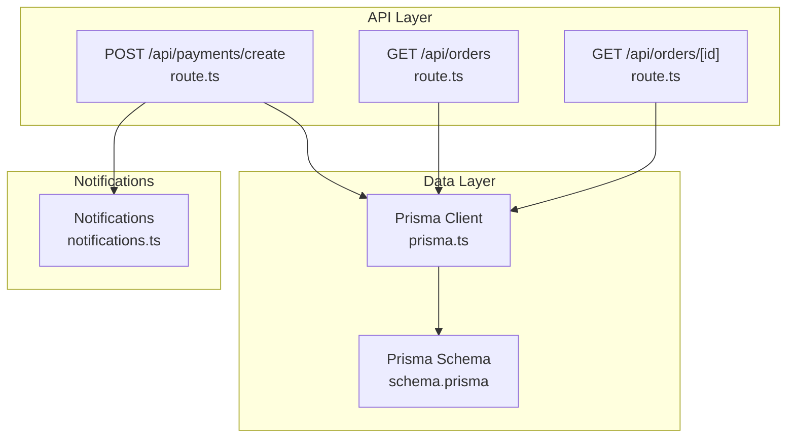
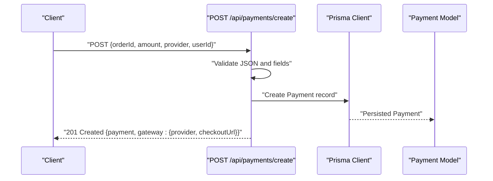
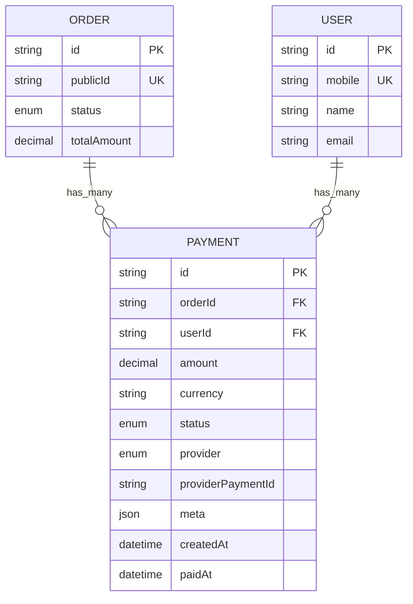
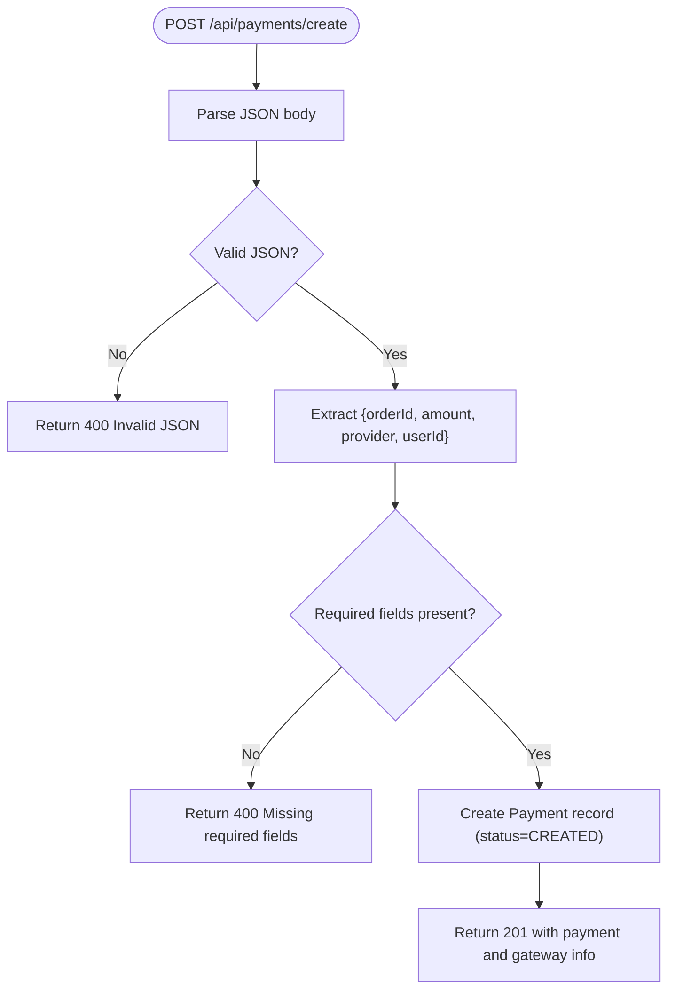
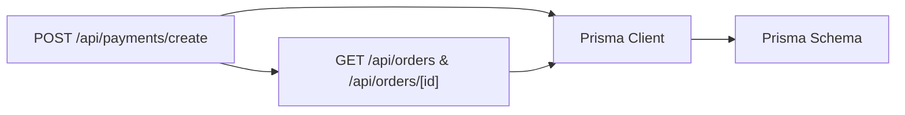

# Payment Providers

<cite>
**Referenced Files in This Document**
- [route.ts](file://app/api/payments/create/route.ts)
- [schema.prisma](file://prisma/schema.prisma)
- [prisma.ts](file://lib/prisma.ts)
- [route.ts](file://app/api/orders/route.ts)
- [route.ts](file://app/api/orders/[id]/route.ts)
- [notifications.ts](file://lib/notifications.ts)
</cite>

## Table of Contents
1. [Introduction](#introduction)
2. [Project Structure](#project-structure)
3. [Core Components](#core-components)
4. [Architecture Overview](#architecture-overview)
5. [Detailed Component Analysis](#detailed-component-analysis)
6. [Dependency Analysis](#dependency-analysis)
7. [Performance Considerations](#performance-considerations)
8. [Troubleshooting Guide](#troubleshooting-guide)
9. [Conclusion](#conclusion)
10. [Appendices](#appendices)

## Introduction
This document explains the payment provider integration patterns implemented in the system. It focuses on the PaymentProvider enumeration, the foundational data model for payments, and the current payment creation endpoint. It also outlines the strategy pattern approach for integrating multiple payment gateways (Razorpay, Paytm, Stripe), provider-specific configuration requirements, API credential setup, provider selection logic, fallback mechanisms, provider-specific error handling, webhook endpoint requirements, callback processing, configuration examples, testing strategies, and troubleshooting guidance. Provider switching and multi-provider redundancy strategies are addressed to support operational resilience.

## Project Structure
The payment integration is centered around:
- A Prisma schema that defines the PaymentProvider and Payment data model.
- A Next.js API route that creates a payment record and returns a placeholder checkout URL.
- Prisma client initialization.
- Supporting order APIs that demonstrate end-to-end workflows.

**Diagram sources**
- [route.ts:1-46](file://app/api/payments/create/route.ts#L1-L46)
- [route.ts:1-90](file://app/api/orders/route.ts#L1-L90)
- [route.ts:1-54](file://app/api/orders/[id]/route.ts#L1-L54)
- [prisma.ts:1-17](file://lib/prisma.ts#L1-L17)
- [schema.prisma:41-55](file://prisma/schema.prisma#L41-L55)
- [notifications.ts:1-28](file://lib/notifications.ts#L1-L28)

**Section sources**
- [route.ts:1-46](file://app/api/payments/create/route.ts#L1-L46)
- [prisma.ts:1-17](file://lib/prisma.ts#L1-L17)
- [schema.prisma:41-55](file://prisma/schema.prisma#L41-L55)
- [route.ts:1-90](file://app/api/orders/route.ts#L1-L90)
- [route.ts:1-54](file://app/api/orders/[id]/route.ts#L1-L54)
- [notifications.ts:1-28](file://lib/notifications.ts#L1-L28)

## Core Components
- PaymentProvider enum: Defines supported payment providers (RAZORPAY, PAYTM, STRIPE, CASH, OTHER).
- Payment model: Stores payment metadata, amount, currency, status, provider, provider payment identifier, and raw gateway payload.
- Payment creation endpoint: Creates a payment record and returns a placeholder checkout URL for the selected provider.
- Prisma client: Provides database access for payment and order operations.
- Notifications: Placeholder for future email/SMS integrations triggered after payment events.

Key implementation references:
- PaymentProvider enum definition: [schema.prisma:49-55](file://prisma/schema.prisma#L49-L55)
- Payment model fields and relations: [schema.prisma:125-144](file://prisma/schema.prisma#L125-L144)
- Payment creation endpoint: [route.ts:5-44](file://app/api/payments/create/route.ts#L5-L44)
- Prisma client initialization: [prisma.ts:1-17](file://lib/prisma.ts#L1-L17)
- Notifications module: [notifications.ts:1-28](file://lib/notifications.ts#L1-L28)

**Section sources**
- [schema.prisma:41-55](file://prisma/schema.prisma#L41-L55)
- [schema.prisma:125-144](file://prisma/schema.prisma#L125-L144)
- [route.ts:5-44](file://app/api/payments/create/route.ts#L5-L44)
- [prisma.ts:1-17](file://lib/prisma.ts#L1-L17)
- [notifications.ts:1-28](file://lib/notifications.ts#L1-L28)

## Architecture Overview
The payment flow begins with the client requesting a payment initiation via the payment creation endpoint. The backend validates the request, persists a payment record with the chosen provider, and returns a placeholder checkout URL. In a production environment, the endpoint would integrate with the selected provider’s SDK to generate a real session or checkout URL and return provider-specific details.

**Diagram sources**
- [route.ts:5-44](file://app/api/payments/create/route.ts#L5-L44)
- [prisma.ts:1-17](file://lib/prisma.ts#L1-L17)
- [schema.prisma:125-144](file://prisma/schema.prisma#L125-L144)

## Detailed Component Analysis

### PaymentProvider Enum and Data Model
- Enum values: RAZORPAY, PAYTM, STRIPE, CASH, OTHER.
- Payment model fields include orderId, amount, currency, status, provider, providerPaymentId, meta, and timestamps.
- The model links to Order and optionally to User.

**Diagram sources**
- [schema.prisma:125-144](file://prisma/schema.prisma#L125-L144)
- [schema.prisma:57-71](file://prisma/schema.prisma#L57-L71)
- [schema.prisma:91-123](file://prisma/schema.prisma#L91-L123)

**Section sources**
- [schema.prisma:49-55](file://prisma/schema.prisma#L49-L55)
- [schema.prisma:125-144](file://prisma/schema.prisma#L125-L144)

### Payment Creation Endpoint
- Validates incoming JSON and required fields (orderId, amount, provider).
- Persists a Payment record with status set to CREATED.
- Returns a placeholder gateway object containing provider and checkoutUrl.

**Diagram sources**
- [route.ts:5-44](file://app/api/payments/create/route.ts#L5-L44)

**Section sources**
- [route.ts:5-44](file://app/api/payments/create/route.ts#L5-L44)

### Strategy Pattern for Multiple Payment Gateways
The system is designed to support multiple payment providers using a strategy pattern:
- Provider selection: The PaymentProvider field determines which provider-specific integration to invoke.
- Provider-specific configuration: Environment variables and SDK clients are configured per provider.
- Integration workflow: For each provider, initialize SDK with credentials, create a session/checkout, capture providerPaymentId, and persist meta.
- Callback/webhook processing: Implement provider-specific verification, signature validation, and event normalization to update payment and order statuses.
- Fallback and redundancy: If a provider fails, switch to another provider or queue retries with exponential backoff.

Implementation outline:
- Define provider-specific adapters or factories that encapsulate SDK initialization and method calls.
- Centralize provider selection logic in a resolver that chooses the adapter based on PaymentProvider.
- Implement webhook handlers per provider with signature verification and idempotent updates.
- Maintain providerPaymentId and meta for auditability and reconciliation.

[No sources needed since this section provides a conceptual strategy without analyzing specific files]

### Provider-Specific Configuration Requirements
- Razorpay
  - Credentials: key_id, key_secret
  - Webhook secret: used to validate signatures
  - Checkout session creation and payment capture
- Paytm
  - Credentials: MID, merchant key
  - Webhook secret: used to validate signatures
  - EMI and payment mode options
- Stripe
  - Credentials: publishable_key, secret_key
  - Webhook secret: used to validate signatures
  - PaymentIntent lifecycle and confirmation

[No sources needed since this section provides general configuration guidance]

### API Credential Setup
- Store provider credentials in environment variables.
- Initialize SDK clients per provider in a centralized configuration module.
- Use separate keys for sandbox/testing vs production.

[No sources needed since this section provides general setup guidance]

### Provider Selection Logic and Fallback Mechanisms
- Selection logic: Choose provider based on PaymentProvider value.
- Fallback: On failure, retry with alternate provider or mark as pending with manual intervention.
- Redundancy: Maintain multiple provider configurations and enable/disable providers dynamically.

[No sources needed since this section provides general guidance]

### Provider-Specific Error Handling
- Validate provider credentials and signatures.
- Normalize errors into standardized response codes and messages.
- Log raw gateway payloads for debugging while masking sensitive data.

[No sources needed since this section provides general guidance]

### Webhook Endpoint Requirements and Callback Processing
- Endpoint paths: /api/webhooks/razorpay, /api/webhooks/paytm, /api/webhooks/stripe
- Signature verification: Use provider-provided secrets to validate authenticity.
- Idempotency: Use providerPaymentId and webhook event IDs to avoid duplicate processing.
- Status updates: Transition PaymentStatus according to provider events (authorized, failed, refunded).
- Notification triggers: Invoke notifications after successful payment and order updates.

[No sources needed since this section provides general guidance]

### Configuration Examples
- Environment variables per provider (example keys):
  - RAZORPAY_KEY_ID, RAZORPAY_KEY_SECRET, RAZORPAY_WEBHOOK_SECRET
  - PAYTM_MID, PAYTM_MERCHANT_KEY, PAYTM_WEBHOOK_SECRET
  - STRIPE_PUBLISHABLE_KEY, STRIPE_SECRET_KEY, STRIPE_WEBHOOK_SECRET
- Currency and locale defaults:
  - Default currency: INR
  - Locale-specific formatting handled by provider SDKs

[No sources needed since this section provides general guidance]

### Testing Strategies for Different Providers
- Unit tests: Mock provider SDKs and assert payment creation and status transitions.
- Integration tests: Use provider sandbox/test accounts to validate end-to-end flows.
- Load tests: Simulate concurrent payments and webhook bursts.
- Chaos tests: Introduce network failures and invalid signatures to validate resilience.

[No sources needed since this section provides general guidance]

### Troubleshooting Provider-Specific Issues
- Invalid signatures: Verify webhook secrets and request timestamps.
- Duplicate events: Implement idempotency checks using providerPaymentId and event IDs.
- Missing callbacks: Confirm webhook URLs are reachable and signed correctly.
- Amount mismatches: Validate currency conversion and rounding policies.

[No sources needed since this section provides general guidance]

## Dependency Analysis
The payment creation endpoint depends on Prisma for persistence and the Payment model. Orders are linked to payments, enabling end-to-end tracking.

**Diagram sources**
- [route.ts:1-46](file://app/api/payments/create/route.ts#L1-L46)
- [prisma.ts:1-17](file://lib/prisma.ts#L1-L17)
- [schema.prisma:125-144](file://prisma/schema.prisma#L125-L144)
- [route.ts:1-90](file://app/api/orders/route.ts#L1-L90)
- [route.ts:1-54](file://app/api/orders/[id]/route.ts#L1-L54)

**Section sources**
- [route.ts:1-46](file://app/api/payments/create/route.ts#L1-L46)
- [prisma.ts:1-17](file://lib/prisma.ts#L1-L17)
- [schema.prisma:125-144](file://prisma/schema.prisma#L125-L144)
- [route.ts:1-90](file://app/api/orders/route.ts#L1-L90)
- [route.ts:1-54](file://app/api/orders/[id]/route.ts#L1-L54)

## Performance Considerations
- Asynchronous processing: Offload heavy provider calls to background jobs.
- Idempotency: Ensure webhook handlers are idempotent to handle retries safely.
- Caching: Cache provider configuration and rate limits where appropriate.
- Monitoring: Track provider latency, error rates, and webhook delivery.

[No sources needed since this section provides general guidance]

## Troubleshooting Guide
- Payment creation errors:
  - Validate JSON and required fields before creating records.
  - Inspect Prisma logs for constraint violations.
- Webhook issues:
  - Confirm webhook URLs are publicly accessible.
  - Verify signature validation logic and timestamp tolerance.
- Order synchronization:
  - Ensure payment updates trigger order status transitions.
  - Use notifications to alert stakeholders on payment completion.

**Section sources**
- [route.ts:5-44](file://app/api/payments/create/route.ts#L5-L44)
- [prisma.ts:1-17](file://lib/prisma.ts#L1-L17)
- [notifications.ts:1-28](file://lib/notifications.ts#L1-L28)

## Conclusion
The system establishes a robust foundation for multi-provider payment integration using a strategy pattern. The PaymentProvider enum and Payment model define a clear contract for provider selection and data persistence. The payment creation endpoint demonstrates the integration entry point, returning a checkout URL for the chosen provider. By implementing provider-specific SDKs, webhooks, and resilient fallbacks, the system can evolve to support Razorpay, Paytm, Stripe, and others with minimal disruption.

[No sources needed since this section summarizes without analyzing specific files]

## Appendices
- Provider switching: Dynamically choose provider based on PaymentProvider and environment overrides.
- Multi-provider redundancy: Maintain multiple provider configurations and enable failover logic.

[No sources needed since this section provides general guidance]