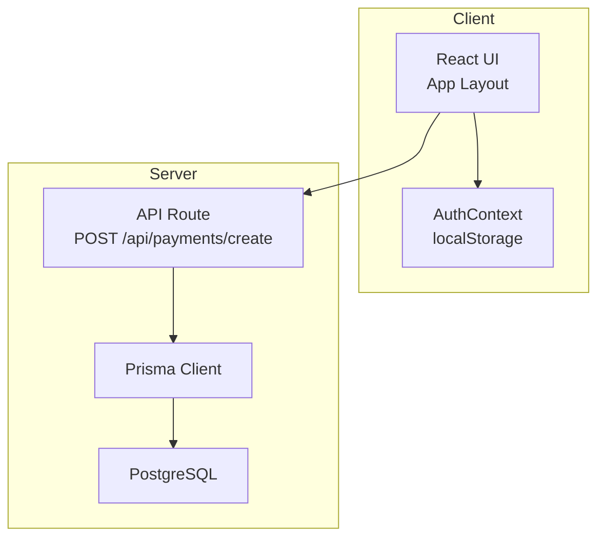
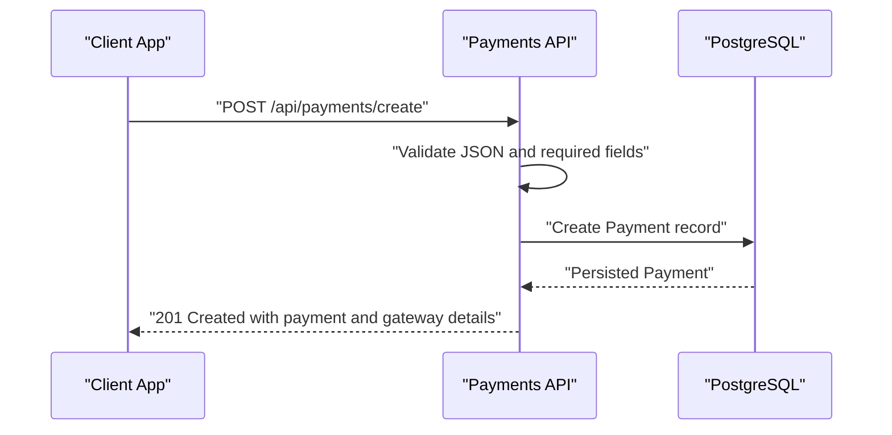
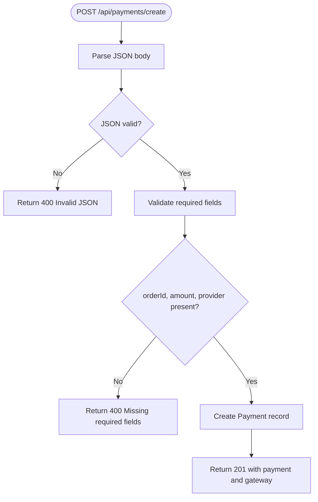
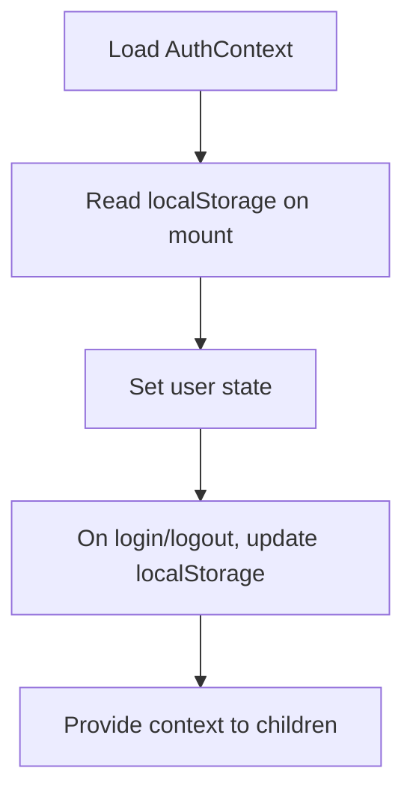
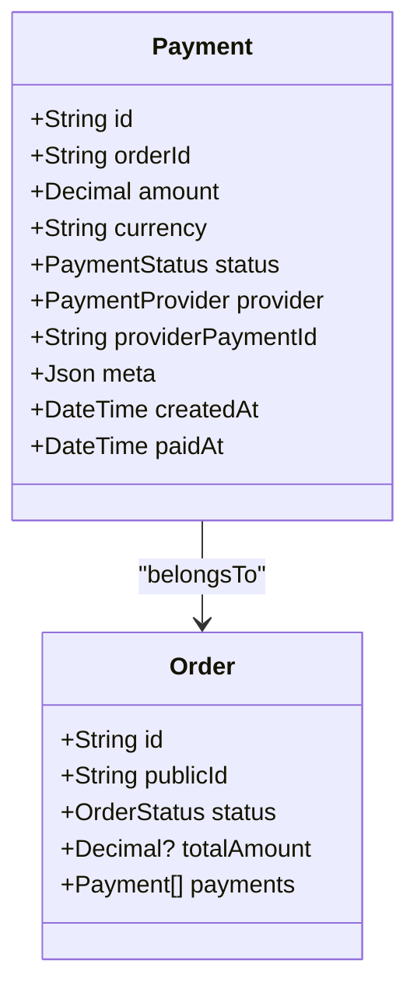
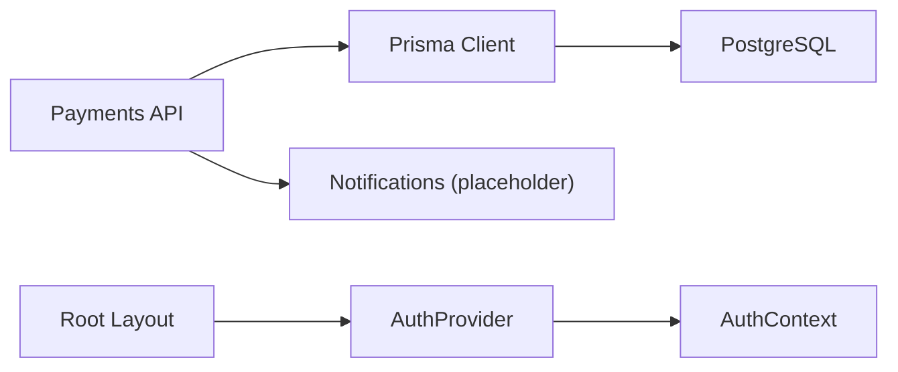

# Security & Compliance

<cite>
**Referenced Files in This Document**
- [route.ts](file://app/api/payments/create/route.ts)
- [AuthContext.tsx](file://components/AuthContext.tsx)
- [prisma.ts](file://lib/prisma.ts)
- [schema.prisma](file://prisma/schema.prisma)
- [layout.tsx](file://app/layout.tsx)
- [route.ts](file://app/api/enquiries/route.ts)
- [notifications.ts](file://lib/notifications.ts)
- [DEPLOYMENT.md](file://DEPLOYMENT.md)
- [vercel.json](file://vercel.json)
- [FINAL_DEPLOYMENT_FIX.md](file://FINAL_DEPLOYMENT_FIX.md)
- [package.json](file://package.json)
</cite>

## Table of Contents
1. [Introduction](#introduction)
2. [Project Structure](#project-structure)
3. [Core Components](#core-components)
4. [Architecture Overview](#architecture-overview)
5. [Detailed Component Analysis](#detailed-component-analysis)
6. [Dependency Analysis](#dependency-analysis)
7. [Performance Considerations](#performance-considerations)
8. [Troubleshooting Guide](#troubleshooting-guide)
9. [Conclusion](#conclusion)
10. [Appendices](#appendices)

## Introduction
This document provides security and compliance guidance for the payment processing subsystems. It aligns the current implementation with PCI DSS requirements, defines secure handling of sensitive data, and outlines authentication, authorization, and access control practices. It also covers tokenization strategies, secure transmission protocols, storage safeguards, fraud detection, audit and reporting, vulnerability assessments, incident response, and data retention/deletion policies.

## Project Structure
The payment processing surface is primarily exposed via a Next.js App Router API endpoint. Authentication is handled client-side with a lightweight role-based context stored in local storage. Data persistence uses Prisma with a PostgreSQL datasource. The application is containerized and deployed via Vercel.

**Diagram sources**
- [layout.tsx:17-46](file://app/layout.tsx#L17-L46)
- [AuthContext.tsx:29-60](file://components/AuthContext.tsx#L29-L60)
- [route.ts:6-44](file://app/api/payments/create/route.ts#L6-L44)
- [prisma.ts:11-16](file://lib/prisma.ts#L11-L16)
- [schema.prisma:5-8](file://prisma/schema.prisma#L5-L8)

**Section sources**
- [layout.tsx:17-46](file://app/layout.tsx#L17-L46)
- [AuthContext.tsx:29-60](file://components/AuthContext.tsx#L29-L60)
- [route.ts:6-44](file://app/api/payments/create/route.ts#L6-L44)
- [prisma.ts:11-16](file://lib/prisma.ts#L11-L16)
- [schema.prisma:5-8](file://prisma/schema.prisma#L5-L8)

## Core Components
- Payment creation API: Initializes a payment record and returns a gateway placeholder for checkout initiation.
- Authentication context: Provides role-based access and stores minimal session state in localStorage.
- Data persistence: Prisma client configured conditionally based on DATABASE_URL presence.
- Notifications: Placeholder module for future email/SMS integrations.

Key implementation references:
- Payment creation endpoint: [route.ts:6-44](file://app/api/payments/create/route.ts#L6-L44)
- Authentication context: [AuthContext.tsx:29-60](file://components/AuthContext.tsx#L29-L60)
- Prisma client initialization: [prisma.ts:11-16](file://lib/prisma.ts#L11-L16)
- Data model for payments: [schema.prisma:125-144](file://prisma/schema.prisma#L125-L144)

**Section sources**
- [route.ts:6-44](file://app/api/payments/create/route.ts#L6-L44)
- [AuthContext.tsx:29-60](file://components/AuthContext.tsx#L29-L60)
- [prisma.ts:11-16](file://lib/prisma.ts#L11-L16)
- [schema.prisma:125-144](file://prisma/schema.prisma#L125-L144)

## Architecture Overview
The payment flow begins when the frontend invokes the payment creation endpoint. The endpoint validates the request, persists a payment record, and returns a gateway identifier and checkout URL. The actual card or payment instrument collection occurs outside this codebase via the selected payment provider’s hosted checkout.

**Diagram sources**
- [route.ts:6-44](file://app/api/payments/create/route.ts#L6-L44)
- [schema.prisma:125-144](file://prisma/schema.prisma#L125-L144)

## Detailed Component Analysis

### Payment Creation Endpoint
- Request validation: Ensures JSON parsing succeeds and required fields are present.
- Persistence: Creates a Payment entity with status initialized to CREATED and associates optional user and order identifiers.
- Response: Returns the created payment and a gateway placeholder for initiating checkout.

Security considerations:
- Transport security: Enforce HTTPS/TLS termination at the edge and reverse proxy.
- Input sanitization: Validate numeric amounts and provider enums; reject malformed requests.
- Least privilege: Restrict write access to authenticated users where applicable.
- Logging: Avoid logging sensitive fields; mask identifiers in logs.

**Diagram sources**
- [route.ts:6-44](file://app/api/payments/create/route.ts#L6-L44)

**Section sources**
- [route.ts:6-44](file://app/api/payments/create/route.ts#L6-L44)

### Authentication and Authorization
- Client-side roles: The AuthContext exposes role and mobile state and persists it in localStorage under a dedicated key.
- Provider placement: The AuthProvider is mounted at the root layout level, ensuring all pages have access to authentication state.
- Access control: The dashboard demonstrates role-based rendering; extend route-level guards for protected endpoints.

Security considerations:
- Session storage: Avoid storing sensitive data in localStorage; prefer short-lived tokens with secure attributes when moving to server-side sessions.
- CSRF protection: Implement anti-CSRF tokens for state-changing operations.
- Role checks: Enforce role-based access control on server routes for sensitive actions.

**Diagram sources**
- [AuthContext.tsx:32-48](file://components/AuthContext.tsx#L32-L48)

**Section sources**
- [AuthContext.tsx:29-60](file://components/AuthContext.tsx#L29-L60)
- [layout.tsx:24-42](file://app/layout.tsx#L24-L42)

### Data Persistence and Storage
- Prisma client: Conditionally instantiated when DATABASE_URL is present; logs warnings and errors.
- Data model: Payment includes amount, currency, status, provider, and optional provider reference and raw metadata.

Security considerations:
- Encryption at rest: Enable transparent data encryption (TDE) on the database and enforce strong database credentials.
- Field-level sensitivity: Avoid persisting primary account number (PAN), track data, CVV, or full primary account number; store only tokens or truncated identifiers.
- Backups: Encrypt backups and restrict access; test restoration procedures regularly.

**Diagram sources**
- [schema.prisma:125-144](file://prisma/schema.prisma#L125-L144)
- [schema.prisma:91-123](file://prisma/schema.prisma#L91-L123)

**Section sources**
- [prisma.ts:11-16](file://lib/prisma.ts#L11-L16)
- [schema.prisma:125-144](file://prisma/schema.prisma#L125-L144)

### Secure Transmission Protocols
- TLS enforcement: Ensure all traffic to and from the application is encrypted using modern TLS versions.
- Content Security Policy (CSP): Configure CSP headers to mitigate XSS risks.
- CORS: Limit origins and methods for API endpoints; validate referer and origin headers.

[No sources needed since this section provides general guidance]

### Tokenization Strategies
- PAN truncation: Store only masked identifiers; never retain full primary account numbers.
- PCI-compliant tokenization: Use provider tokens (e.g., customer, payment method) instead of raw PANs.
- Metadata handling: Store only non-sensitive metadata; avoid embedding raw payment artifacts.

[No sources needed since this section provides general guidance]

### Sensitive Data Handling
- Input validation: Enforce strict schemas for monetary amounts and enumerations.
- Logging hygiene: Mask or exclude sensitive fields in logs; centralize logs securely.
- Secrets management: Store API keys and credentials in environment variables; rotate regularly.

[No sources needed since this section provides general guidance]

### Fraud Detection, Anomaly Monitoring, and Alerts
- Behavioral analytics: Track unusual patterns (e.g., rapid retries, high-value spikes).
- Real-time checks: Integrate with provider risk tools and AVS/CVV verification.
- Alerting: Notify administrators on anomalies; escalate failed attempts exceeding thresholds.

[No sources needed since this section provides general guidance]

### Security Audit, Compliance Certifications, and Regulatory Adherence
- PCI DSS alignment: Maintain SAQ A attestation baseline; document network and data safeguards.
- Privacy frameworks: Align with applicable privacy regulations (e.g., data minimization, consent).
- Third-party audits: Engage external auditors for periodic assessments.

[No sources needed since this section provides general guidance]

### Implementation Guidelines
- Transport security: Enforce TLS 1.2+; disable legacy protocols.
- Secrets lifecycle: Use secret managers; never hardcode credentials.
- Patch management: Keep runtime dependencies updated; monitor advisories.

[No sources needed since this section provides general guidance]

### Vulnerability Assessment Procedures
- Static analysis: Integrate SAST during CI/CD.
- Dynamic scanning: Run DAST against staging environments.
- Penetration testing: Perform authorized penetration tests quarterly.

[No sources needed since this section provides general guidance]

### Incident Response Protocol
- Triage: Identify scope and impact; isolate affected systems.
- Containment: Rotate compromised secrets; revoke tokens.
- Eradication: Remove attack vectors; remediate vulnerabilities.
- Recovery: Restore from clean backups; validate integrity.
- Postmortem: Document lessons learned; update controls.

[No sources needed since this section provides general guidance]

### Data Retention and Deletion
- Retention policy: Define retention periods per data category; anonymize after period.
- Secure deletion: Overwrite and truncate storage; verify deletion.
- Reporting: Demonstrate compliance with data subject requests.

[No sources needed since this section provides general guidance]

## Dependency Analysis
The payment creation endpoint depends on the Prisma client and the database datasource. The AuthContext is globally available via the root layout. Notifications are pluggable placeholders for outbound communications.

**Diagram sources**
- [route.ts:2-3](file://app/api/payments/create/route.ts#L2-L3)
- [prisma.ts:11-16](file://lib/prisma.ts#L11-L16)
- [layout.tsx:24-42](file://app/layout.tsx#L24-L42)
- [AuthContext.tsx:29-60](file://components/AuthContext.tsx#L29-L60)
- [notifications.ts:6-12](file://lib/notifications.ts#L6-L12)

**Section sources**
- [route.ts:2-3](file://app/api/payments/create/route.ts#L2-L3)
- [prisma.ts:11-16](file://lib/prisma.ts#L11-L16)
- [layout.tsx:24-42](file://app/layout.tsx#L24-L42)
- [AuthContext.tsx:29-60](file://components/AuthContext.tsx#L29-L60)
- [notifications.ts:6-12](file://lib/notifications.ts#L6-L12)

## Performance Considerations
- Database connections: Pool and reuse Prisma clients; avoid creating clients per request unnecessarily.
- Request validation: Keep validation logic efficient; leverage schema libraries.
- Edge caching: Offload static assets to CDN; cache non-sensitive metadata where appropriate.

[No sources needed since this section provides general guidance]

## Troubleshooting Guide
- Payment endpoint errors: Validate request payload and required fields; check database connectivity.
- Authentication issues: Confirm localStorage availability and absence of parsing errors.
- Deployment failures: Ensure DATABASE_URL is configured for production builds; verify Vercel environment variables.

Operational references:
- Payment endpoint: [route.ts:6-44](file://app/api/payments/create/route.ts#L6-L44)
- Authentication context: [AuthContext.tsx:32-48](file://components/AuthContext.tsx#L32-L48)
- Deployment configuration: [DEPLOYMENT.md:52-58](file://DEPLOYMENT.md#L52-L58), [vercel.json:1-22](file://vercel.json#L1-L22), [FINAL_DEPLOYMENT_FIX.md:50-81](file://FINAL_DEPLOYMENT_FIX.md#L50-L81)

**Section sources**
- [route.ts:6-44](file://app/api/payments/create/route.ts#L6-L44)
- [AuthContext.tsx:32-48](file://components/AuthContext.tsx#L32-L48)
- [DEPLOYMENT.md:52-58](file://DEPLOYMENT.md#L52-L58)
- [vercel.json:1-22](file://vercel.json#L1-L22)
- [FINAL_DEPLOYMENT_FIX.md:50-81](file://FINAL_DEPLOYMENT_FIX.md#L50-L81)

## Conclusion
The payment processing subsystem establishes a foundation for secure operations by validating inputs, persisting minimal payment metadata, and deferring card collection to the payment provider. To achieve PCI DSS compliance and robust security posture, integrate provider tokenization, enforce transport and storage encryption, implement role-based access control, deploy anomaly monitoring, and establish formal audit and incident response processes.

[No sources needed since this section summarizes without analyzing specific files]

## Appendices

### Appendix A: PCI DSS Alignment Checklist
- Do not store primary account numbers (PAN) or full track data.
- Enforce TLS 1.2+ for all transport.
- Apply least privilege and role-based access control.
- Maintain logs with sensitive data masked.
- Conduct quarterly vulnerability scans and annual penetration tests.

[No sources needed since this section provides general guidance]

### Appendix B: Environment Variables Reference
- DATABASE_URL: PostgreSQL connection string for Prisma.
- NEXT_PUBLIC_APP_URL: Public application URL for redirects and links.

**Section sources**
- [DEPLOYMENT.md:52-58](file://DEPLOYMENT.md#L52-L58)