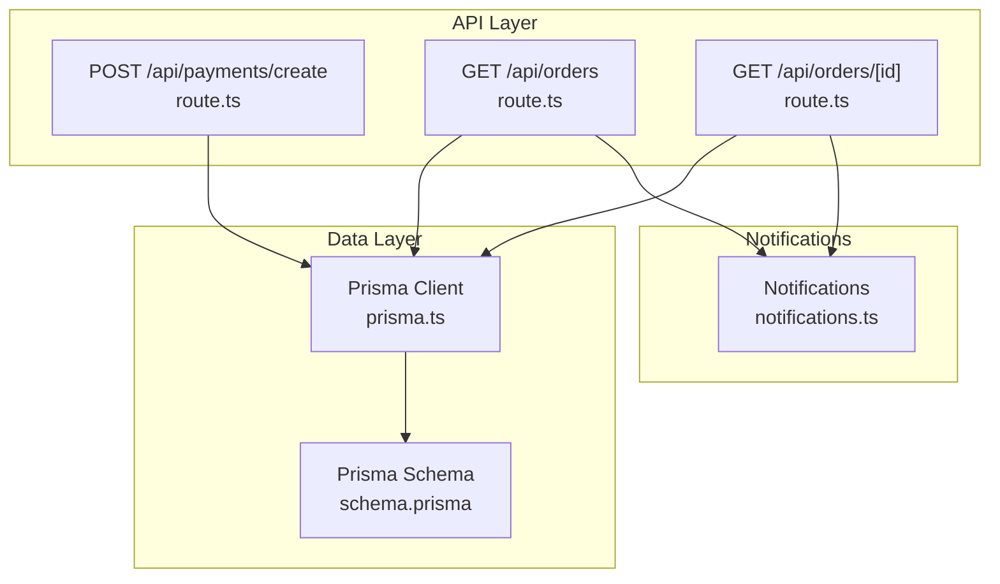
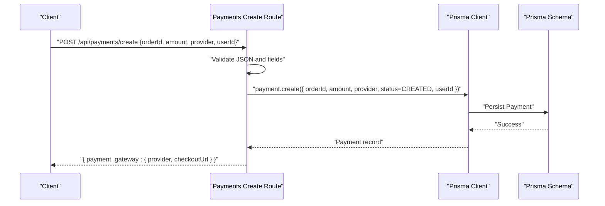
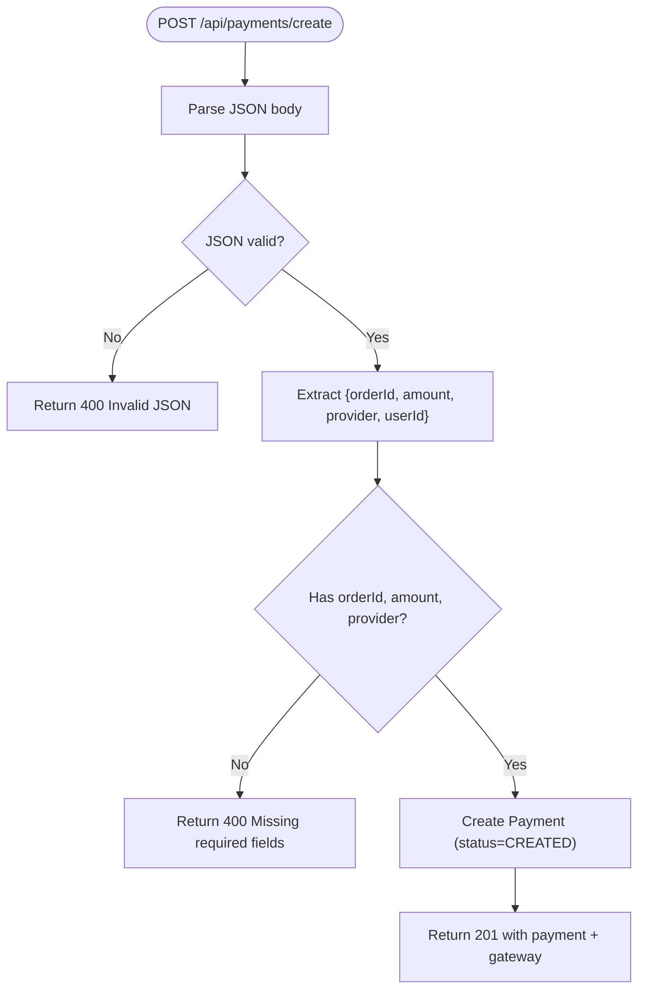
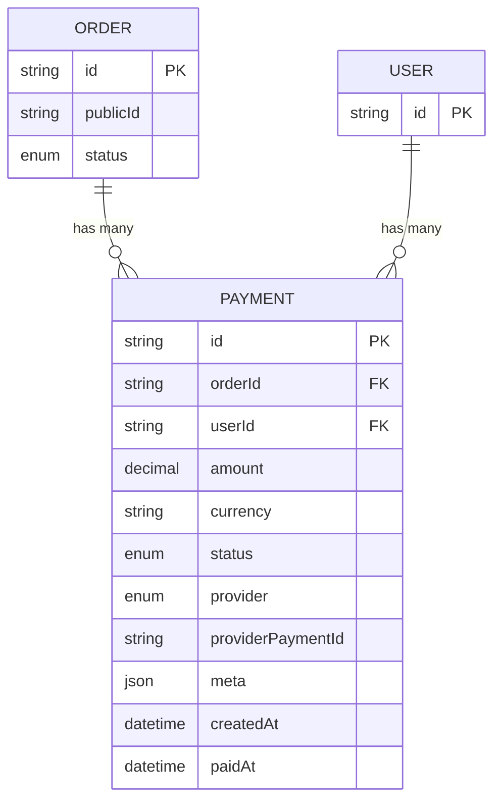
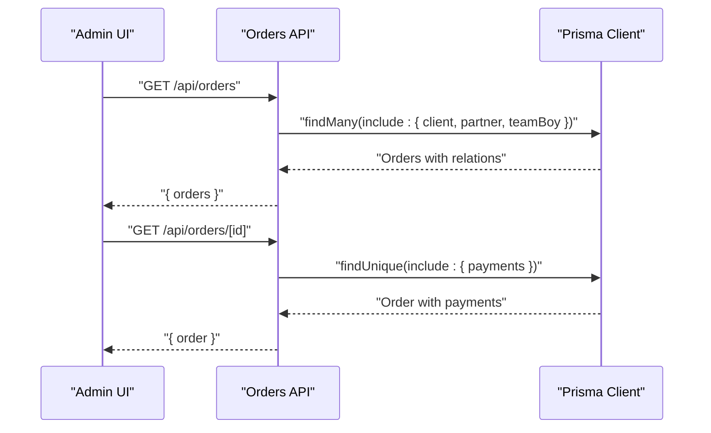
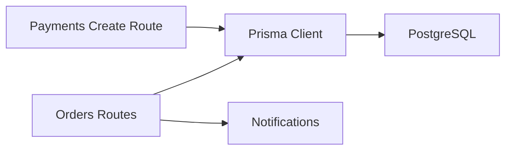
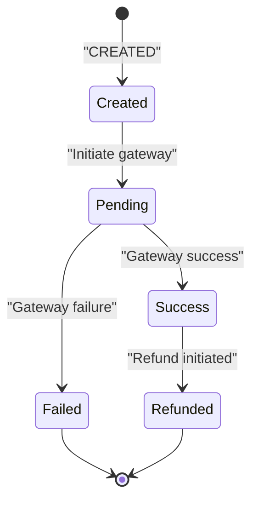

# Transaction Processing

<cite>
**Referenced Files in This Document**
- [route.ts](file://app/api/payments/create/route.ts)
- [schema.prisma](file://prisma/schema.prisma)
- [prisma.ts](file://lib/prisma.ts)
- [route.ts](file://app/api/orders/route.ts)
- [route.ts](file://app/api/orders/[id]/route.ts)
- [notifications.ts](file://lib/notifications.ts)
- [page.tsx](file://app/admin/orders/page.tsx)
</cite>

## Table of Contents
1. [Introduction](#introduction)
2. [Project Structure](#project-structure)
3. [Core Components](#core-components)
4. [Architecture Overview](#architecture-overview)
5. [Detailed Component Analysis](#detailed-component-analysis)
6. [Dependency Analysis](#dependency-analysis)
7. [Performance Considerations](#performance-considerations)
8. [Troubleshooting Guide](#troubleshooting-guide)
9. [Conclusion](#conclusion)
10. [Appendices](#appendices)

## Introduction
This document explains the payment transaction processing workflows implemented in the codebase. It covers how payments are created, how transactions move through statuses, and how orders and payments are associated. It also documents the PaymentStatus and PaymentProvider enumerations, outlines the transaction data model, and describes metadata storage, order associations, and the current state of verification, duplicate prevention, reconciliation, rollback, retry, and audit capabilities. Practical examples are provided via file references and diagrams.

## Project Structure
The payment processing surface is primarily implemented in a single API route that creates a Payment record and returns a placeholder checkout URL. Supporting models and enums are defined in the Prisma schema. Order APIs demonstrate order lifecycle management and payment association. Notifications are centralized for future integration with email/SMS.

**Diagram sources**
- [route.ts:1-46](file://app/api/payments/create/route.ts#L1-L46)
- [route.ts:1-129](file://app/api/orders/route.ts#L1-L129)
- [route.ts:1-54](file://app/api/orders/[id]/route.ts#L1-L54)
- [prisma.ts:1-22](file://lib/prisma.ts#L1-L22)
- [schema.prisma:1-173](file://prisma/schema.prisma#L1-L173)
- [notifications.ts:1-28](file://lib/notifications.ts#L1-L28)

**Section sources**
- [route.ts:1-46](file://app/api/payments/create/route.ts#L1-L46)
- [prisma.ts:1-22](file://lib/prisma.ts#L1-L22)
- [schema.prisma:1-173](file://prisma/schema.prisma#L1-L173)
- [route.ts:1-129](file://app/api/orders/route.ts#L1-L129)
- [route.ts:1-54](file://app/api/orders/[id]/route.ts#L1-L54)
- [notifications.ts:1-28](file://lib/notifications.ts#L1-L28)

## Core Components
- Payment creation endpoint: Creates a Payment record with initial status and returns a gateway placeholder.
- Prisma schema: Defines Payment, Order, User, and enums for statuses/providers.
- Order APIs: Manage orders and expose payments via inclusion.
- Notifications: Centralized stubs for order-related notifications.

Key responsibilities:
- Validate incoming request payload and required fields.
- Persist Payment with status defaults and provider selection.
- Return structured response including gateway metadata.
- Support order retrieval and payment association.

**Section sources**
- [route.ts:1-46](file://app/api/payments/create/route.ts#L1-L46)
- [schema.prisma:125-144](file://prisma/schema.prisma#L125-L144)
- [route.ts:1-129](file://app/api/orders/route.ts#L1-L129)
- [route.ts:1-54](file://app/api/orders/[id]/route.ts#L1-L54)

## Architecture Overview
The payment creation flow begins with a client request to the Payments API. The route validates inputs, persists a Payment record, and returns a gateway placeholder. Orders and payments are linked via foreign keys, enabling downstream reconciliation and reporting.

**Diagram sources**
- [route.ts:6-44](file://app/api/payments/create/route.ts#L6-L44)
- [prisma.ts:1-22](file://lib/prisma.ts#L1-L22)
- [schema.prisma:125-144](file://prisma/schema.prisma#L125-L144)

## Detailed Component Analysis

### Payment Creation Endpoint
Purpose:
- Accepts payment creation request with order linkage, amount, provider, and optional user.
- Validates payload and required fields.
- Persists a Payment record with default status and provider.
- Returns payment object and a placeholder checkout URL.

Processing logic highlights:
- JSON parsing with fallback to null; returns 400 on invalid JSON.
- Required fields: orderId, amount, provider; returns 400 if missing.
- Creates Payment with status set to CREATED and provider set from request.
- Returns 201 with payment and gateway metadata.

**Diagram sources**
- [route.ts:6-44](file://app/api/payments/create/route.ts#L6-L44)

**Section sources**
- [route.ts:1-46](file://app/api/payments/create/route.ts#L1-L46)

### Payment Data Model and Enums
Data model:
- Payment has orderId linking to Order, optional userId linking to User.
- Amount stored as Decimal, default currency is INR.
- Status defaults to CREATED; provider selected from PaymentProvider.
- Optional providerPaymentId for gateway reference.
- meta stores raw gateway payload or failures as JSON.
- paidAt captures time of successful payment.

Enums:
- PaymentStatus: CREATED, PENDING, SUCCESS, FAILED, REFUNDED
- PaymentProvider: RAZORPAY, PAYTM, STRIPE, CASH, OTHER

**Diagram sources**
- [schema.prisma:125-144](file://prisma/schema.prisma#L125-L144)
- [schema.prisma:91-123](file://prisma/schema.prisma#L91-L123)
- [schema.prisma:57-71](file://prisma/schema.prisma#L57-L71)

**Section sources**
- [schema.prisma:41-55](file://prisma/schema.prisma#L41-L55)
- [schema.prisma:125-144](file://prisma/schema.prisma#L125-L144)

### Order Association and Retrieval
Order APIs:
- List orders with client/partner/team boy relations and pagination.
- Retrieve a specific order with payments included.
- PATCH supports updating status and assignees for admin workflows.

Order-Payment relationship:
- Order.payments is a collection of Payment records.
- Payment.order is the relation back to Order.

**Diagram sources**
- [route.ts:11-36](file://app/api/orders/route.ts#L11-L36)
- [route.ts:12-27](file://app/api/orders/[id]/route.ts#L12-L27)

**Section sources**
- [route.ts:1-129](file://app/api/orders/route.ts#L1-L129)
- [route.ts:1-54](file://app/api/orders/[id]/route.ts#L1-L54)
- [schema.prisma:117-118](file://prisma/schema.prisma#L117-L118)

### Notifications and Audit Trail
Notifications:
- Centralized stubs for partner application, order confirmation, and order status update.
- These are logged to stdout and can be wired to real email/SMS providers.

Audit trail:
- Orders and payments include createdAt timestamps.
- Admin UI displays recent orders and a sample audit log section.

**Section sources**
- [notifications.ts:1-28](file://lib/notifications.ts#L1-L28)
- [page.tsx:89-116](file://app/admin/orders/page.tsx#L89-L116)

## Dependency Analysis
Direct dependencies:
- Payments route depends on Prisma client and schema enums.
- Orders route depends on Prisma client for queries and mutations.
- Notifications are independent but intended to be invoked by higher-level workflows.

Potential circular dependencies:
- None observed among the analyzed files.

External dependencies:
- Prisma client and PostgreSQL datasource configured via DATABASE_URL.

**Diagram sources**
- [route.ts:1-4](file://app/api/payments/create/route.ts#L1-L4)
- [route.ts:1-4](file://app/api/orders/route.ts#L1-L4)
- [prisma.ts:1-22](file://lib/prisma.ts#L1-L22)
- [schema.prisma:5-8](file://prisma/schema.prisma#L5-L8)
- [notifications.ts:1-28](file://lib/notifications.ts#L1-L28)

**Section sources**
- [route.ts:1-4](file://app/api/payments/create/route.ts#L1-L4)
- [route.ts:1-4](file://app/api/orders/route.ts#L1-L4)
- [prisma.ts:1-22](file://lib/prisma.ts#L1-L22)
- [schema.prisma:5-8](file://prisma/schema.prisma#L5-L8)
- [notifications.ts:1-28](file://lib/notifications.ts#L1-L28)

## Performance Considerations
- Database connectivity: Prisma client is created only when DATABASE_URL is present; otherwise, it is null. This avoids unnecessary connections in environments without a database.
- Logging: Prisma logs warnings and errors by default, aiding observability without heavy instrumentation.
- Payload validation: Early exit on invalid JSON and missing fields reduces unnecessary database work.

Recommendations:
- Add connection pooling and query timeouts for production.
- Consider adding rate limiting for payment creation endpoints.
- Index frequently queried fields (e.g., orderId, providerPaymentId) in the Payment model.

**Section sources**
- [prisma.ts:7-20](file://lib/prisma.ts#L7-L20)
- [route.ts:7-21](file://app/api/payments/create/route.ts#L7-L21)

## Troubleshooting Guide
Common issues and resolutions:
- Invalid JSON body: The payment creation route returns 400 with a descriptive message when JSON parsing fails.
- Missing required fields: Returns 400 if orderId, amount, or provider are absent.
- Database not configured: Prisma client becomes null when DATABASE_URL is missing; ensure environment variable is set for production.
- Order not found: Orders GET by ID returns 404 if the order does not exist.

Operational checks:
- Verify Prisma client initialization and datasource URL.
- Confirm Payment and Order relations are correctly populated.
- Review notifications logs for order-related events.

**Section sources**
- [route.ts:7-21](file://app/api/payments/create/route.ts#L7-L21)
- [prisma.ts:7-20](file://lib/prisma.ts#L7-L20)
- [route.ts:22-24](file://app/api/orders/[id]/route.ts#L22-L24)

## Conclusion
The payment processing implementation provides a minimal but robust foundation:
- Payment creation persists a record with validated inputs and returns a gateway placeholder.
- The Prisma schema defines clear relationships between Orders, Payments, and Users.
- Order APIs support listing, retrieving, and updating orders, including payment inclusion.
- Notifications are centralized for future integration.
Areas for enhancement include:
- Implementing payment verification callbacks and duplicate prevention.
- Adding transaction rollback and retry mechanisms.
- Building reconciliation and audit trails for compliance.

## Appendices

### PaymentStatus Enum and Transitions
- Values: CREATED, PENDING, SUCCESS, FAILED, REFUNDED
- Typical lifecycle: CREATED → PENDING → SUCCESS or FAILED; REFUNDED indicates reversal of a prior SUCCESS.

**Diagram sources**
- [schema.prisma:41-47](file://prisma/schema.prisma#L41-L47)

### Example Workflows

- Transaction creation
  - Request: POST /api/payments/create with { orderId, amount, provider, userId }
  - Response: 201 with payment and gateway metadata
  - Reference: [route.ts:6-44](file://app/api/payments/create/route.ts#L6-L44)

- Status update (conceptual)
  - After gateway callback, update Payment.status to SUCCESS or FAILED
  - Update Order.status accordingly and trigger notifications
  - Reference: [schema.prisma:125-144](file://prisma/schema.prisma#L125-L144), [notifications.ts:14-26](file://lib/notifications.ts#L14-L26)

- Completion handling (conceptual)
  - On SUCCESS, mark associated Order as COMPLETED and notify stakeholders
  - Reference: [schema.prisma:91-123](file://prisma/schema.prisma#L91-L123), [notifications.ts:21-26](file://lib/notifications.ts#L21-L26)

- Reconciliation (conceptual)
  - Compare Payment.meta against gateway records and adjust statuses
  - Reference: [schema.prisma](file://prisma/schema.prisma#L140)

- Audit and compliance (conceptual)
  - Maintain createdAt timestamps and logs for all state changes
  - Reference: [schema.prisma:142-143](file://prisma/schema.prisma#L142-L143), [page.tsx:112-116](file://app/admin/orders/page.tsx#L112-L116)