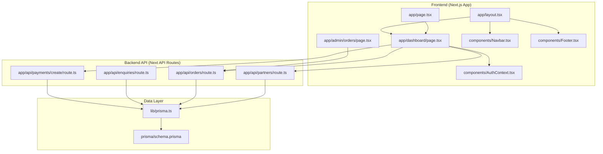
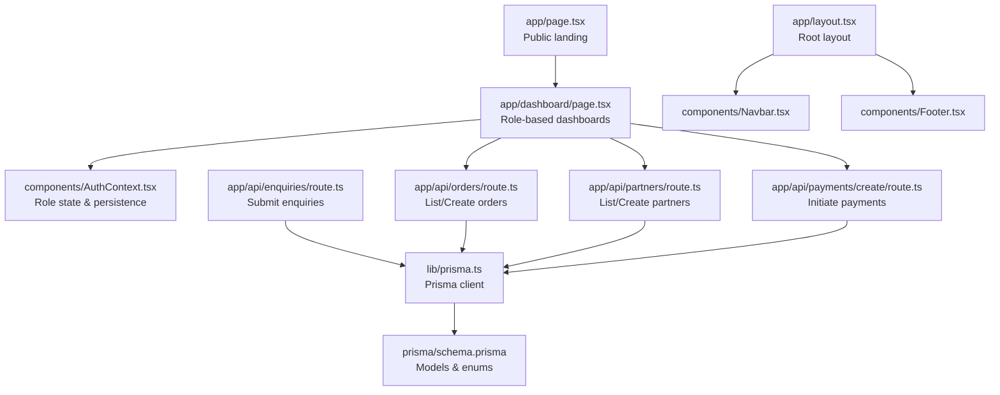
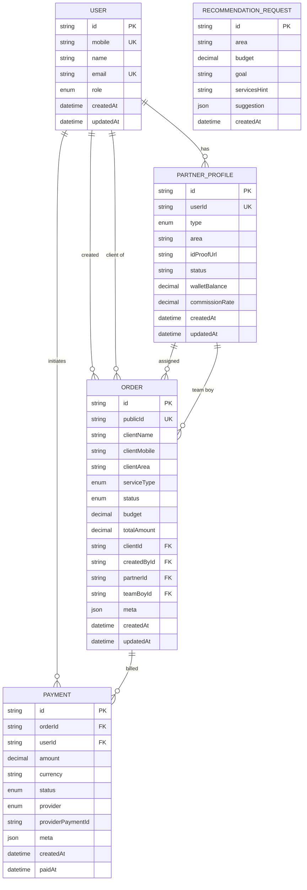
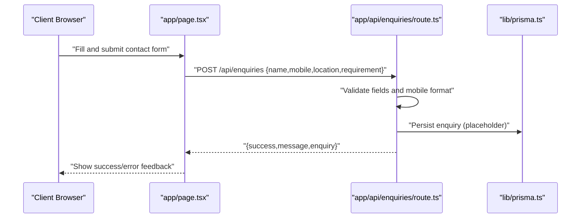
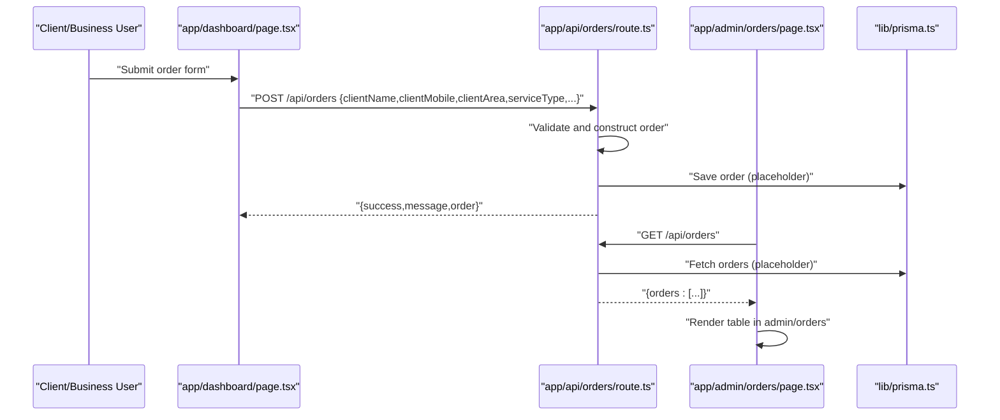
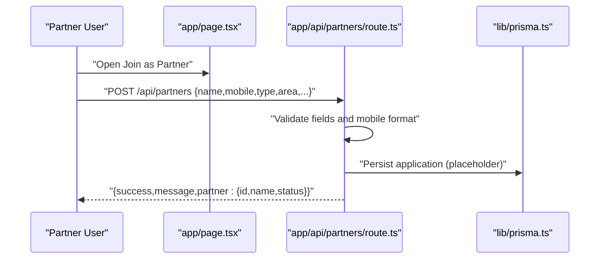
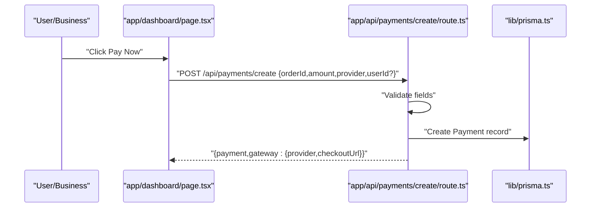
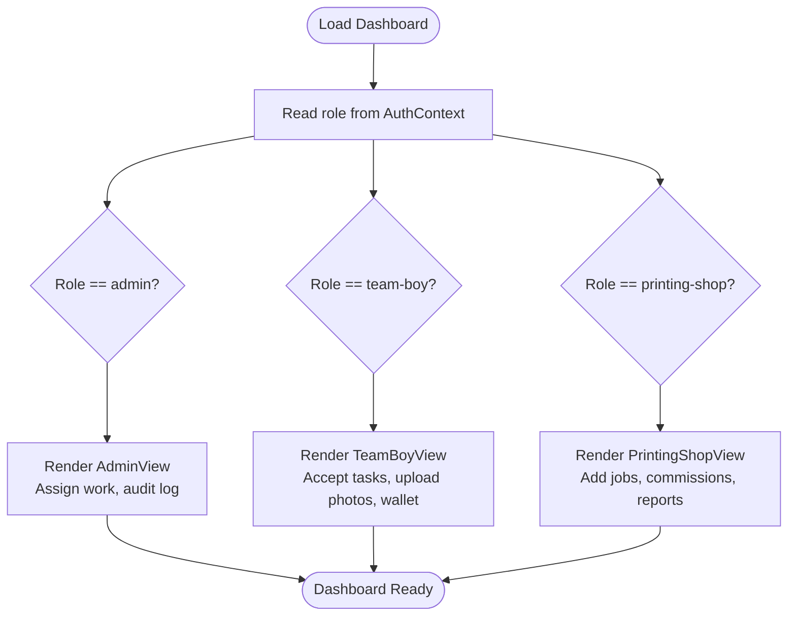
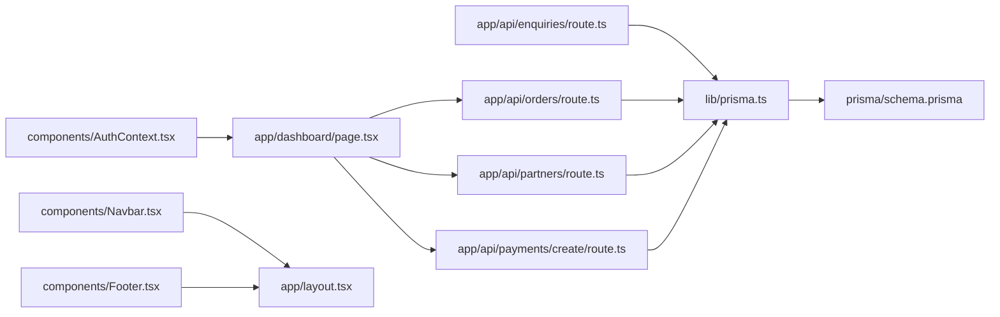

# Project Overview

<cite>
**Referenced Files in This Document**
- [package.json](file://package.json)
- [app/layout.tsx](file://app/layout.tsx)
- [app/page.tsx](file://app/page.tsx)
- [app/dashboard/page.tsx](file://app/dashboard/page.tsx)
- [app/admin/orders/page.tsx](file://app/admin/orders/page.tsx)
- [app/api/enquiries/route.ts](file://app/api/enquiries/route.ts)
- [app/api/orders/route.ts](file://app/api/orders/route.ts)
- [app/api/partners/route.ts](file://app/api/partners/route.ts)
- [app/api/payments/create/route.ts](file://app/api/payments/create/route.ts)
- [components/AuthContext.tsx](file://components/AuthContext.tsx)
- [components/Navbar.tsx](file://components/Navbar.tsx)
- [components/Footer.tsx](file://components/Footer.tsx)
- [lib/prisma.ts](file://lib/prisma.ts)
- [prisma/schema.prisma](file://prisma/schema.prisma)
- [FUNCTIONALITY_SUMMARY.md](file://FUNCTIONALITY_SUMMARY.md)
</cite>

## Table of Contents
1. [Introduction](#introduction)
2. [Project Structure](#project-structure)
3. [Core Components](#core-components)
4. [Architecture Overview](#architecture-overview)
5. [Detailed Component Analysis](#detailed-component-analysis)
6. [Dependency Analysis](#dependency-analysis)
7. [Performance Considerations](#performance-considerations)
8. [Troubleshooting Guide](#troubleshooting-guide)
9. [Conclusion](#conclusion)

## Introduction
Shree Shyam Agency Portal is a multi-stakeholder advertising and marketing management platform tailored for Jaipur-based businesses. It serves three primary user groups:
- Direct clients who plan and track local promotions (e.g., pamphlet drops, flex banners).
- Field team members (team boys) who accept work, upload completion photos, and manage earnings.
- Printing partners who receive regular print jobs, track commissions, invoices, and payouts.

Core value proposition:
- Unified digital workflow for end-to-end campaign execution.
- Transparent visibility of tasks, statuses, and payouts across stakeholders.
- Streamlined onboarding and payment initiation for partners and clients.

Target audience:
- Local businesses in Jaipur’s key zones (Pratap Nagar, Jagatpura, Sitapura, Sanganer, Tonk Road).
- Field workers and printing shops operating in the Jaipur region.

Key business benefits:
- Reduced administrative overhead through automated notifications and status updates.
- Real-time dashboards enabling efficient task assignment and progress tracking.
- Structured commission and payout workflows for printing partners and team boys.

Scope and main features:
- Public landing and service pages for client discovery.
- Role-based dashboards for admin, team boys, and printing partners.
- API endpoints for enquiries, orders, partners, payments, and recommendations.
- Authentication context for role-aware UI and navigation.
- Prisma-based data modeling for Users, PartnerProfiles, Orders, Payments, and Recommendations.

Real-world challenges addressed:
- Manual coordination between clients, field teams, and printing partners.
- Lack of visibility into job statuses and approvals.
- Inconsistent payment tracking and commission settlements.
- Limited recommendation engine for media mix selection.

## Project Structure
The project follows a Next.js App Router structure with a clear separation between frontend pages, shared components, backend API routes, and database schema.

**Diagram sources**
- [app/layout.tsx:17-46](file://app/layout.tsx#L17-L46)
- [app/page.tsx:1-89](file://app/page.tsx#L1-L89)
- [app/dashboard/page.tsx:1-257](file://app/dashboard/page.tsx#L1-L257)
- [app/admin/orders/page.tsx:1-92](file://app/admin/orders/page.tsx#L1-L92)
- [components/Navbar.tsx:19-60](file://components/Navbar.tsx#L19-L60)
- [components/AuthContext.tsx:29-60](file://components/AuthContext.tsx#L29-L60)
- [components/Footer.tsx:1-17](file://components/Footer.tsx#L1-L17)
- [app/api/enquiries/route.ts:1-85](file://app/api/enquiries/route.ts#L1-L85)
- [app/api/orders/route.ts:1-68](file://app/api/orders/route.ts#L1-L68)
- [app/api/partners/route.ts:1-90](file://app/api/partners/route.ts#L1-L90)
- [app/api/payments/create/route.ts:1-46](file://app/api/payments/create/route.ts#L1-L46)
- [lib/prisma.ts:1-17](file://lib/prisma.ts#L1-L17)
- [prisma/schema.prisma:1-159](file://prisma/schema.prisma#L1-L159)

**Section sources**
- [package.json:1-44](file://package.json#L1-L44)
- [app/layout.tsx:17-46](file://app/layout.tsx#L17-L46)
- [app/page.tsx:1-89](file://app/page.tsx#L1-L89)
- [app/dashboard/page.tsx:1-257](file://app/dashboard/page.tsx#L1-L257)
- [app/admin/orders/page.tsx:1-92](file://app/admin/orders/page.tsx#L1-L92)
- [components/Navbar.tsx:19-60](file://components/Navbar.tsx#L19-L60)
- [components/AuthContext.tsx:29-60](file://components/AuthContext.tsx#L29-L60)
- [components/Footer.tsx:1-17](file://components/Footer.tsx#L1-L17)
- [app/api/enquiries/route.ts:1-85](file://app/api/enquiries/route.ts#L1-L85)
- [app/api/orders/route.ts:1-68](file://app/api/orders/route.ts#L1-L68)
- [app/api/partners/route.ts:1-90](file://app/api/partners/route.ts#L1-L90)
- [app/api/payments/create/route.ts:1-46](file://app/api/payments/create/route.ts#L1-L46)
- [lib/prisma.ts:1-17](file://lib/prisma.ts#L1-L17)
- [prisma/schema.prisma:1-159](file://prisma/schema.prisma#L1-L159)

## Core Components
- Authentication Context: Provides role-aware state for admin, team boy, and printing shop users, persisted in localStorage for seamless sessions.
- Layout and Navigation: Centralized header/footer with links to Home, About, Services, Join as Partner, and Login.
- Role-Based Dashboards: Admin overview, team boy task acceptance and photo uploads, printing partner job intake and commission tracking.
- API Routes: Enquiries, Orders, Partners, Payments creation, and Recommendations placeholders.
- Data Model: Prisma schema defines Users, PartnerProfiles, Orders, Payments, and RecommendationRequests with enums for roles, statuses, and providers.

Common use cases by stakeholder:
- Direct clients:
  - Explore services and submit an enquiry via the homepage.
  - Track order status and communicate with the agency through the dashboard.
- Team boys:
  - Accept daily routes, upload completion photos, and check wallet balance and pending approvals.
- Printing partners:
  - Submit print jobs for clients, monitor completion and commission status, and download monthly statements.

**Section sources**
- [components/AuthContext.tsx:12-70](file://components/AuthContext.tsx#L12-L70)
- [app/layout.tsx:17-46](file://app/layout.tsx#L17-L46)
- [components/Navbar.tsx:6-17](file://components/Navbar.tsx#L6-L17)
- [app/dashboard/page.tsx:55-255](file://app/dashboard/page.tsx#L55-L255)
- [app/page.tsx:9-84](file://app/page.tsx#L9-L84)
- [app/api/enquiries/route.ts:3-85](file://app/api/enquiries/route.ts#L3-L85)
- [app/api/orders/route.ts:3-68](file://app/api/orders/route.ts#L3-L68)
- [app/api/partners/route.ts:3-90](file://app/api/partners/route.ts#L3-L90)
- [app/api/payments/create/route.ts:5-46](file://app/api/payments/create/route.ts#L5-L46)
- [prisma/schema.prisma:57-159](file://prisma/schema.prisma#L57-L159)

## Architecture Overview
The system integrates frontend React components with Next.js API routes and a PostgreSQL-backed Prisma ORM. The architecture emphasizes role-based UI, centralized authentication, and modular API endpoints.

**Diagram sources**
- [app/page.tsx:1-89](file://app/page.tsx#L1-L89)
- [app/dashboard/page.tsx:1-257](file://app/dashboard/page.tsx#L1-L257)
- [components/AuthContext.tsx:1-70](file://components/AuthContext.tsx#L1-L70)
- [app/api/enquiries/route.ts:1-85](file://app/api/enquiries/route.ts#L1-L85)
- [app/api/orders/route.ts:1-68](file://app/api/orders/route.ts#L1-L68)
- [app/api/partners/route.ts:1-90](file://app/api/partners/route.ts#L1-L90)
- [app/api/payments/create/route.ts:1-46](file://app/api/payments/create/route.ts#L1-L46)
- [lib/prisma.ts:1-17](file://lib/prisma.ts#L1-L17)
- [prisma/schema.prisma:1-159](file://prisma/schema.prisma#L1-L159)
- [app/layout.tsx:17-46](file://app/layout.tsx#L17-L46)
- [components/Navbar.tsx:19-60](file://components/Navbar.tsx#L19-L60)
- [components/Footer.tsx:1-17](file://components/Footer.tsx#L1-L17)

## Detailed Component Analysis

### Data Model and Entities
The Prisma schema defines core entities and their relationships, supporting the multi-stakeholder workflow.

**Diagram sources**
- [prisma/schema.prisma:57-159](file://prisma/schema.prisma#L57-L159)

**Section sources**
- [prisma/schema.prisma:10-159](file://prisma/schema.prisma#L10-L159)
- [lib/prisma.ts:1-17](file://lib/prisma.ts#L1-L17)

### API Workflows

#### Enquiries Submission
End-to-end flow for clients to submit an enquiry.

**Diagram sources**
- [app/page.tsx:1-89](file://app/page.tsx#L1-L89)
- [app/api/enquiries/route.ts:3-85](file://app/api/enquiries/route.ts#L3-L85)
- [lib/prisma.ts:1-17](file://lib/prisma.ts#L1-L17)

**Section sources**
- [app/api/enquiries/route.ts:3-85](file://app/api/enquiries/route.ts#L3-L85)
- [FUNCTIONALITY_SUMMARY.md:32-47](file://FUNCTIONALITY_SUMMARY.md#L32-L47)

#### Order Creation and Admin Dashboard
Client or partner creates an order; admin views consolidated list.

**Diagram sources**
- [app/dashboard/page.tsx:16-39](file://app/dashboard/page.tsx#L16-L39)
- [app/api/orders/route.ts:30-68](file://app/api/orders/route.ts#L30-L68)
- [app/admin/orders/page.tsx:21-39](file://app/admin/orders/page.tsx#L21-L39)
- [lib/prisma.ts:1-17](file://lib/prisma.ts#L1-L17)

**Section sources**
- [app/api/orders/route.ts:3-68](file://app/api/orders/route.ts#L3-L68)
- [app/admin/orders/page.tsx:16-89](file://app/admin/orders/page.tsx#L16-L89)
- [FUNCTIONALITY_SUMMARY.md:48-55](file://FUNCTIONALITY_SUMMARY.md#L48-L55)

#### Partner Onboarding
Partner applies via the join page; admin can review and approve.

**Diagram sources**
- [app/page.tsx:34-45](file://app/page.tsx#L34-L45)
- [app/api/partners/route.ts:29-90](file://app/api/partners/route.ts#L29-L90)
- [lib/prisma.ts:1-17](file://lib/prisma.ts#L1-L17)

**Section sources**
- [app/api/partners/route.ts:29-90](file://app/api/partners/route.ts#L29-L90)

#### Payment Initiation
Payment creation endpoint initializes a transaction record and returns gateway details.

**Diagram sources**
- [app/dashboard/page.tsx:1-257](file://app/dashboard/page.tsx#L1-L257)
- [app/api/payments/create/route.ts:5-46](file://app/api/payments/create/route.ts#L5-L46)
- [lib/prisma.ts:1-17](file://lib/prisma.ts#L1-L17)

**Section sources**
- [app/api/payments/create/route.ts:5-46](file://app/api/payments/create/route.ts#L5-L46)

### Role-Based UI and Navigation
The dashboard renders different views based on the authenticated role, while the layout provides consistent navigation and footer.

**Diagram sources**
- [app/dashboard/page.tsx:55-255](file://app/dashboard/page.tsx#L55-L255)
- [components/AuthContext.tsx:12-70](file://components/AuthContext.tsx#L12-L70)

**Section sources**
- [app/dashboard/page.tsx:6-38](file://app/dashboard/page.tsx#L6-L38)
- [components/AuthContext.tsx:29-60](file://components/AuthContext.tsx#L29-L60)
- [components/Navbar.tsx:19-60](file://components/Navbar.tsx#L19-L60)
- [components/Footer.tsx:1-17](file://components/Footer.tsx#L1-17)

## Dependency Analysis
High-level dependencies among frontend pages, components, API routes, and the data layer.

**Diagram sources**
- [components/AuthContext.tsx:1-70](file://components/AuthContext.tsx#L1-L70)
- [app/dashboard/page.tsx:1-257](file://app/dashboard/page.tsx#L1-L257)
- [components/Navbar.tsx:19-60](file://components/Navbar.tsx#L19-L60)
- [components/Footer.tsx:1-17](file://components/Footer.tsx#L1-L17)
- [app/api/enquiries/route.ts:1-85](file://app/api/enquiries/route.ts#L1-L85)
- [app/api/orders/route.ts:1-68](file://app/api/orders/route.ts#L1-L68)
- [app/api/partners/route.ts:1-90](file://app/api/partners/route.ts#L1-L90)
- [app/api/payments/create/route.ts:1-46](file://app/api/payments/create/route.ts#L1-L46)
- [lib/prisma.ts:1-17](file://lib/prisma.ts#L1-L17)
- [prisma/schema.prisma:1-159](file://prisma/schema.prisma#L1-L159)

**Section sources**
- [package.json:13-27](file://package.json#L13-L27)
- [lib/prisma.ts:1-17](file://lib/prisma.ts#L1-L17)
- [prisma/schema.prisma:1-159](file://prisma/schema.prisma#L1-L159)

## Performance Considerations
- API route placeholders: Current endpoints return mock data or minimal persistence; production readiness requires database-backed queries and optimized responses.
- Client-side rendering: Role-based dashboards render static UI blocks; consider dynamic data fetching and caching for improved responsiveness.
- Image uploads: Photo uploads for completion should be handled with appropriate file size limits and CDN integration.
- Database queries: Use Prisma’s query builder and pagination for large datasets in admin panels.
- Network reliability: Implement retry logic and offline-friendly forms for field team members with intermittent connectivity.

## Troubleshooting Guide
Common issues and resolutions:
- Authentication state not persisting:
  - Verify localStorage availability and parsing in the Auth Provider.
  - Ensure the provider wraps the layout correctly.
- API route errors:
  - Confirm endpoint paths match Next.js route segments and handle validation errors gracefully.
  - Check Prisma client initialization and DATABASE_URL environment variable.
- Dashboard not reflecting role:
  - Ensure AuthContext is initialized and the dashboard reads the role state.
- Enquiry form validation failures:
  - Validate required fields and mobile number format before submission.
- Payment creation failures:
  - Confirm required fields (orderId, amount, provider) and Prisma model creation.

**Section sources**
- [components/AuthContext.tsx:29-60](file://components/AuthContext.tsx#L29-L60)
- [app/api/enquiries/route.ts:10-25](file://app/api/enquiries/route.ts#L10-L25)
- [app/api/payments/create/route.ts:19-21](file://app/api/payments/create/route.ts#L19-L21)
- [lib/prisma.ts:1-17](file://lib/prisma.ts#L1-L17)
- [FUNCTIONALITY_SUMMARY.md:73-99](file://FUNCTIONALITY_SUMMARY.md#L73-L99)

## Conclusion
Shree Shyam Agency Portal establishes a robust foundation for managing advertising and marketing operations across clients, field teams, and printing partners in Jaipur. Its modular frontend, role-aware dashboards, and structured API routes enable scalable workflows. With production-grade database integration, enhanced validation, and streamlined payment flows, the platform can evolve into a comprehensive solution for regional advertising agencies.