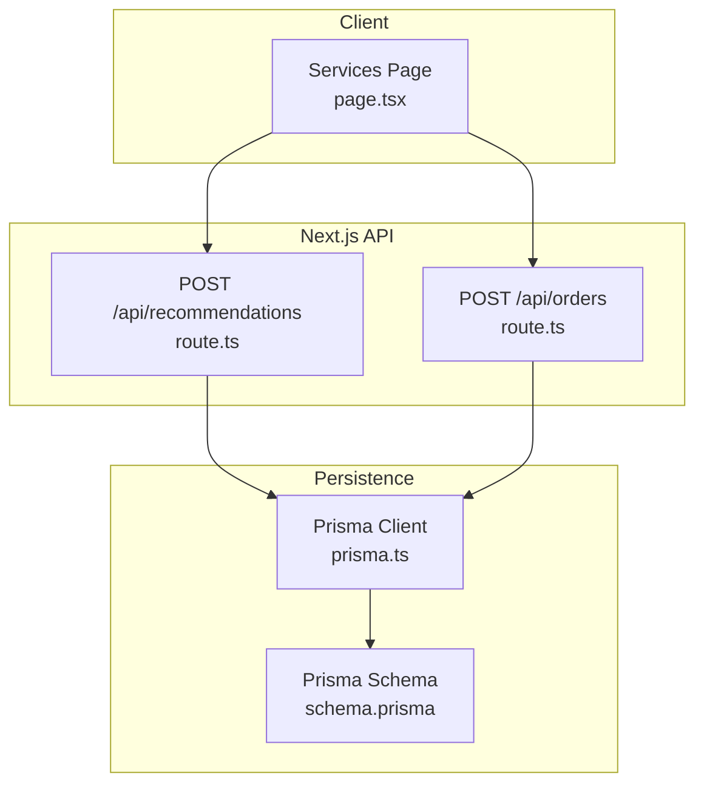
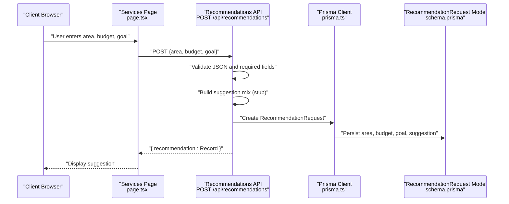
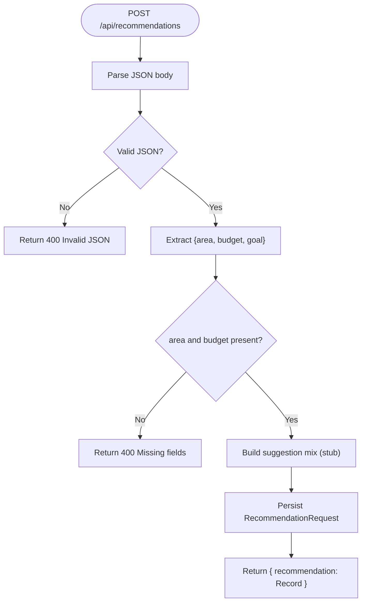
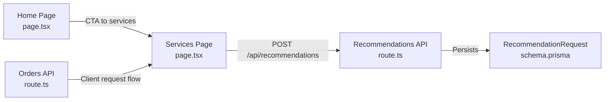
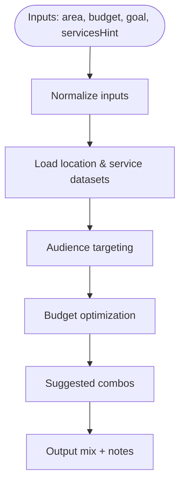
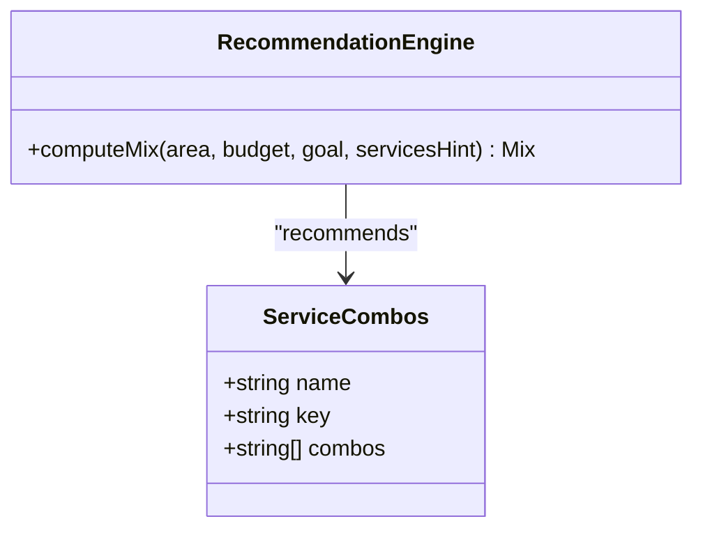
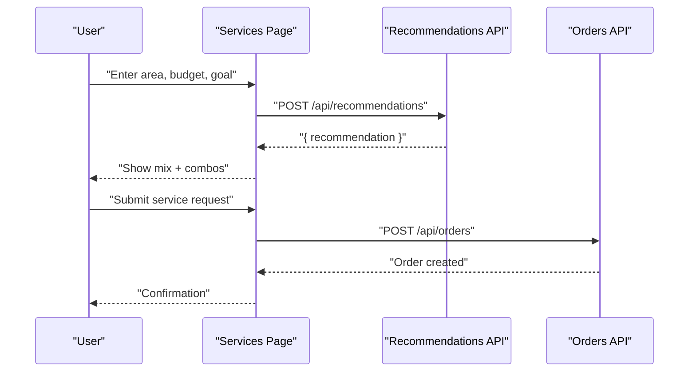
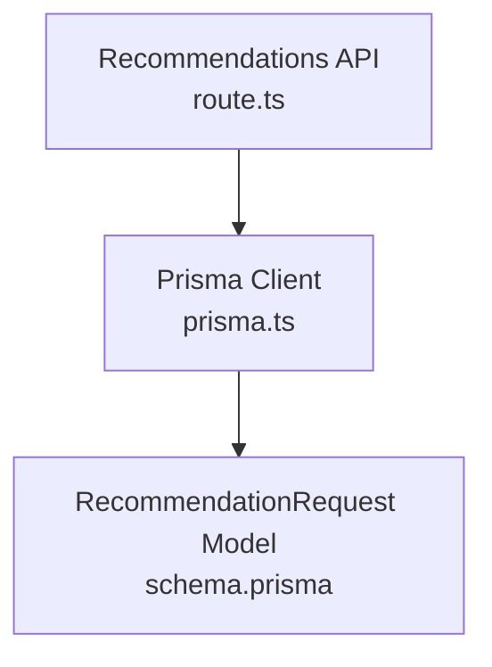

# Recommendation Engine

<cite>
**Referenced Files in This Document**
- [route.ts](file://app/api/recommendations/route.ts)
- [schema.prisma](file://prisma/schema.prisma)
- [prisma.ts](file://lib/prisma.ts)
- [page.tsx](file://app/services/page.tsx)
- [page.tsx](file://app/page.tsx)
- [route.ts](file://app/api/orders/route.ts)
</cite>

## Table of Contents
1. [Introduction](#introduction)
2. [Project Structure](#project-structure)
3. [Core Components](#core-components)
4. [Architecture Overview](#architecture-overview)
5. [Detailed Component Analysis](#detailed-component-analysis)
6. [Dependency Analysis](#dependency-analysis)
7. [Performance Considerations](#performance-considerations)
8. [Troubleshooting Guide](#troubleshooting-guide)
9. [Conclusion](#conclusion)
10. [Appendices](#appendices)

## Introduction
This document describes the recommendation engine system and AI-powered service suggestions for the Shree Shyam Advertising portal. It covers the current stubbed recommendation API, request/response schemas, integration patterns, and the planned enhancements for location-based suggestions, audience targeting, budget optimization, and suggested combos. It also documents the data flow from client inputs to recommendation outputs, and outlines future integration with backend recommendation services, caching, performance optimization, and fallback mechanisms.

## Project Structure
The recommendation engine is implemented as a Next.js App Router API route with a stubbed algorithm that records inputs and returns a pre-defined suggestion mix. The system integrates with Prisma for persistence and is designed to evolve toward a production-grade recommendation pipeline.

**Diagram sources**
- [route.ts:1-56](file://app/api/recommendations/route.ts#L1-L56)
- [route.ts:1-129](file://app/api/orders/route.ts#L1-L129)
- [prisma.ts:1-22](file://lib/prisma.ts#L1-L22)
- [schema.prisma:160-171](file://prisma/schema.prisma#L160-L171)

**Section sources**
- [route.ts:1-56](file://app/api/recommendations/route.ts#L1-L56)
- [prisma.ts:1-22](file://lib/prisma.ts#L1-L22)
- [schema.prisma:160-171](file://prisma/schema.prisma#L160-L171)

## Core Components
- Recommendation API endpoint: POST /api/recommendations
- Stubbed recommendation algorithm returning a predefined media mix
- Persistence model for recommendation requests
- Frontend integration points on Services and Home pages
- Orders API for end-to-end request flow

**Section sources**
- [route.ts:4-54](file://app/api/recommendations/route.ts#L4-L54)
- [schema.prisma:160-171](file://prisma/schema.prisma#L160-L171)
- [page.tsx:170-184](file://app/services/page.tsx#L170-L184)
- [page.tsx:68-84](file://app/page.tsx#L68-L84)
- [route.ts:38-127](file://app/api/orders/route.ts#L38-L127)

## Architecture Overview
The recommendation engine currently operates as a stub that validates inputs, constructs a suggestion mix, persists the request, and returns a record. The plan is to replace the stub with a production recommendation algorithm that considers:
- Location-based hotspots and routes
- Audience targeting (demographics, footfall, seasonality)
- Budget optimization and service mix allocation
- Suggested combos derived from service combinations and historical performance

**Diagram sources**
- [route.ts:5-54](file://app/api/recommendations/route.ts#L5-L54)
- [prisma.ts:1-22](file://lib/prisma.ts#L1-L22)
- [schema.prisma:160-171](file://prisma/schema.prisma#L160-L171)

## Detailed Component Analysis

### Recommendation API Endpoint
- Endpoint: POST /api/recommendations
- Purpose: Accept client inputs (area, budget, optional goal), validate, construct a suggestion mix, persist the request, and return the persisted record.
- Current behavior: Returns a fixed mix of services with shares and comments.
- Future behavior: Replace stub with algorithm that computes mix based on location, audience, and budget.

**Diagram sources**
- [route.ts:5-54](file://app/api/recommendations/route.ts#L5-L54)

**Section sources**
- [route.ts:4-54](file://app/api/recommendations/route.ts#L4-L54)

### Request and Response Schemas
- Request body (JSON):
  - area: string (required)
  - budget: number (required)
  - goal: string (optional)
- Response body (JSON):
  - recommendation: RecommendationRequest record

The RecommendationRequest model includes:
- id: string (auto-generated)
- area: string
- budget: decimal
- goal: string? (e.g., admissions, branding, launch)
- servicesHint: string? (text selection from UI)
- suggestion: json? (predefined mix in current stub)
- createdAt: datetime

**Section sources**
- [route.ts:11-19](file://app/api/recommendations/route.ts#L11-L19)
- [route.ts:44-51](file://app/api/recommendations/route.ts#L44-L51)
- [schema.prisma:160-171](file://prisma/schema.prisma#L160-L171)

### Integration Patterns
- Frontend integration:
  - Services page displays suggested combos and a “Smart Suggestions (Coming Soon)” section.
  - Home page highlights the recommendation engine’s upcoming capabilities.
- Backend integration:
  - Recommendation API persists inputs and suggestion.
  - Orders API handles client requests and can be extended to trigger recommendations.

**Diagram sources**
- [page.tsx:170-184](file://app/services/page.tsx#L170-L184)
- [page.tsx:68-84](file://app/page.tsx#L68-L84)
- [route.ts:4-54](file://app/api/recommendations/route.ts#L4-L54)
- [route.ts:38-127](file://app/api/orders/route.ts#L38-L127)
- [schema.prisma:160-171](file://prisma/schema.prisma#L160-L171)

**Section sources**
- [page.tsx:170-184](file://app/services/page.tsx#L170-L184)
- [page.tsx:68-84](file://app/page.tsx#L68-L84)
- [route.ts:4-54](file://app/api/recommendations/route.ts#L4-L54)
- [route.ts:38-127](file://app/api/orders/route.ts#L38-L127)
- [schema.prisma:160-171](file://prisma/schema.prisma#L160-L171)

### Recommendation Algorithm Architecture (Planned)
- Inputs:
  - area (location)
  - budget (amount)
  - goal (admissions, branding, launch)
  - servicesHint (optional user preference)
- Outputs:
  - mix: array of { service, share, comment }
  - optional notes or insights
- Features to implement:
  - Location-based hotspots and routes
  - Audience targeting (demographics, footfall, seasonality)
  - Budget optimization (service allocation)
  - Suggested combos (service combinations)
  - Seasonal/festive add-ons

[No sources needed since this diagram shows conceptual workflow, not actual code structure]

### Location-Based Suggestions
- Areas served include Pratap Nagar, Jagatpura, Sitapura, Sanganer, Tonk Road, and nearby societies/markets.
- Recommendation algorithm should leverage these areas to:
  - Identify high-footfall routes
  - Recommend visibility-centric services (e.g., FLEX_BANNER, ELECTRIC_POLE_AD) on major roads
  - Recommend neighborhood-centric services (e.g., PAMPHLET_DISTRIBUTION, WALL_POSTER) in societies

**Section sources**
- [page.tsx:27-43](file://app/about/page.tsx#L27-L43)

### Audience Targeting
- Use demographic and behavioral signals to tailor service mix.
- Combine service strengths with target audience density and preferences.

[No sources needed since this section provides general guidance]

### Budget Optimization
- Allocate budget across services to maximize reach and impact.
- Consider cost-per-thousand metrics and service lifespans.

[No sources needed since this section provides general guidance]

### Suggested Combos System
- Service combinations are pre-defined in the Services page.
- Examples include:
  - Pamphlet + Wall Posters
  - Flex + Electric Pole Ads
  - Sunpack + Wall Posters
- Recommendation engine should surface relevant combos based on area and budget.

**Diagram sources**
- [page.tsx:5-55](file://app/services/page.tsx#L5-L55)

**Section sources**
- [page.tsx:5-55](file://app/services/page.tsx#L5-L55)

### Smart Suggestion Workflow
- User enters area, budget, and optional goal.
- Recommendation API validates inputs and returns a suggestion mix.
- UI displays mix with comments and suggested combos.
- Orders API captures client request for follow-up.

**Diagram sources**
- [route.ts:5-54](file://app/api/recommendations/route.ts#L5-L54)
- [route.ts:38-127](file://app/api/orders/route.ts#L38-L127)
- [page.tsx:186-231](file://app/services/page.tsx#L186-L231)

**Section sources**
- [route.ts:5-54](file://app/api/recommendations/route.ts#L5-L54)
- [route.ts:38-127](file://app/api/orders/route.ts#L38-L127)
- [page.tsx:186-231](file://app/services/page.tsx#L186-L231)

## Dependency Analysis
- Next.js App Router API route depends on Prisma client for persistence.
- Prisma client is conditionally initialized based on DATABASE_URL.
- RecommendationRequest model defines the shape of persisted recommendations.

**Diagram sources**
- [route.ts:1-2](file://app/api/recommendations/route.ts#L1-L2)
- [prisma.ts:1-22](file://lib/prisma.ts#L1-L22)
- [schema.prisma:160-171](file://prisma/schema.prisma#L160-L171)

**Section sources**
- [route.ts:1-2](file://app/api/recommendations/route.ts#L1-L2)
- [prisma.ts:1-22](file://lib/prisma.ts#L1-L22)
- [schema.prisma:160-171](file://prisma/schema.prisma#L160-L171)

## Performance Considerations
- Recommendation API currently performs minimal computation; performance is dominated by database write latency.
- Recommendations are persisted as JSON, enabling flexible schema evolution.
- Consider adding:
  - Caching for repeated inputs (e.g., area+budget combinations)
  - Asynchronous processing for heavy computations
  - Indexes on area and createdAt for faster analytics queries

[No sources needed since this section provides general guidance]

## Troubleshooting Guide
- Invalid JSON body:
  - Symptom: 400 error with “Invalid JSON”
  - Resolution: Ensure request body is valid JSON
- Missing required fields:
  - Symptom: 400 error with “Area and budget are required”
  - Resolution: Provide area and budget
- Database connectivity:
  - Symptom: Prisma client not initialized
  - Resolution: Set DATABASE_URL or handle development mode gracefully

**Section sources**
- [route.ts:7-19](file://app/api/recommendations/route.ts#L7-L19)
- [prisma.ts:8-16](file://lib/prisma.ts#L8-L16)

## Conclusion
The recommendation engine is currently a stub that validates inputs, constructs a predefined mix, persists the request, and returns a record. The frontend surfaces suggested combos and highlights upcoming smart suggestions. The planned enhancements include location-based hotspots, audience targeting, budget optimization, and suggested combos derived from service combinations. Integration with backend recommendation services, caching, performance optimization, and fallback mechanisms will enable a robust, scalable recommendation system.

## Appendices

### API Specifications
- Endpoint: POST /api/recommendations
- Request body:
  - area: string (required)
  - budget: number (required)
  - goal: string (optional)
- Response body:
  - recommendation: RecommendationRequest record

**Section sources**
- [route.ts:11-19](file://app/api/recommendations/route.ts#L11-L19)
- [route.ts:44-51](file://app/api/recommendations/route.ts#L44-L51)
- [schema.prisma:160-171](file://prisma/schema.prisma#L160-L171)

### Parameter Validation
- JSON parsing failure: 400 Invalid JSON
- Missing area or budget: 400 Area and budget are required
- Additional validations can be added for numeric ranges, string lengths, and allowed goal values.

**Section sources**
- [route.ts:6-19](file://app/api/recommendations/route.ts#L6-L19)

### Response Handling
- On success: 200 OK with { recommendation: Record }
- On errors: 400 or 500 with error message

**Section sources**
- [route.ts:8-19](file://app/api/recommendations/route.ts#L8-L19)
- [route.ts:53-54](file://app/api/recommendations/route.ts#L53-L54)

### Data Flow from Client Inputs to Outputs
- Client enters area, budget, goal on Services page
- Client submits request to POST /api/recommendations
- API validates inputs, builds suggestion mix, persists record
- API returns recommendation record
- UI displays mix and suggested combos

**Section sources**
- [page.tsx:186-231](file://app/services/page.tsx#L186-L231)
- [route.ts:5-54](file://app/api/recommendations/route.ts#L5-L54)

### Planned Integrations and Enhancements
- Backend recommendation services:
  - Integrate ML models for audience targeting and budget optimization
  - Add location clustering and route planning
- Caching:
  - Cache frequent area+budget combinations
  - Cache computed mixes for quick retrieval
- Performance:
  - Asynchronous recommendation processing
  - Pagination and indexing for analytics
- Fallback mechanisms:
  - Graceful degradation when recommendation service is unavailable
  - Default mix when inputs are incomplete

[No sources needed since this section provides general guidance]