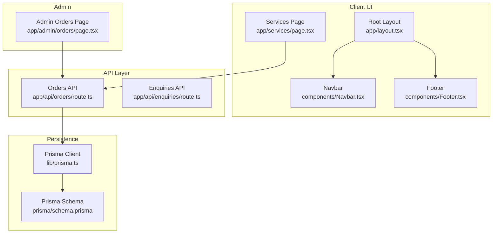
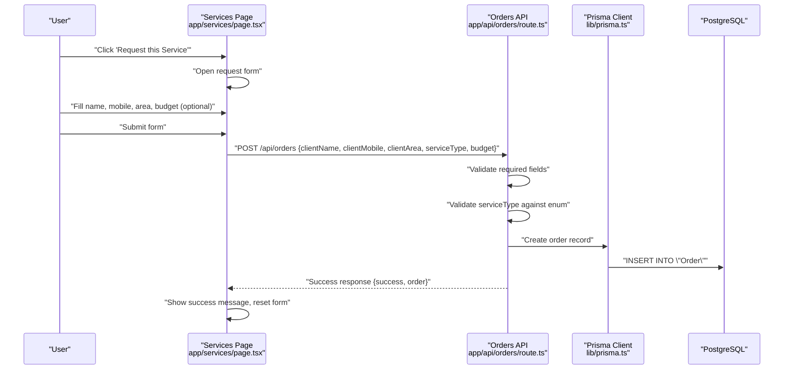
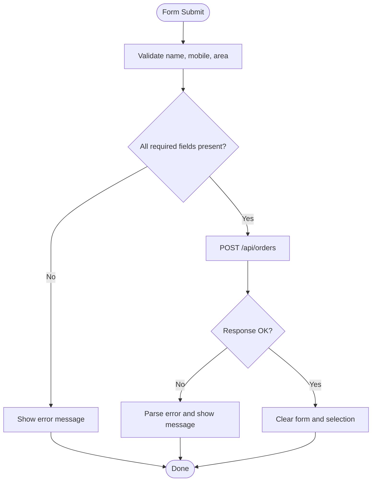
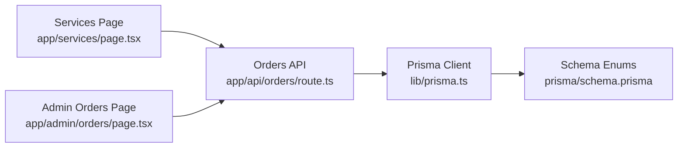

# Service Catalog & Display

<cite>
**Referenced Files in This Document**
- [page.tsx](file://app/services/page.tsx)
- [route.ts](file://app/api/orders/route.ts)
- [route.ts](file://app/api/enquiries/route.ts)
- [page.tsx](file://app/admin/orders/page.tsx)
- [schema.prisma](file://prisma/schema.prisma)
- [prisma.ts](file://lib/prisma.ts)
- [layout.tsx](file://app/layout.tsx)
- [globals.css](file://app/globals.css)
- [tailwind.config.ts](file://tailwind.config.ts)
- [Navbar.tsx](file://components/Navbar.tsx)
- [Footer.tsx](file://components/Footer.tsx)
- [ThemeContext.tsx](file://components/ThemeContext.tsx)
- [LanguageContext.tsx](file://components/LanguageContext.tsx)
</cite>

## Table of Contents
1. [Introduction](#introduction)
2. [Project Structure](#project-structure)
3. [Core Components](#core-components)
4. [Architecture Overview](#architecture-overview)
5. [Detailed Component Analysis](#detailed-component-analysis)
6. [Dependency Analysis](#dependency-analysis)
7. [Performance Considerations](#performance-considerations)
8. [Troubleshooting Guide](#troubleshooting-guide)
9. [Conclusion](#conclusion)
10. [Appendices](#appendices)

## Introduction
This document describes the service catalog system and display interface for Shree Shyam Advertising & Marketing Agency. It covers the service data model, service categories, the service card layout and description formatting, the combo suggestions system, the interactive selection mechanism, and the form integration for service requests. It also documents validation logic, submission workflow, styling patterns, responsive design, the service key system, service metadata, and integration with the ordering system.

## Project Structure
The service catalog is implemented as a client-side page that renders a grid of service cards, displays suggested combinations, and collects client information to submit orders via a dedicated API endpoint. The ordering system persists data using Prisma ORM against a PostgreSQL database. Admin pages consume the same order API to present order listings.

**Diagram sources**
- [page.tsx:123-234](file://app/services/page.tsx#L123-L234)
- [layout.tsx:17-45](file://app/layout.tsx#L17-L45)
- [route.ts:28-88](file://app/api/orders/route.ts#L28-L88)
- [route.ts:5-84](file://app/api/enquiries/route.ts#L5-L84)
- [page.tsx:16-89](file://app/admin/orders/page.tsx#L16-L89)
- [prisma.ts:11-20](file://lib/prisma.ts#L11-L20)
- [schema.prisma:91-123](file://prisma/schema.prisma#L91-L123)

**Section sources**
- [page.tsx:1-236](file://app/services/page.tsx#L1-L236)
- [layout.tsx:17-45](file://app/layout.tsx#L17-L45)
- [route.ts:1-90](file://app/api/orders/route.ts#L1-L90)
- [route.ts:1-84](file://app/api/enquiries/route.ts#L1-L84)
- [page.tsx:1-92](file://app/admin/orders/page.tsx#L1-L92)
- [prisma.ts:1-22](file://lib/prisma.ts#L1-L22)
- [schema.prisma:1-173](file://prisma/schema.prisma#L1-L173)

## Core Components
- Service catalog page: Renders service cards, combo suggestions, and a request form. Handles client-side validation and submission to the orders API.
- Orders API: Validates incoming requests, checks service keys against the schema-defined enum, generates a public order ID, and persists the order with default status.
- Admin orders page: Fetches and displays orders for internal management.
- Styling and responsiveness: Uses Tailwind CSS with a custom color palette and responsive grid layouts.

Key responsibilities:
- Service data structure: name, key, description, sample usage, and suggested combos.
- Service key system: Enumerated keys align with the Prisma schema.
- Form integration: Collects client name, mobile, area, optional budget, and selected service key.
- Validation: Client-side and server-side checks for required fields and valid service keys.
- Submission workflow: Posts to /api/orders and resets form fields upon success.

**Section sources**
- [page.tsx:5-55](file://app/services/page.tsx#L5-L55)
- [page.tsx:65-121](file://app/services/page.tsx#L65-L121)
- [route.ts:28-88](file://app/api/orders/route.ts#L28-L88)
- [schema.prisma:32-39](file://prisma/schema.prisma#L32-L39)

## Architecture Overview
The service catalog integrates frontend UI with backend APIs and persistence. The client selects a service, fills the form, and submits to the orders API. The API validates inputs, ensures the service key exists in the schema enum, and writes an order record. Admin pages consume the same API to list orders.

**Diagram sources**
- [page.tsx:78-121](file://app/services/page.tsx#L78-L121)
- [route.ts:28-88](file://app/api/orders/route.ts#L28-L88)
- [prisma.ts:11-20](file://lib/prisma.ts#L11-L20)
- [schema.prisma:91-123](file://prisma/schema.prisma#L91-L123)

## Detailed Component Analysis

### Service Data Model and Categories
- Service structure includes:
  - name: Human-readable service title.
  - key: Enumerated service key aligned with ServiceType.
  - description: Brief explanation of the service.
  - sample: Typical use cases or scenarios.
  - combos: List of suggested combinations for the service.
- Service categories (keys):
  - PAMPHLET_DISTRIBUTION
  - FLEX_BANNER
  - ELECTRIC_POLE_AD
  - SUNPACK_SHEET
  - WALL_POSTER
  - LOCAL_PROMOTION_PACKAGE

These keys are defined in the Prisma schema and validated by the orders API.

**Section sources**
- [page.tsx:5-55](file://app/services/page.tsx#L5-L55)
- [schema.prisma:32-39](file://prisma/schema.prisma#L32-L39)

### Service Card Layout and Description Formatting
- Grid layout: Responsive two-column layout on medium screens and above.
- Card structure:
  - Header: Service name and a small badge indicating location/locality.
  - Body: Description paragraph and a smaller sample paragraph.
  - Combo suggestions: A labeled list of suggested combinations.
  - Action button: “Request this Service” to open the request form.
- Styling patterns:
  - Consistent spacing and rounded corners.
  - Dark mode support via Tailwind dark variants.
  - Color tokens for primary and secondary backgrounds.

Responsive design:
- Uses grid classes to stack on small screens and split into two columns on medium screens and above.

**Section sources**
- [page.tsx:133-169](file://app/services/page.tsx#L133-L169)
- [page.tsx:140-146](file://app/services/page.tsx#L140-L146)
- [page.tsx:147-158](file://app/services/page.tsx#L147-L158)
- [page.tsx:159-167](file://app/services/page.tsx#L159-L167)
- [globals.css:28-30](file://app/globals.css#L28-L30)
- [tailwind.config.ts:10-24](file://tailwind.config.ts#L10-L24)

### Combo Suggestions System
- Each service includes a static list of suggested combos.
- The UI renders a small heading followed by a bulleted list of combo items.
- Future enhancement: Backend recommendation engine to dynamically suggest combos based on location, audience, and budget.

**Section sources**
- [page.tsx:12-13](file://app/services/page.tsx#L12-L13)
- [page.tsx:19-21](file://app/services/page.tsx#L19-L21)
- [page.tsx:22-29](file://app/services/page.tsx#L22-L29)
- [page.tsx:30-37](file://app/services/page.tsx#L30-L37)
- [page.tsx:38-45](file://app/services/page.tsx#L38-L45)
- [page.tsx:46-54](file://app/services/page.tsx#L46-L54)
- [page.tsx:153-158](file://app/services/page.tsx#L153-L158)

### Interactive Selection Mechanism
- Clicking “Request this Service” sets the selected service state.
- The request form appears below the service grid.
- The form captures:
  - Name
  - Mobile (including WhatsApp)
  - Area
  - Optional budget
- Submit button is enabled/disabled based on loading state.

**Section sources**
- [page.tsx:160-166](file://app/services/page.tsx#L160-L166)
- [page.tsx:186-231](file://app/services/page.tsx#L186-L231)

### Form Integration, Validation, and Submission Workflow
- Client-side validation:
  - Ensures name, mobile, and area are filled before submission.
  - Displays error messages and prevents submission otherwise.
- Submission:
  - Sends a POST request to /api/orders with client details and selected service key.
  - Budget is sent as a number if provided.
- Server-side validation:
  - Checks presence of required fields.
  - Validates serviceType against the ServiceType enum.
  - Generates a publicId (sequential numeric suffix prefixed with SSA-).
  - Creates order with default PENDING status.
- Success handling:
  - Clears form fields and resets selection after successful submission.
  - Shows a success message.

**Diagram sources**
- [page.tsx:78-121](file://app/services/page.tsx#L78-L121)
- [route.ts:28-88](file://app/api/orders/route.ts#L28-L88)

**Section sources**
- [page.tsx:78-121](file://app/services/page.tsx#L78-L121)
- [route.ts:28-88](file://app/api/orders/route.ts#L28-L88)

### Admin Orders Integration
- Admin page fetches orders from /api/orders and renders a table with client details, service type, status, and timestamps.
- Uses the same API used by the client to maintain consistency.

**Section sources**
- [page.tsx:16-89](file://app/admin/orders/page.tsx#L16-L89)
- [route.ts:5-25](file://app/api/orders/route.ts#L5-L25)

### Styling Patterns and Responsive Design
- Tailwind-based design with custom primary and secondary colors.
- Dark mode support via class-based switching.
- Container utility centers content and constrains width.
- Responsive grid for service cards and admin tables.

**Section sources**
- [tailwind.config.ts:10-24](file://tailwind.config.ts#L10-L24)
- [globals.css:28-30](file://app/globals.css#L28-L30)
- [layout.tsx:23-45](file://app/layout.tsx#L23-L45)
- [ThemeContext.tsx:14-27](file://components/ThemeContext.tsx#L14-L27)
- [Navbar.tsx:26-58](file://components/Navbar.tsx#L26-L58)
- [Footer.tsx:3-14](file://components/Footer.tsx#L3-L14)

### Service Key System and Metadata
- Service keys are defined as an enum in the Prisma schema and mirrored in the client code type.
- Metadata fields captured per order:
  - clientName, clientMobile, clientArea
  - serviceType (validated against enum)
  - budget (optional)
  - status (default PENDING)
  - publicId (auto-generated)
  - createdAt/updatedAt timestamps

**Section sources**
- [schema.prisma:32-39](file://prisma/schema.prisma#L32-L39)
- [schema.prisma:91-123](file://prisma/schema.prisma#L91-L123)
- [page.tsx:94-100](file://app/services/page.tsx#L94-L100)
- [route.ts:48-53](file://app/api/orders/route.ts#L48-L53)

### Integration with Ordering System
- The orders API persists orders and exposes a GET endpoint for admin consumption.
- The admin orders page consumes the same endpoint to list orders.
- The service catalog page posts to the same endpoint to create orders.

**Section sources**
- [route.ts:5-25](file://app/api/orders/route.ts#L5-L25)
- [page.tsx:21-39](file://app/admin/orders/page.tsx#L21-L39)

## Dependency Analysis
- Client page depends on:
  - React state hooks for form and selection.
  - Tailwind utility classes for styling.
  - Next.js fetch for API communication.
- API depends on:
  - Prisma client for database operations.
  - Prisma schema enums for validation.
- Admin page depends on:
  - Same orders API for listing.

**Diagram sources**
- [page.tsx:91-101](file://app/services/page.tsx#L91-L101)
- [page.tsx:24-31](file://app/admin/orders/page.tsx#L24-L31)
- [route.ts:2-3](file://app/api/orders/route.ts#L2-L3)
- [prisma.ts:1-22](file://lib/prisma.ts#L1-L22)
- [schema.prisma:32-39](file://prisma/schema.prisma#L32-L39)

**Section sources**
- [page.tsx:1-236](file://app/services/page.tsx#L1-L236)
- [page.tsx:1-92](file://app/admin/orders/page.tsx#L1-L92)
- [route.ts:1-90](file://app/api/orders/route.ts#L1-L90)
- [prisma.ts:1-22](file://lib/prisma.ts#L1-L22)
- [schema.prisma:1-173](file://prisma/schema.prisma#L1-L173)

## Performance Considerations
- Client-side rendering: The service catalog page is lightweight and does not require server-side rendering.
- API calls: Minimize unnecessary re-renders by consolidating form state updates and disabling the submit button during submission.
- Database queries: The orders API performs a single insert operation and a minimal lookup for generating the next publicId.
- Styling: Tailwind utilities are scoped to components, reducing global CSS overhead.

## Troubleshooting Guide
Common issues and resolutions:
- Missing required fields:
  - Symptom: Error message prompting to fill name, mobile, and area.
  - Cause: Client-side validation detected empty fields.
  - Resolution: Ensure all required fields are populated before submitting.
- Invalid service type:
  - Symptom: Server responds with invalid service type error.
  - Cause: serviceType not present in the ServiceType enum.
  - Resolution: Verify the selected service key matches one of the supported keys.
- Network errors:
  - Symptom: Generic error shown after submission failure.
  - Cause: Network or server error during POST to /api/orders.
  - Resolution: Retry submission; check server logs for details.
- Admin page loading errors:
  - Symptom: Error message while loading orders.
  - Cause: Failure to fetch from /api/orders.
  - Resolution: Verify API availability and network connectivity.

**Section sources**
- [page.tsx:84-87](file://app/services/page.tsx#L84-L87)
- [page.tsx:116-118](file://app/services/page.tsx#L116-L118)
- [route.ts:33-46](file://app/api/orders/route.ts#L33-L46)
- [page.tsx:24-36](file://app/admin/orders/page.tsx#L24-L36)

## Conclusion
The service catalog system provides a clean, responsive interface for selecting services, viewing suggested combinations, and submitting requests. The backend enforces validation and persists orders consistently, while the admin interface consumes the same API for oversight. The design leverages Tailwind utilities and a consistent color scheme, with room for future enhancements such as dynamic recommendations and expanded metadata.

## Appendices

### Service Keys Reference
- PAMPHLET_DISTRIBUTION
- FLEX_BANNER
- ELECTRIC_POLE_AD
- SUNPACK_SHEET
- WALL_POSTER
- LOCAL_PROMOTION_PACKAGE

**Section sources**
- [schema.prisma:32-39](file://prisma/schema.prisma#L32-L39)
- [page.tsx:57-63](file://app/services/page.tsx#L57-L63)

### Example Service Configuration Paths
- Service list definition: [page.tsx:5-55](file://app/services/page.tsx#L5-L55)
- Service key type: [page.tsx:57-63](file://app/services/page.tsx#L57-L63)
- Combo suggestions: [page.tsx:12-13](file://app/services/page.tsx#L12-L13), [page.tsx:19-21](file://app/services/page.tsx#L19-L21), [page.tsx:22-29](file://app/services/page.tsx#L22-L29), [page.tsx:30-37](file://app/services/page.tsx#L30-L37), [page.tsx:38-45](file://app/services/page.tsx#L38-L45), [page.tsx:46-54](file://app/services/page.tsx#L46-L54)

### Styling and Responsive Patterns
- Container utility: [globals.css:28-30](file://app/globals.css#L28-L30)
- Primary/secondary colors: [tailwind.config.ts:10-24](file://tailwind.config.ts#L10-L24)
- Dark mode classes: [layout.tsx:23-45](file://app/layout.tsx#L23-L45)
- Theme provider behavior: [ThemeContext.tsx:14-27](file://components/ThemeContext.tsx#L14-L27)

### Admin Integration Notes
- Admin orders listing: [page.tsx:16-89](file://app/admin/orders/page.tsx#L16-L89)
- Orders API GET: [route.ts:5-25](file://app/api/orders/route.ts#L5-L25)