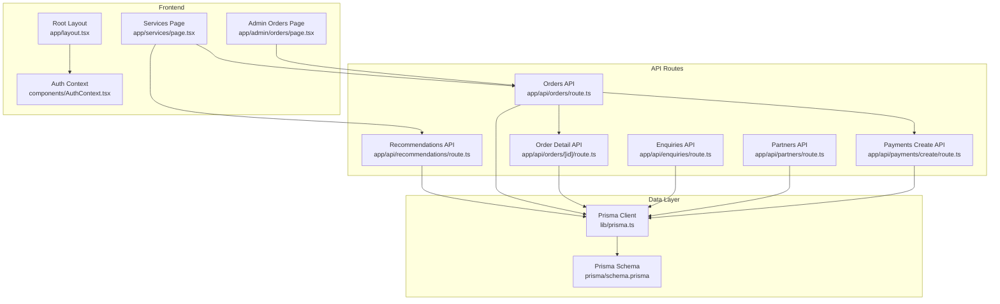
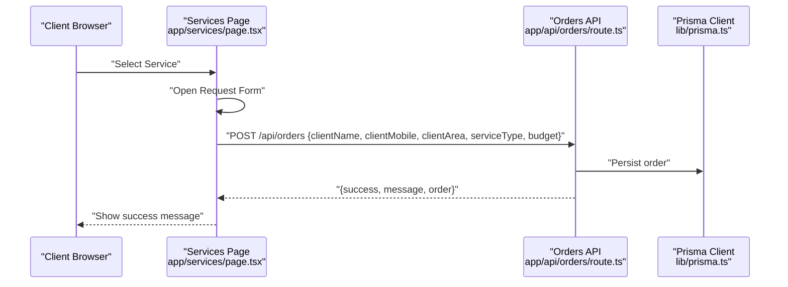
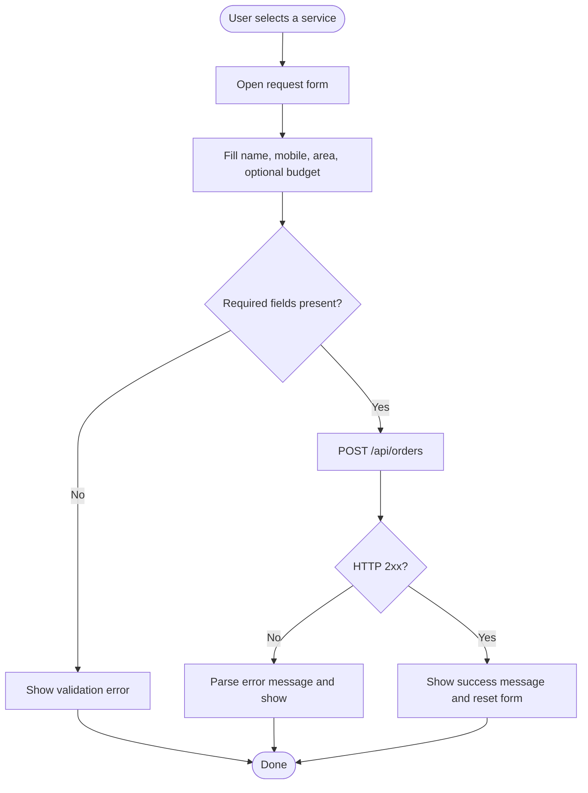
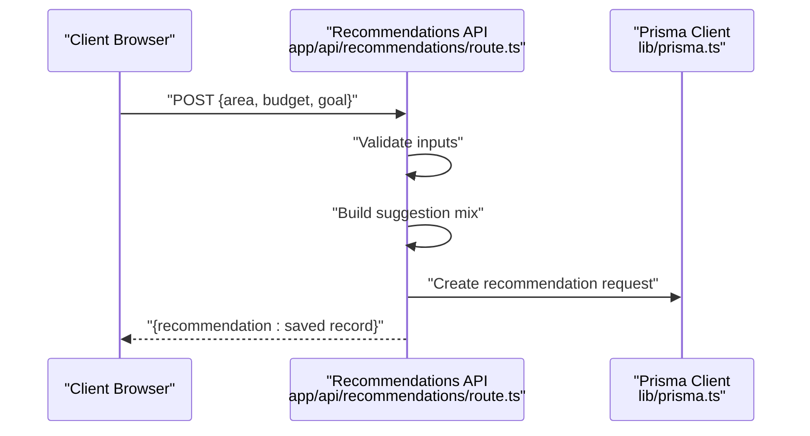
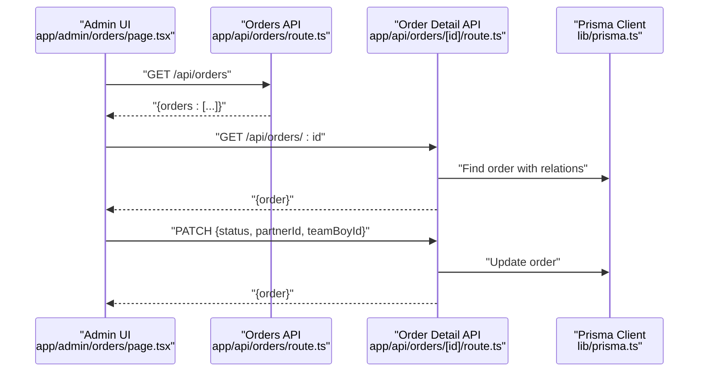
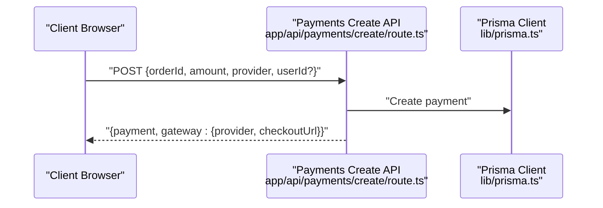
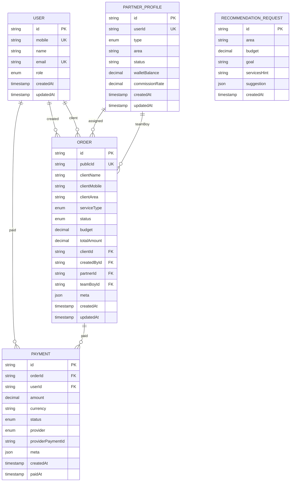
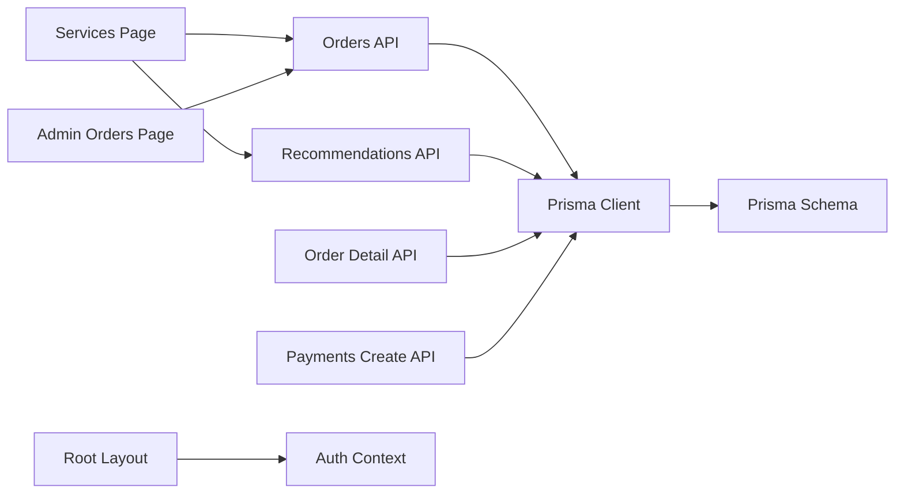

# Service Management

<cite>
**Referenced Files in This Document**
- [page.tsx](file://app/services/page.tsx)
- [route.ts](file://app/api/recommendations/route.ts)
- [schema.prisma](file://prisma/schema.prisma)
- [prisma.ts](file://lib/prisma.ts)
- [route.ts](file://app/api/orders/route.ts)
- [page.tsx](file://app/admin/orders/page.tsx)
- [route.ts](file://app/api/orders/[id]/route.ts)
- [route.ts](file://app/api/enquiries/route.ts)
- [route.ts](file://app/api/partners/route.ts)
- [route.ts](file://app/api/payments/create/route.ts)
- [AuthContext.tsx](file://components/AuthContext.tsx)
- [layout.tsx](file://app/layout.tsx)
- [package.json](file://package.json)
</cite>

## Table of Contents
1. [Introduction](#introduction)
2. [Project Structure](#project-structure)
3. [Core Components](#core-components)
4. [Architecture Overview](#architecture-overview)
5. [Detailed Component Analysis](#detailed-component-analysis)
6. [Dependency Analysis](#dependency-analysis)
7. [Performance Considerations](#performance-considerations)
8. [Troubleshooting Guide](#troubleshooting-guide)
9. [Conclusion](#conclusion)
10. [Appendices](#appendices)

## Introduction
This document describes the service management system and recommendation engine for a local advertising and marketing agency. It covers the service catalog display, service selection interface, recommendation algorithm integration, service categorization, pricing structures, availability management, workflow processes, booking systems, campaign management features, data models, search and filtering capabilities, and user interaction patterns. It also outlines examples of service configurations, recommendation triggers, and integration with the ordering system, along with customization options and dynamic content management.

## Project Structure
The application is a Next.js frontend with a set of API routes under app/api. The Prisma schema defines the data model for users, partners, orders, payments, and recommendation requests. Authentication state is managed via a React context provider. The layout composes the navigation, theme, language, and live chat components.

**Diagram sources**
- [page.tsx:1-236](file://app/services/page.tsx#L1-L236)
- [route.ts:1-56](file://app/api/recommendations/route.ts#L1-L56)
- [route.ts:1-68](file://app/api/orders/route.ts#L1-L68)
- [route.ts:1-54](file://app/api/orders/[id]/route.ts#L1-L54)
- [route.ts:1-85](file://app/api/enquiries/route.ts#L1-L85)
- [route.ts:1-90](file://app/api/partners/route.ts#L1-L90)
- [route.ts:1-46](file://app/api/payments/create/route.ts#L1-L46)
- [prisma.ts:1-17](file://lib/prisma.ts#L1-L17)
- [schema.prisma:1-159](file://prisma/schema.prisma#L1-L159)
- [page.tsx:1-92](file://app/admin/orders/page.tsx#L1-L92)
- [layout.tsx:1-48](file://app/layout.tsx#L1-L48)
- [AuthContext.tsx:1-70](file://components/AuthContext.tsx#L1-L70)

**Section sources**
- [layout.tsx:17-46](file://app/layout.tsx#L17-L46)
- [package.json:1-44](file://package.json#L1-L44)

## Core Components
- Service Catalog Display: Renders a grid of services with descriptions, suggested combos, and a request button. Selected service opens a request form with client details and optional budget.
- Recommendation Engine: Accepts area, budget, and optional goal, returns a structured suggestion mix, and persists the request to the database.
- Ordering System: Creates orders from client or partner submissions, and exposes admin endpoints to list and update orders.
- Data Models: Define enums for service types, order status, payment status/provider, and entities for users, partners, orders, payments, and recommendation requests.
- Payments Integration: Initializes payment records and returns a placeholder gateway response for checkout initiation.
- Admin Dashboard: Lists orders and displays basic metadata for operational oversight.
- Authentication Context: Provides role-based state management for admin/team-boy/printing-shop roles.

**Section sources**
- [page.tsx:57-121](file://app/services/page.tsx#L57-L121)
- [route.ts:4-54](file://app/api/recommendations/route.ts#L4-L54)
- [route.ts:3-66](file://app/api/orders/route.ts#L3-L66)
- [page.tsx:16-39](file://app/admin/orders/page.tsx#L16-L39)
- [route.ts:11-52](file://app/api/orders/[id]/route.ts#L11-L52)
- [route.ts:5-43](file://app/api/payments/create/route.ts#L5-L43)
- [schema.prisma:32-55](file://prisma/schema.prisma#L32-L55)
- [AuthContext.tsx:12-67](file://components/AuthContext.tsx#L12-L67)

## Architecture Overview
The system follows a layered architecture:
- Presentation Layer: Next.js pages/components for services, admin, and layout.
- API Layer: Route handlers under app/api for recommendations, orders, enquiries, partners, and payments.
- Data Access Layer: Prisma client initialized once and reused across API routes.
- Data Model Layer: Prisma schema defines entities, enums, relations, and JSON fields for flexible data.

**Diagram sources**
- [page.tsx:78-121](file://app/services/page.tsx#L78-L121)
- [route.ts:30-66](file://app/api/orders/route.ts#L30-L66)
- [prisma.ts:7-15](file://lib/prisma.ts#L7-L15)

## Detailed Component Analysis

### Service Catalog and Selection Interface
- Service Catalog: Static array of services with keys, names, descriptions, samples, and suggested combos.
- Selection UI: Grid layout with service cards, badges indicating location, descriptions, and combo lists.
- Request Form: Opens after selecting a service, collects client name, mobile, area, optional budget, and submits to the orders API.
- Validation: Basic presence checks for required fields; submission sets loading state and handles errors/messages.

**Diagram sources**
- [page.tsx:78-121](file://app/services/page.tsx#L78-L121)

**Section sources**
- [page.tsx:5-55](file://app/services/page.tsx#L5-L55)
- [page.tsx:65-121](file://app/services/page.tsx#L65-L121)

### Recommendation Engine Integration
- Endpoint: POST /api/recommendations accepts area, budget, and optional goal.
- Validation: Ensures area and budget are provided; otherwise returns 400.
- Suggestion: Returns a structured mix with service keys, allocation shares, and comments.
- Persistence: Stores the recommendation request and suggestion JSON in the database.
- Future Enhancements: Integrate AI services to compute mixes dynamically based on richer inputs.

**Diagram sources**
- [route.ts:4-54](file://app/api/recommendations/route.ts#L4-L54)
- [prisma.ts:7-15](file://lib/prisma.ts#L7-L15)

**Section sources**
- [route.ts:4-54](file://app/api/recommendations/route.ts#L4-L54)
- [schema.prisma:146-157](file://prisma/schema.prisma#L146-L157)

### Ordering System Workflow
- Creation: POST /api/orders validates required fields and returns a success response with a generated order object.
- Listing: GET /api/orders returns mock data for admin dashboard; in production, this will query the database.
- Detail and Updates: GET /api/orders/[id] fetches an order with related entities; PATCH updates status and assignees.
- Admin UI: Admin orders page fetches and renders order metadata for operational oversight.

**Diagram sources**
- [page.tsx:21-39](file://app/admin/orders/page.tsx#L21-L39)
- [route.ts:3-28](file://app/api/orders/route.ts#L3-L28)
- [route.ts:11-52](file://app/api/orders/[id]/route.ts#L11-L52)
- [prisma.ts:7-15](file://lib/prisma.ts#L7-L15)

**Section sources**
- [route.ts:3-66](file://app/api/orders/route.ts#L3-L66)
- [page.tsx:16-39](file://app/admin/orders/page.tsx#L16-L39)
- [route.ts:11-52](file://app/api/orders/[id]/route.ts#L11-L52)

### Payments Integration
- Endpoint: POST /api/payments/create initializes a payment record with provider and amount, and returns a placeholder gateway checkout URL.
- Data Model: Payment entity supports multiple providers and statuses, with optional user linkage.

**Diagram sources**
- [route.ts:5-43](file://app/api/payments/create/route.ts#L5-L43)
- [schema.prisma:125-144](file://prisma/schema.prisma#L125-L144)
- [prisma.ts:7-15](file://lib/prisma.ts#L7-L15)

**Section sources**
- [route.ts:5-43](file://app/api/payments/create/route.ts#L5-L43)
- [schema.prisma:125-144](file://prisma/schema.prisma#L125-L144)

### Data Models and Enums
- Enums: ServiceType, OrderStatus, PaymentStatus, PaymentProvider, UserRole, PartnerType define standardized values across the system.
- Entities:
  - User: roles, mobile/email uniqueness, relations to orders and payments.
  - PartnerProfile: type, area, status, wallet balance, commission rate, relations to orders.
  - Order: client info, service type, status, budget, total amount, relations to users/partners/team boys, payments, and meta JSON.
  - Payment: order linkage, user linkage, amount/currency, status/provider, provider reference, meta JSON.
  - RecommendationRequest: area, budget, goal, services hint, suggestion JSON.

**Diagram sources**
- [schema.prisma:57-157](file://prisma/schema.prisma#L57-L157)

**Section sources**
- [schema.prisma:10-55](file://prisma/schema.prisma#L10-L55)
- [schema.prisma:57-157](file://prisma/schema.prisma#L57-L157)

### Search and Filtering Capabilities
- Current State: Services page renders a static list; no client-side search/filter UI exists.
- Recommended Enhancements:
  - Add filters for service type, area, and budget range.
  - Implement keyword search on descriptions/samples.
  - Persist filters in URL query parameters for sharing and deep linking.
  - Backend support: Extend API routes to accept filters and query the database using Prisma.

[No sources needed since this section provides general guidance]

### User Interaction Patterns
- Service Discovery: Browse service cards, read descriptions and suggested combos.
- Request Submission: Select a service, fill the form, submit to create an order.
- Admin Workflow: View orders, update status, assign partners/team boys.
- Authentication: Role-based context enables admin/team-boy/printing-shop views.

**Section sources**
- [page.tsx:123-234](file://app/services/page.tsx#L123-L234)
- [page.tsx:41-87](file://app/admin/orders/page.tsx#L41-L87)
- [AuthContext.tsx:12-67](file://components/AuthContext.tsx#L12-L67)

### Campaign Management Features
- Suggested Combos: Services include predefined combo suggestions for cross-promotion.
- Budget Inputs: Optional budget field allows clients to indicate constraints.
- Recommendation Engine: Future integration will propose optimal mixes based on area, audience, and budget.
- Admin Assignments: Orders can be assigned to partners/team boys and status updated.

**Section sources**
- [page.tsx:5-55](file://app/services/page.tsx#L5-L55)
- [page.tsx:78-121](file://app/services/page.tsx#L78-L121)
- [route.ts:21-42](file://app/api/recommendations/route.ts#L21-L42)
- [route.ts:29-52](file://app/api/orders/[id]/route.ts#L29-L52)

### Service Customization and Dynamic Content
- Static Content: Services list and combo suggestions are currently static.
- Dynamic Content Hooks:
  - Recommendation Engine: Replace hardcoded mix with AI-driven suggestions.
  - Combo Suggestions: Fetch dynamic combos from backend based on selections.
  - Availability: Introduce availability calendars and real-time inventory per service type.
  - Personalization: Use user history and preferences to tailor suggestions.

[No sources needed since this section provides general guidance]

## Dependency Analysis
- Frontend Pages depend on API routes for data operations.
- API routes depend on Prisma client for persistence.
- Prisma client depends on the schema for entity definitions.
- Authentication context is injected at the root layout level.

**Diagram sources**
- [page.tsx:1-236](file://app/services/page.tsx#L1-L236)
- [page.tsx:1-92](file://app/admin/orders/page.tsx#L1-L92)
- [route.ts:1-68](file://app/api/orders/route.ts#L1-L68)
- [route.ts:1-56](file://app/api/recommendations/route.ts#L1-L56)
- [route.ts:1-54](file://app/api/orders/[id]/route.ts#L1-L54)
- [route.ts:1-46](file://app/api/payments/create/route.ts#L1-L46)
- [prisma.ts:1-17](file://lib/prisma.ts#L1-L17)
- [schema.prisma:1-159](file://prisma/schema.prisma#L1-L159)
- [layout.tsx:17-46](file://app/layout.tsx#L17-L46)
- [AuthContext.tsx:1-70](file://components/AuthContext.tsx#L1-L70)

**Section sources**
- [package.json:13-27](file://package.json#L13-L27)
- [prisma.ts:7-15](file://lib/prisma.ts#L7-L15)

## Performance Considerations
- API Latency: Minimize payload sizes; paginate admin order listings.
- Database Queries: Use selective field projections and include relations only when necessary.
- Caching: Consider caching static service catalogs; invalidate on content changes.
- Client-Side Rendering: Keep forms lightweight; debounce search inputs if added.
- Payments: Avoid synchronous network calls in critical UI paths; handle errors gracefully.

[No sources needed since this section provides general guidance]

## Troubleshooting Guide
- Orders API
  - Missing Fields: Validation returns 400 with a descriptive message.
  - Server Errors: Returns 500 with a generic message; check logs for details.
- Recommendations API
  - Invalid JSON: Returns 400; ensure proper JSON payload.
  - Missing Area/Budget: Returns 400; ensure both are provided.
- Payments API
  - Missing Required Fields: Returns 400; ensure orderId, amount, provider are present.
  - Gateway Placeholder: Returns a placeholder checkout URL; integrate with actual provider in production.
- Admin Orders Page
  - Network Failures: Displays error messages; verify API connectivity and credentials.
- Authentication Context
  - Context Not Provided: Ensure the provider wraps the application; otherwise useAuth throws an error.

**Section sources**
- [route.ts:35-66](file://app/api/orders/route.ts#L35-L66)
- [route.ts:7-19](file://app/api/recommendations/route.ts#L7-L19)
- [route.ts:8-21](file://app/api/payments/create/route.ts#L8-L21)
- [page.tsx:21-39](file://app/admin/orders/page.tsx#L21-L39)
- [AuthContext.tsx:62-67](file://components/AuthContext.tsx#L62-L67)

## Conclusion
The service management system provides a solid foundation for displaying services, capturing client requests, and exposing admin workflows. The recommendation engine is stubbed and ready for AI integration, while the ordering and payment APIs are structured to persist and manage transactions. Extending search/filtering, dynamic combos, and availability management will further enhance personalization and operational efficiency.

## Appendices

### API Definitions
- POST /api/recommendations
  - Body: { area: string, budget: number, goal?: string }
  - Response: { recommendation: RecommendationRequest }
- POST /api/orders
  - Body: { clientName: string, clientMobile: string, clientArea: string, serviceType: ServiceType, budget?: number }
  - Response: { success: boolean, message: string, order: Order }
- GET /api/orders
  - Response: { orders: Order[] }
- GET /api/orders/[id]
  - Response: { order: OrderWithRelations }
- PATCH /api/orders/[id]
  - Body: { status?: OrderStatus, partnerId?: string|null, teamBoyId?: string|null }
  - Response: { order: Order }
- POST /api/payments/create
  - Body: { orderId: string, amount: number, provider: PaymentProvider, userId?: string }
  - Response: { payment: Payment, gateway: { provider: PaymentProvider, checkoutUrl: string } }

**Section sources**
- [route.ts:11-54](file://app/api/recommendations/route.ts#L11-L54)
- [route.ts:30-66](file://app/api/orders/route.ts#L30-L66)
- [route.ts:11-52](file://app/api/orders/[id]/route.ts#L11-L52)
- [route.ts:12-43](file://app/api/payments/create/route.ts#L12-L43)