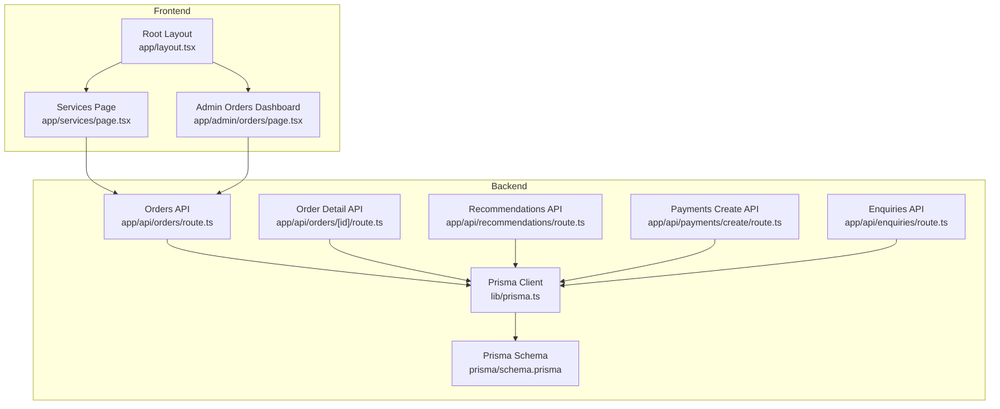
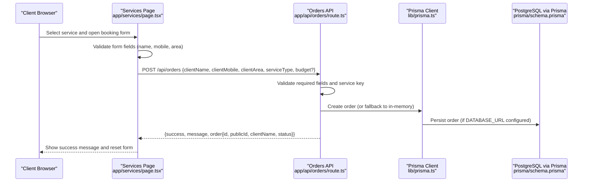
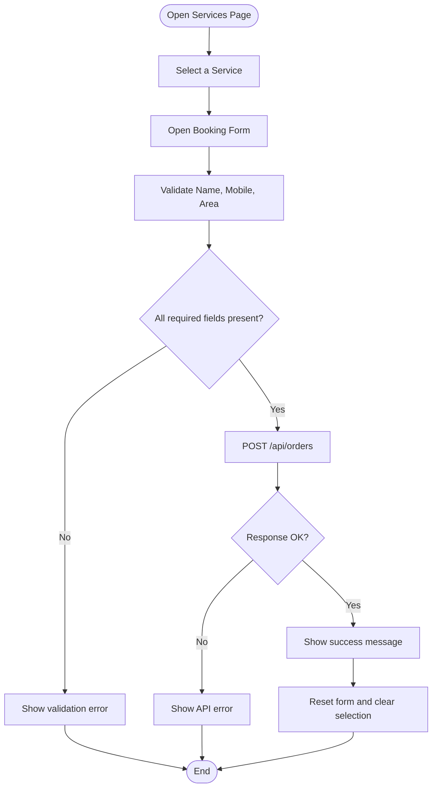
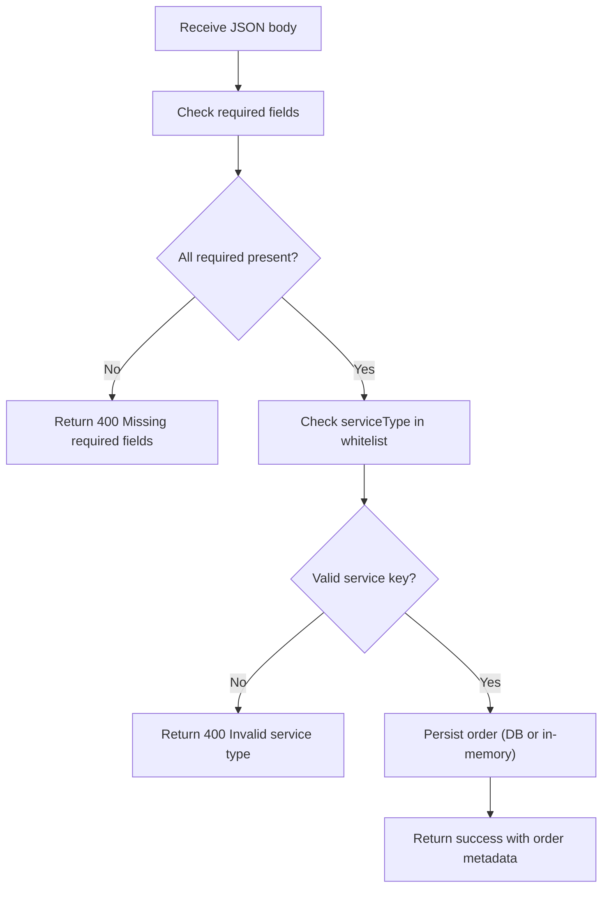
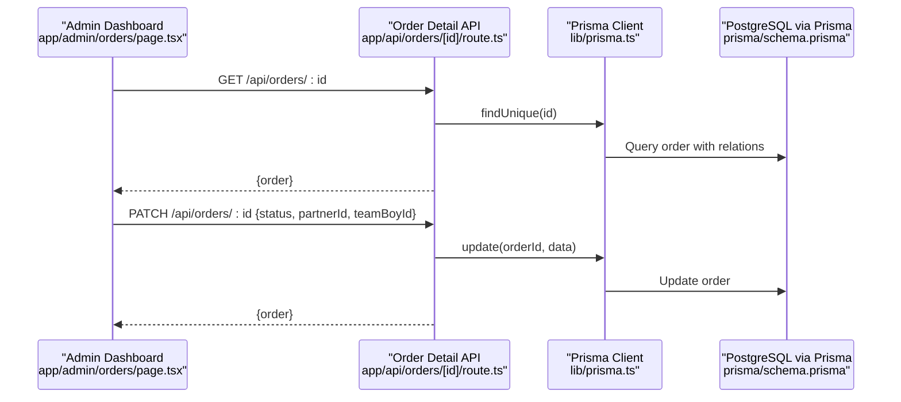
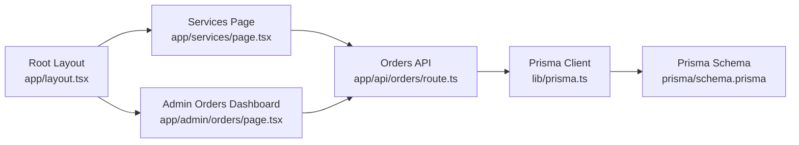

# Service Workflow & Booking

<cite>
**Referenced Files in This Document**
- [app/services/page.tsx](file://app/services/page.tsx)
- [app/api/orders/route.ts](file://app/api/orders/route.ts)
- [app/api/orders/[id]/route.ts](file://app/api/orders/[id]/route.ts)
- [app/admin/orders/page.tsx](file://app/admin/orders/page.tsx)
- [lib/prisma.ts](file://lib/prisma.ts)
- [prisma/schema.prisma](file://prisma/schema.prisma)
- [app/api/enquiries/route.ts](file://app/api/enquiries/route.ts)
- [app/api/recommendations/route.ts](file://app/api/recommendations/route.ts)
- [app/api/payments/create/route.ts](file://app/api/payments/create/route.ts)
- [lib/notifications.ts](file://lib/notifications.ts)
- [app/layout.tsx](file://app/layout.tsx)
- [app/page.tsx](file://app/page.tsx)
</cite>

## Table of Contents
1. [Introduction](#introduction)
2. [Project Structure](#project-structure)
3. [Core Components](#core-components)
4. [Architecture Overview](#architecture-overview)
5. [Detailed Component Analysis](#detailed-component-analysis)
6. [Dependency Analysis](#dependency-analysis)
7. [Performance Considerations](#performance-considerations)
8. [Troubleshooting Guide](#troubleshooting-guide)
9. [Conclusion](#conclusion)
10. [Appendices](#appendices)

## Introduction
This document explains the service workflow system and booking process for Shree Shyam Advertising & Marketing Agency. It covers the complete service request lifecycle from service selection to order creation, including form validation, data collection, submission processing, and integration with the order management system. It also documents the booking workflow for different service types, client information collection (name, mobile, area, budget), order confirmation process, error handling, loading states, success messaging, and form reset functionality. Additionally, it outlines the service key mapping system, order data validation, and pathways for future workflow extensions such as recommendation engines and payment integrations.

## Project Structure
The service workflow spans the frontend and backend:
- Frontend: Service selection UI and booking form
- Backend: Order creation API, order listing API, order detail API, admin dashboard, and supporting APIs for recommendations, payments, and partner onboarding

**Diagram sources**
- [app/services/page.tsx:1-236](file://app/services/page.tsx#L1-L236)
- [app/api/orders/route.ts:1-129](file://app/api/orders/route.ts#L1-L129)
- [app/api/orders/[id]/route.ts:1-54](file://app/api/orders/[id]/route.ts#L1-L54)
- [app/admin/orders/page.tsx:1-92](file://app/admin/orders/page.tsx#L1-L92)
- [lib/prisma.ts:1-22](file://lib/prisma.ts#L1-L22)
- [prisma/schema.prisma:1-173](file://prisma/schema.prisma#L1-L173)
- [app/api/enquiries/route.ts:1-111](file://app/api/enquiries/route.ts#L1-L111)
- [app/api/recommendations/route.ts:1-56](file://app/api/recommendations/route.ts#L1-L56)
- [app/api/payments/create/route.ts:1-46](file://app/api/payments/create/route.ts#L1-L46)
- [app/layout.tsx:1-48](file://app/layout.tsx#L1-L48)

**Section sources**
- [app/services/page.tsx:1-236](file://app/services/page.tsx#L1-L236)
- [app/api/orders/route.ts:1-129](file://app/api/orders/route.ts#L1-L129)
- [app/admin/orders/page.tsx:1-92](file://app/admin/orders/page.tsx#L1-L92)
- [lib/prisma.ts:1-22](file://lib/prisma.ts#L1-L22)
- [prisma/schema.prisma:1-173](file://prisma/schema.prisma#L1-L173)

## Core Components
- Service Selection UI: Presents service cards with suggested combinations and triggers the booking form upon selection.
- Booking Form: Collects client name, mobile, area, and optional budget; validates inputs; submits to the Orders API.
- Orders API: Validates incoming requests, checks service keys, persists orders (with fallback to in-memory storage), and returns standardized responses.
- Admin Orders Dashboard: Lists orders and displays basic metadata for operational oversight.
- Order Detail API: Retrieves a specific order with related entities (partner, team boy, payments).
- Supporting APIs: Enquiries, Recommendations, Payments, and Notifications placeholders.

**Section sources**
- [app/services/page.tsx:65-121](file://app/services/page.tsx#L65-L121)
- [app/api/orders/route.ts:38-127](file://app/api/orders/route.ts#L38-L127)
- [app/admin/orders/page.tsx:16-39](file://app/admin/orders/page.tsx#L16-L39)
- [app/api/orders/[id]/route.ts:11-52](file://app/api/orders/[id]/route.ts#L11-L52)

## Architecture Overview
The service workflow follows a client-server model:
- The client selects a service and fills out the booking form.
- The frontend posts a request to the Orders API with client and service details.
- The backend validates the payload, checks the service key against a predefined list, and persists the order.
- The admin dashboard fetches orders from the Orders API for monitoring.

**Diagram sources**
- [app/services/page.tsx:78-121](file://app/services/page.tsx#L78-L121)
- [app/api/orders/route.ts:39-118](file://app/api/orders/route.ts#L39-L118)
- [lib/prisma.ts:11-16](file://lib/prisma.ts#L11-L16)
- [prisma/schema.prisma:91-123](file://prisma/schema.prisma#L91-L123)

## Detailed Component Analysis

### Service Selection and Booking Form
- Purpose: Allow clients to choose a service and submit a request with personal and campaign details.
- Data Collection:
  - Selected service key (mapped to a predefined set)
  - Client name, mobile, area (required)
  - Budget (optional)
- Validation:
  - Frontend: Ensures required fields are present before submission.
  - Backend: Validates presence of required fields and checks service key against a whitelist.
- Submission:
  - Posts to /api/orders with JSON payload.
  - Handles loading state, success messages, and error feedback.
- Reset:
  - On success, clears form fields and unselects service.

**Diagram sources**
- [app/services/page.tsx:78-121](file://app/services/page.tsx#L78-L121)

**Section sources**
- [app/services/page.tsx:65-121](file://app/services/page.tsx#L65-L121)

### Orders API: Creation and Validation
- Endpoint: POST /api/orders
- Request Payload:
  - clientName: string (required)
  - clientMobile: string (required)
  - clientArea: string (required)
  - serviceType: string (required; must match a predefined key)
  - budget: number (optional)
- Validation:
  - Rejects missing required fields.
  - Validates serviceType against a whitelist.
- Persistence:
  - Generates a publicId (e.g., SSA-XXXX).
  - Creates order with status PENDING.
  - Supports in-memory fallback when DATABASE_URL is not configured.
- Response:
  - Standardized success response with order metadata.

**Diagram sources**
- [app/api/orders/route.ts:39-118](file://app/api/orders/route.ts#L39-L118)

**Section sources**
- [app/api/orders/route.ts:38-127](file://app/api/orders/route.ts#L38-L127)

### Order Detail API: Retrieval and Updates
- Endpoint: GET /api/orders/[id]
  - Retrieves a specific order with related entities (partner, team boy, payments).
- Endpoint: PATCH /api/orders/[id]
  - Updates order status and assignment fields (partnerId, teamBoyId).
  - Accepts partial updates via JSON body.

**Diagram sources**
- [app/admin/orders/page.tsx:21-39](file://app/admin/orders/page.tsx#L21-L39)
- [app/api/orders/[id]/route.ts:11-52](file://app/api/orders/[id]/route.ts#L11-L52)
- [lib/prisma.ts:11-16](file://lib/prisma.ts#L11-L16)
- [prisma/schema.prisma:91-123](file://prisma/schema.prisma#L91-L123)

**Section sources**
- [app/api/orders/[id]/route.ts:11-52](file://app/api/orders/[id]/route.ts#L11-L52)
- [app/admin/orders/page.tsx:16-39](file://app/admin/orders/page.tsx#L16-L39)

### Admin Orders Dashboard
- Purpose: Display recent orders for administrative oversight.
- Behavior:
  - Fetches orders from /api/orders on mount.
  - Handles loading, error, and empty states.
  - Renders a table with order metadata.

**Section sources**
- [app/admin/orders/page.tsx:16-89](file://app/admin/orders/page.tsx#L16-L89)

### Supporting APIs and Integrations
- Enquiries API: Captures client inquiries with validation and persistence.
- Recommendations API: Placeholder for recommendation engine; records suggestion requests.
- Payments Create API: Initializes payment records and returns gateway placeholders.
- Notifications: Centralized logging hooks for partner applications, order confirmations, and status updates.

**Section sources**
- [app/api/enquiries/route.ts:8-81](file://app/api/enquiries/route.ts#L8-L81)
- [app/api/recommendations/route.ts:4-54](file://app/api/recommendations/route.ts#L4-L54)
- [app/api/payments/create/route.ts:5-44](file://app/api/payments/create/route.ts#L5-L44)
- [lib/notifications.ts:3-27](file://lib/notifications.ts#L3-L27)

## Dependency Analysis
- Frontend depends on:
  - Services page for user interaction and form submission.
  - Admin dashboard for order listing.
  - Root layout for global providers and navigation.
- Backend depends on:
  - Prisma client for database operations.
  - Prisma schema for entity definitions and enums.
  - Environment variables for database connectivity.

**Diagram sources**
- [app/services/page.tsx:1-236](file://app/services/page.tsx#L1-L236)
- [app/admin/orders/page.tsx:1-92](file://app/admin/orders/page.tsx#L1-L92)
- [app/api/orders/route.ts:1-129](file://app/api/orders/route.ts#L1-L129)
- [lib/prisma.ts:1-22](file://lib/prisma.ts#L1-L22)
- [prisma/schema.prisma:1-173](file://prisma/schema.prisma#L1-L173)
- [app/layout.tsx:17-46](file://app/layout.tsx#L17-L46)

**Section sources**
- [app/services/page.tsx:1-236](file://app/services/page.tsx#L1-L236)
- [app/admin/orders/page.tsx:1-92](file://app/admin/orders/page.tsx#L1-L92)
- [app/api/orders/route.ts:1-129](file://app/api/orders/route.ts#L1-L129)
- [lib/prisma.ts:1-22](file://lib/prisma.ts#L1-L22)
- [prisma/schema.prisma:1-173](file://prisma/schema.prisma#L1-L173)
- [app/layout.tsx:17-46](file://app/layout.tsx#L17-L46)

## Performance Considerations
- Database Connectivity:
  - The Prisma client is conditionally initialized only when DATABASE_URL is present, enabling seamless development mode with in-memory fallback.
- API Efficiency:
  - Order listing includes related entities; consider pagination and selective field projection for large datasets.
  - Order detail retrieval includes partner, team boy, and payments; ensure minimal includes for read-heavy views.
- Frontend Responsiveness:
  - Loading states prevent duplicate submissions and improve UX.
  - Immediate validation reduces server round trips for obvious errors.

[No sources needed since this section provides general guidance]

## Troubleshooting Guide
- Common Issues and Resolutions:
  - Missing required fields: Ensure name, mobile, and area are filled before submission.
  - Invalid service type: Confirm the service key matches one of the predefined values.
  - Network errors: Verify the backend is reachable and DATABASE_URL is configured for production.
  - Duplicate submissions: The frontend disables the submit button during loading; ensure the state is cleared on success.
- Error Handling:
  - Frontend: Displays user-friendly messages and clears error state on subsequent submissions.
  - Backend: Returns structured error responses with appropriate HTTP status codes.
- Logging:
  - Backend logs new orders and other operations for debugging.
  - Notifications module logs events for future integration with email/SMS providers.

**Section sources**
- [app/services/page.tsx:78-121](file://app/services/page.tsx#L78-L121)
- [app/api/orders/route.ts:43-65](file://app/api/orders/route.ts#L43-L65)
- [app/api/orders/route.ts:120-127](file://app/api/orders/route.ts#L120-L127)
- [lib/notifications.ts:14-26](file://lib/notifications.ts#L14-L26)

## Conclusion
The service workflow system provides a clear, validated path from service selection to order creation, with robust frontend and backend components. The design supports both development and production environments, integrates with an order management system, and leaves room for enhancements such as recommendation engines, payment integrations, and notification automation.

[No sources needed since this section summarizes without analyzing specific files]

## Appendices

### Service Key Mapping System
- Service keys are mapped to service types and validated against a whitelist to ensure data integrity.
- The mapping aligns with the ServiceType enum in the Prisma schema.

**Section sources**
- [app/services/page.tsx:57-63](file://app/services/page.tsx#L57-L63)
- [app/api/orders/route.ts:52-65](file://app/api/orders/route.ts#L52-L65)
- [prisma/schema.prisma:32-39](file://prisma/schema.prisma#L32-L39)

### Order Data Model and Status Lifecycle
- Order entity includes client details, service type, status, budget, and relationships to users, partners, and payments.
- Status transitions are managed via the Order Detail API patch endpoint.

**Section sources**
- [prisma/schema.prisma:91-123](file://prisma/schema.prisma#L91-L123)
- [app/api/orders/[id]/route.ts:36-49](file://app/api/orders/[id]/route.ts#L36-L49)

### Request Payload Structure
- Orders API:
  - Required: clientName, clientMobile, clientArea, serviceType
  - Optional: budget
- Enquiries API:
  - Required: name, mobile, location, requirement
- Recommendations API:
  - Required: area, budget
  - Optional: goal
- Payments Create API:
  - Required: orderId, amount, provider
  - Optional: userId

**Section sources**
- [app/api/orders/route.ts:41-49](file://app/api/orders/route.ts#L41-L49)
- [app/api/enquiries/route.ts:13-21](file://app/api/enquiries/route.ts#L13-L21)
- [app/api/recommendations/route.ts:11-19](file://app/api/recommendations/route.ts#L11-L19)
- [app/api/payments/create/route.ts:12-21](file://app/api/payments/create/route.ts#L12-L21)

### Future Workflow Extensions
- Recommendation Engine: Integrate the Recommendations API to suggest service mixes based on area, budget, and goals.
- Payment Integration: Connect the Payments Create API to real gateways and update order/payment statuses accordingly.
- Notification Automation: Replace logging in notifications with real email/SMS providers.
- Admin Enhancements: Add filters, sorting, and bulk actions in the Admin Orders Dashboard.

[No sources needed since this section provides general guidance]