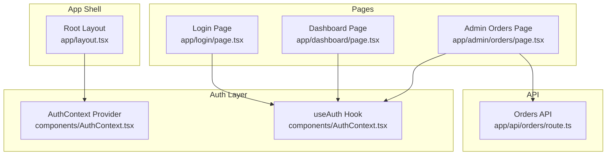
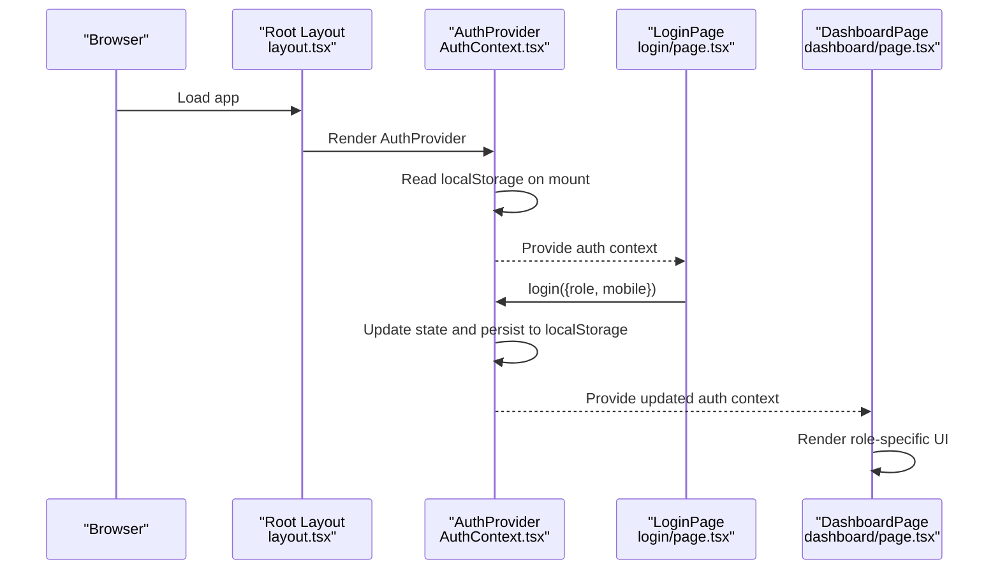
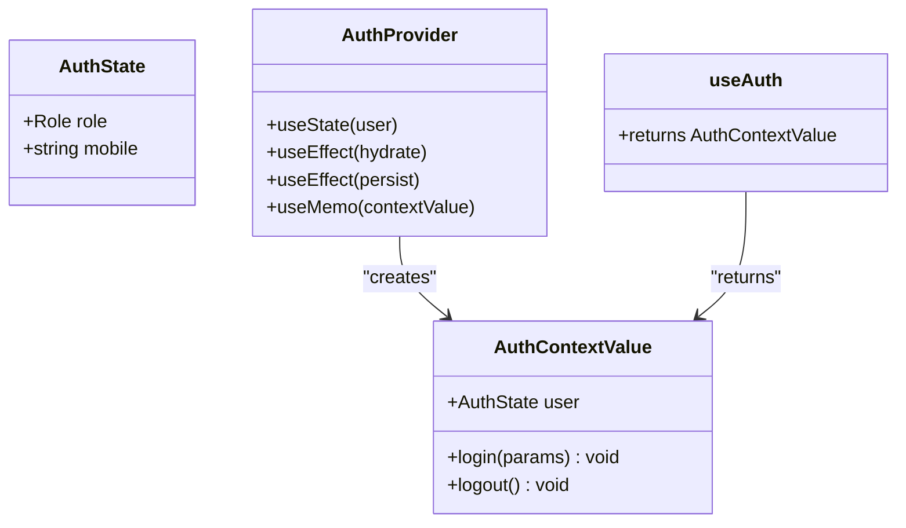
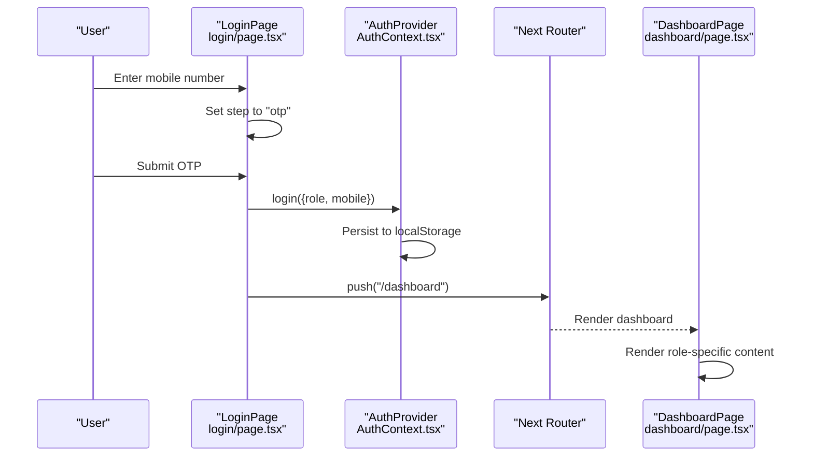
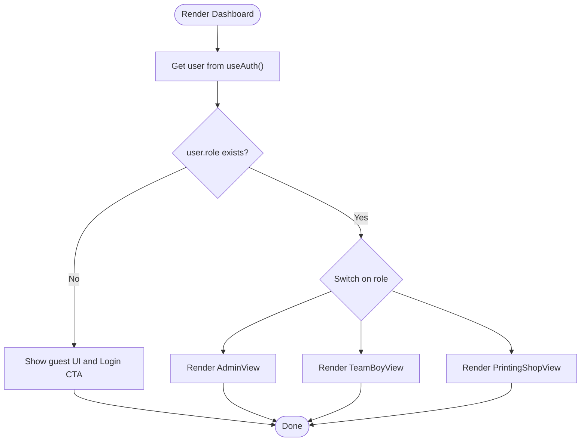
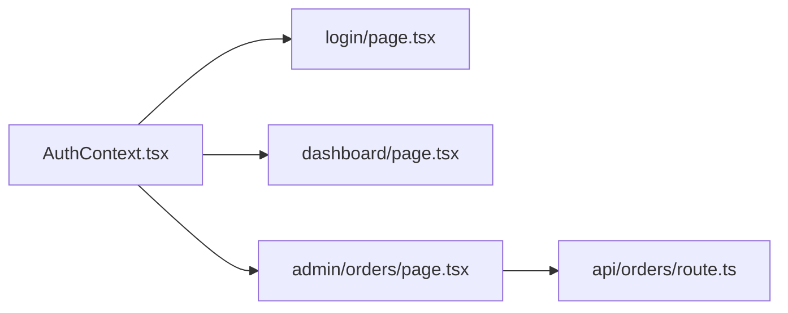

# Authentication Context

<cite>
**Referenced Files in This Document**
- [AuthContext.tsx](file://components/AuthContext.tsx)
- [layout.tsx](file://app/layout.tsx)
- [page.tsx](file://app/login/page.tsx)
- [page.tsx](file://app/dashboard/page.tsx)
- [page.tsx](file://app/admin/orders/page.tsx)
- [route.ts](file://app/api/orders/route.ts)
</cite>

## Table of Contents
1. [Introduction](#introduction)
2. [Project Structure](#project-structure)
3. [Core Components](#core-components)
4. [Architecture Overview](#architecture-overview)
5. [Detailed Component Analysis](#detailed-component-analysis)
6. [Dependency Analysis](#dependency-analysis)
7. [Performance Considerations](#performance-considerations)
8. [Troubleshooting Guide](#troubleshooting-guide)
9. [Conclusion](#conclusion)

## Introduction
This document explains the authentication context implementation using React Context API in a Next.js application. It covers the AuthContext provider structure, state management for user roles (admin, team-boy, printing-shop), and the mobile-based authentication flow. It documents localStorage persistence, state hydration on app load, session management, the useAuth custom hook, error handling for context consumers, and state update patterns. Practical examples demonstrate login/logout operations, role-based access control integration, and consuming authentication state in components. Security considerations, state serialization/deserialization, and debugging tips are included.

## Project Structure
The authentication system centers around a single context provider and a custom hook, integrated at the root layout level. UI pages consume the context to drive role-based rendering and navigation.

**Diagram sources**
- [layout.tsx:17-46](file://app/layout.tsx#L17-L46)
- [AuthContext.tsx:29-68](file://components/AuthContext.tsx#L29-L68)
- [page.tsx:7-126](file://app/login/page.tsx#L7-L126)
- [page.tsx:6-38](file://app/dashboard/page.tsx#L6-L38)
- [page.tsx:16-92](file://app/admin/orders/page.tsx#L16-L92)
- [route.ts:5-25](file://app/api/orders/route.ts#L5-L25)

**Section sources**
- [layout.tsx:17-46](file://app/layout.tsx#L17-L46)
- [AuthContext.tsx:29-68](file://components/AuthContext.tsx#L29-L68)

## Core Components
- AuthContext provider manages authentication state and exposes login/logout actions.
- useAuth hook safely retrieves the context value and throws a descriptive error if used outside the provider.
- localStorage persists the current user state across browser sessions.

Key responsibilities:
- Initialize state with role and mobile set to null.
- Hydrate state from localStorage on mount.
- Persist state to localStorage on every state change.
- Provide login(role, mobile) and logout() functions.
- Expose current user state to consumers.

**Section sources**
- [AuthContext.tsx:12-23](file://components/AuthContext.tsx#L12-L23)
- [AuthContext.tsx:29-68](file://components/AuthContext.tsx#L29-L68)

## Architecture Overview
The authentication flow integrates UI pages with the context provider and localStorage. The root layout wraps the entire app with the provider, ensuring all pages can access authentication state.

**Diagram sources**
- [layout.tsx:26-40](file://app/layout.tsx#L26-L40)
- [AuthContext.tsx:32-48](file://components/AuthContext.tsx#L32-L48)
- [AuthContext.tsx:50-57](file://components/AuthContext.tsx#L50-L57)
- [page.tsx:88-94](file://app/login/page.tsx#L88-L94)
- [page.tsx:6-38](file://app/dashboard/page.tsx#L6-L38)

## Detailed Component Analysis

### AuthContext Provider and useAuth Hook
The provider defines the authentication state shape, memoized context value, and lifecycle hooks for hydration and persistence. The custom hook ensures safe consumption within the provider tree.

**Diagram sources**
- [AuthContext.tsx:14-23](file://components/AuthContext.tsx#L14-L23)
- [AuthContext.tsx:29-68](file://components/AuthContext.tsx#L29-L68)
- [AuthContext.tsx:62-68](file://components/AuthContext.tsx#L62-L68)

Implementation highlights:
- State shape: role and mobile fields with null defaults.
- Hydration: Reads localStorage on mount and parses JSON; ignores malformed data.
- Persistence: Serializes state to JSON and writes to localStorage on every change.
- Memoization: Memoizes context value to prevent unnecessary re-renders.
- Error boundary: useAuth throws a descriptive error if used outside the provider.

**Section sources**
- [AuthContext.tsx:27-27](file://components/AuthContext.tsx#L27-L27)
- [AuthContext.tsx:32-48](file://components/AuthContext.tsx#L32-L48)
- [AuthContext.tsx:50-57](file://components/AuthContext.tsx#L50-L57)
- [AuthContext.tsx:62-68](file://components/AuthContext.tsx#L62-L68)

### Mobile-Based Authentication Flow
The login page implements a two-step flow: mobile input followed by OTP verification. On successful OTP, it invokes the context login function and navigates to the dashboard.

**Diagram sources**
- [page.tsx:8-12](file://app/login/page.tsx#L8-L12)
- [page.tsx:56-84](file://app/login/page.tsx#L56-L84)
- [page.tsx:85-94](file://app/login/page.tsx#L85-L94)
- [AuthContext.tsx:50-57](file://components/AuthContext.tsx#L50-L57)
- [page.tsx:6-38](file://app/dashboard/page.tsx#L6-L38)

Practical steps:
- Choose role using the role buttons.
- Enter mobile number and submit to proceed to OTP.
- On OTP form submission, call login with selected role and mobile.
- Navigate to dashboard to render role-specific views.

**Section sources**
- [page.tsx:24-55](file://app/login/page.tsx#L24-L55)
- [page.tsx:85-94](file://app/login/page.tsx#L85-L94)
- [page.tsx:33-35](file://app/dashboard/page.tsx#L33-L35)

### Role-Based Access Control Integration
The dashboard page consumes authentication state and conditionally renders role-specific views. It also handles guest state and navigation to login.

**Diagram sources**
- [page.tsx:6-38](file://app/dashboard/page.tsx#L6-L38)
- [page.tsx:55-124](file://app/dashboard/page.tsx#L55-L124)
- [page.tsx:126-187](file://app/dashboard/page.tsx#L126-L187)
- [page.tsx:189-255](file://app/dashboard/page.tsx#L189-L255)

**Section sources**
- [page.tsx:6-38](file://app/dashboard/page.tsx#L6-L38)

### State Consumption in Components
Components access authentication state via the useAuth hook:
- LoginPage uses login to set role and mobile after OTP verification.
- Dashboard reads user.role to decide which view to render.
- Navigation links and UI states can be derived from user.role.

Best practices:
- Always wrap components that use useAuth within AuthProvider.
- Guard against null role by providing a fallback (e.g., treating null as "guest").
- Keep UI logic declarative based on user.role.

**Section sources**
- [page.tsx:12-12](file://app/login/page.tsx#L12-L12)
- [page.tsx:7-8](file://app/dashboard/page.tsx#L7-L8)

### Session Management
Session persistence is handled automatically:
- Hydration: On initial mount, provider reads localStorage and sets state if present.
- Updates: Every state change triggers a localStorage write.
- Cleanup: logout resets role and mobile to null, persisting the cleared state.

Security note: localStorage is client-side storage and is not secure for sensitive tokens. Use server-side sessions or secure cookies for production-grade authentication.

**Section sources**
- [AuthContext.tsx:32-48](file://components/AuthContext.tsx#L32-L48)
- [AuthContext.tsx:50-57](file://components/AuthContext.tsx#L50-L57)

## Dependency Analysis
The authentication context depends on React’s Context API and localStorage. Pages depend on the context for state and actions. The admin orders page demonstrates external API usage, which complements but does not replace the context for UI-driven role routing.

**Diagram sources**
- [AuthContext.tsx:29-68](file://components/AuthContext.tsx#L29-L68)
- [page.tsx:7-126](file://app/login/page.tsx#L7-L126)
- [page.tsx:6-38](file://app/dashboard/page.tsx#L6-L38)
- [page.tsx:16-92](file://app/admin/orders/page.tsx#L16-L92)
- [route.ts:5-25](file://app/api/orders/route.ts#L5-L25)

**Section sources**
- [AuthContext.tsx:29-68](file://components/AuthContext.tsx#L29-L68)
- [page.tsx:16-92](file://app/admin/orders/page.tsx#L16-L92)

## Performance Considerations
- Memoization: The provider memoizes the context value to avoid unnecessary re-renders for consumers.
- LocalStorage writes: Persisting on every state change is synchronous and lightweight; consider debouncing for high-frequency updates if needed.
- Hydration cost: One-time JSON parse on mount; negligible impact for small state objects.
- Rendering: Role-based rendering is constant-time based on user.role.

## Troubleshooting Guide
Common issues and resolutions:
- Error: "useAuth must be used within AuthProvider"
  - Cause: Hook called outside provider tree.
  - Fix: Ensure the component is rendered within AuthProvider in the root layout.
  - Reference: [AuthContext.tsx:64-66](file://components/AuthContext.tsx#L64-L66), [layout.tsx:26](file://app/layout.tsx#L26)

- State not persisting across reloads
  - Cause: localStorage disabled or blocked.
  - Fix: Verify browser supports localStorage; check for Content Security Policy restrictions.
  - Reference: [AuthContext.tsx:35-47](file://components/AuthContext.tsx#L35-L47)

- Malformed localStorage data
  - Cause: Corrupted or incompatible data.
  - Fix: Clear localStorage key; provider ignores parse errors during hydration.
  - Reference: [AuthContext.tsx:40-42](file://components/AuthContext.tsx#L40-L42)

- Role-based UI not updating
  - Cause: Consumer not subscribed to context or role not set.
  - Fix: Confirm login was called with a valid role; ensure component re-renders on context changes.
  - References: [AuthContext.tsx:50-57](file://components/AuthContext.tsx#L50-L57), [page.tsx:33-35](file://app/dashboard/page.tsx#L33-L35)

- Debugging authentication state
  - Steps: Open browser devtools, inspect localStorage for the auth key; verify JSON structure matches state shape; log context value in components.
  - References: [AuthContext.tsx:27](file://components/AuthContext.tsx#L27), [AuthContext.tsx:35-38](file://components/AuthContext.tsx#L35-L38)

## Conclusion
The authentication context provides a clean, minimal implementation for managing user roles and mobile-based login in a Next.js app. It leverages React Context for state distribution, localStorage for persistence, and a custom hook for safe consumption. The design supports role-based UI rendering and is easily extensible for additional roles or fields. For production deployments, pair this client-side context with server-side authentication mechanisms and secure session management.