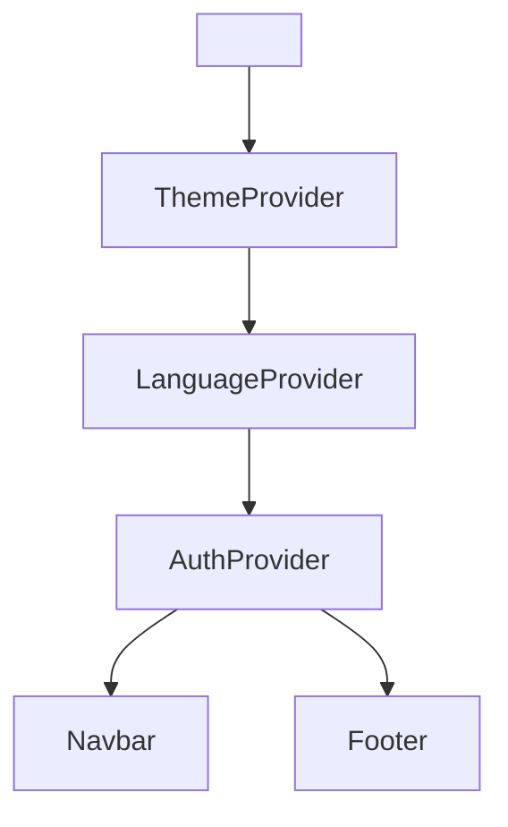
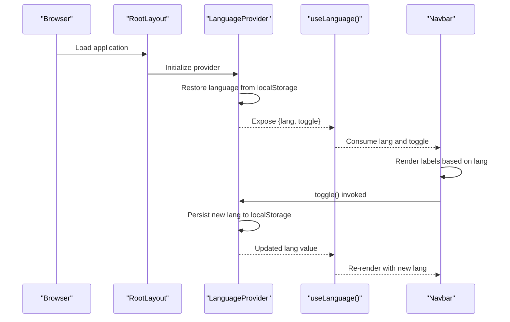
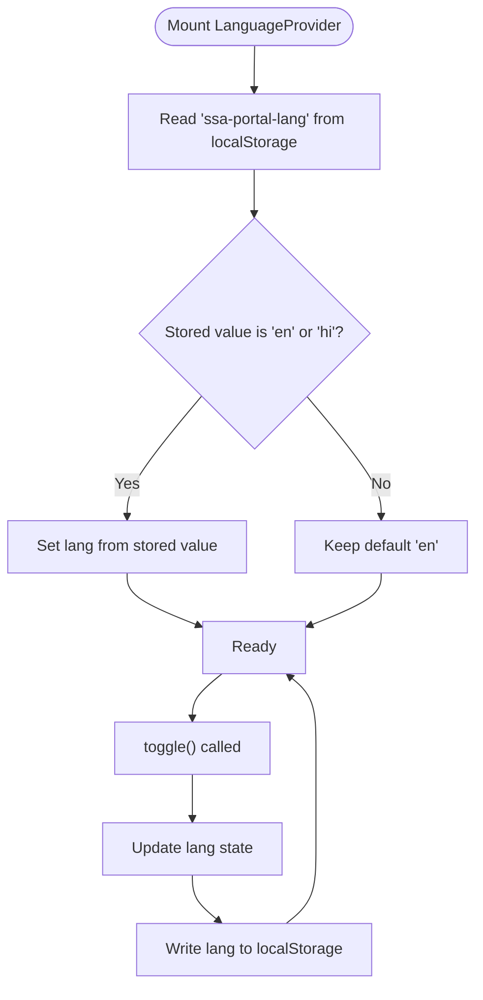
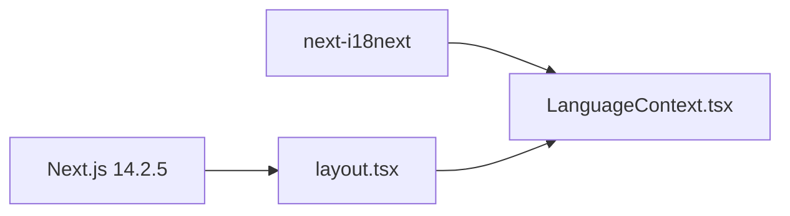

# Language Context

<cite>
**Referenced Files in This Document**
- [LanguageContext.tsx](file://components/LanguageContext.tsx)
- [layout.tsx](file://app/layout.tsx)
- [Navbar.tsx](file://components/Navbar.tsx)
- [Footer.tsx](file://components/Footer.tsx)
- [AuthContext.tsx](file://components/AuthContext.tsx)
- [next.config.mjs](file://next.config.mjs)
- [package.json](file://package.json)
</cite>

## Table of Contents
1. [Introduction](#introduction)
2. [Project Structure](#project-structure)
3. [Core Components](#core-components)
4. [Architecture Overview](#architecture-overview)
5. [Detailed Component Analysis](#detailed-component-analysis)
6. [Dependency Analysis](#dependency-analysis)
7. [Performance Considerations](#performance-considerations)
8. [Troubleshooting Guide](#troubleshooting-guide)
9. [Conclusion](#conclusion)

## Introduction
This document explains the internationalization context that manages multi-language support and locale preferences in the application. It covers the LanguageProvider implementation, language state management, and locale persistence mechanisms. It also documents the integration with Next.js internationalization features, dynamic language switching, and component translation patterns. Guidance is included for localized content rendering, date/time formatting, number localization, language fallback mechanisms, right-to-left (RTL) language considerations, and debugging internationalization issues.

## Project Structure
The internationalization context is implemented as a React Context and is initialized at the root layout level. Providers are composed to manage language, theme, and authentication state. The Navbar demonstrates how language state is consumed to render localized navigation labels and a language switch button.

**Diagram sources**
- [layout.tsx:17-45](file://app/layout.tsx#L17-L45)

**Section sources**
- [layout.tsx:17-45](file://app/layout.tsx#L17-L45)

## Core Components
- LanguageProvider: Manages the current language state and persists it to localStorage. Exposes a toggle function to switch between supported languages.
- useLanguage hook: Provides access to the current language and toggle function within components.
- Root layout: Wraps the application with providers, including LanguageProvider, to make language state available globally.
- Navbar: Demonstrates consuming language state to render localized labels and a language switch UI.

Key implementation characteristics:
- Supported languages are typed as "en" | "hi".
- Language state is restored from localStorage on initial load and persisted on change.
- The toggle function switches between English and Hindi.

**Section sources**
- [LanguageContext.tsx:12-17](file://components/LanguageContext.tsx#L12-L17)
- [LanguageContext.tsx:23-50](file://components/LanguageContext.tsx#L23-L50)
- [LanguageContext.tsx:53-57](file://components/LanguageContext.tsx#L53-L57)
- [layout.tsx:24-42](file://app/layout.tsx#L24-L42)
- [Navbar.tsx:19-59](file://components/Navbar.tsx#L19-L59)

## Architecture Overview
The language context integrates with Next.js internationalization features and React component rendering. The provider is mounted at the root layout, ensuring global availability. Components consume the context via the useLanguage hook to render localized content and to trigger language switching.

**Diagram sources**
- [layout.tsx:24-42](file://app/layout.tsx#L24-L42)
- [LanguageContext.tsx:23-50](file://components/LanguageContext.tsx#L23-L50)
- [Navbar.tsx:19-59](file://components/Navbar.tsx#L19-L59)

## Detailed Component Analysis

### LanguageProvider Implementation
- State initialization: Initializes language to "en" by default.
- Persistence: Restores language from localStorage on mount and writes updates to localStorage on state change.
- Value memoization: Memoizes the context value to prevent unnecessary re-renders.
- Toggle logic: Switches between "en" and "hi".

**Diagram sources**
- [LanguageContext.tsx:23-50](file://components/LanguageContext.tsx#L23-L50)

**Section sources**
- [LanguageContext.tsx:23-50](file://components/LanguageContext.tsx#L23-L50)

### useLanguage Hook
- Enforces provider usage: Throws if used outside LanguageProvider.
- Returns current language and toggle function for consumers.

**Section sources**
- [LanguageContext.tsx:53-57](file://components/LanguageContext.tsx#L53-L57)

### Root Layout Integration
- Mounts LanguageProvider alongside ThemeProvider and AuthProvider.
- Sets the HTML lang attribute to "en" at the root.

**Section sources**
- [layout.tsx:19](file://app/layout.tsx#L19)
- [layout.tsx:24-42](file://app/layout.tsx#L24-L42)

### Navbar Localization Pattern
- Localized labels are embedded directly in the component as English and Hindi variants.
- Renders labels based on the current language value.
- Provides a button to trigger language toggle.

Note: The Navbar currently uses a temporary hardcoded language value for demonstration. To enable dynamic language switching, integrate the useLanguage hook to replace the temporary value.

**Section sources**
- [Navbar.tsx:6-17](file://components/Navbar.tsx#L6-L17)
- [Navbar.tsx:19-59](file://components/Navbar.tsx#L19-L59)

### Footer and Static Content
- Footer renders static text without explicit language switching logic.
- For multilingual static content, consider externalizing strings and using the language context to select appropriate translations.

**Section sources**
- [Footer.tsx:1-17](file://components/Footer.tsx#L1-L17)

## Dependency Analysis
- Next.js: The application uses Next.js 14.2.5 and Next.js internationalization features. The root layout sets the HTML lang attribute, aligning with Next.js i18n expectations.
- next-i18next: The project includes next-i18next as a dependency, indicating readiness to adopt server-side or client-side internationalization patterns with backend resources.

**Diagram sources**
- [package.json:21-22](file://package.json#L21-L22)
- [layout.tsx:17-45](file://app/layout.tsx#L17-L45)
- [LanguageContext.tsx:23-50](file://components/LanguageContext.tsx#L23-L50)

**Section sources**
- [package.json:21-22](file://package.json#L21-L22)
- [next.config.mjs:1-14](file://next.config.mjs#L1-L14)

## Performance Considerations
- Context value memoization: The provider memoizes the context value to avoid unnecessary re-renders when unrelated state changes occur.
- localStorage operations: Persisting language state on each change is lightweight but occurs synchronously. No batching is applied; consider debouncing if toggling frequency is high.
- Rendering cost: Localized label rendering in Navbar is O(n) per navigation item; keep the number of links reasonable.

[No sources needed since this section provides general guidance]

## Troubleshooting Guide
Common issues and resolutions:
- useLanguage used outside provider: The hook throws an error if not wrapped by LanguageProvider. Ensure the provider is mounted in the root layout.
- Unexpected language reset: Verify localStorage key consistency ("ssa-portal-lang") and that only "en" or "hi" values are accepted.
- Navbar not reflecting language changes: Confirm that Navbar consumes the language state from useLanguage and re-renders after toggle.
- Next.js i18n alignment: The HTML lang attribute is set to "en". When adopting next-i18next, update the lang attribute dynamically based on the selected locale.

**Section sources**
- [LanguageContext.tsx:53-57](file://components/LanguageContext.tsx#L53-L57)
- [layout.tsx:19](file://app/layout.tsx#L19)
- [Navbar.tsx:19-59](file://components/Navbar.tsx#L19-L59)

## Conclusion
The LanguageProvider establishes a minimal yet effective internationalization foundation by managing language state, persisting preferences, and exposing a simple toggle mechanism. The root layout integrates the provider globally, while components like Navbar demonstrate consumption patterns. For production-grade i18n, consider adopting next-i18next with resource files and dynamic HTML lang updates to align with Next.js internationalization features.