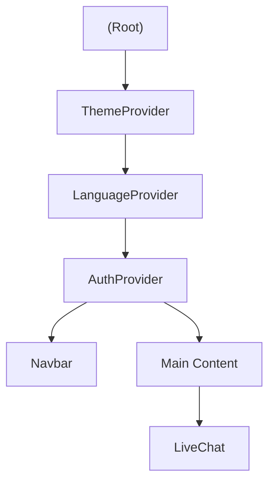
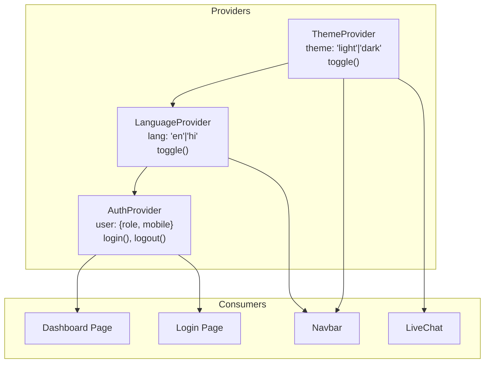
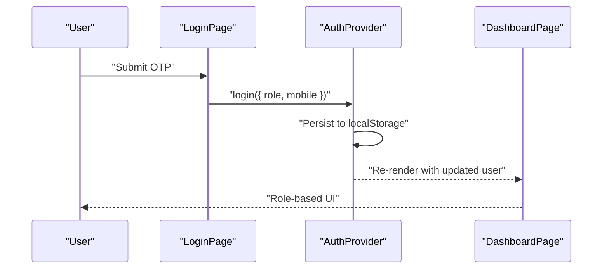
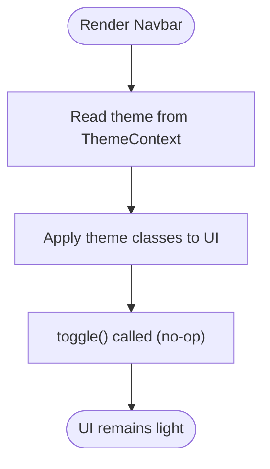
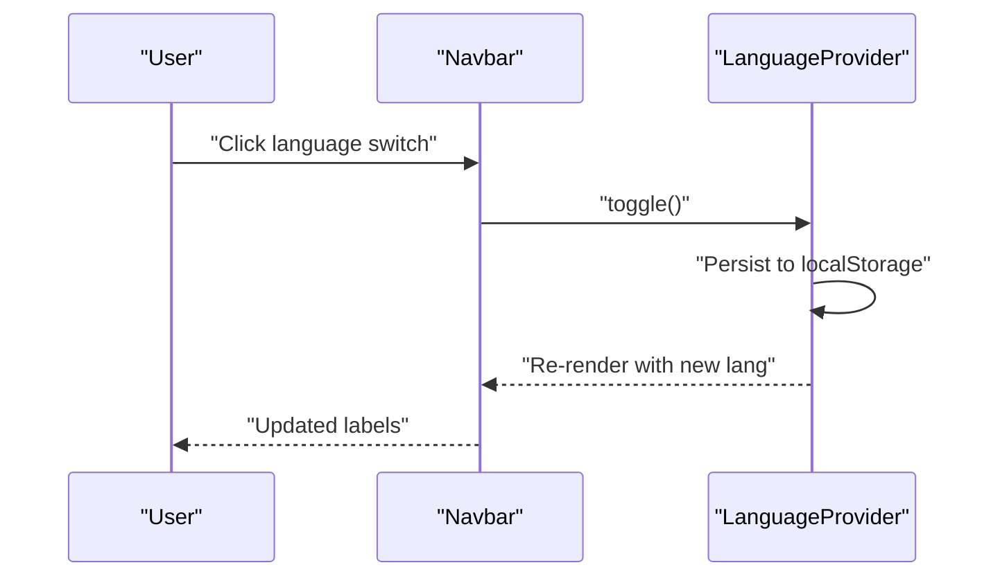
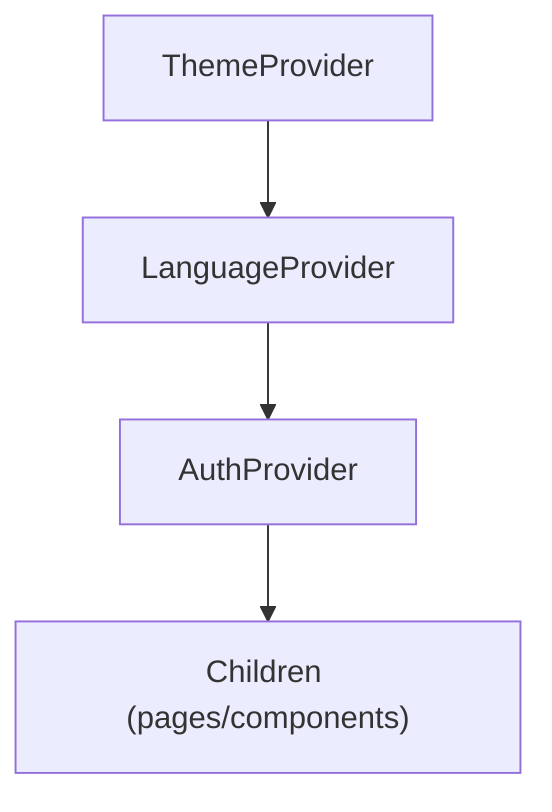
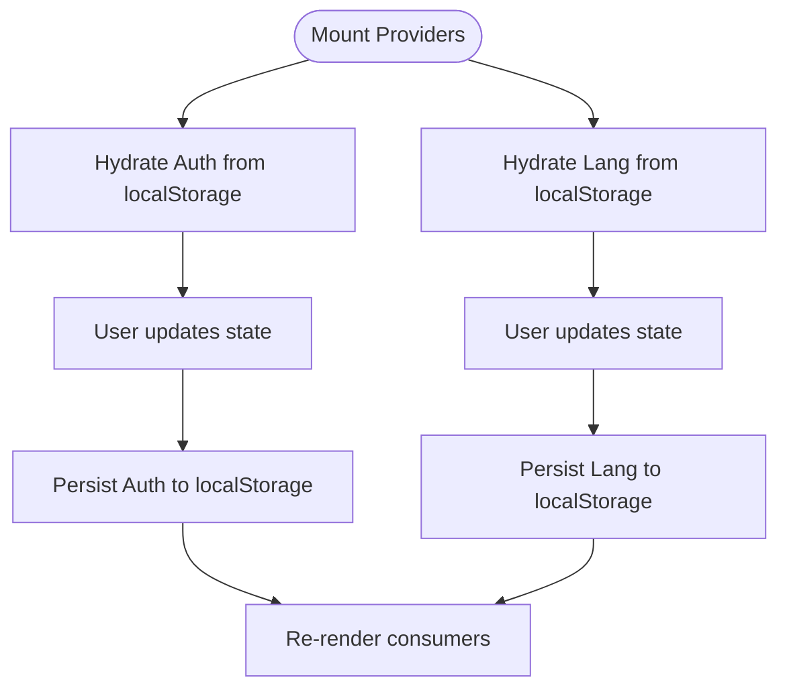
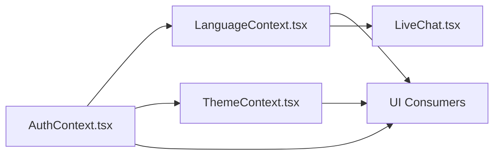

# State Management

<cite>
**Referenced Files in This Document**
- [AuthContext.tsx](file://components/AuthContext.tsx)
- [ThemeContext.tsx](file://components/ThemeContext.tsx)
- [LanguageContext.tsx](file://components/LanguageContext.tsx)
- [layout.tsx](file://app/layout.tsx)
- [login/page.tsx](file://app/login/page.tsx)
- [dashboard/page.tsx](file://app/dashboard/page.tsx)
- [LiveChat.tsx](file://components/LiveChat.tsx)
- [Navbar.tsx](file://components/Navbar.tsx)
</cite>

## Table of Contents
1. [Introduction](#introduction)
2. [Project Structure](#project-structure)
3. [Core Components](#core-components)
4. [Architecture Overview](#architecture-overview)
5. [Detailed Component Analysis](#detailed-component-analysis)
6. [Dependency Analysis](#dependency-analysis)
7. [Performance Considerations](#performance-considerations)
8. [Troubleshooting Guide](#troubleshooting-guide)
9. [Conclusion](#conclusion)
10. [Appendices](#appendices)

## Introduction
This document explains the state management system built with React Context API in the project. It focuses on three providers: authentication, theme, and language localization. It documents state structure, provider hierarchy, update mechanisms, persistence and hydration, SSR considerations, consumption patterns, performance optimizations, debugging approaches, custom hooks, composition patterns, error boundary integration, state migration strategies, and testing methodologies.

## Project Structure
The state providers are initialized at the root layout and consumed by pages and shared components. Providers wrap the application in a strict hierarchy to ensure predictable updates and minimal re-renders.

**Diagram sources**
- [layout.tsx:17-46](file://app/layout.tsx#L17-L46)

**Section sources**
- [layout.tsx:17-46](file://app/layout.tsx#L17-L46)

## Core Components
- Authentication Context: Manages role and mobile for logged-in users, persists to localStorage, and exposes login/logout actions.
- Theme Context: Provides a theme value and a toggle function; currently fixed to a light theme.
- Language Context: Manages current language and a toggle action, persisted to localStorage.

Key implementation characteristics:
- All providers are client components and guard against server environments.
- State updates are memoized to avoid unnecessary re-renders.
- Persistence uses localStorage with safe parsing and storage hooks.

**Section sources**
- [AuthContext.tsx:14-68](file://components/AuthContext.tsx#L14-L68)
- [ThemeContext.tsx:5-33](file://components/ThemeContext.tsx#L5-L33)
- [LanguageContext.tsx:12-57](file://components/LanguageContext.tsx#L12-L57)

## Architecture Overview
The provider hierarchy ensures that child components can consume state without prop drilling. Authentication state drives role-based views, while language and theme influence UI presentation.

**Diagram sources**
- [AuthContext.tsx:29-60](file://components/AuthContext.tsx#L29-L60)
- [LanguageContext.tsx:23-50](file://components/LanguageContext.tsx#L23-L50)
- [ThemeContext.tsx:14-27](file://components/ThemeContext.tsx#L14-L27)
- [layout.tsx:24-42](file://app/layout.tsx#L24-L42)

## Detailed Component Analysis

### Authentication Context
- State shape: role and mobile.
- Persistence: hydrates from localStorage on mount and writes on every state change.
- Exposed actions: login and logout.
- Hook safety: throws if used outside provider.

**Diagram sources**
- [login/page.tsx:88-100](file://app/login/page.tsx#L88-L100)
- [AuthContext.tsx:50-57](file://components/AuthContext.tsx#L50-L57)
- [AuthContext.tsx:45-48](file://components/AuthContext.tsx#L45-L48)
- [dashboard/page.tsx:6-7](file://app/dashboard/page.tsx#L6-L7)

**Section sources**
- [AuthContext.tsx:14-68](file://components/AuthContext.tsx#L14-L68)
- [login/page.tsx:88-100](file://app/login/page.tsx#L88-L100)
- [dashboard/page.tsx:6-7](file://app/dashboard/page.tsx#L6-L7)

### Theme Context
- State shape: theme with a toggle function.
- Current behavior: theme is fixed to light; toggle is a no-op.
- Hook safety: throws if used outside provider.

**Diagram sources**
- [ThemeContext.tsx:14-27](file://components/ThemeContext.tsx#L14-L27)
- [Navbar.tsx:19-24](file://components/Navbar.tsx#L19-L24)

**Section sources**
- [ThemeContext.tsx:5-33](file://components/ThemeContext.tsx#L5-L33)
- [Navbar.tsx:19-24](file://components/Navbar.tsx#L19-L24)

### Language Context
- State shape: lang with a toggle action.
- Persistence: hydrates from localStorage on mount and writes on every state change.
- Hook safety: throws if used outside provider.

**Diagram sources**
- [LanguageContext.tsx:39-45](file://components/LanguageContext.tsx#L39-L45)
- [LanguageContext.tsx:26-37](file://components/LanguageContext.tsx#L26-L37)
- [Navbar.tsx:49-54](file://components/Navbar.tsx#L49-L54)

**Section sources**
- [LanguageContext.tsx:12-57](file://components/LanguageContext.tsx#L12-L57)
- [Navbar.tsx:49-54](file://components/Navbar.tsx#L49-L54)

### Provider Hierarchy and Composition
- Root layout composes providers from outermost to innermost: Theme -> Language -> Auth.
- This ensures that language and theme are available to all consumers, including the auth-protected parts of the app.

**Diagram sources**
- [layout.tsx:24-42](file://app/layout.tsx#L24-L42)

**Section sources**
- [layout.tsx:24-42](file://app/layout.tsx#L24-L42)

### State Consumption Patterns
- Pages consume context directly via custom hooks.
- Navbar consumes language and theme but temporarily uses hardcoded values for demonstration.
- LiveChat is a client component that loads external chat widgets and does not depend on context.

Examples of consumption:
- Dashboard reads authentication state to render role-specific views.
- Login uses authentication actions to set state after OTP verification.
- Navbar conditionally renders language and theme controls.

**Section sources**
- [dashboard/page.tsx:6-7](file://app/dashboard/page.tsx#L6-L7)
- [login/page.tsx:12](file://app/login/page.tsx#L12)
- [Navbar.tsx:19-24](file://components/Navbar.tsx#L19-L24)
- [LiveChat.tsx:12-47](file://components/LiveChat.tsx#L12-L47)

### State Persistence and Hydration
- Authentication: hydrate from localStorage on mount; persist on every state change.
- Language: hydrate from localStorage on mount; persist on every state change.
- Theme: current implementation does not persist toggles; theme is fixed.

**Diagram sources**
- [AuthContext.tsx:32-48](file://components/AuthContext.tsx#L32-L48)
- [LanguageContext.tsx:26-37](file://components/LanguageContext.tsx#L26-L37)

**Section sources**
- [AuthContext.tsx:32-48](file://components/AuthContext.tsx#L32-L48)
- [LanguageContext.tsx:26-37](file://components/LanguageContext.tsx#L26-L37)

### Server-Side Rendering Considerations
- Providers are client components and skip initialization on the server.
- Hydration occurs on the client; initial render avoids reading localStorage on the server.
- Theme provider currently returns a constant theme value, simplifying SSR.

**Section sources**
- [AuthContext.tsx:32-34](file://components/AuthContext.tsx#L32-L34)
- [LanguageContext.tsx:26-28](file://components/LanguageContext.tsx#L26-L28)
- [ThemeContext.tsx:14-22](file://components/ThemeContext.tsx#L14-L22)

### State Update Mechanisms and Memoization
- Each provider computes its context value with useMemo keyed on state to prevent object identity churn.
- Effects write to localStorage after state changes to maintain persistence.

**Section sources**
- [AuthContext.tsx:50-57](file://components/AuthContext.tsx#L50-L57)
- [LanguageContext.tsx:39-45](file://components/LanguageContext.tsx#L39-L45)
- [ThemeContext.tsx:16-22](file://components/ThemeContext.tsx#L16-L22)

### Integration Between Providers
- Language and theme are independent of authentication state.
- Authentication state influences which dashboard view is rendered; language and theme affect UI labels and appearance.
- LiveChat is a separate concern and does not depend on context.

**Section sources**
- [layout.tsx:24-42](file://app/layout.tsx#L24-L42)
- [LiveChat.tsx:12-47](file://components/LiveChat.tsx#L12-L47)

### Custom Hooks and Composition
- useAuth returns the authentication slice and actions.
- useLanguage returns the language slice and toggle.
- useTheme returns the theme slice and toggle.
- Composition: nest providers to compose state slices; consumers pick what they need.

**Section sources**
- [AuthContext.tsx:62-68](file://components/AuthContext.tsx#L62-L68)
- [LanguageContext.tsx:52-57](file://components/LanguageContext.tsx#L52-L57)
- [ThemeContext.tsx:29-33](file://components/ThemeContext.tsx#L29-L33)

### Error Boundary Integration
- Custom hooks throw if used outside a provider; wrap the root layout with an error boundary to catch and display a friendly message during development and production.

Recommended placement:
- Wrap the root HTML element with an error boundary component to capture provider misuse early.

**Section sources**
- [AuthContext.tsx:62-68](file://components/AuthContext.tsx#L62-L68)
- [LanguageContext.tsx:52-57](file://components/LanguageContext.tsx#L52-L57)
- [ThemeContext.tsx:29-33](file://components/ThemeContext.tsx#L29-L33)

### State Migration Strategies
- Versioned keys: introduce a version prefix in localStorage keys to migrate data when shapes change.
- Graceful degradation: handle missing or malformed data by resetting to defaults.
- Backward compatibility: when adding fields, initialize new keys and derive defaults from existing persisted data.

[No sources needed since this section provides general guidance]

### Testing Methodologies for Context Providers
- Unit tests for provider logic:
  - Verify hydration from localStorage on mount.
  - Verify persistence after state updates.
  - Verify action dispatch triggers expected state transitions.
- Integration tests:
  - Render a component under each provider and assert UI reflects context state.
  - Simulate user interactions (e.g., language toggle, login) and assert side effects (localStorage writes).
- Snapshot tests:
  - Capture rendered UI snapshots for different context states to detect regressions.
- Error boundary coverage:
  - Ensure hook misuse throws and is caught by an error boundary.

[No sources needed since this section provides general guidance]

## Dependency Analysis
- Provider coupling:
  - AuthProvider depends on localStorage and is self-contained.
  - LanguageProvider depends on localStorage and is self-contained.
  - ThemeProvider is decoupled from authentication and language.
- Cohesion:
  - Each provider encapsulates a single domain (auth, theme, language).
- External dependencies:
  - LiveChat loads third-party scripts; it is independent of context.

**Diagram sources**
- [AuthContext.tsx:29-60](file://components/AuthContext.tsx#L29-L60)
- [LanguageContext.tsx:23-50](file://components/LanguageContext.tsx#L23-L50)
- [ThemeContext.tsx:14-27](file://components/ThemeContext.tsx#L14-L27)
- [LiveChat.tsx:12-47](file://components/LiveChat.tsx#L12-L47)

**Section sources**
- [AuthContext.tsx:29-60](file://components/AuthContext.tsx#L29-L60)
- [LanguageContext.tsx:23-50](file://components/LanguageContext.tsx#L23-L50)
- [ThemeContext.tsx:14-27](file://components/ThemeContext.tsx#L14-L27)
- [LiveChat.tsx:12-47](file://components/LiveChat.tsx#L12-L47)

## Performance Considerations
- Memoization: useMemo in providers prevents unnecessary re-renders by stabilizing context values.
- Minimal state scope: keep each provider focused on a single domain to reduce re-renders.
- Client-only providers: avoid server work in providers to minimize SSR overhead.
- Debounced persistence: consider debouncing localStorage writes for frequent updates (e.g., language toggle) to reduce I/O.

[No sources needed since this section provides general guidance]

## Troubleshooting Guide
- Hook misuse:
  - Symptom: Error indicating the hook must be used within a provider.
  - Fix: Ensure the component is rendered within the provider’s subtree.
- Empty or stale state:
  - Symptom: UI appears unauthenticated or default language/theme.
  - Fix: Confirm localStorage keys and values; verify hydration effects run on the client.
- Persistent state conflicts:
  - Symptom: Unexpected role or language after reload.
  - Fix: Validate localStorage content; sanitize on parse; reset on malformed data.
- Provider ordering:
  - Symptom: Language or theme not applied.
  - Fix: Confirm provider hierarchy in the root layout.

**Section sources**
- [AuthContext.tsx:62-68](file://components/AuthContext.tsx#L62-L68)
- [LanguageContext.tsx:26-37](file://components/LanguageContext.tsx#L26-L37)
- [ThemeContext.tsx:29-33](file://components/ThemeContext.tsx#L29-L33)
- [layout.tsx:24-42](file://app/layout.tsx#L24-L42)

## Conclusion
The project employs a clean, provider-based state management model using React Context. Authentication, theme, and language are isolated concerns with clear boundaries, memoized updates, and localStorage persistence. The root layout composes providers to enable seamless consumption across the app. Following the recommended practices for persistence, hydration, performance, and testing will help maintain a robust and scalable state layer.

## Appendices

### API and Action Surface
- AuthProvider
  - user: { role, mobile }
  - login({ role, mobile }): sets user
  - logout(): clears user
- LanguageProvider
  - lang: "en" | "hi"
  - toggle(): switches language
- ThemeProvider
  - theme: "light" | "dark"
  - toggle(): no-op (fixed to light)

**Section sources**
- [AuthContext.tsx:14-23](file://components/AuthContext.tsx#L14-L23)
- [LanguageContext.tsx:14-17](file://components/LanguageContext.tsx#L14-L17)
- [ThemeContext.tsx:7-10](file://components/ThemeContext.tsx#L7-L10)