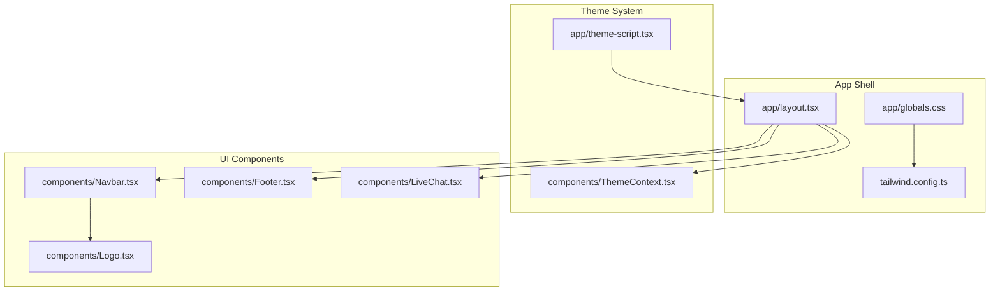
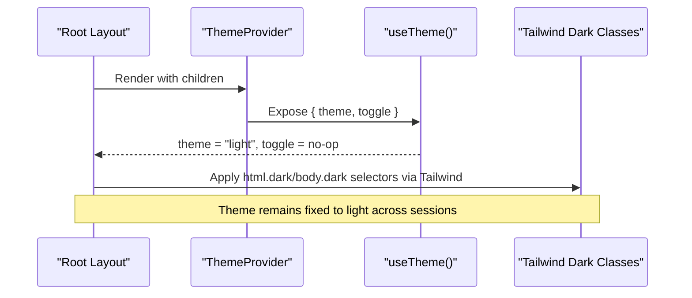
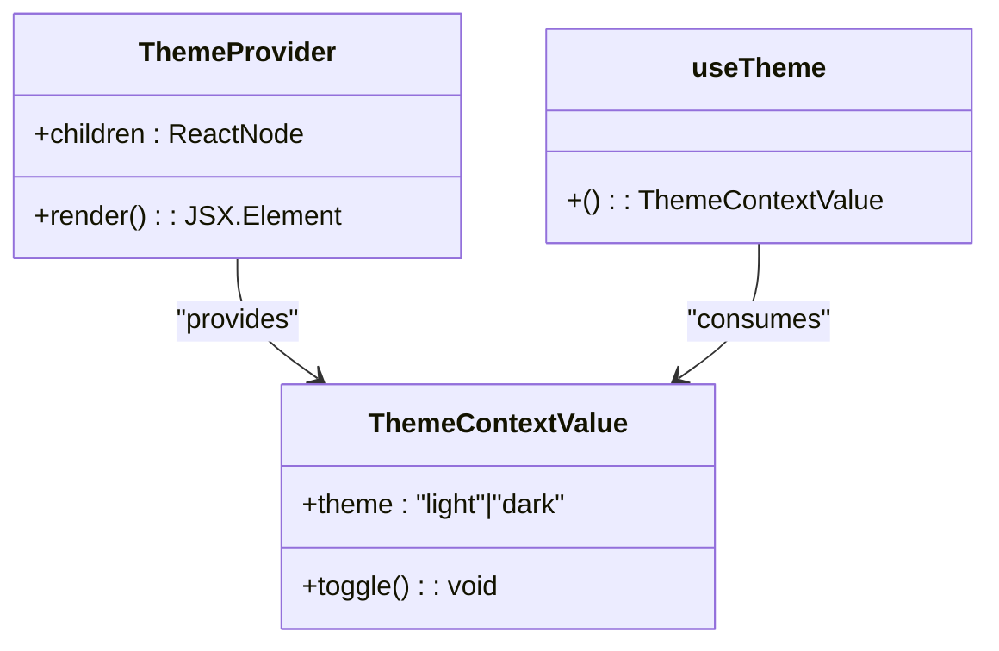
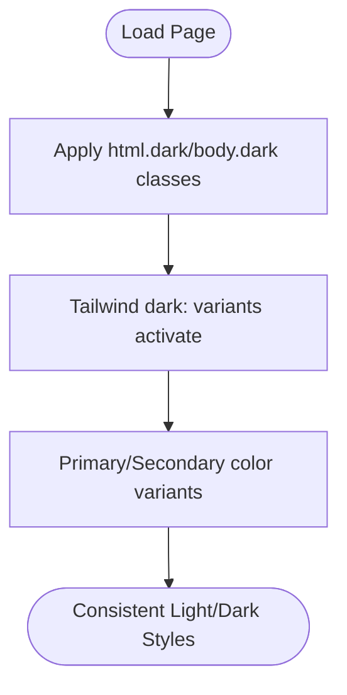
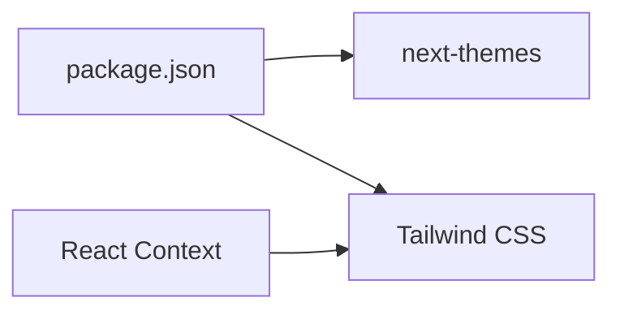

# Theme Context

<cite>
**Referenced Files in This Document**
- [ThemeContext.tsx](file://components/ThemeContext.tsx)
- [theme-script.tsx](file://app/theme-script.tsx)
- [layout.tsx](file://app/layout.tsx)
- [globals.css](file://app/globals.css)
- [tailwind.config.ts](file://tailwind.config.ts)
- [Navbar.tsx](file://components/Navbar.tsx)
- [Footer.tsx](file://components/Footer.tsx)
- [Logo.tsx](file://components/Logo.tsx)
- [LiveChat.tsx](file://components/LiveChat.tsx)
- [package.json](file://package.json)
</cite>

## Table of Contents
1. [Introduction](#introduction)
2. [Project Structure](#project-structure)
3. [Core Components](#core-components)
4. [Architecture Overview](#architecture-overview)
5. [Detailed Component Analysis](#detailed-component-analysis)
6. [Dependency Analysis](#dependency-analysis)
7. [Performance Considerations](#performance-considerations)
8. [Troubleshooting Guide](#troubleshooting-guide)
9. [Conclusion](#conclusion)
10. [Appendices](#appendices)

## Introduction
This document explains the theme context system used to manage dark/light mode and color scheme preferences across the Next.js application. It covers the ThemeProvider implementation, theme state management, and how preferences are persisted across sessions. It also documents the integration with Next.js app router, script-based theme switching, and server-side rendering (SSR) considerations. The guide details the useTheme custom hook, theme toggle functionality, and component consumption patterns. Examples of theme-aware component implementation, CSS variable usage, and responsive design considerations are included. Finally, it addresses theme migration strategies, default theme handling, and debugging theme-related issues.

## Project Structure
The theme system is implemented with a minimal, opinionated approach:
- A custom ThemeProvider and useTheme hook encapsulate theme state and toggling.
- Tailwind CSS handles dark mode via the class strategy.
- A ThemeScript component is present but currently returns null, indicating no dynamic script injection is used.
- The root layout wraps the application with ThemeProvider and applies global styles.

**Diagram sources**
- [layout.tsx:17-46](file://app/layout.tsx#L17-L46)
- [ThemeContext.tsx:14-27](file://components/ThemeContext.tsx#L14-L27)
- [theme-script.tsx:1-4](file://app/theme-script.tsx#L1-L4)
- [globals.css:1-32](file://app/globals.css#L1-L32)
- [tailwind.config.ts:1-31](file://tailwind.config.ts#L1-L31)
- [Navbar.tsx:19-60](file://components/Navbar.tsx#L19-L60)
- [Footer.tsx:1-17](file://components/Footer.tsx#L1-L17)
- [Logo.tsx:1-22](file://components/Logo.tsx#L1-L22)
- [LiveChat.tsx:1-52](file://components/LiveChat.tsx#L1-L52)

**Section sources**
- [layout.tsx:17-46](file://app/layout.tsx#L17-L46)
- [ThemeContext.tsx:14-33](file://components/ThemeContext.tsx#L14-L33)
- [theme-script.tsx:1-4](file://app/theme-script.tsx#L1-L4)
- [globals.css:1-32](file://app/globals.css#L1-L32)
- [tailwind.config.ts:1-31](file://tailwind.config.ts#L1-L31)

## Core Components
- ThemeProvider: Provides a stable theme value and a toggle function. In the current implementation, the theme is fixed to light, and toggle is a no-op.
- useTheme: A custom hook that reads the theme context and throws if used outside ThemeProvider.
- ThemeScript: A component intended to inject theme-related scripts at runtime; currently returns null.
- Tailwind dark mode: Enabled via class strategy, with CSS selectors targeting html and body for light/dark variants.
- Root layout: Wraps the application with ThemeProvider and sets global body classes.

Key behaviors:
- Fixed theme: The provider always resolves to light, ensuring a consistent white theme across the app.
- Toggle disabled: The toggle function does nothing, preventing runtime theme switching.
- CSS-driven dark mode: Tailwind’s dark: variants apply dark styles when the dark class is present on html/body.

**Section sources**
- [ThemeContext.tsx:14-33](file://components/ThemeContext.tsx#L14-L33)
- [theme-script.tsx:1-4](file://app/theme-script.tsx#L1-L4)
- [globals.css:10-18](file://app/globals.css#L10-L18)
- [layout.tsx:23-24](file://app/layout.tsx#L23-L24)

## Architecture Overview
The theme system architecture is intentionally simple:
- The ThemeProvider creates a stable context value with theme set to light and toggle as a no-op.
- Components consume the theme via useTheme, but the theme never changes.
- Tailwind dark mode is controlled by adding/removing the dark class on html/body via CSS selectors.
- The ThemeScript component is present but does not inject a runtime script, so no dynamic theme switching occurs.

**Diagram sources**
- [layout.tsx:23-24](file://app/layout.tsx#L23-L24)
- [ThemeContext.tsx:14-33](file://components/ThemeContext.tsx#L14-L33)
- [globals.css:10-18](file://app/globals.css#L10-L18)

## Detailed Component Analysis

### ThemeProvider and useTheme
- Purpose: Encapsulate theme state and expose a toggle function.
- Implementation: Uses useMemo to memoize the context value, ensuring stability across renders. The theme is always light, and toggle is a no-op.
- Consumption: Components call useTheme to access theme and toggle. An error is thrown if used outside ThemeProvider.

**Diagram sources**
- [ThemeContext.tsx:14-33](file://components/ThemeContext.tsx#L14-L33)

**Section sources**
- [ThemeContext.tsx:14-33](file://components/ThemeContext.tsx#L14-L33)

### ThemeScript
- Purpose: Intended to inject a script that manages theme attributes or color-scheme settings.
- Current behavior: Returns null, meaning no script is injected at runtime.
- Implication: Theme switching is not performed dynamically; the theme remains fixed.

**Section sources**
- [theme-script.tsx:1-4](file://app/theme-script.tsx#L1-L4)

### Tailwind Dark Mode Integration
- Strategy: darkMode set to class in Tailwind config.
- Selectors: html.dark and body.dark are used to switch color schemes.
- Color tokens: Primary and secondary colors define light/dark variants for consistent theming.

**Diagram sources**
- [tailwind.config.ts:8](file://tailwind.config.ts#L8)
- [globals.css:10-18](file://app/globals.css#L10-L18)

**Section sources**
- [tailwind.config.ts:8-25](file://tailwind.config.ts#L8-L25)
- [globals.css:10-18](file://app/globals.css#L10-L18)

### Root Layout Integration
- Provider placement: ThemeProvider wraps the entire application tree.
- Body classes: The body element includes dark variant classes for Tailwind.
- Script injection: ThemeScript is rendered but returns null, confirming no runtime script is injected.

**Section sources**
- [layout.tsx:17-46](file://app/layout.tsx#L17-L46)
- [layout.tsx:23](file://app/layout.tsx#L23)

### Component Consumption Patterns
- Navbar: Demonstrates a theme toggle button that is currently disabled (commented out toggle handler). The component uses dark variants via Tailwind classes.
- Footer and Logo: Use dark variants for improved contrast in dark mode.
- LiveChat: Client-side script loader; not theme-aware but part of the app shell.

Examples of theme-aware patterns:
- Use dark: variants on container elements to flip backgrounds and text colors.
- Leverage primary/secondary color tokens that adapt to dark mode.
- Keep interactive elements accessible by maintaining sufficient contrast in dark mode.

**Section sources**
- [Navbar.tsx:19-60](file://components/Navbar.tsx#L19-L60)
- [Footer.tsx:1-17](file://components/Footer.tsx#L1-L17)
- [Logo.tsx:1-22](file://components/Logo.tsx#L1-L22)
- [LiveChat.tsx:1-52](file://components/LiveChat.tsx#L1-L52)

## Dependency Analysis
- next-themes: Present in dependencies but not actively used in the current implementation. The custom ThemeProvider and ThemeScript supersede its functionality.
- Tailwind CSS: Provides dark mode support via class strategy and color tokens.
- React Context: Minimal context usage to avoid unnecessary re-renders.

**Diagram sources**
- [package.json:23](file://package.json#L23)
- [ThemeContext.tsx:12](file://components/ThemeContext.tsx#L12)

**Section sources**
- [package.json:23](file://package.json#L23)
- [ThemeContext.tsx:12](file://components/ThemeContext.tsx#L12)

## Performance Considerations
- Stable context value: useMemo ensures the context value does not change between renders, minimizing downstream re-renders.
- No runtime script: Returning null from ThemeScript avoids injecting a script, reducing initial payload and avoiding potential FOUC.
- CSS-only dark mode: Tailwind’s class-based approach is efficient and predictable.

Recommendations:
- Keep toggle a no-op if the theme must remain fixed.
- Avoid dynamic script injection unless necessary for theme switching.

**Section sources**
- [ThemeContext.tsx:16-22](file://components/ThemeContext.tsx#L16-L22)
- [theme-script.tsx:1-4](file://app/theme-script.tsx#L1-L4)

## Troubleshooting Guide
Common issues and resolutions:
- useTheme outside ThemeProvider: An error is thrown if useTheme is called without a provider. Ensure components are rendered within ThemeProvider.
- Theme appears inconsistent: Verify that Tailwind dark: variants are applied on containers and that html/body classes are correctly targeted by CSS selectors.
- Toggle button not working: Confirm that the toggle handler is commented out and that the provider’s toggle is a no-op.
- Debugging dark mode: Inspect html and body classes in the browser to confirm dark mode activation.

**Section sources**
- [ThemeContext.tsx:30-32](file://components/ThemeContext.tsx#L30-L32)
- [globals.css:10-18](file://app/globals.css#L10-L18)

## Conclusion
The current theme system enforces a fixed light theme with no runtime switching. The ThemeProvider and useTheme hook provide a clean, minimal API, while Tailwind’s class-based dark mode ensures consistent styling. The ThemeScript component is present but inactive, aligning with the fixed-theme approach. This design prioritizes simplicity, performance, and predictability.

## Appendices

### Migration Strategies
If you decide to enable dynamic theme switching:
- Replace the fixed ThemeProvider with a version that reads from localStorage and respects system preference.
- Implement a toggle function that updates the stored preference and reflects the change via CSS classes or color-scheme.
- Re-enable ThemeScript to inject a runtime script that applies theme attributes or color-scheme.
- Add tests to verify theme persistence across sessions and SSR hydration.

### Default Theme Handling
- Default theme is light.
- No system preference detection or storage is used in the current implementation.

### Responsive Design Considerations
- Use Tailwind’s responsive modifiers alongside dark: variants to ensure proper contrast and readability across breakpoints.
- Test components in both light and dark modes to verify accessibility and usability.